# I.C — Troubles du rythme supraventriculaire

> Retour à l'index : [Item 231 — Électrocardiogramme](./231_ECG.md)  
> Collège CNEC / SFC · 3e éd. · p. 337–387 · Partie III — Rythmologie

**Rang A** · **Rang B.**

---

Les différents mécanismes de la figure 15.28 sont donnés à titre indicatif et sont simplifiés pour

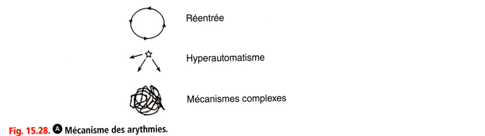

**Fig. 15.28.** Mécanismes des troubles du rythme (réentrée, hyperautomatisme, mécanismes complexes).

faciliter la compréhension des arythmies. En déclinant ces différents mécanismes aux différents étages cardiaques (atrial, jonction, ventriculaire), le lecteur peut retrouver l'ensemble des troubles du rythme. Les troubles du rythme supraventriculaire correspondent à une activation électrique des oreillettes ou de la jonction atrioventriculaire (NAV ou His) à une fréquence trop élevée. Au-delà de la bifurcation hissienne, on parle de troubles du rythme ventriculaire.

> **Pour comprendre.** Fonction de « filtre » du nœud atrioventriculaire (NAV) = « conduction « décrémentielle » Au-delà d'une certaine fréquence dans les oreillettes, les ventricules ne vont plus suivre en 1 pour 1 (un QRS pour une onde de dépolarisation atriale). Cette fonction de filtre du NAV est vitale. En effet, s'il n'y avait pas de filtre, chaque passage en FA entraînerait une fibrillation ventriculaire et tout flutter atrial tournant à 300 bpm dans l'oreillette donnerait une tachycardie à 300 bpm dans le ventricule. Il y aurait beaucoup de morts subites... Selon la fréquence atriale et l'intensité du filtre (qui dépend de l’âge, du tonus vagal, des médicaments ralentisseurs du NAV), le passage peut se faire en 1 pour 1 (1/1), en 2/1, en alternance 1/1-2/1, ou 2/1-3/1 (bloc à conduction variable), etc.
> **Point sémantique.** En français, trouble du rythme est synonyme de « tachycardie » (supraventriculaire ou ventriculaire) et n'est pas employé pour désigner les bradycardies que l'on désigne sous le terme de trouble de la conduction.

Les troubles du rythme supraventriculaire sont à QRS fins (< 120 ms) dans la majorité des cas. Mais en cas de trouble de conduction intraventriculaire (bloc de branche complet par exemple), ils peuvent s'associer à des QRS larges. Les manœuvres vagales sont intéressantes pour élucider ces ECG en créant un bloc atrioventriculaire transitoire (= intensification du filtre atrioventriculaire) (encadré 15.1).

> **Encadré 15.1 — Comment créer un bloc atrioventriculaire transitoire (= intensifier le filtre AV)**
>
> **Manœuvres vagales**
> - Manœuvre de Valsalva (expiration forcée à glotte fermée)
> - Compression carotidienne unilatérale (contre-indiquée en cas d'athérome important ou de souffle carotidien)
> - Boire un grand verre d'eau froide
>
> NB. La manœuvre de compression oculaire bilatérale n'est plus recommandée (risque de décollement de rétine en cas de myopie).
>
> **Adénosine IV** (en cas d'inefficacité des manœuvres vagales)
> - Mécanisme vagomimétique via les récepteurs purinergiques
> - Administration en flash intraveineux
> - Durée d'effet d'une dizaine de secondes
>
> Contre-indications : asthme (bronchospasme intense transitoire possible, même chez un non-asthmatique) ; hypotension artérielle. Comme les manœuvres vagales, l'adénosine sert aussi au diagnostic différentiel des tachycardies.

### 1. Tachycardie sinusale

Une tachycardie sinusale se différencie d'une tachycardie supraventriculaire par plusieurs aspects :

• sur l'ECG, il existe des ondes P sinusales : positives en D1, D2, D3 et aVF ;

• il existe une variabilité de fréquence que l'on peut voir sur la courbe de fréquence d'un scope, d'une télémétrie ou d'un holter ou que l'on peut mettre en évidence par un massage sinocarotidien. Dans une tachycardie sinusale, la fréquence varie progressivement alors que dans une tachycardie supraventriculaire, elle fait des « marches d'escalier » ;

• le contexte : une personne au repos ne doit pas être très tachycarde en l'absence de cause évidente d'augmentation du métabolisme (fièvre, stress, douleur, etc.).

### 2. Fibrillation atriale (fig. 15.29)

Cf. chapitre 13. La fibrillation atriale correspond à une activation atriale « anarchique ». Plusieurs mécanismes électrophysiologiques complexes dans l'oreillette aboutissent à un état fibrillatoire (fig. 15.30).

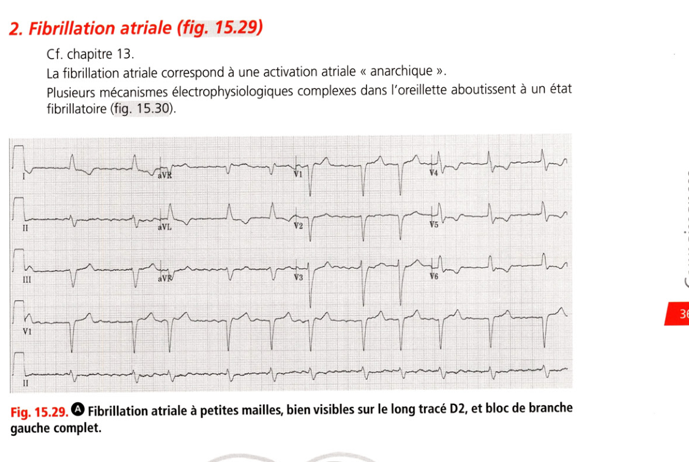

**Fig. 15.29.** Fibrillation atriale à petites mailles, bien visibles sur le long tracé D2, et BBG complet.

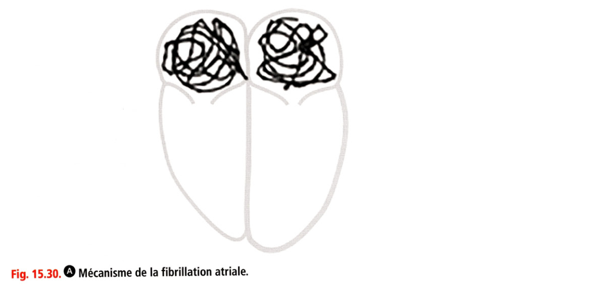

**Fig. 15.30.** Mécanisme de la fibrillation atriale.

Il s'agit d'une forme fréquente de tachycardie entre 100 et 200 bpm à QRS « irrégulièrement irréguliers », c'est-à-dire que les intervalles RR ne sont pas multiples d'une valeur commune FA et conduction atrioventriculaire FA + BAV3 FA conduction lente FA conduction normale RR constant

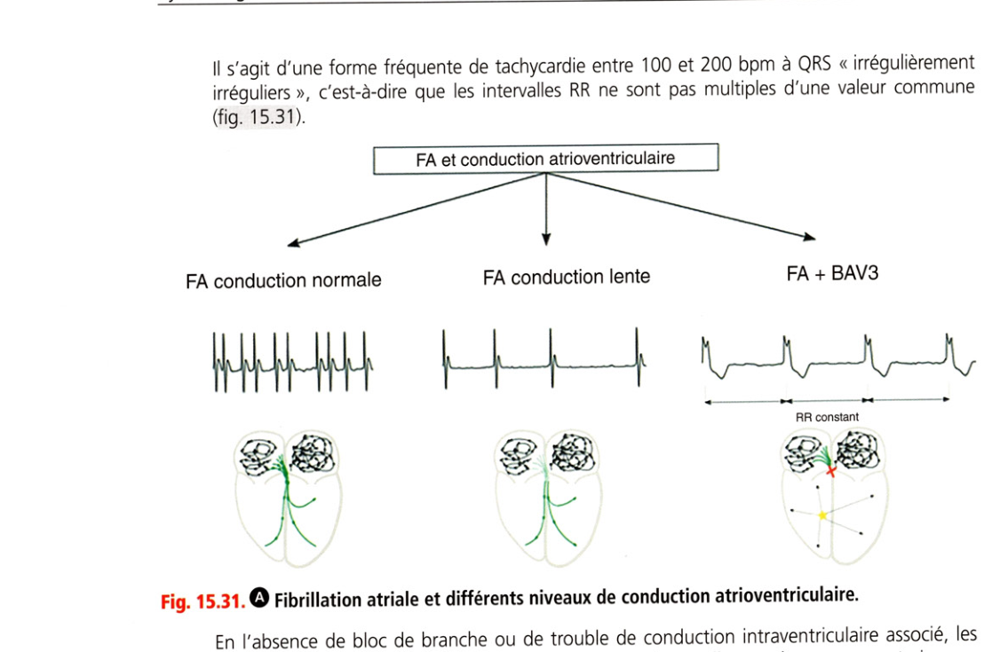

**Fig. 15.31.** Fibrillation atriale et différents niveaux de conduction atrioventriculaire.

En l'absence de bloc de branche ou de trouble de conduction intraventriculaire associé, les QRS sont fins et l'activité sinusale est remplacée par des mailles amples ou, au contraire, par une fine trémulation de la ligne de base (cf. exemples chapitre 13). En cas de difficulté pour analyser l'activité atriale, on peut recourir aux manœuvres vagales.

• **Rang B.** Des aspects plus difficiles peuvent survenir :

• association FA + bloc atrioventriculaire complet : l'évoquer lorsque l'activité ventriculaire devient lente et régulière, puisqu'en cas de BAV complet, la dépolarisation ventriculaire se fait grâce à un rythme d'échappement, qui est de mécanisme automatique et de fréquence régulière (fig. 15.32) ;

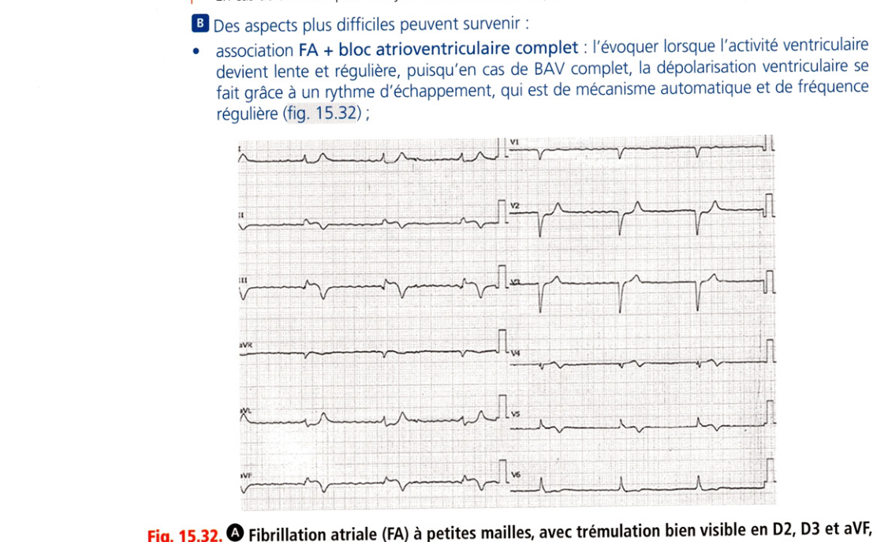

**Fig. 15.32.** Fibrillation atriale à petites mailles, trémulation en D2, D3 et aVF.

avec activité ventriculaire régulière lente : FA associée à un bloc atrioventriculaire de 3e degré.

• alternance de FA avec une dysfonction sinusale (alternance de bradycardie sinusale et de tachycardie par FA ou « syndrome tachycardie-bradycardie »). On parle alors de « maladie de l'oreillette » ou « maladie rythmique atriale ». Des pauses de régularisation peuvent être observées à l'arrêt de la FA, traduisant la reprise lente/retardée du rythme sinusal ;

• association à un bloc de branche (fréquent +++), soit préexistant, soit fonctionnel (apparaissant uniquement en tachycardie), qui donne un aspect de tachycardie irrégulière à QRS larges.

### 3. Flutters atriaux

**Rang A.** Ce sont des troubles du rythme fréquents, correspondant à une boucle d'activation atriale se répétant à l'identique (c'est le modèle des arythmies par « réentrée »), autour d'un ou plusieurs obstade(s) anatomique(s) ou fonctionnel(s). L'activation est « organisée » en circuit (fig. 15.33), par opposition à l'activation d'une oreillette en FA qui est « fibrillatoire » (anarchique). Les flutters droits sont beaucoup plus fréquents que les flutters de l'oreillette gauche, car l'oreillette droite comporte de manière constitutionnelle des zones propices à l'initiation d'un flutter même en l'absence de pathologie cardiaque, alors que les flutters gauches sont le plus souvent induits par une pathologie cardiaque ayant conduit à un remodelage de l'oreillette gauche, ou par une intervention ayant créé des lésions dans l'oreillette gauche. Les facteurs prédisposant aux flutters et à la FA sont communs, et il n'est donc pas rare qu'un patient présente successivement des épisodes de flutter et de FA. À l'ECG, on observe une activité atriale monomorphe (même aspect sur une dérivation donnée) rapide, avec le plus souvent activité à 300 bpm (entre 240 et 340 bpm), sans retour à la ligne isoélectrique dans au moins une dérivation (car l'oreillette a une activité électrique permanente liée à la boucle d'activation). L'enchaînement des ondes atriales (dénommées « F ») donne un aspect sinusoïdal, en toit d'usine ou en dents de scie, parfois uniquement démasqué après manœuvre vagale (fig. 15.34).

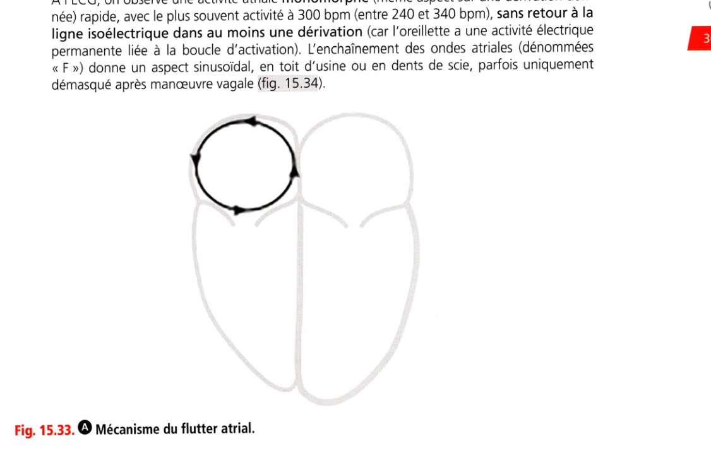

**Fig. 15.33.** Mécanisme du flutter atrial.

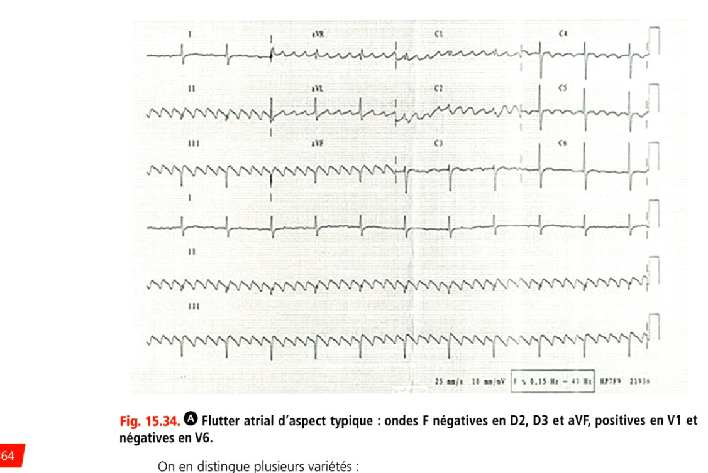

**Fig. 15.34.** Flutter atrial typique : ondes F négatives en D2, D3 et aVF, positives en V1 et négatives en V6.

On en distingue plusieurs variétés :

• le flutter « typique » (ou « commun ») antihoraire, le plus fréquent, est défini par une boucle atriale droite empruntant l'isthme cavotricuspide, région trabéculée située à la partie inférieure de l'oreillette droite, entre la valve tricuspide et la veine cave inférieure. Sur oreillette normale, sa fréquence atriale est de 300 bpm (plus lente en cas de dilatation atriale puisqu'il faut alors plus de temps au front de dépolarisation pour parcourir tout le circuit) et la polarité de la fin de la pente lente des ondes F est négative en D2, D3 et aVF, positive en V1, et négative en V6 (cf. fig. 15.34) ; le flutter typique horaire tourne dans l'autre sens et toutes les polarités sont strictement inversées ;

• les flutters atypiques regroupent tous les flutters pour lesquels l'isthme cavotricuspide ne fait pas partie du circuit. Ils peuvent être atrial droit, atrial gauche ou biatrial. Leur fréquence varie de 120 à 320 bpm en fonction de la longueur du circuit et du ralentissement induit par la fibrose atriale. Les ondes F ont des morphologies diverses.

Remarque La détermination du caractère « typique » ou « atypique » à l'ECG n'est pas parfaitement fiable, raison pour laquelle il est plus juste de parler de flutter d'aspect typique ou d'aspect atypique. Le diagnostic formel est fait soit par argument de fréquence (un flutter d'aspect typique survenant sur cœur sain ayant de fortes chances d'être effectivement typique, alors que la probabilité est moins élevée sur cœur pathologique ou ayant subi une intervention), soit par confirmation lors de l'exploration électrophysiologique qui précède l'ablation du flutter par radiofréquence. L'activité ventriculaire est particulière et doit être bien analysée :

• dans sa forme usuelle, la cadence ventriculaire est à 150 bpm, correspondant à une division par 2 de la fréquence des ondes F (transmission 2/1) mais elle peut également être plus lente : à 100 bpm (correspondant à une transmission 3/1), à 75 bpm, etc. ;

• elle est régulière le plus souvent mais pas toujours (car l'effet de filtrage du nœud peut lui-même être variable) ; en cas d'alternance de conduction 2/1, 3/1, 4/1, etc., on parle de flutter « à conduction variable » ;

• elle peut être ralentie temporairement par une manœuvre vagale qui démasque de ce fait l'activité atriale sous-jacente (manœuvre utile notamment en cas de flutter 1/1 ou 2/1 car les QRS sont très proches et laissent peu de place à la visualisation de l'activité atriale).

### 4. Tachycardies atriales focales (TAF)

**Rang B.** Elles sont moins fréquentes et correspondent à des arythmies atriales focales (hyperautomatisme) (fig. 15.35). À l'ECG, l'activité atriale est monomorphe, et marquée dans toutes les dérivations par un retour à la ligne de base entre les ondes P (puisqu'après la dépolarisation des oreillettes, il existe un temps sans aucune dépolarisation atriale en attendant l'activité automatique suivante). Les ondes P sont le plus souvent différentes de l'onde P sinusale. Cette activité atriale est régulière. Les TAF se présentent sous forme de tachycardie régulière à QRS fins et PR soit long soit normal, par épisodes paroxystiques souvent entrecoupés de retours en rythme sinusal. Elles peuvent aussi prendre l'allure de salves d'extrasystoles atriales monomorphes. Elles sont souvent marquées par une accélération progressive initiale (warm up), puis une décélération également progressive (cool down).

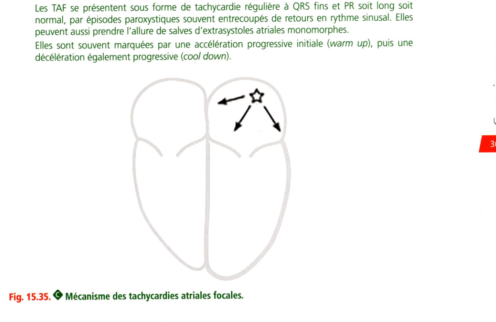

**Fig. 15.35.** Mécanisme des tachycardies atriales focales.

Mécanisme des tachycardies atriales focales.

### 5. Tachycardies jonctionnelles

**Rang A.** Elles sont fréquentes, couramment synonymes en France de la maladie de Bouveret. Il s'agit de tachycardies très régulières, souvent rapides autour de 200 bpm (mais dont la fréquence peut aller de 130 à 260 bpm selon le mécanisme de l'arythmie et le tonus sympathique). Il en existe deux formes (fig. 15.36) :

• les tachycardies par réentrée intranodale : il s'agit d'un mécanisme de réentrée dans le NAV.

À l'ECG, l'activité atriale n'est souvent pas visible ou parfois simplement devinée dans le segment ST, car l'activation atriale et ventriculaire est quasi synchrone (fig. 15.37) ; **Rang A.** Le NAV présente deux voies de conduction (l'une rapide, l'autre lente) pour 20 % de la population (une « dualité nodale »). Cette dualité implique la capacité de descendre par l'une et de remonter par l'autre créant ainsi une réentrée (boucle d'activation). **Rang A.** les tachycardies par rythme réciproque, correspondant à une réentrée par une voie accessoire (faisceau de Kent).

> **Pour comprendre.** La voie accessoire est un faisceau musculaire qui va de l'oreillette au ventricule sur le plan de l'anneau, créant une deuxième voie de conduction potentielle entre oreillette et ventricule. La réentrée (boucle d'activation) se fait alors soit en descendant pas le NAV et en remontant par la voie accessoire (tachycardies orthodromiques, les plus fréquentes, à QRS fins avec activité atriale rétrograde à distance du QRS), soit en descendant par la voie accessoire et en remontant par le NAV (tachycardies antidromiques, beaucoup plus rares, à QRS larges). Réentrée par voie accessoire intranodale NAV/

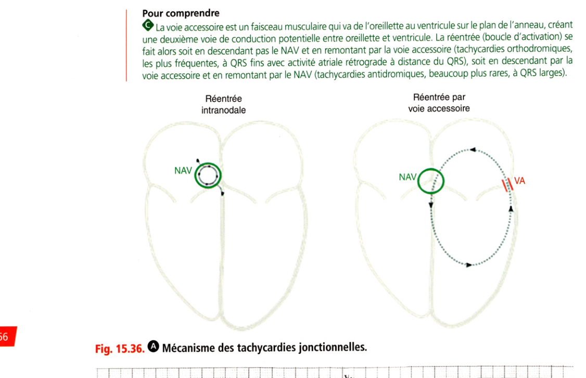

**Fig. 15.36.** Mécanisme des tachycardies jonctionnelles.

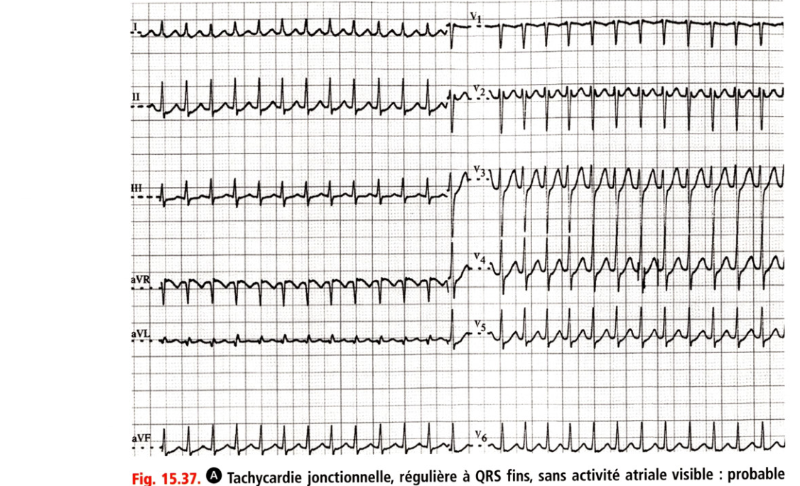

**Fig. 15.37.** Tachycardie jonctionnelle, régulière à QRS fins, sans activité atriale visible.

tachycardie par réentrée intranodale typique. **Rang A.** Les tachycardies jonctionnelles sont réduites (retour en rythme sinusal) par les manoeuvres vagales ou par l'adénosine IV.

### 6. Extrasystoles

Une extrasystole est la survenue d'une activation prématurée (trop précoce) par rapport à l'activation attendue d'une cavité cardiaque. Les extrasystoles sont fréquentes et observées de façon physiologique sur cœur sain. Leur « charge » (nombre d'extrasystoles/24 heures) augmente avec l'âge et la présence d'une cardiopathie. Des extrasystoles fréquentes ou polymorphes doivent faire rechercher une cardiopathie. Les extrasystoles peuvent être (fig. 15.38) :

• atriales : on voit alors une onde P trop précoce, puis un QRS fin. Cette onde P résultant d'une activation de l'oreillette à partir d'un point ectopique est de morphologie différente de l'onde P sinusale. L'onde P peut être masquée par l'onde T précédente (fig. 15.39) ;

• jonctionnelles : QRS fin avec ± onde P' rétrograde (l'influx commence au niveau de la jonction et part dans les deux sens en même temps vers l'oreillette et le ventricule). Elles sont rares et traduisent le plus souvent une pathologie de la jonction nodohissienne ;

• ventriculaires : QRS large ± onde P' rétrograde (il s'agit alors d'un trouble du rythme ventriculaire).

Extrasystoles Extrasystole atriale Extrasystole jonctionnelle Extrasystole ventriculaire

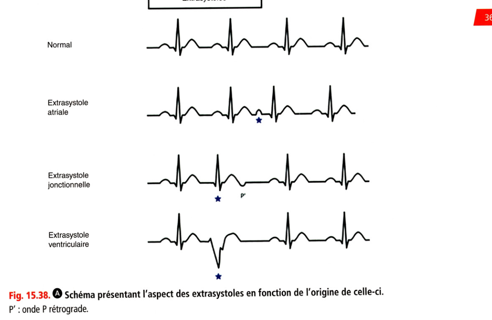

**Fig. 15.38.** Schéma présentant l'aspect des extrasystoles en fonction de l'origine.

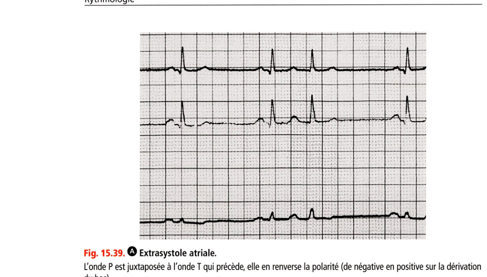

**Fig. 15.39.** Extrasystole atriale.

L'onde P est juxtaposée à l'onde T qui précède, elle en renverse la polarité (de négative en positive sur la dérivation Les extrasystoles peuvent être :

• répétitives : doublets, triplets ou salves ;

• rythmées :

• un battement sur deux : bigéminisme,

• un battement sur trois : trigéminisme, etc.