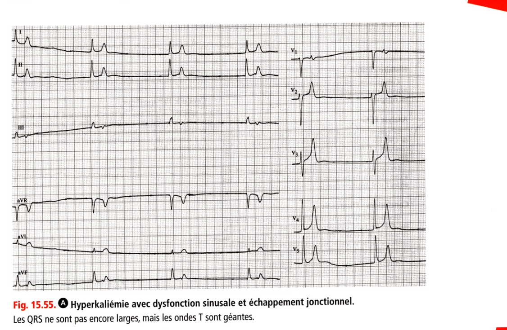
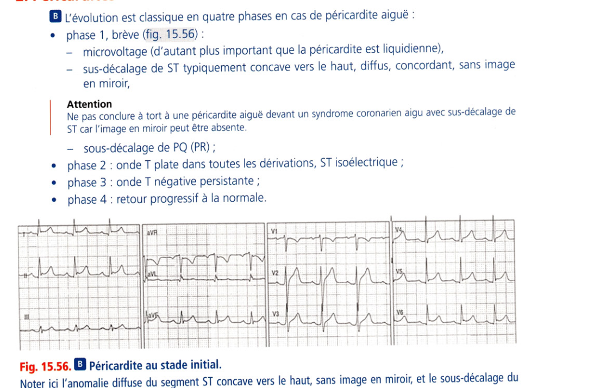
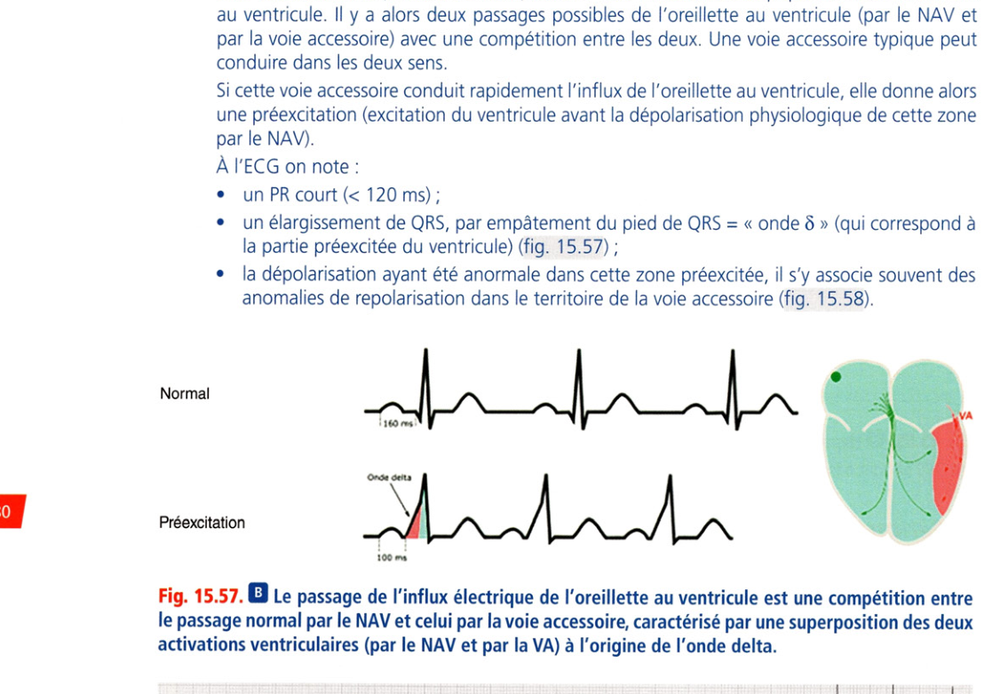
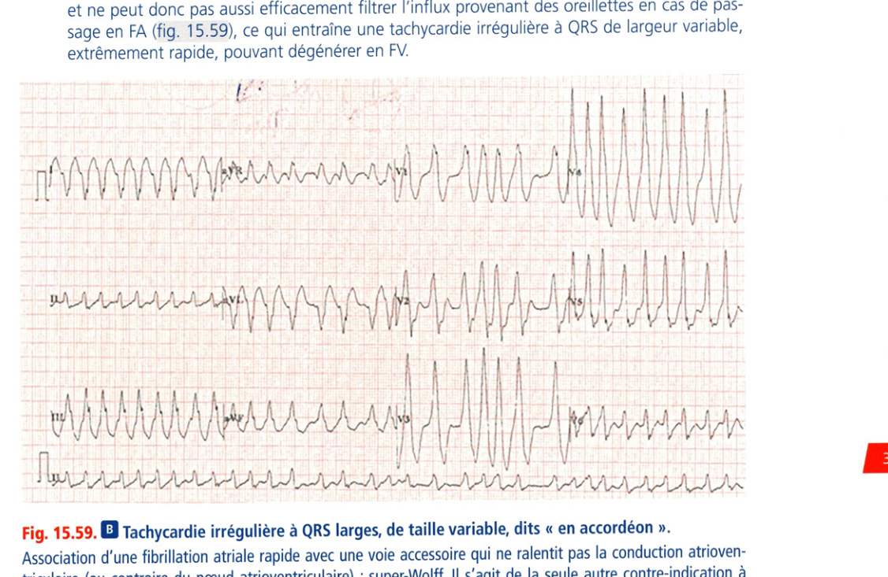
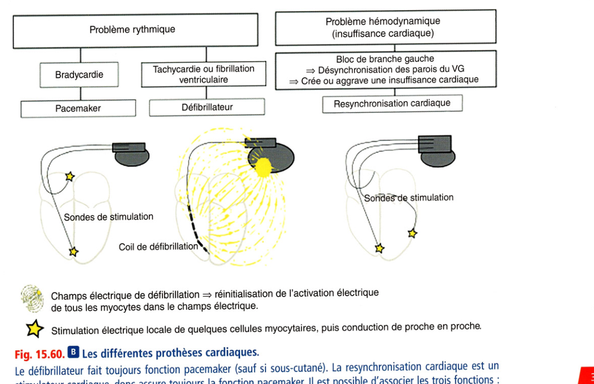
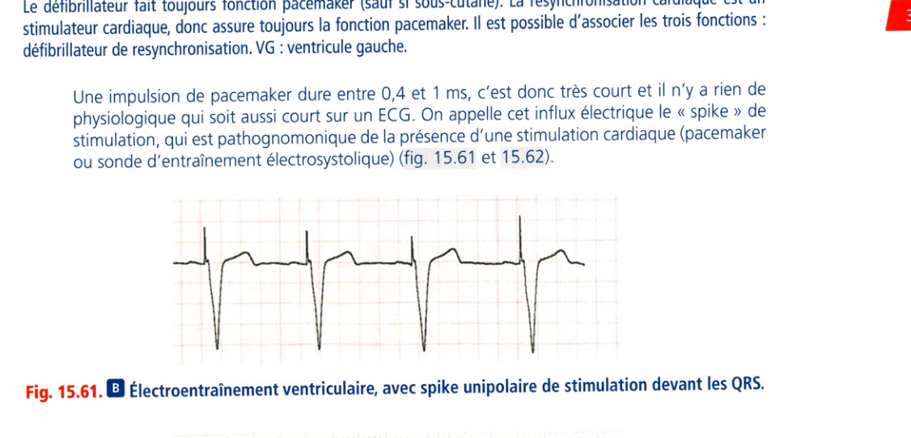
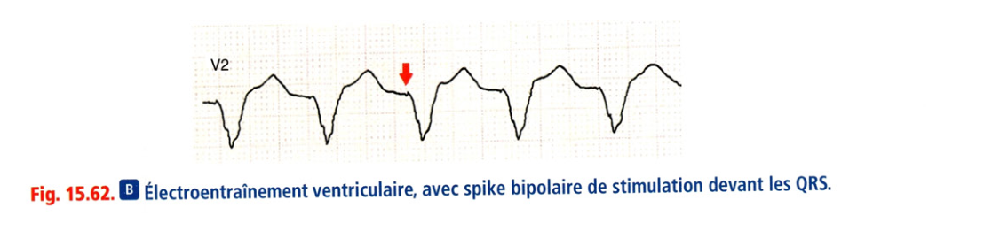

# I.F — Autres pathologies

> Retour à l'index : [Item 231 — Électrocardiogramme](./231_ECG.md)  
> Collège CNEC / SFC · 3e éd. · p. 337–387 · Partie III — Rythmologie

**Rang A** · **Rang B.**

---

### 1. Dyskaliémies

• **Rang A.** L'hypokaliémie est caractérisée par :

- une onde T plate ou négative, diffuse avec ST sous-décalé ;

- un QRS normal ;

- un allongement de QT, l'apparition d'une onde U (onde supplémentaire derrière T, qui ne doit pas être intégrée dans la mesure du QT) ;

- une extrasystole ou une tachycardie ventriculaire, une torsade de pointes, une fibrillation ventriculaire.

• L'hyperkaliémie est caractérisée par (fig. 15.55) :

- une onde T ample, pointue et symétrique ;

- un allongement de PR ;

- un élargissement de QRS ;

- un BAV, une tachycardie ventriculaire, une dysfonction sinusale.

**Fig. 15.55.** Hyperkaliémie avec dysfonction sinusale et échappement jonctionnel.

Les QRS ne sont pas encore larges, mais les ondes T sont géantes. **Rang A.** L'évolution est classique en quatre phases en cas de péricardite aiguë :

• phase 1, brève (fig. 15.56) :

- microvoltage (d'autant plus important que la péricardite est liquidienne),

- sus-décalage de ST typiquement concave vers le haut, diffus, concordant, sans image en miroir,

> **Attention.** Ne pas conclure à tort à une péricardite aiguë devant un syndrome coronarien aigu avec sus-décalage de ST car l'image en miroir peut être absente.

- sous-décalage de PQ (PR) ;

• phase 2 : onde T plate dans toutes les dérivations, ST isoélectrique ;

• phase 3 : onde T négative persistante ;

• phase 4 : retour progressif à la normale.

**Fig. 15.56.** Péricardite au stade initial.

Noter ici l'anomalie diffuse du segment ST concave vers le haut, sans image en miroir, et le sous-décalage du segment PQ, bien visible en V5, V6 et en inférieur. Il n'y a de manière physiologique qu'un seul passage entre l'oreillette et le ventricule : le NAV ; le reste du plan de l'anneau isole totalement l'oreillette du ventricule. Une voie accessoire (faisceau de Kent) est une fibre musculaire ectopique connectant l'atrium au ventricule. Il y a alors deux passages possibles de l'oreillette au ventricule (par le NAV et par la voie accessoire) avec une compétition entre les deux. Une voie accessoire typique peut conduire dans les deux sens. Si cette voie accessoire conduit rapidement l'influx de l'oreillette au ventricule, elle donne alors une préexcitation (excitation du ventricule avant la dépolarisation physiologique de cette zone par le NAV). À l'ECG on note :

• un PR court (< 120 ms) ;

• un élargissement de QRS, par empâtement du pied de QRS = « onde δ » (qui correspond à la partie préexcitée du ventricule) (fig. 15.57) ;

• la dépolarisation ayant été anormale dans cette zone préexcitée, il s'y associe souvent des anomalies de repolarisation dans le territoire de la voie accessoire (fig. 15.58).

Normal

**Fig. 15.57.** Préexcitation : compétition NAV / voie accessoire, origine de l'onde delta.

le passage normal par le NAV et celui par la voie accessoire, caractérisé par une superposition des deux activations ventriculaires (par le NAV et par la VA) à l'origine de l'onde delta. Le blocage du NAV (par le massage ou l'adénosine) force donc l'influx à ne passer que par la voie accessoire : utile pour la démasquer si la préexcitation est minime. Attention, il ne faut pas le faire en cas de FA. On parle de syndrome de Wolff-Parkinson-White lorsque cette voie accessoire antérograde occasionne des palpitations par un mécanisme de tachycardie jonctionnelle (cf. supra). Il existe un risque de mort subite si la perméabilité de la voie accessoire est bonne (période réfractaire courte) car celle-ci ne possède pas de propriété « décrémentielle » comme le NAV, et ne peut donc pas aussi efficacement filtrer l'influx provenant des oreillettes en cas de passage en FA (fig. 15.59), ce qui entraîne une tachycardie irrégulière à QRS de largeur variable, extrêmement rapide, pouvant dégénérer en FV

**Fig. 15.59.** Tachycardie irrégulière à QRS larges de taille variable, dits « en accordéon » (super-Wolff).

Association d'une fibrillation atriale rapide avec une voie accessoire qui ne ralentit pas la conduction atrioventriculaire (au contraire du nœud atrioventriculaire) : super-Wolff. Il s'agit de la seule autre contre-indication à l'adénosine (avec l'asthme).

### 4. Maladie coronarienne

**Rang A.** Cf. chapitre 5. Analyse de la repolarisation Sur un ECG normal, la polarisation des ondes T suit globalement celle des QRS, les ondes T sont positives partout sauf en aVR et parfois en VI, aVL ou D3 selon l'orientation anatomique du cœur. Il faut retenir que deux ondes T négatives dans le même territoire signent une pathologie (ex : onde T négatives en D2 et D3 = deux ondes T négatives dans le territoire inférieur = pathologique). Syndromes avec sus-décalage de ST

• Il faut traquer le sus-décalage qui indique le territoire dont la coronaire est occluse, puis chercher le miroir sous la forme d'un sous-décalage et non l'inverse.

• Attention en cas de sous-décalage en antérieur (V1-V3), il peut s'agir du miroir d'un susdécalage ST en postérieur (V7-V9), ce qui justifie de réaliser un ECG 18 dérivations devant toute douleur thoracique.

• Pour considérer qu'un sus-décalage du segment ST est significatif, on exige au moins 2 mm de V1 à V3 et 1 mm dans les autres dérivations.

• Ce sus-décalage du ST doit être retrouvé sur au moins 2 dérivations adjacentes.

• Si le sus-décalage de ST englobe l'onde T, il s'agit de l'onde de Pardee.

• La constatation d'un bloc de branche gauche complet en contexte de douleur thoracique aiguë doit faire éliminer un SCA avec sus-décalage du ST (échographie ± coronarographie).

• Le sus-décalage régresse rapidement avec la reperfusion et dure plusieurs jours en l'absence de reperfusion ; il peut persister indéfiniment en cas d'évolution anévrismale de la paroi infarcie.

• L'évolution normale après 48 heures se fait vers une onde T négative dite « ischémique », parfois pendant très longtemps.

- U SCA avec sus-décalage du segment ST (sus-décalage typé onde de Pardee avec un miroir)

- Anévrisme ventriculaire (le sus-décalage persiste après le SCA lorsque la séquelle d'infarctus est marquée et entraîne un anévrisme ventriculaire)

- Repolarisation précoce (sus-décalage dans les dérivations inférolatérales)

- Angor de Prinzmetal (spasme coronarien, semblable au sus-décalage du SCA ST+ segment ST)

- Péricardite (sus-décalage diffus concave vers le haut, sans miroir)

Diagnostics différentiels

- BBG ou stimulation du ventricule par un f est sus-décalé de manière appropriéÇN

- HVG marquée : on peut retrouver un sous-décalage dan écalage du dérivations où le QRS est négatif, le segment ST et un sus-décalage en V1-V2. iaker : dans I érivatiorçsj

Ondes Q de nécrose

• Elles apparaissent en principe vers la 6e heure, mais peuvent être parfois précoces au cours du SCA ST+ sus-décalé.

• Elles ne doivent pas faire considérer à tort qu'une reperfusion serait inutile car trop tardive.

'• Elles font au moins 1/3 (ou 1/4) du QRS en amplitude et > 30-40 ms de durée.

• Elles peuvent être remplacées par un écrêtement ou rabotage de l'onde R, surtout décrit en V2-V3.

Syndromes coronariens aigus sans sus-décalage de ST On peut observer :

• un sous-décalage de ST (courant de lésion sous-endocardique) ;

• une inversion des ondes T (ischémie sous-épicardique) ;

• une pseudo-normalisation d'ondes T antérieurement négatives ;

• un aplatissement des ondes T ;

• un ECG normal !

Les anomalies peuvent être masquées par un pacemaker.

### 5. ECG et stimulateur cardiaque

**Rang A.** Les indications de pacemaker sont (fig. 15.60) :

• les bradycardies symptomatiques pour la dysfonction sinusale, le BAV2 Mobitz 1 et la bradycardie sinusale ;

• les BAV infrahissien (BAV2 Mobitz 2 et BAV3), même en l'absence de symptôme.

Tachycardie ou fibrillation ventriculaire Bloc de branche gauche => Crée ou aggrave une insuffisance cardiaque Champs électrique de défibrillation => réinitialisation de l’activation électrique de tous les myocytes dans le champs électrique. Stimulation électrique locale de quelques cellules myocytaires, puis conduction de proche en proche.

**Fig. 15.60.** Les différentes prothèses cardiaques.

Le défibrillateur fait toujours fonction pacemaker (sauf si sous-cutané). La resynchronisation cardiaque est un stimulateur cardiaque, donc assure toujours la fonction pacemaker. Il est possible d'associer les trois fonctions : défibrillateur de resynchronisation. VG : ventricule gauche. Une impulsion de pacemaker dure entre 0,4 et 1 ms, c'est donc très court et il n'y a rien de physiologique qui soit aussi court sur un ECG. On appelle cet influx électrique le « spike » de stimulation, qui est pathognomonique de la présence d'une stimulation cardiaque (pacemaker ou sonde d'entraînement électrosystolique) (fig. 15.61 et 15.62).

**Fig. 15.61.** Électroentraînement ventriculaire, spike unipolaire devant les QRS.

**Fig. 15.62.** Électroentraînement ventriculaire, spike bipolaire devant les QRS.

En cas de dysfonction sinusale, le pacemaker stimule l'oreillette (il y a une onde P après le spike En cas de BAV, le pacemaker écoute l'oreillette et stimule le ventricule avec un délai AV programmé, pour synchroniser l'oreillette et le ventricule (il y a un QRS large après le spike de stimulation avec un aspect de BBG car la stimulation ventriculaire droite est transmise au reste des ventricules par une conduction de proche en proche, lente, contrairement à la conduction empruntant le réseau de His-Purkinje). La stimulation se fait entre deux pôles (- et +) qui peuvent être le bout de la sonde et le boitier (unipolaire : bien visible sur l'ECG de surface) ou entre le bout de la sonde et une autre électrode juste avant le bout de la sonde (bipolaire : peu visible sur l'ECG de surface).

> **Item 17.Télémédecine, télésanté et téléservices en santé.** Le télésuivi des prothèses cardiaques (holter sous-cutané, pacemaker, défibrillateur) devient progressivement un standard. Il consiste en un dispositif à brancher à côté du lit et qui communique avec la prothèse du patient toutes les nuits. En cas d'anomalie du dispositif ou d'anomalie rythmique, une alerte est envoyée sur une plateforme et relayée au médecin. Le télésuivi améliore le suivi du patient en raccourcissant la durée de prise en charge, en évitant des hospitalisations et des décès.