# I.B — Troubles de conduction

> Retour à l'index : [Item 231 — Électrocardiogramme](./231_ECG.md)  
> Collège CNEC / SFC · 3e éd. · p. 337–387 · Partie III — Rythmologie

**Rang A** · **Rang B.**

---

Cf. chapitre 14.

### 1. Blocs de branche

Les blocs de branches correspondent à une interruption ou à un ralentissement marqué de la conduction dans l'une ou l'autre des deux branches (droite ou gauche).

> **Attention.** Avant de décrire un trouble de conduction, toujours commencer par décrire le rythme atrial pour ne pas passer à côté d'une tachycardie supraventriculaire (car l'association d'une tachycardie supraventriculaire et d'un bloc de branche n'est pas rare !)

Le bloc complet de branche droite a les caractéristiques suivantes (fig. 15.10 et 15.11) :

• durée de QRS > 120 ms ;

• en V1 : QRS globalement positif avec aspect rSR' ;

• en V6 : aspect qRs avec onde S traînante et le plus souvent arrondie.

**Rang A.** Nœud sinusal d Nœud •— .iatrioventriculaire

• d Nœud ç Branche gauche

Branche droite / Orientation de l’influx électrique => le QRS est positif si l’influx se dirige vers l’électrode

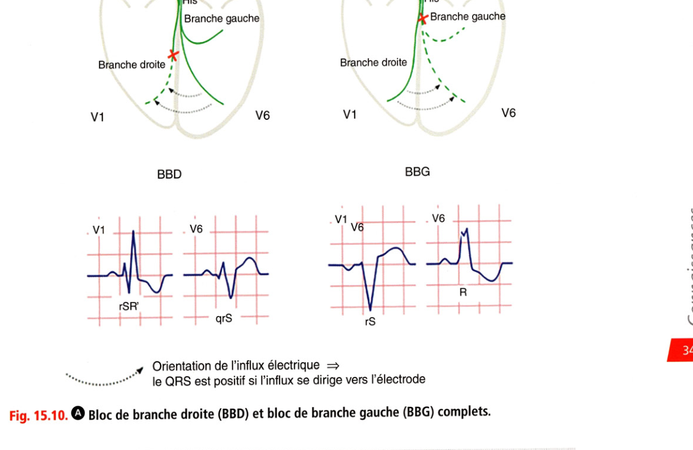

**Fig. 15.10.** Bloc de branche droite (BBD) et bloc de branche gauche (BBG) complets.

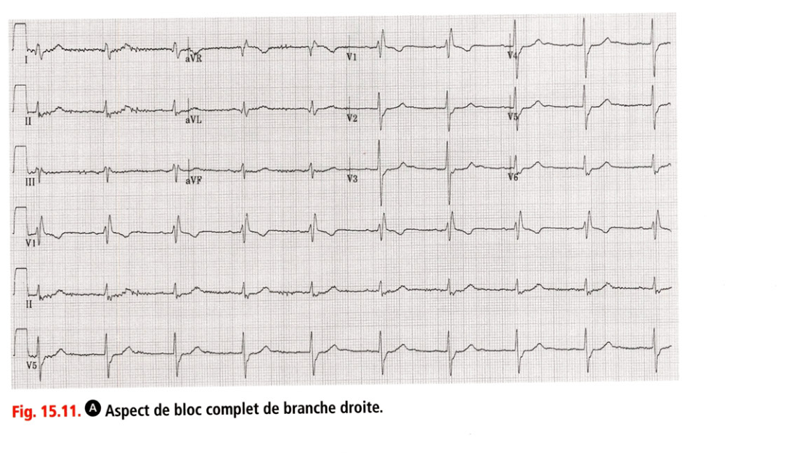

**Fig. 15.11.** ECG de bloc de branche droit complet.

Le bloc complet de branche gauche a les caractéristiques suivantes (fig. 15.10, fig. 15.12) :

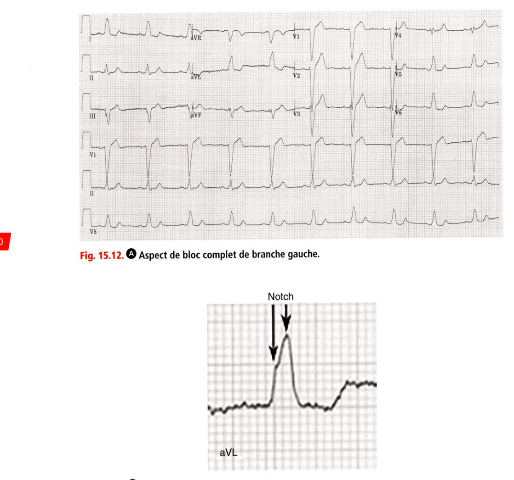

**Fig. 15.12.** ECG de bloc de branche gauche complet.

• durée de QRS > 120 ms ;

• en V1 : QRS globalement négatif, aspect rS ou QS ;

• en V6, DI et aVL : notch (double pic qui correspond pour le 1er à l'activation du septum et le 2e à l'activation de la paroi latérale tardive) avec le plus souvent onde R exclusive

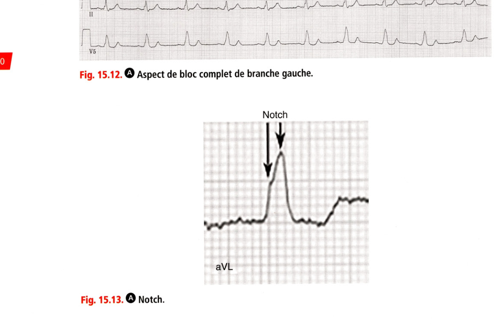

**Fig. 15.13.** Notch.

> **Conseils d'interprétation.** Vérifier dans l'ordre les points suivants :

• rythme sinusal ;

• durée de QRS > 120 ms ;

• aspect en V1 :

- si en V1 le QRS est globalement positif, c'est probablement un bloc de branche droit,

- si le QRS est globalement négatif, c’est probablement un bloc de branche gauche ;

• aspect inverse en V6.

> **Attention.** Lorsque les QRS sont larges, il existe un trouble de la dépolarisation ventriculaire qui induit un trouble de la repolarisation ventriculaire —> la polarité des ondes T et des QRS n'est plus concordante ; on parle de « discordance appropriée ».

• Si le QRS est négatif, l’onde T est positive avec souvent un petit sus-décalage du segment ST.

• Si le QRS est positif, l'onde T est négative avec un petit sous-décalage du segment ST (cf. fig. 15.12).

Cette discordance appropriée (fig. 15.14), associée à un segment ST souvent ascendant en V1-V2 dans le BBC, peut faire évoquer à tort le diagnostic de syndrome coronarien aigu avec sus-décalage du segment ST. En présence d'un BBG, l'interprétation de la repolarisation dans le territoire antérieur est donc difficile et la présentation clinique a une importance cruciale. Par conséquent, devant une douleur thoracique persistante avec un bloc de branche gauche, le diagnostic d’infarctus antérieur doit être évoqué et conduire à une évaluation rapide par un cardiologue afin de rechercher des arguments complémentaires en faveur d’un syndrome coronarien aigu sans attendre le dosage de troponine (analyse sémiologique de la douleur dont l'effet de la TNT, et recherche de signes de choc, ETT).

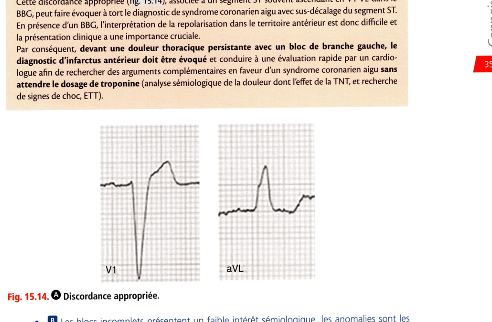

**Fig. 15.14.** Discordance appropriée.

• **Rang A.** Les blocs incomplets présentent un faible intérêt sémiologique, les anomalies sont les mêmes avec durée de QRS entre 110 et 120 ms.

• Un bloc de branche (ou tout autre bloc de conduction) peut être fonctionnel, c'est-à-dire exister uniquement à partir d'une fréquence cardiaque donnée : apparition d'un BBG ou BBD lors d'une tachycardie

(bloc en phase III) El ou d'une bradycardie 0 (bloc en phase IV).

### 2. Blocs fasciculaires (ou hémiblocs) (fig. 15.15)

**Rang A.** Ils sont caractérisés par :

• un élargissement très modéré du QRS (> 110 ms), pouvant dépasser 120 ms en cas d'association avec un autre bloc de branche ou en cas de cardiopathie marquée ;

• une déviation axiale.

- Hémibloc antérieur gauche (HBAG) : déviation axiale du QRS à gauche au-delà de -30°

(négativité de D2) (fig. 15.16).

- Hémibloc postérieur gauche (HBPG) : déviation axiale du QRS à droite > +90° (négativité en DI -» aspect S1Q3) en l'absence de pathologie du ventricule droit, d'une morphologie longiligne ou d'un infarctus latéral.

• Nœud sinusal

•Nœud sinusal Al Nœud A latrioventriculaire j|His / Branche gauche HBAG (fréquent) HBPG (rare) DU etaVF DU etaVF Orientation de l’influx électrique => le QRS est positif si l’influx se dirige vers l’électrode

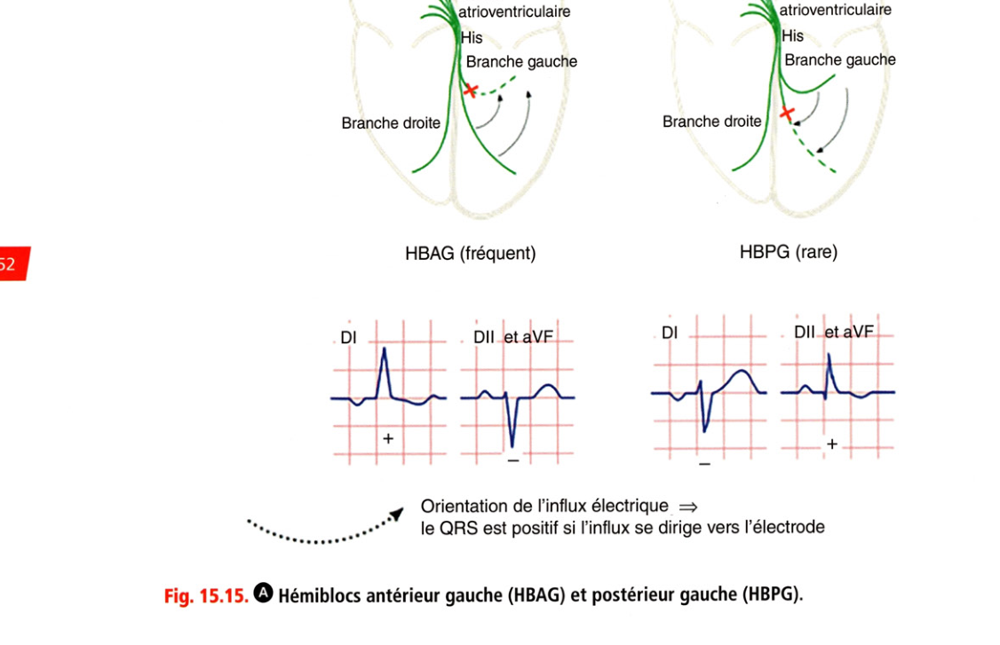

**Fig. 15.15.** Hémiblocs antérieur gauche (HBAG) et postérieur gauche (HBPG).

l#VF

> **Attention.** L'HBAC est fréquent car la branche est fragile (superficielle et de petite taille), tandis que l’HBPC est rare car la branche est profonde. Le premier diagnostic lorsque DI est négatif n’est pas un HBPG mais une inversion de positionnement des électrodes frontales (dans ce cas, l’onde P est également négative en DI).

### 3. Blocs bifasciculaires

La sémiologie s'additionne : HBAG + BBD (fig. 15.17) ou HBPG + BBD, les QRS sont alors supérieurs à 120 ms.

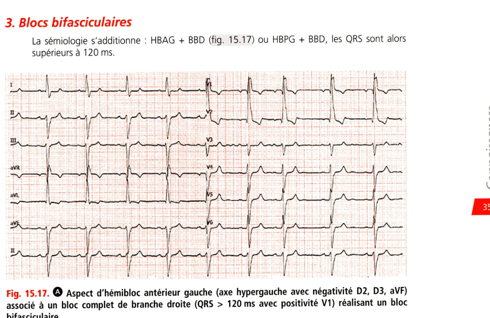

**Fig. 15.17.** Aspect d'hémibloc antérieur gauche (axe hypergauche avec négativité D2, D3, aVF).

associé à un bloc complet de branche droite (QRS > 120 ms avec positivité V1) réalisant un bloc Pour comprendre : à quoi sert le diagnostic des blocs de branche ? 13 Risque de BAV Un hémibloc isolé ou un bloc incomplet ont comme intérêt de montrer une atteinte débutante des voies de conduction ; cependant, le restant du réseau de conduction semblant fonctionnel, la probabilité de bloc atrioventriculaire infrahissien est faible. Un bloc bifasciculaire (BBG complet ou BBD + hémibloc) attire l'attention sur le risque que la troisième branche dysfonctionne de manière intermittente, et suggère donc un risque de BAV complet infrahissien plus important (pouvant induire syncopes, voire mort subite). Donc syncope + bloc bifasciculaire = hospitalisation en cardiologie avec télémétrie ! Risque de désynchronisation Par ailleurs, il a été démontré qu'un BBG complet pouvait parfois contribuer au développement ou à l'aggravation d'une cardiopathie en raison de la désynchronisation de la contraction des parois ventriculaires (liée à l'activation tardive de la paroi latérale), altérant l'efficacité hémodynamique de la contraction ventriculaire gauche. La correction de ce BBG peut permettre d'améliorer, voire de guérir ce type de cardiopathie, et est donc indiquée en cas d’apparition de signes d'insuffisance cardiaque.

> **Attention.** V Le terme de bloc trifasciculaire est souvent utilisé par excès en présence d’un bloc bifasciculaire associé à un BAV1. Or dans ce cas précis, on ne sait pas vraiment si le BAV1 provient de la conduction du NAV (il s'agit alors d'un bloc bifasciculaire avec BAV1 nodal) ou d'un ralentissement dans la dernière branche (ce qui correspond alors à un vrai bloc trifasciculaire à très haut risque dévolution vers le BAV complet infrahissien) (fig. 15.18). Un bloc trifasciculaire complet est un synonyme de BAV complet infrahissien. En l’absence de BAV, le bloc trifasciculaire est donc forcément

• soit incomplet (passage ralenti dans la troisième branche qui donne alors un aspect de BAV1) ;

• soit alternant :

- alternance de bloc de branche droit et de bloc de branche gauche (fig. 15.19),

- alternance d'hémibloc antérieur et postérieur gauche sur fond de bloc de branche droit.

Ce sont des formes graves qui annoncent le BAV infrahissien complet. Aspect ECG de bloc bifasciculaire + BAV1 Le passage lent de l’oreillette au ventricule peut se situer à deux niveaux :

- au niveau du nœud atrioventriculaire

- au niveau de la troisième branche

Vrai bloc trifasciculaire Bloc bifasciculaire + bloc nodal

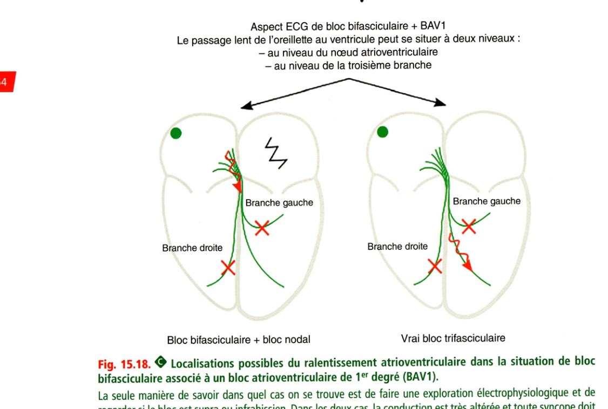

**Fig. 15.18.** Localisations possibles du ralentissement atrioventriculaire (bloc bifasciculaire + BAV1).

Localisations possibles du ralentissement atrioventriculaire dans la situation de bloc bifasciculaire associé à un bloc atrioventriculaire de 1er degré (BAV1). La seule manière de savoir dans quel cas on se trouve est de faire une exploration électrophysiologique et de regarder si le bloc est supra ou infrahissien. Dans les deux cas, la conduction est très altérée et toute syncope doit faire réévaluer l'indication d'implantation d'un pacemaker. Pour le bloc trifasciculaire vrai (infrahissien), il existe une indication de pacemaker même sans symptôme. OilK 'sii iBmHi «mSSBBBIWSîW MBgjaiK»si-.:iBa!Mjih';Wg8iiia!i!i!HgÿïâiBiaaaS!i lissisi üSSlHI iîffi ■8li iiffiHBEs IWiæiHsüffliW.Ef.ySBiHK lllfê! ISSijOISIlH'ir U9KKT ■IIS •lil h'IK siltl ■Bih"

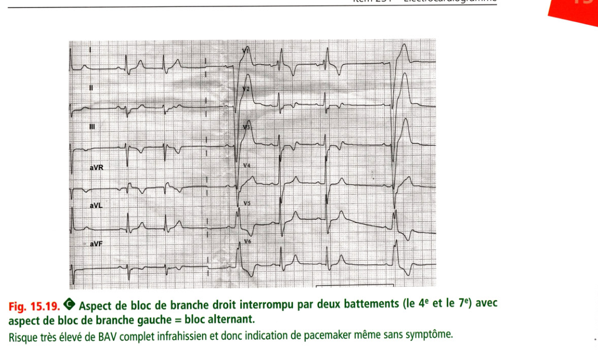

**Fig. 15.19.** Bloc de branche droit interrompu par deux battements à aspect de BBG = bloc alternant.

Aspect de bloc de branche droit interrompu par deux battements (le 4e et le 7e) avec aspect de bloc de branche gauche = bloc alternant. Risque très élevé de BAV complet infrahissien et donc indication de pacemaker même sans symptôme.

### 4. Blocs atrioventriculaires

**Rang A.** La sémiologie est détaillée au chapitre 14. Ils sont illustrés dans les figures 15.20 à 15.23. Normal BAV2 Mobitz 1 (Wenckebach) BAV2 Mobitz 2 Allongement progressif du PR puis onde P bloquée Une onde P bloquée sur 2 PR constant puis une onde P bloquée inopinée Dissociation atrioventriculaire complète Onde P bloquée

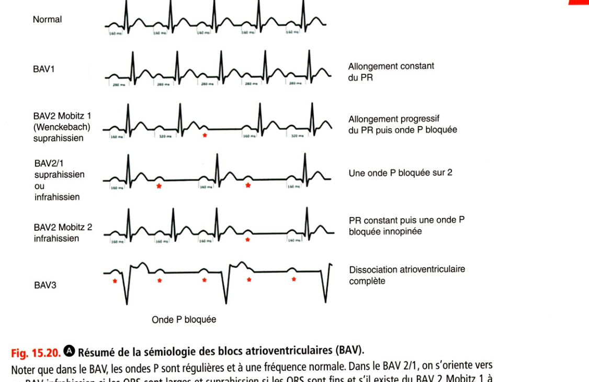

**Fig. 15.20.** Résumé de la sémiologie des blocs atrioventriculaires (BAV).

Noter que dans le BAV, les ondes P sont régulières et à une fréquence normale. Dans le BAV 2/1, on s'oriente vers un BAV infrahissien si les QRS sont larges et suprahissien si les QRS sont fins et s'il existe du BAV 2 Mobitz 1 à

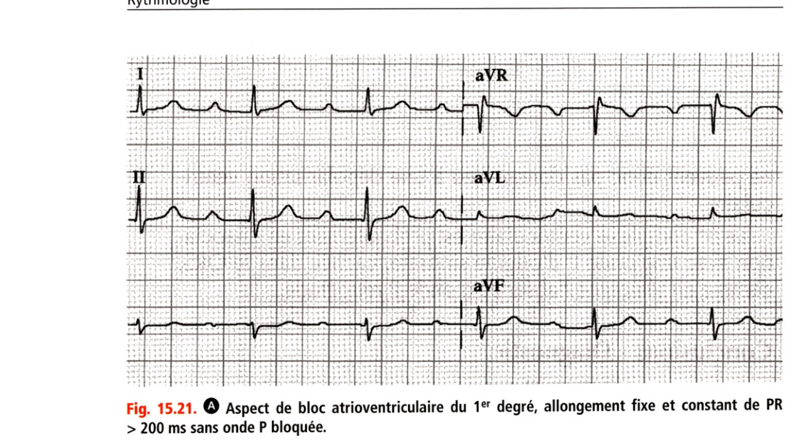

**Fig. 15.21.** Aspect de bloc atrioventriculaire du 1er degré, allongement fixe et constant de PR.

> 200 ms sans onde P bloquée.

• cxxic P ctxxXXc

• «Me P btoQuto

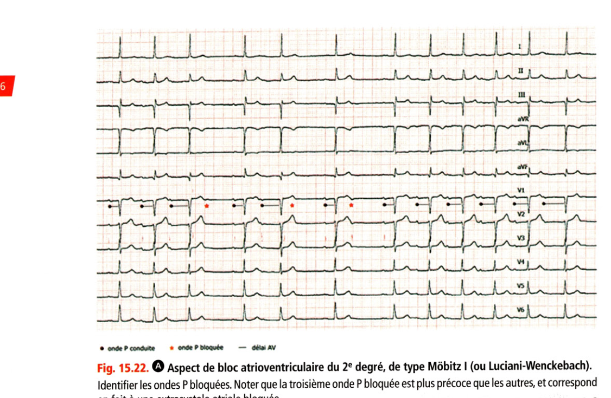

**Fig. 15.22.** Aspect de bloc atrioventriculaire du 2e degré, de type Mobitz I (Luciani-Wenckebach).

Identifier les ondes P bloquées. Noter que la troisième onde P bloquée est plus précoce que les autres, et correspond en fait à une extrasystole atriale bloquée. jg i [m» «îS m« xn» xiinm:: ÏUHinwmtittHittiHra

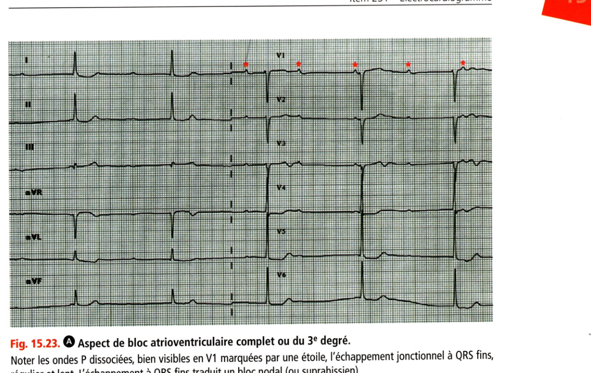

**Fig. 15.23.** Aspect de bloc atrioventriculaire complet ou du 3e degré.

Noter les ondes P dissociées, bien visibles en V1 marquées par une étoile, l'échappement jonctionnel à QRS fins, régulier et lent. L’échappement à QRS fins traduit un bloc nodal (ou suprahissien).

### 5. Dysfonction sinusale

Cf. chapitre 14. L'analyse du tracé est simple dans les cas suivants :

• asystole (tracé plat sans aucune activité cardiaque visible) ;

• pauses par manque intermittent d'une onde P traduisant un bloc sinoatrial intermittent du 2e degré (fig. 15.24). j i .MJjnTul

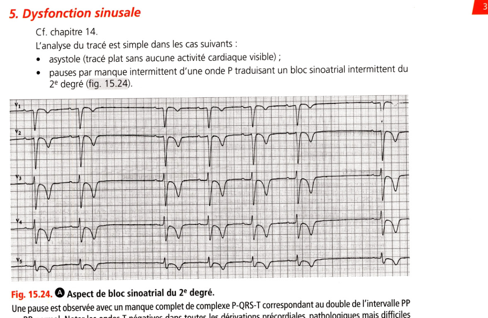

**Fig. 15.24.** Aspect de bloc sinoatrial du 2e degré.

Une pause est observée avec un manque complet de complexe P-QRS-T correspondant au double de l'intervalle PP ou RR normal. Noter les ondes T négatives dans toutes les dérivations précordiales, pathologiques mais difficiles à interpréter sans contexte clinique. La première étiologique à éliminer est l'ischémie myocardique. En cas de dysfonction sinusale marquée, un rythme d'échappement jonctionnel apparaît, et l'onde P n'est plus visible devant le QRS mais peut être rétrograde (derrière le QRS à la suite de l'activation du nœud atrioventriculaire dans le sens ventriculoatrial, et négative en D2 car l'activation de l'oreillette se fait de bas en haut à partir de la jonction) (fig. 15.25 et 15.26). sï«!=-2îjîaa UHMmiHHmBmMBnMmæBB ™gÈsl|Si’iig|iSiiiBfflSsii!iiiffliBit il |g|| «iBgi!»Sæ!BæBlggggsg!«igBBBB8SS WgRBfflHiiHHffliMMBffi IHilHHi IfêrfMtM 3RHVHMB«n!E»>8BSS»H« iiiæîH BïMmmnMHS

!üïït--:iü;-s::£!:::: HHgiggipigBiHii îiiîiiHgHzgzEE

Siîi

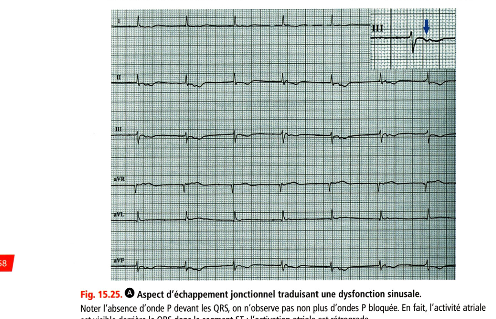

**Fig. 15.25.** Aspect d'échappement jonctionnel traduisant une dysfonction sinusale.

Noter l'absence d'onde P devant les QRS, on n'observe pas non plus d'ondes P bloquée. En fait, l'activité atriale est visible derrière le QRS dans le segment ST : l'activation atriale est rétrograde. Dysfonction sinusale ou bloc sinoatrial Ondes P trop lentes Onde P manquante Pause sinusale Onde P inexistante => P’ rétrograde

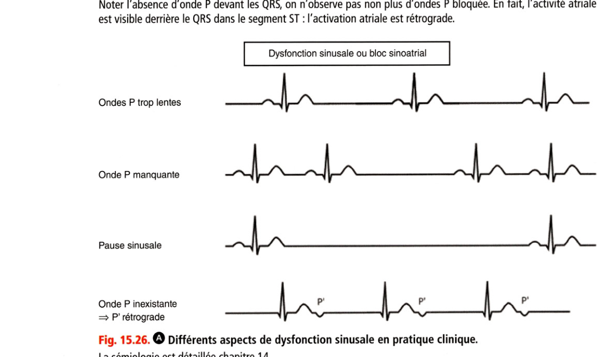

**Fig. 15.26.** Différents aspects de dysfonction sinusale en pratique clinique.

La sémiologie est détaillée chapitre 14.

> **Conseil d'interprétation en cas de bradycardie.** Seules deux structures peuvent entraîner une bradycardie lorsqu'elles dysfonctionnent : le nœud sinusal (dysfonction sinusale) ou le nœud atrioventriculaire (BAV2 ou 3) (fig. 15.27). Bradycardie = FC (des QRS) < 50 bpm Regarder les ondes P Régulières à fréquence normale ou tachycardes (FA, flutter, TAF) => plus d’onde P que de QRS => problème = passage au ventricule Trop lentes ou inexistantes => problème = nœud sinusal => dysfonction sinusale

• Nœud sinusal

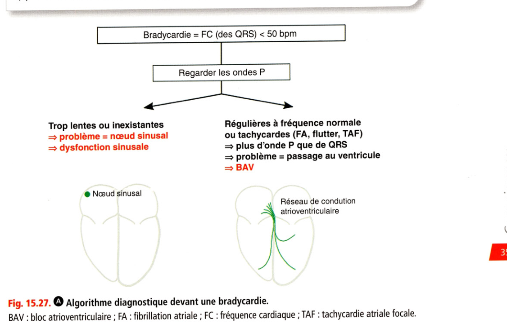

**Fig. 15.27.** Algorithme diagnostique devant une bradycardie.

BAV : bloc atrioventriculaire ; FA : fibrillation atriale ; FC : fréquence cardiaque ;TAF : tachycardie atriale focale.