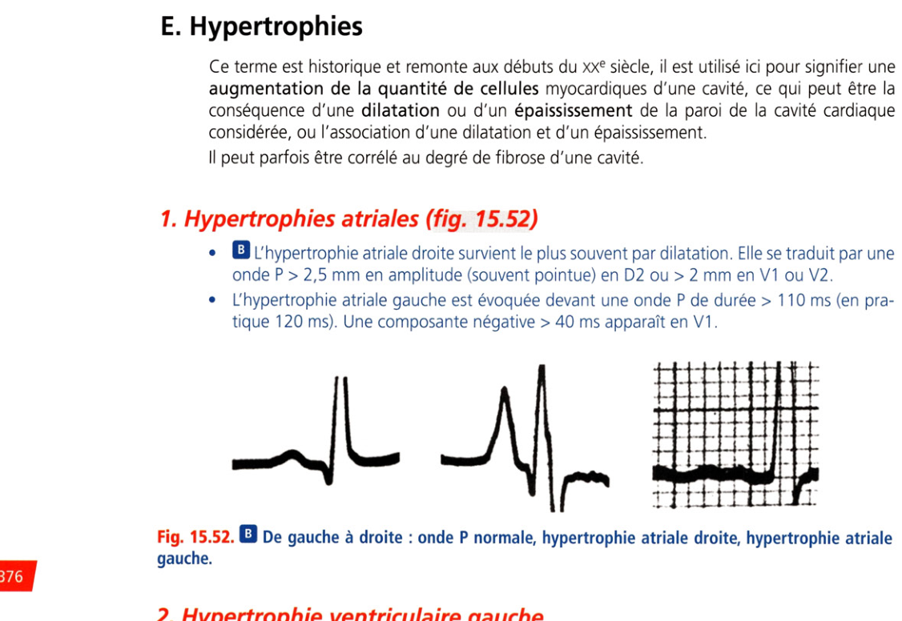
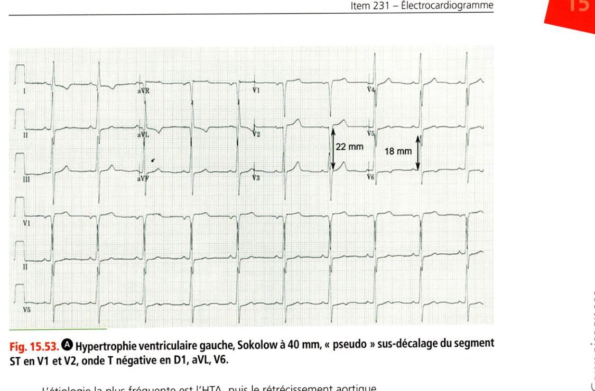
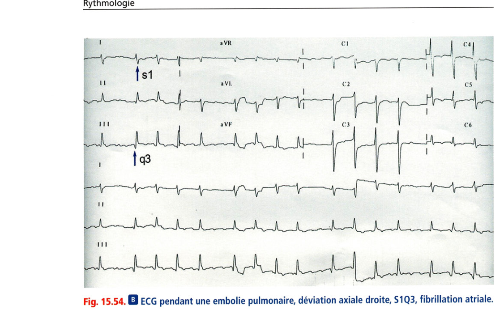

# I.E — Hypertrophies

> Retour à l'index : [Item 231 — Électrocardiogramme](./231_ECG.md)  
> Collège CNEC / SFC · 3e éd. · p. 337–387 · Partie III — Rythmologie

**Rang A.**

---

Ce terme est historique et remonte aux débuts du xxe siècle, il est utilisé ici pour signifier une augmentation de la quantité de cellules myocardiques d'une cavité, ce qui peut être la conséquence d'une dilatation ou d'un épaississement de la paroi de la cavité cardiaque considérée, ou l'association d'une dilatation et d'un épaississement. Il peut parfois être corrélé au degré de fibrose d'une cavité.

### 1. Hypertrophies atriales (fig. 15.52)

• **Rang A.** L'hypertrophie atriale droite survient le plus souvent par dilatation. Elle se traduit par une onde P > 2,5 mm en amplitude (souvent pointue) en D2 ou > 2 mm en V1 ou V2.

• L'hypertrophie atriale gauche est évoquée devant une onde P de durée > 110 ms (en pratique 120 ms). Une composante négative > 40 ms apparaît en V1 .

**Fig. 15.52.** De gauche à droite : onde P normale, hypertrophie atriale droite, hypertrophie atriale gauche.

### 2. Hypertrophie ventriculaire gauche

**Rang A.** Comme expliqué supra, elle traduit soit une dilatation, soit un épaississement du ventricule gauche (dans les deux cas, le volume de myocarde augmente). L'indice le plus utilisé est celui de Sokolow (amplitude de l'onde S en V1 ou V2 + amplitude de l'onde R en V5 ou V6), de valeur normale inférieure à 35 mm. Dans la forme sévère, il y a une onde T négative souvent associée à un sous-décalage du ST dans les dérivations latérales par anomalie secondaire de la repolarisation (D1, aVL, V5, V6) et disparition de l'onde Q de dépolarisation septale dans les mêmes dérivations. La déviation axiale est modeste vers la gauche, les QRS peuvent être un peu élargis du fait de la masse myocardique élevée à dépolariser et de la fibrose intramyocardique pouvant retarder la propagation de l'influx, mais reste souvent inférieur à 120 ms.

> **Point sémantique.** Le terme historique pour la forme sévère est « surcharge systolique » tandis que la forme modérée est dite « diastolique » sans que ces formes aient une signification sur le mécanisme. Attention aux aspects trompeurs de pseudonécrose en VI et V2, une HVC électrique importante pouvant donner un aspect QS qui mime une séquelle d'infarctus, et/ou sus-décalage du segment ST (fig. 15.53).

**Fig. 15.53.** Hypertrophie ventriculaire gauche, Sokolow à 40 mm, « pseudo » sus-décalage ST en V1-V2, onde T négative en D1, aVL, V6.

L'étiologie la plus fréquente est l'HTA, puis le rétrécissement aortique.

### 3. Hypertrophie ventriculaire droite

• **Rang B.** Le même aspect est observé en cas d'hémibloc postérieur gauche ou comme variante de la normale chez les sujets longilignes.

L'intérêt est modeste à l'ère de l'échocardiographie. Il existe un intérêt clinique chez les patients avec BPCO ou atteinte pulmonaire sévère. Le signe le plus précoce est une déviation axiale de QRS supérieure à 110° (en pratique 90°). Les autres signes sont :

• en V1 : onde R ample > 6 mm ;

• en V5 V6 : onde S ample > 7 mm ;

• association fréquente à une hypertrophie atriale droite et à un microvoltage chez les patients atteints de BPCO.

L'onde T peut être négative et asymétrique en V1 parfois V2, V3 dans les formes sévères, attention à ne pas confondre avec une ischémie myocardique (aspects trompeurs). Il y a souvent un bloc de branche droit associé. Dans l'embolie pulmonaire, une hypertrophie aiguë peut engendrer un aspect S1Q3T3 correspondant à l'apparition d'une onde S en D1, Q en D3, et T négative en D3 (fig. 15.54). 'i i ü

**Fig. 15.54.** ECG pendant une embolie pulmonaire, déviation axiale droite, S1Q3, fibrillation atriale.