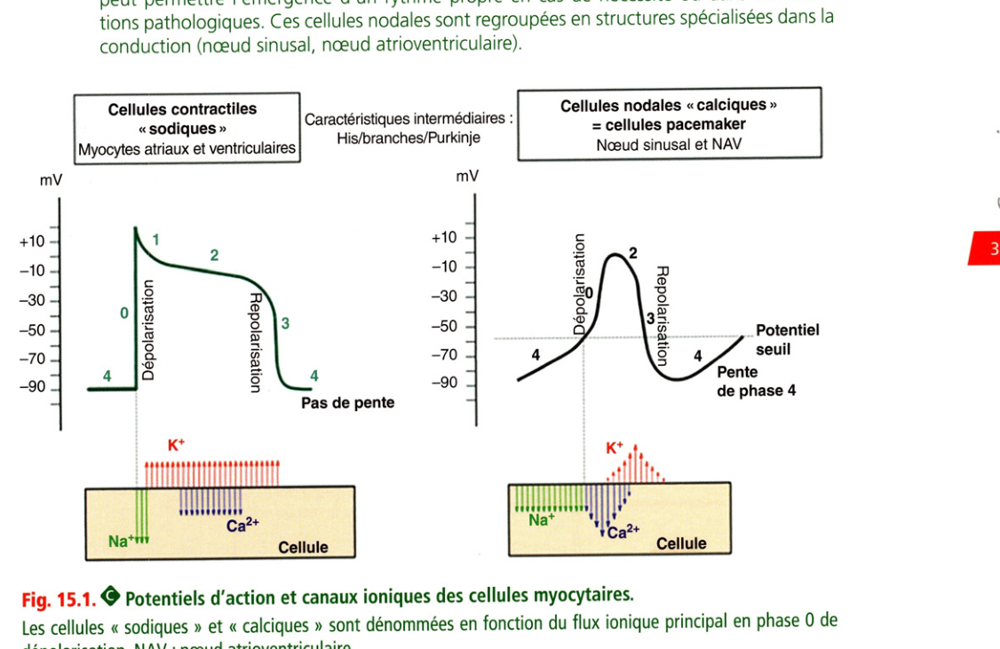
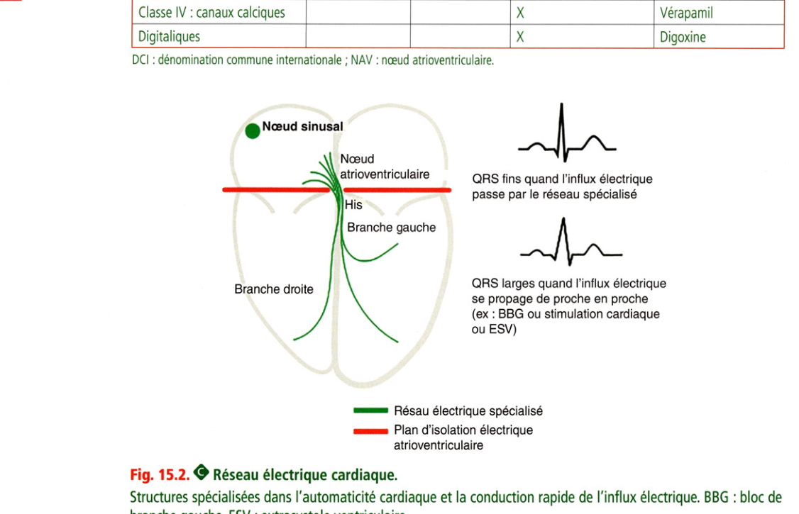
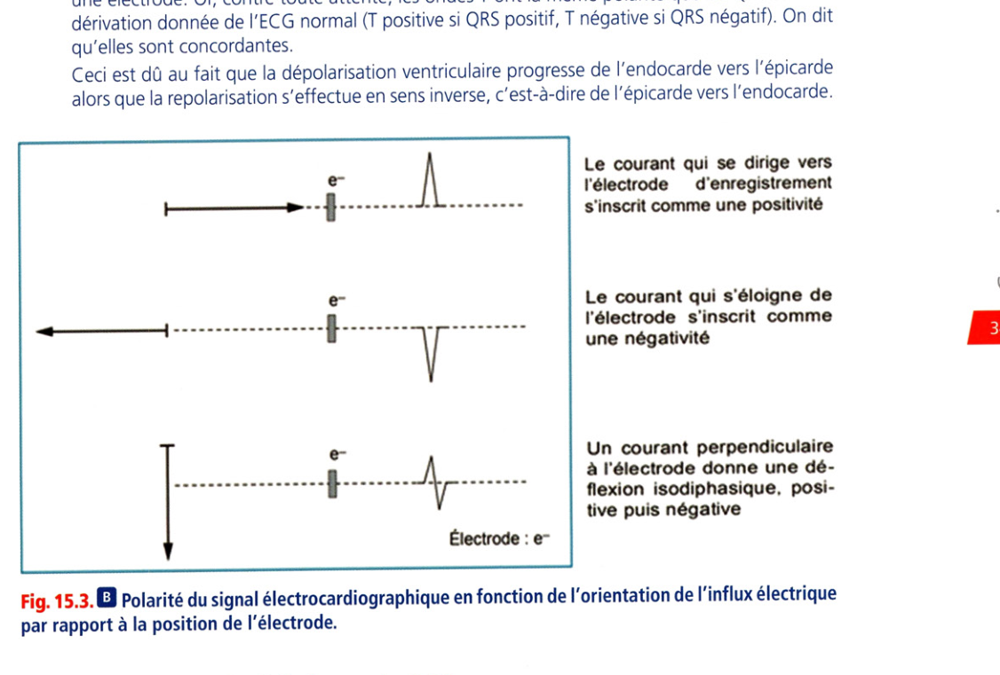
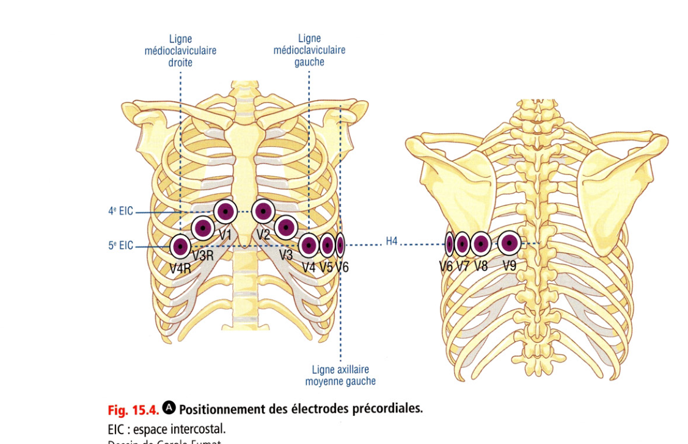
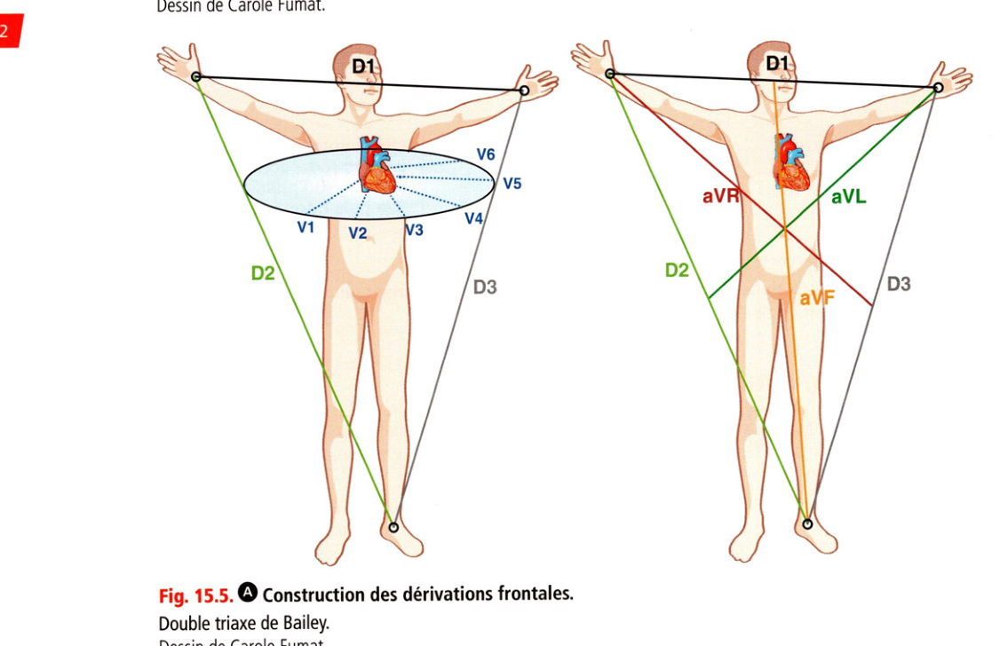
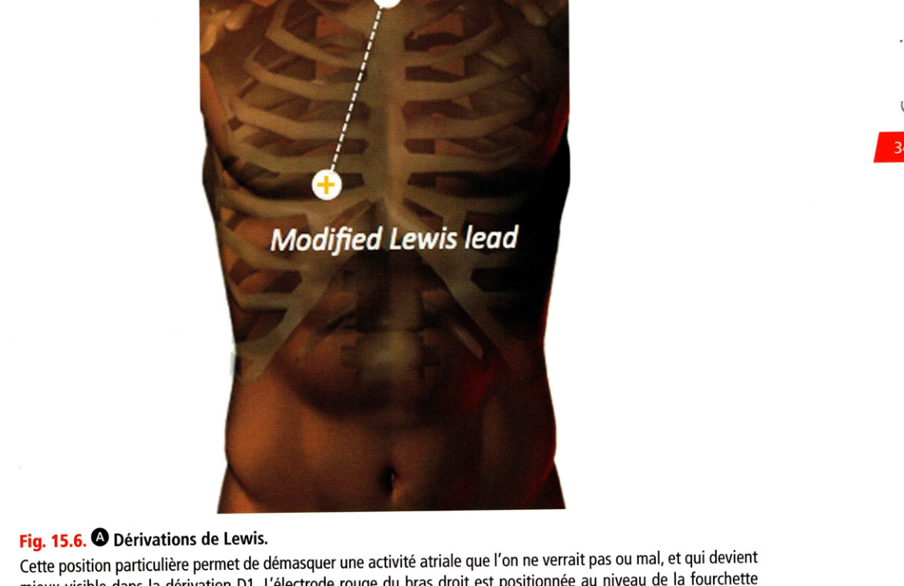
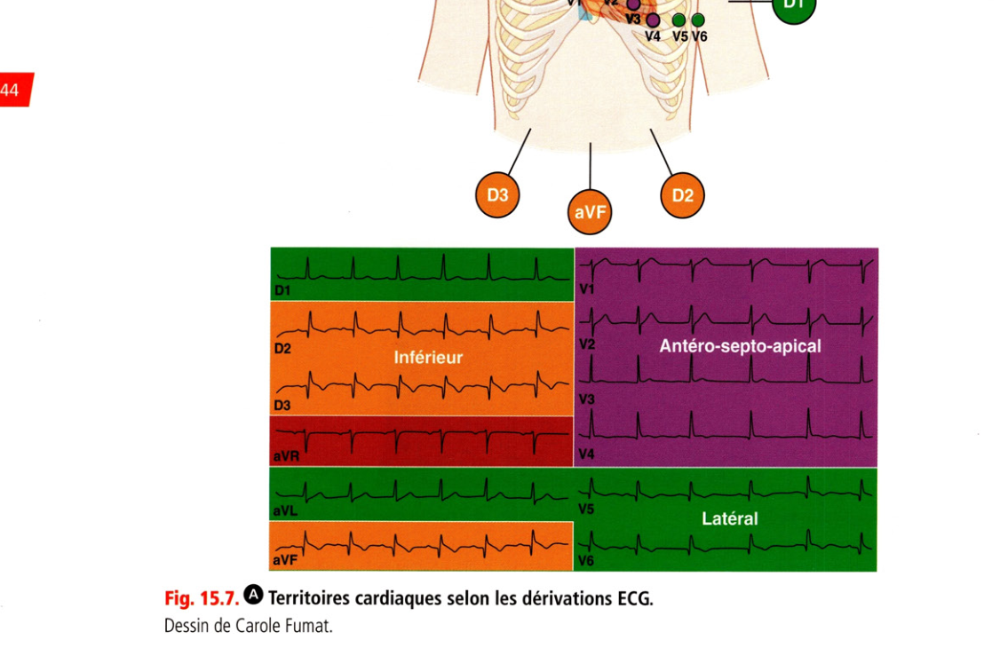
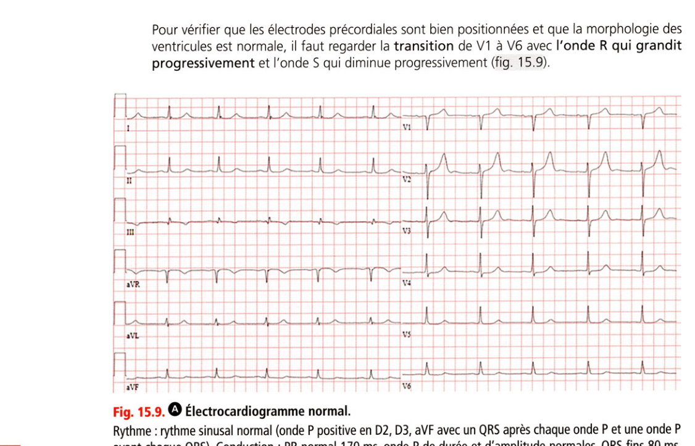

# I.A — ECG normal

> Retour à l'index : [Item 231 — Électrocardiogramme](./231_ECG.md)  
> Collège CNEC / SFC · 3e éd. · p. 337–387 · Partie III — Rythmologie

**Rang A.**

---

### 1. Notions succinctes d'électrophysiologie cardiaque

Les cellules cardiaques sont polarisées négativement à l'état de repos (charge négative intracellulaire). Leur dépolarisation génère un « potentiel d'action » transmissible de cellule en cellule. Ce mécanisme est passif (les mouvements ioniques sont entraînés par les gradients transmembranaires d'ions). La repolarisation permet le retour au potentiel de repos négative. Ce mécanisme est actif et consomme de l'ATP via des pompes NA/K-ATPase. La conduction au sein du myocarde correspond à la dépolarisation des cellules de proche en proche, permise par la mise en continuité des cytosols par les jonctions communicantes (gap junctions), situées préférentiellement aux extrémités longitudinales des cellules myocardiques. Il existe deux types de cellules myocardiques (fig. 15.1) :

• les cellules contractiles « sodiques » (cellules myocardiques atriales et ventriculaires) : la transmission du potentiel d'action entre ces cellules est lente car ce n'est pas leur fonction première = conduction de proche en proche lente ;

• les cellules nodales « calciques » : la transmission du potentiel d'action entre ces cellules est rapide (= conduction rapide), et celles-ci présentent une automaticité intrinsèque qui peut permettre l'émergence d'un rythme propre en cas de nécessité ou dans des situations pathologiques. Ces cellules nodales sont regroupées en structures spécialisées dans la conduction (nœud sinusal, nœud atrioventriculaire).

•épolarisation Tir —

**Fig. 15.1.** Potentiels d'action et canaux ioniques des cellules myocytaires.

Potentiels d'action et canaux ioniques des cellules myocytaires. Les cellules « sodiques » et « calciques » sont dénommées en fonction du flux ionique principal en phase 0 de dépolarisation. NAV : nœud atrioventriculaire. Les cellules du faisceau de His, de ses branches et du réseau de Purkinje ont des caractéristiques intermédiaires entre ces deux types de cellules. Les cellules myocardiques ont une capacité d'automaticité via la dépolarisation spontanée en phase 4. Le nœud sinusal est le groupe de cellules ayant l'automaticité la plus forte : fréquence de dépolarisation spontanée au repos entre 60 et 80 bpm. Lorsque le nœud sinusal est déficient, un autre groupe de cellules nodales prend le relais pour générer l'automatisme cardiaque (pacemakers de réserve). Plus le pacemaker prenant le relais est bas et plus la fréquence cardiaque d'échappement est basse : les cellules pacemaker de la jonction (NAV et His = pacemaker jonctionnel) ont un automatisme entre 40 et 60 bpm au repos. Les cellules pacemaker ventriculaire (branches et réseau de Purkinje) ont une fréquence entre 15 et 30 bpm. Ainsi le pacemaker jonctionnel stimule à une fréquence cardiaque de 40 à 60 bpm et le pacemaker ventriculaire à une fréquence cardiaque variant entre 15 et 30 bpm. Lorsque ces pacemakers de réserve prennent le relais, on parle d'« échappement » jonctionnel ou ventriculaire. Les antiarythmiques sont des modulateurs directs des canaux ioniques excepté pour les bêtabloquants qui inhibent le système sympathique (effet indirect). La classification de Vaughan- Williams décrit l'effet ionique prédominant des antiarythmiques qui sont nombreux à avoir en fait un effet sur plusieurs canaux ioniques (tableau 15.1). La synchronisation de la dépolarisation et donc de la contraction entre les différentes cavités cardiaques est permise par :

• le nœud atrioventriculaire (NAV) : synchronisation atrioventriculaire ;

• le faisceau de His, ses branches droite et gauche, et le réseau de Purkinje : synchronisation interventriculaire et intraventriculaire.

Les structures spécialisées ne génèrent pas d'onde propre sur l'ECG car elles regroupent peu de cellules comparativement aux cellules myocardiques contractiles adjacentes. Le plan fibreux des valves séparant l'oreillette du ventricule est normalement totalement isolant (ne permettant pas la conduction de proche en proche), ainsi le seul passage électrique physiologique de l'oreillette au ventricule est le nœud atrioventriculaire (fig. 15.2).

**Tableau 15.1.** Schématisation des actions des médicaments antiarythmiques.

| Classe | Arythmies atriales | Arythmies ventriculaires | Ralentisseurs du NAV | Principales DCI |
|---|---|---|---|---|
| Classe I : canaux sodiques | X | X | | Flécaïnide |
| Classe II : bêtabloquants | X | X | X | Bisoprolol |
| Classe III : canaux potassiques | X | X | | Amiodarone, sotalol |
| Classe IV : canaux calciques | | | X | Vérapamil |
| Digitaliques | | | X | Digoxine |

DCI : dénomination commune internationale ; NAV : nœud atrioventriculaire.

**Fig. 15.2.** Réseau électrique cardiaque.

Structures spécialisées dans l'automaticité cardiaque et la conduction rapide de l'influx électrique. BBG : bloc de branche gauche, ESV : extrasystole ventriculaire.

### 2. Électrogenèse du signal

**Rang A.** L'activité enregistrée par l'ECG provient de la somme des potentiels d'action cellulaires suivant la propagation d'un front de dépolarisation (onde P atriale, puis complexe QRS ventriculaire). Ces courants sont enregistrés à distance (surface du thorax). L'onde de repolarisation (onde T ventriculaire) est due de la même façon à une repolarisation graduelle des différentes cellules cardiaques à des instants différents. Quand une onde de dépolarisation fuit l'électrode de recueil, elle est négative ; lorsqu'elle se dirige vers l'électrode, elle est positive (fig. 15.3). À l'inverse, un front de repolarisation a tendance à générer une onde négative lorsqu'il va vers une électrode. Or, contre toute attente, les ondes T ont la même polarité que les QRS sur une dérivation donnée de l'ECG normal (T positive si QRS positif, T négative si QRS négatif). On dit qu'elles sont concordantes. Ceci est dû au fait que la dépolarisation ventriculaire progresse de l'endocarde vers l'épicarde alors que la repolarisation s'effectue en sens inverse, c'est-à-dire de l'épicarde vers l'endocarde. Électrode : e Le courant qui se dirige vers l'électrode d'enregistrement s'inscrit comme une positivité Le courant qui s'éloigne de l'électrode s'inscrit comme une négativité Un courant perpendiculaire à l'électrode donne une déflexion isodiphasique. positive puis négative

**Fig. 15.3.** Polarité du signal électrocardiographique en fonction de l'orientation de l'influx électrique.

par rapport à la position de l'électrode.

### 3. Dérivations, calcul de l'axe de QRS

**Rang A.** Les dérivations frontales explorent le plan frontal (vertical), elles sont obtenues à partir des membres D1, D2 et D3 (ou I, Il et III), et associées aux dérivations dites unipolaires des membres aVR, aVL et aVF Les dérivations précordiales explorent le plan horizontal (transversal) ; elles sont numérotées de V1 à V9, complétées parfois chez l'enfant ou en cas de suspicion de syndrome coronarien aigu par V3R et V4R (fig. 15.4 et 1 5.5). e EIC 5* EIC

**Fig. 15.4.** Positionnement des électrodes précordiales.

EIC : espace intercostal.

**Fig. 15.5.** Construction des dérivations frontales.

Double triaxe de Bailey.

> **Attention.** Les électrodes précordiales doivent être isodistantes. Les électrodes V1 et V2 sont trop souvent positionnées trop hautes et trop écartées car leur position est confondue avec les foyers auscultatoires aortique et pulmonaire ! Cette erreur peut être à l'origine d'un aspect de pseudonécrose ou d'atypie de repolarisation dans le territoire antérieur. En cas de difficultés pour apercevoir l'activité atriale, il peut être utile de modifier la position des électrodes pour aboutir aux dérivations dites de Lewis (fig. 15.6).

**Fig. 15.6.** Dérivations de Lewis.

Cette position particulière permet de démasquer une activité atriale que l'on ne verrait pas ou mal, et qui devient mieux visible dans la dérivation D1. L'électrode rouge du bras droit est positionnée au niveau de la fourchette sternale, l'électrode jaune du bras gauche est positionnée au niveau du 5e espace intercostal droit. La dérivation où l'activité atriale est bien visible est D1. Certaines dérivations explorent certains territoires. Les territoires explorés sont simplement liés aux positions des électrodes par rapport à l'anatomie du cœur. Ce principe concerne essentiellement les ventricules et est très utile à la localisation des infarctus. On distingue les dérivations (fig. 15.7) :

• antéroseptales : V1, V2 et V3 explorant la paroi antérieure du ventricule gauche et le septum interventriculaire ;

• apicale : V4 ;

• latérales : D1, aVL (hautes) et V5, V6 (basses) ;

• inférieures ou diaphragmatiques : D2, D3 et aVF pour la face inférieure du ventricule gauche ;

• postérieures : V7, V8 et V9 pour la face basale et inférieure du ventricule gauche.

• le ventricule droit est exploré par V1, V2, V3R et V4R. ï ES ES "S

Antéro-septo-apical Inférieur Latéral

**Fig. 15.7.** Territoires cardiaques selon les dérivations ECG.

L'axe de la dépolarisation ventriculaire est mesuré dans le plan frontal, en utilisant le double triaxe de Bailey (cf. fig. 15.5). Ce double triaxe donne des dérivations graduées de 30 en 30° dans le sens des aiguilles d'une montre en partant de D1 figurée à l'horizontale (0°). La méthode rapide de détermination de l'axe du QRS consiste à regarder la polarité de DI et aVF pour savoir dans lequel des quatre cadrans se trouve l'axe :

• DI et aVF+ -> axe entre 0 et 90° : normal ;

• DI+ et aVF— > axe entre 0 et -90°.

- Si DII+ -> axe entre 0 et -30° : normal,

- sinon axe hypergauche ;

• DIet aVF+ -> axe entre 90 et 180° = axe hyperdroit ;

• DI et aVF— > axe extrême entre -90 et -1 80 °.

L'axe normal est entre -30 et 90. On parle d'onde isodiphasique lorsque les composantes successives de l'onde (P, QRS ou T) sont d'égale importance pour le positif et le négatif (aspect de sinusoïde). L'axe de la dépolarisation ventriculaire est variable selon l'anatomie du patient :

• cœur vertical chez le patient filiforme : l'axe est vertical, proche de 90°

• cœur horizontal chez le patient obèse ou présentant une cardiomégalie : l'axe est proche

L'axe de dépolarisation ventriculaire est également anormal en cas d'anomalie de la conduction dans les hémibranches gauches ou en cas d'anomalie morphologique marquée d'un ventricule.

### 4. ECG normal, principales valeurs numériques (tableau 15.2)

• La vitesse normale est de 25 mm/s, soit 40 ms/mm, un grand carreau de 5 mm vaut 200 ms.

En amplitude normale, 1 mm vaut 0,1 mV.

• L'onde P normale a un axe à 60°, donc une positivité maximale en D2, puisque le nœud sinusal est situé en haut à droite de l'oreillette droite, et que l'activation des oreillettes se fait donc d'en haut à droite vers en bas à gauche. Sa durée normale est inférieure à 110 ms

(en pratique 120 ms).

• Le QRS normal a un axe compris entre -45 et +110°, en pratique on utilise des valeurs arrondies de -30 à +90° (c'est-à-dire de aVL à aVF).

• Sa durée est comprise entre 70 et 110 ms.

**Tableau 15.2.** Résumé des valeurs normales.

| Onde, intervalle | Valeurs normales |
|---|---|
| Fréquence cardiaque (FC) | 60–100 bpm |
| Durée de P | < 120 ms |
| Axe de P | 60° (D2) |
| Amplitude de P | < 2,5 mm (en D2) |
| PR | 120–200 ms |
| Durée de QRS | 70–110 ms |
| Axe de QRS | −30 à +90° |
| Onde Q physiologique | < 1/3 amplitude QRS et < 40 ms de durée |
| QT corrigé (variable avec FC) | < 450 ms à 60 bpm, en pratique 470–480 ms |

Rythme cardiaque et rythme sinusal Le rythme cardiaque est le mécanisme électrophysiologique à l'origine des battements du ventricule (des QRS). Il peut être la résultante d'un automatisme normal ou d'un trouble du rythme. Il peut provenir de n'importe quel étage : atrial, jonctionnel, ventriculaire, ou être électroentraîné (pacemaker). Le rythme sinusal naît de l’automatisme du nœud sinusal et commande la dépolarisation des ventricules. C'est le rythme physiologique habituel car le nœud sinusal est le pacemaker physiologique dominant. Sur l'ECG, il s'agit d'une onde P sinusale :

• positive en DI et dans les dérivations inférieures (le nœud sinusal étant en haut à droite de l'oreillette droite) ;

• conduite aux ventricules : chaque complexe QRS est précédé par une onde P et chaque onde P est suivie par un complexe QRS.

Attention : il peut y avoir des ondes P régulières sinusales sans conduction au ventricule (ex : BAV3), il ne s'agit alors plus d’un rythme sinusal. **Rang B.** Le QRS comporte grossièrement trois phases :

• une 1re phase de dépolarisation septale orientée vers l'avant, la droite et le haut et qui génère une onde négative (onde Q fine et peu profonde) sur les dérivations latérales et une petite onde positive en V1 ;

• une 2e phase orientée vers la jambe gauche et l'avant et qui donne une grande onde R en

V3 et V4 ainsi que D2 ;

• une 3e phase orientée vers le haut et l'arrière, souvent vers la droite, qui donne une petite onde S dans les dérivations inférieures et latérales.

Cette séquence d'activation explique le caractère polyphasique des QRS.

• **Rang A.** La fréquence cardiaque normale de repos de l'adulte (attention au nouveau-né) est entre 60 et 100 bpm. Une bradycardie correspond à une FC < 60 bpm, une tachycardie à une FC > 100 bpm. La fréquence et la régularisation du nœud sinusal sont soumises aux variations du tonus sympathique et parasympathique, raison pour laquelle les athlètes présentent une bradycardie sinusale physiologique (tonus vagal important), et les sujets jeunes peuvent présenter une variation physiologique de la fréquence sinusale suivant la respiration (en raison d'une innervation neurovégétative importante).

• La période est mesurée par l'intervalle RR (entre 2 QRS) en secondes, et la fréquence calculée par FC = 60/Période.

En pratique Si l'intervalle RR est égal à un grand carreau, la fréquence est de 300 bpm, pour une valeur de deux grands carreaux, elle est de 150 bpm, etc. La formule est FC = 300/nombre de grands carreaux séparant deux QRS.

• L'intervalle PR de début de P à début de QRS est entre 120 et 200 ms (inclus). Il explore la totalité de la conduction depuis la sortie de l'onde du nœud sinusal jusqu'aux extrémités du réseau de Purkinje et pas seulement la traversée du nœud atrioventriculaire.

• L'intervalle QT du début de Q à la fin de l'onde T explore la durée de la repolarisation.

Pour le mesurer, il faut choisir les dérivations où l'onde T est la plus ample et la plus longue (souvent V2-V3) et tracer la tangente à l'onde T (fig. 15.8). Intervalle QRS Intervalle PR Intervalle QT

> **Attention.** Si une onde U (aspect de 2e onde de repolarisation) est présente, celle-ci ne doit pas être incluse dans la mesure de l'intervalle QT !

• Étant donné la variabilité de la mesure du QT en fonction de la fréquence cardiaque, plutôt que d'utiliser des abaques, il est préférable d'utiliser la formule de Bazett pour le normaliser et ainsi disposer d'une seule norme du QT pour une fréquence cardiaque de 60 bpm : QT mesuré

QT mesuré QT corrige = QTc = -----,— —— = , v Intervalle RR (secondes)

• L'intervalle RR est l'intervalle entre deux QRS (ici mesuré en secondes donc pour une fréquence cardiaque de 60 bpm, cet intervalle est égal à 1 seconde).

Important : savoir affirmer qu'un ECG est normal La seule manière d'y arriver est d'être systématique :

• rythme : rythme sinusal (onde P positive en D1, D2 avec un QRS après chaque onde P et une onde P avant chaque QRS) entre 60 et 100 bpm ;

• conduction : onde P de durée < 120 ms. PR normal 120-200 ms, QRS fins 70-110 ms avec un axe entre

• repolarisation : point J (point qui termine le QRS) et segments ST isoélectriques. Ondes T positives dans toutes les dérivations sauf en aVR et V1 et parfois en D3 et aVL ; QT < 450 ms ;

• morphologique : amplitude des ondes P et des QRS (Sokolov < 35 mm) normales. Transition des QRS normale en antérieur. Absence d'onde Q de nécrose (larges > 40 ms et profondes > 1/3 du QRS).

À noter : chez le jeune et notamment chez l'homme, le point J peut être sus-décalé de V1 à V4 avec un segment ST jonctionnel (en pente ascendante entre le point J et l'onde T), il s'agit d'une repolarisation physiologique. Pour vérifier que les électrodes précordiales sont bien positionnées et que la morphologie des ventricules est normale, il faut regarder la transition de V1 à V6 avec l'onde R qui grandit progressivement et l'onde S qui diminue progressivement (fig. 15.9).

**Fig. 15.9.** Électrocardiogramme normal.

Rythme : rythme sinusal normal (onde P positive en D2, D3, aVF avec un QRS après chaque onde P et une onde P avant chaque QRS). Conduction : PR normal 170 ms, onde P de durée et d'amplitude normales, QRS fins 80 ms. Axe de dépolarisation ventriculaire normal : positif en D1 et aVF -» entre 0 et 90°. Repolarisation normale : ondes T positives dans toutes les dérivations sauf en aVR et en D3 isolément avec segment ST normal ; QT 442 ms avec QTc 452 ms (le QTc est très proche du QT mesuré car la fréquence cardiaque est très proche de 60 bpm).