# I.D — Troubles du rythme ventriculaire

> Retour à l'index : [Item 231 — Électrocardiogramme](./231_ECG.md)  
> Collège CNEC / SFC · 3e éd. · p. 337–387 · Partie III — Rythmologie

**Rang A** · **Rang B.**

---

> **Attention.** Objectif pédagogique prioritaire, dominé par la problématique de la mort subite et des syncopes (cf. chapitre 12). Ces tachycardies naissent en dessous de la bifurcation hissienne. Elles ne passent donc pas par les voies de conduction (NAV, His, branches et Purkinje) et la conduction se fait alors lentement de « proche en proche » ce qui entraîne un QRS large.

### 1. Tachycardies ventriculaires

Deux mécanismes sont possibles :

• réentrée (mécanisme le plus fréquent sur cardiopathie) ;

• automatisme anormal (mécanisme le plus fréquent sur cœur sain).

Toute tachycardie régulière à QRS larges est une tachycardie ventriculaire (TV) jusqu'à preuve du contraire. C'est un état électrique instable, prémonitoire de l'arrêt cardiaque observé dans plus de la moitié de toutes les morts subites, on dit qu'une TV « dégénère » en FV, puis en asystolie du fait de l'anoxie cellulaire si celle-ci n'est pas prise en charge. Les tachycardies ventriculaires peuvent être secondaires à des mécanismes multiples, mais le plus fréquent reste une réentrée autour d'une zone de fibrose (secondaire à une nécrose liée à un infarctus ou à une cardiopathie) (fig. 15.40). On suspecte le diagnostic sur des bases simples :

• tachycardie (fréquence > 100 bpm) ;

• QRS > 120 ms pour au moins 3 battements consécutifs.

La suspicion d'une tachycardie ventriculaire impose de donner l'alerte (faire le 15, se préparer à une réanimation).

• Entre 3 battements et 30 secondes, on parle de « TV non soutenue » (TVNS) (fig. 15.41).

• Si elle dure > 30 secondes : c'est une TV soutenue

I l I ( » i

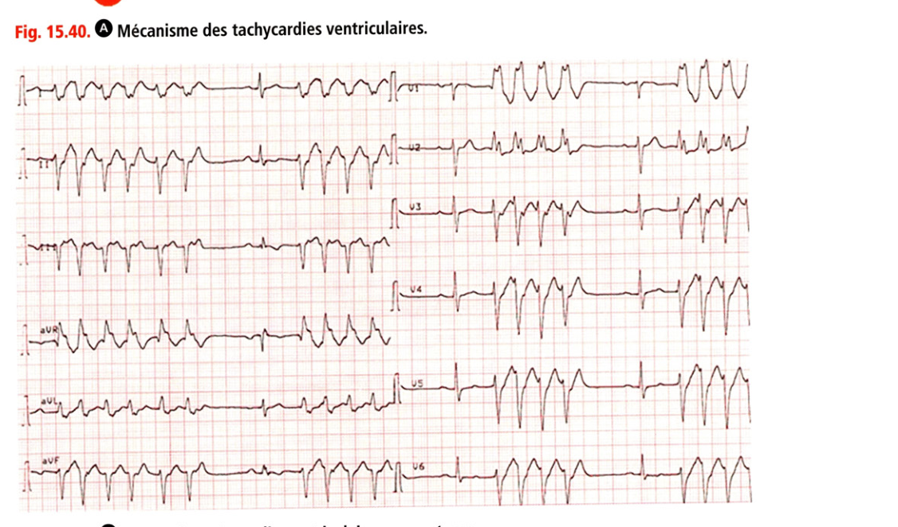

**Fig. 15.41.** Aspect de tachycardie ventriculaire non soutenue.

On doit décrire le caractère « monomorphe » (les QRS sont de morphologie identique) ou « polymorphe », puisqu'il a des conséquences directes sur l'étiologie potentielle de l'arythmie et sur ses effets hémodynamiques. Au-delà de ces règles simples, le diagnostic peut être affiné (a posteriori) par certains éléments (encadré 15.2).

> **Encadré 15.2 — Diagnostic d'une tachycardie ventriculaire**
>
> **Arguments de certitude**
> - **Rang A.** Dissociation ventriculoatriale (ondes P habituellement plus lentes et dissociées des QRS). S'il y a plus de QRS que d'ondes P, la tachycardie vient forcément du ventricule. À ne pas confondre avec la dissociation atrioventriculaire du bloc complet (fig. 15.42).
> - Complexes de capture ou de fusion : QRS fins précédés d'une onde P, intercalés dans le tracé (fig. 15.43). Certaines ondes P passent par les voies de conduction et capturent le ventricule (QRS fin) ou donnent un QRS intermédiaire (fusion) (fig. 15.44). Ils ne peuvent être présents que s'il y a dissociation ventriculoatriale.
>
> **Arguments en faveur d'une TV**
> - Cardiopathie sous-jacente +++ (la plupart des TV sont favorisées par une cardiopathie)
> - Concordance positive ou négative : QRS entièrement positif (R) ou entièrement négatif (QS) de V1 à V6 (fig. 15.45)
> - Déviation axiale extrême (QRS positif en aVR) (fig. 15.46)
> - QRS larges avec aspect différent d'un bloc de branche habituel

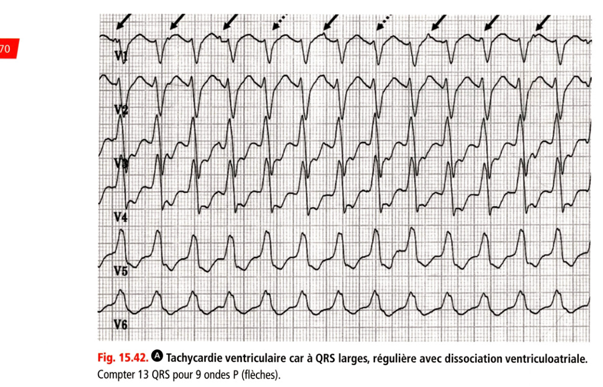

**Fig. 15.42.** Tachycardie ventriculaire : QRS larges, régulière, dissociation ventriculoatriale.

Compter 13 QRS pour 9 ondes P (flèches). Tachycardie ventriculaire Complexe de fusion Complexe de capture

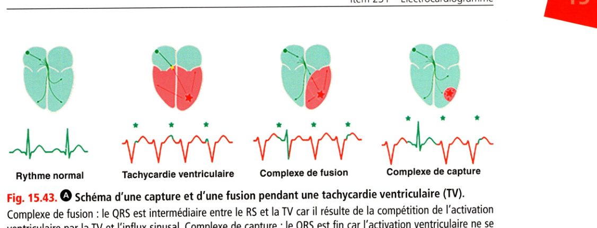

**Fig. 15.43.** Schéma d'une capture et d'une fusion pendant une tachycardie ventriculaire.

Complexe de fusion : le QRS est intermédiaire entre le RS et la TV car il résulte de la compétition de l'activation ventriculaire par la TV et l'influx sinusal. Complexe de capture : le QRS est fin car l'activation ventriculaire ne se fait que par l'influx sinusal, qui capture le ventricule (dépolarise via les voies de conduction naturelles) avant que la TV ne puisse l'activer. îrft Wv V YYYTvYYYrmr m

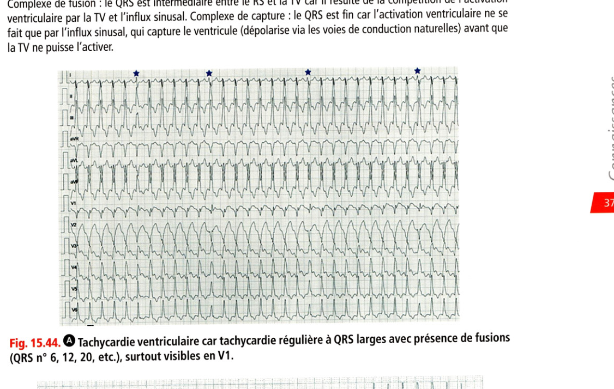

**Fig. 15.44.** Tachycardie ventriculaire régulière à QRS larges avec fusions.

(QRS n° 6, 12, 20, etc.), surtout visibles en V1.

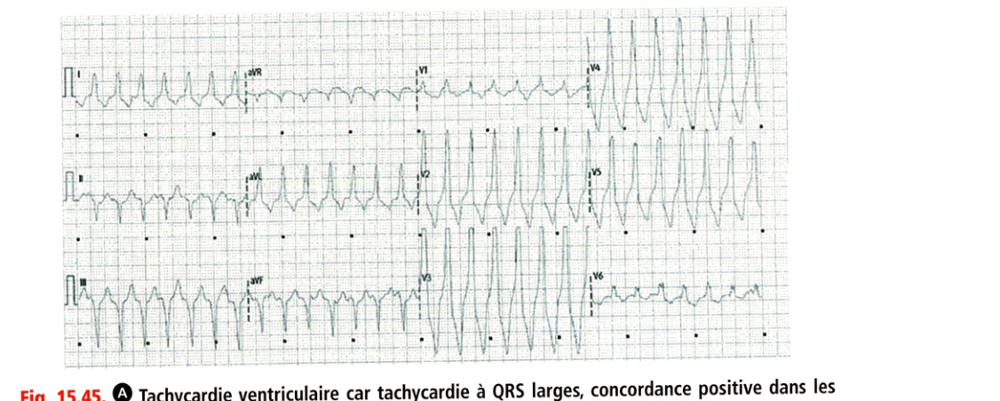

**Fig. 15.45.** Tachycardie ventriculaire : QRS larges, concordance positive dans les précordiales.

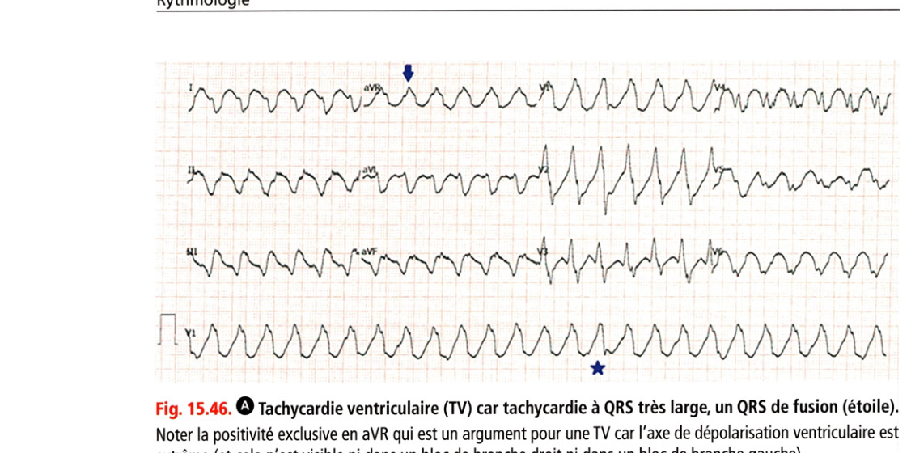

**Fig. 15.46.** Tachycardie ventriculaire à QRS très large, QRS de fusion.

Noter la positivité exclusive en aVR qui est un argument pour une TV car l'axe de dépolarisation ventriculaire est extrême (et cela n'est visible ni dans un bloc de branche droit ni dans un bloc de branche gauche).

### 2. Fibrillation ventriculaire

C'est une urgence absolue qui nécessite une cardioversion électrique immédiate avant tout autre geste, on pratique un massage cardiaque en attendant le choc électrique (fig. 15.47 et sssifiiaHmMMnBsa XHaKISlSlStSSÏ

- v;-r — r

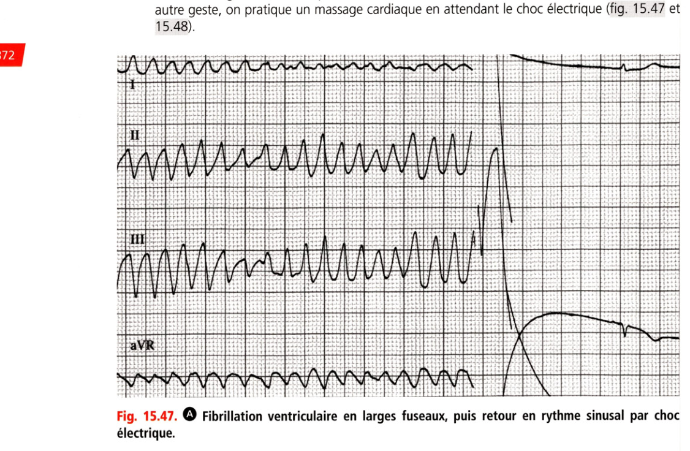

**Fig. 15.47.** Fibrillation ventriculaire en larges fuseaux, puis retour en rythme sinusal par choc.

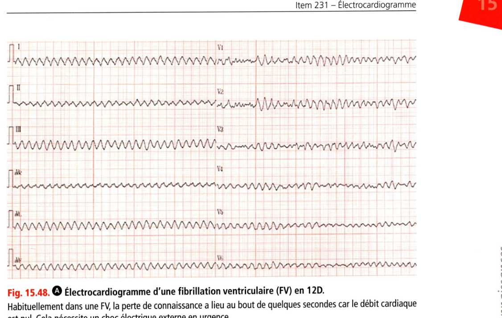

**Fig. 15.48.** Électrocardiogramme d'une fibrillation ventriculaire (FV) en 12D.

Habituellement dans une FV, la perte de connaissance a lieu au bout de quelques secondes car le débit cardiaque est nul. Cela nécessite un choc électrique externe en urgence. Ici, il s'agit d'un patient qui tolère bien sa FV car il a un cœur artificiel mécanique (Heartmate®), ce qui a permis de réaliser cet ECG 12D. Cette situation est très rare. Après quelques secondes, le patient perd connaissance, le pouls carotidien est aboli. C'est un arrêt cardiaque (cf. chapitre 21). L'ECG objective une tachycardie irrégulière à QRS larges polymorphes.

### 3. Torsades de pointes

• **Rang B.** C'est une forme particulière de tachycardie ventriculaire polymorphe qui peut s'arrêter spontanément ou dégénérer en fibrillation ventriculaire (fig. 15.49 et 1 5.50).

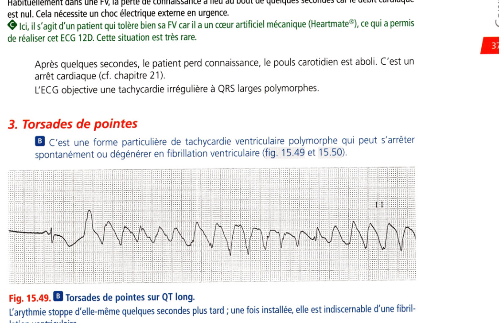

**Fig. 15.49.** Torsades de pointes sur QT long.

L'arythmie stoppe d'elle-même quelques secondes plus tard ; une fois installée, elle est indiscernable d'une fibrillation ventriculaire. À noter que la torsade de pointes est parfois impossible à différencier de la fibrillation ventriculaire sur l'aspect ECG. Seuls la présence d'un QT long avant le trouble du rythme et le contexte permettent alors de faire le diagnostic (la FV survient surtout en cas d'ischémie ou de cardiopathie évoluée alors que la torsade de pointes survient dans les situations décrites ci-dessous). Elle s'observe en cas d'allongement de l'intervalle QT, ce qui est notamment le cas lors de :

• bradycardie extrême (échappements à QRS larges des blocs atrioventriculaires bas situés, intoxication en bradycardisant, etc.) ;

• hypokaliémie ;

• hypocalcémie ;

• hypomagnésémie ;

• association de médicaments allongeant l'intervalle QT (cf. Dictionnaire Vidal ; notamment antiarythmiques, psychotropes, antibiotiques, antiémétiques, antipaludéens, etc.) ;

• syndrome du QT long congénital (maladie génétique) ;

• etc.

C'est pour cette raison qu'une mesure allongée du QT doit alerter sur l'ECG : il faut vérifier les médicaments responsables, le ionogramme afin de corriger l'allongement du QT pour éviter une mort subite. La prise en charge consiste à corriger les troubles ioniques, accélérer la fréquence cardiaque et arrêter les médicaments allongeant le QT.

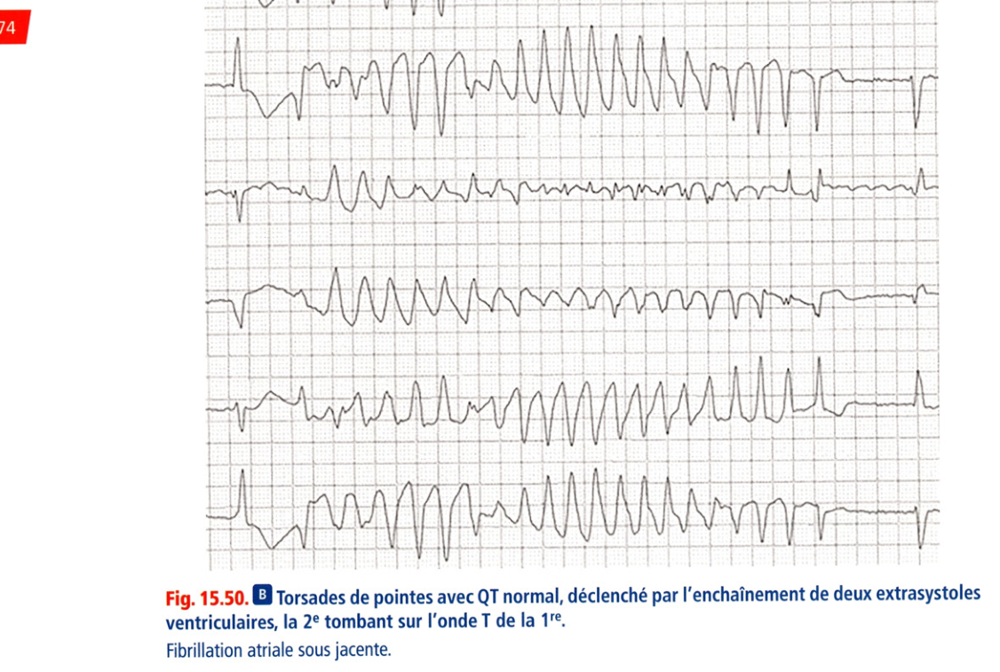

**Fig. 15.50.** Torsades de pointes avec QT normal, déclenchées par deux extrasystoles ventriculaires.

ventriculaires, la 2e tombant sur l'onde T de la 1re. Fibrillation atriale sous jacente.

### 4. Algorithme décisionnel devant une tachycardie

**Rang A.** Un algorithme décisionnel sur la prise en charge d'une tachycardie est proposé dans la figure 15.51. Tachycardie = FC > 100 bpm Irrégulière (Diagonstic différentiel = ESA) Régulière QRS larges

- ventriculaire jusqu’à preuve du contraire ou supraventriculaire + bloc de branche

QRSfins = supraventriculaire Mauvaise tolérance hémodynamique = Cardioversion électrique externe Bonne tolérance : manœuvres vagales ± adénosine (si échec) => Bloque le NAV (BAV transitoire) Utile dés que le diagnostic n’est pas évident Permet de faire le diagnostic précis de la tachycardie dans la majorité des cass Démasque l’activité atriale => fait le diagnostic (car ralentit le passage au ventricule) Tachycardie atriale wwwwwww ??? = Activité atriale Sinusale Flutter WW ???WV Tachycardie jonctionnelle Arrête la tachycardie (car bloque la réentrée dépendante du NAV) WW— V'V' Aucun effet (car la tachycardie ne dépend pas du NAV) wwwwww Diagnostic de certitude TV = Dissociation AV = Plus de QRS que d’onde P Tachycardie ventriculaire l Manœuvres vagales ± adénosine Activité électrique atriale

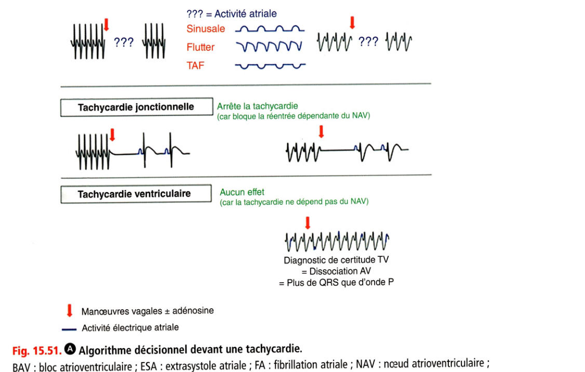

**Fig. 15.51.** Algorithme décisionnel devant une tachycardie.

BAV : bloc atrioventriculaire ; ESA : extrasystole atriale ; FA : fibrillation atriale ; NAV : nœud atrioventriculaire ; TAF : tachycardie atriale focale.