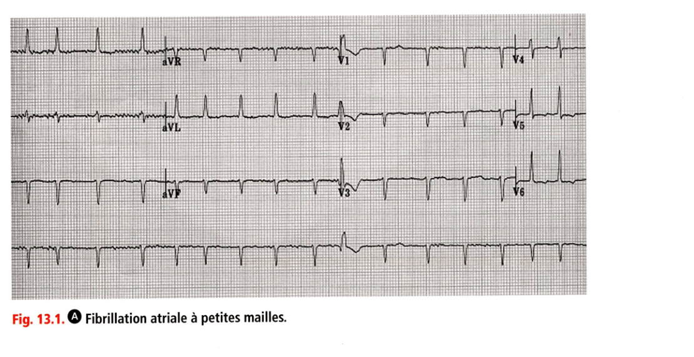
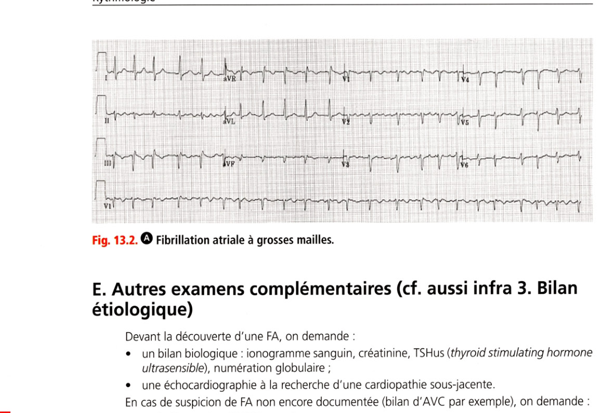

# Item 232 — Fibrillation atriale

> **Collège CNEC / SFC** · 3e édition (2025) · p. 297–311 · R2C  
> Partie III — Rythmologie

---

## Trois repères à ne pas confondre

| Badge | Signification (R2C) |
|---|---|
| **Rang A** | Connaissances fondamentales de fin de 2e cycle |
| **Rang B** | Connaissances essentielles, plus spécialisées |
| **Rang C** | Connaissances de 3e cycle (DES) |

Les pastilles du livre (● = A, ■ = B) sont reprises inline.

---

## Situations de départ

21 Asthénie.  
24 Bouffées de chaleur.  
27 Chute de la personne âgée.  
50 Malaise/perte de connaissance.  
54 Œdème localisé ou diffus.  
161 Douleur thoracique.  
162 Dyspnée.  
165 Palpitations.  
166 Tachycardie.  
178 Demande/prescription raisonnée et choix d'un examen diagnostique.  
185 Réalisation et interprétation d'un électrocardiogramme (ECG).  
201 Dyskaliémie.  
230 Rédaction de la demande d'un examen d'imagerie.  
231 Demande d'un examen d'imagerie.  
248 Prescription et suivi d'un traitement par anticoagulant et/ou antiagrégant.  
264 Adaptation des traitements sur un terrain particulier (insuffisant rénal, insuffisant hépatique, grossesse, personne âgée, etc.).  
319 Prévention du surpoids et de l'obésité.  
320 Prévention des maladies cardiovasculaires.  
335 Évaluation de l'aptitude au sport et rédaction d'un certificat de non-contre-indication.  
342 Rédaction d'une ordonnance/d'un courrier médical.  
348 Suspicion d'un effet indésirable des médicaments ou d'un soin.  
352 Expliquer un traitement au patient (adulte/enfant/adolescent).  
354 Évaluation de l'observance thérapeutique.

---

## Hiérarchisation des connaissances

| Rang | Rubrique | Intitulé | Descriptif |
|---|---|---|---|
| **A** | Définition | Définition de la fibrillation atriale (FA) | |
| **A** | Physiopathologie | Physiopathologie de la FA | Mécanismes et évolution |
| **B** | Épidémiologie | Épidémiologie de la FA | Prévalence, lien avec HTA et insuffisance cardiaque |
| **A** | Diagnostic positif | Symptômes usuels | |
| **A** | Diagnostic positif | Identifier la FA sur l'électrocardiogramme | |
| **B** | Diagnostic positif | Présentation clinique | Classification en « P » |
| **B** | Étiologies | Formes cliniques usuelles | FA sur cœur normal, FA de l'insuffisance cardiaque, FA et AVC |
| **B** | Étiologies | Formes cliniques non usuelles | FA valvulaire, maladie de l'oreillette |
| **A** | Étiologies | Comorbidités de la FA | HTA, SAOS, éthylisme, obésité |
| **A** | Étiologies | Facteurs déclenchants | FA de cause aiguë |
| **A** | Examens complémentaires | Bilan de 1re intention | ECG, échocardiographie, examens biologiques |
| **A** | Identifier une urgence | Risque thromboembolique et hémorragique | Scores adaptés |
| **A** | Prise en charge | Correction des facteurs de risque | Prise en charge des comorbidités |
| **B** | Prise en charge | Principes de prise en charge de la FA | Contrôle de la fréquence, contrôle du rythme, anticoagulants |
| **B** | Identifier une urgence | Mauvaise tolérance | Indications de cardioversion |

---

## Parcours Rang A

- [I. Définition](#i-définition)
- [III. Physiopathologie et mécanismes](#iii-physiopathologie-et-mécanismes)
- [V. Diagnostic](#v-diagnostic)
- [VI. Évaluation et prévention du risque thromboembolique](#vi-évaluation-et-prévention-du-risque-thromboembolique)
- [VII. Traitement](#vii-traitement)
- [IX. Dépistage](#ix-dépistage)

---

## Sommaire

- [Vignette clinique](#vignette-clinique)
- [I. Définition](#i-définition)
- [II. Épidémiologie](#ii-épidémiologie)
- [III. Physiopathologie et mécanismes](#iii-physiopathologie-et-mécanismes)
- [IV. Classification et terminologie](#iv-classification-et-terminologie)
- [V. Diagnostic](#v-diagnostic)
- [VI. Évaluation et prévention du risque thromboembolique](#vi-évaluation-et-prévention-du-risque-thromboembolique)
- [VII. Traitement](#vii-traitement)
- [VIII. Différents tableaux cliniques](#viii-différents-tableaux-cliniques)
- [IX. Dépistage](#ix-dépistage)
- [Points](#points)
- [Notions indispensables et inacceptables](#notions-indispensables-et-inacceptables)
- [Réflexes transversalité](#réflexes-transversalité)
- [Entraînement](../../Entrainement/QI/232_Fibrillation_atriale.md)

---

## Vignette clinique

Un patient de 60 ans hypertendu vous consulte car il ressent des palpitations persistantes accompagnées d'une dyspnée d'effort inhabituelle depuis 48 heures. Les chiffres tensionnels sont satisfaisants et la fréquence cardiaque est à 115 bpm.

> Quel examen complémentaire diagnostique faites-vous en 1re intention ?

> Quels signes cliniques recherchez-vous dans ce contexte ?

> Vous suspectez une fibrillation atriale, quels examens biologiques prescrivez-vous ?

> Le diagnostic de fibrillation atriale est confirmé, quels traitements médicamenteux prescrivez-vous ?

> Vous revoyez le patient 48 heures plus tard car il garde des symptômes. Quelle est votre prise en

charge (ou stratégie thérapeutique) ?

# I. Définition

**Rang A.**

• **Rang A.** La fibrillation atriale (selon la nomenclature internationale) ou « auriculaire » ou FA est une tachycardie irrégulière (arythmie) d'origine supraventriculaire due à une activité électrique rapide (400-600/min) et anarchique des oreillettes ayant pour conséquences des contractions désynchronisées des deux massifs atriaux avec perte de leur efficacité hémodynamique.

• La réponse ventriculaire à cette arythmie est sous la dépendance du nœud atrioventriculaire (AV) dont la capacité de filtration varie selon l'état du système nerveux autonome et de l'imprégnation en médicaments bradycardisants.

• On retient le diagnostic de FA « clinique » devant un ECG (monopiste ou 12 dérivations) présentant une activation atriale anarchique sans onde P individualisable. Il n'y a plus de durée minimale de 30 secondes d'enregistrement pour diagnostiquer la FA. Le diagnostic par photopléthysmographie reste en revanche non valide.

---

# II. Épidémiologie

**Rang B.**

• **Rang A.** La FA est le plus fréquent des troubles du rythme : elle concerne entre 500 000 et 750 000 patients en France.

• Sa prévalence croît avec l'âge : rare avant 50 ans, elle touche 10 % de la population après 80 ans.

• Il existe un lien fort avec l'obésité avec 30 % d'augmentation de la fréquence par tranche supplémentaire de 5 kg/m2 d'indice de masse corporelle.

• La FA est responsable de 20-25 % de tous les AVC, par embolie cérébrale.

• Elle peut faire suite ou s'associer à un flutter atrial typique ou atypique.

---

# III. Physiopathologie et mécanismes

**Rang A.**

## A. Aspects électriques

Le nœud AV filtre l'activité atriale anarchique rapide, on note donc une tachycardie irrégulière au repos qui s'accélère à l'effort.

## B. Conséquences hémodynamiques

Ce sont :

• une perte de la systole atriale ;

• une perte de l'adaptation physiologique de la fréquence cardiaque à l'effort ;

• un risque d'insuffisance cardiaque ;

• un risque thromboembolique par stase au niveau de l'auricule gauche et embolie dans la circulation systémique.

## C. Évolution

Elle se fait vers :

• la fibrose des oreillettes et, plus tardivement, du tissu de conduction (nœud sinusal et nœud AV) ;

• la dilatation atriale (remodelage atrial) qui, à son tour, pérennise la fibrillation (cercle vicieux d'autoaggravation).

---

# IV. Classification et terminologie

**Rang B.**

## A. Classification en « P »

Elle s'organise ainsi :

• paroxystique avec retour spontané ou à la suite d'une action de cardioversion (par médicament ou par choc électrique) en rythme sinusal en moins de 7 jours. On appelle cardioversion ou réduction de la FA les actions médicales qui restaurent le rythme sinusal ;

• persistante en cas de retour spontané ou à la suite d'une action de cardioversion (par médicament ou par choc électrique) au-delà de 7 jours ;

• permanente en cas d'échec de cardioversion et/ou de décision d'une stratégie de contrôle de la fréquence (pas de volonté de restaurer le rythme sinusal).

• premier épisode : la FA n'est pas encore classable.

## B. Formes particulières

• La maladie de l'oreillette ou syndrome de tachybradycardie correspond à la coexistence de FA paroxystique et de dysfonction sinusale.

• On oppose les FA récidivantes aux FA de cause aiguë (postopératoire, infarctus, infection pulmonaire, péricardite, etc.).

---

# V. Diagnostic

**Rang A** · **Rang B**.

## A. Circonstances de découverte : très variables

**Rang A.** La FA peut être :

• découverte lors d'un examen clinique ou d'un ECG chez un patient asymptomatique ;

• découverte au cours d'un bilan de palpitations permanentes ou intermittentes ou d'un essoufflement récent ;

• révélée par une complication (AVC, poussée d'insuffisance cardiaque, etc.).

## B. Signes fonctionnels

• Les signes peuvent être absents ou intermittents, le diagnostic ECG est indispensable car la corrélation est mauvaise entre la réalité de la FA et la prise du pouls ou la description de palpitations. Il est souvent nécessaire de recourir au holter ou à d'autres méthodes de monitorage ECG pour faire le diagnostic en cas de FA paroxystique.

• Les symptômes usuels sont les palpitations, la dyspnée d'effort, l'angor fonctionnel, l'asthénie inexpliquée, etc.

• D'autres symptômes sont plus trompeurs comme les lipothymies, les chutes inexpliquées chez la personne âgée, l'incapacité à faire un effort, l'impression que le cœur « bat trop lentement », les accès de « faiblesse », les bouffées de chaleur ou les œdèmes des membres inférieurs.

## C. Examen clinique

• L'auscultation cardiaque retrouve des bruits du cœur irréguliers et un rythme plus ou moins rapide.

• La prise en charge initiale doit :

- apprécier la tolérance : fréquence cardiaque, pression artérielle, diurèse, fréquence respiratoire, état de conscience ;

- rechercher d'emblée une complication : OAP ou signes d'insuffisance cardiaque, embolie artérielle systémique (examen artériel et neurologique) ;

- chercher des signes en faveur d'une cardiopathie sous-jacente ;

- chercher des facteurs déclenchants ou favorisants (prise d'alcool, fièvre, hyperthyroïdie, etc.).

## D. ECG

Le diagnostic de FA ne peut être confirmé que sur un tracé ECG la documentant (ECG, holter ou monitoring) :

• absence d'onde P visible et QRS le plus souvent irréguliers (exceptionnellement réguliers en cas de BAV complet concomitant) ;

• aspect usuel à petites mailles (trémulations de la ligne de base, fig. 13.1) et QRS fins, les QRS peuvent être larges en cas de bloc de branche associé ;

• cas particulier de la FA à grosses mailles (fig. 13.2) à ne pas confondre avec le flutter atrial ;

• QRS lents et réguliers indiquant une association entre la FA et un bloc atrioventriculaire complet ;

• pauses ou dysfonction sinusale de régularisation (syndrome tachybradycardie).

**Fig. 13.1.** Fibrillation atriale à petites mailles.

**Fig. 13.2.** Fibrillation atriale à grosses mailles (à ne pas confondre avec le flutter atrial).

## E. Autres examens complémentaires (cf. aussi infra 3. Bilan étiologique)

Devant la découverte d'une FA, on demande :

• un bilan biologique : ionogramme sanguin, créatinine, TSHus (thyroid stimulating hormone ultrasensible), numération globulaire ;

• une échocardiographie à la recherche d'une cardiopathie sous-jacente. En cas de suspicion de FA non encore documentée (bilan d'AVC par exemple), on demande :

• un holter prolongé (72 heures) ;

• une interrogation du pacemaker ou du DAI (défibrillateur automatique implantable), si le patient en est porteur.

## F. Diagnostic étiologique

### 1. Facteurs déclenchants

Il peut s'agir :

• d'hypokaliémie ;

• de fièvre ;

• de privation de sommeil ;

• de réaction vagale ;

• d'alcool, ivresse ou prise de substances illicites ;

• d'électrocution.

### 2. Facteurs de prédisposition et/ou causes

**Rang B.** Il est difficile de faire la part entre des facteurs de prédisposition et de réelles « causes ».

De tous les facteurs prédisposants, le plus puissant est incontestablement l'âge. Parmi les facteurs de prédisposition modifiables, on note :

• l'obésité ;

• l'hyperthyroïdie ;

• le diabète ;

• l'hypertension artérielle (HTA) ;

• le tabagisme et la consommation excessive d'alcool ;

• les sports de grande endurance (marathon).

• le syndrome d'apnées obstructives du sommeil (SAOS). Parmi les causes, on recense par ordre de fréquence décroissante :

• l'HTA (souvent avec hypertrophie ventriculaire gauche), en particulier chez le sujet âgé ;

• les valvulopathies surtout mitrales ;

• les autres causes :

- maladies respiratoires (SAOS, pneumopathies infectieuses, embolie pulmonaire, cœur pulmonaire chronique),

- cardiomyopathies dilatées, hypertrophiques ou restrictives,

- syndromes coronariens aigus et séquelles d'infarctus,

- hyperthyroïdie (cardiothyréose),

- péricardites,

- chirurgie cardiaque récente,

- cardiopathies congénitales (communication interatriale),

- phéochromocytome,

- insuffisance rénale sévère. Les formes idiopathiques sont un diagnostic d'élimination : elles ont souvent un substratum génétique. En effet, un antécédent de FA chez un apparenté du 1er degré augmente de 40 % la probabilité d'atteinte.

### 3. Bilan étiologique

**Rang A.** Il doit comporter interrogatoire et examen complet, ECG, radiographie de thorax, échocardiographie transthoracique, TSHus, ionogramme sanguin, fonction rénale, bilan hépatique, les

autres examens sur signe d'appel. Le diagnostic d'HTA est parfois difficile, il faut recourir facilement à l'automesure tensionnelle ou au monitoring ambulatoire (MAPA). De même, le SAOS est souvent méconnu, l'asthénie chronique liée au SAOS est imputée à tort à la FA ou aux médicaments. Le recours à la polygraphie doit être encouragé, surtout chez le sujet obèse.

---

# VI. Évaluation et prévention du risque thromboembolique

**Rang A** · **Rang B**.

## A. En aigu, autour de la cardioversion

• En cas de cardioversion, tout patient est considéré à risque (que la cardioversion soit médicamenteuse ou par choc électrique) pendant les 4 semaines suivantes au minimum.

• Ce risque doit conduire à encadrer la cardioversion par une anticoagulation efficace par une héparine ou par un anticoagulant oral.

• La cardioversion doit être précédée d'au moins 3 semaines d'anticoagulation efficace documentée et suivie de 4 semaines d'anticoagulation efficace. Ensuite, le risque chronique doit être évalué pour décider ou non de la poursuite de l'anticoagulation orale.

• L'anticoagulation précardioversion peut être évitée si une échocardiographie transœsophagienne (ETO) préalable montre l'absence de thrombus intra-OG ou si le début de la FA est parfaitement datable et < 24 heures (ce qui est rarement possible).

• Enfin, lorsque le risque est considéré comme très élevé (valve mécanique mitrale, RM) ou si l'anticoagulation précardioversion est incertaine ou mal documentée, il est aussi parfois décidé de vérifier au préalable l'absence de thrombus atrial gauche avant de procéder à la cardioversion par ETO.

## B. En chronique

• La FA survenant chez un patient porteur d'un RM rhumatismal modéré à sévère ou d'une prothèse valvulaire mécanique est associée à un risque thromboembolique très élevé. Il faut savoir que le score de CHA2DS2-VA décrit ci-dessous ne s'applique pas dans ces situations cliniques. Il faut donc anticoaguler par antivitamines K, qui sont de toute façon indiquées en cas de prothèse mécanique.

• Il y a aussi une indication à l'anticoagulation systématique dès lors que la FA est associée à une cardiomyopathie hypertrophique ou à une amylose cardiaque.

• Dans les autres cas, on doit utiliser le score d'évaluation du risque thromboembolique fondé sur les facteurs de risque principaux, à savoir le score CHA2DS2-VA. Son résultat varie de 0 à 8 points au total. Les éléments du CHA2DS2-VA sont :

- « C » pour congestion (insuffisance cardiaque clinique avec ou sans fraction d'éjection altérée) : 1 point ;

- « H » pour hypertension artérielle traitée ou non, équilibrée ou non : 1 point ;

- « A2 » pour âge > 75 ans : 2 points ;

- « D » pour diabète traité ou non, équilibré ou non : 1 point ;

- « S2 » pour stroke (AVC) ou embolie artérielle : 2 points ;

- « V » pour atteinte vasculaire coronarienne ou AOMI ou athérome des troncs cérébraux : 1 point ;

- « A » pour âge 65-74 ans : 1 point.

• Le risque annuel thromboembolique varie de façon exponentielle de 1 à 18 % pour les scores de 0 à 8 (chaque palier du score augmente globalement le risque annuel de 2 %).

• D'autres facteurs existent qui ne sont pas pris en compte dans ce score, tels le SAOS et l'insuffisance rénale sévère.

• L'évaluation de ce risque détermine la prescription au long cours d'anticoagulants oraux (tableau 13.1) :

- si le score est nul : on ne prescrit pas d'anticoagulant ;

- si le score est > 1 : les anticoagulants oraux sont indiqués de façon indiscutable ;

- en cas de risque intermédiaire (score = 1) : les anticoagulants sont conseillés mais la discussion doit avoir lieu au cas par cas avec le patient en pesant le rapport bénéfice/ risque. Noter que le type des épisodes de FA (paroxystique, persistant, permanent) ne doit pas intervenir dans la décision de prise en charge.

**Tableau 13.1.** Indications de traitement au long cours selon l'estimation du risque thromboembolique.

| CHA2DS2-VA | FA et prothèse(s) mécanique(s) / RM modéré à sévère | Amylose cardiaque, cardiomyopathie hypertrophique |

|---|---|---|

| **0** : pas d'antithrombotique | AVK | AOD (ou AVK) |

| **≥ 1** : AOD (ou AVK) | AVK | AOD (ou AVK) |

AOD : anticoagulants oraux directs ; AVK : antivitamines K ; RM : rétrécissement mitral.

> Les AOD sont à favoriser par rapport aux AVK (hors prothèse mécanique / RM). Score = 1 : anticoagulants conseillés, discussion bénéfice/risque au cas par cas. Score > 1 : indication indiscutable.

## C. Fermeture de l'auricule gauche

**Rang B.** Il s'agit d'une procédure consistant à fermer l'auricule gauche à l'aide d'un dispositif inséré

par voie veineuse percutanée par cathétérisme transseptal (à travers la cloison atriale). Le rationnel de cette technique est que les thrombi se forment préférentiellement au niveau de l'auricule. Cette procédure est indiquée chez des patients porteurs d'une FA sans prothèse valvulaire mécanique ou RM modéré à sévère, ayant un haut risque thromboembolique (CHA2DS2-VA > 2) et une contre-indication formelle et permanente aux anticoagulants (validée par un comité pluridisciplinaire).

**Rang A.** Lors d'une chirurgie cardiaque chez un patient atteint de FA, la fermeture chirurgicale de

l'auricule est désormais indiquée. Elle ne permet cependant pas de s'affranchir de l'anticoagulation dans ce cas.

---

# VII. Traitement

**Rang A** · **Rang B**.

## A. Correction des facteurs de risque

La prise en charge des facteurs associés à la FA (ou comorbidités) est obligatoire et fondamentale chez tous les patients et consiste à :

• corriger l'obésité et le surpoids, encourager une perte de poids de 10 % et/ou viser un IMC < 27 kg/m2 chez le sujet obèse ;

• mettre en place un programme d'activité physique adapté ;

• limiter la consommation d'alcool ;

• sevrer du tabagisme ;

• traiter l'hypertension artérielle et viser une PA systolique < 130 mmHg ;

• adapter les traitements de l'insuffisance cardiaque ;

• discuter un traitement du SAOS. Le dépistage par questionnaire n'est plus indiqué.

## B. Traitement de l'accès de fibrillation atriale

• **Rang A.** La prévention du risque thromboembolique est faite obligatoirement quel que soit le contexte si l'on envisage une cardioversion (cf. supra A. En aigu, autour de la cardioversion).

• Si le patient ne reçoit pas déjà un anticoagulant oral efficace, on peut utiliser d'emblée les AOD (anticoagulants oraux directs), en l'absence de contre-indication.

• La cardioversion doit être immédiate par choc électrique en cas d'urgence vitale (état de choc). C'est une situation très rare qui s'observe si la FA est très rapide et ne répond pas aux traitements freinateurs.

• En général, la cardioversion est différée après 3 semaines d'anticoagulation orale efficace. Elle s'effectue par choc électrique sous anesthésie générale ou par des médicaments antiarythmiques (amiodarone, flécaïnide) ou les deux actions combinées.

• Il est possible d'éviter ce délai de 3 semaines sous réserve d'une ETO normale (pas de thrombus atrial gauche) ou si la FA est datée précisément à moins de 24 heures (rare).

• En attente de cardioversion ou en cas d'échec de celle-ci, la fréquence cardiaque est contrôlée par des freinateurs nodaux (bêtabloquant, vérapamil ou diltiazem, digoxine).

• En urgence, chez l'insuffisant cardiaque, la cadence ventriculaire est contrôlée par la digoxine IV (en cas de kaliémie normale).

• Les anticoagulants oraux sont poursuivis 4 semaines minimum après cardioversion médicamenteuse ou électrique.

• S'il s'agit d'un premier épisode, on n'entreprend pas de traitement antiarythmique chronique pour prévenir une éventuelle récidive.

## C. Traitement d'entretien

• La prévention du risque thromboembolique est examinée obligatoirement, la prescription d'anticoagulants doit faire l'objet d'une évaluation du rapport bénéfice/risque (cf. supra B. En chronique).

• Les anticoagulants oraux sont les antivitamines K (AVK), les inhibiteurs de la thrombine (dabigatran) et les inhibiteurs du facteur X activé (rivaroxaban, apixaban).

• L'efficacité des AVK est surveillée par l'INR, leur mode d'action passe par les facteurs vitamine K-dépendants (II, VII, IX et X) et donc la vitamine K. L'efficacité des anticoagulants oraux directs (dabigatran, rivaroxaban, apixaban) est surveillée cliniquement. L'idarucizumab est l'antidote spécifique du dabigatran (cf. chapitre 22).

• Les AVK courants sont la warfarine et l'acénocoumarol. La fluindione ne peut être utilisée qu'en 2e intention en raison d'un risque d'atteinte rénale immunoallergique.

• Dans le cas d'une FA survenant chez un patient porteur d'une prothèse valvulaire mécanique ou d'un RM modéré à sévère, seules les AVK sont recommandées avec un INR cible à 2,5 (entre 2 et 3) sauf en cas de valve mécanique mitrale ou de valve à disque, dans ce cas l'INR cible est de 3-4,5.

• Dans les autres situations, les anticoagulants oraux directs sont recommandés en fonction du score CHA2DS2-VA (cf. tableau 13.1) (à privilégier par rapport aux AVK).

• Il faut ensuite choisir entre deux stratégies éventuellement combinées (tableau 13.2) :

- soit contrôle de fréquence par freinateurs nodaux (bêtabloquants, inhibiteurs calciques bradycardisants ou digitaliques) dont les objectifs sont une FC < 110 bpm pour un effort modeste de marche normale avec vérification de ces objectifs par holter ;

- soit contrôle du rythme (prévention des rechutes) par antiarythmique : amiodarone, flécaïnide, propafénone. Chez les coronariens et/ou les insuffisants cardiaques, seule l'amiodarone est utilisable.

• Les contraintes du traitement sont très nombreuses chez les sujets âgés (utilisation difficile des AVK, des freinateurs nodaux et des antiarythmiques). De même, les anticoagulants oraux directs doivent souvent être employés à doses réduites après 80 ans. Mais, à l'inverse, les patients les plus âgés sont aussi ceux les plus exposés au risque thromboembolique de la FA.

• Il faut connaître les précautions d'emploi, effets indésirables et contre-indications des différents freinateurs nodaux et des différents antiarythmiques, notamment chez l'insuffisant cardiaque chez qui par exemple les inhibiteurs calciques bradycardisants, de même que le flécaïnide, sont interdits.

**Tableau 13.2.** Prise en charge selon le type de fibrillation atriale (FA) d'après la classification P-P-P-P.

| Objectif | Premier épisode | FA paroxystique | FA persistante | FA permanente |

|---|---|---|---|---|

| **Anticoagulation** | Initialement, puis selon évolution et terrain | Selon terrain | Avant et après cardioversion, puis selon terrain | Selon terrain |

| **Cardioversion** | Selon évolution | Selon évolution | Oui, si pas de régularisation spontanée | Non, par définition |

| **Contrôle de la fréquence** | Initialement, puis selon évolution | Oui, le plus souvent | En attendant la cardioversion | Oui, le plus souvent |

| **Contrôle du rythme** | Non, le plus souvent | Oui, le plus souvent | Oui, après cardioversion | Non, par définition |

• Les indications de stimulation cardiaque définitive de la maladie de l'oreillette sont cliniques et dépendent de la mise en évidence de pauses sinusales symptomatiques (en règle > 3 secondes) ou de bradycardie sinusale symptomatique et non iatrogène (en pratique < 50 bpm).

• Pour les patients atteints de FA paroxystique, l'ablation par cathéter par voie percutanée consistant en l'isolation électrique des veines pulmonaires est désormais recommandée en 1re ligne, équivalent à un traitement par antiarythmique, selon l'évaluation et les préférences du patient. Ce traitement fait partie de la stratégie de contrôle du rythme et s'est avéré supérieur aux traitements médicamenteux pour maintenir le rythme sinusal sur le long terme. Ce traitement percutané est également recommandé en cas de suspicion de tachycardiomyopathie (altération de la fonction systolique ventriculaire gauche induite par la FA), et à considérer chez des patients sélectionnés avec insuffisance cardiaque à fraction d'éjection altérée.

## D. Éducation du patient

Elle est réalisée :

• vis-à-vis des anticoagulants oraux : précautions alimentaires (AVK), fréquence du suivi de l'INR et valeur des cibles d'INR (AVK), interactions médicamenteuses (AVK et AOD), prévention et signes d'alarme des hémorragies (AVK et AOD), suivi de la fonction rénale au moins 1 fois/an (AOD), carnet, contraception en raison des effets tératogènes ;

• vis-à-vis de la cause : HTA le plus souvent (avec surpoids et/ou syndrome métabolique) ;

• par une information sur le pronostic (pas de risque de mort subite) et sur le risque cérébral (embolique) ;

• par une information sur les effets indésirables de l'amiodarone (thyroïde, photosensibilisation, dépôts cornéens, etc.).

---

# VIII. Différents tableaux cliniques

**Rang B.**

## A. FA avec cœur normal

Le plus souvent, il s'agit d'un quinquagénaire qui se plaint de palpitations pouvant s'associer à un angor fonctionnel ou une dyspnée d'effort. La documentation de la FA peut parfois errer en dépit du recours à la méthode de holter. Dans ce contexte, les enregistrements monopistes ECG par des outils connectés (montre, applications, etc.) peuvent être très utiles. L'échographie cardiaque est normale, il faut exclure une HTA ou un SAOS. Le risque embolique est très faible, ne justifiant pas les anticoagulants au long cours si le score CHA2DS2-VA est nul. Le traitement antiarythmique vise à maintenir le rythme sinusal : on utilise le flécaïnide en 1re intention, mais l'ablation peut aussi être envisagée après information éclairée. Il s'agit le plus souvent d'une FA paroxystique qui évolue en quelques mois ou années vers une FA persistante, la FA peut cependant être persistante d'emblée.

## B. FA avec insuffisance cardiaque soit révélée, soit aggravée

par la FA Le plus souvent, il s'agit d'un patient avec cardiopathie ischémique ou cardiomyopathie dilatée à coronaires saines. Il peut aussi s'agir d'une cardiopathie hypertensive, hypertrophique ou valvulaire. La présentation clinique est un OAP ou une décompensation cardiaque et il peut être difficile d'affirmer si la FA est cause ou conséquence de cette décompensation. La FA est souvent persistante. La cardioversion est généralement différée le temps d'une anticoagulation efficace. Le recours au contrôle de la fréquence est souvent nécessaire dans l'attente de la cardioversion. Ultérieurement, le maintien du rythme sinusal est assuré par l'amiodarone, une intervention d'ablation pouvant également être discutée. En cas d'échec, la FA est respectée avec contrôle de fréquence par les bêtabloquants. Le risque embolique est élevé, justifiant les anticoagulants oraux avant la cardioversion, puis au long cours dans tous les cas.

## C. FA valvulaire post-rhumatismale (RM post-rhumatismal ou prothèse mécanique)

Dans le cas typique, il s'agit d'une FA sur prothèse mécanique valvulaire (mitrale le plus souvent). Il faut s'assurer de l'absence de thrombose de valve. Souvent, cette forme clinique nécessite une stratégie thérapeutique de contrôle de fréquence, le maintien en rythme sinusal étant difficile en raison de la dilatation atriale. Le risque embolique est élevé, justifiant les AVK au long cours dans tous les cas.

## D. Embolie artérielle systémique (cérébrale le plus souvent)

parfois révélatrice de la FA Dans le cas typique, il s'agit d'une FA méconnue chez une femme âgée, avec d'autres facteurs de risque embolique de type HTA mal équilibrée ou diabète. L'embolie est brutale, souvent sylvienne superficielle gauche avec infarctus cérébral révélateur de la FA. L'imagerie cérébrale doit être effectuée.

• En aigu, les AVK et les héparines ne sont pas utilisables en raison du risque de transformation hémorragique mais l'indication d'anticoagulation au long cours est impérative à la sortie de l'hôpital.

• En aigu, les patients sont pris en charge en unité d'urgence neurovasculaire avec discussion thérapeutique de thrombolyse ou de thromboaspiration.

## E. Maladie de l'oreillette

Il s'agit de l'association, qu'il faut documenter, de passage en FA paroxystique rapide alternant avec des épisodes de bradycardie sinusale, qui peut être asymptomatique ou s'accompagner de lipothymies ou de syncopes chez un sujet âgé. L'emploi des médicaments bradycardisants pour contrôler la fréquence ventriculaire est périlleux avec risque d'aggravation de la dysfonction sinusale, d'où le fréquent recours à la mise en place d'un stimulateur cardiaque définitif. En cas de pause réductionnelle symptomatique, le recours à l'ablation des veines pulmonaires est à considérer.

---

# IX. Dépistage

**Rang A.** Le dépistage de la FA est indiqué dans les situations suivantes :

• de manière routinière lors d'un contact médical chez le patient d'âge > 65 ans ou à risque ;

• de manière organisée chez le patient d'âge > 75 ans ou > 65 à risque thromboembolique ;

• de manière systématique par monitoring prolongé dans le bilan d'embolie cryptogénique.

---

## Points

• Les deux risques principaux liés à la FA sont l'insuffisance cardiaque (rapidité et irrégularité de la cadence ventriculaire) et le risque thromboembolique artériel systémique par formation d'un caillot atrial gauche qui migre dans la grande circulation (et non pas dans la petite circulation).

• Les symptômes, parfois absents, regroupent palpitations, dyspnée ou d'emblée une complication de type infarctus cérébral ou OAP, rarement syncope par pause de régularisation.

• L'ECG montre des QRS rapides (largeur des QRS le plus souvent < 120 ms) et irréguliers, une activité atriale anarchique avec trémulations ou en larges mailles irrégulières (attention aux confusions avec les flutters pour les formes à grandes mailles).

• Les formes cliniques principales sont : la FA souvent paroxystique du sujet d'âge mûr sans cardiopathie sous-jacente ni comorbidité ; la FA compliquée d'un OAP ou d'une insuffisance cardiaque préexistante sur cardiopathie sévère ; la FA révélée par un accident vasculaire cérébral souvent chez la femme âgée hypertendue ; l'association FA et dysfonction sinusale surtout chez le sujet âgé (syndrome bradycardie-tachycardie ou maladie de l'oreillette).

• Les étiologies principales sont :

  - l'HTA +++, les valvulopathies (mitrales davantage qu'aortiques), les SCA et séquelles d'infarctus, tous les types de cardiomyopathie, les péricardites, l'hyperthyroïdie, les cardiopathies congénitales ;

  - les pneumopathies aiguës ou chroniques, l'apnée du sommeil (souvent sous-estimée), l'embolie pulmonaire ;

  - l'hypokaliémie, l'alcoolisme, une réaction vagale, la fièvre ;

  - par élimination : les formes idiopathiques.

• L'enquête étiologique nécessite la réalisation systématique d'une radiographie de thorax, d'une échocardiographie et d'un dosage de TSHus.

• La classification P-P-P-P distingue les quatre formes suivantes :

  - paroxystique : retour spontané ou par cardioversion en rythme sinusal < 7 jours ;

  - persistante : retour spontané ou cardioversion (médicament ou choc électrique) > 7 jours ;

  - permanente : échec de cardioversion ou cardioversion non tentée ;

  - premier épisode : FA non encore classable.

• Le risque thromboembolique est très élevé sur valvulopathie rhumatismale (RM) ou prothèse valvulaire ; très faible en cas de FA sans cardiopathie ni comorbidité ; variable selon le terrain (âge, HTA, diabète, cardiopathie sous-jacente, antécédents emboliques).

• Ce risque, évalué grâce au score CHA2DS2-VA (non applicable en cas de FA avec prothèse valvulaire mécanique et/ou RM modéré à sévère), conditionne la prescription ou non d'anticoagulants oraux au long cours. Dans la FA avec prothèse valvulaire mécanique et/ou RM modéré à sévère, seules les AVK sont recommandées en chronique. Dans les autres situations, il faut privilégier les anticoagulants oraux directs.

• La FA persistante est réduite après 3 à 4 semaines d'anticoagulation efficace (ou à défaut après échographie transœsophagienne pour éliminer un caillot intra-atrial). On utilise le choc électrique externe sous anesthésie générale et/ou les antiarythmiques. Puis l'anticoagulation est poursuivie encore au moins 4 semaines, la prolongation ultérieure étant guidée par le score CHA2DS2-VA. C'est la stratégie dite de contrôle de rythme. Auparavant, on ralentit la cadence ventriculaire par un bradycardisant.

• Pour la FA permanente, on ralentit la cadence ventriculaire par des bradycardisants si nécessaire (bêtabloquants et/ou digitaliques ou vérapamil ou diltiazem). C'est la stratégie dite de contrôle de fréquence qui vise une valeur < 110 bpm à la marche normale pendant 5 minutes, contrôlée par holter. Chez l'insuffisant cardiaque, les inhibiteurs calciques bradycardisants (vérapamil et diltiazem) sont interdits.

• Pour la FA paroxystique, on peut opter pour l'une ou l'autre stratégie ou les deux. Souvent, association d'un antiarythmique et d'un bradycardisant de type bêtabloquant. Chez l'insuffisant cardiaque et le patient coronarien, seule l'amiodarone est autorisée comme antiarythmique.

• En cas de premier épisode, on utilise les AOD en attente de réduction spontanée (HBPM non approuvées). Si besoin, cardioversion planifiée. Habituellement, les antiarythmiques ne sont pas poursuivis après réduction d'un premier épisode.

• En cas de prescription d'AVK, l'INR cible est 2,5 (2 à 3) sauf valve mécanique mitrale (cible plus élevée). L'éducation du patient est primordiale. L'INR est mesuré au minimum 1 fois/mois une fois l'équilibre atteint.
---

## Notions indispensables et inacceptables

### Notions indispensables

• Ne pas oublier l'ECG.
• Penser aux maladies valvulaires dans l'enquête étiologique.
• Évaluation du risque thromboembolique primordiale.
• Ne pas utiliser le score CHA2DS2-VA en cas de FA avec prothèse valvulaire mécanique ou RM modéré à sévère en raison d'un risque d'emblée maximal, ou avant cardioversion en raison d'une anticoagulation obligatoire dans ce contexte.
• Toujours peser le rapport bénéfice/risque de l'anticoagulation chronique et donc évaluer le risque hémorragique.
• Ne pas confondre contrôle de fréquence et contrôle du rythme.

### Notions inacceptables

• (Voir cours.)

---

## Réflexes transversalité

• Item 233 - Valvulopathies.
• Item 234 - Insuffisance cardiaque de l'adulte.
• Item 235 - Péricardite aiguë.
• Item 237 - Palpitations
• Item 242 - Hyperthyroïdie.
• Item 253 - Obésité de l'enfant et de l'adulte.
• Item 324 - Éducation thérapeutique, observance et automédication.
• Item 330 - Prescription et surveillance des classes de médicaments les plus courantes chez l'adulte et chez
• l'enfant, hors anti-infectieux. Connaître les grands principes thérapeutiques.
• Item 335 - Accidents vasculaires cérébraux.

---

## Entraînement

Questions isolées et corrigés : [Entrainement/QI/232_Fibrillation_atriale.md](../../Entrainement/QI/232_Fibrillation_atriale.md)
