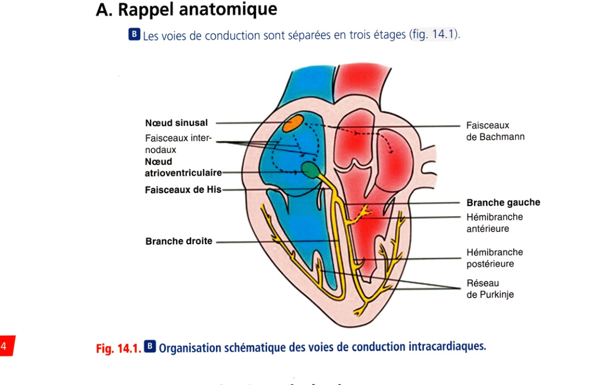
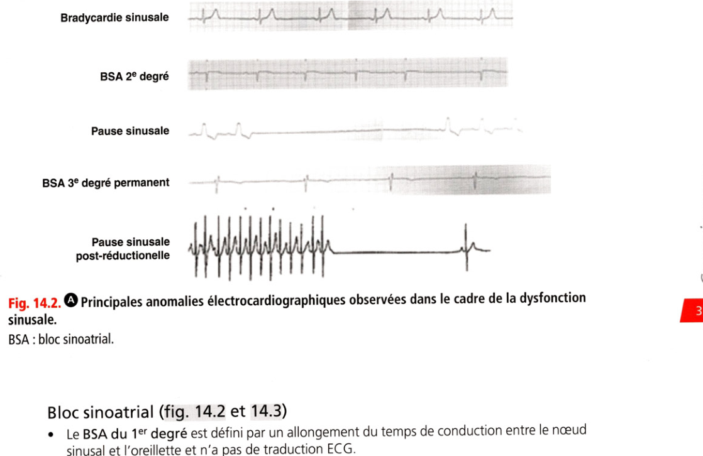
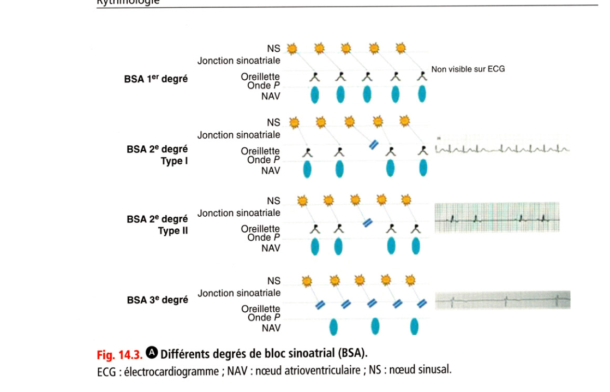
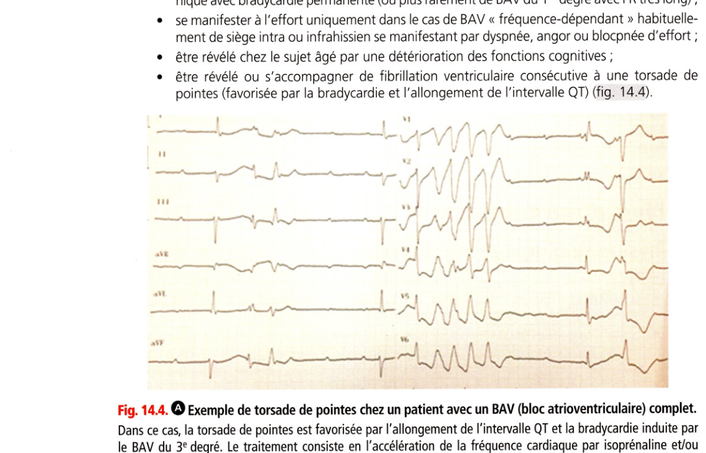
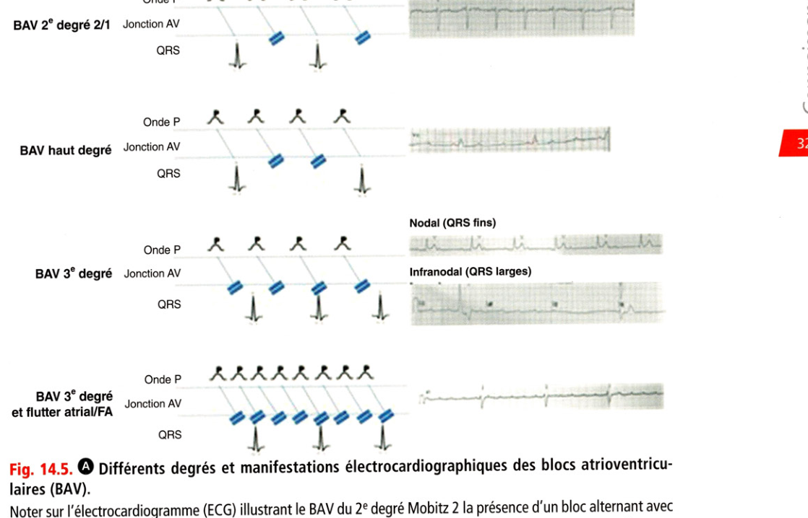
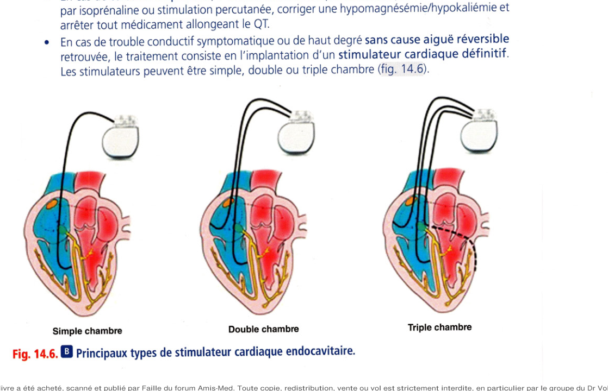
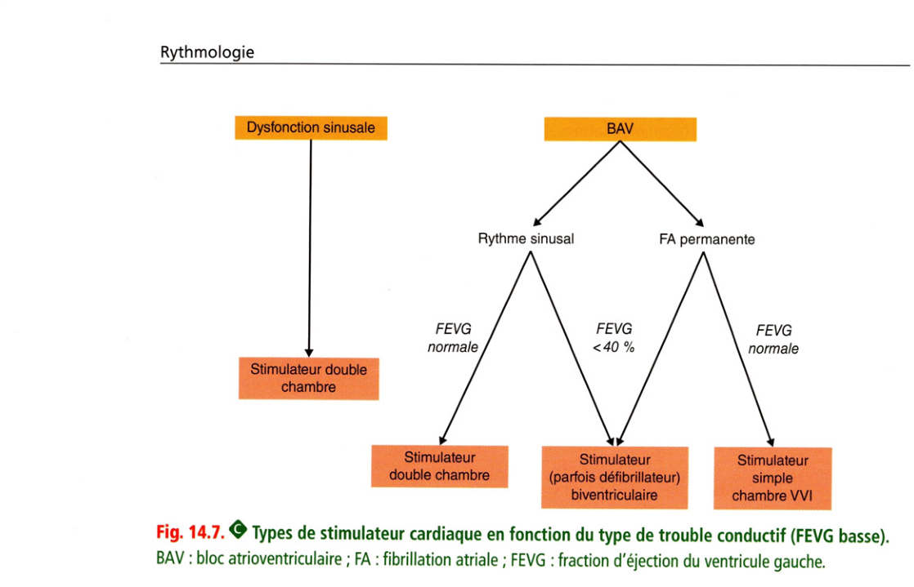

# Item 236 — Troubles de la conduction intracardiaque

> **Collège CNEC / SFC** · 3e édition (2025) · p. 312–336 · R2C  
> Partie III — Rythmologie

---

## Trois repères à ne pas confondre

| Badge | Signification (R2C) |
|---|---|
| **Rang A** | Connaissances fondamentales de fin de 2e cycle |
| **Rang B** | Connaissances essentielles, plus spécialisées |
| **Rang C** | Connaissances de 3e cycle (DES) |

Les pastilles du livre (● = A, ■ = B) sont reprises inline.

---

## Situations de départ

18 Découverte d'anomalies à l'auscultation cardiaque.  
21 Asthénie.  
27 Chute de la personne âgée.  
28 Coma et troubles de conscience.  
38 État de mort apparente.  
43 Découverte d'une hypotension artérielle.  
50 Malaise/perte de connaissance.  
64 Vertige et sensation vertigineuse.  
159 Bradycardie.  
161 Douleur thoracique.  
162 Dyspnée.  
178 Demande/prescription raisonnée et choix d'un examen diagnostique.  
185 Réalisation et interprétation d'un électrocardiogramme (ECG).  
201 Dyskaliémie.  
204 Élévation des enzymes cardiaques.  
285 Consultation de suivi et éducation thérapeutique d'un patient avec un antécédent cardiovasculaire.  
327 Annonce d'un diagnostic de maladie grave au patient et/ou à sa famille.  
328 Annonce d'une maladie chronique.  
334 Demande de traitement et investigation inappropriés.  
352 Expliquer un traitement au patient (adulte/enfant/adolescent).  
355 Organisation de la sortie d'hospitalisation.

---

## Hiérarchisation des connaissances

| Rang | Rubrique | Intitulé | Descriptif |
|---|---|---|---|
| **A** | Physiopathologie | Dysfonction sinusale, BAV, bloc de branche | Anatomie, vascularisation, caractéristiques tissulaires |
| **A** | Diagnostic positif | Évoquer dysfonction sinusale ou trouble de conduction | Symptômes, contextes et formes cliniques |
| **B** | Étiologies | Principales étiologies | Ionique, médicaments, infarctus, dégénératif, valvulopathies |
| **A** | Examens complémentaires | Examens de 1re intention | Enquête étiologique |
| **A** | Identifier une urgence | Mauvaise tolérance d'une bradycardie | Sémiologie, hyperkaliémie, SCA |
| **A** | Prise en charge | Médicaments tachycardisants et urgence | Atropine, isoprénaline, stimulation temporaire |
| **A** | Prise en charge | Indications de stimulateur définitif | Dysfonction sinusale, BAV, blocs de branche |

---

## Parcours Rang A

- [II. Dysfonction sinusale](#ii-dysfonction-sinusale)
- [III. Blocs atrioventriculaires](#iii-blocs-atrioventriculaires)
- [IV. Blocs de branche](#iv-blocs-de-branche)
- [V. Thérapeutique et suivi du patient](#v-thérapeutique-et-suivi-du-patient)

---

## Sommaire

- [Vignette clinique](#vignette-clinique)
- [I. Définitions](#i-définitions)
- [II. Dysfonction sinusale](#ii-dysfonction-sinusale)
- [III. Blocs atrioventriculaires](#iii-blocs-atrioventriculaires)
- [IV. Blocs de branche](#iv-blocs-de-branche)
- [V. Thérapeutique et suivi du patient](#v-thérapeutique-et-suivi-du-patient)
- [Points](#points)
- [Notions indispensables et inacceptables](#notions-indispensables-et-inacceptables)
- [Réflexes transversalité](#réflexes-transversalité)
- [Entraînement](../../Entrainement/QI/236_Troubles_conduction.md)

---

## Vignette clinique

Un homme de 81 ans se présente au service des urgences pour un malaise sans perte de connaissance, accompagné d'une asthénie et d'une dyspnée sans douleur thoracique évoluant depuis 2 jours. À l'exa- men clinique, les constantes vitales révèlent une bradycardie à 32 bpm.

> Quel examen proposez-vous immédiatement ? Quelles sont les hypothèses diagnostiques les plus

probables que cet examen pourra confirmer ?

> Que recherchez-vous à l'interrogatoire et à l'examen clinique ?

> Quels examens paracliniques envisagez-vous ?

> S'agit-il d'une situation d'urgence ? Faut-il hospitaliser le patient ? Quel peut-être le risque

immédiat ?

> Quelles étiologies réversibles faut-il éliminer ?

> En cas de mauvaise tolérance hémodynamique, quels traitements temporaires peut-on proposer ?

> En l'absence de cause réversible, quel traitement faut-il envisager ?

# I. Définitions

**Rang B.**

## A. Rappel anatomique

**Rang B.** Les voies de conduction sont séparées en trois étages (fig. 14.1).

**Fig. 14.1.** Voies de conduction intracardiaques

## B. Sur le plan physiopathologique

• La pathologie qui touche au fonctionnement du nœud sinusal (NS) s'appelle la dysfonc- tion sinusale qui comprend les troubles de l'automatisme sinusal et le bloc sinoatrial.

• Le bloc atrioventriculaire (BAV) est défini par une atteinte de la jonction atrioventriculaire et/ou une atteinte bilatérale des branches de division du faisceau de His.

• L'atteinte systématisée d'une ou des branches du faisceau de His entraîne des blocs de branche ou des hémiblocs.

• La conduction intraventriculaire n'est pas l'exclusivité du réseau de Purkinje, elle se fait au sein du myocarde ventriculaire (y compris septal) de proche en proche, mais lentement, ce qui peut conduire à un allongement de la durée du complexe QRS en cas de pathologie myocardique entraînant des blocs intraventriculaires non systématisés.

• On oppose le tissu nodal qui constitue le nœud sinusal et le nœud atrioventriculaire (NAV) au tissu de type « His-Purkinje » qui compose le faisceau de His, les branches du faisceau de His et le réseau de Purkinje. La conduction dans le NAV est lente et décrémentielle comparée à la conduction au sein du « His-Purkinje » où la conduction est rapide et répond à la loi du « tout ou rien ». Le nœud sinusal et le NAV sont fortement influencés par le système nerveux autonome, contrairement au tissu « His-Purkinje ».

• Dans les BAV, il faut séparer l'atteinte nodale (suprahissienne) de l'atteinte du faisceau de His et au-delà (hissienne ou infrahissienne) pour des raisons de gravité.

• Noter la hiérarchie décroissante des fréquences d'échappement des différentes structures :

- 40-60 bpm à QRS fins stable pour le NAV ;

- 35-45 bpm à QRS fins instable pour le faisceau de His ;

- < 40 bpm à QRS larges instable pour les branches et les ventricules (infrahissiens). Il faut ainsi bien différencier en termes de gravité les troubles conductifs suprahissiens (dysfonction sinusale et bloc nodal), ayant un rythme d'échappement plus stable et de fréquence plus élevée, des troubles conductifs hissiens ou infrahissiens, ayant un rythme d’échappement instable de fréquence plus basse. Au sein de l'oreillette, il n'existe pas de structure de conduction bien définie mais plutôt des voies de conduction préférentielles (faisceau internodal antérieur, moyen et postérieur). Le faisceau de Bachmann naît du tissu internodal antérieur pour dépolariser l'oreillette gauche à travers le septum interatrial.

---

# II. Dysfonction sinusale

**Rang A** · **Rang B**.

## A. Physiopathologie et mécanismes

**Rang A.** Le nœud sinusal est une structure en forme de croissant mesurant de 1 à 2 cm, situé

dans l'atrium droit, au niveau de la jonction avec la veine cave supérieure et s'étendant vers le bas. Les cellules du nœud sinusal sont dotées d'un automatisme produisant de manière cyclique une activité électrique qui initie chaque nouveau battement cardiaque au cours du rythme sinusal normal (fréquence entre 50 et 100 bpm). On le considère comme le « pace- maker naturel du cœur ». L'activité électrique du nœud sinusal n'est pas enregistrée par l'ECG de surface car de trop faible amplitude.

• Dans la dysfonction sinusale, on définit de manière schématique d'une part les anomalies de l'automatisme sinusal et d'autre part les troubles de conduction avec perte de la transmission de son activité électrique à l'atrium droit par bloc sinoatrial.

• La dysfonction sinusale est le plus souvent associée au vieillissement et généralement liée à un phénomène de fibrose. Elle affecte 0,03 % de la population et sa prévalence augmente avec l'âge.

• Elle est souvent associée à une atteinte plus globale de l'oreillette et à la fibrillation atriale, défi- nissant dans ce cas la maladie rythmique atriale ou syndrome de bradycardie-tachycardie.

• Le nœud sinusal est sous étroite dépendance du système nerveux autonome. Le système sym- pathique augmente la fréquence de l'automatisme alors que le système parasympathique la diminue. La dysfonction sinusale peut être parfois uniquement de mécanisme vagal.

• Le nœud sinusal est vascularisé par une branche de l'artère coronaire droite ou de l'artère circonflexe.

• La dysfonction sinusale peut faire suite à la prise d'un médicament bradycardisant.

• En cas de dysfonction sinusale permanente ou avec pauses prolongées, un rythme d'échap- pement peut naître du NAV (rythme de secours).

## B. Aspects cliniques

### 1. Présentation clinique et symptômes

**Rang A.** La dysfonction sinusale peut :

• rester latente et asymptomatique pendant de nombreuses années ;

• s'accompagner de signes cliniques liés à la baisse du débit sanguin cérébral en cas de bradycardie ou de pauses : lipothymies, syncopes à l'emporte-pièce (Adams-Stokes) ou symptômes plus trompeurs comme des pseudovertiges ;

• s'accompagner de signes liés à la réduction du débit cardiaque : réduction de la capacité à l'effort, dyspnée d'effort, asthénie, angor ou insuffisance cardiaque ;

• être révélée par des palpitations ou par une embolie artérielle si elle est associée à une fibrillation atriale dans le cadre de la maladie rythmique atriale ;

• être parfois révélée chez le sujet âgé par une détérioration des fonctions cognitives.

### 2. Étiologies

**Rang B.** On distingue les dysfonctions sinusales intrinsèques, résultat d'un dysfonctionnement

organique de la fonction du nœud sinusal (le plus souvent permanent), des causes extrin- sèques (le plus souvent réversibles) (encadré 14.1).

**Encadré 14.1 — Principales étiologies de la dysfonction sinusale**

**Causes extrinsèques**

- Prise médicamenteuse (bêtabloquant, inhibiteur calcique bradycardisant, amiodarone ou autre antiarythmique, ivabradine, digitalique, clonidine, etc.)

- Origine vagale : hypertonie vagale (athlète), réflexe vagal, hypersensibilité sinocarotidienne

- Atteinte du SNC : HIC, syndromes méningés

- Troubles hydroélectrolytiques (hyperkaliémie)

- Hypoxie, hypercapnie ou acidose sévères, SAOS

- Hypothermie, hypothyroïdie, ictère rétentionnel sévère

**Causes intrinsèques**

- Âge, vieillissement

- Maladie coronarienne chronique et aiguë

- Cardiomyopathies, myocardites, cardiopathies congénitales, tumeurs

- Maladies infiltratives (sarcoïdose, amylose, hémochromatose) ou systémiques

- Post-chirurgicales (valvulaire, CIA, transplantation)

- Troubles conductifs héréditaires, dystrophies neuromusculaires

### 3. Diagnostic ECG

• **Rang A.** Constatation d'une bradycardie sinusale inappropriée en situation d'éveil < 50 bpm (et < 40/min la nuit chez l'adulte)

• Mise en évidence d'une absence d'accélération de la fréquence cardiaque à l'effort (on parle d'incompé- tence chronotrope) ;

• Mise en évidence de pauses sinusales sans onde P visible, considérées comme pathologiques au-delà de 3 secondes

• Mise en évidence d'un bloc sinoatrial (BSA) du 2e ou 3e degré (cf. infra)

• Syndrome bradycardie-tachycardie ou pauses post-réductionnelles

• Pause sinusale symptomatique > 3 secondes induite par le massage sinocarotidien (hypersensibilité sinocarotidienne) ou le tilt-test Pause ou arrêt sinusal (fig. 14.2)

**Fig. 14.2.** Pause sinusale et blocs sinoatriaux

Il s'agit soit d'une anomalie de l'automatisme sinusal, soit le plus souvent d'un BSA du 3e degré paroxystique. On visualise une pause cardiaque sans onde P visible (asystolie) qui s'interrompt par une activité atriale différente de l'onde P sinusale (échappement atrial) ou par un complexe QRS jonctionnel non précédé d'onde P (échappement jonctionnel).

### Bloc sinoatrial (fig. 14.2 et 14.3)

• Le BSA du 1er degré est défini par un allongement du temps de conduction entre le nœud sinusal et l'oreillette et n'a pas de traduction ECG.

• Le BSA du 2e degré se manifeste par un blocage intermittent de la conduction entre le nœud sinusal et l'oreillette.

- Dans le BSA du 2e degré de type I (Wenckebach sinoatrial), les ondes P se succèdent et sont irrégulières jusqu'à la survenue d'une pause sinusale de durée inférieure au double du cycle sinusal le plus court.

- Dans le BSA du 2e degré de type II, on observe des pauses inopinées ou régulières dont le cycle correspond à un multiple du cycle sinusal intrinsèque (2/1, 3/1).

• Le BSA du 3e degré consiste en une bradycardie à échappement jonctionnel (QRS fins) sans activité atriale sinusale visible (activité atriale rétrograde parfois visible). NS $ Jonction sinoatriale BSA 1er deqré Oreillette 3 NAV Non visible sur ECG NS Jonction sinoatriale Oreillette Type I NAV NS Jonction sinoatriale Oreillette NAV Type II NS Jonction sinoatriale Oreillette NAV BSA 3e degré

**Fig. 14.3.** Différents degrés de bloc sinoatrial (BSA)

ECG : électrocardiogramme ; NAV : nœud atrioventriculaire ; NS : nœud sinusal. Insuffisance chronotrope Il s'agit d'une incapacité à accélérer suffisamment la fréquence sinusale spontanée lors de l'effort. On considère en général comme valeur seuil pathologique une fréquence cardiaque maximale inférieure à 75 % de la fréquence maximale théorique. Sur le tracé holter, on observe une courbe de fréquence aplatie. Bradycardie sinusale inappropriée Certaines personnes présentent une bradycardie sinusale marquée (< 50 bpm le jour) en absence de causes extrinsèques pouvant expliquer la bradycardie. Elle est en général bien tolérée, des symptômes peuvent apparaître avec l'âge. Maladie rythmique de l'oreillette On différencie le syndrome brady/tachy (qui correspond à la coexistence chez un patient de dysfonction sinusale et de troubles du rythme atrial), des pauses post-réductionnelles (qui correspondent à des pauses sinusales à l'arrêt du trouble du rythme atrial en rapport avec une « sidération » du nœud sinusal) (cf. fig. 14.2).

### 4. Formes cliniques

Dysfonction sinusale dégénérative liée à l'âge Il faut identifier la prise d'éventuels bradycardisants (bêtabloquants surtout, attention aux collyres), et se méfier chez le sujet âgé de signes trompeurs (chutes à répétition, déclin cognitif, etc.). La dysfonction sinusale s'accompagne souvent dans ce cas de FA (maladie de l'oreillette avec syndrome brady/tachy ou pauses post-réductionnelles) et/ou de troubles conductifs associés touchant le NAV car la fibrose du nœud sinusal et de l'oreillette s'étend au NAV avec l'âge. Il faut souvent traiter. Dysfonction sinusale par hypervagotonie Il concerne souvent un sportif ou un jeune athlète (sport d'endurance, marathon, vélo, etc.) asymptomatique. La dysfonction sinusale est liée à l'hypertonie vagale. Il ne faut pas traiter. C Évaluation

### 1. Méthodes diagnostiques

• **Rang A.** Le diagnostic repose sur l'enregistrement ECG : soit sur un enregistrement classique ECG 12D, soit au cours d'un monitorage ou d'un enregistrement ECG continu holter. Il est nécessaire de confirmer que les anomalies ECG sont bien responsables des symptômes, cette corrélation est en général obtenue par l'enregistrement holter avec tenue d'un journal des symptômes, il faut répéter ou prolonger cet enregistrement si besoin. En cas de symptômes peu fréquents, un enregistreur externe de longue durée ou un moniteur cardiaque implantable peut être proposé au patient.

• Le test d'effort est utile pour diagnostiquer les insuffisances chronotropes.

• Le massage sinocarotidien peut permettre de mettre en évidence des pauses sinusales symptomatiques dans le cas de l'hypersensibilité sinocarotidienne. Si un mécanisme vagal est suspecté, le test d'inclinaison (tilt-test) peut mettre en évidence des pauses sinusales ou un BSA d'origine vagale.

• <£► L'exploration électrophysiologique endocavitaire (EEP) n'est pas recommandée de manière systématique mais peut être proposée en cas d'exploration de syncope (recom- mandations ESC 2018, classe llb).

### 2. Enquête étiologique

0 Elle doit comporter au minimum une échocardiographie et un bilan biologique en cas de dysfonction sinusale sévère symptomatique (ionogramme sanguin, créatinine, troponine), la recherche clinique de causes extrinsèques ; les autres examens sont réalisés sur signe d'appel.

### 3. Degré d'urgence de la prise en charge

**Rang A.** II dépend du degré du trouble conductif et des symptômes. Les BSA du 3e degré et les

syncopes avec dysfonction sinusale à l'ECG nécessitent une hospitalisation en urgence. Les autres cas peuvent être le plus souvent gérés de manière différée et ambulatoire.

---

# III. Blocs atrioventriculaires

**Rang A** · **Rang B**.

## A. Physiopathologie et mécanismes

• **Rang A.** Le NAV est situé dans l'oreillette droite en avant et en haut de l'ostium du sinus coronaire.

• Le faisceau de His est la seule communication entre oreillettes et ventricules, et chemine dans le septum membraneux sous la racine de l'aorte.

• Les cellules nodales ont une conduction décrémentielle lente dépendante du courant entrant de calcium. Cela s'exprime par ce que l'on appelle le phénomène de Wenckebach qui voit s'allonger progressivement la conduction dans le NAV quand on stimule l'oreillette à une fré- quence croissante jusqu'à atteindre la période réfractaire du NAV. Les cellules du His-Purkinje sont le siège d'une conduction rapide qui s'effectue selon la loi du « tout ou rien ».

• Le NAV est aussi sous étroite dépendance du système nerveux autonome contrairement au His-Purkinje. Le système sympathique augmente la vitesse de conduction dans le NAV quand le système parasympathique la diminue.

• Le NAV est vascularisé le plus souvent par une branche de l'artère coronaire droite qui naît de la croix des sillons (artère du NAV). Le faisceau de His et ses branches sont vascularisés par la première branche septale de l'interventriculaire antérieure et par l'artère du NAV.

• En cas de BAV complet, la tolérance et le pronostic dépendent surtout des propriétés des foyers de suppléance (échappement). Plus ce foyer est bas situé, plus il est lent et instable. En cas de BAV complet de siège nodal, les rythmes d'échappement sont nodohissiens hauts assurant une fréquence stable entre 40 et 60/min. En cas de BAV infranodaux, c'est-à-dire dans le faisceau de His ou infrahissiens, le rythme d'échappement est instable et plus lent (15 à 40/min), pou- vant être la source d'asystolie plus ou moins longue, ce qui fait la gravité de cette localisation.

• Les BAV sont le plus souvent liés au vieillissement et sont fréquents chez le sujet âgé.

• On considère leur prévalence à 4/10 000 dans la population adulte, prévalence qui aug- mente avec l'âge.

## B. Aspects cliniques

### 1. Présentation clinique

**Rang A.** Un BAV peut :

• être totalement asymptomatique, c'est le cas du BAV du 1er degré et de la plupart de ceux du 2e degré ;

• s'accompagner de signes cliniques liés à la baisse du débit sanguin cérébral en cas de bradycardie ou de pauses : lipothymies, syncopes à l'emporte-pièce (Adams-Stokes) ou symptômes plus trompeurs comme des pseudovertiges ;

• s'accompagner de signes liés à la réduction du débit cardiaque : réduction de la capacité à l'effort, dyspnée, asthénie chronique, angor ou insuffisance cardiaque en cas de BAV chro- nique avec bradycardie permanente (ou plus rarement de BAV du 1er degré avec PR très long) ;

• se manifester à l'effort uniquement dans le cas de BAV « fréquence-dépendant » habituelle- ment de siège intra ou infrahissien se manifestant par dyspnée, angor ou blocpnée d'effort ;

• être révélé chez le sujet âgé par une détérioration des fonctions cognitives ;

• être révélé ou s'accompagner de fibrillation ventriculaire consécutive à une torsade de pointes (favorisée par la bradycardie et l'allongement de l'intervalle QT) (fig. 14.4). y

**Fig. 14.4.** Torsade de pointes sur BAV complet

Dans ce cas, la torsade de pointes est favorisée par l'allongement de l’intervalle QT et la bradycardie induite par le BAV du 3e degré. Le traitement consiste en l'accélération de la fréquence cardiaque par isoprénaline et/ou stimulation cardiaque.

### 2. Étiologies

**Rang A.** De très nombreuses affections peuvent être responsables de BAV. La cause la plus fréquente

chez le sujet âgé est la cause dégénérative liée au vieillissement (encadré 14.2).

**Encadré 14.2 — Principales étiologies des blocs atrioventriculaires**

**Causes extrinsèques**

- Médicaments bradycardisants (bêtabloquant, inhibiteur calcique, amiodarone, digitalique)

- Hypertonie vagale (athlète) ou réflexe vagal

- Troubles hydroélectrolytiques (hyperkaliémie)

**Causes intrinsèques**

- Âge : dégénérescence fibreuse ± calcifications (maladie de Lenègre)

- Maladie coronarienne chronique

- IDM : nodal dans l'infarctus inférieur (souvent régressif) ; hissien/infrahissien dans l'infarctus antérieur (mauvais pronostic)

- RA calcifié dégénératif ; TAVI, chirurgie valvulaire

- Infectieuses : endocardite (abcès d'anneau), Lyme, myocardites virales

- Infiltratives (sarcoïdose, amylose), radique, BAV congénital, héréditaire

Du fait de sa faible sensibilité aux facteurs extrinsèques, le His-Purkinje est plus souvent le siège de BAV dégénératifs (paroxystiques ou permanents). Les BAV peuvent être permanents ou paroxystiques. Une cause aiguë réversible doit toujours être recherchée, en particulier : ischémique, métabolique, infectieuse ou inflammatoire, médicamenteuse.

### 3. Diagnostic ECG

• **Rang A.** Il faut préciser le type de bloc : 1er, 2e ou 3e degré, son caractère paroxystique ou permanent, son caractère congénital ou acquis, et surtout son siège (nodal ou infranodal, tableau 14.1).

**Tableau 14.1.** Classification des blocs atrioventriculaires (BAV).

| Degré | Siège | QRS | Symptômes |

|---|---|---|---|

| **BAV 1er degré** | Généralement nodal (exceptionnellement intrahissien) | Fins sauf BB associé | Non (sauf PR très long) |

| **BAV 2e degré Mobitz 1** | Toujours nodal | Fins sauf BB associé | ± |

| **BAV 2e degré Mobitz 2** | Toujours hissien ou infrahissien | Fins (intrahissien) ou plus souvent larges | ± |

| **BAV de haut degré** | Hissien ou infrahissien (rarement nodal) | Larges ; fins si nodal/intrahissien | Oui |

| **BAV 3e degré (complet)** | Nodal, hissien ou infrahissien | Fins si nodal/intrahissien ; larges si infrahissien | Oui |

BB : bloc de branche.

• Le diagnostic est électrocardiographique, soit sur un enregistrement classique ECG 12D, soit au cours d'un monitorage ou d'un enregistrement holter.

• Les blocs nodaux sont souvent responsables de BAV du 1er degré ou de BAV du 2e degré type Mobitz 1, ou de BAV complet à échappement nodohissien stable à QRS fins à 40-60 bpm. Ils sont améliorés par l'atropine, l'isoprénaline et l'effort. Ils sont aggravés par le massage sinocarotidien.

• Les blocs dans le faisceau de His ou infrahissiens surviennent au préalable sur des blocs de branche et sont responsables de BAV du 2e degré de type Mobitz 2 et de BAV du 3e degré à échappement infranodal. Lorsqu'ils sont complets, il y a un risque de décès par asys- tolie et torsades de pointes, le rythme d'échappement est inconstant, instable et lent < 35-40 bpm. Ils peuvent être améliorés par le massage sinocarotidien et l'isoprénaline, et aggravés par l'atropine et l'effort.

• La morphologie du complexe QRS ne permet pas toujours à elle seule d'évaluer le siège du bloc mais une durée de QRS < 120 ms est très en faveur d'un bloc nodal (cf. infra). Les BAV intrahissiens sont rares mais constituent un piège classique car les QRS sont en général fins. Les caractéristiques ECG sont les suivantes (fig. 14.5) :

• BAV du 1er degré : allongement fixe et constant de l'intervalle PR > 200 ms ;

• BAV du 2e degré de type Mobitz 1 ou Luciani-Wenckebach :

- allongement progressif de l'intervalle PR jusqu'à l'observation d'u ule onde P blo- quée suivie d'une onde P conduite avec un intervalle PR plus court,

- parfois associé à un BAV2/1,

- en règle, de siège nodal et le plus souvent à QRS fins (< 120 ms) ;

• BAV du 2e degré de type Mobitz 2 :

- survenue inopinée d'une seule onde R bloquée O,

- pas d'allongement de l'intervalle PR précédant l'onde P bloquée,

- évolution fréquente vers le BAV complet,

- en règle, de siège infranodal et le plus souvent à QRS larges ;

• BAV de haut degré (parfois assimilé au Mobitz 2) :

- plusieurs ondes P bloquées consécutives?) ■ou conductiop;rythmée, par exemple deux ondes P bloquées et une conduite (on parle de BAV 3:1), évolution fréquente vers jé- A tomplet,

- en règle, de siège infranodal et le plus souvent à QRS larges ;

• BAV du 2e degré de type 2/1 :

- inclassable en Mobitz 1 ou 2,

- deux ondes P pour un QRS,

- largeur de QRS = élément d'orientation pour le siège du bloc (QRS larges en faveur du siègéïnfranodal) ;

• BAV du 3e degré ou complet :

- auH>ne onde P conduite,

- activités atriale et ventriculaire dissociées,

- battements des ventricules plus lents que ceux de l'oreillette, par échappement de fré- quence variable en fonction du siège du bloc,

- siège du bloc orienté par la durée du QRS et la fréquence de l'échappement,

- intervalle QT susceptible de s'allonger et risque de torsades de pointes ;

• BAV complet et fibri llation/fIutter atrial :

- bradycardie au lieu de la tachycardie usuelle de la FA,

- rythme ventriculaire régulier au lieu des irrégularités liées à la FA,

- QRS fins ou larges en fonction du siège du bloc.

**Fig. 14.5.** Degrés et manifestations ECG des BAV

### 4. Quelques formes cliniques typiques

### BAV dégénératif du sujet âgé

Il s'agit de la forme clinique la plus fréquente. Chez le sujet âgé, les symptômes peuvent parfois être atypiques (activité réduite, bas débit cérébral). Il faut toujours évoquer une cause iatrogène associée possible (médicaments). La largeur du QRS renseigne souvent sur le siège du bloc.

### BAV complet sur infarctus

Il est observé dans 2-5 % des cas, de manière plus fréquente dans les infarctus du myocarde (IDM) inférieurs que dans les IDM antérieurs.

• Dans les IDM inférieurs, son siège est en règle générale nodal (> 90 % des cas). Il survient de manière progressive, souvent précédé de BAV du 1er puis du 2e degré à QRS fins, par- fois asymptomatiques. Au stade de BAV du 3e degré, l'échappement est le plus souvent à QRS fins. Le mécanisme peut être vagal quand il survient de manière précoce, ou être lié à l'ischémie. Il est alors le témoin d'une atteinte de l'artère du NAV, plutôt de bon pronostic en soi, bien qu'associée à une surmortalité car associé à des dégâts myocardiques souvent étendus et à un âge plus avancé. Le bloc est parfois favorisé par les bêtabloquants ou la reperfusion ; le BAV fait contre-indiquer les bêtabloquants en aigu. Il est en règle régressif. Il répond bien à l'atropine et peut parfois nécessiter une stimulation temporaire s'il est mal toléré, l'isoprénaline étant contre-indiquée dans le contexte d'IDM aigu. S'il est non régressif à J5, il fait discuter la pose d'un stimulateur.

• Les BAV survenant dans le contexte d'IDM antérieur sont beaucoup plus rares et de siège infranodal. Ils témoignent le plus souvent d'un IDM étendu. Ils surviennent brutalement, souvent précédés par un bloc de branche. Ils sont associés à une importante mortalité liée à l'étendue de la nécrose. Une stimulation temporaire est le plus souvent nécessaire, l'isoprénaline étant contre-indiquée dans le contexte d'IDM aigu, et ils nécessitent plus fréquemment une stimulation définitive en cas de non-régression. BAV congénital

**Rang B.** II représente 3 à 5 % des BAV et touche plutôt les filles (60 %). Il concerne une naissance

sur 20 000. Il est le plus souvent de cause immunologique, lié à un passage transplacentaire d'anticorps maternels anti-Ro/SSA chez une mère atteinte d'un lupus érythémateux ou d'un syndrome de Gougerot-Sjôgren. Il s'agit parfois de BAV de cause génétique. Ce peut être un diagnostic de bradycardie foetale ou néonatale. BAV chez les patients en FA permanente On parle dans ce cas de bradyarythmie (à ne pas confondre avec la maladie rythmique atriale qui associe FA le plus souvent paroxystique et dysfonction sinusale). Il s'agit d'un tableau de FA permanente lente avec des pauses pathologiques (> 3 secondes) ou avec un rythme lent régulier (BAV du 3e degré) ou irrégulier (BAV du 2e degré).

## C. Évaluation

**Rang A.** Le contexte clinique du diagnostic est celui d'une bradycardie en situation d'éveil ou celui

de l'évaluation d'une lipothymie ou d'une syncope.

### 1. Méthodes diagnostiques

• **Rang A.** Si le bloc est permanent, l'ECG suffit au diagnostic.

• En cas de suspicion de BAV non permanent, un enregistrement ECG continu holter ou par- fois la mise en place d'un moniteur cardiaque implantable peuvent être nécessaires pour mettre en évidence un BAV.

• En cas de suspicion de BAV paroxystique de siège infranodal dans le cadre du bilan d'une syncope en présence de troubles conductifs intraventriculaires (bloc de branche ou bloc bifasciculaire) sur l'ECG, il faut proposer une exploration électrophysiologique endoca- vitaire (EEP) pour mesurer l'intervalle HV. Un intervalle HV >70 ms est considéré comme pathologique signant une atteinte infrahissienne. Le bloc intrahissien se manifeste par un intervalle hissien (H) dédoublé (H1-H2), et est beaucoup plus rare.

### 2. Enquête étiologique

• L'enquête étiologique commence par rechercher une cause aiguë curable ou sponta- nément réversible : syndrome coronarien aigu (dans le territoire inférieur surtout), prise de médicament bradycardisant, hyperkaliémie ou parfois myocardite.

• L'enquête étiologique doit comporter au minimum : un ionogramme sanguin, une écho- cardiographie et un dosage de la troponine ; les autres examens sont réalisés selon le contexte.

• Chez le sujet jeune (< 50 ans) ou en cas de contexte clinique évocateur, le bilan doit être approfondi, en particulier à la recherche d'une myocardite de cause inflammatoire/ infectieuse avec IRM cardiaque ou d'une cause génétique.

### 3. Degré d'urgence de la prise en charge

**Rang A.** Les BAV à risque vital nécessitant une hospitalisation sont les BAV du 3e degré, les BAV

du 2e degré Mobitz 2, les BAV de haut degré. Les autres cas peuvent être le plus souvent gérés de manière différée en ambulatoire.

---

# IV. Blocs de branche

**Rang A** · **Rang B**.

## A. Physiopathologie et mécanismes

• **Rang A.** Le faisceau de His se divise en une branche droite et une gauche, qui se subdivise en fascicules ou hémibranches : antérieure fine et postérieure épaisse.

• Les branches sont peu sensibles aux effets du système nerveux autonome.

• Elles se ramifient en réseau de Purkinje et ont la même nature histologique que lui. Les cellules sont peu sensibles à l'ischémie et sont quasiment dépourvues d'activité mécanique.

• Un bloc de branche correspond à un ralentissement ou une interruption de la conduc- tion dans une branche.

## B. Aspects cliniques

### 1. Présentation clinique

• Un bloc de branche est toujours asymptomatique s'il est isolé.

• Un bloc de branche est de découverte :

- soit fortuite, par un ECG pratiqué lors d'une visite de contrôle ;

- soit au cours du suivi d'une maladie cardiovasculaire.

• Accompagné de lipothymies ou de syncopes, il prend une valeur de gravité immédiate pour deux raisons : il peut signer la présence d'une cardiopathie (c'est surtout vrai pour le bloc de branche gauche) ou suggère un BAV paroxystique comme cause des symptômes.

### 2. Étiologies

• **Rang A.** Le bloc de branche droit (BBD) isolé peut être bénin et considéré comme une variante de la normale, qu'il soit complet ou incomplet, mais peut parfois témoigner d'une cardio- pathie sous-jacente, en particulier du ventricule droit. Le BBD est quasi systématiquement observé dans la plupart des cardiopathies congénitales touchant le ventricule droit, et sur- tout dans la pathologie pulmonaire avec retentissement cardiaque (hypertension pulmo- naire, séquelle d'embolie pulmonaire, etc.).

• Le bloc de branche gauche (BBG) n'est jamais considéré comme bénin, il est soit dégéné- ratif, soit associé à une cardiopathie.

• Au cours d'un syndrome coronarien aigu, on peut observer l'apparition d'un bloc de branche droit ou gauche. Au cours de l'infarctus antérieur, l'apparition d'un bloc de branche gauche est le témoin d'une atteinte infrahissienne de mauvais pronostic car associée à des lésions très étendues avec insuffisance cardiaque ou choc cardiogénique.

• Les autres causes sont identiques à celles des BAV : les causes électrolytiques sont domi- nées par l'hyperkaliémie, les médicaments qui bloquent le courant de sodium comme les antiarythmiques de classe I (ex : flécaïnide) ou les antidépresseurs tricycliques.

• Certains blocs de branche sont fréquence-dépendants, c'est-à-dire qu'ils apparaissent lorsque la fréquence ventriculaire augmente.

### 3. Diagnostic ECG

**Rang A.** Cf. chapitre 1 5 pour des illustrations plus détaillées.

Il faut :

• préciser le type de bloc :

- incomplet pour une durée de QRS < 120 ms ; dans ce cas, il a peu de valeur sémio- logique ou clinique,

- complet si la durée de QRS dépasse 120 ms ;

• préciser ensuite s'il est de branche droite (QRS positif en V1) ou de branche gauche (QRS négatif en V1) ou bifasciculaire ou trifasciculaire (cf. chapitre 15) ; Il faut d'abord vérifier que le rythme est sinusal, cependant un bloc de branche peut être asso- cié à une tachycardie supraventriculaire. BBD complet Il est caractérisé par :

• durée de QRS > 120 ms ;

• axe normal ;

• en V1 : QRS positif avec aspect rsR1;

• en V6 : aspect qRs avec onde S traînante et le plus souvent arrondie ;

• en aVR : aspect qR ;

• ondes T en général négatives en V1-V2, parfois V3 ne devant pas faire évoquer à tort une ischémie myocardique. BBG complet Il est caractérisé par :

• durée de QRS > 120 ms ;

• axe normal ou gauche ;

• en V1 : QRS négatif avec aspect rS ou QS ;

• en aVR : aspect QS ;

• en D1, V6 : R avec notch ;

• ondes T en général négatives en D1, aVL, V5-V6 ne devant pas faire évoquer à tort une ischémie myocardique ;

• éventuel léger sus-décalage de ST en V1-V2-V3 ne devant pas faire évoquer à tort un SCA avec sus-décalage du segment ST mais qui ne dépasse pas 1 mm le plus souvent. Le diag- nostic d'infarctus est gêné par le bloc de branche gauche ; dans ce cas, la prise en charge devient celle d'un SCA avec sus-décalage de ST. Hémibloc ou bloc fasciculaire antérieur gauche (HBAG) Il est caractérisé par :

• déviation axiale du QRS gauche au-delà de -45° (en pratique négativité en D2) ;

• durée de QRS < 120 ms ;

• en D1-aVL : aspect qR ;

• en D2, D3, aVF : aspect rS (on retient le moyen mnémotechnique S3 > S2) ;

• en V6 : onde S. Hémibloc ou bloc fasciculaire postérieur gauche (HBPG) Il est caractérisé par :

• déviation axiale du QRS droite > +90° (en pratique négativité en D1 avec aspect S1Q3) en l'absence de pathologie du ventricule droit ou de morphologie longiligne ;

• durée de QRS < 120 ms ;

• en D1 -aVL : aspect RS ou Rs ;

• en D2, D3, aVF : aspect qR (on retient le moyen mnémotechnique S1Q3 : onde S en D1 et onde Q en D3). Blocs bifasciculaires La sémiologie s'additionne : BBD + HBAG ou BBD + HBPG.

### 4. Quelques formes cliniques typiques

Bloc bifasciculaire avec perte de connaissance Le plus souvent, il s'agit d'une association de bloc de branche droit et d'hémibloc antérieur (plus rarement postérieur) gauche. Il peut y avoir un BAV du 1er degré associé. Il faut rechercher une cardiopathie sous-jacente et réaliser, en cas de symptômes ou de certaines pathologies, une étude électrophysiologique endocavitaire pour mesurer la conduction infrahissienne qui peut conduire, si elle est pathologique (intervalle HV > 70 ms), à la mise en place d'un stimulateur cardiaque. Blocs de branche de l'infarctus antérieur Un bloc de branche est observé dans 10 % des cas, de type bloc uni, bi ou trifasciculaire, soit préexistant, soit acquis pendant l'infarctus. Ce dernier cas évoque une nécrose septale éten- due, avec risque de survenue brutale d'un BAV complet et asystolie, ou d'un trouble du rythme ventriculaire associé. Bloc alternant C'est une association successive de BBD complet et de BBG complet ou une alternance d'hémi- bloc antérieur gauche et d'hémibloc postérieur gauche associé à un BBD complet. C'est un bloc trifasciculaire et un équivalent de BAV complet paroxystique de siège infrahissien, donc grave.

## C. Évaluation et prise en charge

• Les situations cliniques à risque vital nécessitant une hospitalisation sont les blocs alter- nants (équivalent à un BAV de haut degré), ainsi que les syncopes typiques avec troubles conductifs à l'ECG. Les autres cas peuvent être le plus souvent gérés de manière différée en ambulatoire. En cas de bloc de branche isolé et en dehors de symptôme particulier aigu (douleur thoracique, syncope ou malaise, dyspnée), les explorations peuvent se faire de manière non urgente.

• En l'absence de documentation de BAV du 2e ou du 3e degré, la prise en charge d'un patient avec bloc de branche et syncope nécessite le plus souvent une exploration électro- physiologique endocavitaire. Si cette dernière est normale, le bilan peut être complété par la mise en place d'un moniteur cardiaque implantable.

• En cas de syncope chez un patient porteur d'une cardiopathie, un bloc de branche isolé ne peut à lui seul être tenu comme une indication certaine que la perte de connaissance est due à un BAV paroxystique. Il faut aussi évoquer la possibilité d'une tachycardie ventriculaire.

• **Rang A.** La constatation d'un BBG doit faire rechercher une hypertension artérielle méconnue ou une cardiopathie sous-jacente, à défaut c'est un bloc dégénératif. Il faut rechercher une pathologie pulmonaire ou ventriculaire droite en cas de BBD. Il faut réaliser une écho- graphie cardiaque à la recherche d'une cardiopathie éventuellement complétée par d'autres investigations selon les points d'appel cliniques.

• La constatation isolée d'un BBD typique chez un sujet jeune, asymptomatique dont l'exa- men clinique est normal, peut être considérée comme une variante de la normale.

---

# V. Thérapeutique et suivi du patient

**Rang A** · **Rang B**.

## A. Situations d'urgence et signes de gravité

• **Rang A.** Il faut évaluer la tolérance hémodynamique de la bradycardie. La mauvaise tolérance hémodynamique peut se traduire par une lipothymie ou une syncope, un angor, une insuf- fisance cardiaque, des signes de choc avec hypotension artérielle, oligurie ou signes neuro- logiques de bas débit, ou la survenue de torsade de pointes.

• La prise en charge dépend bien sûr du type de trouble conductif, du contexte clinique et de la tolérance hémodynamique. Les troubles conductifs à risque vital nécessitant une hospi- talisation urgente sont les BAV du 3e degré, les BAV du 2e degré Mobitz 2, les BAV de haut degré, les blocs alternants, les BSA du 3e degré et les syncopes typiques avec troubles conductifs à l'ECG. Une bradycardie par BAV complet est toujours plus grave qu'une bradycardie par dysfonction sinusale en raison d'un risque plus élevé de torsades de pointes et d'asystolie. Dans les autres cas de figure, la prise en charge peut le plus souvent être différée en ambulatoire.

• En cas de troubles conductifs à risque vital, il s'agit d'une urgence vitale imposant transfert en Usic, surveillance du rythme cardiaque par scope ECG, et surveillance des paramètres vitaux (pouls, PA, fréquence respiratoire, saturation, diurèse). La prise en charge immédiate d'une bradycardie mal tolérée impose une thérapeutique urgente visant à restaurer une fréquence ventriculaire adaptée.

• On doit toujours rechercher et traiter une cause aiguë réversible si elle existe, en particulier une cause ischémique (IDM ST+), la prise de médicament bradycardisant ou une hyperkaliémie.

- Il faut suspecter un IDM aigu en recherchant un sus-décalage du segment ST sur l'ECG, une douleur thoracique et un dosage de troponine. En cas de bloc de branche gauche ou de BAV du 3e degré avec échappement à QRS larges, l'ECG est non informatif pour le diagnostic d'IDM ST+ et une coronarographie urgente est à discuter en cas de suspi- cion clinique.

- Il faut toujours rechercher une hyperkaliémie qui peut donner des troubles conductifs à tous les étages, surtout dans des contextes à risque (insuffisance rénale connue, prise de médicament hyperkaliémiant, etc.). On peut retrouver des ondes T amples et poin- tues sur l'ECG.

• Il faut aussi faire une échocardiographie à la recherche d'une cardiopathie associée et évaluer la fonction ventriculaire gauche.

• En présence d'une bradycardie, en particulier de BAV du 3e degré, il est nécessaire d'éviter les molécules allongeant le QT et de corriger une hypokaliémie pour limiter le risque de torsade de pointes. La survenue de torsade de pointes est un signe de gravité.

• Il faut se tenir prêt à devoir engager une réanimation cardiorespiratoire et à réaliser une sti- mulation cardiaque temporaire (sonde d'entraînement percutanée ou stimulation externe transthoracique) en cas d'échec des médicaments, ou de survenue de trouble du rythme ventriculaire.

## B. Moyens thérapeutiques

• **Rang A.** Les moyens médicamenteux disponibles sont les substances tachycardisantes (effets chronotrope et dromotrope positifs) comme l'atropine ou l'isoprénaline (= isoprotérénol). L'atropine, que l'on prescrit en bolus IV, n'a qu'une action transitoire exclusivement sur les BAV nodaux ou la dysfonction sinusale. On privilégie l'usage de l'isoprénaline en perfu- sion continue qui a une action prolongée et est efficace sur l'ensemble des troubles conduc- tifs en général. Ce sont des traitements temporaires indiqués dans le cadre de l'urgence, dans l'attente soit de la résolution du trouble conductif, soit de l'appareillage définitif.

• La stimulation cardiaque temporaire peut être percutanée (sonde d'entraînement électro- systolique ou stimulateur externe temporaire) ou transthoracique. Il s'agit d'un mode de stimulation temporaire indiqué dans le cadre de l'urgence, le plus souvent en cas de non- réponse à l'isoprénaline et de mauvaise tolérance hémodynamique. La mise en place d'une sonde d'entraînement est un geste qui peut être associé à certaines complications (tampon- nade, thrombose). La stimulation externe transthoracique est douloureuse et demeure une solution de secours dans l'attente de l'efficacité de l'isoprénaline ou de la mise en place d'une stimulation cardiaque temporaire percutanée.

• En cas de torsade de pointes, il faut accélérer la fréquence cardiaque de manière efficace par isoprénaline ou stimulation percutanée, corriger une hypomagnésémie/hypokaliémie et arrêter tout médicament allongeant le QT.

• En cas de trouble conductif symptomatique ou de haut degré sans cause aiguë réversible retrouvée, le traitement consiste en l'implantation d'un stimulateur cardiaque définitif. Les stimulateurs peuvent être simple, double ou triple chambre (fig. 14.6). Triple chambre Double chambre Simple chambre

**Fig. 14.6.** Principaux types de stimulateur endocavitaire

• Les stimulateurs cardiaques sont implantés par voie subclavière en règle générale. On distingue par exemple les stimulateurs simple chambre qui stimulent les ventricules via une électrode vissée dans le ventricule droit et fonctionnent en mode VVI (cf. infra). Les stimulateurs double chambre stimulent successivement l'oreillette via une sonde vissée dans l'oreillette droite et le ventricule en mode double chambre (DDD). Les stimulateurs biventriculaires stimulent simultanément le ventricule droit et le ventricule gauche via une sonde supplémentaire introduite dans une branche veineuse latérale gauche du sinus coro- naire (resynchronisation) et sont indiqués en cas de nécessité de stimulation ventriculaire (BAV) en cas de dysfonction ventriculaire gauche associée. Une alternative émergente est la stimulation physiologique de l'aire de la branche gauche permettant d'obtenir des QRS stimulés plus fins. Depuis quelques années, des stimulateurs cardiaques sans sonde sont disponibles. Il s'agit d'une capsule que l'on implante par voie veineuse fémorale au niveau du ventricule droit. Pour l'instant, il s'agit de stimulateurs ne pouvant stimuler que le ven- tricule droit mais des stimulateurs cardiaques double chambres sans sonde sont en cours de développement.

• La programmation des stimulateurs (pacemakers) est classée en fonction du mode de stimulation utilisé. La nomenclature utilise un code à quatre lettres :

- 1re lettre : cavité stimulée. On utilise A pour oreillette, V pour ventricule, D pour double (oreillette + ventricule) ;

- 2e lettre : cavité où l'activité électrique est détectée, selon le même code ;

- 3e lettre : mode de fonctionnement : I pour « inhibé », T (triggered) pour « déclenché », D pour un mode mixte « inhibé + déclenché » ;

- 4e lettre R : programmation de l'asservissement (accélération de la fréquence de stimu- lation avec l'activité physique).

• D La pose d'un stimulateur est un geste effectué sous anesthésie locale ou sous sédation au bloc opératoire après consentement éclairé du patient et avec une asepsie rigoureuse en raison des risques infectieux.

## C. Indications de stimulation cardiaque définitive

• Dans la dysfonction sinusale :

- uniquement lorsqu'elle est symptomatique avec preuve du lien de causalité entre bra- dycardie et symptômes et en l'absence de cause réversible. Une exception à cette règle peut être la nécessité de maintenir des médicaments bradycardisants, pour contrô- ler une fibrillation atriale rapide (dans le cadre d'une maladie rythmique atriale symp- tomatique) ou prescrits pour le traitement d'une pathologie cardiaque sous-jacente, comme les bêtabloquants. Le stimulateur cardiaque est aussi recommandé en cas de syncopes avec pauses sinusales significatives (> 3 secondes) ou de pauses > 6 secondes même asymptomatiques, ou de syndrome du sinus carotidien documentés chez les sujets de plus de 40 ans ;

- parfois dans les bradycardies sévères diurnes < 40 bpm à symptômes modestes et les insuffisances chronotropes symptomatiques.

• Dans les BAV :

- BAV du 3e degré : en l'absence de cause curable ou réversible ;

- BAV du 2e degré : lorsqu'ils sont évocateurs d'un siège infrahissien ou bien lorsqu'ils sont symptomatiques quel que soit leur siège. Les blocs alternants sont également une indication ;

- en cas de mise en évidence d'un bloc infranodal à l'EEP avec HV > 70 ms en cas de syncope.

• **Rang A.** Les recommandations européennes 2021 de stimulation cardiaque définitive sont résu- mées dans le tableau 14.2.

**Tableau 14.2.** Indications de stimulation cardiaque définitive (ESC 2021) — résumé.

**Maladie du nœud sinusal**

| Recommandation | Classe | Niveau |

|---|---|---|

| Indiquée si symptômes clairement attribuables à la bradycardie | I | B |

| Peut être proposée si symptômes probablement liés, sans preuve définitive | IIb | C |

| Indiquée dans le syndrome brady-tachy symptomatique | I | B |

| À considérer si insuffisance chronotrope et symptômes d'effort | IIa | B |

| Non indiquée si asymptomatique ou cause réversible | III | C |

**Blocs atrioventriculaires**

| Recommandation | Classe | Niveau |

|---|---|---|

| Indiquée : BAV Mobitz 2, 3e degré, infranodal 2/1 ou haut degré, rythme sinusal, ± symptômes | I | C |

| Indiquée : FA + BAV 3e degré ou haut degré, ± symptômes | I | C |

| Recommandée : bloc de branche alternant ± symptômes | I | C |

| Recommandée : Mobitz 1 symptomatique ou intra/infrahissien à l'EEP | IIa | C |

| À envisager : syndrome du pacemaker, BAV 1er degré PR > 300 ms | IIa | C |

| Non recommandée si cause réversible | III | C |

**Syncope et troubles conductifs**

| Recommandation | Classe | Niveau |

|---|---|---|

| Recommandée si syncope récurrente sévère > 40 ans et pauses > 6 s (ou > 3 s symptomatiques), sinus carotidien, asystolie au tilt-test | I | A |

| Recommandée si syncope et HV > 70 ms ou BAV 2e/3e intra/infrahissien à l'EEP | I | B |

| Peut être proposée d'emblée si syncope inexpliquée + bloc bifasciculaire à haut risque de chute | IIb | B |

| Non recommandée si BBD/bifasciculaire asymptomatique | III | B |

• En cas de dysfonction sinusale ou de BAV, il faut implanter un stimulateur double chambre. En cas de bradyarythmie, c'est-à-dire de BAV sur FA permanente, on implante un stimu- lateur simple chambre VVI. En cas de BAV chez les patients ayant une fraction d'éjection basse < 50 %, il faut proposer un stimulateur biventriculaire avec resynchronisation ou un stimulateur double chambre avec stimulation physiologique de l'aire de la branche gauche (fig. 14.7).

**Fig. 14.7.** Type de stimulateur selon le trouble conductif

BAV : bloc atrioventriculaire ; FA : fibrillation atriale ; FEVG : fraction d'éjection du ventricule gauche.

## D. Traitement des blocs de branche

**Rang A.** La plupart des blocs de branche sont acquis et non réversibles (dégénératif ou lié à une

cardiopathie). Il faut néanmoins, en fonction du contexte clinique, rechercher une éven- tuelle cause ou facteur aggravant (hyperkaliémie ou médicament à stopper).

• Ils ne nécessitent généralement pas de traitement spécifique. En cas de syncope associée à la présence de troubles de conduction infrahissiens sur l'EEP avec mesure du HV > 70 ms, il existe une indication à la mise en place d'un stimulateur cardiaque. Si l'EEP est normale, on peut proposer au patient la mise en place d'un moniteur cardiaque implantable pour holter de longue durée, à la recherche de BAV de haut degré paroxystique.

• La constatation d'un bloc de branche gauche > 130 ms chez le patient insuffisant car- diaque doit faire discuter une resynchronisation par stimulateur (ou défibrillateur selon les cas) biventriculaire si la FEVG est < 35 % (cf. chapitre 18).

• Le bloc de branche alternant est considéré comme un équivalent de BAV de haut degré et nécessite un appareillage.

• En l'absence d'indication de stimulateur, on doit faire une surveillance clinique et ECG car l'atteinte du tissu de conduction peut être évolutive sauf dans le BBD typique sur cœur sain.

## E. Éducation et surveillance du patient appareillé

d'un stimulateur

• Après implantation du stimulateur, on réalise une radiographie de thorax pour vérifier la position des sondes et on contrôle les paramètres du stimulateur à l'aide d'un programmateur dédié. Un suivi à 1-3 mois, puis en général annuel est recommandé au sein du centre implanteur pour une vérification télémétrique des paramètres du système (usure de la pile, intégrité des sondes), consultation des mémoires embarquées et modification de la programmation si besoin.

• Il faut informer le patient :

- avec la remise d'un carnet ou d'une carte comportant les caractéristiques techniques de la prothèse ;

- des interférences possibles avec les champs électromagnétiques de forte puissance ; des modalités de réalisation des examens IRM ;

- de la nécessité de surveiller l'état cutané et la présence de douleur ou de signes locaux au niveau du boîtier, et de consulter en cas de signes locaux (rougeur, écoulement), de fièvre inexpliquée ou d'infections respiratoires à répétition ;

- des contrôles annuels à prévoir au centre d'implantation pour vérifier le fonctionne- ment du stimulateur avec ECG et contrôle télémétrique du dispositif ;

- de la possibilité de télésurveillance en complément des consultations présentielles ;

- de la nécessité de changer le boîtier en fin de vie de la batterie (tous les 8 à 12 ans environ),

• La contre-indication absolue à l'IRM est en cours de disparition car la plupart des dispo- sitifs récents sont compatibles avec cet examen sous réserve d'un réglage particulier de la prothèse en mode IRM à effectuer avant de le pratiquer (car il s'agit de dispo- sitifs IRM-conditionnels). La prothèse est à reprogrammer après l'IRM (sauf pour certains modèles). Item 17. Télémédecine, télésanté et téléservices en santé Des dispositifs de télésurveillance des prothèses cardiaques électroniques implantables (stimulateurs cardiaques, défibrillateurs, moniteurs cardiaques implantables) peuvent être installés à domicile afin de transmettre automatiquement les éléments pertinents relatifs au fonctionnement du dispositif à l'équipe médicale dont relève le patient. Cette technologie évite des déplacements inutiles et permet de réagir plus rapidement en cas de dysfonctionnement ou de trouble du rythme. Ce dispositif de télémédecine permet de programmer des téléconsultations de suivi et surtout de recevoir des téléalertes en cas de dysfonction- nement ou d'évènement rythmique enregistré. Tous les dispositifs récents sont aujourd'hui équipés de la possibilité de télétransmettre, les télétransmissions étant manuelles (par le patient) ou automatiques en cas de télésuivi programmé ou d'alerte.

---

## Points

• **Rang A.** Les troubles de la conduction appartiennent à trois cadres nosologiques : la dysfonction sinusale, les blocs atrioventriculaires et les blocs de branche.

• Les troubles de conduction peuvent être des marqueurs de la présence d'une cardiopathie, qui doit être recherchée.

• Une bradycardie prolongée s'accompagne d'un rythme d'échappement situé en aval de la zone lésée : NAV en cas de dysfonction sinusale, faisceau de His en cas de BAV nodal, etc.

• Plus la lésion est distale dans le tissu de conduction, plus le rythme d'échappement est instable et lent, et donc plus le tableau est grave.

• Le diagnostic ECG est obligatoire :

  - dysfonction sinusale : pas d'onde P bloquée ;

  - BAV : classification en trois degrés ; le 2e degré en plusieurs types ; le bloc 2/1 est inclassable en Mobitz 1 ou 2. La largeur du QRS et la fréquence de l'échappement indiquent le siège du bloc en cas de BAV complet.

• L'hémibloc antérieur gauche est fréquent, l'hémibloc postérieur gauche est plus rare et potentiellement plus grave.

• Causes aiguës à rechercher : SCA ST+, médicaments, hyperkaliémie. Les causes neurovégétatives (vagales) sont bénignes. Cause chronique la plus fréquente : dégénérescence fibreuse liée à l'âge.

• Examens de référence : holter pour la dysfonction sinusale ; EEP pour les blocs infrahissiens/hissiens (syncope + bloc de branche).

• Bradycardie mal tolérée si : angor, IC, hypotension, choc, syncope, bas débit neurologique, torsade de pointes.

• Hospitalisation urgente : BAV 3, Mobitz 2, haut degré, blocs alternants, BSA 3, syncopes avec troubles conductifs ECG. Un BAV complet est toujours plus grave qu'une dysfonction sinusale.

• Traiter la cause : infarctus, arrêt d'un bradycardisant, correction d'une hyperkaliémie. En urgence : atropine, isoprénaline, ou stimulation temporaire.

• Stimulateur si dysfonction sinusale **symptomatique** sans cause réversible ; BAV Mobitz 2, 3e degré ou haut degré sans cause curable.
---

## Notions indispensables et inacceptables

### Notions indispensables

• Ne pas oublier l'ECG.
• Pour les blocs de branche : ne pas s'attarder sur les blocs incomplets de faible valeur clinique, considérer les blocs complets.
• Association fréquente de la dysfonction sinusale à la FA dans le cadre de la maladie rythmique atriale.

### Notions inacceptables

• Oublier de rechercher une cause curable devant un trouble de conduction.
• Ne pas rechercher de cardiopathie sous-jacente devant la découverte d'un BBG.
• Méconnaître la conduite à tenir en urgence devant une bradycardie et les troubles conductifs à risque vital.

---

## Réflexes transversalité

• Item 231 - Électrocardiogramme : indications et interprétations.
• Item 234 - Insuffisance cardiaque de l'adulte.
• Item 342 - Malaises, perte de connaissance, crise convulsive chez l'adulte.

---

## Entraînement

Questions isolées et corrigés : [Entrainement/QI/236_Troubles_conduction.md](../../Entrainement/QI/236_Troubles_conduction.md)
