# Item 237 — Palpitations

> **Collège CNEC / SFC** · 3e édition (2025) · p. 388–410 · R2C  
> Partie III — Rythmologie

---

## Trois repères à ne pas confondre

| Badge | Signification (R2C) |
|---|---|
| **Rang A** | Connaissances fondamentales de fin de 2e cycle |
| **Rang B** | Connaissances essentielles, plus spécialisées |
| **Rang C** | Connaissances de 3e cycle (DES) |

Les pastilles du livre (● = A, ■ = B) sont reprises inline.

---

## Situations de départ

18 Découverte d'anomalies à l'auscultation cardiaque.  
44 Hyperthermie, fièvre.  
49 Ivresse aiguë.  
161 Douleur thoracique.  
162 Dyspnée.  
165 Palpitations.  
166 Tachycardie.  
178 Demande/prescription raisonnée et choix d'un examen diagnostique.  
185 Réalisation et interprétation d'un électrocardiogramme (ECG).  
194 Analyse du bilan thyroïdien.  
248 Prescription et suivi d'un traitement par anticoagulant et/ou antiagrégant.

---

## Hiérarchisation des connaissances

| Rang | Rubrique | Intitulé | Descriptif |
|---|---|---|---|
| **A** | Définition | Définition des palpitations | Description et champ syndromique |
| **A** | Identifier une urgence | Signes de gravité et diagnostics ECG urgents | Symptômes alarmants ; SCA et TV |
| **A** | Diagnostic positif | Parallélisme électroclinique | Corrélation ECG–clinique |
| **B** | Examens complémentaires | Bilan initial | Biologie et examens de 1re intention |
| **A** | Étiologies | Extrasystoles | Diagnostic ECG, contextes à risque |
| **A** | Étiologies | Tachycardie sinusale | Contextes adaptatifs |
| **A** | Étiologies | Tachycardies jonctionnelles | Clinique, ECG |
| **A** | Étiologies | Wolff-Parkinson-White | Diagnostic ECG |
| **A** | Étiologies | Névrose cardiaque | Causes psychiatriques, attaques de panique |

---

## Parcours Rang A

- [I. Définition et diagnostic](#i-définition-et-diagnostic)
- [II. Diagnostic de gravité](#ii-diagnostic-de-gravité)
- [III. Diagnostic étiologique](#iii-diagnostic-étiologique)
- [IV. Étiologies les plus fréquentes](#iv-étiologies-les-plus-fréquentes)

---

## Sommaire

- [Vignette clinique](#vignette-clinique)
- [I. Définition et diagnostic](#i-définition-et-diagnostic)
- [II. Diagnostic de gravité](#ii-diagnostic-de-gravité)
- [III. Diagnostic étiologique](#iii-diagnostic-étiologique)
- [IV. Étiologies les plus fréquentes](#iv-étiologies-les-plus-fréquentes)
- [Points](#points)
- [Notions indispensables et inacceptables](#notions-indispensables-et-inacceptables)
- [Réflexes transversalité](#réflexes-transversalité)
- [Entraînement](../../Entrainement/QI/237_Palpitations.md)

---

## Vignette clinique

Mme T, 45 ans, vous consulte à la demande de son médecin traitant car elle a présenté plusieurs épisodes de palpitations depuis environ 3 mois, qui ont duré 30 à 45 minutes. Elle n'a pas d'antécédents cardiaques connus et ne prend aucun traitement. Son examen clinique est sans particularité, et son ECG vous semble normal.

> Quels sont les éléments importants à recueillir au cours de l'interrogatoire ?

> Comment appréciez-vous la gravité de ses symptômes ?

> Quel bilan biologique prescrivez-vous ?

> Quel bilan cardiaque minimal proposez-vous ?

> Vous paraît-il important de documenter une éventuelle récidive et, si oui, comment envisagez-vous

de le faire ?

# I. Définition et diagnostic

**Rang A.**

## A. Définition

**Rang A.** Les palpitations correspondent à :

• une perception anormale d'un rythme ou de battements cardiaques normaux ou anormaux, « cœur se débattant » dans la poitrine ;

• la sensation que le cœur bat trop fort ou trop vite ou irrégulièrement. La localisation de ces battements n'est pas spécifique et varie en fonction des patients : latérocervical le long des axes carotidiens, précordium, latérothoracique, médiothoracique, etc. Il s'agit d'un symptôme très peu spécifique regroupant des situations cliniques au pronostic extrêmement variable (de la tachycardie sinusale réflexe sans caractère pathologique à la tachycardie ventriculaire compromettant la survie du patient). C'est un trouble subjectif témoignant ou non d'une anomalie cardiaque souvent anxiogène.

## B. Diagnostic

La réalisation d'une enquête minutieuse est indispensable afin d'établir un diagnostic positif de ces symptômes. Le bilan doit donc permettre de rechercher l'étiologie mais également d'évaluer la tolérance, le pronostic, et d'apprécier le risque d'arythmie maligne et de mort subite. L'interrogatoire est le premier temps de l'examen clinique. Il est indispensable et permet le plus souvent une orientation diagnostique ou tout du moins d'énoncer différentes hypothèses. Il doit donc faire préciser :

• la durée de l'épisode : secondes, minutes, heures ;

• l'existence d'un facteur déclenchant ;

• le mode de début et fin : brutal ou progressif ;

• le caractère permanent ou paroxystique ;

• la survenue à l'effort ou au repos ;

• la fréquence des crises ;

• le caractère régulier ou irrégulier des sensations anormales ;

• la sensation d'éréthisme ;

• l'existence d'antécédents cardiovasculaires laissant suspecter la présence d'une cardiopathie (infarctus du myocarde, HTA, myocardiopathie, etc.) ;

• l'existence d'antécédents familiaux de mort subite (syndrome de Brugada, QT long, dysplasie arythmogène du ventricule droit, etc.) ;

• la prise d'un traitement antiarythmique, d'un traitement allongeant le QT. Il est souvent utile de faire mimer la perception en demandant au patient de tapoter avec son doigt sur le bord d'une table.

---

# II. Diagnostic de gravité

**Rang A.**

Devant toute palpitation, il est nécessaire d’éliminer un diagnostic de gravité mettant en jeu le pronostic vital du patient par le biais d’une arythmie ventriculaire potentiellement létale (tachycardie ventriculaire, fibrillation ventriculaire).

## A. Anamnèse alarmante

Une nouvelle fois, l'interrogatoire est primordial. Il doit rechercher des critères de gravité associés à une potentielle cardiopathie. C'est le cas s'il révèle :

• des antécédents personnels :

- d'infarctus du myocarde, d'HTA ou d'autre cardiopathie,

- connus de trouble du rythme,

- d'appareillage par un stimulateur ou un défibrillateur ;

• des antécédents familiaux de mort subite, surtout chez l'enfant ou l'adolescent. Un antécédent familial de mort subite du nourrisson ou avant 35 ans oriente vers des arythmies de cause génétique (faire l'arbre généalogique), par exemple : syndrome de Brugada, QT long, dysplasie arythmogène du ventricule droit.

• la prise d'un traitement antiarythmique, ou d'un traitement allongeant le QT.

## B. Signes cliniques de gravité

Il est nécessaire de rechercher dans ce cadre des signes cliniques de gravité qui peuvent traduire la mauvaise tolérance clinique d'une tachycardie associée à une baisse du débit cardiaque ou à une potentielle complication de cette arythmie. Ce sont :

• une tachycardie avec une fréquence cardiaque > 150 bpm ;

• une hypotension artérielle, des signes d'hypoperfusion périphérique ;

• un angor (parfois fonctionnel) ;

• des signes d'insuffisance cardiaque (dyspnée) ;

• des signes neurologiques évocateurs d'un infarctus cérébral (embolie sur fibrillation atriale) ;

• un trouble de conscience ;

• une syncope ou une lipothymie.

## C. Électrocardiogramme

Il constitue la pierre angulaire de la prise en charge diagnostique. L'ECG initial est le plus souvent normal. Il doit cependant être réalisé de manière systématique car il peut permettre le diagnostic en cas de symptômes concomitants ou montrer des signes permettant de suspecter une étiologie aux palpitations. L'objectif est également d'obtenir un ECG en crise de palpitations. Il évoque une urgence absolue s'il met en évidence :

• une tachycardie régulière à QRS large, c'est-à-dire TV jusqu'à preuve du contraire +++, imposant de se préparer à réanimer ;

• une autre anomalie ECG grave :

- anomalie de repolarisation faisant craindre un SCA, surtout en cas de « gêne » thoracique, mais le tableau peut correspondre à un angor fonctionnel (surtout en cas de FC

> 200 bpm),

- tachycardie à QRS fins > 150 bpm mais avec signes cliniques de gravité. Lors d'un épisode de tachycardie, la réalisation de manœuvres vagales ou l'injection d'adénosine (Striadyne®, Krénosin®) en flash (contre-indication dans l'asthme et HTA non contrôlée) permet de bloquer transitoirement le nœud atrioventriculaire et donc :

• peut permettre d'interrompre brutalement la tachycardie : très évocateur d'une tachycardie jonctionnelle (réentrée intranodale ou tachycardie sur voie accessoire) ;

• peut ralentir la fréquence ventriculaire et permettre de mieux visualiser l'activité atriale (fibrillation auriculaire, flutter atrial, tachycardie atriale) ;

• n'a généralement pas d'effet sur la fréquence ventriculaire lors d'une tachycardie ventriculaire. f 391

## D. Autres examens

Il est nécessaire également de rechercher une cardiopathie sous-jacente responsable des palpitations.

**Rang B.** L'échographie cardiaque transthoracique est systématique (cinétique ventriculaire gauche,

fraction d'éjection ventriculaire gauche, cardiopathie dilatée, hypertrophiée, taille des oreillettes, etc.) et peut être complétée en fonction du contexte et de l'étiologie suspectée par une IRM, une épreuve d'effort, une coronarographie, etc.

---

# III. Diagnostic étiologique

**Rang A** · **Rang B**.

## A. Principes

**Rang A.** Trois principes fondamentaux sont nécessaires pour tenter de poser le diagnostic

étiologique :

### 1. rechercher une cardiopathie sous-jacente (cf. supra). Si ce n'est pas le cas, on aboutit alors

au diagnostic de palpitations sur cœur sain ;

### 2. rechercher une cause extracardiaque si le bilan cardiovasculaire est normal ;

### 3. établir une corrélation électroclinique. Cette corrélation correspond à la concordance entre

les symptômes (palpitations) et des anomalies ECG.

## B. Moyens

Il est nécessaire d'utiliser tous les moyens disponibles lors des différents temps de l'examen clinique et paraclinique pour établir ce diagnostic étiologique : 1 . on procède à l'interrogatoire et à l'examen cardiovasculaire (cf. supra) mais on recherche aussi :

- une cause extracardiaque :

- excitants : alcool, tabac, cocaïne, amphétamines, etc.,

- prise de sympathomimétiques, d'hormones thyroïdiennes, etc.,

- signes de grossesse,

- hyperthyroïdie,

- fièvre,

- déshydratation,

- signes en faveur d'un syndrome d'apnées du sommeil ;

- les éléments suivants aidant à l'orientation :

- une crise polyurique finale, qui évoque une tachycardie jonctionnelle,

- un début brutal et une fin brutale, un démarrage au changement brusque de position, qui évoquent une tachycardie jonctionnelle ; 2. on demande quelques examens paracliniques simples :

- des tests biologiques de routine : ionogramme, NFS, alcoolémie, 0-hCG, TSH notamment, etc., ou selon le contexte,

- une échocardiographie : cf. supra ;

### 3. les autres examens sont à adapter en fonction du contexte et des hypothèses diagnostiques :

IRM myocardique, épreuve d'effort afin de reproduire les palpitations lorsqu'elles surviennent exclusivement à l'effort, coronarographie en cas de doute sur une atteinte ischémique.

## C. Corrélation électroclinique : ECG percritique

**Rang A.** Comme pour les syncopes, l'objectif de tout médecin dans le cadre des palpitations est

d'obtenir une corrélation électroclinique entre un tracé ECG et les palpitations. Pour cela, différentes méthodes sont disponibles. Il est nécessaire de s'adapter à la fréquence de survenue des crises de palpitations. Plus la durée de l'enregistrement est longue plus la sensibilité est bonne (c'est-à-dire la probabilité de pouvoir réaliser cette corrélation, et donc d'enregistrer un tracé concomitant des palpitations). Les différentes options vont de l'ECG 12 dérivations classique durant 10 secondes au holter implantable d'une durée de vie de 3 à 5 ans.

### 1. ECG 12 dérivations de repos

La corrélation électroclinique (ECG percritique) est rarement obtenue sur un ECG 12 dérivations aux urgences ou à la consultation. Cependant, certains signes électriques sont à rechercher sur un ECG de repos (fig. 16.1) :

• la présence d'extrasystoles supraventriculaires devant faire rechercher une fibrillation atriale, un flutter atrial ou une tachycardie atriale focale ;

• la présence d'une extrasystole ventriculaire devant faire rechercher une tachycardie ventriculaire ;

• un aspect électrique de syndrome de Brugada, de cardiopathie ischémique, de voie accessoire (pré-excitation), de syndrome du QT long (torsade de pointe), de cardiomyopathie hypertrophique, de repolarisation précoce. Jonctionnelle sinusale QRS fins Flutter ou tachycardie Régulière

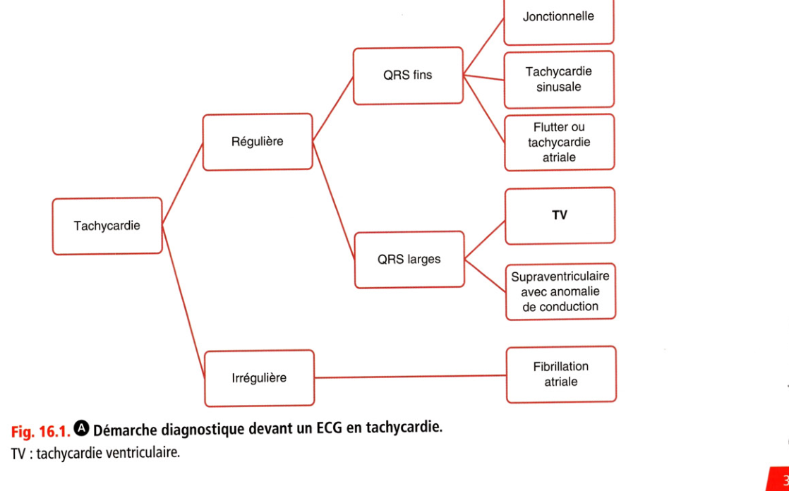

**Fig. 16.1.** Démarche diagnostique devant un ECG en tachycardie.

### 2. Holter ECG

La méthode holter est intéressante si les palpitations surviennent fréquemment, cet enregistrement peut varier de 24 à 96 heures (fig. 16.2).

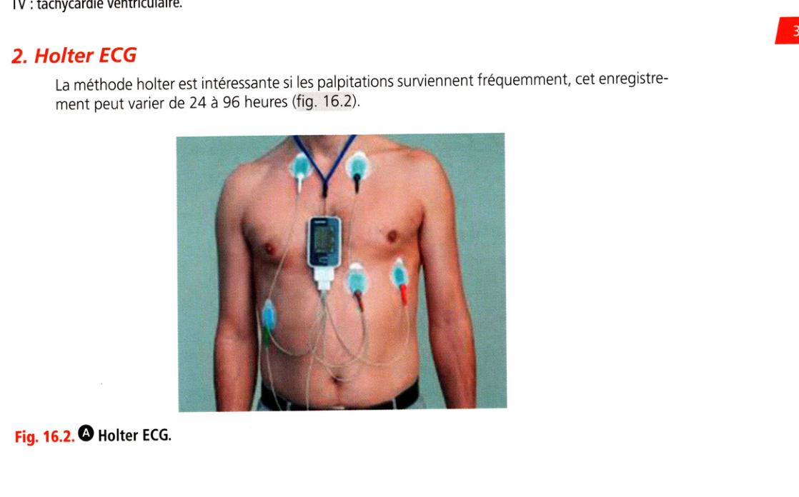

**Fig. 16.2.** Holter ECG.

### 3. ECG ambulatoire de longue durée (jusqu'à 21 jours)

Il est intéressant de le réaliser en cas de palpitations peu fréquentes (< 1 fois/semaine) (fig. 16.3).

- » 1« 20 , •ro ___ ___ ___ I

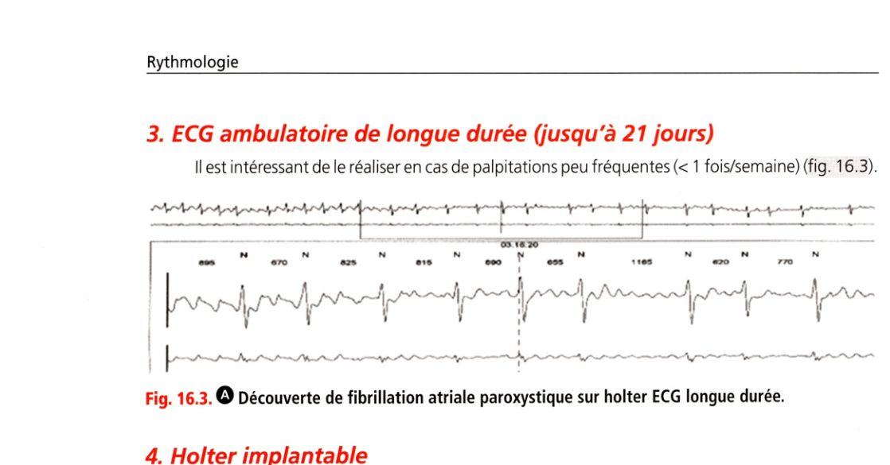

**Fig. 16.3.** Découverte de fibrillation atriale paroxystique sur holter ECG longue durée.

### 4. Holter implantable

Lorsque les crises sont peu fréquentes, il permet une surveillance de 3 à 5 ans. Il est implanté lors de consultations dans une position parasternale sous-cutanée. Il enregistre la survenue d'anomalies électriques (asystolie, bradycardie ou tachycardie) (fig. 16.4). Un moniteur est également remis au patient afin d'essayer d'établir la corrélation électroclinique. Il peut enfin être suivi à distance par la télécardiologie. Item 17. Télémédecine, télésanté et téléservices en santé Item 18. Santé et numérique Montres connectées La possibilité d'obtenir un tracé ECG à partir d'au moins deux électrodes placées sur une montre connectée (ou un smartphone) permet d’obtenir des tracés d'excellente qualité (fig. 16.5). Ces montres permettent d'obtenir classiquement un tracé simple piste D1 de manière automatique ou par action du patient lorsqu'il ressent les symptômes. Cela permet une nouvelle fois d'établir une corrélation électroclinique.

## D. Autres examens complémentaires

**Rang B.** Ils peuvent se discuter sur avis spécialisé.

### 1. Étude électrophysiologique endocavitaire

• Son intérêt premier est diagnostique. On recherche la présence éventuelle d'une dualité nodale (en faveur d'une tachycardie par réentrée intranodale ou TRIN), d'une voie accessoire, la possibilité de déclencher un trouble du rythme supraventriculaire par stimulation de l'oreillette droite, ou un trouble du rythme ventriculaire par stimulation programmée du ventricule droit (SVP, en deux sites : apex et infundibulum pulmonaire).

• Son intérêt est d'autre part thérapeutique car il permet de traiter dans un même temps une arythmie atriale, une TRIN, une voie accessoire, etc.

### 2. Épreuve d'effort

Elle présente un intérêt double en cas de doute sur un angor mais aussi pour documenter les palpitations si elles surviennent à l'effort. r rrnrnnrnmrm ill I I $ S S S $ S J J 2 J 1 V S J 8 0 2J.J4.46 2J.J4.66

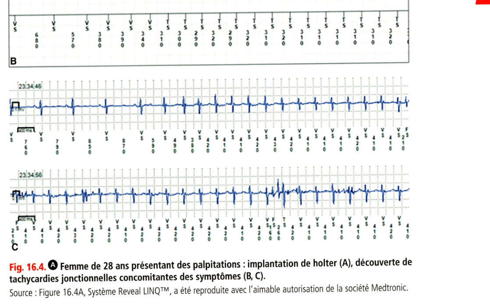

**Fig. 16.4.** Femme de 28 ans présentant des palpitations : implantation de holter (A), découverte de

tachycardies jonctionnelles concomitantes des symptômes (B, C). Source : Figure 16.4A, Système Reveal LINQ™, a été reproduite avec l'aimable autorisation de la société Medtronic. Rythme cardiaque > 120 — v Moyenne de 186 bpm Cet ECG n’a pas été utilisé pour rechercher une FA car votre rythme cardiaque était supérieur à 120 bpm. Si vous obtenez ce résultat à plusieurs reprises ou que vous ne vous sentez pas bien, consultez votre médecin

### 3. Autres examens

Ils sont réalisés en fonction du contexte et des hypothèses diagnostiques soulevées : IRM myocardique, coronarographie, tests médicamenteux (ex : isoprénaline, ajmaline), potentiels tardifs ventriculaires (dysplasie arythmogène du ventricule droit).

---

# IV. Étiologies les plus fréquentes

**Rang A.**

## A. Extrasystoles

**Rang A.** Une extrasystole correspond à une activation prématurée ectopique par rapport à la fréquence attendue. Elle peut être supraventriculaire ou ventriculaire.

Les extrasystoles peuvent présenter un repos compensateur (total équivalent à une double période) ou être interpolées (absence de repos compensateur). Elles peuvent être monomorphes (morphologie identique) ou polymorphes (différentes morphologies). Les extrasystoles peuvent être isolées, bigéminées (alternance entre un complexe « normal » et une extrasystole) ou trigéminées (alternance de deux complexes « normaux » et une extrasystole) (fig. 16.6 et 16.7). Elles ne constituent pas un élément pathologique en elles-mêmes, mais doivent faire rechercher une cardiopathie sous-jacente ou une pathologie extracardiaque. Parmi les causes extracardiaques, on trouve :

• alcoolisation ;

• électrocution ;

• pathologies respiratoires ;

• hyperthyroïdie ;

• anomalie électrolytique ;

• anxiété, dépression ;

• grossesse ;

• syndrome d'apnées du sommeil.

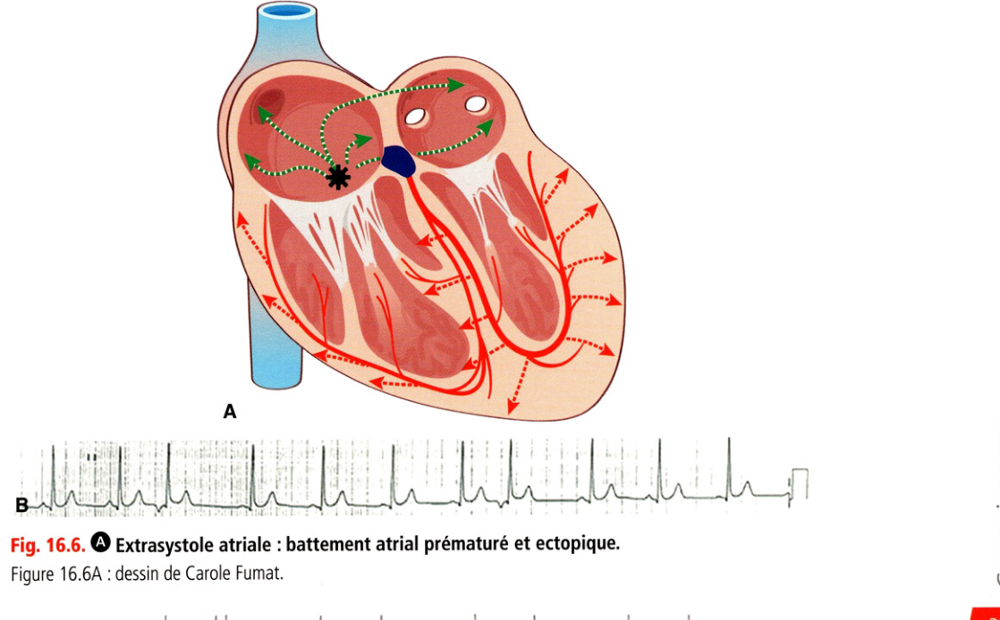

**Fig. 16.6.** xtrasystole atriale : battement atrial prématuré et ectopique.

Il . J_A III

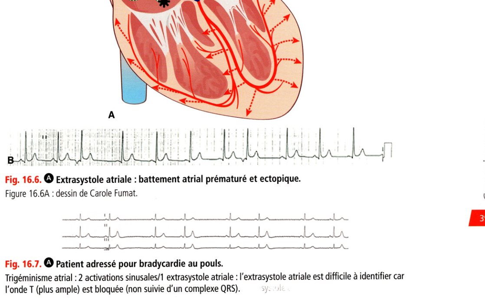

**Fig. 16.7.** Patient adressé pour bradycardie au pouls.

Trigéminisme atrial : 2 activations sinusales/1 extrasystole atriale : l'extrasystole atriale est difficile à identifier car l'onde T (plus ample) est bloquée (non suivie d'un complexe QRS). Par ailleurs, toutes les cardiopathies peuvent donner des extrasystoles. Il est nécessaire de bien analyser l'aspect de l'extrasystole mais aussi l'ECG de repos pour rechercher une cardiopathie sous-jacente. Un bilan de base morphologique par échocardiographie transthoracique, une épreuve d'effort et un holter ECG (afin de mesurer la charge en extrasystole, les différentes morphologies, la présence de couplage court) sont nécessaires. Chez le patient obèse ou diabétique ou hypertendu, il existe une association entre extrasystoles et fibrillation atriale, il faut savoir répéter les enregistrements holter chez ces patients pour rechercher une FA à risque thromboembolique (cf. chapitre 13).

• En cas d'extra systole supraventriculaire, la morphologie de la dépolarisation atriale (P') est différente de l'activation issue du nœud sinusal classique (P). Cette morphologie de P' peut permettre d'évaluer la position de cette activation ectopique dans l'une des deux oreillettes. Le QRS suivant est habituellement de même morphologie qu'en rythme sinusal ou différent en cas d'aberration de conduction. Enfin, une onde P' peut être bloquée si elle arrive trop précocement et entre dans un nœud atrioventriculaire en période réfractaire physiologique.

• En cas d'extrasystole ventriculaire (fig. 16.8 et 16.9), il existe un QRS prématuré, élargi sans activité atriale auparavant. Sa morphologie évoque le ventricule d'origine.

• Enfin, les extrasystoles ventriculaires à couplage court (phénomène R/T) peuvent induire des arythmies ventriculaires létales (fig. 16.10).

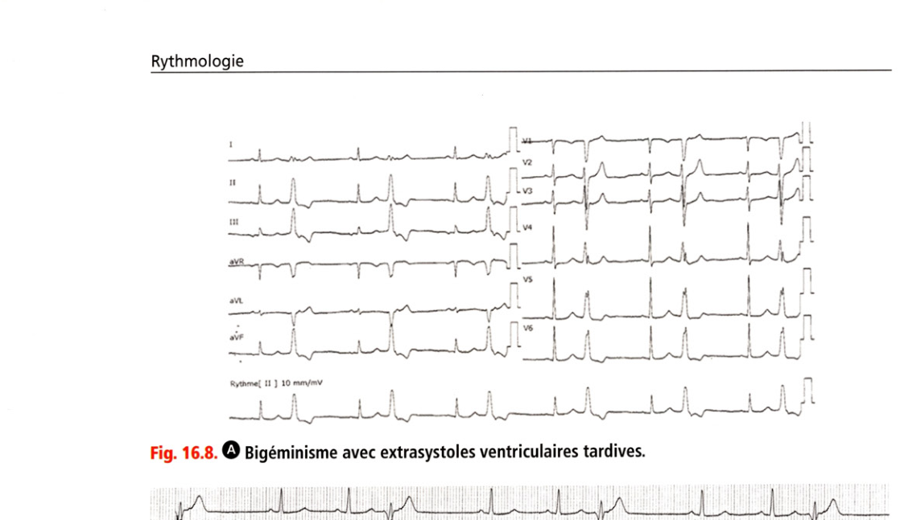

**Fig. 16.8.** Bigéminisme avec extrasystoles ventriculaires tardives.

Li 1 /V __À 1 A 11 :

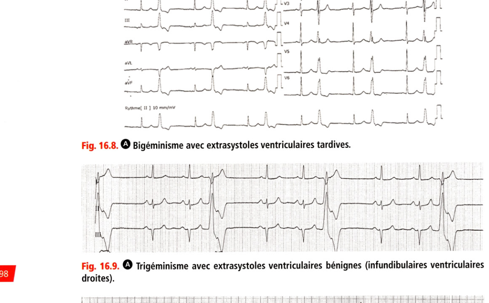

**Fig. 16.9.** Trigéminisme avec extrasystoles ventriculaires bénignes (infundibulaires ventriculaires

droites).

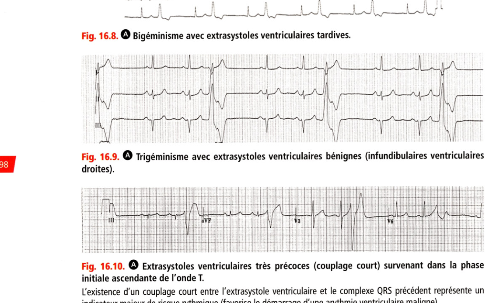

**Fig. 16.10.** Extrasystoles ventriculaires très précoces (couplage court) survenant dans la phase

initiale ascendante de l'onde T. L'existence d'un couplage court entre l'extrasystole ventriculaire et le complexe QRS précédent représente un indicateur majeur de risque rythmique (favorise le démarrage d'une arythmie ventriculaire maligne).

## B. Tachycardie sinusale

Une tachycardie sinusale correspond par définition à une accélération de la fréquence sinusale au repos supérieure à 100 bpm. Il s'agit d'une activité sinusale (onde P de morphologie issue du nœud sinusal) à début et fin progressifs (fig. 16.1 1). Elle peut survenir au cours de l'insuffisance cardiaque, d'une embolie pulmonaire, d'un épanchement péricardique etc. ; dans tous ces cas, il s'agit d'une réponse physiologique adaptée. Elle peut également être adaptative à la suite d'une pathologie extracardiaque :

• fièvre, sepsis ;

• anémie, hypovolémie ;

• hypoxie ;

• hyperthyroïdie ;

• grossesse ;

• alcoolisme ;

• hypotension artérielle ;

• syndrome d'apnées du sommeil ;

• sevrage brutal en 0-bloquants ;

• pathologie psychiatrique, sevrage alcoolique ;

• médicaments (sympathomimétiques, vasodilatateurs, atropiniques, etc.). -j ' ' J xx. .Ç-x -J <xj> tu tt

> 1 A'i

!•. III

■■ ■*!> Ni ■H • «1»ÎT

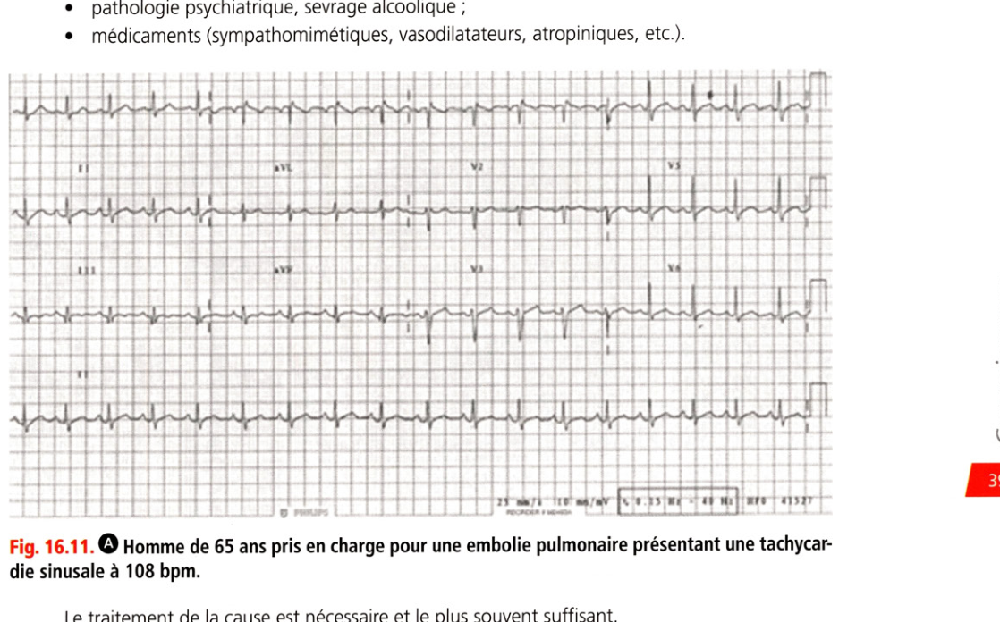

**Fig. 16.11.** Homme de 65 ans pris en charge pour une embolie pulmonaire présentant une tachycardie sinusale à 108 bpm.

Le traitement de la cause est nécessaire et le plus souvent suffisant. Exceptionnellement, elle est isolée et non adaptative : on parle de tachycardie sinusale inappropriée, à l’orthostatisme ou l'anxiété notamment.

## C. Tachycardies jonctionnelles

Les symptômes de la tachycardie jonctionnelle (TJ) ont été initialement décrits par Bouveret : maladie de Bouveret. Il s'agit de tachycardies incluant la jonction atrioventriculaire : réentrée intranodale et voies accessoires.

### 7. Tachycardies par réentrée intranodale

Ce sont les TJ les plus fréquentes survenant chez des sujets jeunes (adolescent, adulte jeune) avec un cœur sain. Les symptômes sont typiques et associent des palpitations pouvant parfois être ressenties avec des battements cervicaux :

• de début brutal et fin brutale ;

• de durée variable : de quelques minutes à plusieurs heures ;

• avec polyurie en fin d'accès ;

• de bonne tolérance clinique le plus souvent mais dont l'inconfort peut gêner la qualité de vie ;

• arrêtées par manœuvre vagale ou injection d'adénosine ou d'adénosine-5' triphosphorique. Le nœud atrioventriculaire peut être le siège d'une dissociation entre deux voies (fig. 16.12) : une voie rapide antérieure et supérieure à période réfractaire longue, et une voie lente postérieure et inférieure à période réfractaire plus courte. Classiquement, la réentrée s'établit entre la voie lente dans le sens antérograde et la voie rapide dans le sens rétrograde. Le trigger est souvent une extrasystole atriale bloquée dans la voie rapide du fait de sa période réfractaire longue avec poursuite de l'influx dans la voie lente en antérograde. La conduction à travers la voie lente est suffisamment ralentie pour laisser le temps à la voie rapide de sortir de sa période réfractaire et de retrouver son excitabilité ; l'activation se fait alors de façon rétrograde dans la voie rapide. Voie « rapide » Voie « lente » Tachycardie par réentrée intranodale

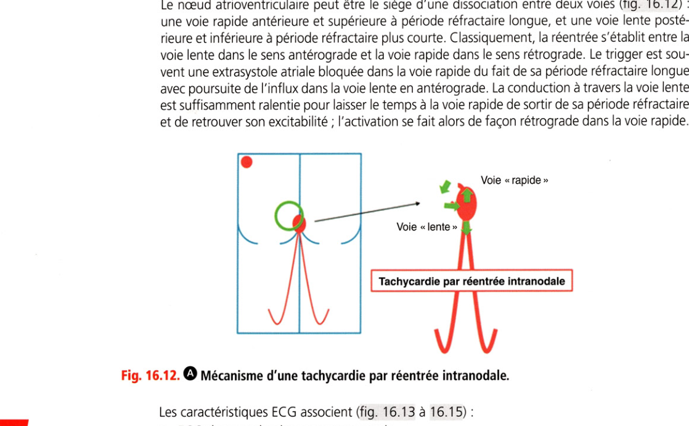

**Fig. 16.12.** Mécanisme d'une tachycardie par réentrée intranodale.

Les caractéristiques ECG associent (fig. 16.13 à 16.15) :

• ECG de repos le plus souvent normal ;

• fréquence variable de 1 30 à 250 bpm, en fonction des patients et de l'âge ;

• QRS fins le plus souvent sauf en cas d'aberration de conduction ;

• existence d'une activité atriale rétrograde (P' négatives dans les dérivations inférieures) plus ou moins proches de la fin du QRS en fonction de la vitesse dans la branche rétrograde.

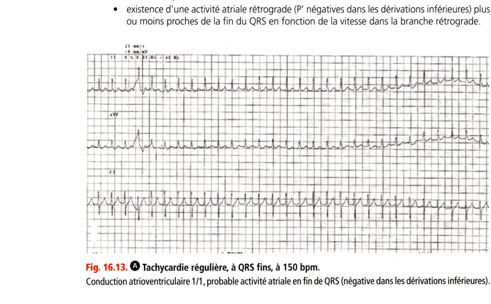

**Fig. 16.13.** Tachycardie régulière, à QRS fins, à 150 bpm.

Conduction atrioventriculaire 1 /1, probable activité atriale en fin de QRS (négative dans les dérivations inférieures). L.

!T

La modification de l'aspect du QRS sur les complexes d'origine sinusale (absence de négativité en inférieur) confirme qu'il s'agissait bien d'une conduction atriale rétrograde.

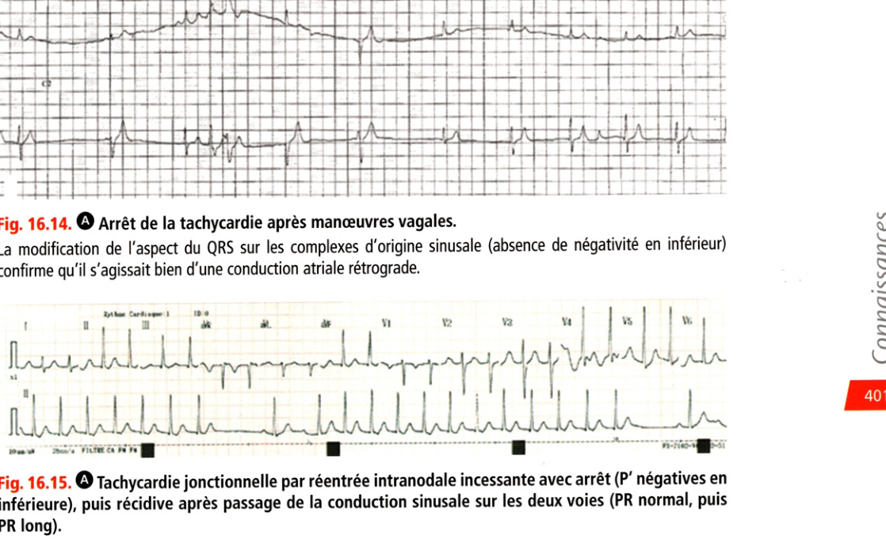

**Fig. 16.15.** Tachycardie jonctionnelle par réentrée intranodale incessante avec arrêt (P' négatives en

inférieure), puis récidive après passage de la conduction sinusale sur les deux voies (PR normal, puis PR long). La prise en charge dépend de la symptomatologie et de la gêne ressentie par le patient. Elle va de l'abstention à la stratégie de pill in the pocket jusqu'à l'ablation. La prise en charge ablative de la voie lente constitue le traitement de référence avec un taux très faible de complication (risque de bloc atrioventriculaire complet).

### 2. Tachycardies jonctionnelles sur voie accessoire : syndrome

Les tachycardies jonctionnelles sur voie accessoire (ex : faisceau de Kent), classiquement appelées syndrome de Wolff-Parkinson-White, surviennent préférentiellement chez de jeunes patients avec cœur sain. Il existe dans la majorité de la population une isolation électrique totale (massif valvulaire fibreux) entre les massifs atriaux et ventriculaires. Le seul passage se situe classiquement au niveau du nœud atrioventriculaire et du faisceau de His. Il peut cependant exister une bandelette musculaire (voie accessoire) passant au travers de cette isolation électrique fibreuse, permettant ainsi une conduction directe entre oreillettes et ventricules (fig. 16.16). Ce type de voie accessoire involue habituellement avec l'âge. En présence d’une voie accessoire, en rythme sinusal Absence de conduction antérograde (atrioventriculaire) dans la voie accessoire C7 Activation ventriculaire exclusive par la NAV sans conduction via la voie accessoire, d’où l’absence d’aspect ECG de PR court, QRS large ou onde A Présence d’une conduction antérograde (atrioventriculaire) dans la voie accessoire Fusion de la primoactivation musculaire ventriculaire via la voie accessoire, puis par la NAV responsable de l’aspect ECG de PR court avec QRS large et onde A

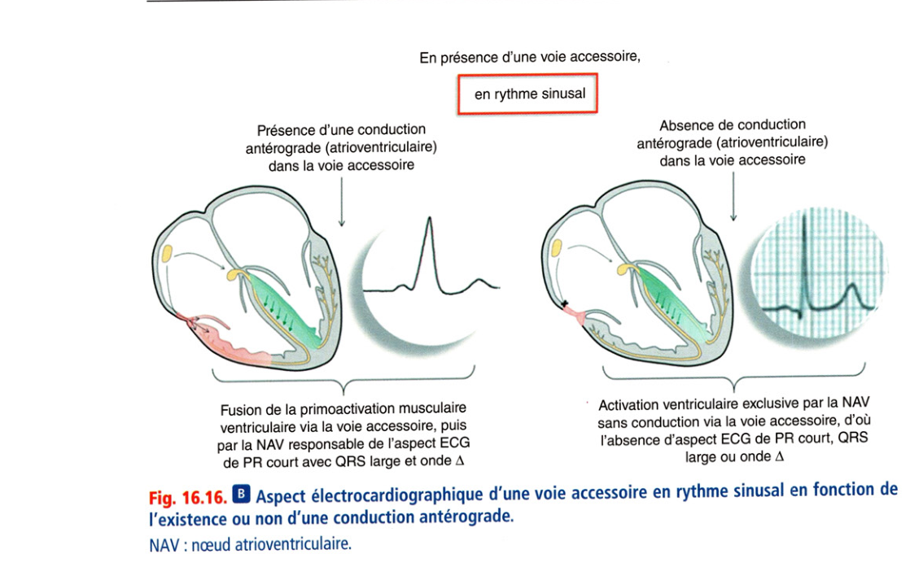

**Fig. 16.16.** Fig. 16.16

Aspect électrocardiographique d'une voie accessoire en rythme sinusal en fonction de l'existence ou non d'une conduction antérograde. NAV : nœud atrioventriculaire. C'est la présence de cette voie accessoire (passage direct et rapide de l'influx électrique de l'oreillette vers le ventricule homolatéral par la voie accessoire mais aussi par les voies de conduction nodohissienne) qui induit des modifications typiques sur l'ECG de repos 1 2 dérivations permettant le diagnostic (fig. 16.17) :

• espace PR court < 1 20 ms sans retour à la ligne isoélectrique avant le début du QRS ;

• onde delta : aspect triangulaire du début du complexe QRS ;

• QRS large et > 120 ms dû à la présence de l'onde delta ;

• troubles de la repolarisation. 10 mm/mV 25 mm/* hftre: K$O D 35 Hz , I il 10 mm/mV Rytfwrwf || ) 10 mnVmV __

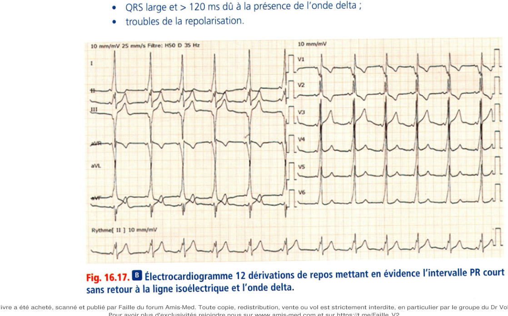

**Fig. 16.17.** Électrocardiogramme 12 dérivations de repos mettant en évidence l'intervalle PR court

sans retour à la ligne isoélectrique et l'onde delta. Fl6 L'aspect de préexcitation diminue, voire disparaît avec l'atropine et augmente avec des manoeuvres vagales (blocage de la conduction dans le nœud atrioventriculaire). Enfin, il existe des voies accessoires cachées (conduction uniquement dans le sens ventricules vers oreillettes) ou masquées (la majorité de l'influx se fait par la voie nodohissienne) rendant le diagnostic difficile sur un ECG de repos. El Ces tachycardies peuvent être (fig. 16.18) :

• orthodromiques (fig. 16.19 à 16.21) : descente de l'influx par le faisceau de Hiset remontée par le faisceau accessoire : QRS fins avec onde P' rétrograde ;

• antidromiques (fig. 16.22) : descente de l'influx par le faisceau accessoire et remontée par le faisceau de His : QRS larges avec aspect de préexcitation avec onde P' rétrograde. En présence d’une voie accessoire, en tachycardie Conduction antérograde (atrioventriculaire) dans la voie accessoire et rétrograde dans le NAV Conduction antérograde (atrioventriculaire) dans le NAV et rétrograde dans la voie accessoire IL A / Ib £ / Tachycardie ANTIDROMIQUE du anti - dromein: courir en sens inverse Activation ventriculaire via la VA : QRS larges Tachycardie ORTHODROMIQUE du grec ortho - dromeîn: courir en ligne droite Activation ventriculaire via le NAV : QRS fins

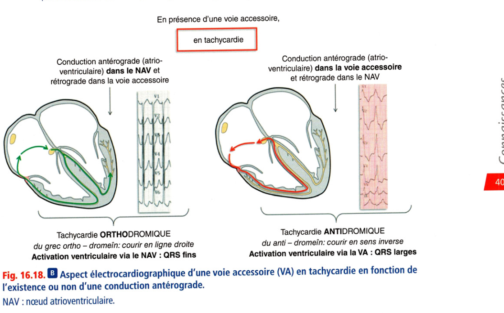

**Fig. 16.18.** l Aspect électrocardiographique d'une voie accessoire (VA) en tachycardie en fonction de

l'existence ou non d'une conduction antérograde. NAV : nœud atrioventriculaire.

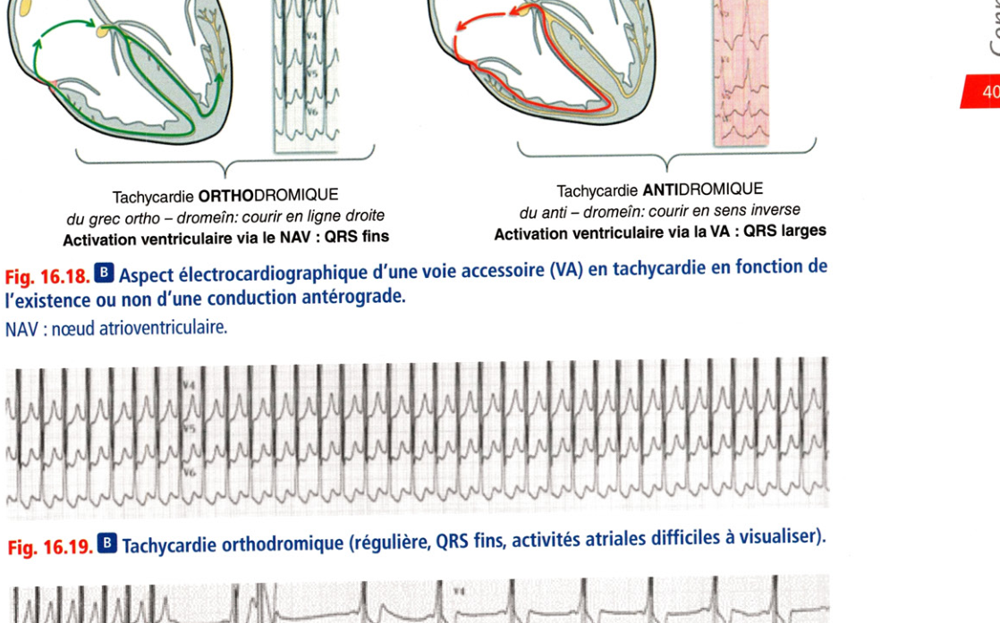

**Fig. 16.19.** l Tachycardie orthodromique (régulière, QRS fins, activités atriales difficiles à visualiser).

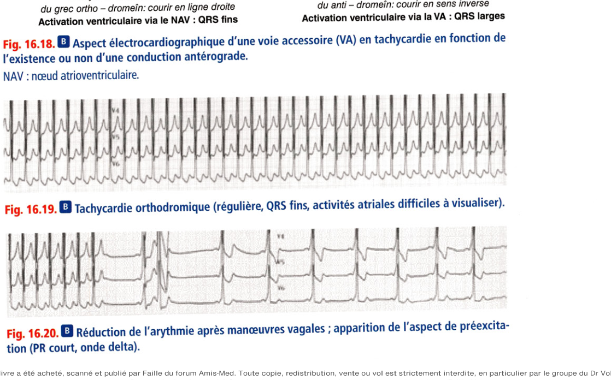

**Fig. 16.20.** l Réduction de l'arythmie après manœuvres vagales ; apparition de l'aspect de préexcitation (PR court, onde delta).

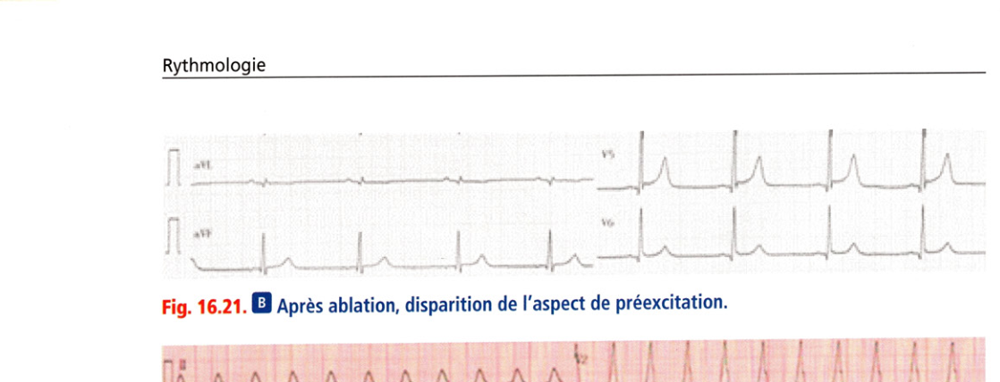

**Fig. 16.21.** Après ablation, disparition de l'aspect de préexcitation.

A /sAA-AAAAA.A V y v » b I 1 I

• A H ** h V V V v 1 I' h v V ■ I I i r /' P

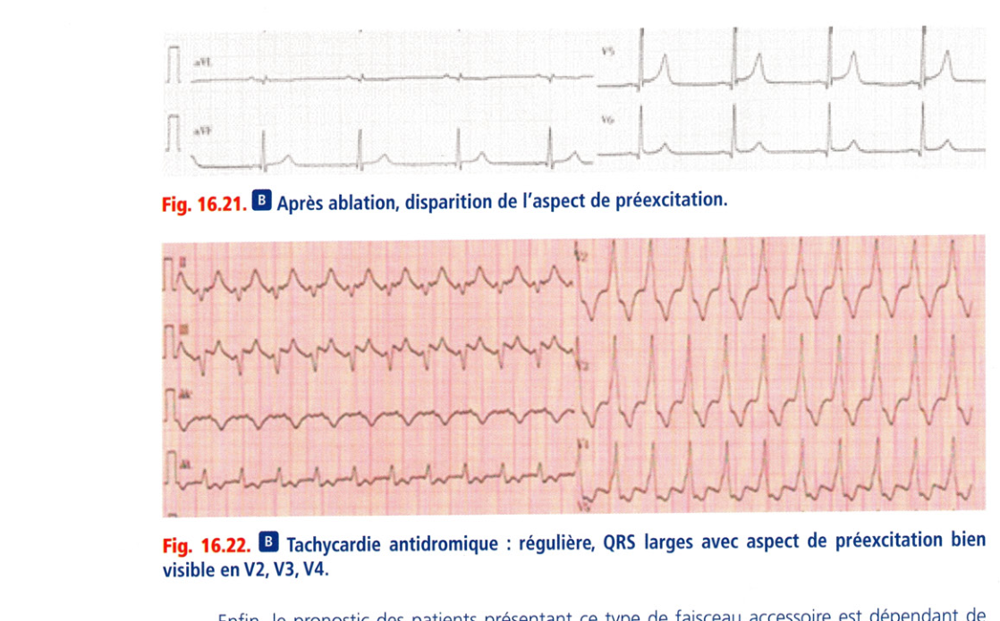

**Fig. 16.22.** Tachycardie antidromique : régulière, QRS larges avec aspect de préexcitation bien

visible en V2, V3, V4. Enfin, le pronostic des patients présentant ce type de faisceau accessoire est dépendant de la présence de fibrillation atriale (fig. 16.23). En effet, ces patients présentent plus d'accès de fibrillation atriale du fait de l'activation rétrograde « permanente ». De plus, ils peuvent présenter des épisodes de lipothymie, syncope ou mort subite lors d'un épisode de fibrillation atriale conduisant rapidement aux ventricules : aspect de super-Wolff (QRS très élargis, irréguliers) pouvant évoluer vers une fibrillation ventriculaire (fig. 16.24). 1; i * f

!

'A

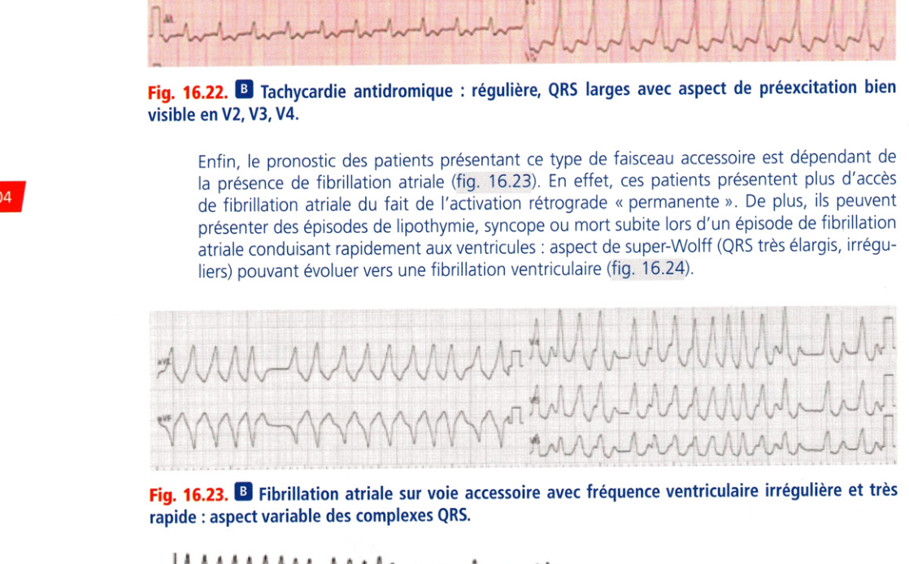

**Fig. 16.23.** Fibrillation atriale sur voie accessoire avec fréquence ventriculaire irrégulière et très

rapide : aspect variable des complexes QRS.

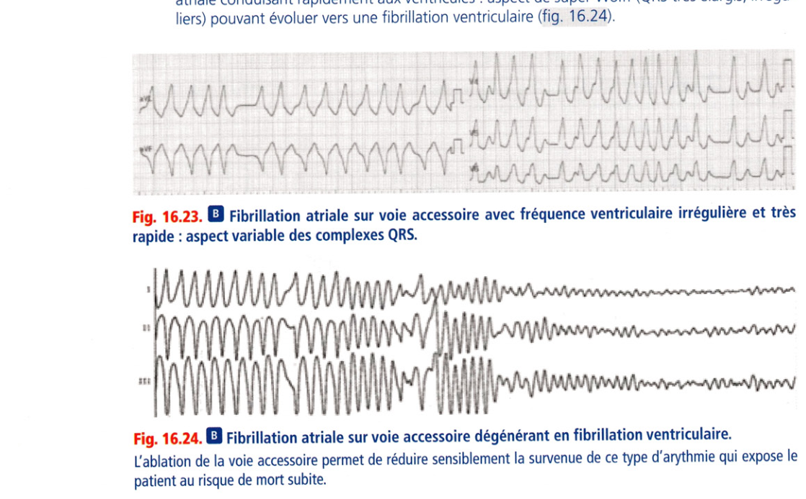

**Fig. 16.24.** Fibrillation atriale sur voie accessoire dégénérant en fibrillation ventriculaire.

L'ablation de la voie accessoire permet de réduire sensiblement la survenue de ce type d'arythmie qui expose le patient au risque de mort subite. <£► Ainsi, une voie accessoire est considérée comme maligne quand sa période réfractaire antérograde est très courte (< 250 ms), exposant le patient à un rythme ventriculaire potentiellement très rapide. Elle constitue alors une indication formelle d'ablation. Devant un patient présentant un épisode de fibrillation atriale sur voie accessoire, le traitement repose sur la cardioversion en urgence si l'hémodynamique est instable, sur les antiarythmiques de classe le ou l'amiodarone si l'hémodynamique est conservée. En revanche, les médicaments bloquant la conduction nodale et ne ralentissant pas la conduction par la voie accessoire (adénosine, inhibiteurs calciques, bêtabloquants, digitaliques) sont formellement contre-indiqués. L'ablation de la voie accessoire :

• peut être proposée chez les patients symptomatiques présentant des épisodes de tachycardie réciproques répétitifs ;

• est une indication indiscutable chez les patients avec FA rapide et voie accessoire très perméable (période réfractaire antérograde courte) ; peut se compliquer de la survenue d'un bloc atrioventriculaire si la voie accessoire est située près des voies de conduction nodohissiennes. e ou les consi ir subitement. palpitatioi socréent •raisonnée de au moment)

## D. Névrose cardiaque

tâtions itératives, mais assez fréquent, lié à une çr inte Le diagnostic repose sur un ECG strictement norme obtenu grâce au monitorage de longue durée. Il faut savoir évoquer le diagnostic quand :

• les examens cliniques et paracliniques sont tous ni r le patient, ne pas tenir Il faut savoir stopper les investigations à vis< un langage inadapté ne gps; parler de spas Un avis psychiatrique est souhaitable.

## E. Troubles du rythme supraventriculaire (fibrillation atriale

et flutter) et ventriculaire yo v

**Rang A.** Ces pathologies peuvent également donner des palpitations. Elles sont traitées dans les

chapitres 13 et 15.

• Les palpitations sont une perception anormale des battements cardiaques.

• Il s’agit d’un symptôme banal qui s'efface derrière un éventuel symptôme plus grave de type syncope, douleur thoracique ou dyspnée.

• Il faut savoir écarter des signes de gravité liés au terrain, à une mauvaise tolérance hémodynamique ou à l'enregistrement immédiat d’une tachycardie ventriculaire.

• Il faut savoir rechercher une cardiopathie ou une maladie extracardiaque.

• L’enregistrement de l'ECG au moment exact des palpitations est la notion de corrélation électroclinique.

---

## Points

• Les palpitations sont une perception anormale des battements cardiaques.

• Il s'agit d'un symptôme banal qui s'efface derrière un éventuel symptôme plus grave de type syncope, douleur thoracique ou dyspnée.

• Il faut savoir écarter des signes de gravité liés au terrain, à une mauvaise tolérance hémodynamique ou à l'enregistrement immédiat d'une tachycardie ventriculaire.

• Il faut savoir rechercher une cardiopathie ou une maladie extracardiaque.

• L'enregistrement de l'ECG au moment exact des palpitations est la notion de corrélation électroclinique.

• La corrélation électroclinique peut requérir dans l'ordre : ECG standard, holter de 24–96 heures, monitorage ambulatoire de 21 jours, moniteur ECG implantable, étude électrophysiologique endocavitaire, mais aussi montres connectées, smartphones.

• Le diagnostic final peut être une tachycardie sinusale ou des extrasystoles dont il faut connaître les causes extracardiaques. Parmi les causes de tachycardie sinusale : grossesse, hyperthyroïdie, SAOS, alcoolisme.

• En diagnostic d'élimination, des causes psychologiques sont parfois involontairement entretenues par les professionnels de santé.
---

## Notions indispensables et inacceptables

### Notions indispensables

• Notion électroclinique, c'est-à-dire la documentation du tracé ECG au moment des symptômes.
• Existence ou non d'une cardiopathie sous-jacente.
• Signes de gravité.

### Notions inacceptables

• S'orienter d'emblée vers des causes psychogènes sans avoir fait un bilan minimal.

---

## Réflexes transversalité

• Item 17. Télémédecine, télésanté et téléservices en santé.
• Item 18. Santé et numérique.
• Item 231 - Électrocardiogramme : indications et interprétations.
• Item 232 - Fibrillation atriale.

---

## Entraînement

Questions isolées et corrigés : [Entrainement/QI/237_Palpitations.md](../../Entrainement/QI/237_Palpitations.md)
