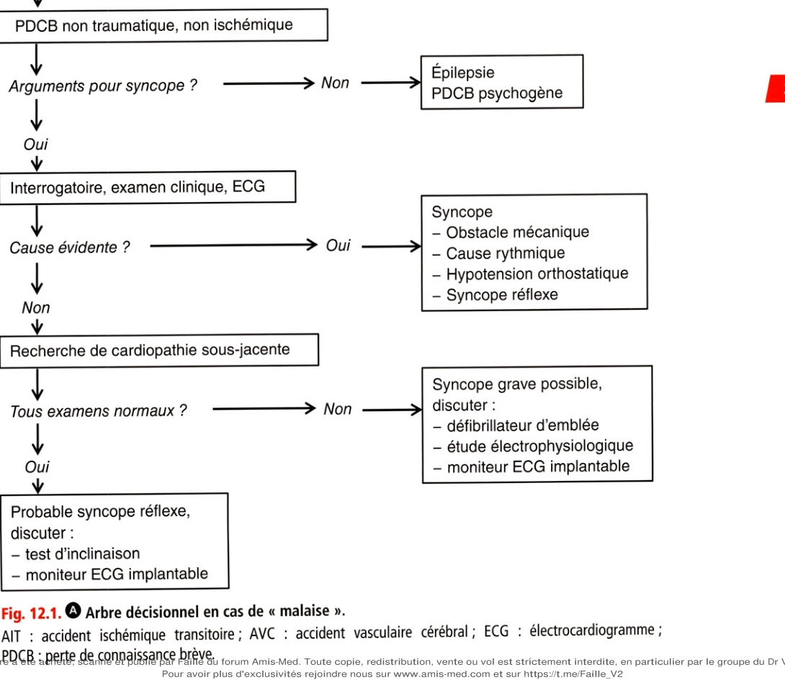

# Item 342 — Malaises, perte de connaissance, crise comitiale chez l'adulte

> **Collège CNEC / SFC** · 3e édition (2025) · p. 279–296 · R2C  
> Partie III — Rythmologie

---

## Trois repères à ne pas confondre

| Badge | Signification (R2C) |
|---|---|
| **Rang A** | Connaissances fondamentales de fin de 2e cycle |
| **Rang B** | Connaissances essentielles, plus spécialisées |
| **Rang C** | Connaissances de 3e cycle (DES) |

Les pastilles du livre (● = A, ■ = B) sont reprises inline.

---

## Situations de départ

50 Malaise/perte de connaissance.

---

## Hiérarchisation des connaissances

| Rang | Rubrique | Intitulé | Descriptif |
|---|---|---|---|
| **A** | Définition | Malaise, syncope, lipothymie, prodromes, crise d'épilepsie, état de mal épileptique | |
| **B** | Physiopathologie | Mécanisme principal d'un malaise | Hypoperfusion cérébrale ou dysfonctionnement de l'activité cérébrale |
| **A** | Diagnostic positif | Interrogatoire et examen clinique | Diagnostic rétrospectif de crise généralisée ; interrogatoire de l'entourage |
| **A** | Diagnostic positif | Éléments du diagnostic des syncopes et lipothymies | Circonstances déclenchantes, caractéristiques cliniques |
| **A** | Diagnostic positif | Hypotension orthostatique, hypoglycémie | |
| **A** | Diagnostic positif | Événement épileptique et non épileptique (pseudo-crise) | |
| **A** | Étiologies | Causes cardiovasculaires et non cardiovasculaires des syncopes/lipothymies | Réflexe, par hypotension, cardiaque |
| **A** | Étiologies | Causes neurologiques des malaises, crises épileptiques | Hypoglycémie, toxiques, méningite, arrêt de traitement, lésion intracérébrale focale* |
| **A** | Étiologies | Causes non cardiaques et non neurologiques | Malaise somatomorphe, attaque de panique |
| **A** | Identifier une urgence | Gravité des malaises et surveillance | |
| **A** | Examens complémentaires | Indications et anomalies décisives de l'ECG | Anomalies ECG ayant valeur diagnostique immédiate |
| **A** | Examens complémentaires | Indications d'un EEG* | En cas de malaise ou PDCB présumés d'origine épileptique |
| **B** | Examens complémentaires | Examens de 2e intention | MEI, test d'inclinaison, EEP endocavitaire |
| **A** | Identifier une urgence | Éléments justifiant avis cardiologique, neurologique ou réanimatoire | |
| **A** | Prise en charge | Gestes d'urgence devant crise convulsive généralisée* | |
| **A** | Prise en charge | Traitement symptomatique d'un malaise | |
| **A** | Prise en charge | Suivi syncope/lipothymie de cause rythmique | Prévention du risque de mort subite |
| **B** | Prise en charge | Suivi syncope/lipothymie réflexe | Bénignité, éducation du patient |
| **A** | Prise en charge | Suivi hypotension artérielle orthostatique | Sécurité des médicaments, sujet âgé |
| **A** | Prise en charge | Prescription d'un traitement anticonvulsivant | Benzodiazépines de courte durée d'action* |
| **A** | Prise en charge | Principes de la prise en charge de la crise comitiale | Traitements de longue durée d'action* |

---

## Parcours Rang A

- [I. Définitions et sémantique, notion de PDCB](#i-définitions-et-sémantique-notion-de-pdcb)
- [III. Étiologies et classification des syncopes](#iii-étiologies-et-classification-des-syncopes)
- [IV. Diagnostic différentiel des syncopes](#iv-diagnostic-différentiel-des-syncopes)
- [V. Prise en charge clinique et paraclinique](#v-prise-en-charge-clinique-et-paraclinique)
- [VI. Critères de gravité](#vi-critères-de-gravité)
- [VII. Formes cliniques typiques](#vii-formes-cliniques-typiques)

---

## Sommaire

- [Vignette clinique](#vignette-clinique)
- [I. Définitions et sémantique, notion de PDCB](#i-définitions-et-sémantique-notion-de-pdcb)
- [II. Physiopathologie des PDCB](#ii-physiopathologie-des-pdcb)
- [III. Étiologies et classification des syncopes](#iii-étiologies-et-classification-des-syncopes)
- [IV. Diagnostic différentiel des syncopes](#iv-diagnostic-différentiel-des-syncopes)
- [V. Prise en charge clinique et paraclinique](#v-prise-en-charge-clinique-et-paraclinique)
- [VI. Critères de gravité](#vi-critères-de-gravité)
- [VII. Formes cliniques typiques](#vii-formes-cliniques-typiques)
- [Points](#points)
- [Notions indispensables et inacceptables](#notions-indispensables-et-inacceptables)
- [Réflexes transversalité](#réflexes-transversalité)
- [Entraînement](../../Entrainement/QI/342_Malaises_PDCB.md)

---

## Vignette clinique

Une femme de 88 ans contacte le Samu après une perte de connaissance brutale survenue lors de la marche. Elle ne rapporte aucun autre symptôme. Ses antécédents médicaux incluent un diabète de type 2 et une arthrose traitée par antalgiques. À l'arrivée des pompiers, elle est retrouvée au sol avec un traumatisme facial. Les constantes relevées montrent une fréquence cardiaque à 85 battements par minute et une pression artérielle à 154/95 mmHg.

> Quelles sont les causes les plus fréquentes à l'origine d'une syncope chez le sujet âgé ?

> Quels sont les principaux éléments à recueillir à l'interrogatoire ?

> Que ne faut-il pas manquer à l'examen clinique ?

> Une cause neurologique vous paraît-elle plausible ?

> Qu'attendez-vous de l'enregistrement ECG ?

> À l'issue de ces premières étapes, aucune orientation diagnostique n'est envisagée : pensez-vous

qu'il soit tout de même nécessaire d'hospitaliser cette patiente ?

> Quelles explorations complémentaires suggérez-vous ?

# I. Définitions et sémantique, notion de PDCB

**Rang A.**

## A. Définitions

• **Rang A.** Un malaise est une indisposition, une gêne, un trouble ou un « mal-être » ou une

« sensation pénible vague d'un trouble des fonctions physiologiques ». Ce n'est pas un terme médical mais une plainte ou un motif de recours aux soins. Après le premier contact médical, il faut établir s'il y a eu perte de connaissance brève (PDCB). Une PDCB est un état réel ou apparent de perte de la conscience, avec amnésie de cette période, perte du contrôle de la motricité, perte de la réactivité, le tout de courte durée. On oppose d'abord les PDCB traumatiques aux PDCB non traumatiques. Les PDCB non traumatiques comportent trois catégories principales : les syncopes, les crises d'épilepsie et, enfin, les PDCB psychogènes. Ces trois catégories se distinguent essentiellement par leur physiopathologie car leur présentation sémiologique peut être voisine et trompeuse. Les syncopes sont des PDCB dues à une hypoperfusion cérébrale de déclenchement rapide et de récupération complète et spontanée. Après l'événement, l'état neurologique (notamment le comportement et l'orientation) est normal. Le patient n'a pas de souvenir enregistré pendant la période de PDCB. Les signes et symptômes qui précèdent la syncope sont nommés prodromes. Lorsque la symptomatologie se limite à ces prodromes et que la PDCB ne survient pas, on retient le terme de lipothymie (présyncope en anglais). La lipothymie peut se résumer à une sensation imminente de syncope. Lorsque la syncope ne s'accompagne pas de prodromes, on dit qu'elle est « à l'emporte-pièce ». On utilisait parfois, dans les anciens ouvrages, le terme de syncope de Stokes-Adams qui décrivait une syncope sans prodrome avec pâleur, de durée inférieure à 30 secondes avec retour abrupt à la conscience dont la cause était généralement rythmique.

## B. Autres états de conscience altérée

### 1. Causes très rares de PDCB

Il s'agit des accidents ischémiques transitoires (AIT) dans le territoire vertébrobasilaire possiblement associés au syndrome de vol sous-clavier et de certaines formes d'hémorragies sous-arachnoïdiennes (HSA). Il s'agit plutôt de perte progressive de conscience dans l'HSA et de perte prolongée dans l'AIT. Dans l'HSA, on note des céphalées sévères et des signes neurologiques. Dans l'AIT, on note aussi un déficit neurologique focal (vertiges, ataxie, nystagmus, faiblesse des membres inférieurs, diplopie, dysarthrie etc.). L'AIT dans le territoire carotidien ne donne quasiment jamais de PDCB et l'on note un déficit focal. Le syndrome de vol sous-clavier donne aussi des signes déficitaires avec un AIT déclenché par les mouvements intenses et répétés du membre supérieur gauche. On note également une différence de pression artérielle entre les deux bras.

### 2. Comas

La durée de perte de connaissance est très prolongée, le patient en sort progressivement ou après des manœuvres thérapeutiques. Il peut s'agir d'une cause toxique (monoxyde de carbone, médicaments, alcool, etc.).

### 3. Confusion mentale

Il n'y a pas de perte de connaissance mais un déficit d'attention et de concentration, une désorientation, des hallucinations, des propos incohérents, un état d'agitation. Ces états peuvent se rencontrer en cas de désordre métabolique (hypoglycémie, hypoxie, hypocapnie, etc.).

### 4. Cataplexie

Il s'agit d'une perte brusque du tonus musculaire parfois avec chute mais sans PDCB. Le déclencheur est une émotion, il n'y a pas d'amnésie. La narcolepsie associe une cataplexie à des accès irrépressibles de sommeil pluriquotidiens et de durée brève, à des paralysies de début de sommeil et à des hypnagogies (états intermédiaires entre veille et sommeil).

### 5. Drop-attacks

C'est un terme à éviter qui prête à confusion car regroupant des formes rares d'épilepsie, la maladie de Ménière et les chutes inexpliquées ! On décrit souvent des femmes d'âge mûr qui rapportent des chutes brèves dont elles se souviennent parfaitement et dont elles se relèvent immédiatement.

### 6. Arrêt cardiaque

Le retour à une conscience normale fait suite à une réanimation.

---

# II. Physiopathologie des PDCB

**Rang B.**

## A. Différences entre syncope, épilepsie et PDCB psychogène

• **Rang A.** Au cours d'une syncope, il y a hypoperfusion cérébrale.

Dans l'épilepsie, il y a hyperactivité cérébrale. Le PDCB psychogène est un phénomène de conversion.

## B. Syncopes

Une baisse de la pression artérielle est responsable d'une diminution globale du flux sanguin cérébral. Un arrêt brutal de ce flux aussi court que 6-8 secondes cause une syncope. Une baisse de la pression artérielle systolique à 50-60 mmHg au niveau du cœur donne en position verticale une pression artérielle cérébrale de 30-45 mmHg et déclenche une syncope. La PDCB est provoquée par la substance réticulée activatrice du tronc cérébral lorsqu'elle ne reçoit pas ses besoins en oxygène. La baisse globale du flux sanguin cérébral ne doit pas être confondue avec les accidents vasculaires cérébraux dont le mécanisme et la présentation clinique n'ont rien à voir avec les syncopes. La baisse de pression artérielle peut être due à une baisse du débit cardiaque, une chute des résistances vasculaires périphériques ou les deux :

-

la baisse du débit cardiaque peut être due à une bradycardie ou, au contraire, à une tachycardie, à une baisse du retour veineux (déplétion ou spoliation veineuse) ou à un obstacle à la circulation sanguine ;

-

la baisse des résistances périphériques (ou vasodilatation) peut être due à un réflexe levant le tonus sympathique vasoconstricteur (syncope réflexe), à une dysautonomie primitive ou secondaire, ou à des médicaments. Les myoclonies de la syncope ne doivent pas être confondues avec l'épilepsie. Il s'agit de secousses brèves, souvent des épaules, qui durent moins de 15 secondes et qui débutent toujours après la perte de connaissance et le plus souvent après la 30e seconde de perte de connaissance.

> **Attention.** Il faut éviter le terme de « syncope convulsivante ».

## C. Épilepsie et PDCB psychogènes

Seules les crises généralisées (toniques, cloniques, tonicocloniques ou atoniques) sont des causes de PDCB en raison de la perte du contrôle de la motricité. Les crises partielles en position debout ou assise ne sont en général pas considérées comme des causes de PDCB. Il existe deux formes de PDCB psychogènes : l'une imite l'épilepsie, l'autre la syncope. Elles sont souvent prolongées et se répètent plusieurs fois par jour. Il s'agit d'un phénomène de conversion.

---

# III. Étiologies et classification des syncopes

**Rang A.**

## A. Causes cardiaques « par obstacle mécanique »

**Rang A.** Il s'agit d'un obstacle à la circulation sanguine soit systémique, soit pulmonaire avec effondrement de la pression artérielle par chute du débit cardiaque :

rétrécissement aortique serré : la syncope survient à l'effort ; cardiomyopathies hypertrophiques (CMH) avec obstruction. La CMH est le plus souvent d'origine génétique, causée le plus fréquemment par des mutations de gènes codant pour les protéines du sarcomère à transmission autosomique dominante. L'hypertrophie du septum interventriculaire peut créer un obstacle sur la chambre de chasse du ventricule gauche en s'apposant à la grande valvule mitrale. Cette obstruction génère un souffle systolique éjectionnel audible au bord gauche du sternum. Les syncopes surviennent à l'effort ou juste après l'effort ; embolie pulmonaire avec thrombus occlusif dans le tronc de l'artère pulmonaire ou la chambre de chasse du ventricule droit. Il s'agit souvent d'une embolie à haut risque (avec état de choc) ; tamponnade par épanchement péricardique comprimant les cavités cardiaques à basse pression dont le ventricule droit ; causes moins fréquentes :

-

thrombose de valve mécanique (mitrale) possiblement associée à une endocardite bactérienne,

-

tumeurs cardiaques (myxomes),

-

dissection aortique,

-

hypertension pulmonaire sévère. L’insuffisance cardiaque sévère de stade IV ou au stade d'état de choc peut donner une confusion mentale ou un trouble de conscience mais n'est jamais une cause de syncope en soi.

## B. Causes cardiaques « rythmiques » (cf. chapitres 14 à 16)

Ce sont : les troubles conductifs (la cause de la syncope est une bradycardie extrême ou une pause) :

-

les blocs atrioventriculaires (BAV), surtout du 3e degré et surtout de siège infrahissien, BAV de haut degré, BAV du 2e degré de type Mobitz 2, plus rarement les autres formes de BAV du 2e degré,

-

la dysfonction sinusale quand les pauses dépassent 6 secondes (parfois moins chez les sujets âgés), éventuellement dans le cadre de la maladie de l'oreillette ou syndrome de tachycardie-bradycardie. Ce tableau associe une fibrillation atriale paroxystique à une dysfonction sinusale, notamment sous la forme de pauses de régularisation (au retour en rythme sinusal),

-

la défaillance d'un stimulateur cardiaque (pacemaker) posé pour BAV ou dysfonction sinusale lorsqu'une sonde est déplacée ou rompue ou en cas d'usure de la batterie ; les troubles du rythme (la cause de la syncope est une tachycardie) :

-

les tachycardies ventriculaires (TV). Elles sont surtout associées à la maladie coronarienne au cours des syndromes coronariens aigus avec ou sans sus-décalage de ST ou à la phase séquellaire de l'infarctus du myocarde parfois des années plus tard. On les observe aussi au cours des cardiomyopathies dilatées, hypertrophiques ou restrictives, qu'elles soient primitives ou secondaires, au cours de la cardiomyopathie (ou dysplasie) arythmogène du ventricule droit (maladie de cause génétique affectant de préférence le ventricule droit),

-

les torsades de pointes. Elles surviennent en présence d'un allongement de l'intervalle QT. Si elles dégénèrent en fibrillation ventriculaire, elles causent alors un arrêt cardiaque et non une syncope,

-

les tachycardies supraventriculaires. Elles ne sont qu'exceptionnellement responsables de syncopes.

## C. Hypotension artérielle orthostatique

C'est la première cause de syncope. Elle est définie par une baisse supérieure ou égale à 20 mmHg pour la PAS ou à 10 mmHg pour la PAD, ou par une PAS inférieure à 90 mmHg dans les 1 à 3 minutes suivant le passage à l'orthostatisme. Elle peut être favorisée par un effort préalable, une période postprandiale ou un alitement prolongé. Les causes sont : médicamenteuses : tous les vasodilatateurs (nitrés, inhibiteurs calciques, inhibiteurs du système rénine-angiotensine-aldostérone, etc.), les diurétiques, les psychotropes, les antiparkinsoniens ; hypovolémiques : déshydratation, diarrhée, vomissements, hémorragie, insuffisance surrénalienne, etc. ; par dysautonomie primaire : maladie de Parkinson ou maladie à corps de Lewy ; par dysautonomie secondaire : diabète, amylose, neuropathies paranéoplasiques, etc.

## D. Syncopes réflexes

On distingue : la syncope vasovagale. C'est une syncope réflexe qui s'accompagne de bradycardie ou de vasodilatation (vasoplégique) ou des deux. Il y a activation du parasympathique responsable de la bradycardie et baisse du tonus sympathique responsable de la vasodilatation et, donc, de l'hypotension. La composante cardio-inhibitrice peut être très spectaculaire avec asystolie de plusieurs secondes ou dizaines de secondes ; les syncopes situationnelles : à la miction, aux vomissements, à la défécation, à la toux (ictus laryngé), aux éternuements, après un effort intense, à la manœuvre de Valsalva (trompettistes), etc. ; le syndrome du sinus carotidien (ou hyperréflectivité sinocarotidienne). Il s'agit de la mise en jeu du baroréflexe à la striction cervicale par compression du glomus carotidien (rasage, cravate, etc.).

> **Attention.** Il ne s'agit pas du nœud sinusal mais du sinus (glomus) de l'artère carotide.

---

# IV. Diagnostic différentiel des syncopes

**Rang A.**

## A. Avec les autres états d'altération de la conscience

Comas et arrêt cardiaque sont des états au cours desquels la perte de connaissance n'est ni brève ni de résolution spontanée. Au cours de la cataplexie, de la confusion mentale et des drop-attacks, il n'y a pas de perte de connaissance. Lors des chutes sans perte de connaissance (notamment chez la personne âgée) ou, au contraire, lors des pertes de connaissance traumatiques, l'interrogatoire et l'examen clinique redressent le diagnostic.

## B. Avec les autres causes de PDCB

Le contexte d'un AIT, d'un AVC est différent, et ces accidents ne sont que de façon rarissime responsables de PDCB (cf. supra). Les PDCB psychogènes sont plus difficiles à écarter. Rythme cardiaque et pression artérielle sont normaux au moment des faits, de même que l'électroencéphalogramme. Les éléments en faveur du diagnostic sont la résistance à l'ouverture des yeux, la durée > 15 minutes de la perte de connaissance, et la répétition fréquente dans la même semaine. Le plus fréquemment rencontré aux urgences est le diagnostic différentiel avec l'épilepsie (tableau 12.1).

**Tableau 12.1.** Diagnostic différentiel entre syncope et crise comitiale : arguments cliniques.

| | Syncope | Épilepsie |

|---|---|---|

| **Facteur déclenchant** | Très fréquent : verticalisation (hypotension orthostatique), effort, etc. | Rare : stimulation lumineuse intermittente, privation de sommeil, alcool |

| **Prodromes** | Sensation cotonneuse, tête vide, nausées, vomissements, sensation de froid, sueurs ; palpitations (arythmies) | Aura : déjà-vu, étrangeté, sensation épigastrique, hallucinations visuelles, olfactives, auditives |

| **Mouvements anormaux** | Myoclonies inconstantes, peu abondantes (< 10), tardives après la PDCB, asymétriques et asynchrones | Mouvements tonicocloniques nombreux (> 20), synchrones, symétriques ou hémicorps, débutant avec la PDCB, automatismes prolongés de mâchonnement |

| **Morsure de langue** | Bout de la langue | Bord latéral de la langue |

| **Tégument** | Normal ou pâle | Cyanosé |

| **Récupération de la conscience** | En 10 à 30 secondes | En plusieurs minutes |

| **État confusionnel** | Très bref (< 10 secondes), puis vigilance normale | Amnésie de fixation pendant plusieurs minutes |

| **Douleurs musculaires** | Absentes | Fréquentes |

La perte des urines ainsi que la fatigue avec envie de dormir après la PDCB ne sont pas dans ce tableau car considérés désormais comme peu discriminants. PDCB : perte de connaissance brève.

comme peu discriminants. PDCB : perte de connaissance brève.

---

# V. Prise en charge clinique et paraclinique

**Rang A** · **Rang B**.

La figure 12.1 résume la conduite à tenir en cas de « malaise ».

**Fig. 12.1.** Arbre décisionnel en cas de « malaise ».

AIT : accident ischémique transitoire ; AVC : accident vasculaire cérébral ; ECG : électrocardiogramme ; PDCB : perte de connaissance brève.

## A. Interrogatoire

L'interrogatoire du patient et des témoins est crucial pour : confirmer la PDCB et écarter si possible épilepsie et PDCB psychogène ; faire préciser les éléments clés que sont :

-

l'âge,

-

les antécédents familiaux de mort subite qui orienteraient vers une cause génétique,

-

les antécédents personnels de cardiopathie en faveur d'une cause cardiaque,

-

les prises médicamenteuses avec une mention particulière des médicaments hypotenseurs et la recherche d'une modification récente d'un traitement,

-

les causes de dysautonomie (diabète, maladie de Parkinson, etc.) ; faire préciser les prodromes (parfois absents), faire la distinction avec une aura de crise comitiale, rechercher une douleur thoracique ou une dyspnée qui orienteraient vers des diagnostics prioritaires, rechercher des nausées ou des sueurs froides classiques dans les syncopes vasovagales ; faire préciser la posture au moment de la syncope (debout - assis - couché) et l'activité : effort ou repos, faire préciser un éventuel facteur déclenchant : douleur, émotion, phobie du sang, prélèvement sanguin ou injection, période postprandiale, situation propice à une syncope réflexe (station debout prolongée, confinement, lieux publics ou transports en commun, chaleur) ; demander aux témoins de préciser d'éventuels mouvements anormaux (crise tonicoclonique ou simple myoclonies) et s'ils ont été contemporains (crise comitiale) ou retardés (myoclonies) par rapport à la perte de connaissance ; faire préciser la durée, en sachant qu'une amnésie passagère peut égarer le patient sur la durée exacte, le mode de réveil, brutal ou progressif avec ou sans phase post-critique, etc., rechercher la présence de nausées, vomissements, de sueurs abondantes, d'une sensation de froid ; demander au patient s'il est courbaturé (crise comitiale) ; prendre avec prudence de la part d'un témoin la notion d'abolition du pouls, le pouls radial peut être imperceptible en cas d'hypotension surtout en climat de « panique ». Il est parfois impossible de savoir si la perte de connaissance a été réellement complète ou non, notamment quand elle a été très brève ; il faut parfois savoir renoncer à recueillir cette information, en particulier chez le sujet âgé. De toute façon, cet indice sémiologique peut s'effacer derrière les données objectives caractérisant le terrain et l'ECG initial.

## B. Examen clinique

L'examen neurologique recherche des signes déficitaires. On quitte le domaine cardiovasculaire en cas de constatation de telles anomalies ou en cas d'une altération prolongée de l'état de conscience (confusion ou coma). La morsure profonde du bord latéral de langue évoque une crise comitiale, l'interrogatoire peut y avoir fait penser en cas d'insomnie, de stimulation lumineuse intermittente, de sevrage médicamenteux ou éthylique. L'entourage précise les mouvements anormaux, on note des déficits transitoires ou un syndrome confusionnel post-critique (cf. tableau 12.1). L'examen cardiovasculaire permet souvent d'identifier les syncopes dues à des causes « mécaniques » à ce stade, par exemple en cas de souffle systolique de rétrécissement aortique, de signes de cœur pulmonaire aigu, d'assourdissement des bruits d'une prothèse mécanique, etc. La pression artérielle, surtout au décours immédiat de la syncope, et la constatation d'une hypotension prolongée ont une grande valeur d'orientation en faveur d'une hypotension iatrogène ou réflexe ; il faut aussi rechercher l'hypotension artérielle orthostatique (cf. supra) après mesure de la pression artérielle allongé, puis toutes les minutes pendant 3 minutes de passage à l'orthostatisme. La survenue de symptômes en cas de constatation d'une hypotension artérielle orthostatique en renforce l'imputabilité.

## C. Électrocardiogramme

Il faut séparer les anomalies qui ont une valeur diagnostique immédiate et incontestable (et donc qui donnent le diagnostic) de celles qui orientent simplement le diagnostic.

### 1. Anomalies permettant de faire le diagnostic

Ce sont : une dysfonction sinusale avec bradycardie < 40 bpm ou pauses > 3 secondes chez un patient éveillé ; une tachycardie ventriculaire ; des torsades de pointes ; un BAV complet (3e degré) ou du 2e degré type Mobitz 2 ; un bloc de branche alternant (bloc trifasciculaire) ; une tachycardie supraventriculaire rapide (en pratique > 150 bpm) ; des signes de défaillance d'un stimulateur cardiaque ou d'un défibrillateur avec pauses cardiaques.

### 2. Anomalies qui orientent le diagnostic

Une bradycardie entre 40 et 50 bpm ou des pauses < 3 secondes orientent vers une dysfonction sinusale causale. Un BAV du 2e degré de type Mobitz 1, un bloc de branche gauche, un bloc bifasciculaire orientent vers un bloc atrioventriculaire paroxystique. Un syndrome de Wolff-Parkinson-White oriente vers une cause rythmique. Des extrasystoles ventriculaires nombreuses ou en salves orientent vers une tachycardie ventriculaire. Un allongement de l'intervalle QT oriente vers une torsade de pointes. Un syndrome de Brugada (sus-décalage convexe du segment ST en V1, V2, V3 sans image en miroir) est une anomalie génétique qui peut donner une fibrillation ventriculaire (syncope si résolutive, mort subite si non résolutive). Des signes d'hypertrophie ventriculaire gauche, des anomalies de la repolarisation, une onde Q de nécrose évoquent un syndrome coronarien aigu ou une séquelle d'infarctus ou d'autres cardiopathies structurelles, et incitent à poursuivre l'enquête étiologique vers une cause cardiaque (tachycardie ventriculaire sur séquelle d'infarctus).

## D. Première synthèse à l'issue de l'évaluation clinique

et électrocardiographique Dans plus de 50 % des cas à ce stade, la cause de la syncope/lipothymie est identifiée. À l'inverse, on peut à ce stade être sorti du domaine des syncopes/lipothymies pour l'une des raisons suivantes :

-

le « malaise » était en fait une douleur thoracique, une dyspnée, un vertige, etc. ;

-

l'altération de conscience n'est pas une PDCB mais un coma, une confusion mentale etc. ;

-

il s'agit bien d'une PDCB mais pas d'une syncope (ex : épilepsie) ;

-

un déficit neurologique est constaté : c'est une urgence neurovasculaire. Le diagnostic n'est toujours pas établi mais il y a des anomalies électrocardiographiques d'orientation (cf. supra) ou des arguments pour la présence d’une cardiopathie sous-jacente et dans ce cas, c'est l'hypothèse d'un trouble du rythme ventriculaire annonciateur de mort subite qui domine. Si l'ECG est normal et si les données cliniques ne mettent pas en évidence de pathologie cardiaque sous-jacente, il faut dans ce cas savoir poursuivre les examens paracliniques pour s'en assurer. Parfois, le diagnostic de syncope n'est pas remis en question mais il s'agit d'un syndrome coronarien aigu ou d'un infarctus qui conditionnent la prise en charge.

## E. Examens supplémentaires

• **Rang A.** L'échocardiographie est d'utilisation très large, quasi systématique, elle peut amener au

diagnostic, par exemple devant une thrombose de valve mécanique ou une cardiomyopathie hypertrophique obstructive, ou confirmer une hypothèse clinique (rétrécissement aortique, embolie pulmonaire, etc.). Elle peut parfois montrer une séquelle d'infarctus ou tout autre type de cardiopathie comme étiologie possible d'un trouble du rythme ou de conduction. Elle permet aussi d'identifieries situatiops-Mtèque vital. Si elle met en évidence une cardiopathie structurelle du ventricule gauche (cardiomyopathie dilatée, cardiopathie ischémique) avec une altération de la fraction d'éjection du ventricule gauche, un défibrillateur implantable peut être proposé au patient en prévention du risque de mort subite sans autre examen supplémentaire (cf. chapitre 18). L'épreuve d'effort suggère, en cas de syncope survenue pendant ou juste après un effort, une cause cardiaque (BAV à l'effort parnexémple) et, en cas de survenue après l'effort, une syncope réflexe. vv> Les biomarqueurs comme le BNP (ou NT-proBNP : N-terminal pro-brain natriuretic peptide) et la troponine sont utiles pour identifier une cause cardiaque. Le monitorage ECG externe est obligatoire aux urgences en cas de situation à risque vital avéré ou suspecté (causes cardiaques). Il se fait selon la méthode de Holter en ambulatoire pour des durées de 24 heures à 3 semaines à l'aide d'appareils portatifs si le patient n'est pas à haut risqué vital et si ces syncopes/lipothymies sont fréquentes. C'est un examen sensible pourJâ\dysfonction sinusâle èt les troubles de conduction atrioventriculaire nodaux. Normal, cet examen n'écarte pas un trouble du rythme ventriculaire ni un bloc atrioventriculaire hissien ou infrahissien paroxystique. Son rendement reste cependant faible, mais c'est un examen peu onéreux et non invasif. Le massage du sinus carotidien est réalisé en position couchée, puis debout. C'est le massàge ferme et unilatéral d'une artère carotide puis de l'autre, au bord antérieur du muscle sterno-cléido-mastoïdien, au niveau du cartilage cricoïde, pendant au moins 5 secondes et au plus 10 secondes. La manœuvre est positive si l'on observe une pause ventriculaire

> 3 secondes ou une baisse de la PAS > 50 mmHg qui reproduit les symptômes. Elle est

indiquée en cas de présomption de syncope réflexe en l'absence de cause identifiée. Elle est contre-indiquée après un AIT, un AVC ou en présence d'une sténose artérielle carotidienne. L'étude électrophysiologique endocavitaire (EEP) (encadré 12.1) est proposée en cas de syncope non élucidée et en cas de cardiopathie sous-jacente ou d'anomalies ECG (comme un bloc bifasciculaire ou un bloc de branche gauche) lorsque l'ECG ne donne pas le diagnostic. Elle comporte une analyse de la conduction atrioventriculaire infranodale et une tentative de déclenchement de tachycardie ventriculaire par la méthode de la stimulation ventriculaire programmée (SVP). Parfois, cet examen peut mettre en évidence un trouble du rythme supraventriculaire (tachycardie jonctionnelle) ou confirmer un syndrome de Wolff-Parkinson-White. Il n'est pas proposé aux patients dont le cœur est morphologiquement normal (à l'échographie) et dont l'ECG est également normal car dans ce cas, la probabilité de mettre en évidence une anomalie est très faible sauf si la syncope a été précédée de palpitations.

• **Rang A.** Examen réalisé avec asepsie après recueil du

consentement.

• Dans une salle de cathétérisme, par voie veineuse

fémorale.

• Sous anesthésie locale et sédation légère.

• Montée de deux ou trois sondes pour recueil de

l'activité électrique du faisceau de His et mesure de l'intervalle HV (conduction infrahissienne).

• Stimulation atriale à fréquence croissante pour

évaluer les capacités de la conduction atrioventriculaire.

• Stimulation ventriculaire programmée pour tentative de déclenchement de TV.

• Tests pharmacologiques éventuels.

• Surveillance du point de ponction, mobilisation du

patient 4 heures plus tard.

**Rang A.** Les TV sont la première cause de mort subite des patients cardiaques et la syncope peut en être l'élément annonciateur. La sanction thérapeutique en cas de déclenchement de TV est la pose d'un défibrillateur automatique intracorporel.

• **Rang A.** Le monitoring ambulatoire de la pression artérielle (MAPA) peut suggérer une hypotension artérielle orthostatique. Chez ces patients, il est fréquent de mettre en évidence

une hypertension nocturne paradoxale. Le test d'inclinaison est un test qui recherche une susceptibilité hypotensive (encadré 12.2). Il permet de reproduire les syncopes réflexes qui surviennent en position debout prolongée, c'est-à-dire les syncopes vasovagales. Il peut être utile pour reproduire une PDCB psychogène avec ECG et pression artérielle normaux au moment de la perte de connaissance. Son utilisation doit être prudente car il peut être positif chez des patients dont la cause de la syncope est cardiaque et égarer le diagnostic. Son rôle est actuellement contesté dans les syncopes totalement inexpliquées.

• **Rang A.** Examen réalisé dans un environnement calme,

patient à jeun.

• Surveillance continue de la pression artérielle et de

l'ECG.

• Période de décubitus initial d'au moins 5 minutes.

• Patient incliné sur table basculante, angle de 60 à

70° tête en haut.

• Période d'inclinaison entre 20 et 45 minutes au

plus.

• Sensibilisation par l'isoprénaline ou la trinitrine

sublinguale.

• Résultat positif en cas de survenue d'une syncope vasovagale associant hypotension et/ou

bradycardie. Le monitorage électrocardiographique implantable (MEI) occupe une part grandissante dans la prise en charge. L'autonomie de la prothèse dépasse les 2 ans de suivi, d’où son intérêt lorsque les syncopes sont espacées pour associer les symptômes à une anomalie électrocardiographique. Cette technique n'est pas indiquée chez les patients à haut risque de mort subite qui relèvent de la pose d'un défibrillateur ou d'un stimulateur cardiaque. On la propose en cas de négativité de l'EEP lorsque l'on soupçonne un « faux négatif», par exemple en cas de bloc de branche gauche ou de bloc bifasciculaire lorsque la conduction infrahissienne semble normale, ou en présence d'une séquelle d'infarctus quand la SVP ne déclenche pas de trouble du rythme. On peut aussi proposer le MEI en cas de syncopes cliniquement sévères, fréquentes et totalement inexpliquées.

---

# VI. Critères de gravité

**Rang A.**

## A. Critères cliniques et paracliniques justifiant le maintien

aux urgences ou en unité de syncope ou en hospitalisation conventionnelle

**Rang A.** Ce sont les critères suivants :

antécédents familiaux de mort subite à un jeune âge ; antécédents personnels : cardiopathie, insuffisance cardiaque, infarctus du myocarde, altération connue de la fraction d'éjection du ventricule gauche, etc. ; caractéristiques de la syncope : à l'effort ou précédée de palpitations ou survenue en position couchée ; symptôme grave associé : douleur thoracique, douleur abdominale, céphalées, dyspnée brutale ou syncope avec chute elle-même responsable d'un traumatisme grave ; souffle systolique éjectionnel ; anomalie électrocardiographique ayant valeur diagnostique ou valeur d'orientation (cf. supra).

## B. Situations à risque faible autorisant le retour à domicile

et/ou une consultation ultérieure Ce sont les situations suivantes : en cas de diagnostic évident de syncope réflexe, notamment en cas d'épisodes répétés identiques évoluant depuis plusieurs années ou en cas d'hypotension artérielle orthostatique si les mesures appropriées ont été prises ; avec examen clinique normal et ECG normal ; en l'absence d'antécédent ou de signe en faveur d'une cardiopathie sous-jacente.

---

# VII. Formes cliniques typiques

**Rang A** · **Rang B**.

## A. Syncopes réflexes

Le contexte est celui :

-

des syncopes vasovagales : station debout prolongée, confinement, lieux publics ou transports en commun, chaleur, douleur, émotion, vue du sang, stimulus olfactif désagréable, rarement en position assise ;

-

du syndrome du sinus carotidien : rasage, mouvements du cou, col trop serré, appui sur le cou ;

-

de miction, défécation, après un effort intense, toux ou stimulation douloureuse pharyngée, etc. pour les syncopes situationnelles. Pour tous les types, la nuit, la chaleur et la période postprandiale sont favorisantes. L'interrogatoire retrouve souvent un passé ancien de syncopes répétées survenues avant l'âge de 40 ans. Le terrain est celui :

-

d'un sujet jeune souvent anxieux, émotif ou dépressif pour les syncopes vasovagales, avec fréquentes récidives rapprochées et phases de rémission ;

-

d'un homme âgé pour le syndrome du sinus carotidien. La description typique d'une syncope vasovagale est une syncope progressive ou brutale (traumatisante) après des prodromes à type de nausées, vue trouble, faiblesse des jambes, qui s'accompagne de sueurs et de nausées. Le tégument est souvent pâle. Il peut y avoir des myoclonies, la bradycardie peut être parfois sévère avec asystolie. Il faut allonger le patient et surélever ses jambes. On note une fatigue et une intolérance à la station debout lors de la phase de récupération. Ce sont les syncopes les plus fréquentes sur cœur sain et ECG normal.

• **Rang A.** La prise en charge relève de mesures non pharmacologiques : réassurance sur le caractère bénin de cette affection, éducation pour éviter les facteurs déclenchants ou les situations favorisantes, reconnaissance précoce des prodromes afin de s'asseoir ou se coucher

pour éviter une chute traumatisante et/ou d'activer des mesures destinées à limiter la chute de pression artérielle comme les contractions musculaires volontaires isométriques, bonne hydratation et apports sodés suffisants, arrêt ou diminution des médicaments hypotenseurs. La fréquence des récidives est très variable mais diminue souvent après une première évaluation. Dans de rares cas, peuvent se discuter un traitement pharmacologique (fludrocortisone, agonistes alpha), voire l'implantation d'un pacemaker quand la composante « bradycardie » est prédominante et documentée.

## B. Hypotension artérielle orthostatique

• **Rang A.** Elle survient :

-

le plus souvent en présence de facteurs iatrogènes (médicaments psychotropes, antiparkinsoniens, antihypertenseurs) ;

-

après l'introduction ou le changement de dose d'un traitement hypotenseur (vasodilatateur ou diurétique) ;

-

à la station debout prolongée, notamment dans un endroit chaud avec syncope lors du passage du décubitus ou de la position assise à la position debout ;

-

en postprandial ;

-

en présence d'une dysautonomie (diabète, maladie de Parkinson, etc.). La prise en charge de l'hypotension orthostatique repose sur la lutte contre l'hypovolémie (hydratation et apports sodés suffisants), la diminution ou l'arrêt des médicaments hypotenseurs, le croisement des jambes ou l'accroupissement quand c'est possible, les bas de contention, le lever prudent, enfin des traitements médicamenteux comme les alpha-agonistes (midodrine) ou la fludrocortisone (minéralocorticoïde qui entraîne une rétention hydrosodée).

## C. Trouble du rythme ou de conduction chez un patient

cardiaque Le plus souvent, le diagnostic final est une TV ou un BAV. Généralement, il s'agit d'un patient avec antécédent (parfois très lointain) d'infarctus du myocarde ou de cardiomyopathie dilatée, généralement avec fraction d'éjection abaissée, il peut s'agir d'une famille avec des antécédents de mort subite (cause génétique). Il faut suspecter cette étiologie en cas de survenue à l'effort ou en position couchée ou en cas de palpitations avant la syncope. L'ECG peut donner le diagnostic ou orienter vers une cause cardiaque, les examens supplémentaires montrent ou suggèrent une cardiopathie sous-jacente (à l'échocardiographie par exemple). Le diagnostic repose sur l'EEP ou sur le MEl en cas de négativité de l'EEP. La sanction thérapeutique ultérieure est la pose d'un défibrillateur en cas de tachycardie ventriculaire ou d'un stimulateur cardiaque en cas d'atteinte des voies de conduction.

---

## Points

• L'interrogatoire, l'examen clinique et l'ECG résolvent plus de 50 % des cas de syncope et de lipothymie.

• Les prises en charge des syncopes et des lipothymies sont superposables.

• L'âge est un bon élément d'orientation mais trompeur pour affirmer qu'une syncope est nécessairement vasovagale chez un jeune et ne peut pas l'être chez un sujet âgé.

• Les PDCB regroupent syncopes, crises comitiales et PDCB psychogènes.

• L'interrogatoire retrouve les éléments pour une crise comitiale et permet de changer de champ diagnostique vers l'épilepsie : aura, survenue pendant le sommeil, durée longue de la perte de connaissance, mouvements tonicocloniques prolongés ou automatismes, morsure du bord de langue, cyanose du visage, confusion prolongée, céphalées, douleurs musculaires et somnolence après la crise.

• Les syncopes sont classées en :

  - obstacle mécanique : prépondérance du rétrécissement aortique et de l'embolie pulmonaire, des cardiomyopathies obstructives, des tamponnades et des thromboses de valve mécanique, etc. ;

  - causes rythmiques : tachycardies ventriculaires, bradycardies par bloc atrioventriculaire ou dysfonction sinusale, torsades de pointes, etc. ;

  - hypotension artérielle orthostatique souvent iatrogène, souvent du sujet âgé, parfois avec dysautonomie ;

  - syncopes réflexes : vasovagales ou situationnelles, syndrome du sinus carotidien.

• Il faut rechercher une hypotension artérielle orthostatique, par 5 à 10 minutes de repos puis mesure de la pression artérielle à 1, 2 et 3 minutes d'orthostatisme ; la positivité correspond à une chute > 20 mmHg de la PAS ou > 10 mmHg de la PAD, ou à une PAS < 90 mmHg.

• L'objectif principal est de déterminer la présence ou non d'une cardiopathie sous-jacente et, dans l'affirmative, de connaître le risque de mort subite (par trouble du rythme ventriculaire) qui peut amener rapidement à proposer un défibrillateur implantable.

• Les principales anomalies ECG permettant d'expliquer immédiatement la cause électrique d'une syncope sont les suivantes :

  - tachycardie ventriculaire ;

  - bradycardie sinusale < 40 bpm ;

  - pauses > 3 secondes ;

  - BAV complet ou du 2e degré de type Mobitz 2 ;

  - bloc de branche alternant ;

  - tachycardie supraventriculaire rapide (> 150 bpm).

• Les examens complémentaires sont ainsi hiérarchisés : holter et échocardiographie avant l'EEP notamment, MEI en cas d'EEP négative. Il faut différencier la recherche d'une cardiopathie sous-jacente et l'élucidation du mécanisme de la syncope.

• Attention au diagnostic de syncope vasovagale chez un cardiaque, ce diagnostic reste possible mais en diagnostic d'élimination après une prise en charge complète et réalisation des examens spécialisés (EEP et MEI principalement).
---

## Notions indispensables et inacceptables

### Notions indispensables

• Connaître les principaux éléments permettant de faire le diagnostic différentiel des PDCB.
• Savoir conduire un interrogatoire pour recueillir les éléments permettant d'orienter le diagnostic ddifférentiel et également les étiologies des syncopes.
• Bien connaître les critères cliniques et paracliniques qui, devant une syncope, imposent une surveillance et un bilan en hospitalisation.
• Une syncope n'est jamais banale chez un patient porteur d'une cardiopathie : un bilan complet s'impose avant de porter un diagnostic de syncope vasovagale, qui doit être un diagnostic d'élimination.

### Notions inacceptables

• (Voir cours.)

---

## Réflexes transversalité

• Item 105 - Épilepsie de l'enfant et de l'adulte.
• Item 108 - Confusion, démences.
• Item 231 - Électrocardiogramme : indications et interprétations.
• Item 232 - Fibrillation atriale.
• Item 234 - Insuffisance cardiaque de l'adulte.
• Item 236 - Troubles de la conduction intracardiaque.
• Item 237 - Palpitations.
• Item 343 - État confusionnel et trouble de conscience chez l'adulte et chez l'enfant.

---

## Entraînement

Questions isolées et corrigés : [Entrainement/QI/342_Malaises_PDCB.md](../../Entrainement/QI/342_Malaises_PDCB.md)
