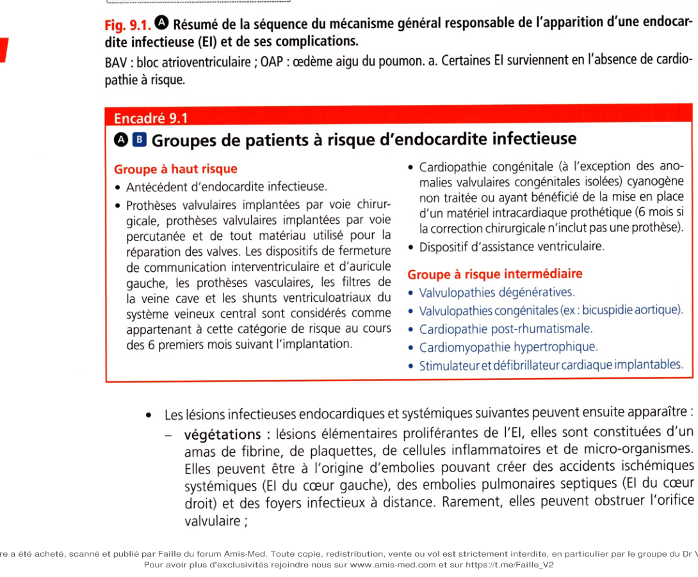
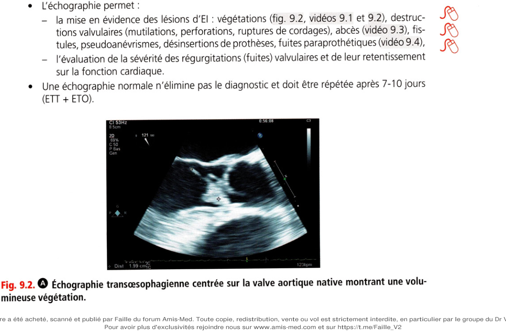
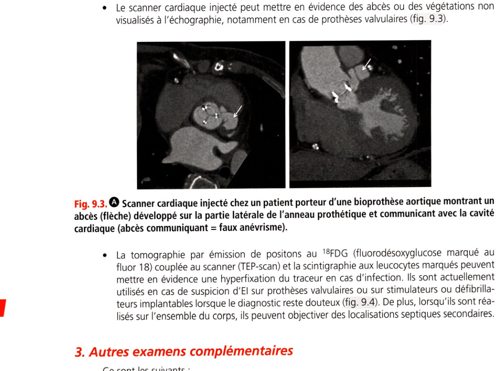
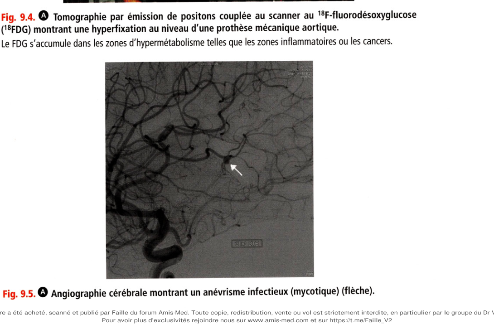
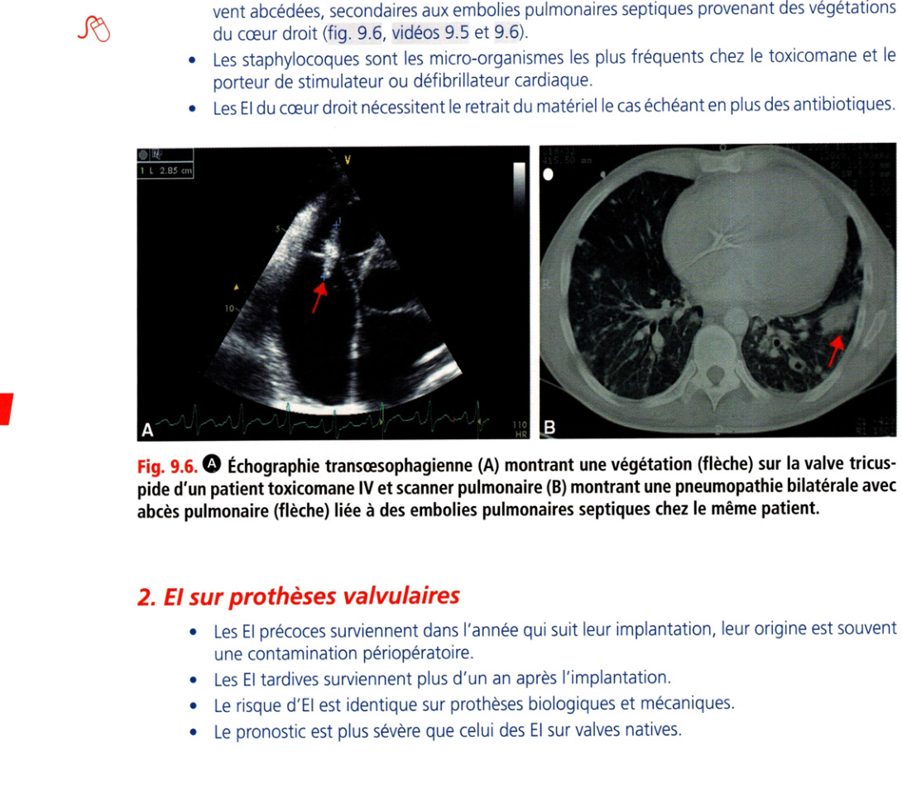
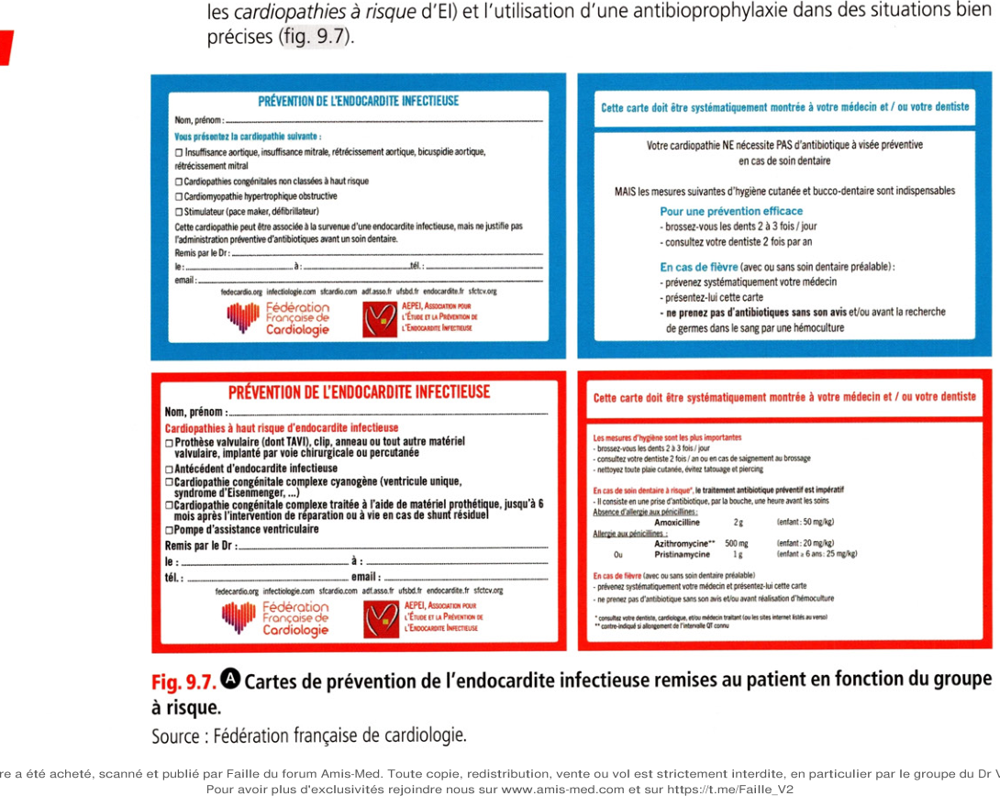

# Item 152 — Endocardite infectieuse

> **Collège CNEC / SFC** · 3e édition (2025) · p. 218–236 · R2C  
> Partie II — Maladies des valves

---

## Trois repères à ne pas confondre

| Badge | Signification (R2C) |
|---|---|
| **Rang A** | Connaissances fondamentales de fin de 2e cycle |
| **Rang B** | Connaissances essentielles, plus spécialisées |
| **Rang C** | Connaissances de 3e cycle (DES) |

Les pastilles du livre (● = A, ■ = B) sont reprises inline.

---

## Situations de départ

20 Découverte d'anomalies à l'auscultation pulmonaire.  
21 Asthénie.  
44 Hyperthermie/fièvre.  
50 Malaise/perte de connaissance.  
54 Œdème localisé ou diffus.  
58 Splénomégalie.  
89 Purpura/ecchymose/hématome.  
102 Hématurie.  
121 Déficit neurologique sensitif et/ou moteur.  
160 Détresse respiratoire aiguë.  
161 Douleur thoracique.  
162 Dyspnée.  
165 Palpitations.  
166 Tachycardie.  
186 Syndrome inflammatoire aigu ou chronique.  
187 Bactérie multirésistante à l'antibiogramme.  
203 Élévation de la protéine C-réactive (CRP).  
217 Baisse de l'hémoglobine.  
228 Découverte d'une anomalie osseuse et articulaire à l'examen d'imagerie médicale.  
232 Demande d'explication d'un patient sur le déroulement, les risques et les bénéfices attendus d'un examen d'imagerie.  
238 Demande et préparation aux examens endoscopiques (bronchiques, digestifs).  
239 Explication préopératoire et recueil de consentement d'un geste invasif diagnostique ou thérapeutique.  
248 Prescription et suivi d'un traitement par anticoagulant et/ou antiagrégant.  
253 Prescrire des diurétiques.  
255 Prescrire un anti-infectieux.  
271 Prescription et surveillance d'une voie d'abord vasculaire.  
285 Consultation de suivi éducation thérapeutique d'un patient avec antécédents cardiovasculaires.  
311 Prévention des infections liées aux soins.  
320 Prévention des maladies cardiovasculaires.  
352 Expliquer un traitement au patient (adulte/enfance/adolescent).  
354 Évaluation de l'observance thérapeutique.

---

## Hiérarchisation des connaissances

| Rang | Rubrique | Intitulé | Descriptif |
|---|---|---|---|
| **A** | Définition | Définition d'une endocardite infectieuse | |
| **A** | Épidémiologie | Épidémiologie de l'EI | |
| **A** | Épidémiologie | Situations à risque d'EI (cardiopathie groupe A, matériel intracardiaque, bactériémie à cocci Gram+) | |
| **A** | Étiologies | Principaux agents infectieux (bactéries, levures) | |
| **A** | Physiopathologie | Portes d'entrée selon l'agent infectieux | |
| **B** | Physiopathologie | Cardiopathies à risque d'EI du groupe B | |
| **A** | Diagnostic positif | Signes cliniques évocateurs | |
| **A** | Diagnostic positif | Démarche initiale du diagnostic microbiologique | |
| **B** | Diagnostic positif | Démarche si hémocultures initiales négatives | |
| **A** | Diagnostic positif | Démarche initiale de l'échocardiographie | |
| **B** | Diagnostic positif | Arguments échocardiographiques | |
| **A** | Examens complémentaires | Hiérarchisation des examens selon l'état clinique | |
| **B** | Examens complémentaires | Principales localisations emboliques | |
| **A** | Identifier une urgence | Antibiothérapie probabiliste | |
| **B** | Prise en charge | Prise en charge multidisciplinaire (équipe endocardite) | |
| **A** | Prise en charge | Principes du traitement antibiotique | |
| **A** | Prise en charge | Posologie des antibiothérapies | |
| **A** | Prise en charge | Antibiothérapie ambulatoire et voie orale | |
| **B** | Prise en charge | Prise en charge de la porte d'entrée | |
| **A** | Prise en charge | Éducation à la santé après un épisode d'EI | |
| **A** | Prise en charge | Principes de l'antibioprophylaxie | |
| **B** | Prise en charge | Posologies d'antibioprophylaxie si allergie à la pénicilline | |
| **A** | Prise en charge | Principales complications | Cardiaques, emboliques, infectieuses |
| **A** | Prise en charge | Délai de la prise en charge chirurgicale | |

---

## Parcours Rang A

- [I. Définition](#i-définition)
- [III. Micro-organismes en cause](#iii-micro-organismes-en-cause)
- [VI. Diagnostic](#vi-diagnostic)
- [VIII. Traitement](#viii-traitement)
- [IX. Prévention](#ix-prévention)

---

## Sommaire

- [Vignette clinique](#vignette-clinique)
- [I. Définition](#i-définition)
- [II. Épidémiologie](#ii-épidémiologie)
- [III. Micro-organismes en cause](#iii-micro-organismes-en-cause)
- [IV. Physiopathologie](#iv-physiopathologie)
- [V. Prise en charge multidisciplinaire](#v-prise-en-charge-multidisciplinaire)
- [VI. Diagnostic](#vi-diagnostic)
- [VII. Complications et pronostic](#vii-complications-et-pronostic)
- [VIII. Traitement](#viii-traitement)
- [IX. Prévention](#ix-prévention)
- [Points](#points)
- [Notions indispensables et inacceptables](#notions-indispensables-et-inacceptables)
- [Réflexes transversalité](#réflexes-transversalité)
- [Entraînement](../../Entrainement/QI/152_Endocardite_infectieuse.md)

---

## Vignette clinique

Monsieur H, âgé de 80 ans, présente des épisodes fébriles avec une fièvre à plus de 39 °C associée à des frissons depuis plus de 2 semaines. Il est porteur d'une valve aortique biologique qui lui a été posée 3 ans auparavant par voie percutanée (TAVI) pour un rétrécissement aortique. À l'examen, vous trouvez un patient dyspnéique au moindre effort et l'auscultation met en évidence un souffle diastolique intense maximal au foyer aortique et des râles crépitants des deux hémichamps pulmonaires. La fréquence cardiaque est à 35 bpm et la pression artérielle est de 145/45 mmHg.

> Quel est le premier diagnostic à évoquer ?

> Quels examens paracliniques demandez-vous en 1re intention ?

> Quelle antibiothérapie instaurez-vous avant d'obtenir les résultats des investigations ?

> Quelles complications suspectez-vous ?

> Quels examens d'imagerie peuvent être utiles ?

> Existe-t-il une indication chirurgicale théorique ?

> Après guérison, quels conseils et mesures préventives seraient indiqués chez ce patient pour éviter

une récidive ?

# I. Définition

**Rang A.** L'endocardite infectieuse (EI) est une infection de l'endocarde touchant le plus souvent une

ou plusieurs valves cardiaques natives mais pouvant également intéresser l'endocarde pariétal ou tout matériel intracardiaque implanté (prothèses valvulaires, sondes de stimulateurs, sondes de défibrillateurs, assistances ventriculaires, cathéter veineux central). Le micro-organisme (germe) en cause est une bactérie ou plus rarement un champignon (agent fongique). Il existe des endocardites non infectieuses beaucoup plus rares qui peuvent être liées à des cancers (endocardites marastiques) ou des maladies auto-immunes (lupus [lésions de Libman-Sacks], syndrome des anticorps antiphospholipides).

---

# II. Épidémiologie

**Rang A.**

L'incidence de l'EI n'a pas diminué au cours des dernières décennies mais le profil des patients atteints, ainsi que la répartition des micro-organismes en cause se sont modifiés. En effet, avec le vieillissement de la population, les progrès médicaux, la modification des modes de vie et la régression des valvulopathies post-rhumatismales, les patients atteints sont désormais plus âgés et/ou présentent d'autres situations exposant à l'EI comme : les valvulopathies dégénératives (fibrose, prolapsus mitral) ; l'augmentation des procédures de soins à risque : chirurgie cardiaque sous circulation extracorporelle, implantation de nouveaux dispositifs médicaux par voie percutanée (valves percutanées, clips valvulaires, fermeture de shunt intracardiaque, exclusion de l'auricule gauche, etc.), assistance ventriculaire, cœur artificiel, cathéters veineux, cathétérisme cardiaque, hémodialyse, implantation de stimulateur/défibrillateur cardiaque, ponction articulaire, chambre implantable sous-cutanée pour perfusions intraveineuses, etc. ; la toxicomanie intraveineuse.

---

# III. Micro-organismes en cause

**Rang A.** II s'agit le plus souvent d'une bactérie et plus rarement d'un champignon qui infecte l'endocarde à partir d'une porte d'entrée infectieuse (tableau 9.1). Les cocci Gram+ en amas

(Staphylococcus aureus et staphylocoques coagulase-négative) et en chaînettes (streptocoques et entérocoques) sont les micro-organismes le plus souvent retrouvés. Le Staphylococcus aureus représente actuellement la cause la plus fréquente.

**Tableau 9.1.** Micro-organismes le plus souvent en cause dans l'endocardite infectieuse avec leurs portes d'entrée potentielles.

| Micro-organisme (germe) | Fréquence (%) | Porte d'entrée |

|---|---|---|

| *Staphylococcus aureus* | 30 | Cutanée (plaies, cathéter veineux, cathéter de dialyse, toxicomanie IV, peropératoire, stimulateur/défibrillateur implantables, etc.) |

| Streptocoques oraux (*S. sanguis*, *S. mitis*, *S. salivarius*, *S. mutans*) | 20 | Buccodentaire |

| Streptocoques du groupe D (*S. gallolyticus* ou bovis) | 13 | Digestive (cancer, polypes, diverticules coliques) |

| Staphylocoques coagulase négative (*S. epidermidis*, *S. lugdunensis*, etc.) | 10 | Cutanée (plaies, cathéter veineux, cathéter de dialyse, toxicomanie IV, peropératoire, stimulateur/défibrillateur implantables, etc.) |

| Entérocoques (*E. faecalis*, *E. faecium*) | 10 | Digestive (cancer, polypes, diverticules coliques) ; urinaire |

| Bactéries du groupe HACEK | 5 | Buccodentaire |

| *Candida* et autres champignons | < 5 | Cutanée (immunosuppression, cathéter veineux, cathéter de dialyse, toxicomanie IV, peropératoire, stimulateur/défibrillateur implantables, etc.) |

| Autres (*Coxiella burnetii*, *Bartonella*, *Brucella*, *Chlamydia*, *Tropheryma whipplei*, etc.) | < 5 | Spécifique à chaque germe |

| Non retrouvé par différentes techniques | 5–10 | — |

HACEK : *Haemophilus* spp., *Aggregatibacter actinomycetemcomitans*, *Cardiobacterium hominis*, *Eikenella corrodens*, *Kingella kingae* ; IV : intraveineux.

HACEK : Haemophilus spp., Aggregatibacter actinomycetemcomitans, Cardiobacterium hominis, Eikenella corrodens, Kingella kingae ; IV : intraveineux.

---

# IV. Physiopathologie

**Rang A** · **Rang B**.

La séquence du mécanisme général responsable de l'apparition d'une El est la suivante et résumée dans la figure 9.1 . Une bactériémie (ou fongémie) importante et/ou répétée survient à partir d'une porte d'entrée infectieuse (situation à risque). Les micro-organismes qui ont pénétré dans la circulation sanguine peuvent coloniser et infecter des lésions préexistantes de l'endocarde. Les patients présentant ces lésions préexistantes forment une population dans laquelle l'incidence d'EI est plus importante et sont classés en deux groupes en fonction du niveau de risque (encadré 9.1). Parfois ces lésions n'étaient pas préalablement connues ou absentes (50 % des cas) avant le diagnostic d'EI. Lorsque le micro-organisme est très virulent (ex : Staphylococcus aureus), l'infection peut survenir sur un endocarde préalablement sain. (porte d’entrée)

- Altération de l’état général

- Choc septique

- Vascularite

- Glomérulonéphrite

- Anévrismes infectieux

(mycotiques)

- Hémorragies (cérébrale

et autres)

- Régurgitations (fuite)

valvulaire ou paraprothétique

- Fistules intracardiaques

- Insuffisance cardiaque aiguë

(OAP, choc cardiogénique)

- Foyers infectieux à distance

(abcès spléniques, rénaux, arthrites, spondylodiscite, méningite, etc.)

**Fig. 9.1.** Résumé de la séquence du mécanisme général responsable de l'apparition d'une endocardite infectieuse (EI) et de ses complications.

BAV : bloc atrioventriculaire ; OAP : œdème aigu du poumon, a. Certaines El surviennent en l'absence de cardiopathie à risque.

### Encadré 9.1

**Rang A.** Groupes de patients à risque d'endocardite infectieuse

• Cardiopathie congénitale (à l'exception des anomalies valvulaires congénitales isolées) cyanogène

non traitée ou ayant bénéficié de la mise en place d'un matériel intracardiaque prothétique (6 mois si la correction chirurgicale n'inclut pas une prothèse).

• Dispositif d'assistance ventriculaire.

Groupe à risque intermédiaire

• Valvulopathies dégénératives.

• Valvulopathies congénitales (ex: bicuspidie aortique).

• Cardiopathie post-rhumatismale.

• Cardiomyopathie hypertrophique.

• Stimulateur et défibrillateur cardiaque implantables.

Groupe à haut risque

• Antécédent d'endocardite infectieuse.

• Prothèses valvulaires implantées par voie chirurgicale, prothèses valvulaires implantées par voie

percutanée et de tout matériau utilisé pour la réparation des valves. Les dispositifs de fermeture de communication interventriculaire et d'auricule gauche, les prothèses vasculaires, les filtres de la veine cave et les shunts ventriculoatriaux du système veineux central sont considérés comme appartenant à cette catégorie de risque au cours des 6 premiers mois suivant l'implantation. Les lésions infectieuses endocardiques et systémiques suivantes peuvent ensuite apparaître :

• végétations : lésions élémentaires proliférantes de l'EI, elles sont constituées d'un

amas de fibrine, de plaquettes, de cellules inflammatoires et de micro-organismes. Elles peuvent être à l'origine d'embolies pouvant créer des accidents ischémiques systémiques (EI du cœur gauche), des embolies pulmonaires septiques (EI du cœur droit) et des foyers infectieux à distance. Rarement, elles peuvent obstruer l'orifice valvulaire ;

• destructions valvulaires : mutilations, perforations valvulaires ou ruptures de cordages

ou de sigmoïdes de bioprothèse pouvant être responsables de régurgitation (fuites) aiguës et d'insuffisance cardiaque ;

• abcès : collection de pus pouvant créer un bloc atrioventriculaire lorsqu'il est localisé

près des voies de conduction (abcès septal des EI aortiques), se rompre et créer un faux anévrisme ou une fistule intracardiaque ;

• désinsertions de prothèses valvulaires avec fuite paraprothétique ;

• phénomènes inflammatoires, immunologiques et vasculaires systémiques : choc

septique, anévrismes infectieux (Mycotiques) avec risque hémorragique, glomérulonéphrite, purpura vasculaire, lésions cutanéomuqueuses et ophtalmiques (faux panaris d'Osler, placards de Janeway, taches rétiniennes de Roth), présence de facteurs rhumatoïdes et éventuellement de cryoglobulinémie.

---

# V. Prise en charge multidisciplinaire

**Rang A.** Le diagnostic et le traitement des EI sont complexes et nécessitent l'implication de nombreux spécialistes. L'intégration d'une équipe endocardite permet d'améliorer le pronostic des

patients. Sa composition peut varier en fonction du type de centre mais doit au minimum inclure des cardiologues, chirurgiens cardiaques, spécialistes en maladies infectieuses et microbiologistes au sein d'un centre de prise en charge des valvulopathies. Cette équipe peut être complétée par d'autres spécialistes, notamment experts en imagerie cardiovasculaire. Une équipe endocardite doit être systématiquement consultée, soit en lui adressant les patients les plus complexes et graves, soit en l'impliquant à distance dans la prise en charge.

---

# VI. Diagnostic

**Rang A** · **Rang B**.

**Rang A.** L'EI est une maladie systémique à présentation polymorphe (tous les signes ne sont pas

forcément présents). Le contexte est très important pour évoquer le diagnostic. L'association d'un syndrome infectieux et de signes d'atteinte endocardique est très évocatrice.

**Tableaux cliniques évoquant un diagnostic d’endocardite infectieuse**

• Cardiopathie à risque d'EI + fièvre

• Souffle cardiaque + fièvre

• Accident ischémique + fièvre

• Purpura + fièvre

• Lombalgie + fièvre

## A. Signes cliniques

Les signes suivants peuvent être présents : syndrome infectieux :

• fièvre,

• altération de l'état général,

• splénomégalie (20-30 %) ;

signes cardiaques :

• souffle cardiaque. Devant un syndrome infectieux inexpliqué, le souffle cardiaque a

une valeur diagnostique considérable. La plus grande valeur est à l'apparition d'un nouveau souffle ou à la modification d'un souffle connu. L'absence de souffle ne permet cependant pas d'exclure le diagnostic,

• insuffisance cardiaque. Toute insuffisance cardiaque fébrile doit faire évoquer le diagnostic d'endocardite,

• syncopes, lipothymies. Elles peuvent être secondaires à un bloc atrioventriculaire lié à

un abcès septal interrompant les voies de conduction ; signes extracardiaques :

• neurologiques : signes d'AVC (ischémique ou hémorragique), méningite, hémorragie

méningée ou abcès cérébral,

• pulmonaires : signes d'insuffisance cardiaque gauche (OAP) ou d'embolie pulmonaire

septique (tableau de pneumopathies récidivantes abcédées),

• articulaires : signes d'arthrite périphérique ou de spondylodiscite (foyer infectieux à

distance),

• cutanéomuqueux. Ils sont rares (5-15 % des cas) : purpura, nodosités (« faux panaris ») d'Osler, pathognomoniques, hémorragies sous-unguéales, hémorragies sousconjonctivales, placards érythémateux palmoplantaires de Janeway,

• ophtalmiques : taches de Roth au fond d'œil (exsudats hémorragiques rétiniens),

• rénaux : hématurie (et/ou protéinurie) pouvant témoigner d'une glomérulonéphrite

immunologique ou d'un infarctus rénal.

## B. Signes paracliniques

Les hémocultures et l'échographie cardiaque sont les deux piliers du diagnostic de l'EI mais sont parfois insuffisantes. Les examens complémentaires ont pour but de mettre en évidence le micro-organisme en cause, de confirmer l'atteinte infectieuse de l'endocarde, d'identifier les complications et la porte d'entrée infectieuse.

### 1. Identification microbiologique

Hémocultures Elles permettent d'isoler le micro-organisme responsable dans 90 % des cas (10 % d'EI à hémocultures négatives). Idéalement, trois prélèvements sanguins veineux en moyenne doivent être réalisés à au moins 30 minutes d'intervalle avant toute antibiothérapie avec mise en culture aéroanaérobie. Le sang ne doit pas être prélevé sur un cathéter déjà en place. Ils sont à répéter durant 2 ou 3 jours si les hémocultures initiales sont négatives, notamment chez les sujets ayant reçu des antibiotiques. La suspicion d'EI est à signaler au laboratoire de microbiologie car il faut parfois un temps de culture long pour les microorganismes à croissance difficile (groupe HACEK [Haemophilus spp., Aggregatibacter actinomycetemcomitans, Cardiobacterium hominis, Eikenella corrodens, Kingella kingae], Brucella, streptocoques déficients, levures). Si la présomption d'EI est forte et si les hémocultures restent négatives, on doit envisager les étiologies des EI à hémocultures négatives (encadré 9.2) et recourir à d'autres méthodes diagnostiques parfois combinées qui incluent des techniques spéciales d'hémocultures, les sérologies et l'amplification génique {polymerase chain reaction [PCR]).

### Encadré 9.2

Causes d'endocardite à hémocultures négatives

• **Rang A.** Antibiothérapie préalable à la réalisation des

hémocultures

• El dues à des micro-organismes à croissance lente

ou difficile

• Streptocoques déficients

• Groupe HACEK

• Brucella

• Champignons (agents fongiques)

• El dues à des micro-organismes intracellulaires

• Coxiella burnetii (agent de la fièvre Q)

• Chlamydia

• Bartonella

• Tropheryma whipplei (agent de la maladie de

Whipple)

• Mycoplasma

• Légionella

• Endocardites non infectieuses (lupus, syndrome

des anticorps antiphospholipides, cancer [endocardites marastiques]) HACEK : Haemophilus spp., Aggregatibacter actinomycetemcomitans, Cardiobacterium hominis, Eikenella corrodens, Kingella kingae. Analyse de la pièce chirurgicale Si le patient a dû être opéré, les fragments de valves, végétations, abcès, matériel intracardiaque retirés doivent être analysés sur le plan histologique, mis en culture et éventuellement testés par amplification génique (PCR).

### 2. Identification de l'atteinte infectieuse de l'endocarde

Échographie cardiaque Une échographie transthoracique (ETT) est systématiquement réalisée en 1re intention dans tous les cas. Une échographie transœsophagienne (ETO) est systématiquement réalisée si l'ETT est positive, si elle est négative avec une forte suspicion, et systématiquement en cas de matériel intracardiaque (prothèses, stimulateurs, défibrillateurs, etc.). Elle a une meilleure sensibilité que l'ETT. L'échographie permet :

• la mise en évidence des lésions d'EI : végétations (fig. 9.2, vidéos 9.1 et 9.2), destruc-

J\j tions valvulaires (mutilations, perforations, ruptures de cordages), abcès (vidéo 9.3), fistules, pseudoanévrismes, désinsertions de prothèses, fuites paraprothétiques (vidéo 9.4),

• l'évaluation de la sévérité des régurgitations (fuites) valvulaires et de leur retentissement

sur la fonction cardiaque. Une échographie normale n'élimine pas le diagnostic et doit être répétée après 7-10 jours (ETT + ETO).

**Fig. 9.2.** Échographie transœsophagienne centrée sur la valve aortique native montrant une volumineuse végétation.

Autres examens d'imagerie cardiaque Le scanner cardiaque injecté peut mettre en évidence des abcès ou des végétations non visualisés à l'échographie, notamment en cas de prothèses valvulaires (fig. 9.3).

**Fig. 9.3.** Scanner cardiaque injecté chez un patient porteur d'une bioprothèse aortique montrant un

abcès (flèche) développé sur la partie latérale de l'anneau prothétique et communicant avec la cavité cardiaque (abcès communiquant = faux anévrisme). La tomographie par émission de positons au ,8 FDG (fluorodésoxyglucose marqué au fluor 18) couplée au scanner (TEP-scan) et la scintigraphie aux leucocytes marqués peuvent mettre en évidence une hyperfixation du traceur en cas d'infection. Ils sont actuellement utilisés en cas de suspicion d'EI sur prothèses valvulaires ou sur stimulateurs ou défibrillateurs implantables lorsque le diagnostic reste douteux (fig. 9.4). De plus, lorsqu'ils sont réalisés sur l'ensemble du corps, ils peuvent objectiver des localisations septiques secondaires.

### 3. Autres examens complémentaires

Ce sont les suivants : NFS, plaquettes à la recherche d'une hyperleucocytose à PNN (polynucléaires neutrophiles), d'une anémie inflammatoire ou hémolytique, d'une thrombopénie ; CRP : une élévation est en faveur d'un syndrome inflammatoire ; facteur rhumatoïde : témoin d'une réaction immunologique ; ionogramme sanguin, créatininémie, recherche hématurie et protéinurie : à la recherche d'anomalies liées aux complications rénales ; ECG : à la recherche d'anomalies de la conduction (BAV), d'ischémie myocardique (embolies coronariennes) ; radiographie thoracique : pour visualiser des signes d'OAP (EI du cœur gauche) ou de pneumopathies (EI du cœur droit) ; scanner cérébral et thoraco-abdomino-pelvien : à la recherche de localisations septiques secondaires qui peuvent être parfois asymptomatiques (encéphale, rate, rein, foie, vertèbres, etc.) et d'anévrismes infectieux (mycotiques). Il est fait après injection de produit de contraste si la fonction rénale le permet (risque d'insuffisance rénale aiguë) ; IRM cérébrale : de meilleure sensibilité que le scanner mais moins disponible ; angiographie cérébrale : en cas de suspicion d'anévrisme infectieux (mycotique) (fig. 9.5) ; coronarographie, troponine : en cas de suspicion d'embolie coronarienne ; examens à la recherche de la porte d'entrée infectieuse dépendant notamment du microorganisme identifié. La porte d'entrée n'est identifiée que dans 50 % des cas. Il peut s'agir :

• d'une origine buccodentaire : panoramique dentaire + consultation stomatologique,

• d'une origine digestive : coloscopie à la recherche d'une tumeur colique en cas d'EI à

Streptococcus gallolyticus (ex : S. bovis) ou à entérocoques,

• d'une origine urinaire : ECBU (examen cytobactériologique des urines), échographie (ou

scanner) des voies urinaires. V

**Fig. 9.4.** Tomographie par émission de positons couplée au scanner au 18F-fluorodésoxyglucose

(18FDG) montrant une hyperfixation au niveau d'une prothèse mécanique aortique. Le FDG s'accumule dans les zones d'hypermétabolisme telles que les zones inflammatoires ou les cancers.

## C. Formes cliniques

### 1. El du cœur droit

• El Elles touchent surtout les toxicomanes intraveineux, les porteurs de stimulateurs ou

défibrillateurs cardiaques, les porteurs de voies veineuses centrales et les personnes souffrant de cardiopathies congénitales avec atteinte droite. On note des signes respiratoires liés à des pneumopathies infectieuses récidivantes et souvent abcédées, secondaires aux embolies pulmonaires septiques provenant des végétations du cœur droit (fig. 9.6, vidéos 9.5 et 9.6). Les staphylocoques sont les micro-organismes les plus fréquents chez le toxicomane et le porteur de stimulateur ou défibrillateur cardiaque. Les El du cœur droit nécessitent le retrait du matériel le cas échéant en plus des antibiotiques.

**Fig. 9.6.** Échographie transœsophagienne (A) montrant une végétation (flèche) sur la valve tricuspide d'un patient toxicomane IV et scanner pulmonaire (B) montrant une pneumopathie bilatérale avec

abcès pulmonaire (flèche) liée à des embolies pulmonaires septiques chez le même patient.

### 2. El sur prothèses valvulaires

Les El précoces surviennent dans l'année qui suit leur implantation, leur origine est souvent une contamination périopératoire. Les El tardives surviennent plus d'un an après l'implantation. Le risque d'EI est identique sur prothèses biologiques et mécaniques. Le pronostic est plus sévère que celui des EI sur valves natives.

## D. Critères diagnostiques

Compte tenu du caractère polymorphe de cette maladie, des critères diagnostiques ont été établis permettant de classer les diagnostics en « certain », « possible » et « exclu ». Ils sont résumés dans l'encadré 9.3.

### Encadré 9.3

Résumé des critères diagnostiques des endocardites infectieuses, adapté des recommandations européennes de 2023

**Rang B.** El certaine

• Critères histologiques : mise en évidence d'un

micro-organisme sur la culture d'une valve ou d'un fragment d'embole, ou mise en évidence d'une végétation ou d'un abcès avec infection active sur un examen anatomopathologique si la chirurgie a dû être effectuée.

• Critères cliniques :

- 2 critères majeurs

- ou 1 critère majeur et 3 mineurs

- ou 5 critères mineurs

• possible

• 1 critère majeur et 1 ou 2 mineurs

• Ou 3 critères mineurs

• exclue

• Absence de critères d'EI certaine et possible.

Critères cliniques Critères cliniques majeurs (2)

• Hémocultures positives pour l'EI

- > 2 hémocultures à micro-organisme typique d'EI

(S. aureus, streptocoques oraux, Streptococcus gallolyticus, Enterococcus faecalis, groupe HAC EK)

- Ou > 2 hémocultures positives d'échantillons

sanguins prélevés à plus de 12 heures d'intervaIle

- Ou ensemble de 3 ou une majorité de > 4 hémocultures distinctes (avec le premier et le dernier

prélèvement à > 1 heure d'intervalle) à microorganisme typique d'EI

- Ou > 1 hémoculture positive ou une sérologie

positive à Coxiella burnetii (IgG phase I >1/800)

• Imagerie positive pour les lésions d'EI. Lésions

anatomiques et métaboliques valvulaires, périvalvulaires/périprothétiques et de matériel étranger caractéristiques d'EI, détectées par l'une des techniques d'imagerie suivantes :

- échocardiographie (ETT ou ETO)

- scanner cardiaque

- TEP-scanner cardiaque au 18FDG

- scintigraphie cardiaque aux leucocytes marqués

Critères cliniques mineurs (5)

• Patient à haut risque ou risque intermédiaire d’EI

ou toxicomanie IV

• Fièvre (température > 38 °C)

• Phénomènes vasculaires (asymptomatiques

inclus) : embolies artérielles systémiques ou pulmonaires, anévrismes infectieux (mycotiques), hémorragies, placards de Janeway

• Phénomènes immunologiques : glomérulonéphrite, nodosités d'Osler, taches de Roth, facteurs rhumatoïdes

• Argument microbiologique n'entrant pas dans

la définition d'un critère majeur : hémocultures, sérologies

• : endocardite infectieuse ; ETO : échographie transœsophagienne ;

ETO : échographie transthoracique; FDG : fluorodésoxyglucose ; HACEK : Haemophilus spp., Aggregatibacteractinomycetemcomitans, Cardiobacterium hominis, Eikenella corrodent, Kingella kingae ; IgG : immunoglobulines G ; IV : intraveineux ; TEP : tomographie par émission de positions. Source : Delgado V, Ajmone Marsan N, de Waha S, et al. 2023 ESC Guidelines for the management of endocarditis. Eur Heart J. 2023;44(39):3948-4042. doi: 10.1093/eurheartj/ehad193

---

# VII. Complications et pronostic

**Rang A** · **Rang B**.

• **Rang A.** C'est une maladie grave dont la mortalité hospitalière est de l'ordre de 1 5-30 %.

Les principales complications sont résumées dans la figure 9.1 . Les principales causes de décès sont l'insuffisance cardiaque aiguë et les complications neurologiques. Les principaux facteurs de mauvais pronostic sont :

• l'insuffisance cardiaque aiguë ;

• les complications neurologiques ;

• le syndrome infectieux mal maîtrisé ;

• les abcès intracardiaques ;

• les El sur prothèses ;

• des végétations volumineuses

• les micro-organismes très virulents : Staphylococcus aureus et champignons ;

• le terrain fragile (comorbidités) : âge avancé, diabète, immunodépression, insuffisances

cardiaque, rénale, respiratoire préexistantes.

---

# VIII. Traitement

**Rang A** · **Rang B**.

Il repose sur l'antibiothérapie (ou les antifongiques), l'identification d'indications chirurgicales, la prise en charge des complications, le traitement de la porte d'entrée et la surveillance. Il nécessite une prise en charge par des équipes spécialisées associant notamment cardiologues, infectiologues et chirurgiens cardiaques.

## A. Antibiothérapie (principes généraux)

Le choix se porte sur une antibiothérapie bactéricide, associant plusieurs molécules synergiques, à fortes doses, par voie intraveineuse pendant une durée prolongée (4 à 6 semaines). Une antibiothérapie probabiliste est instaurée après les hémocultures et avant leur résultat en cas de forte suspicion ou de sepsis sévère ou d'indication chirurgicale urgente. L'antibiothérapie est secondairement adaptée aux résultats des prélèvements microbiologiques (antibiogramme) avec l'aide d'un infectiologue (tableau 9.2).

**Tableau 9.2.** Résumé de l'antibiothérapie IV des principales endocardites infectieuses.

| Micro-organisme en cause | Absence d'allergie à la pénicilline | Allergie à la pénicilline |

|---|---|---|

| Non identifié (probabiliste), EI communautaire sur valve native ou prothèse > 1 an | Ampicilline + ceftriaxone (ou oxacilline) + gentamicine | Céfazoline ou vancomycine + gentamicine |

| Non identifié (probabiliste), EI non communautaire ou prothèse < 1 an | Vancomycine (ou daptomycine) + gentamicine + rifampicine | Idem |

| Staphylocoques méthicilline-sensibles, valve native | Cloxacilline (ou céfazoline) 4 à 6 semaines | Céfazoline 4 à 6 semaines |

| Staphylocoques méthicilline-sensibles, prothèse | Cloxacilline (ou céfazoline) + rifampicine 6 semaines + gentamicine 2 semaines | Céfazoline + rifampicine 6 semaines + gentamicine 2 semaines |

| Staphylocoques méthicilline-résistants, valve native | Vancomycine 4–6 semaines | Idem |

| Staphylocoques méthicilline-résistants, prothèse | Vancomycine + rifampicine 6 semaines + gentamicine 2 semaines | Idem |

| Streptocoques oraux et *Streptococcus gallolyticus*, valve native | Pénicilline G (ou amoxicilline ou ceftriaxone) 4 semaines (+ gentamicine 2 semaines si résistance à la pénicilline) | Vancomycine 4 semaines |

| Streptocoques oraux et *Streptococcus gallolyticus*, prothèse | Pénicilline G (ou amoxicilline ou ceftriaxone) 6 semaines | Vancomycine 6 semaines + gentamicine 2 semaines |

| Entérocoques, valve native | Amoxicilline (ou ampicilline) + ceftriaxone 6 semaines (ou remplacer ceftriaxone par gentamicine 2 semaines) | Vancomycine 6 semaines + gentamicine 2 semaines |

| Entérocoques, prothèse | Amoxicilline (ou ampicilline) + ceftriaxone 6 semaines (ou remplacer ceftriaxone par gentamicine 2 semaines) | Vancomycine 6 semaines + gentamicine 2 semaines |

| Entérocoques résistants à la gentamicine, valve native ou prothèse | Amoxicilline (ou ampicilline) + ceftriaxone 6 semaines | Vancomycine 6 semaines + gentamicine 2 semaines |

| Entérocoques résistants aux bêtalactamines, valve native ou prothèse | Vancomycine 6 semaines + gentamicine 2 semaines | Idem |

| Entérocoques résistants à la vancomycine, valve native ou prothèse | Daptomycine + ampicilline (ou fosfomycine) 6 semaines | Daptomycine + fosfomycine 6 semaines |

Le détail des doses est disponible dans les recommandations européennes ESC 2023.

européennes de 2023 (https://academic.oup.com/eurheartj/article/44/39/3948/72431077logi n=false).

• **Rang A.** La durée de traitement est identique même si une intervention chirurgicale est

nécessaire. Les doses doivent être adaptées aux fonctions rénale et hépatique ainsi qu'aux mesures des concentrations plasmatiques d'aminosides et de vancomycine. L'efficacité du traitement est surveillée régulièrement par :

• la régression de la fièvre ;

• la régression du syndrome inflammatoire biologique ;

• la stérilisation des hémocultures ;

• l'évolution favorable des lésions à l'échographie ;

• l'absence de complications (clinique, imagerie, ECG, biologie).

On surveille régulièrement la tolérance du traitement en évaluant la fonction rénale sous aminosides et vancomycine surtout, mais aussi amoxicilline (par réactions immunoallergiques ou cristalluries, responsables d'atteintes interstitielles aiguës ou de nécroses tubulaires aiguës). L'antibiothérapie parentérale peut être poursuivie en ambulatoire ou remplacée par voie orale chez les patients souffrant d'une El gauche causée par des streptocoques, des entérocoques ou des staphylocoques, qui ont reçu un traitement antibiotique IV approprié pendant au moins 10 jours (ou au moins 7 jours après une chirurgie cardiaque), qui sont cliniquement stables et qui ne présentent pas d'abcès ou d'anomalies valvulaires nécessitant une intervention chirurgicale sur l'ETO.

## B. Chirurgie

**Rang A.** Dans environ 50 % des cas, il existe une indication à réaliser une chirurgie cardiaque sans

attendre la fin du traitement antibiotique (phase active de l'EI). Celle-ci peut être présente d'emblée ou apparaître au cours de l'évolution. Dès que le diagnostic est posé, un chirurgien cardiaque doit être prévenu. Le traitement consiste en un débridement des tissus infectés ou nécrosés, puis la réparation (plastie) valvulaire si c'est possible ou le remplacement valvulaire par prothèse biologique ou mécanique. Les principales indications sont hémodynamiques (H), infectieuses (I) et emboliques (E).

**Rang A.** Le délai d'intervention dépend du type d'indication et il est catégorisé en très urgent (TU :

dans les 24 heures), urgent (U : dans les 3 à 5 jours), non urgent (NU : au cours de la même hospitalisation) (encadré 9.4).

### Encadré 9.4

**Rang A.** O Principales indications chirurgicales en phase active d'une

• (H) Insuffisance cardiaque gauche réfractaire ou

choc cardiogénique (TU)

• (H) Insuffisance cardiaque gauche ou signe échographique de mauvaise tolérance (U)

• (I) Infection non contrôlée localement : abcès, fistule, faux anévrisme intracardiaque ou végétations

augmentant de taille, désinsertion de prothèse, bloc atrioventriculaire (U)

• (I) El fongique ou à germes multirésistants (NU)

• (I) El sur prothèse valvulaire à Staphylococcus

aureus ou bactéries non HACEK à Gram négatif (U)

• (I) Persistances d'hémocultures positives malgré

> 7 jours d'antibiothérapie et contrôle des embolies et métastases septiques (U)

• (E) Végétations du cœur gauche > 10 mm persistantes après un ou plusieurs épisodes emboliques

malgré une antibiothérapie adaptée (U)

• (E) Végétations du cœur gauche > 10 mm associée à une autre indication de chirurgie (U)

(E) : indications emboliques; (H) : indications hémodynamiques; (I) : indications infectieuses. HACEK : Haemophilus spp., Aggregatibacter actinomycetemcomitans, Cardiobacterium hominis, Eikenella corrodens, Kingella kingæ. Si la chirurgie n'était pas indiquée en phase active, une chirurgie à distance est parfois nécessaire. Les indications sont alors celles de toutes les valvulopathies (cf. item 233 - chapitre 8).

---

# IX. Prévention

**Rang A** · **Rang B**.

**Rang A.** Elle repose sur des mesures non spécifiques d'éducation de tous les patients à risque (toutes

les cardiopathies à risque d'EI) et l'utilisation d'une antibioprophylaxie dans des situations bien précises (fig. 9.7). MAIS les mesures suivantes d’hygiène cutanée et bucco-dentaire sont indispensables

**Fig. 9.7.** Cartes de prévention de l'endocardite infectieuse remises au patient en fonction du groupe

à risque. Source : Fédération française de cardiologie.

## A. Mesures non spécifiques d'éducation

Elles concernent tous les patients présentant des cardiopathies à risque d'EI : maintenir une bonne hygiène buccodentaire et prévoir une consultation chez un dentiste 2 fois/an dans les cardiopathies à haut risque et 1 fois/an pour les autres ; désinfecter les plaies ; éradiquer les colonisations bactériennes chroniques (cutanées et urinaires) ; traiter les infections bactériennes locales par antibiotiques ; veiller à une asepsie stricte lors de procédures à risque de bactériémie ; éviter les effractions cutanées : tatouages, piercing ; limiter l'utilisation des voies veineuses et les changer régulièrement en cas de besoin prolongé ; éviter l'automédication par antibiotiques et consulter rapidement son médecin en cas de fièvre.

## B. Antibioprophylaxie

Son principe consiste à administrer une dose d'antibiotique avant une procédure à risque de bactériémie. Son efficacité n'a jamais été prouvée formellement. Son utilisation se limite seulement aux patients à haut risque (cf. encadré 9.1) devant recevoir des soins dentaires avec manipulation de la gencive ou de la région périapicale ou en cas d'effraction de la muqueuse. Elle consiste à administrer chez l'adulte :

• amoxicilline (ou ampicilline) 2 g per os ou IV ou céfazoline (ou ceftriaxone) 1 g IM ou

IV 30-60 minutes avant la procédure ;

• Q en cas d'allergie à la pénicilline : céfalexine 2 g per os, ou azithromycine 500 mg per

os ou doxycycline 100 mg per os ou céfazoline ou ceftriaxone 1 g IM ou 30-60 minutes avant la procédure.

• **Rang A.** L'EI peut toucher des valves natives et du matériel intracardiaque implanté.

• Les cardiopathies à haut risque d'EI sont :

- les prothèses valvulaires (TAVI inclus) et matériels utilisés pour réparation valvulaire ;

---

## Points

- un antécédent d'endocardite ;

- une cardiopathie congénitale cyanogène ;

- toute cardiopathie congénitale réparée avec un matériel prothétique pendant les 6 mois après la pro-

• cédure ou à vie s'il existe un shunt résiduel.

• Les El sur prothèses et à staphylocoques sont les plus graves.

• Dans 50 % des cas, la cardiopathie à risque n'était pas connue ou absente.

• Les procédures à risque d'EI sont en augmentation : chirurgie sous circulation extracorporelle, cathéters

• veineux, cathétérisme cardiaque, hémodialyse, implantation de stimulateur/défibrillateur cardiaque, ponc-

• tion articulaire, chambre implantable sous-cutanée pour perfusions intraveineuses, toxicomanie IV, etc.

• Les staphylocoques sont les germes le plus souvent retrouvés.

• Les principales complications sont : insuffisance cardiaque, embolies systémiques, embolies pulmo-

• naires septiques, anévrisme infectieux, hémorragie, choc septique, BAV (abcès septal), vascularite, foyers

• infectieux à distance (méningite, arthrite, spondylodiscite, abcès viscéraux, etc.).

• Le diagnostic est évoqué devant une association fièvre + cardiopathie à risque, fièvre + souffle, ou fièvre

• + événement embolique.

• Les signes cliniques associent un syndrome infectieux, des signes cardiaques et des signes extracardiaques.

• Les hémocultures et l’échographie cardiaque transthoracique/transœsophagienne sont deux piliers du

• diagnostic.

• Les hémocultures peuvent être négatives dans 10 % des cas.

• Le scanner cardiaque, le TEP-scan et la scintigraphie aux leucocytes marqués peuvent avoir un intérêt

• en cas d'échographie non contributive.

• La porte d’entrée infectieuse doit être recherchée en fonction du germe en cause :

- staphylocoques, Candida : cutanée ;

- streptocoques oraux, HACEK : buccodentaire ;

- streptocoques D (S. gallolyticus) : digestive (coloscopie) ;

- entérocoques : digestive (coloscopie), urinaire.

• Le traitement repose sur l'antibiothérapie (ou les antifongiques), l’identification d’indications chirurgi-

• cales, la prise en charge des complications, le traitement de la porte d'entrée et la surveillance.

• L'antibiothérapie doit être prolongée (4-6 semaines) par voie IV, bactéricide, synergique et débutée

• après les hémocultures (sans attendre les résultats).

• En cas d'EI sur stimulateur ou défibrillateur ou cathéter central veineux, tout le matériel doit être extrait

• (souvent par voie percutanée) et réimplanté à distance.

• La prévention de l’EI repose sur des mesures non spécifiques d'éducation de tous les patients à risque

• (toutes les cardiopathies à risque d'EI) et l'utilisation d'une antibioprophylaxie uniquement chez les

• patients avec cardiopathie à haut risque devant subir des soins dentaires avec manipulation de la gen-

• cive ou de la région périapicale ou en cas d'effraction de la muqueuse (amoxicilline ou clindamycine

• 30-60 minutes avant).
---

## Notions indispensables et inacceptables

### Notions indispensables

• Les cardiopathies à haut risque d'EI sont :
• - les prothèses valvulaires (TAVI inclus) et matériels utilisés pour réparation valvulaire ;
• - un antécédent d'endocardite ;
• - une cardiopathie congénitale cyanogène ;
• - toute cardiopathie congénitale réparée avec un matériel prothétique pendant les 6 mois après la procé-
• dure ou à vie s'il existe un shunt résiduel.
• Les staphylocoques sont les germes le plus souvent retrouvés.
• Les principales complications sont : insuffisance cardiaque, embolies systémiques, embolies pulmonaires
• septiques, anévrisme infectieux, hémorragie, choc septique, BAV (abcès septal), vascularite, foyers infec-
• tieux à distance (méningite, arthrite, spondylodiscite, abcès viscéraux, etc.).
• Le diagnostic est évoqué devant une association fièvre + cardiopathie à risque, fièvre + souffle, ou fièvre
• + événement embolique.
• Les hémocultures et l'échographie cardiaque transthoracique/transœsophagienne sont deux piliers du
• diagnostic.
• Le traitement repose sur l'antibiothérapie (ou les antifongiques), l'identification d'indications chirurgicales,
• la prise en charge des complications, le traitement de la porte d'entrée et la surveillance.
• Les principales indications chirurgicales pendant le traitement antibiotique (phase active) sont hémo-
• dynamiques, infectieuses et emboliques.
• La prévention de l'EI repose sur des mesures non spécifiques d'éducation de tous les patients à risque
• (toutes les cardiopathies à risque d'EI) et l'utilisation d'une antibioprophylaxie uniquement chez les patients
• avec cardiopathie à haut risque devant subir des soins dentaires avec manipulation de la gencive ou de
• la région périapicale ou en cas d'effraction de la muqueuse (amoxicilline ou clindamycine 30-60 minutes
• avant).

### Notions inacceptables

• Ne pas évoquer une El devant l'association d'une fièvre et d'un souffle cardiaque ou d'une cardiopathie
• à risque.
• Ne pas évoquer l'EI devant les tableaux suivants : souffle et fièvre, AVC et fièvre, lombalgie et fièvre, pur-
• pura et fièvre.
• Débuter les antibiotiques avant la réalisation d'hémocultures en cas de suspicion d'EI.
• Prescrire de la pénicilline en cas d'allergie.
• Oublier les mesures de prévention non médicamenteuses chez les patients à risque.

---

## Réflexes transversalité

• Item 147 - Fièvre aiguë chez l'enfant et l'adulte
• Item 151 - Méningite, méningoencéphalite, abcès cérébral chez l'adulte et l'enfant
• Item 153 - Surveillance des porteurs de valves et prothèses vasculaires
• Item 155 - Infections cutanéomuqueuses et des phanères, bactériennes et mycosiques de l'adulte et de
• l'enfant
• Item 156 - infections ostéoarticulaires de l'enfant et de l'adulte
• Item 157 - Septicémie/Bactériémie/fongémie de l'adulte et de l'enfant
• Item 158 - Sepsis et choc septique de l'enfant et de l'adulte
• Item 161 - Infections urinaires de l'enfant et de l'adulte
• Item 177 - Prescription et surveillance des anti-infectieux chez l'adulte et l'enfant
• Item 190 - Fièvre prolongée
• Item 191 - Fièvre chez un patient immunodéprimé
• Item 194 - Lupus systémique. Syndrome des antiphospholipides
• Item 200 - Douleur et épanchement articulaire. Arthrite d'évolution récente
• Item 229 - Surveillance et complications des abords veineux
• Item 233 - Valvulopathies
• Item 234 - Insuffisance cardiaque de l'adulte
• Item 236 - Troubles de la conduction intracardiaque
• Item 238 - Souffle cardiaque de l'enfant
• Item 261 - Néphropathie glomérulaire
• Item 275 - Splénomégalie
• Item 301 - Tumeurs du côlon et du rectum
• Item 332 - État de choc. Principales étiologies : hypovolémique, septique, cardiogénique, anaphylactique
• Item 340 - Accidents vasculaires cérébraux
• Quelles sont les cardiopathies considérées à haut risque d'endocardite infectieuse ?
• A Bicuspidie aortique
• B Prolapsus valvulaire mitral
• C Antécédent d'endocardite infectieuse
• D Prothèse valvulaire
• E Cardiopathie congénitale cyanogène non corrigée
• Quelles sont les causes possibles d'endocardites à hémocultures négatives ?
• A Hémocultures prélevées avant la mise sous antibiotiques
• B Endocardite à Coxiella burnetii (agent de la fièvre Q)
• C Endocardite liée à un lupus ou un syndrome des anticorps antiphospholipides
• D Endocardite à champignons
• E Aucune de ces réponses
• Concernant l'imagerie cardiaque lors d'une endocardite infectieuse, quelles sont les réponses exactes ?
• A Le TEP-scanner est l'examen de référence
• B L'échocardiographie transœsophagienne peut être normale
• C L'échocardiographie doit être répétée lors de la surveillance du traitement
• D Le scanner cardiaque peut mettre en évidence un abcès
• E L'échocardiographie transœsophagienne est systématique en cas de prothèse valvulaire
• ___________________________________________
• Concernant le traitement antibiotique des endocardites infectieuses, quelles sont les réponses exactes ?
• A Dans certains cas, il peut durer moins d'une semaine
• B En cas d'endocardite à Enterococcus faecalis, une association amoxicilline + ceftriaxone peut être proposée
• C La gentamicine a une toxicité rénale
• D L'amoxicilline a une toxicité rénale
• E En cas de prothèse valvulaire implantée depuis moins d'un an, la suspicion d'endocardite doit faire prescrire
• une association vancomycine + gentamicine + rifampicine en attendant le résultat des hémocultures
• Concernant la prévention des endocardites infectieuses, quelles sont les réponses exactes ?
• A Elle est indiquée pour toutes les cardiopathies à risque
• B Les piercings peuvent constituer une porte d'entrée infectieuse
• C Une perfusion peut constituer une porte d'entrée infectieuse
• D Une antibioprophylaxie est indiquée en cas de coloscopie chez un patient porteur de prothèse
• E Une antibioprophylaxie est indiquée en cas de soins dentaires touchant la gencive et la région périapicale
• chez un patient porteur d'un prolapsus valvulaire mitral avec fuite sévère
• par des flashcodes. Pour accéder à ces compléments, connectez-vous sur http://www.em-
• consulte.com/e-complement/478661 et suivez les instructions pour activer votre accès.
• native montrant une volumineuse végétation et une destruction des sigmoïdes entraînant une insuf-
• fisance aortique.
• native montrant une volumineuse végétation et une destruction des sigmoïdes entraînant une insuf-
• fisance aortique.
• annulaire (épaississement autour de la prothèse).
• désinsertion avec une insuffisance mitrale paraprothétique.
• toxicomane IV.
• (images mobiles) appendues sur l'une des sondes d'un stimulateur cardiaque.
• Item 153
• Surveillance des porteurs
• de valve et prothèses
• vasculaires1
• I.
• Les différents types de prothèses valvulaires
• II. Physiopathologie
• III. Complications des prothèses valvulaires
• IV. Surveillance des porteurs de valve cardiaque
• ■ 18 Découverte d'anomalies à l'auscultation cardiaque.
• I 20 Découverte d'anomalies à l'auscultation pulmonaire.
• ■ 21 Asthénie.
• ■ 22 Diminution de la diurèse.
• ■ 44 Hyperthermie/fièvre.
• I 50 Malaise/perte de connaissance.
• I 58 Splénomégalie.
• ■ 59 Tendance au saignement.
• I 60 Hémorragie aiguë.
• 1 89 Purpura/ecchymoses/hématome.
• ■ 102 Hématurie.
• ■ 121 Déficit neurologique sensitif et/ou moteur.
• ■ 147 Épistaxis.
• I 160 Détresse respiratoire aiguë.
• ■ 161 Douleurs thoraciques.
• ■ 162 Dyspnée.
• ■ 165 Palpitations.
• ■ 1166 Tachycardie.
• 1 178 Demande/prescription raisonnée et choix d'un examen diagnostique.
• 1 185 Réalisation réinterprétation d’un électrocardiogramme (ECG).
• ■ 190 Hémoculture positive.
• ■ 203 Élévation de la protéine C-réactive (CRP).
• ■ 217 Baisse de l’hémoglobine.
• ■ 248 Prescription et suivi d’un traitement par anticoagulant et/ou antiagrégant.
• ■ 255 Prescrire un anti-infectieux.
• ■ 285 Consultation de suivi et éducation thérapeutique d’un patient avec un antécédent
• cardiovasculaire.
• ■ 352 Expliquer un traitement au patient (adulte/enfance/adolescent).
• ■ 354 Évaluation de l’observance thérapeutique.
• Seule la partie concernant les prothèses valvulaires est traitée ici.
• Médecine cardiovasculaire
• s l'ontraînomont de l'intellinpnce artificielle et aux technolooies similaires.

---

## Entraînement

Questions isolées et corrigés : [Entrainement/QI/152_Endocardite_infectieuse.md](../../Entrainement/QI/152_Endocardite_infectieuse.md)
