# Item 153 — Surveillance des porteurs de valve et prothèses

> **Collège CNEC / SFC** · 3e édition (2025) · p. 238–260 · R2C  
> Partie II — Maladies des valves  
> **Note :** seule la partie concernant les **prothèses valvulaires** est traitée ici (pas les prothèses vasculaires).

---

## Trois repères à ne pas confondre

| Badge | Signification (R2C) |
|---|---|
| **Rang A** | Connaissances fondamentales de fin de 2e cycle |
| **Rang B** | Connaissances essentielles, plus spécialisées |
| **Rang C** | Connaissances de 3e cycle (DES) |

Les pastilles du livre (● = A, ■ = B) sont reprises inline.

---

## Situations de départ

18 Découverte d'anomalies à l'auscultation cardiaque.  
20 Découverte d'anomalies à l'auscultation pulmonaire.  
21 Asthénie.  
22 Diminution de la diurèse.  
44 Hyperthermie/fièvre.  
50 Malaise/perte de connaissance.  
58 Splénomégalie.  
59 Tendance au saignement.  
60 Hémorragie aiguë.  
89 Purpura/ecchymose/hématome.  
102 Hématurie.  
121 Déficit neurologique sensitif et/ou moteur.  
147 Épistaxis.  
160 Détresse respiratoire aiguë.  
161 Douleur thoracique.  
162 Dyspnée.  
165 Palpitations.  
166 Tachycardie.  
178 Demande/prescription raisonnée et choix d'un examen diagnostique.  
185 Réalisation et interprétation d'un électrocardiogramme (ECG).  
190 Hémoculture positive.  
203 Élévation de la protéine C-réactive (CRP).  
217 Baisse de l'hémoglobine.  
248 Prescription et suivi d'un traitement par anticoagulant et/ou antiagrégant.  
255 Prescrire un anti-infectieux.  
285 Consultation de suivi et éducation thérapeutique d'un patient avec antécédent cardiovasculaire.  
352 Expliquer un traitement au patient (adulte/enfance/adolescent).  
354 Évaluation de l'observance thérapeutique.

---

## Hiérarchisation des connaissances

| Rang | Rubrique | Intitulé | Descriptif |
|---|---|---|---|
| **A** | Définition | Différents types de prothèses valvulaires | Prothèses mécaniques, bioprothèses chirurgicales et percutanées |
| **A** | Définition | Principales complications des prothèses valvulaires | Savoir les énumérer |
| **A** | Suivi et/ou pronostic | Modalités de surveillance des porteurs de prothèses valvulaires | |
| **A** | Identifier une urgence | Patient porteur de prothèse valvulaire à risque infectieux | Endocardite infectieuse, greffe |
| **A** | Suivi et/ou pronostic | Valeurs cibles d'INR selon prothèse et terrain | |
| **A** | Diagnostic positif | Diagnostic d'une désinsertion de prothèse valvulaire | Incluant l'hémolyse |

---

## Parcours Rang A

- [I. Les différents types de prothèses valvulaires](#i-les-différents-types-de-prothèses-valvulaires)
- [III. Complications des prothèses valvulaires](#iii-complications-des-prothèses-valvulaires)
- [IV. Surveillance des porteurs de valve cardiaque](#iv-surveillance-des-porteurs-de-valve-cardiaque)

---

## Sommaire

- [Vignette clinique](#vignette-clinique)
- [I. Les différents types de prothèses valvulaires](#i-les-différents-types-de-prothèses-valvulaires)
- [II. Physiopathologie](#ii-physiopathologie)
- [III. Complications des prothèses valvulaires](#iii-complications-des-prothèses-valvulaires)
- [IV. Surveillance des porteurs de valve cardiaque](#iv-surveillance-des-porteurs-de-valve-cardiaque)
- [Points](#points)
- [Notions indispensables et inacceptables](#notions-indispensables-et-inacceptables)
- [Réflexes transversalité](#réflexes-transversalité)
- [Entraînement](../../Entrainement/QI/153_Surveillance_porteurs_valves_protheses.md)

---

## Vignette clinique

Un patient âgé de 72 ans consulte au cabinet médical en raison d'un essoufflement depuis 5 jours se manifestant dans les gestes simples de la vie quotidienne. Il relate également une perte de la force musculaire du membre supérieur droit, transitoire, il y a 48 heures. Il s'agit d'un patient que vous connaissez bien, son observance est parfois fantaisiste. Il a été opéré il y a 2 ans d'un remplacement valvulaire aortique par une prothèse mécanique associé à deux pontages aortocoronariens. À l'examen clinique : température 37°4 C, pression artérielle = 110/80 mmHg, fréquence cardiaque = 94 bpm. À l'auscultation : bruits de prothèse valvulaire diminués, souffle mésosystolique, maximum au foyer aortique 3/6 et souffle diastolique 2/6 mieux entendu au bord gauche du sternum, quelques râles crépitants bilatéraux aux deux bases pulmonaires, déficit moteur mineur du membre supérieur droit.

> Quel(s) diagnostic(s) évoquez-vous et que recherchez-vous à l'examen clinique pour étayer votre

diagnostic ?

> Que proposez-vous au patient pour sa prise en charge immédiate ?

> Quels examens complémentaires prioritaires biologiques et paracliniques prescrivez-vous et qu'en

attendez-vous ?

> Quelles sont les grandes orientations thérapeutiques possibles en fonction des diagnostics évoqués ?

> Quelles sont les grandes lignes de conseils à communiquer aux patients traités par antivitamines K

et porteurs d'une prothèse valvulaire cardiaque mécanique ?

# I. Les différents types de prothèses valvulaires

**Rang A.**

• **Rang A.** Il existe deux grands types de prothèses valvulaires : les prothèses mécaniques et les

prothèses biologiques. Parmi les prothèses biologiques (bioprothèses), on distingue les prothèses chirurgicales, implantées lors de la chirurgie, et les prothèses percutanées, implantées par cathétérisme interventionnel (TAVI ou TAVR : transcatheter aortic valve implantation ou replacement). Les bioprothèses sont en général d'origine animale, et peuvent être avec armature ou stent, sans armature (stentless) actuellement moins utilisées. Certaines interventions utilisent du tissu humain sans armature, soit hétérologue (homogreffe), soit autologue provenant du patient lui-même (intervention de Ross ou d'Ozaki). Les prothèses, étant par nature des corps étrangers, présentent un risque accru d'endocardite infectieuse par rapport aux valves natives.

## A. Prothèses mécaniques (vidéo 10.1)

Ce sont des dispositifs artificiels, construits actuellement en titane et carbone pour la partie mécanique, avec une collerette en tissu de type dacron pour la suture sur les tissus (fig. 10.1).

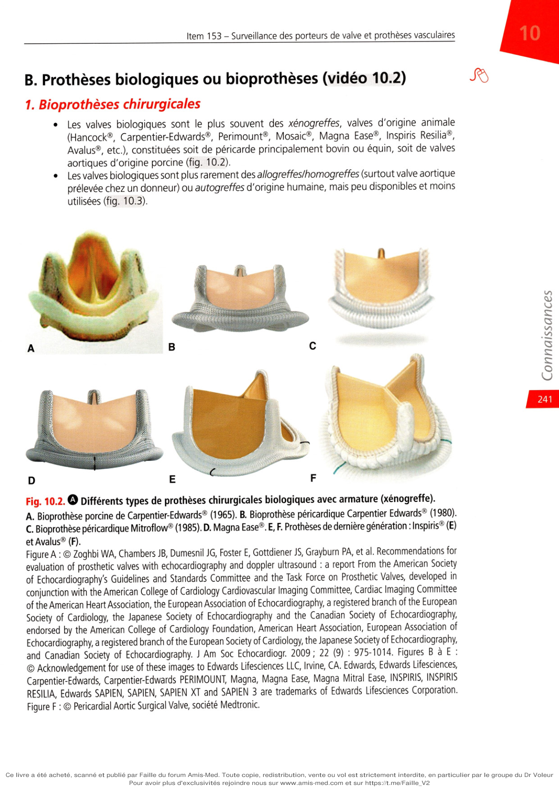

**Fig. 10.1.** Prothèses mécaniques : Starr® (bille), Björk-Shiley® (disque), St-Jude® (double ailette).

Les premières valves mécaniques étaient à bille (prothèse de Starr®), puis sont apparues des valves monodisques (telles que la prothèse de Björk-Shiley®, Medtronic-Hall®), puis des prothèses à double ailette (prothèse de Saint-Jude®, Sorin Bicarbon®, Mira®, etc.). Les valves à double ailette, qui offrent une bonne hémodynamique et sont moins thrombogènes, sont les plus implantées. Certains patients opérés il y a plusieurs décennies sont encore porteurs de prothèses d'ancienne génération. Les valves cardiaques mécaniques présentent un risque de thrombose et nécessitent un traitement anticoagulant définitif par antivitamine K (AVK) qui expose donc aux risques de ce traitement (risque hémorragique). Les AVK diminuent mais ne suppriment pas totalement le risque thrombotique. Les anticoagulants oraux directs (antithrombine ou antifacteur X) sont formellement contre-indiqués en cas de prothèse mécanique, même de façon transitoire. En cas de besoin, un traitement relais peut faire appel à l'héparine non fractionnée ou aux héparines de bas poids moléculaire. Ces prothèses ont une excellente durabilité et sont prévues pour durer toute la vie du patient. évaluation of prosthetic valves with echocardiography and doppler ultrasound : a report From the American Society of Echocardiography's Guidelines and Standards Committee and the Task Force on Prosthetic Valves, developed in of the American Heart Association, the European Association of Echocardiography, a registered branch of the European Society of Cardiology, the Japanese Society of Echocardiography and the Canadian Society of Echocardiography, Echocardiography, a registered branch of the European Society of Cardiology, the Japanese Society of Echocardiography,

## B. Prothèses biologiques ou bioprothèses (vidéo 10.2)

### 1. Bioprothèses chirurgicales

Les valves biologiques sont le plus souvent des xénogreffes, valves d'origine animale (Hancock®, Carpentier-Edwards®, Perimount®, Mosaic®, Magna Ease®, Inspiris Résilia®, Avalus®, etc.), constituées soit de péricarde principalement bovin ou équin, soit de valves aortiques d'origine porcine (fig. 10.2). Les valves biologiques sont plus rarement des allogreffes/homogreffes (surtout valve aortique prélevée chez un donneur) ou autogreffes d'origine humaine, mais peu disponibles et moins utilisées (fig. 10.3).

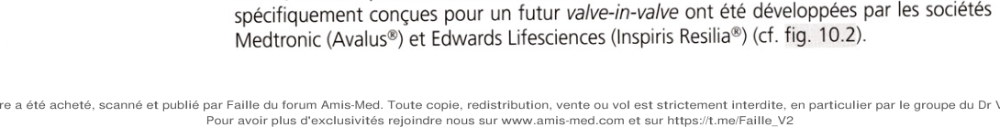

**Fig. 10.2.** Différents types de prothèses chirurgicales biologiques avec armature (xénogreffe).

## A. Bioprothèse porcine de Carpentier-Edwards® (1965). B. Bioprothèse péricardique Carpentier Edwards® (1980).

## C. Bioprothèse péricardique Mitroflow® (1985). D. Magna Ease®. E, F. Prothèses de dernière génération : Inspiris® (E)

et Avalus® (F). évaluation of prosthetic valves with echocardiography and doppler ultrasound : a report From the American Society of Echocardiography's Guidelines and Standards Committee and the Task Force on Prosthetic Valves, developed in of the American Heart Association, the European Association of Echocardiography, a registered branch of the European Society of Cardiology, the Japanese Society of Echocardiography and the Canadien Society of Echocardiography, Echocardiography, a registered branch of the European Society of Cardiology, the Japanese Society of Echocardiography, Carpentier-Edwards, Carpentier-Edwards PERIMOUNT, Magna, Magna Ease, Magna Mitral Ease, INSPIRIS, INSPIRIS RESILIA, Edwards SAPIEN, SAPIEN, SAPIEN XT and SAPIEN 3 are trademarks of Edwards Lifesciences Corporation. Valve pulmonaire Valve aortique

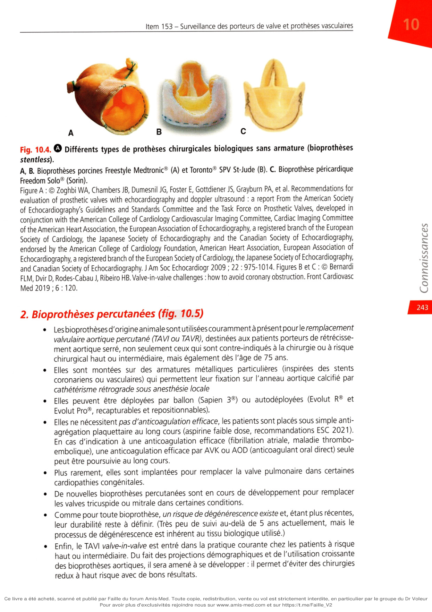

**Fig. 10.3.** Valves humaines.

## A. Allogreffes/homogreffes (fraîches ou cryopréservées). B. Intervention de Ross. C. Valves en péricarde autologue.

## D. Allogreffe/homogreffe ou autogreffe implantée à la place du culot aortique natif, nécessitant une réimplantation des artères coronaires (ostia coronaires indiqués par les flèches noires).

Les autogreffes comportent l'intervention de Ross (remplacement du culot aortique par le culot pulmonaire du patient, puis implantation d'une homogreffe ou d'une xénogreffe en position pulmonaire) et l'intervention d'Ozaki (péricarde postérieur du patient utilisé pour créer une bioprothèse aortique avec trois cusps). Les bioprothèses sont le plus souvent montées sur une armature de métal et donc relativement encombrantes. Plus rarement, il s'agit de prothèses sans armature ou stentless. Les valves stentless permettent une optimisation des performances hémodynamiques par diminution de l'encombrement, avec une durabilité qui peut être plus longue mais la réintervention est difficile du fait de la fusion avec la paroi aortique et les calcifications, et sont rarement implantées de nos jours (fig. 10.4). Les bioprothèses ne nécessitent pas d'anticoagulants du tout (valves aortiques) ou au-delà du 3e mois postopératoire (valve mitrale) si le rythme est sinusal. Mais leur durabilité est limitée à 10 ans en moyenne, avec des dégénérescences parfois plus précoces surtout chez les sujets jeunes, ou en fonction du type de prothèse. Le développement du TAVI valve-in-valve (implantation par voie percutanée d'une valve de type TAVI dans une bioprothèse chirurgicale ou un TAVI dégénéré) impose d'anticiper cette perspective lors de tout RVA par bioprothèse. Cette discussion doit être abordée en staff multidisciplinaire appelé Heart Team. L'utilisation des prothèses chirurgicales favorables au valve-in-valve doit être préféré (prothèses stentées bien visibles à feuillets internes courts) chez les patients dont l'espérance de vie est >10 ans. Deux prothèses chirurgicales spécifiquement conçues pour un futur valve-in-valve ont été développées par les sociétés Medtronic (Avalus®) et Edwards Lifesciences (Inspiris Résilia®) (cf. fig. 10.2).

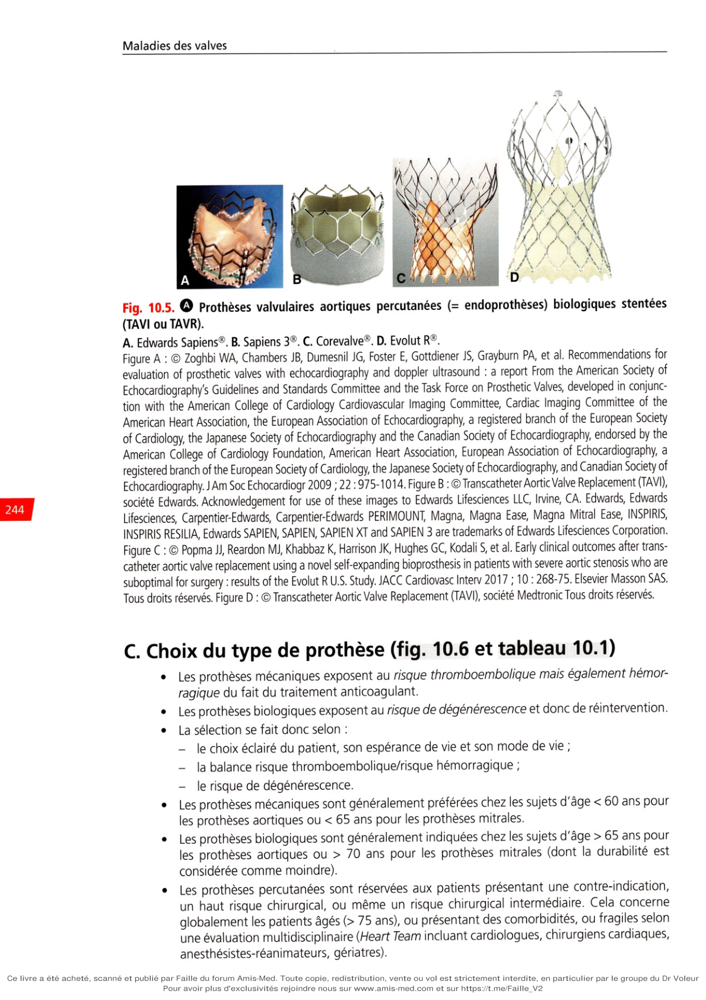

**Fig. 10.4.** Différents types de prothèses chirurgicales biologiques sans armature (bioprothèses

stentless). A, B. Bioprothèses porcines Freestyle Medtronic® (A) et Toronto® SPV St-Jude (B). C. Bioprothèse péricardique Freedom Solo® (Sorin). évaluation of prosthetic valves with echocardiography and doppler ultrasound : a report From the American Society of Echocardiography's Guidelines and Standards Committee and the Task Force on Prosthetic Valves, developed in of the American Heart Association, the European Association of Echocardiography, a registered branch of the European Society of Cardiology, the Japanese Society of Echocardiography and the Canadian Society of Echocardiography, Echocardiography, a registered branch of the European Society of Cardiology, the Japanese Society of Echocardiography, FLM, Dvir D, Rodes-Cabau J, Ribeiro HB. Valve-in-valve challenges : how to avoid coronary obstruction. Front Cardiovasc Med 2019 ; 6 : 120.

### 2. Bioprothèses percutanées (fig. 10.5)

Les bioprothèses d'origine animale sont utilisées couramment à présent pour le remplacement valvulaire aortique percutané (TAVI ou TAVR), destinées aux patients porteurs de rétrécissement aortique serré, non seulement ceux qui sont contre-indiqués à la chirurgie ou à risque chirurgical haut ou intermédiaire, mais également dès l'âge de 75 ans. Elles sont montées sur des armatures métalliques particulières (inspirées des stents coronariens ou vasculaires) qui permettent leur fixation sur l'anneau aortique calcifié par cathétérisme rétrograde sous anesthésie locale Elles peuvent être déployées par ballon (Sapien 3®) ou autodéployées (Evolut R® et Evolut Pro®, recapturables et repositionnables). Elles ne nécessitent pas d'anticoagulation efficace, les patients sont placés sous simple antiagrégation plaquettaire au long cours (aspirine faible dose, recommandations ESC 2021). En cas d'indication à une anticoagulation efficace (fibrillation atriale, maladie thromboembolique), une anticoagulation efficace par AVK ou AOD (anticoagulant oral direct) seule peut être poursuivie au long cours. Plus rarement, elles sont implantées pour remplacer la valve pulmonaire dans certaines cardiopathies congénitales. De nouvelles bioprothèses percutanées sont en cours de développement pour remplacer les valves tricuspide ou mitrale dans certaines conditions. Comme pour toute bioprothèse, un risque de dégénérescence existe et, étant plus récentes, leur durabilité reste à définir. (Très peu de suivi au-delà de 5 ans actuellement, mais le processus de dégénérescence est inhérent au tissu biologique utilisé.) Enfin, le TAVI valve-in-valve est entré dans la pratique courante chez les patients à risque haut ou intermédiaire. Du fait des projections démographiques et de l'utilisation croissante des bioprothèses aortiques, il sera amené à se développer : il permet d'éviter des chirurgies redux à haut risque avec de bons résultats.

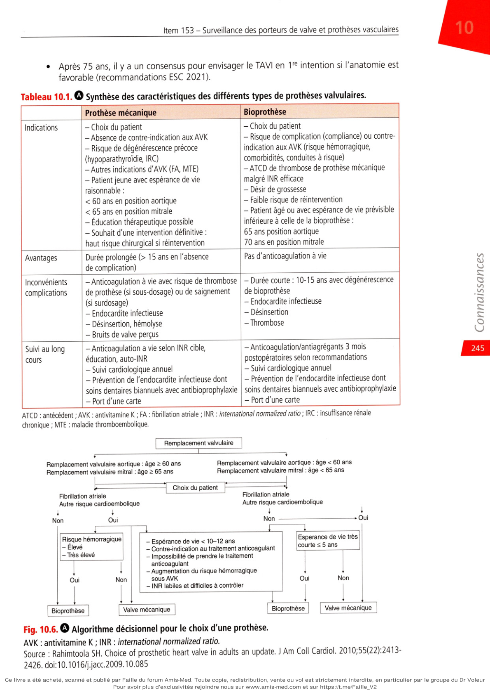

**Fig. 10.5.** 

Prothèses valvulaires aortiques percutanées (= endoprothèses) biologiques stentées (TAVI ou TAVR).

## A. Edwards Sapiens®. B. Sapiens 3®. C. Corevalve®. D. Evolut R®.

évaluation of prosthetic valves with echocardiography and doppler ultrasound : a report From the American Society of Echocardiography's Guidelines and Standards Committee and the Task Force on Prosthetic Valves, developed in conjunction with the American College of Cardiology Cardiovascular Imaging Committee, Cardiac Imaging Committee of the American Heart Association, the European Association of Echocardiography, a registered branch of the European Society of Cardiology, the Japanese Society of Echocardiography and the Canadian Society of Echocardiography, endorsed by the American College of Cardiology Foundation, American Heart Association, European Association of Echocardiography, a registered branch of the European Society of Cardiology, the Japanese Society of Echocardiography, and Canadian Society of Echocardiography. J Am Soc Echocardiogr 2009 ; 22 : 975-1014. Figure B : ©TranscatheterAortic Valve Replacement (TAVI), société Edwards. Acknowledgement for use of these images to Edwards Lifesciences LLC, Irvine, CA. Edwards, Edwards Lifesciences, Carpentier-Edwards, Carpentier-Edwards PERIMOUNT, Magna, Magna Ease, Magna Mitral Ease, INSPIRIS, INSPIRIS RESILIA, Edwards SAPIEN, SAPIEN, SAPIEN XT and SAPIEN 3 are trademarks of Edwards Lifesciences Corporation. catheter aortic valve replacement using a novel self-expanding bioprosthesis in patients with severe aortic stenosis who are suboptimal for surgery : results of the Evolut R U.S. Study. JACC Cardiovasc Interv 201 7 ; 10 : 268-75. Elsevier Masson SAS. Tous droits réservés. Figure D : ©TranscatheterAortic Valve Replacement (TAVI), société Medtronic Tous droits réservés.

## C. Choix du type de prothèse (fig. 10.6 et tableau 10.1)

Les prothèses mécaniques exposent au risque thromboembolique mais également hémorragique du fait du traitement anticoagulant. Les prothèses biologiques exposent au risque de dégénérescence et donc de réintervention. La sélection se fait donc selon :

• le choix éclairé du patient, son espérance de vie et son mode de vie ;

• la balance risque thromboembolique/risque hémorragique ;

• le risque de dégénérescence.

Les prothèses mécaniques sont généralement préférées chez les sujets d'âge < 60 ans pour les prothèses aortiques ou < 65 ans pour les prothèses mitrales. Les prothèses biologiques sont généralement indiquées chez les sujets d'âge > 65 ans pour les prothèses aortiques ou > 70 ans pour les prothèses mitrales (dont la durabilité est considérée comme moindre). Les prothèses percutanées sont réservées aux patients présentant une contre-indication, un haut risque chirurgical, ou même un risque chirurgical intermédiaire. Cela concerne globalement les patients âgés (> 75 ans), ou présentant des comorbidités, ou fragiles selon une évaluation multidisciplinaire (Heart Team incluant cardiologues, chirurgiens cardiaques, anesthésistes-réanimateurs, gériatres). Après 75 ans, il y a un consensus pour envisager le TAVI en 1re intention si l'anatomie est favorable (recommandations ESC 2021).

**Tableau 10.1.** Synthèse des caractéristiques des différents types de prothèses valvulaires.

| | Prothèse mécanique | Bioprothèse |

|---|---|---|

| **Indications** | Choix du patient ; absence de contre-indication aux AVK ; risque de dégénérescence précoce (hypoparathyroïdie, IRC) ; autres indications d'AVK (FA, MTE) ; patient jeune avec espérance de vie raisonnable : < 60 ans en position aortique, < 65 ans en position mitrale ; éducation thérapeutique possible ; souhait d'une intervention définitive (haut risque chirurgical si réintervention) | Choix du patient ; risque de complication (compliance) ou contre-indication aux AVK (risque hémorragique, comorbidités, conduites à risque) ; ATCD de thrombose de prothèse mécanique malgré INR efficace ; désir de grossesse ; faible risque de réintervention ; patient âgé ou espérance de vie inférieure à celle de la bioprothèse : ≥ 65 ans en position aortique, ≥ 70 ans en position mitrale |

| **Avantages** | Durée prolongée (> 15 ans en l'absence de complication) | Pas d'anticoagulation à vie |

| **Inconvénients / complications** | Anticoagulation à vie avec risque de thrombose (sous-dosage) ou de saignement (surdosage) ; endocardite infectieuse ; désinsertion, hémolyse ; bruits de valve perçus | Durée courte : 10–15 ans avec dégénérescence ; endocardite infectieuse ; désinsertion ; thrombose |

| **Suivi au long cours** | Anticoagulation à vie selon INR cible, éducation, auto-INR ; suivi cardiologique annuel ; prévention de l'endocardite infectieuse dont soins dentaires biannuels avec antibioprophylaxie ; port d'une carte | Anticoagulation/antiagrégants 3 mois postopératoires selon recommandations ; suivi cardiologique annuel ; prévention de l'endocardite infectieuse dont soins dentaires biannuels avec antibioprophylaxie ; port d'une carte |

ATCD : antécédent ; AVK : antivitamine K ; FA : fibrillation atriale ; INR : international normalized ratio ; IRC : insuffisance rénale chronique ; MTE : maladie thromboembolique.

ATCD : antécédent ; AVK : antivitamine K ; FA : fibrillation atriale ; INR : international normalized ratio ; IRC : insuffisance rénale chronique ; MTE : maladie thromboembolique. __________________

> -----------

— 3" Choix du patient p ------

------ — 4

; ; t I Non -------------------------------------»Oui

- Élevé

- Très élevé

- Espérance de vie < 10-12 ans

- Contre-indication au traitement anticoagulant

- Impossibilité de prendre le traitement

anticoagulant

- Augmentation du risque hémorragique

sous AVK

- INR labiles et difficiles à contrôler

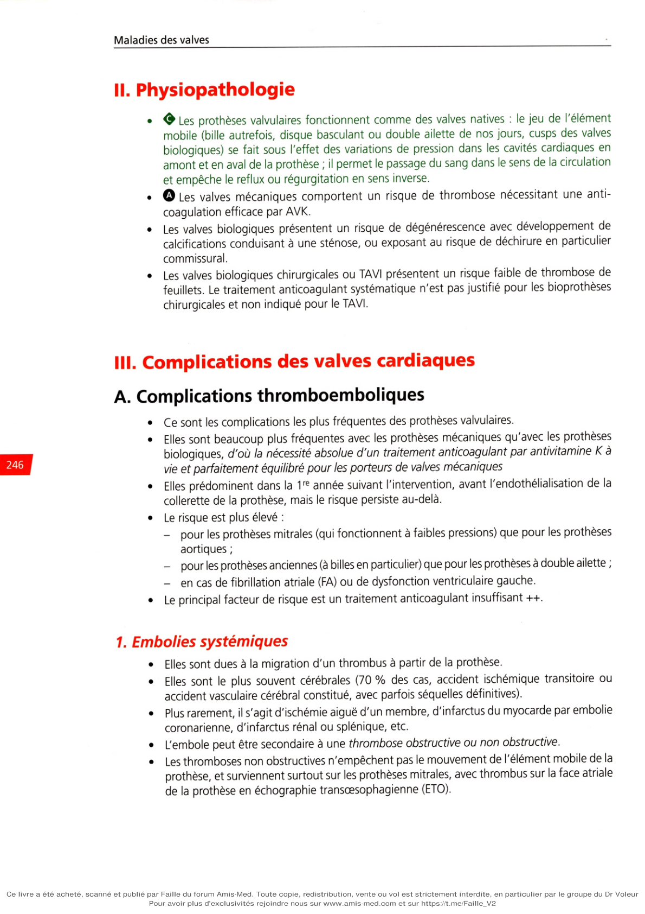

**Fig. 10.6.** 

Algorithme décisionnel pour le choix d'une prothèse. AVK : antivitamine K ; INR : international normalized ratio.

---

# II. Physiopathologie

**Rang A.**

• **Rang A.** Les prothèses valvulaires fonctionnent comme des valves natives : le jeu de l'élément

mobile (bille autrefois, disque basculant ou double ailette de nos jours, cusps des valves biologiques) se fait sous l'effet des variations de pression dans les cavités cardiaques en amont et en aval de la prothèse ; il permet le passage du sang dans le sens de la circulation et empêche le reflux ou régurgitation en sens inverse.

• **Rang A.** Les valves mécaniques comportent un risque de thrombose nécessitant une anticoagulation efficace par AVK.

Les valves biologiques présentent un risque de dégénérescence avec développement de calcifications conduisant à une sténose, ou exposant au risque de déchirure en particulier commissural. Les valves biologiques chirurgicales ou TAVI présentent un risque faible de thrombose de feuillets. Le traitement anticoagulant systématique n'est pas justifié pour les bioprothèses chirurgicales et non indiqué pour le TAVI.

---

# III. Complications des prothèses valvulaires

**Rang A.**

## A. Complications thromboemboliques

Ce sont les complications les plus fréquentes des prothèses valvulaires. Elles sont beaucoup plus fréquentes avec les prothèses mécaniques qu'avec les prothèses biologiques, d'où la nécessité absolue d'un traitement anticoagulant par antivitamine K à vie et parfaitement équilibré pour les porteurs de valves mécaniques Elles prédominent dans la 1re année suivant l'intervention, avant l'endothélialisation de la collerette de la prothèse, mais le risque persiste au-delà. Le risque est plus élevé :

• pour les prothèses mitrales (qui fonctionnent à faibles pressions) que pour les prothèses

aortiques ;

• pour les prothèses anciennes (à billes en particulier) que pour les prothèses à double ailette ;

• en cas de fibrillation atriale (FA) ou de dysfonction ventriculaire gauche.

Le principal facteur de risque est un traitement anticoagulant insuffisant ++. 246 j

### 1. Embolies systémiques

Elles sont dues à la migration d'un thrombus à partir de la prothèse. Elles sont le plus souvent cérébrales (70 % des cas, accident ischémique transitoire ou accident vasculaire cérébral constitué, avec parfois séquelles définitives). Plus rarement, il s'agit d'ischémie aiguë d'un membre, d'infarctus du myocarde par embolie coronarienne, d'infarctus rénal ou splénique, etc. L'embole peut être secondaire à une thrombose obstructive ou non obstructive. Les thromboses non obstructives n'empêchent pas le mouvement de l'élément mobile de la prothèse, et surviennent surtout sur les prothèses mitrales, avec thrombus sur la face atriale de la prothèse en échographie transœsophagienne (ETO).

### 2. Thromboses obstructives de prothèse mécanique

Les mouvements de l'élément mobile de la prothèse sont diminués en cas de thrombose obstructive (fig. 10.7 et vidéo 10.3). Elles peuvent être à l'origine d'accidents brutaux, avec œdème aigu pulmonaire, ou syncope, ou état de choc, voire mort subite ou très rapide. Le diagnostic de thrombose de prothèse est souvent difficile : il existe des modifications de l 'auscultation (diminution de l'amplitude des bruits de prothèse, apparition ou renforcement d'un souffle systolique pour une prothèse aortique ou d'un roulement diastolique pour une prothèse mitrale). Un traitement anticoagulant insuffisant est souvent en cause, il convient de vérifier l'INR {international normalized ratio) en urgence et d'adapter l'anticoagulation. Le diagnostic est fait par :

• le radiocinéma de prothèse, sous amplificateur de brillance, qui peut montrer une diminution du jeu des éléments mobiles radio-opaques ;

• l'ETT et l'ETO :

• les gradients transprothétiques sont anormalement élevés, la surface valvulaire

fonctionnelle est réduite,

• il peut exister une fuite intraprothétique par fermeture incomplète de la prothèse,

• enfin, le thrombus doit être recherché en ETT/ETO ou en scanner injecté synchronisé.

La prise en charge comporte :

• hospitalisation en Usic, le patient est placé sous héparine IV à la seringue et aspirine

(bolus IV pour une efficacité rapide, puis per os) ;

• discussion de réintervention d'urgence pour changement de valve en cas de thrombose

aiguë de prothèse (mortalité de 30 %), ou de blocage d'une ailette non réversible sous héparine-aspirine ;

• en cas de contre-indication à la chirurgie ou dans les formes subaiguës résistantes au

traitement anticoagulant : thrombolyse, avec parfois de bons résultats. Le diagnostic différentiel (ou l'association) avec l'endocardite infectieuse est parfois difficile, d'autant qu'une fébricule est possible dans les thromboses de prothèse.

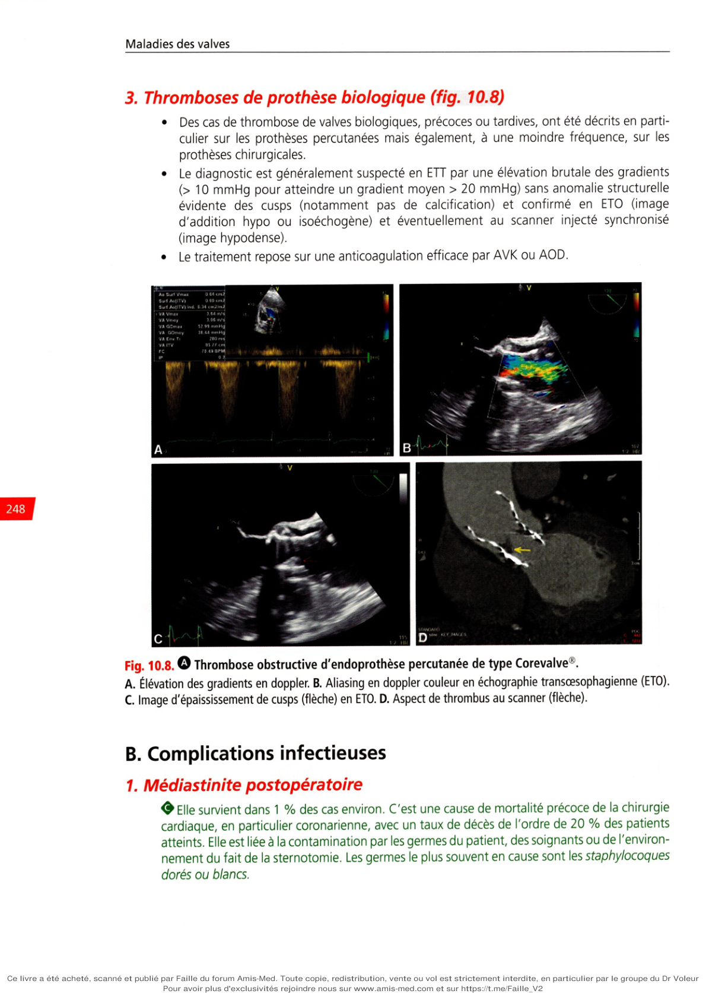

**Fig. 10.7.** Thrombose obstructive de prothèse mécanique en position mitrale.

## A. Thrombus sur le versant atrial de la prothèse en échographie transœsophagienne (flèche). B. Élévation du

gradient moyen transmitral à 15 mmHg (normalement < 6 mmHg). C. Blocage d'une ailette (surlignée en blanc) en radiocinéma (flèche).

### 3. Thromboses de prothèse biologique (fig. 10.8)

Des cas de thrombose de valves biologiques, précoces ou tardives, ont été décrits en particulier sur les prothèses percutanées mais également, à une moindre fréquence, sur les prothèses chirurgicales. Le diagnostic est généralement suspecté en ETT par une élévation brutale des gradients (> 10 mmHg pour atteindre un gradient moyen > 20 mmHg) sans anomalie structurelle évidente des cusps (notamment pas de calcification) et confirmé en ETO (image d'addition hypo ou isoéchogène) et éventuellement au scanner injecté synchronisé (image hypodense). Le traitement repose sur une anticoagulation efficace par AVK ou AOD.

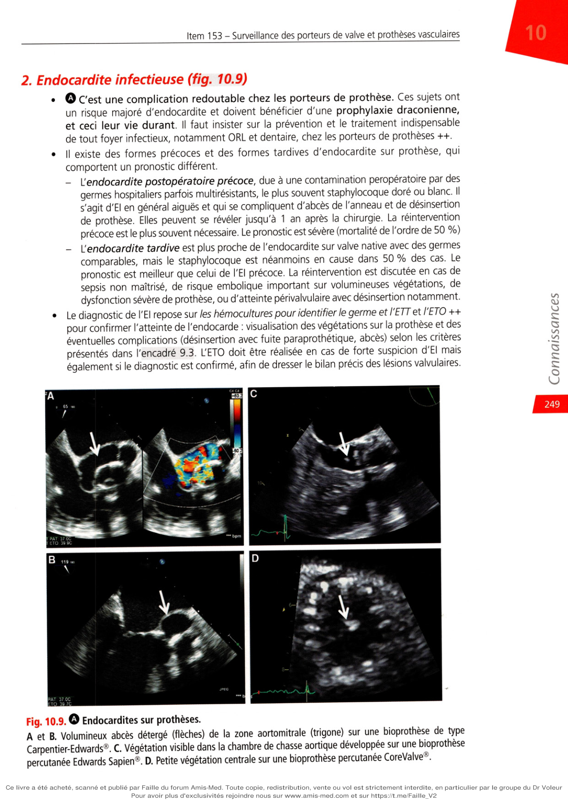

**Fig. 10.8.** Thrombose obstructive d'endoprothèse percutanée de type Corevalve®.

## A. Élévation des gradients en doppler. B. Aliasing en doppler couleur en échographie transœsophagienne (ETO).

## C. Image d'épaississement de cusps (flèche) en ETO. D. Aspect de thrombus au scanner (flèche).

## B. Complications infectieuses

### 1. Médiastinite postopératoire

0 Elle survient dans 1 % des cas environ. C'est une cause de mortalité précoce de la chirurgie cardiaque, en particulier coronarienne, avec un taux de décès de l'ordre de 20 % des patients atteints. Elle est liée à la contamination par les germes du patient, des soignants ou de l'environnement du fait de la sternotomie. Les germes le plus souvent en cause sont les staphylocoques dorés ou blancs.

### 2. Endocardite infectieuse (fig. 10.9)

**Rang A.** C'est une complication redoutable chez les porteurs de prothèse. Ces sujets ont

un risque majoré d'endocardite et doivent bénéficier d'une prophylaxie draconienne, et ceci leur vie durant. Il faut insister sur la prévention et le traitement indispensable de tout foyer infectieux, notamment ORL et dentaire, chez les porteurs de prothèses ++. Il existe des formes précoces et des formes tardives d'endocardite sur prothèse, qui comportent un pronostic différent.

• • endocardite postopératoire précoce, due à une contamination peropératoire par des

germes hospitaliers parfois multirésistants, le plus souvent staphylocoque doré ou blanc. Il s'agit d'EI en général aiguës et qui se compliquent d'abcès de l'anneau et de désinsertion de prothèse. Elles peuvent se révéler jusqu'à 1 an après la chirurgie. La réintervention précoce est le plus souvent nécessaire. Le pronostic est sévère (mortalité de l'ordre de 50 %)

• endocardite tardive est plus proche de l'endocardite sur valve native avec des germes

comparables, mais le staphylocoque est néanmoins en cause dans 50 % des cas. Le pronostic est meilleur que celui de l'EI précoce. La réintervention est discutée en cas de sepsis non maîtrisé, de risque embolique important sur volumineuses végétations, de dysfonction sévère de prothèse, ou d'atteinte périvalvulaire avec désinsertion notamment. Le diagnostic de l'EI repose sur les hémocultures pour identifier le germe et l'ETT et l'ETO ++ pour confirmer l'atteinte de l'endocarde : visualisation des végétations sur la prothèse et des éventuelles complications (désinsertion avec fuite paraprothétique, abcès) selon les critères présentés dans l'encadré 9.3. L'ETO doit être réalisée en cas de forte suspicion d'EI mais également si le diagnostic est confirmé, afin de dresser le bilan précis des lésions valvulaires.

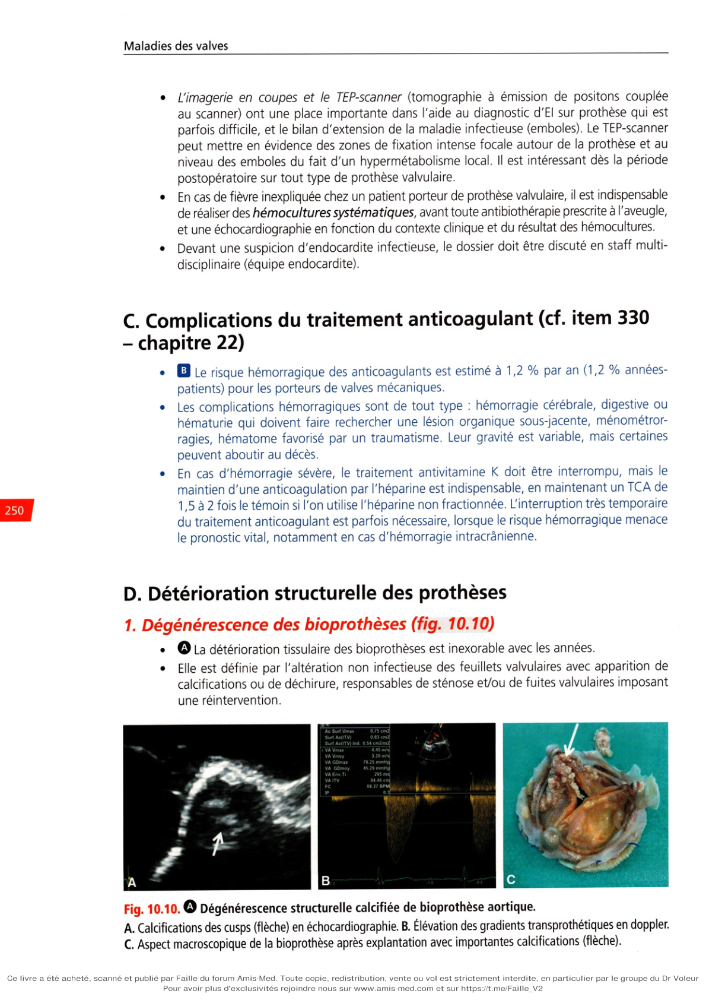

**Fig. 10.9.** Endocardites sur prothèses.

A et B. Volumineux abcès détergé (flèches) de la zone aortomitrale (trigone) sur une bioprothèse de type Carpentier-Edwards®. C. Végétation visible dans la chambre de chasse aortique développée sur une bioprothèse percutanée Edwards Sapien®. D. Petite végétation centrale sur une bioprothèse percutanée CoreValve®. L'imagerie en coupes et le TEP-scanner (tomographie à émission de positons couplée au scanner) ont une place importante dans l'aide au diagnostic d'EI sur prothèse qui est parfois difficile, et le bilan d'extension de la maladie infectieuse (emboles). Le TEP-scanner peut mettre en évidence des zones de fixation intense focale autour de la prothèse et au niveau des emboles du fait d'un hypermétabolisme local. Il est intéressant dès la période postopératoire sur tout type de prothèse valvulaire. En cas de fièvre inexpliquée chez un patient porteur de prothèse valvulaire, il est indispensable de réaliser des hémocultures systématiques, avant toute antibiothérapie prescrite à l'aveugle, et une échocardiographie en fonction du contexte clinique et du résultat des hémocultures. Devant une suspicion d'endocardite infectieuse, le dossier doit être discuté en staff multidisciplinaire (équipe endocardite).

## C. Complications du traitement anticoagulant (cf. item 330

- chapitre 22)

**Rang B.** Le risque hémorragique des anticoagulants est estimé à 1,2 % par an (1,2 % annéespatients) pour les porteurs de valves mécaniques.

Les complications hémorragiques sont de tout type : hémorragie cérébrale, digestive ou hématurie qui doivent faire rechercher une lésion organique sous-jacente, ménométrorragies, hématome favorisé par un traumatisme. Leur gravité est variable, mais certaines peuvent aboutir au décès. En cas d'hémorragie sévère, le traitement antivitamine K doit être interrompu, mais le maintien d'une anticoagulation par l'héparine est indispensable, en maintenant un TCA de 1,5 à 2 fois le témoin si l'on utilise l'héparine non fractionnée. L'interruption très temporaire du traitement anticoagulant est parfois nécessaire, lorsque le risque hémorragique menace le pronostic vital, notamment en cas d'hémorragie intracrânienne.

## D. Détérioration structurelle des prothèses

### 1. Dégénérescence des bioprothèses (fig. 10.10)

**Rang A.** La détérioration tissulaire des bioprothèses est inexorable avec les années.

Elle est définie par l'altération non infectieuse des feuillets valvulaires avec apparition de calcifications ou de déchirure, responsables de sténose et/ou de fuites valvulaires imposant une réintervention.

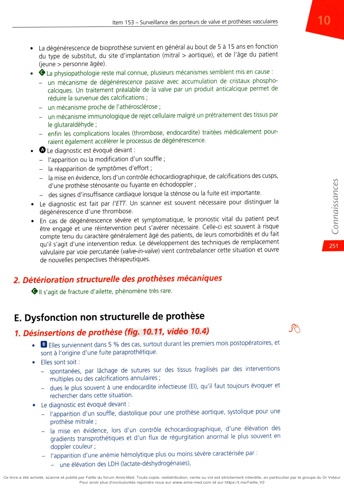

**Fig. 10.10.** Dégénérescence structurelle calcifiée de bioprothèse aortique.

## A. Calcifications des cusps (flèche) en échocardiographie. B. Élévation des gradients transprothétiques en doppler.

## C. Aspect macroscopique de la bioprothèse après explantation avec importantes calcifications (flèche).

La dégénérescence de bioprothèse survient en général au bout de 5 à 15 ans en fonction du type de substitut, du site d'implantation (mitral > aortique), et de l'âge du patient (jeune > personne âgée). La physiopathologie reste mal connue, plusieurs mécanismes semblent mis en cause :

• un mécanisme de dégénérescence passive avec accumulation de cristaux phosphocalciques. Un traitement préalable de la valve par un produit anticalcique permet de

réduire la survenue des calcifications ;

• un mécanisme proche de l'athérosclérose ;

• un mécanisme immunologique de rejet cellulaire malgré un prétraitement des tissus par

le glutaraldéhyde ;

• enfin les complications locales (thrombose, endocardite) traitées médicalement pourraient également accélérer le processus de dégénérescence.

• **Rang A.** Le diagnostic est évoqué devant :

• l'apparition ou la modification d'un souffle ;

• la réapparition de symptômes d'effort ;

• la mise en évidence, lors d'un contrôle échocardiographique, de calcifications des cusps,

d'une prothèse sténosante ou fuyante en échodoppler ;

• des signes d'insuffisance cardiaque lorsque la sténose ou la fuite est importante.

Le diagnostic est fait par l'ETT. Un scanner est souvent nécessaire pour distinguer la dégénérescence d'une thrombose. En cas de dégénérescence sévère et symptomatique, le pronostic vital du patient peut être engagé et une réintervention peut s'avérer nécessaire. Celle-ci est souvent à risque compte tenu du caractère généralement âgé des patients, de leurs comorbidités et du fait qu'il s'agit d'une intervention redux. Le développement des techniques de remplacement valvulaire par voie percutanée (valve-in-valve) vient contrebalancer cette situation et ouvre de nouvelles perspectives thérapeutiques.

### 2. Détérioration structurelle des prothèses mécaniques

**Rang B.** Il s'agit de fracture d'ailette, phénomène très rare.

## E. Dysfonction non structurelle de prothèse

### 1. Désinsertions de prothèse (fig. 10.11, vidéo 10.4)

Elles surviennent dans 5 % des cas, surtout durant les premiers mois postopératoires, et sont à l'origine d'une fuite paraprothétique. Elles sont soit :

• spontanées, par lâchage de sutures sur des tissus fragilisés par des interventions

multiples ou des calcifications annulaires ;

• dues le plus souvent à une endocardite infectieuse (EI), qu'il faut toujours évoquer et

rechercher dans cette situation. Le diagnostic est évoqué devant :

• l'apparition d'un souffle, diastolique pour une prothèse aortique, systolique pour une

prothèse mitrale ;

• la mise en évidence, lors d'un contrôle échocardiographique, d'une élévation des

gradients transprothétiques et d'un flux de régurgitation anormal le plus souvent en doppler couleur ;

• l'apparition d'une anémie hémolytique plus ou moins sévère caractérisée par :

• une élévation des LDH (lactate-déshydrogénases),

• une baisse de l'haptoglobine,

• la présence de schizocytes, hématies fragmentées qui signent le caractère mécanique de l'hémolyse ;

• des signes d'insuffisance cardiaque lorsque la désinsertion est importante.

Le diagnostic est fait par l'ETT et surtout par l'ETO : fuite paraprothétique ± importante. En cas de désinsertion importante, symptomatique, une réintervention peut s'avérer nécessaire par chirurgie conventionnelle, ou par voie percutanée avec mise en place d'une sorte de bouchon (plug) dans la zone de désinsertion.

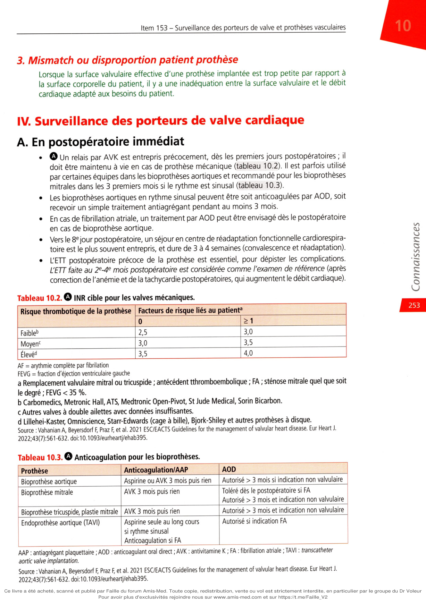

**Fig. 10.11.** Désinsertion de prothèse biologique en position mitrale, avec une fuite mitrale sévère.

## A. Échographie transœsophagienne 3D vue de face : fuite mitrale sévère périprothétique, jet principal postéroexterne (flèche). B. Schizocyte (hématie fragmentée) témoin d'une hémolyse intravasculaire.

### 2. Pannus fibreux

• **Rang A.** II s'agit de tissu conjonctif cicatriciel excessif se développant sur le versant atrial des

prothèses mitrales, ou ventriculaire des prothèses aortiques, et qui peut créer une sténose orificielle extravalvulaire (fig. 10.12). Il n'existe pas de traitement préventif et la sanction est chirurgicale en cas de symptômes.

**Fig. 10.12.** Dysfonction sténosante par pannus (flèche) s'étendant dans une prothèse mécanique (A)

ou sur bioprothèse (B).

### 3. Mismatch ou disproportion patient prothèse

Lorsque la surface valvulaire effective d'une prothèse implantée est trop petite par rapport à la surface corporelle du patient, il y a une inadéquation entre la surface valvulaire et le débit cardiaque adapté aux besoins du patient.

---

# IV. Surveillance des porteurs de valve cardiaque

**Rang A.**

## A. En postopératoire immédiat

**Rang A.** Un relais par AVK est entrepris précocement, dès les premiers jours postopératoires ; il

doit être maintenu à vie en cas de prothèse mécanique (tableau 10.2). Il est parfois utilisé par certaines équipes dans les bioprothèses aortiques et recommandé pour les bioprothèses mitrales dans les 3 premiers mois si le rythme est sinusal (tableau 10.3). Les bioprothèses aortiques en rythme sinusal peuvent être soit anticoagulées par AOD, soit recevoir un simple traitement antiagrégant pendant au moins 3 mois. En cas de fibrillation atriale, un traitement par AOD peut être envisagé dès le postopératoire en cas de bioprothèse aortique. Vers le 8e jour postopératoire, un séjour en centre de réadaptation fonctionnelle cardiorespiratoire est le plus souvent entrepris, et dure de 3 à 4 semaines (convalescence et réadaptation). L'ETT postopératoire précoce de la prothèse est essentiel, pour dépister les complications. L'ETT faite au 2e-4e mois postopératoire est considérée comme l'examen de référence (après correction de l'anémie et de la tachycardie postopératoires, qui augmentent le débit cardiaque).

**Tableau 10.2.** INR cible pour les valves mécaniques.

| Risque thrombotique de la prothèse | Sans facteur de risque lié au patient | Avec facteur(s) de risque lié au patient |

|---|---|---|

| Faible | 2,5 | 3,0 |

| Moyen | 3,0 | 3,5 |

| Élevé | 3,5 | 4,0 |

Facteurs de risque liés au patient : remplacement valvulaire mitral ou tricuspide ; antécédent thromboembolique ; FA ; sténose mitrale quel que soit le degré ; FEVG < 35 %.

Prothèses à risque faible : Carbomedics, Medtronic Hall, ATS, Medtronic Open-Pivot, St Jude Medical, Sorin Bicarbon.

Prothèses à risque moyen : autres valves à double ailette avec données insuffisantes.

Prothèses à risque élevé : Lillehei-Kaster, Omniscience, Starr-Edwards (cage à bille), Björk-Shiley et autres prothèses à disque.

Source : Vahanian A, Beyersdorf F, Praz F, et al. 2021 ESC/EACTS Guidelines for the management of valvular heart disease. Eur Heart J. 2022;43(7):561–632.

**Tableau 10.3.** Anticoagulation pour les bioprothèses.

| Prothèse | Anticoagulation / AAP | AOD |

|---|---|---|

| Bioprothèse aortique | Aspirine ou AVK 3 mois puis rien | Autorisé > 3 mois si indication non valvulaire |

| Bioprothèse mitrale | AVK 3 mois puis rien | Toléré dès le postopératoire si FA ; autorisé > 3 mois si indication non valvulaire |

| Bioprothèse tricuspide, plastie mitrale | AVK 3 mois puis rien | Autorisé > 3 mois si indication non valvulaire |

| Endoprothèse aortique (TAVI) | Aspirine seule au long cours si rythme sinusal ; anticoagulation si FA | Autorisé si indication FA |

AAP : antiagrégant plaquettaire ; AOD : anticoagulant oral direct ; AVK : antivitamine K ; FA : fibrillation atriale ; TAVI : transcatheter aortic valve implantation.

Source : Vahanian A, Beyersdorf F, Praz F, et al. 2021 ESC/EACTS Guidelines for the management of valvular heart disease. Eur Heart J. 2022;43(7):561–632.

## B. Surveillance ultérieure

### 1. Modalités

Le suivi est réalisé à 1 mois, puis tous les 3 mois par le médecin traitant, afin de vérifier notamment l'état clinique et l'équilibre du traitement anticoagulant par les AVK (fig. 10.13). La consultation du cardiologue a lieu au 2 e-4e mois postopératoire, notamment pour la réalisation de l'ETT de référence. Le patient est ensuite suivi par le cardiologue 1 à 2 fois/an. Le porteur de valve cardiaque doit être muni :

• d'une carte de porteur de prothèse (fig. 10.14)

**Fig. 10.14.** Carte d'intervention valvulaire et conseils pendant la durée du traitement anticoagulant.

qui lui est remise à la sortie du service de chirurgie cardiaque, précisant le type, le diamètre et le numéro de série de la prothèse ;

• d'un carnet de surveillance du traitement anticoagulant précisant l'INR cible pour les

prothèses mécaniques ;

• d'une carte d'antibioprophylaxie pour son dentiste, car il est à haut risque d'endocardite +++. Tout geste dentaire à risque infectieux, y compris le détartrage, doit être

réalisé sous antibiothérapie ponctuelle (en général amoxicilline 3 g 1 heure avant les soins). Le suivi dentaire doit être au moins biannuel. et d’éventuelles Carnet de suivi de l’AC Rythme

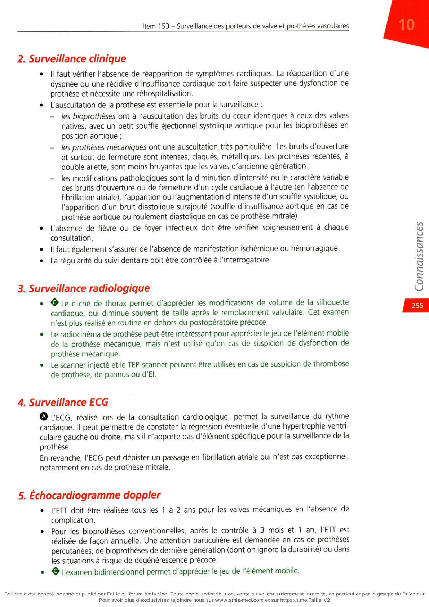

**Fig. 10.13.** Surveillance au long cours des patients porteurs de prothèses de valve cardiaque.

## 2. Surveillance clinique

Il faut vérifier l'absence de réapparition de symptômes cardiaques. La réapparition d'une dyspnée ou une récidive d'insuffisance cardiaque doit faire suspecter une dysfonction de prothèse et nécessite une réhospitalisation. L'auscultation de la prothèse est essentielle pour la surveillance :

• les bioprothèses ont à l'auscultation des bruits du cœur identiques à ceux des valves

natives, avec un petit souffle éjectionnel systolique aortique pour les bioprothèses en position aortique ;

• les prothèses mécaniques ont une auscultation très particulière. Les bruits d'ouverture

et surtout de fermeture sont intenses, claqués, métalliques. Les prothèses récentes, à double ailette, sont moins bruyantes que les valves d'ancienne génération ;

• les modifications pathologiques sont la diminution d'intensité ou le caractère variable

des bruits d'ouverture ou de fermeture d'un cycle cardiaque à l'autre (en l'absence de fibrillation atriale), l'apparition ou l'augmentation d'intensité d'un souffle systolique, ou l'apparition d'un bruit diastolique surajouté (souffle d'insuffisance aortique en cas de prothèse aortique ou roulement diastolique en cas de prothèse mitrale). L'absence de fièvre ou de foyer infectieux doit être vérifiée soigneusement à chaque consultation.

• Il faut également s'assurer de l'absence de manifestation ischémique ou hémorragique.

La régularité du suivi dentaire doit être contrôlée à l'interrogatoire.

### 3. Surveillance radiologique

• & Le cliché de thorax permet d'apprécier les modifications de volume de la silhouette

cardiaque, qui diminue souvent de taille après le remplacement valvulaire. Cet examen n'est plus réalisé en routine en dehors du postopératoire précoce. Le radiocinéma de prothèse peut être intéressant pour apprécier le jeu de l'élément mobile de la prothèse mécanique, mais n'est utilisé qu'en cas de suspicion de dysfonction de prothèse mécanique. Le scanner injecté et le TEP-scanner peuvent être utilisés en cas de suspicion de thrombose de prothèse, de pannus ou d'El.

### 4. Surveillance ECG

**Rang A.** L'ECG, réalisé lors de la consultation cardiologique, permet la surveillance du rythme

cardiaque. Il peut permettre de constater la régression éventuelle d'une hypertrophie ventriculaire gauche ou droite, mais il n'apporte pas d'élément spécifique pour la surveillance de la prothèse. En revanche, l'ECG peut dépister un passage en fibrillation atriale qui n'est pas exceptionnel, notamment en cas de prothèse mitrale.

### 5. Échocardiogramme doppler

L'ETT doit être réalisée tous les 1 à 2 ans pour les valves mécaniques en l'absence de complication. Pour les bioprothèses conventionnelles, après le contrôle à 3 mois et 1 an, l'ETT est réalisée de façon annuelle. Une attention particulière est demandée en cas de prothèses percutanées, de bioprothèses de dernière génération (dont on ignore la durabilité) ou dans les situations à risque de dégénérescence précoce. L’examen bidimensionnel permet d'apprécier le jeu de l'élément mobile. L'examen doppler permet de mesurer les gradients transprothétiques, en particulier la vitesse maximale antérograde et le gradient moyen. Couplé à l'examen bidimensionnel, il permet également de déterminer la surface fonctionnelle de la prothèse. Le doppler continu et couleur permet également de mettre en évidence une fuite prothétique, intraprothétique ou paraprothétique par désinsertion de la valve. Lors du suivi, il faut comparer les résultats d'un examen à l'autre, le patient étant sa propre référence. Les gradients les plus faibles sont enregistrés sur les bioprothèses et, pour les prothèses mécaniques, sur les valves à double ailette. Plus la prothèse est petite, plus les gradients ont tendance à augmenter et la surface fonctionnelle à diminuer.

• **Rang A.** L'ETT et l'ETO sont les examens les plus performants pour la surveillance des prothèses

valvulaires (ETT) et le diagnostic des dysfonctions de prothèse (ETO). L'ETO n'est réalisée qu'en cas de suspicion de dysfonction de prothèse. Dans cette situation, elle est d'un apport essentiel, notamment s'il s'agit d'une prothèse mitrale, qui est particulièrement bien visualisée par cette technique. L'ETO est donc systématique en cas de suspicion de thrombose, d'endocardite sur prothèse ou de désinsertion pour confirmer le diagnostic et guider la prise en charge.

### 6. Surveillance biologique ++

Pour les prothèses mécaniques, on doit rechercher un équilibre le plus parfait possible du traitement anticoagulant par les AVK, et ceci à vie, La surveillance du traitement AVK repose sur l'INR. L'INR doit être surveillé initialement 1–2 fois/semaine jy ù bbténtion d'un bon équilibre, puis au moins 1 fois/mois au long cour fplus souvent si nécessaire. Pour les porteurs de prothèses mécaniques, l'INR cible doit être compris entre 2,5 et

### 4. Une variation maximale de 0,5 point est tolérable de part et d'autre de l'INR cible

(cf. tableau 10.2). Le niveau exact d'anticoagulation souhaité pour un patient donné est à discuter avec le cardiologue et établi individuellement, en s'appuyant sur les recommandations de la Société européenne de cardiologie de 2021. Il tient compte du type de prothèse, de sa position, des facteurs de risque d'embole liés au patient lui-même, mais également des facteurs de risque d'hémorragie (cf. tableau 10.3) :

• risque thrombotique de la prothèse :

• faible : prothèses mécaniques en position aortique : Medtronic Hall® (valve à disque),

ATS®, Saint Jude®, On-X®, Sorin Bicarbon® et Carbomedics® (valves à double ailette),

• moyen : valves à double ailette récentes ou pour lesquelles les données de suivi sont

insuffisantes,

• élevé : Björk-Shiley® (monodisque), Starr® (valve à bille) ;

• facteurs de risque liés au patient :

• prothèse en position mitrale ou tricuspide,

• antécédent thromboembolique,

• fibrillation atriale (FA),

• sténose mitrale associée,

• FE < 35 %,

• hypercoagulabilité en plus pour les recommandations américaines.

En Europe, l'adjonction d'antiagrégants plaquettaires n'est pas recommandée en dehors de situations spécifiques souvent transitoires (stent récent) ou définitives (thromboembolie sous INR efficace). L'éducation thérapeutique du patient est cruciale, avec lorsque cela est possible recours aux cliniques d'anticoagulants. Les systèmes d'automesure INR (CoaguChek® INRange) par bandelette (et donc d'autoadaptation) sont remboursés depuis 2017 uniquement pour les porteurs de prothèse mécaniques mais on estime leur mise en place possible chez seulement 50 % des patients (fig. 10.15). Les anticoagulants oraux directs (AOD) sont contre-indiqués chez les porteurs de valves mécaniques. En cas de bioprothèse, les AOD sont autorisés au-delà du 3e mois postopératoire si l'indication n'est pas valvulaire, et peuvent être envisagés en postopératoire immédiat en cas de fibrillation atriale et de bioprothèse mitrale. Les HBPM n'ont pas l'AMM mais sont reconnues comme une alternative acceptable à l'héparine non fractionnée dans les recommandations européennes. Les porteurs de bioprothèses ne nécessitent pas de traitement anticoagulant au long cours, sauf s'il existe une indication telle qu'une FA. Au-delà du 3e mois postopératoire, tous les types d'anticoagulants sont autorisés pour les bioprothèses. C'atguCM’ l\Kjn/(v

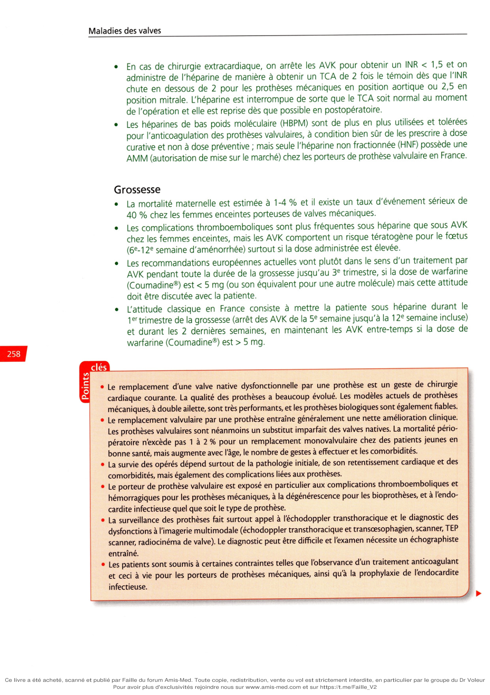

**Fig. 10.15.** Système CoaguChek® INRange.

### 7. Situations particulières

Hémorragie 0 Le traitement anticoagulant ne doit théoriquement jamais être interrompu (en raison du risque de thrombose), sauf en cas d'hémorragie mettant en jeu le pronostic vital immédiat. Dans ce cas, si la neutralisation de l'AVK est nécessaire, on administre du plasma frais de préférence à la vitamine K (0,5 à 2 mg). Chirurgie non cardiaque En cas d'extraction dentaire, le patient peut souvent être traité en ambulatoire, avec un INR de 2 à 2,5. De même, les chirurgies à faible risque hémorragique (cataracte) peuvent être réalisées sous AVK. En cas de chirurgie extracardiaque, on arrête les AVK pour obtenir un INR < 1,5 et on administre de l'héparine de manière à obtenir un TCA de 2 fois le témoin dès que l'INR chute en dessous de 2 pour les prothèses mécaniques en position aortique ou 2,5 en position mitrale. L'héparine est interrompue de sorte que le TCA soit normal au moment de l'opération et elle est reprise dès que possible en postopératoire. Les héparines de bas poids moléculaire (HBPM) sont de plus en plus utilisées et tolérées pour l'anticoagulation des prothèses valvulaires, à condition bien sûr de les prescrire à dose curative et non à dose préventive ; mais seule l'héparine non fractionnée (HNF) possède une AMM (autorisation de mise sur le marché) chez les porteurs de prothèse valvulaire en France. Grossesse La mortalité maternelle est estimée à 1-4 % et il existe un taux d'événement sérieux de 40 % chez les femmes enceintes porteuses de valves mécaniques. Les complications thromboemboliques sont plus fréquentes sous héparine que sous AVK chez les femmes enceintes, mais les AVK comportent un risque tératogène pour le foetus (6e–12e semaine d'aménorrhée) surtout si la dose administrée est élevée. Les recommandations européennes actuelles vont plutôt dans le sens d'un traitement par AVK pendant toute la durée de la grossesse jusqu'au 3e trimestre, si la dose de warfarine (Coumadine®) est < 5 mg (ou son équivalent pour une autre molécule) mais cette attitude doit être discutée avec la patiente. L'attitude classique en France consiste à mettre la patiente sous héparine durant le 1er trimestre de la grossesse (arrêt des AVK de la 5e semaine jusqu'à la 12e semaine incluse) et durant les 2 dernières semaines, en maintenant les AVK entre-temps si la dose de warfarine (Coumadine®) est > 5 mg.

---

## Points

• Le remplacement d'une valve native dysfonctionnelle par une prothèse est un geste de chirurgie

• cardiaque courante. La qualité des prothèses a beaucoup évolué. Les modèles actuels de prothèses

• mécaniques, à double ailette, sont très performants, et les prothèses biologiques sont également fiables.

• Le remplacement valvulaire par une prothèse entraîne généralement une nette amélioration clinique.

• Les prothèses valvulaires sont néanmoins un substitut imparfait des valves natives. La mortalité pério-

• pératoire n'excède pas 1 à 2 % pour un remplacement monovalvulaire chez des patients jeunes en

• bonne santé, mais augmente avec l'âge, le nombre de gestes à effectuer et les comorbidités.

• La survie des opérés dépend surtout de la pathologie initiale, de son retentissement cardiaque et des

• comorbidités, mais également des complications liées aux prothèses.

• Le porteur de prothèse valvulaire est exposé en particulier aux complications thromboemboliques et

• hémorragiques pour les prothèses mécaniques, à la dégénérescence pour les bioprothèses, et à l'endo-

• cardite infectieuse quel que soit le type de prothèse.

• La surveillance des prothèses fait surtout appel à l'échodoppler transthoracique et le diagnostic des

• dysfonctions à l’imagerie multimodale (échodoppler transthoracique et transoesophagien, scanner, TEP

• scanner, radiocinéma de valve). Le diagnostic peut être difficile et l'examen nécessite un échographiste

• entraîné.

• Les patients sont soumis à certaines contraintes telles que l’observance d'un traitement anticoagulant

• et ceci à vie pour les porteurs de prothèses mécaniques, ainsi qu'à la prophylaxie de l'endocardite

• infectieuse.

• Pour les prothèses mécaniques, la surveillance du traitement anticoagulant et l’obtention d’un équilibre

• parfait sont indispensables et doivent être l’objectif principal du suivi effectué par le médecin traitant.

• L’autosurveillance et l’autoadaptation de l’anticoagulation peuvent permettre d'améliorer la qualité de

• vie d'environ 50 % des patients.

• Les anticoagulants oraux directs (AOD) sont contre-indiqués chez les porteurs de prothèse valvulaire

• mécanique et en cas de sténose mitrale.

• La dégénérescence des bioprothèses est inéluctable, survenant le plus souvent 10 à 15 ans après l'implan-

• tation, et conduit à discuter un nouveau remplacement valvulaire chirurgical ou percutané.

• Le remplacement valvulaire percutané, en particulier pour une sténose aortique sur valve native,

• mais également pour une valve biologique dégénérée, est en plein essor, et constitue une alternative

• importante à la chirurgie cardiaque dans des indications sélectionnées.
---

## Notions indispensables et inacceptables

### Notions indispensables

• Il existe deux grands types de prothèses valvulaires : les prothèses mécaniques et les prothèses biologiques.
• Parmi les prothèses biologiques (bioprothèses), on distingue les prothèses chirurgicales, implantées lors de
• la chirurgie, et les prothèses percutanées ou endoprothèses, implantées par cathétérisme interventionnel
• (TAVI ou TAVR : transcatheter aortic valve implantation ou replacement).
• Les prothèses mécaniques sont prévues pour durer toute la vie du patient mais nécessitent un traitement
• anticoagulant à vie par antivitamine K (AVK), et exposent ainsi aux risques thromboemboliques de la
• prothèse et hémorragiques des AVK. L'INR doit être surveillé régulièrement et l'anticoagulation ajustée
• si besoin. Les anticoagulants oraux directs sont contre-indiqués en cas de prothèse valvulaire mécanique.
• Les prothèses biologiques ne nécessitent pas d'anticoagulation par elle-même (sauf en postopératoire
• précoce) mais dégénèrent inéluctablement en se calcifiant, soit sous forme de sténose, soit sous forme de
• déchirure et fuite, nécessitant une réopération en moyenne 10 ans après implantation.
• Les bioprothèses percutanées sont actuellement réservées aux patients inopérables ou à risque chirurgical
• quelque soit leur âge, et aux patients de plus de 75 ans quel que soit leur risque opératoire si l'anatomie
• est favorable.
• Les prothèses, étant par nature des corps étrangers, présentent un risque accru d'endocardite infectieuse
• par rapport aux valves natives, et justifient une prophylaxie infectieuse soigneuse.
• L'échocardiographie transthoracique est l'examen clé de la surveillance des prothèses valvulaires. L'imagerie
• multimodale (ETO, radiocinéma, scanner, etc.) est l'imagerie de recours en cas de bilan de dysfonction de
• prothèse.
• Une prothèse valvulaire est un substitut imparfait de la valve native qui nécessite donc un suivi régulier, au
• minimum annuel, par un cardiologue.

### Notions inacceptables

• Prescrire des anticoagulants oraux directs à des patients porteurs de valve mécanique.
• Prescrire une antibiothérapie à l'aveugle en cas de fièvre à un patient porteur de prothèse valvulaire.
• Oublier l'éducation thérapeutique du patient porteur de prothèse valvulaire concernant la prévention de
• l'endocardite infectieuse et, le cas échéant, de l'anticoagulation efficace.
• Ne pas penser à une endocardite infectieuse en cas de fièvre.
• Ne pas référer à un spécialiste un patient porteur de prothèse valvulaire symptomatique.
• Ne pas référer à un spécialiste un patient porteur de prothèse valvulaire avec un souffle de novo, que le
• patient soit symptomatique ou non.
• Ne pas référer à un spécialiste un patient porteur de prothèse valvulaire pour son suivi annuel.

---

## Réflexes transversalité

• Item 233 - Valvulopathies.
• Item 152 - Endocardite infectieuse.
• Item 330 - Prescription et surveillance des classes de médicaments les plus courantes chez l'adulte et chez
• l'enfant, hors anti-infectieux. Connaître les grands principes thérapeutiques.
• Cormier
• B,
• Lansac
• E,
• Obadia
• JF, Tribouilloy C.
• Cardiopathies valvulaires de l'adulte. Paris : Lavoisier
• Médecine Sciences ; 2014.
• Otto CM, Nishimura RA, Bonow RO, Carabello BA, Erwin JP 3rd, Gentile F, et al. 2020 ACC/AHA
• guideline for the management of patients with valvular heart disease : executive summary :
• a report of the American College of Cardiology/American Heart Association Joint commit-
• tee on dinical practice guidelines. Circulation 2021 ; 143 : e35-e71. www.ahajournals.
• org/doi/full/1 0. 1 1 61/CIR.0000000000000932?rfr_dat=cr_pub++0pubmed&url_ver
• =Z39.88-2003&rfr_id =ori %3Arid %3Acrossref.org
• Vahanian A, Beyersdorf F, Praz F, Milojevic M, Baldus S, Bauersachs J, et al. ; ESC/EACTS Scientific
• Document Group; ESC Scientific Document Group. 2021 ESC/EACTS guidelines for the
• management of valvular heart disease. Eur Heart J 2022 ; 43 : 561-632. https://academic.
• oup.com/eurheartj/article/43/7/561/6358470
• Lancellotti P, Pibarot P, Chambers J, Edvardsen T, Delgado V, Dulgheru R, et al. Recommendations
• for the imaging assessment of prosthetic heart valves : a report from the European Association
• of Cardiovascular Imaging endorsed by the Chinese Society of Echocardiography, the Inter-
• American Society of Echocardiography, and the Brazilian Department of Cardiovascular
• Imaging. Eur Heart J Cardiovasc Imaging 2016; 17 : 589-90. https://academic.oup.com/
• ehjcimaging/artide/1 7/6/589/2240571
• Concernant les prothèses valvulaires cardiaques, quelles sont les réponses exactes ?
• A Elles nécessitent une anticoagulation efficace
• B Elles sont une solution curative des valvulopathies
• C Elles font partie du « groupe à haut risque » pour la prévention de l'endocardite
• **Rang B.** Elles nécessitent une surveillance par échocardiographie transœsophagienne
• E Elles nécessitent un suivi dentaire au moins annuel
• Quelles sont les différentes complications communes des deux types de prothèses ?
• A L'endocardite infectieuse
• B L'hémolyse
• C La désinsertion de prothèse
• **Rang B.** La dégénérescence de prothèse
• E La thrombose de prothèse
• _______________________
• Que comporte le suivi d'un patient porteur de prothèse valvulaire ?
• A Consultation cardiologique à 3 mois avec ECG de repos
• B Échocardiographie de référence à 6 mois postopératoires
• C Traitement rapide de toute fièvre par antibiothérapie probabiliste
• **Rang B.** Bilan d'hémolyse annuel
• E Éducation thérapeutique
• Concernant l'anticoagulation et les prothèses, quelles sont les réponses exactes ?
• A Les AVK ou les AOD peuvent être utilisés chez les sujets porteurs de prothèses valvulaires
• B Le niveau d'anticoagulation efficace par AVK dépend du type de prothèse
• C La surveillance de l'INR doit être hebdomadaire
• **Rang B.** La surveillance de l'INR ne peut se faire qu'en laboratoire
• E Les AOD peuvent être utilisés en cas de FA sur bioprothèse
• Quand suspecter une dysfonction de prothèse ?
• A En cas d'apparition d'un souffle de régurgitation
• B En cas de modification des signes fonctionnels à l'effort ou au repos
• C En cas de modification de l'électrocardiogramme
• **Rang B.** En cas de modification des paramètres échocardiographiques
• E En cas d'AVC ischémique
• Les prothèses valvulaires mécaniques :
• A Peuvent être anticoagulées par les anticoagulants oraux directs
• B Peuvent dégénérer
• C Sont définitives (hors complication)
• **Rang B.** Doivent faire prélever des hémocultures systématiques en cas de fièvre inexpliquée
• E Doivent bénéficier d'une ETO en cas de suspicion de dysfonction ou de complication
• par des flashcodes. Pour accéder à ces compléments, connectez-vous sur http://www.em-
• consulte.com/e-complement/478661 et suivez les instructions pour activer votre accès.
• transœsophagienne 3D.
• phagienne 3D.
• On note une zone sombre en bord de la prothèse correspondant à la désinsertion partielle.
• Item 238
• Souffle cardiaque
• chez l'enfant
• I. Généralités sur les cardiopathies de l'enfant
• II. Particularités de l'auscultation de l'enfant
• III. Circonstances de découverte
• IV. Clinique et examens complémentaires
• V. Principales cardiopathies rencontrées en fonction de l'âge
• VI. Les souffles anorganiques (ou fonctionnels ou « innocents »)
• ■ 18 Découverte d'anomalies à l'auscultation cardiaque.
• ■ 19 Découverte d'un souffle vasculaire.
• ■ 20 Découverte d'anomalies à l'auscultation pulmonaire.
• ■ 26 Anomalies de la croissance staturo-pondérale.
• ■ 39 Examen du nouveau-né à terme.
• ■ 42 Hypertension artérielle.
• ■ 43 Découverte d’une hypotension artérielle.
• ■ 46 Hypotonie/malaise du nourrisson.
• ■ 55 Pâleur de l'enfant.
• I 160 Détresse respiratoire aiguë.
• ■ 162 Dyspnée.
• ■ 165 Palpitations.
• ■ 166 Tachycardie.
• ■ 178 Demande/prescription raisonnée et choix d'un examen diagnostique.
• ■ 185 Réalisation et interprétation d'un électrocardiogramme (ECG).
• ■ 230 Rédaction de la demande d'un examen d'imagerie.
• ■ 231 Demande d'un examen d'imagerie.
• ■ 265 Consultation de suivi d'un nourrisson en bonne santé.
• ■ 296 Consultation de suivi pédiatrique.
• I 308 Dépistage néonatal systématique.
• ■ 335 Évaluation de l'aptitude au sport et rédaction d'un certificat de non-contre-
• indication.
• O
• Diagnostic positif
• Sémiologie cardiovasculaire chez l’enfant
• O
• Définition
• Définition d'un souffle cardiaque
• organique et non organique
• Fréquence en fonction de l'âge
• □
• Examens complémentaires
• Connaître les apports des examens
• de 1re intention devant un souffle de l'enfant
• Radiographie thoracique, ECG,
• échocardiographie
• Étiologies
• Orientation étiologique des souffles cardiaques
• Item 238 - Souffle cardiaque chez l'enfant
• 4H 11 ï 111111 MH 11 1Î1I1IW 1ITOH1WH11
• Vignette clinique
• Vous êtes médecin généraliste et vous recevez en consultation un enfant âgé de 3 ans, qui vient pour
• un écoulement nasal fébrile. À l'auscultation précordiale, vous entendez un souffle systolique et notez
• une irradiation dans le dos.
• > Vous rassurez les parents, l'enfant a de la fièvre et c'est normal d'entendre un souffle ?
• > Un souffle holosystolique est évocateur d'un souffle fonctionnel ?
• > Vous précisez aux parents qu'il pourrait bien s'agir d'une coarctation aortique ?
• > Vous adressez rapidement l'enfant à un cardiopédiatre pour réaliser une échocardiographie ?
• I. Généralités sur les cardiopathies de l'enfant
• **Rang A.** La découverte d'un souffle cardiaque est très fréquente chez l'enfant : il peut être soit
• organique (c'est-à-dire correspondant à une anomalie cardiaque anatomique sous-
• jacente), soit anorganique (dit aussi fonctionnel, ou « innocent » c'est-à-dire sans ano-
• malie cardiaque sous-jacente).
•
• Un souffle peut être entendu chez l'enfant dans plusieurs situations :
• -
• un souffle en relation avec une malformation cardiaque congénitale, qui touche 1 %
• des enfants à la naissance :
• -
• rarement, un souffle en relation avec une cardiomyopathie ou une myocardite,
• -
• exceptionnellement en relation avec une cardiopathie acquise puisque les valvulo-
• pathies rhumatismales ont totalement disparu dans les pays occidentaux,
• -
• chez le grand enfant surtout, un souffle fonctionnel, dit encore « anorganique », ou
• mieux «innocent» sans aucun substrat anatomique qui est rencontré au cours de
• l'enfance chez un tiers à la moitié des enfants d'âge scolaire.
•
• L'âge permet d'emblée d'orienter vers une cause organique ou fonctionnelle : 90 % des
• souffles chez le nourrisson sont organiques et plus des trois quarts des souffles chez l'enfant
• d'âge scolaire sont fonctionnels.
•
• La découverte d'un souffle cardiaque est une source d'anxiété majeure chez les parents. Il est
• le plus souvent innocent mais parfois le seul point d'appel d'une cardiopathie congénitale.
• II. Particularités de l'auscultation de l'enfant
•
• L'auscultation n'est pas toujours facile chez le petit enfant car le cœur est rapide et l'auscul-
• tation est souvent gênée par les cris, les pleurs et l'agitation. Il est nécessaire de connaître
• les petits moyens pour distraire l'enfant : jouets, sucette, etc.
•
• Un stéthoscope pédiatrique est utilisé.
•
• Le rythme cardiaque de l'enfant est rapide et souvent irrégulier car l'arythmie slnusale res-
• piratoire, physiologique, peut être très marquée. En cas de doute, un ECG doit être réalisé.
•
• Un dédoublement du 2e bruit (DB2) le long du bord sternal gauche, variable avec la res-
• piration, est fréquent et physiologique. En revanche, un DB2 large et fixe est anormal
• (communication interatriale ou bloc de branche droit).
•
• Une accentuation ou éclat du 2e bruit le long du bord sternal gauche peut correspondre à
• une hypertension artérielle pulmonaire (HTAP).

---

## Entraînement

Questions isolées et corrigés : [Entrainement/QI/153_Surveillance_porteurs_valves_protheses.md](../../Entrainement/QI/153_Surveillance_porteurs_valves_protheses.md)
