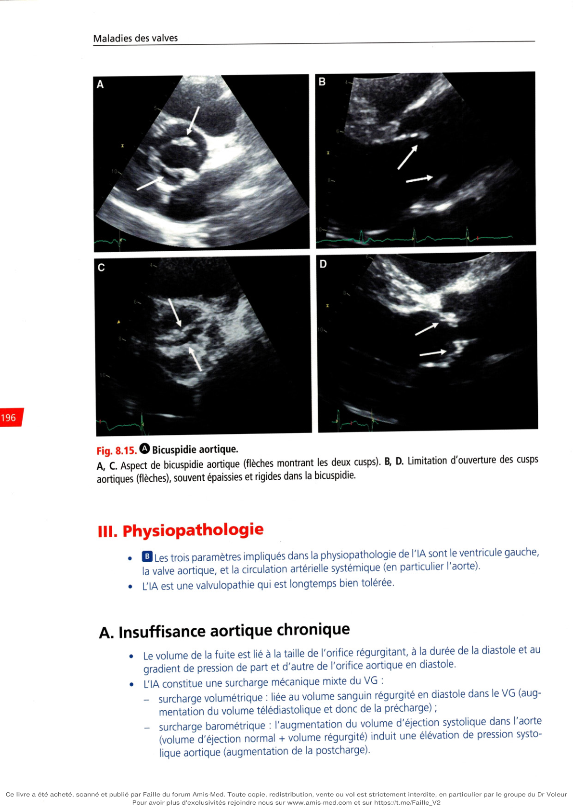
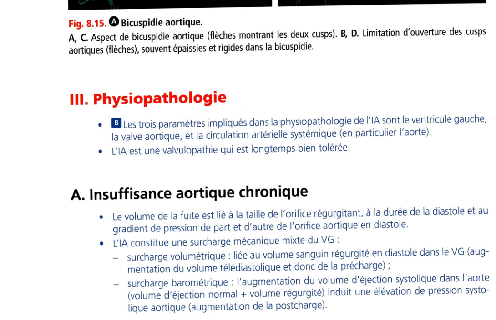
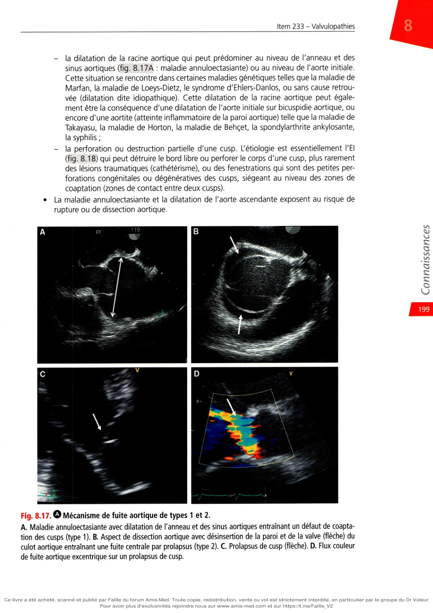
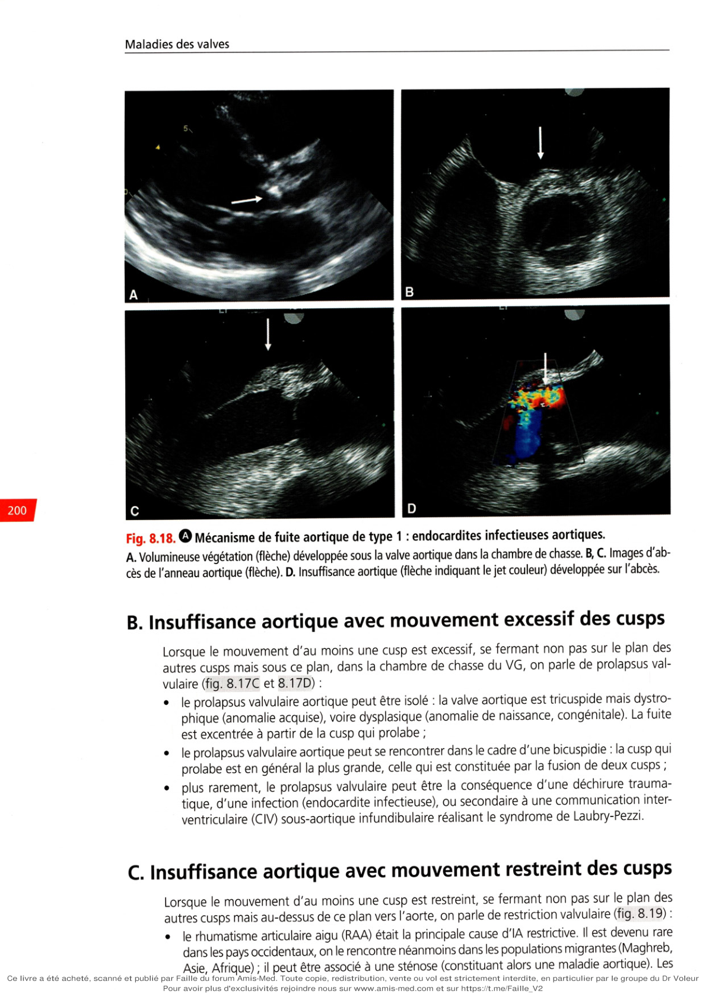
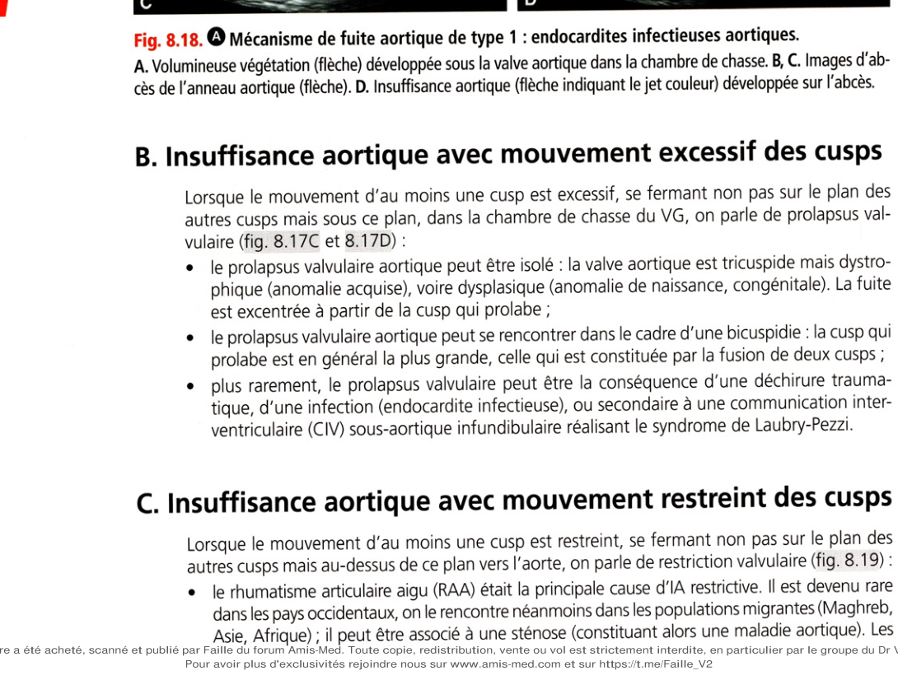
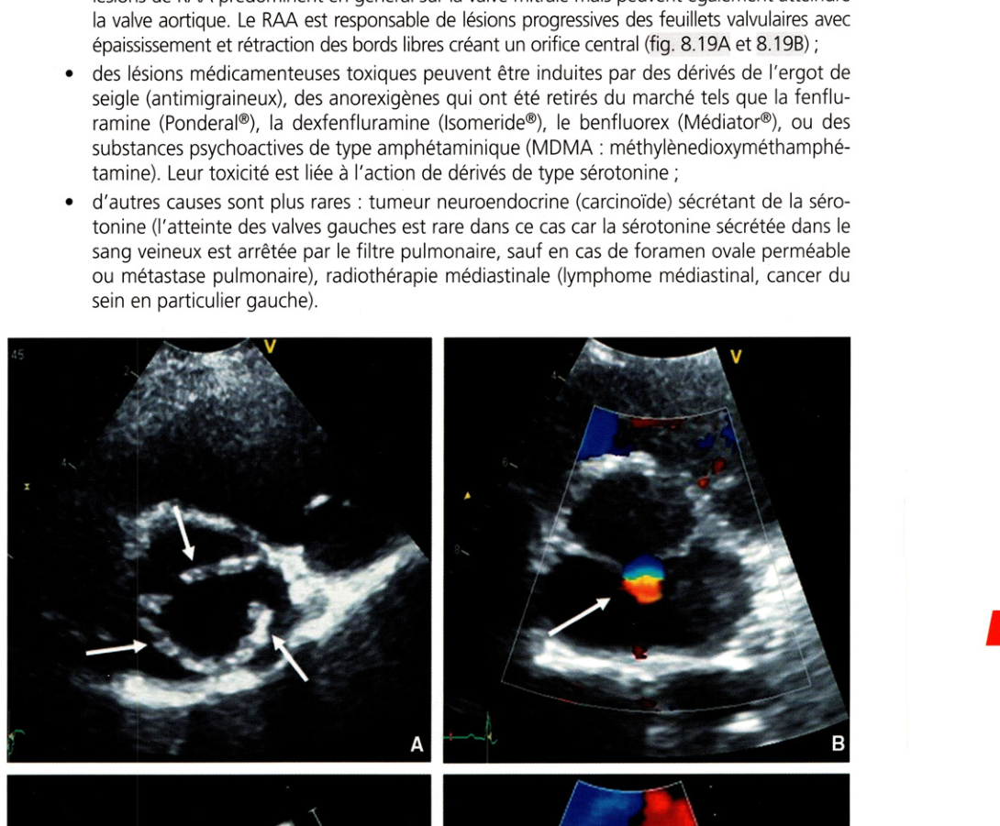
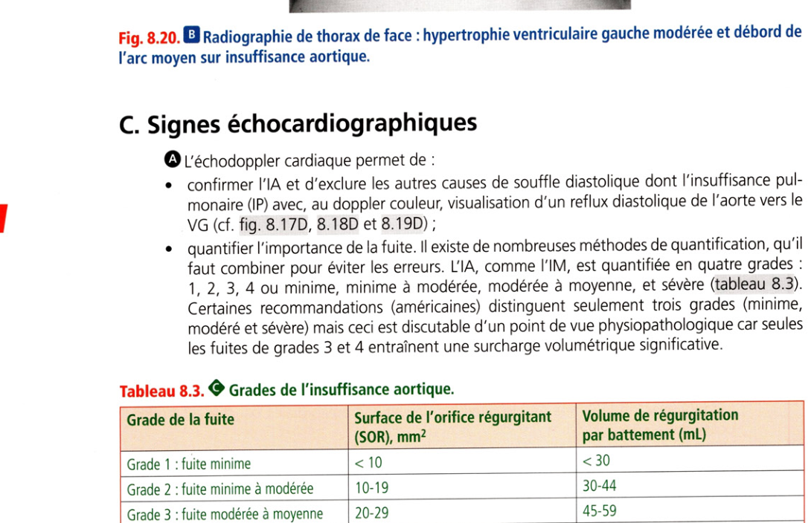
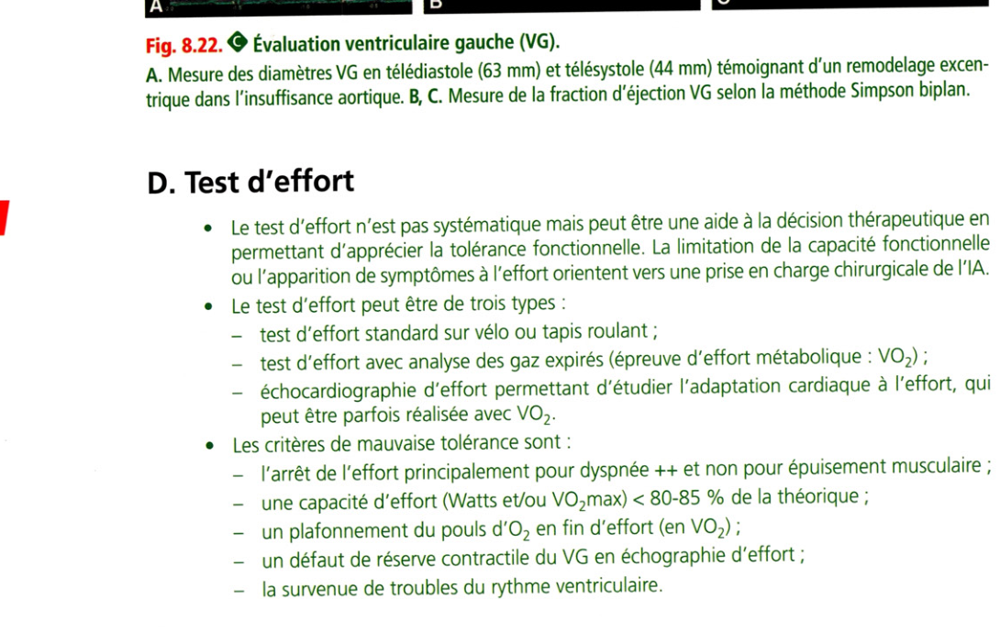
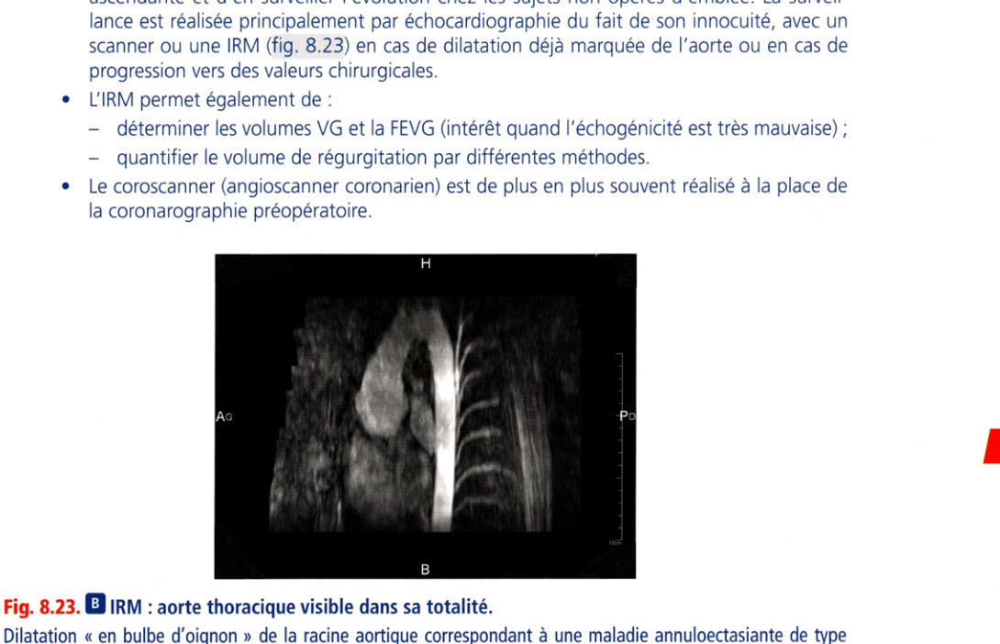

# Item 233 — Insuffisance aortique

> **Collège CNEC / SFC** · 3e édition (2025) · p. 194–216 · R2C  
> Partie II — Maladies des valves

---

## Trois repères à ne pas confondre

| Badge | Signification (R2C) |
|---|---|
| **Rang A** | Connaissances fondamentales de fin de 2e cycle |
| **Rang B** | Connaissances essentielles, plus spécialisées |
| **Rang C** | Connaissances de 3e cycle (DES) |

Les pastilles du livre (● = A, ■ = B) sont reprises inline.

---

## Situations de départ

18 Découverte d'anomalies à l'auscultation cardiaque..
20 Découverte d'anomalies à l'auscultation pulmonaire..
21 Asthénie..
22 Diminution de la diurèse..
44 Hyperthermie/fièvre..
50 Malaise/perte de connaissance..
160 Détresse respiratoire aiguë..
161 Douleur thoracique..
162 Dyspnée..
165 Palpitations..
166 Tachycardie..
178 Demande/prescription raisonnée et choix d'un examen diagnostique..
185 Réalisation et interprétation d'un électrocardiogramme (ECG)..
190 Hémoculture positive..
203 Élévation de la protéine C-réactive (CRP)..
230 Rédaction de la demande d'un examen d'imagerie..
231 Demande d'un examen d'imagerie..
232 Demande d'explication d'un patient sur le déroulement, les risques et les bénéfices attendus d'un examen d'imagerie..
233 Identifier/reconnaître les différents examens d'imagerie (type/fenêtre/séquences/incidences/injection)..
239 Explication préopératoire et recueil de consentement d'un geste invasif diagnostique ou thérapeutique..
247 Prescription d'une rééducation..
248 Prescription et suivi d'un traitement par anticoagulant et/ou antiagrégant..
253 Prescrire des diurétiques..
255 Prescrire un anti-infectieux..
258 Prévention de la douleur liée aux soins..
259 Évaluation et prise en charge de la douleur aiguë..
271 Prescription et surveillance d'une voie d'abord vasculaire..
279 Consultation de suivi d'une pathologie chronique..
285 Consultation de suivi éducation thérapeutique d'un patient avec antécédents cardiovasculaires..
300 Consultation pré-anesthésique..
311 Prévention des infections liées aux soins..
314 Prévention des risques liés au tabac..
320 Prévention des maladies cardiovasculaires..
324 Modification thérapeutique du mode de vie (sommeil, activité physique, alimentation, etc.)..
328 Annonce d'une maladie chronique..
334 Demande de traitement et investigation inappropriés..
335 Évaluation de l'aptitude au sport et rédaction d'un certificat de non-contre-indication..
339 Prescrire un arrêt de travail..
342 Rédaction d'une ordonnance/d'un courrier médical..
352 Expliquer un traitement au patient (adulte/enfant/adolescent)..
354 Évaluation de l'observance thérapeutique..
355 Organisation de la sortie d'hospitalisation..

---

## Hiérarchisation des connaissances

| Rang | Rubrique | Intitulé | Descriptif |
|---|---|---|---|
| **A** | Définition | Définition IM, RA, IA, RM | |
| **A** | Étiologies | Principales étiologies des valvulopathies (IM, RA, IA, RM) | |
| **A** | Diagnostic positif | Signes fonctionnels et auscultation IM, RA, IA, RM | |
| **A** | Examens complémentaires | Valeur primordiale de l'échocardiographie (IM, IA, RA, RM) | Diagnostic positif, mécanisme, étiologie, sévérité |
| **A** | Physiopathologie | Mécanismes et conséquences IM, IA, RA, RM | |
| **B** | Examens complémentaires | Intérêt ECG, radiographie thoracique, épreuve d'effort | |
| **B** | Suivi et/ou pronostic | Évolutions et complications IM, RA, IA, RM | |
| **B** | Prise en charge | Principes du traitement chirurgical IM, RA, IA, RM | Plastie ou remplacement valvulaire |
| **B** | Prise en charge | Traitements percutanés IM, RA, RM | TAVI ; alternative percutanée IM (MitraClip®) |
| **A** | Prise en charge | Indications chirurgicales IM, RA, RM, IA | |
| **A** | Prise en charge | Indications percutanées RA et IM | |
| **A** | Prise en charge | Modalités du traitement médical de l'IA | Bêtabloquant dans le Marfan |

---

## Parcours Rang A

- [I. Définition](#i-définition)
- [III. Physiopathologie](#iii-physiopathologie)
- [V. Clinique](#v-clinique)
- [VI. Examens complémentaires](#vi-examens-complémentaires)
- [X. Traitement](#x-traitement)

---

## Sommaire

- [Vignette clinique](#vignette-clinique)
- [I. Définition](#i-définition)
- [II. Rappel anatomique](#ii-rappel-anatomique)
- [III. Physiopathologie](#iii-physiopathologie)
- [IV. Étiologies](#iv-étiologies)
- [V. Clinique](#v-clinique)
- [VI. Examens complémentaires](#vi-examens-complémentaires)
- [VII. Diagnostic différentiel](#vii-diagnostic-différentiel)
- [VIII. Évolution et complications](#viii-évolution-et-complications)
- [IX. Surveillance](#ix-surveillance)
- [X. Traitement](#x-traitement)
- [Points](#points)
- [Notions indispensables et inacceptables](#notions-indispensables-et-inacceptables)
- [Réflexes transversalité](#réflexes-transversalité)
- [Entraînement](../../Entrainement/QI/233_Valvulopathies.md)

---

## Vignette clinique

Un homme de 51 ans vient vous consulter car depuis quelques mois, il se sent essoufflé à la montée de deux étages. Il n'a pas d'antécédent particulier en dehors de deux entorses. Il n'a pas de facteur de risque cardiovasculaire. À l'auscultation, vous retrouvez un souffle systolique 2/6 au foyer aortique et un souffle diastolique 3/6 au bord gauche du sternum. Sa pression artérielle est à 152/58 mmHg.

> 

Comment interprétez-vous l'auscultation cardiaque ?

> 

Quels autres paramètres cliniques recherchez-vous dans cette valvulopathie ?

> 

Que recherchez-vous pour orienter le diagnostic étiologique ?

> 

Quelles sont les principales étiologies de l'insuffisance aortique ?

> 

Quels examens complémentaires réalisez-vous pour le diagnostic et la prise en charge, et quelles informations recherchez-vous ?

> 

S'agit-il d'une valvulopathie ancienne et, le cas échéant, sur quels arguments ?

> 

Quelle prise en charge proposez-vous au patient ?

# I. Définition

**Rang A.**

• **Rang A.** La régurgitation valvulaire aortique, ou fuite aortique, ou « insuffisance » aortique (IA),

est un reflux (régurgitation, retour) de sang de l'aorte vers le ventricule gauche (VG) en diastole. L'IA est une valvulopathie peu fréquente, dont la prévalence augmente avec l'âge.

---

# II. Rappel anatomique

**Rang A.**

La racine aortique et la valve aortique peuvent être impliquées dans la genèse d'une IA. La racine aortique (fig. 8.13) comporte plusieurs éléments :

-

l'anneau aortique sur lequel s'insèrent les feuillets valvulaires, ou cusps, ou sigmoïdes ;

-

les sinus aortiques (ou sinus de Valsalva) ; au niveau de la zone de jonction entre deux sinus s'insèrent les commissures des cusps aortiques (zone commissurale, commune à deux cusps), qui permettent leur suspension à la paroi ;

-

la jonction sinotubulaire ;

-

l'aorte initiale. La valve aortique (fig. 8.14) est normalement constituée de trois cusps (elle est dite tricuspide) : une cusp antérodroite en regard du sinus aortique antérodroit, une cusp antérogauche en regard du sinus antérogauche, et une cusp non coronaire (sinus postérieur ou non coronaire). Chez 1-2 % de la population générale, la valve aortique est constituée de seulement deux cusps, par fusion ou défaut de séparation embryologique de deux cusps. Il s'agit d'une anomalie congénitale, qui apparaît lors du développement fœtal. On parle de bicuspidie aortique (fig. 8.1 5). .Jonction sino tubulaire Sinus de Valsalva / Aorte ascendante Anneau aortique HR

**Fig. 8.13.** Racine de l'aorte vue « de profil » en échocardiographie, avec ses différents composants,

l'anneau aortique, les sinus aortiques (ou de Valsalva), la jonction sinotubulaire, et l'aorte ascendante dans sa portion initiale. Cusp antérodroite Cusp antérogauche Cusp non coronaire

**Fig. 8.14.** Anatomie normale de la valve aortique.

A. Valve aortique de face avec les trois cusps fermées en échocardiographie. B. Valve aortique avec les trois cusps ouvertes. C. Schéma anatomique « déroulé » de la valve aortique d'après Léonard de Vinci (xve siècle) montrant la forme en « nid d'hirondelle » ou en « balconnet » des cusps aortiques.

**Fig. 8.15.** Bicuspidie aortique.

A, C. Aspect de bicuspidie aortique (flèches montrant les deux cusps). B, D. Limitation d'ouverture des cusps aortiques (flèches), souvent épaissies et rigides dans la bicuspidie.

---

# III. Physiopathologie

**Rang A** · **Rang B**.

• • Les trois paramètres impliqués dans la physiopathologie de l'IA sont le ventricule gauche,

la valve aortique, et la circulation artérielle systémique (en particulier l'aorte). L'IA est une valvulopathie qui est longtemps bien tolérée.

## A. Insuffisance aortique chronique

Le volume de la fuite est lié à la taille de l'orifice régurgitant, à la durée de la diastole et au gradient de pression de part et d'autre de l'orifice aortique en diastole. L'IA constitue une surcharge mécanique mixte du VG :

-

surcharge volumétrique : liée au volume sanguin régurgité en diastole dans le VG (augmentation du volume télédiastolique et donc de la précharge) ;

-

surcharge barométrique : l'augmentation du volume d'éjection systolique dans l'aorte (volume d'éjection normal + volume régurgité) induit une élévation de pression systolique aortique (augmentation de la postcharge). L'augmentation de la précharge et de la postcharge conditionne le retentissement sur le VG :

-

les surcharges volumétrique et barométrique du VG entraînent un remodelage du VG qui vise à normaliser la contrainte pariétale excessive diastolique et systolique ;

-

la contrainte ou tension pariétale peut être approchée par la loi de Laplace (tension pariétale T=Px r/2e ou P est la pression intracavitaire, r le rayon de la cavité et e l'épaisseur pariétale), r augmente du fait de la régurgitation aortique, P du fait de l'élévation de la postcharge, e progressivement pour normaliser la contrainte pariétale ;

-

le remodelage VG de type hypertrophie excentrique est plus marqué en termes de dilatation cavitaire et d'hypertrophie pariétale que pour l'insuffisance mitrale (IM) ;

-

ce remodelage VG est par nature pathologique, maladaptatif, médié par de nombreux processus biologiques qui induisent à terme une destruction cardiomyocytaire et une fibrose interstitielle ;

-

au début de l'évolution, l'hypertrophie myocardique compensatrice permet de maintenir une fonction systolique VG normale ;

-

la compliance du VG est grande, si bien qu'il peut fonctionner avec des pressions de remplissage normales pendant de nombreuses années malgré une dilatation importante ;

-

progressivement apparaissent une altération de la contractilité et de la compliance ventriculaire (baisse de la fraction d'éjection et élévation des pressions de remplissage VG) et une insuffisance cardiaque d'effort, puis de repos ;

-

lorsque le VG est très dilaté ou que la fraction d'éjection (FE) est abaissée, le remodelage VG peut être irréversible et ne pas récupérer après traitement chirurgical. Au niveau aortique, on observe deux phénomènes :

-

une augmentation de la pression artérielle systolique, qui dépend du volume d'éjection systolique et de la compliance aortique ;

-

une baisse de la pression artérielle diastolique du fait de la régurgitation lorsque le volume de l'IA est important. Ceci explique les signes cliniques d'hyperpulsatilité artérielle, par augmentation de la pression artérielle différentielle ou pression pulsée (différence entre les pressions systolique et diastolique). La baisse de la pression diastolique dans l'aorte peut affecter la circulation coronarienne :

-

baisse de la perfusion coronarienne qui se fait normalement surtout en diastole ;

-

lorsque l'IA est sévère, elle peut même entraîner un « vol » coronarien (aspiration par la fuite du sang artériel coronarien en diastole) ;

-

l'hypoperfusion coronarienne peut se traduire par un angor de repos ou d'effort, et entraîner une ischémie myocardique participant à la genèse de la fibrose myocardique.

## B. Insuffisance aortique aiguë

Il s'agit surtout d'une endocardite infectieuse (El) responsable de la survenue brutale d'une IA volumineuse, donc d'une surcharge volumétrique très importante, sur une cavité VG de taille normale ou peu dilatée à compliance normale. Il en résulte une élévation brutale des pressions de remplissage (en diastole) du VG, donc une élévation des pressions dans l'atrium gauche et la circulation pulmonaire, conduisant à un œdème pulmonaire. L'IA aiguë peut être peu audible à l'auscultation. Dans l'IA aiguë, la circulation coronarienne est particulièrement pénalisée du fait de l'augmentation de la contrainte pariétale en diastole et la diminution de la pression diastolique aortique.

---

# IV. Étiologies

**Rang A** · **Rang B**.

Tableau 8.2. 0 Principales étiologies des insuffisances aortiques. Mouvement valvulaire normal (type 1) Mouvement valvulaire excessif : prolapsus (type 2) Mouvement valvulaire restreint (type 3) Dilatation de la racine de l'aorte 1) Dilatation idiopathique 2) Maladies syndromiques, génétiques

- Maladie de Marfan

- Maladie de Loeys-Dietz

- Maladie d'Ehlers-Danlos

3) Maladies inflammatoires (aortite)

- Maladie de Takayasu

- Maladie de Horton

- Maladie de Behçet

- Spondylarthrite ankylosante

- Syphilis

4) Bicuspidie aortique 5) Dissection aortique Destruction/perforation valvulaire 1) Endocardite infectieuse 2) Lésion traumatique 3) Fenestration congénitale ou acquise Dystrophie ou dysplasie isolée de la valve aortique Bicuspidie aortique Endocardite infectieuse Syndrome de Laubry-Pezzi Déchirure traumatique Dissection aortique Rhumatisme articulaire aigu Toxicité médicamenteuse Radiothérapie médiastinale

**Rang A.** Les étiologies de l'IA relèvent de trois mécanismes différents (fig. 8. 1 6), qui peuvent parfois s'associer. Ces trois mécanismes se distinguent par la mobilité des cusps qui peut être

normale, augmentée ou restreinte. Lorsqu'une étiologie peut relever de plusieurs mécanismes, le mécanisme principal est cité. On recherche particulièrement une lésion organique des cusps (perforation, épaississement, élongation, etc.) et/ou une dilatation de la racine aortique. Mouvement valvulaire Normal Excessif Restreint Valve aortique normale Type 1 Dilatation de l’anneau et/ou de la racine aortique Perforation valvulaire Type 2 Prolapsus valvulaire Type 3 Épaississement et rigidification des feuillets valvulaires Aorte VG Feuillets valvulaires

**Fig. 8.16.** Mécanisme de fuite aortique en fonction de la mobilité des cusps ou sigmoïdes aortiques.

Type 1 : mouvement quasi normal des cusps, type 2 : mouvement excessif en diastole (prolapsus) des cusps (flèche), type 3 : mouvement restreint des cusps (flèches) par atteinte organique.

## A. Insuffisance aortique avec mouvement normal des cusps

Lorsque le mouvement des cusps est normal, trois types d'anomalies peuvent expliquer l'IA :

-

la dilatation de l'anneau aortique empêchant la coaptation des cusps malgré un mouvement et une structure valvulaire normaux. En pratique, la dilatation de l'anneau aortique est rarement isolée, associée en général à la dilatation de la racine de l'aorte ;

-

la dilatation de la racine aortique qui peut prédominer au niveau de l'anneau et des sinus aortiques (fig. 8.17A : maladie annuloectasiante) ou au niveau de l'aorte initiale. Cette situation se rencontre dans certaines maladies génétiques telles que la maladie de Marfan, la maladie de Loeys-Dietz, le syndrome d'Ehlers-Danlos, ou sans cause retrouvée (dilatation dite idiopathique). Cette dilatation de la racine aortique peut également être la conséquence d'une dilatation de l'aorte initiale sur bicuspidie aortique, ou encore d'une aortite (atteinte inflammatoire de la paroi aortique) telle que la maladie de Takayasu, la maladie de Horton, la maladie de Behçet, la spondylarthrite ankylosante, la syphilis ;

-

la perforation ou destruction partielle d'une cusp. L'étiologie est essentiellement l'EI (fig. 8.18) qui peut détruire le bord libre ou perforer le corps d'une cusp, plus rarement des lésions traumatiques (cathétérisme), ou des fenestrations qui sont des petites perforations congénitales ou dégénératives des cusps, siégeant au niveau des zones de coaptation (zones de contact entre deux cusps). La maladie annuloectasiante et la dilatation de l'aorte ascendante exposent au risque de rupture ou de dissection aortique.

**Fig. 8.17.** Mécanisme de fuite aortique de types 1 et 2.

A. Maladie annuloectasiante avec dilatation de l'anneau et des sinus aortiques entraînant un défaut de coaptation des cusps (type 1). B. Aspect de dissection aortique avec désinsertion de la paroi et de la valve (flèche) du culot aortique entraînant une fuite centrale par prolapsus (type 2). C. Prolapsus de cusp (flèche). D. Flux couleur de fuite aortique excentrique sur un prolapsus de cusp.

**Fig. 8.18.** Mécanisme de fuite aortique de type 1 : endocardites infectieuses aortiques.

A. Volumineuse végétation (flèche) développée sous la valve aortique dans la chambre de chasse. B, C. Images d'abcès de l'anneau aortique (flèche). D. Insuffisance aortique (flèche indiquant le jet couleur) développée sur l'abcès.

## B. Insuffisance aortique avec mouvement excessif des cusps

Lorsque le mouvement d'au moins une cusp est excessif, se fermant non pas sur le plan des autres cusps mais sous ce plan, dans la chambre de chasse du VG, on parle de prolapsus valvulaire (fig. 8.1 7C et 8.17D): le prolapsus valvulaire aortique peut être isolé : la valve aortique est tricuspide mais dystrophique (anomalie acquise), voire dysplasique (anomalie de naissance, congénitale). La fuite est excentrée à partir de la cusp qui prolabe ; le prolapsus valvulaire aortique peut se rencontrer dans le cadre d'une bicuspidie : la cusp qui prolabe est en général la plus grande, celle qui est constituée par la fusion de deux cusps ; plus rarement, le prolapsus valvulaire peut être la conséquence d'une déchirure traumatique, d'une infection (endocardite infectieuse), ou secondaire à une communication interventriculaire (CIV) sous-aortique infundibulaire réalisant le syndrome de Laubry-Pezzi.

## C. Insuffisance aortique avec mouvement restreint des cusps

Lorsque le mouvement d'au moins une cusp est restreint, se fermant non pas sur le plan des autres cusps mais au-dessus de ce plan vers l'aorte, on parle de restriction valvulaire (fig. 8.19) : le rhumatisme articulaire aigu (RAA) était la principale cause d'IA restrictive. Il est devenu rare dans les pays occidentaux, on le rencontre néanmoins dans les populations migrantes (Maghreb, Asie, Afrique) ; il peut être associé à une sténose (constituant alors une maladie aortique). Les lésions de RAA prédominent en général sur la valve mitrale mais peuvent également atteindre la valve aortique. Le RAA est responsable de lésions progressives des feuillets valvulaires avec épaississement et rétraction des bords libres créant un orifice central (fig. 8.19A et 8.19B) ; des lésions médicamenteuses toxiques peuvent être induites par des dérivés de l'ergot de seigle (antimigraineux), des anorexigènes qui ont été retirés du marché tels que la fenfluramine (Pondéral®), la dexfenfluramine (Isomeride®), le benfluorex (Médiator®), ou des substances psychoactives de type amphétaminique (MDMA : méthylènedioxyméthamphétamine). Leur toxicité est liée à l'action de dérivés de type sérotonine ; d'autres causes sont plus rares : tumeur neuroendocrine (carcinoïde) sécrétant de la sérotonine (l'atteinte des valves gauches est rare dans ce cas car la sérotonine sécrétée dans le sang veineux est arrêtée par le filtre pulmonaire, sauf en cas de foramen ovale perméable ou métastase pulmonaire), radiothérapie médiastinale (lymphome médiastinal, cancer du sein en particulier gauche).

**Fig. 8.19.** Mécanisme de fuite aortique de type 3.

A. Lésions valvulaires rhumatismales (post-rhumatisme articulaire aigu) de la valve aortique avec épaississement et rétraction du bord libre des cusps (flèches montrant le bord libre des cusps en position ouverte). B. Orifice central avec insuffisance aortique (flèche montrant le jet couleur). C. Lésions médicamenteuses (benfluorex) de la valve aortique avec mouvement restreint des cusps (flèche montrant le défaut de fermeture en diastole).

## D. Insuffisance aortique centrale (flèche montrant le jet couleur).

## D. Insuffisance aortique aiguë

Elle peut être secondaire à : une • en phase aiguë : IA souvent massive, consécutive à une destruction/perforation valvulaire et/ou à un abcès de l'anneau aortique (cf. fig. 8.18) ; une dissection aortique aiguë atteignant l'anneau aortique (cf. fig. 8.17B) ; un traumatisme avec lésion valvulaire aortique (traumatisme fermé du thorax, traumatisme de décélération, cathétérisme cardiaque).

## E. Cas particulier des insuffisances aortiques sur prothèse

valvulaire Il peut s'agir : d'une IA paraprothétique par désinsertion partielle septique (• précoce ou tardive postopératoire) ou aseptique de la prothèse (anneau aortique fragilisé par des interventions multiples ou par des calcifications). L'IA paraprothétique peut parfois exister précocement après RVA (remplacement valvulaire aortique) chirurgical ou TAVI en dehors de tout sepsis. Elle est dans ce cas en général minime mais doit être signalée et surveillée ; d'une IA intraprothétique par dysfonction de prothèse (thrombus bloquant le mouvement d'une ailette, endocardite infectieuse ou dégénérescence d'une bioprothèse). Une IA minime est normale sur prothèse mécanique ou biologique.

---

# V. Clinique

**Rang A** · **Rang B**.

## A. Circonstances de découverte

La découverte est le plus souvent fortuite en cas d'IA chronique (souffle entendu lors d'une consultation pour une autre raison). Il peut également s'agir d'une découverte dans le cadre du bilan d'une pathologie causale. De nos jours, la découverte tardive au stade d'insuffisance cardiaque (IC) est devenue rare.

## B. Signes fonctionnels

L'IA est souvent asymptomatique. On peut retrouver :

-

une dyspnée d'effort (classification NYHA : New York Heart Association) ;

-

rarement un angor d'effort et parfois de repos (fonctionnel) en cas d'IA massive ;

-

une asthénie anormale, qui peut être la traduction de l'insuffisance cardiaque sur IA. La présence de signes au repos (rares et tardifs) est de mauvais pronostic.

## C. Signes physiques

### 1. Auscultation

Elle retrouve : un souffle diastolique +++, de durée variable dans la diastole ; il prédomine au foyer aortique et irradie le long du bord gauche du sternum. Il est mieux perçu lorsque le patient se penche en avant, assis ou debout, en expiration bloquée. Un souffle est holodiastolique en cas d'IA importante, ou protomésodiastolique en cas d'IA de moindre importance ; un souffle systolique éjectionnel d'accompagnement au foyer aortique fréquent, en général modéré, secondaire à l'augmentation du flux antérograde transaortique ; parfois un roulement de Flint apexien (sténose mitrale fonctionnelle quand l'IA gêne l'ouverture mitrale) ou bruit de galop, témoins d'une IA sévère.

### 2. Palpation

Elle note un choc de pointe étalé, dévié en bas et à gauche en cas de dilatation du ventricule gauche : choc « en dôme ».

### 3. Signes périphériques

Il s'agit : d'une hyperpulsatilité des pouls artériels périphériques ++ ; de battements artériels parfois apparents au niveau du cou et d'autres signes d'hyperpulsatilité artérielle périphérique (oscillation de la tête, pulsatilité sous-unguéale, pulsatilité cutanée, etc.) ; d'un élargissement de la pression artérielle différentielle, avec abaissement de la pression diastolique ++ traduisant une IA sévère.

---

# VI. Examens complémentaires

**Rang A** · **Rang B**.

## A. Électrocardiogramme

• **Rang A.** II peut être normal.

Le rythme est en général sinusal. La survenue de fibrillation atriale (FA) ou d'extrasystoles ventriculaires (ESV) est un élément de mauvais pronostic. Typiquement, on note un aspect d'hypertrophie ventriculaire gauche (HVG) (de type diastolique) avec onde R très ample dans les dérivations précordiales gauches et ondes T positives. On observe parfois une HVG de type systolique avec discret sous-décalage de ST et inversion des ondes T dans les dérivations précordiales gauches.

## B. Signes radiologiques (radiographie de thorax)

Les IA de petit volume n'ont pas de signes radiologiques. Les IA volumineuses chroniques entraînent une augmentation du volume cardiaque, et donc de l'index cardiothoracique (ICT). L'aorte, lorsqu'elle est déroulée, donne un débord aortique au niveau de l'arc moyen droit (fig. 8.20).

**Fig. 8.20.** Radiographie de thorax de face : hypertrophie ventriculaire gauche modérée et débord de

l'arc moyen sur insuffisance aortique.

## C. Signes échocardiographiques

**Rang A.** L'échodoppler cardiaque permet de :

confirmer l'IA et d'exclure les autres causes de souffle diastolique dont l'insuffisance pulmonaire (IP) avec, au doppler couleur, visualisation d'un reflux diastolique de l'aorte vers le VG (cf. fig. 8.17D, 8.18D et 8.19D) ; quantifier l'importance de la fuite. Il existe de nombreuses méthodes de quantification, qu'il faut combiner pour éviter les erreurs. L'IA, comme l'IM, est quantifiée en quatre grades : 1, 2, 3, 4 ou minime, minime à modérée, modérée à moyenne, et sévère (tableau 8.3). Certaines recommandations (américaines) distinguent seulement trois grades (minime, modéré et sévère) mais ceci est discutable d'un point de vue physiopathologique car seules les fuites de grades 3 et 4 entraînent une surcharge volumétrique significative. Tableau 8.3. Grades de l'insuffisance aortique. Grade de la fuite Surface de l'orifice régurgitant (SOR), mm2 Volume de régurgitation par battement (mL) Grade 1 : fuite minime < 10 <30 Grade 2 : fuite minime à modérée 10-19 30-44 Grade 3 : fuite modérée à moyenne 20-29 45-59 Grade 4 : fuite sévère La quantification repose sur : des critères indirects :

-

le débit dans la chambre de chasse : une fuite sévère s'accompagne d'un hyperdébit en général >4 l/min/m2 (fig. 8.21),

-

la dilatation du VG en diastole : elle signe une surcharge volumétrique significative de grade > 3 (fig. 8.22A),

-

l'effet doppler télédiastolique isthmique : la vitesse du flux rétrograde mesurée en fin de diastole dans l'isthme aortique > 20 cm/s chez l'adulte est en faveur d'une IA sévère ; des critères directs :

-

le diamètre du jet régurgitant à son origine en doppler couleur, au niveau de la zone la plus étroite ou « vena contracta » qui est un bon critère semi-quantitatif (cf. fig. 8.19D),

-

la méthode de la zone de convergence ou « PISA » (proximal isovelocity surface area), qui s'intéresse non plus au jet régurgité, mais au flux en amont de l'orifice régurgitant ; cette méthode peut s'appliquer dans l'IA comme dans l'IM. Elle permet d'estimer la surface de l'orifice régurgitant et le volume régurgité par battement (fig. 8.21). Ss Ao Vmai 1.40 nVs SsAoVmoy 0.99 nv J Ss Ao GDm« 7.79 mrnHg Ss Ao GDmoy 4 41 nwnHd Ss Ao ITV 30 96 cn3 SsAoenv.Ti FC 69 08 BPM Voi.ef4Ct.VG Volrrecl ind.VG 62.66 nü/m? DetNtCwd. Z.IOL'mwJ LA R Ax« 1 03 en LA v Ak** 0 24 m. v LAFJui 126 Débit Ciid lnd Fig. 8.21. Critères de quantification d'une insuffisance aortique (IA). A. Une IA volumétriquement significative (grade 3 ou 4) s'accompagne d'un hyperdébit dans la chambre de chasse du ventricule gauche. B. Méthode de la PISA (proximal isovelocity surface area) avec mesure de la PISA ou zone de convergence (hémisphère en jaune). C. Mesure du flux de régurgitation aortique. Ces deux paramètres permettent de calculer la surface de l'orifice régurgitant (SOR) et le volume de régurgitation, qui sont ici à 26 mm2 et 65 mL, respectivement, correspondant de facto à une fuite sévère. L'examen échographique précise : le retentissement :

-

dilatation du VG (fig. 8.22A) :

-

par la mesure des diamètres télédiastolique et télésystolique en mode TM (temps mouvement) ou 2D, à indexer à la surface corporelle,

-

par la mesure des volumes ventriculaires en mode le plus souvent bidimensionnel (ou tridimensionnel),

-

aspect d’hypertrophie excentrique (augmentation de l'épaisseur pariétale associée à la dilatation VG),

-

mesure de la FEVG visuelle ou par la méthode Simpson biplan : le plus souvent normale (> 50 %) dans les IA compensées (fig. 8.22A),

-

estimation des pressions de remplissage du VG,

-

mesure de la pression artérielle pulmonaire (PAP). Dans les IA chroniques asymptomatiques, ce sont sur ces données que les indications de remplacement valvulaire reposent, ainsi que sur la dilatation éventuelle de l'aorte ascendante ; l'étiologie :

-

mobilité des cusps ou sigmoïdes : normale, augmentée ou restreinte,

-

aspect des valves, fines ou épaissies, calcifiées ou non, tricuspide ou bicuspide (cf. fig. 8. 15 et 8. 19),

-

présence de végétations ou d'abcès valvulaires en faveur d'une • (cf. fig. 8.18),

-

diamètre de l'anneau aortique, des sinus de Valsalva et de l'aorte ascendante. En cas de maladie annuloectasiante, aspect « piriforme » ou « en bulbe d'oignon » de la racine aortique qui expose à un risque de rupture ou dissection aortique (cf. fig. 8.17A et 8.1 7B),

-

en cas de bicuspidie, dilatation associée de l'aorte ascendante (50 % des cas environ) siégeant le plus souvent au-delà de la jonction sinotubulaire,

-

dilatation aortique et présence d'un « flap » en cas de dissection aortique (cf. fig. 8. 1 7B) ; d'autres atteintes valvulaires associées, notamment mitrale ou tricuspide. L'échographie transcesophagienne (ETO) est indiquée lorsque l'échogénicité est insuffisante en transthoracique pour quantifier la fuite ou déterminer l'étiologie, pour examiner l'aorte thoracique, ou lorsque certains diagnostics sont évoqués (El, dissection aortique notamment).

**Fig. 8.22.** Évaluation ventriculaire gauche (VG).

A. Mesure des diamètres VG en télédiastole (63 mm) et télésystole (44 mm) témoignant d'un remodelage excentrique dans l'insuffisance aortique. B, C. Mesure de la fraction d'éjection VG selon la méthode Simpson biplan.

## D. Test d'effort

Le test d'effort n'est pas systématique mais peut être une aide à la décision thérapeutique en permettant d'apprécier la tolérance fonctionnelle. La limitation de la capacité fonctionnelle ou l'apparition de symptômes à l'effort orientent vers une prise en charge chirurgicale de l'IA. Le test d'effort peut être de trois types :

-

test d'effort standard sur vélo ou tapis roulant ;

-

test d'effort avec analyse des gaz expirés (épreuve d'effort métabolique : VO 2) ;

-

échocardiographie d'effort permettant d'étudier l'adaptation cardiaque à l'effort, qui peut être parfois réalisée avec VO 2. Les critères de mauvaise tolérance sont :

-

l'arrêt de l'effort principalement pour dyspnée ++ et non pour épuisement musculaire ;

-

une capacité d'effort (Watts et/ou V0 2max) < 80-85 % de la théorique ;

-

un plafonnement du pouls d'O 2 en fin d'effort (en VO 2) ;

-

un défaut de réserve contractile du VG en échographie d'effort ;

-

la survenue de troubles du rythme ventriculaire.

## E. Exploration hémodynamique

**Rang A.** La coronarographie préopératoire a de moins en moins de place avec le développement

du scanner coronarien. Elle peut être demandée lorsqu'une chirurgie est envisagée, en particulier chez les hommes de plus de 40 ans et les femmes de plus de 50 ans, en présence de facteurs de risque cardiovasculaire, et lorsque le coroscanner montre une sténose significative ou ne permet pas de conclure. L'angiographie sus-sigmoïdienne est à présent exceptionnellement réalisée pour apprécier le volume de la fuite, et uniquement en cas de difficulté de quantification en échocardiographie.

## F. Imagerie en coupes (scanner et IRM)

• 0 Le scanner a l'avantage de sa disponibilité mais l'inconvénient d'être irradiant, ce qui

doit faire peser ses indications, notamment en cas de répétition des examens. L'IRM est moins disponible, mais non irradiante. Elle nécessite cependant l'injection de gadolinium, contre-indiquée en cas d'insuffisance rénale sévère. L'imagerie en coupes dans l'IA a surtout pour objectif de préciser les dimensions de l'aorte ascendante et d'en surveiller l'évolution chez les sujets non opérés d'emblée. La surveillance est réalisée principalement par échocardiographie du fait de son innocuité, avec un scanner ou une IRM (fig. 8.23) en cas de dilatation déjà marquée de l'aorte ou en cas de progression vers des valeurs chirurgicales. L'IRM permet également de :

-

déterminer les volumes VG et la FEVG (intérêt quand l'échogénicité est très mauvaise) ;

-

quantifier le volume de régurgitation par différentes méthodes. Le coroscanner (angioscanner coronarien) est de plus en plus souvent réalisé à la place de la coronarographie préopératoire.

**Fig. 8.23.** IRM : aorte thoracique visible dans sa totalité.

Dilatation « en bulbe d'oignon » de la racine aortique correspondant à une maladie annuloectasiante de type syndrome de Marfan.

---

# VII. Diagnostic différentiel

**Rang B**.

En cas de diagnostic d'un souffle diastolique, la distinction est surtout faite avec l'insuffisance pulmonaire (mais contexte différent, en général cardiopathie congénitale connue). Le diagnostic différentiel doit être fait avec :

-

un double souffle (rupture d'un sinus aortique) ;

-

un souffle continu (canal artériel persistant, fistule coronarienne) ;

-

un frottement péricardique. L’échographie permet habituellement d'établir le bon diagnostic.

---

# VIII. Évolution et complications

**Rang A** · **Rang B**.

Le pronostic de l'IA est surtout lié à son retentissement sur le VG, et à l'existence éventuelle d'une dilatation de l'aorte présentant un risque de dissection ou de rupture aortique.

## A. Insuffisance aortique chronique

• Il existe un faible surrisque d'EI comme pour toute valvulopathie

Les caractéristiques de l'IA significative (grades 3-4) sont les suivantes :

-

elle peut être longtemps bien tolérée et demeurer asymptomatique ;

-

l'apparition de symptômes signe un tournant évolutif de la maladie avec une altération du pronostic ;

-

les lésions myocardiques associées au remodelage VG peuvent être irréversibles : l'indication opératoire est souvent posée chez des patients asymptomatiques devant la dilatation VG et/ou l'altération de la FEVG ;

-

ceci impose de surveiller étroitement les sujets ayant une IA de grade 3-4. Le risque particulier des IA sur dilatation aortique est celui de rupture ou de dissection aortique, nécessitant de surveiller annuellement l'évolution du diamètre aortique par échographie, et de temps à autre par IRM ou scanner. Dans la bicuspidie aortique, le risque de dissection est un peu augmenté par rapport à celui de la population générale mais reste faible par rapport à celui décrit dans la maladie de Marfan. En cas de maladie de Marfan, le dépistage familial (apparentés au 1er degré) est nécessaire ; il peut aussi être proposé en cas de bicuspidie (10 % de récurrence de bicuspidie).

## B. Insuffisance aortique aiguë

Son évolution est rapide, elle est souvent mal tolérée quand l'IA est sévère. Il existe un risque d'OAP, voire de mort subite. Une chirurgie précoce est habituellement nécessaire. C Complications Il s'agit de : l'endocardite infectieuse (El). La prophylaxie de l'EI (hygiène buccodentaire, etc.) est toujours recommandée, mais l'antibioprophylaxie n'est plus systématique avant des soins dentaires sauf en cas d'antécédent d'EI, de prothèse valvulaire ou de cardiopathie cyanogène ; l'insuffisance cardiaque gauche ou globale, tardive. Elle s'observe lorsque la dilatation du VG est majeure et la fonction systolique altérée. Dans l'IA aiguë, au contraire, elle peut s'observer en l'absence de dilatation VG avec une fonction systolique préservée, par incapacité du cœur à s'adapter à une surcharge volumétrique massive brutale ; la dissection ou rupture aortique ; la mort subite, complication rare, par trouble du rythme dans les formes évoluées, ou rupture aortique en cas de pathologie de l'aorte associée.

---

# IX. Surveillance

**Rang A** · **Rang B**.

## A. Insuffisance aortique chronique

La stratégie doit s'attacher à :

-

estimer le volume de la régurgitation ;

-

surveiller la progression de la dilatation du VG et la FEVG ;

-

surveiller la dilatation aortique ;

-

prévenir une EL Le rythme de suivi est de 1 à 2 fois/an s'il s'agit d'une fuite sévère, tous les 2 à 3 ans en cas de fuite modérée à moyenne, comportant :

-

un examen clinique soigneux, avec recherche de symptômes, de signes d'insuffisance cardiaque ;

-

un ECG;

-

un échodoppler cardiaque transthoracique ;

-

un test d'effort ou échographie d'effort, idéalement avec VO2, réalisable au maximum 1 fois/an en cas d'IA sévère, pour s'assurer que le patient reste asymptomatique et sans dysfonction VG d'effort ;

-

éventuellement, une IRM ou un scanner en cas d'IA avec dilatation importante ou progressive de l'aorte ascendante.

-

une surveillance dentaire 2 fois/an, avec soins appropriés si besoin.

## B. Insuffisance aortique aiguë

L'IA aiguë due à une El, à une dissection aortique ou un traumatisme, est souvent très symptomatique. L'indication chirurgicale urgente ou semi-urgente est souvent nécessaire. L'indication chirurgicale est urgente en cas de dissection aortique, et peut être un peu différée en cas d'IA traumatique ou d'EI, en fonction de la tolérance et du contexte.

---

# X. Traitement

**Rang A** · **Rang B**.

## A. Traitement médical

Aucun traitement médicamenteux spécifique n'a démontré un bénéfice dans l'IA. En particulier, les IEC ne sont pas recommandés pour prévenir le remodelage cardiaque ou prévenir l’insuffisance cardiaque dans l'IA modérée à sévère. Une IA sévère compliquée d'insuffisance cardiaque congestive nécessite un traitement médical (diurétiques, éventuellement IEC ou autre vasodilatateur) dans l'attente de la chirurgie. Les bêtabloquants sont classiquement contre-indiqués car ils allongent la diastole et aggravent la fuite. La résolution des signes cliniques d'insuffisance cardiaque sous traitement médical ne doit pas faire repousser la chirurgie. Dans le syndrome de Marfan, et par extension quand existe une dilatation de l'aorte, les bêtabloquants sont le traitement validé pour protéger l'aorte. Les ARA2 (antagonistes des récepteurs de type 2 de l'angiotensine) peuvent être utilisés uniquement en cas d'intolérance aux bêtabloquants. Le sport de compétition est contre-indiqué en cas d'IA sévère, mais la pratique du sport de loisir, en particulier en endurance, est encouragée à un niveau modéré.

## B. Prophylaxie de l'endocardite infectieuse

La stratégie est la suivante : en cas de gestes à risque infectieux, en particulier dentaires :

-

pas d'antibioprophylaxie systématique dans l'IA sur valves natives,

-

antibioprophylaxie en cas d'antécédent d'EI, présence d'une prothèse valvulaire ou d'une cardiopathie cyanogène ; en revanche, une bonne hygiène dentaire et un examen dentaire tous les 6 mois sont recommandés systématiquement.

## C. Traitement chirurgical

### 1. Modalités

L'IA isolée est traitée par remplacement valvulaire aortique (RVA) simple avec implantation d'une prothèse mécanique ou biologique. Le choix de la prothèse doit être discuté entre le patient et le chirurgien, le choix final revenant au patient, sauf en cas de contre-indication claire à l'un des types de prothèse. La prothèse biologique est généralement implantée après 60-65 ans ou chez la femme souhaitant une grossesse, mais sa mise en place plus tôt dans la vie est possible sur demande du patient. Le patient doit être prévenu de la nécessité d'une réopération en général 10 ans plus tard du fait de la dégénérescence des prothèses biologiques. L'IA avec dilatation aortique est traitée par RVA associé à un remplacement de l'aorte ascendante par tube prothétique avec réimplantation des coronaires (Bentall), ou parfois tube sus-coronaire sans avoir à réimplanter les coronaires. La réparation valvulaire aortique (plastie chirurgicale conservatrice) n'est pratiquée que par certains chirurgiens entraînés en cas de normalité des feuillets valvulaires ou de bicuspidie à feuillets peu altérés si l'IA est due à une dilatation de la racine de l'aorte, et dans certains cas de prolapsus. Elle comporte un remplacement de l'aorte initiale avec réimplantation coronaire (Tyron-David, Yacoub). D'autres interventions sont parfois réalisées :

-

l'intervention de Ross (RVA par la valve pulmonaire du patient et mise en place d'une bioprothèse en position pulmonaire ou d'une homogreffe provenant d'une banque de tissu) ;

-

l'intervention d'Osaki qui consiste à créer une bioprothèse (autogreffe) avec le péricarde du patient lors de l'opération.

### 2. Indications

**Rang B.** Les indications chirurgicales reposent essentiellement sur les données cliniques et échographiques. Les indications reconnues sont (tableau 8.4) :

l'IA chronique sévère symptomatique (dyspnée, insuffisance cardiaque congestive) ; l'IA chronique sévère asymptomatique avec :

-

un diamètre télésystolique > 50 mm ou > 25 mm/m² en échographie,

-

ou une FEVG <, 50 % ; l'IA chronique sévère asymptomatique, si la chirurgie est considérée à bas risque chez le patient, avec :

-

un diamètre télésystolique > 20 mm/m² en échographie,

-

ou une FE VG < 55 % ; l'IA chronique sévère asymptomatique si une chirurgie cardiaque est envisagée pour des pontages coronariens, pour une dilatation de l'aorte, ou pour une autre valvulopathie ; l'IA, quel que soit son grade, avec dilatation de l'aorte ascendante lorsque :

-

le diamètre de la racine de l'aorte, quelle que soit la zone de mesure, est s 55 mm, ou s 50 mm dans le cas du syndrome de Marfan,

-

le diamètre peut être ramené à 45 mm en cas de syndrome de Marfan avec facteurs de risque de rupture ou de dissection, ou à 50 mm en cas de bicuspidie avec facteurs de risque (HTA non maîtrisée, histoire familiale ou personnelle de dissection, progression rapide de la dilatation > 3 mm/an, IM ou IA sévère, désir de grossesse) ; l'IA aiguë sévère : l'indication opératoire est formelle et urgente en cas de signe d'insuffisance cardiaque ; l'EI, qu'elle soit sur valve native ou sur prothèse. L'indication chirurgicale n'est pas systématique, elle doit être discutée notamment en présence d'un sepsis non maîtrisé, d'une insuffisance cardiaque, ou s'il existe un risque embolique majeur devant de très volumineuses végétations. Situation Indication IA sévère (grade 4) Patient symptomatique (dyspnée, angor) Formelle Patient asymptomatique si :

- diamètre télésystolique du VG > 50 mm ou 25 mm/m

- ou FEVG s 50 %

Formelle Patient asymptomatique si :

- diamètre télèsystolique du VG > 20 mm/m

- ou FEVG S 55 %

Devrait être posée si faible risque chirurgical chez le patient Chirurgie cardiaque pour une indication (pontage coronaire, aorte ascendante, autre valve) Formelle Chirurgie de l'aorte quel que soit le grade de l'IA Dilatation de l’aorte ascendante 50 mm si syndrome de Marfan Formelle Dilatation de l'aorte ascendante £ 55 mm Devrait être posée Dilatation de l’aorte ascendante £ 45 mm si syndrome de Marfan avec facteurs de risque Devrait être posée Dilatation de l'aorte ascendante £ 50 mm si bicuspidie avec facteurs de risque Devrait être posée Lorsque la valve aortique est opérée pour une IA sévère, l'aorte ascendante devrait être remplacée si £ 45 mm Devrait être posée (FE)VG : (fraction d'éjection du) ventricule gauche. 1. Antécédent familial ou personnel de dissection aortique spontanée, IA ou insuffisance mitrale sévère, désir de grossesse, hypertension artérielle systémique non contrôlée, augmentation du diamètre de l’aorte > 3 mm/an lors de mesures comparatives échographiques ou par imagerie par résonance magnétique confirmées par scanner synchronisé. Source : Lancellotti P, Tribouilloy C, Hagendorff A, et al. Recommendations for the échocardiographie assessment of native valvular régurgitation: an executive summary from the European Association of Cardiovascular Imaging. Eur Heart J Cardiovasc Imaging. 2013;14(7):611-644. doi:10.1093/ehjci/jet 105.

### 3. Bilan préopératoire

Il doit permettre d'évaluer le risque opératoire, et de déterminer précisément le geste chirurgical à réaliser (geste associé sur les coronaires, sur l'aorte, etc.).

• Il comporte en général :

-

un bilan biologique ;

-

une imagerie des coronaires (coroscanner ou coronarographie) ;

-

un angioscanner ou une ARM aortique en cas de dilatation aortique ;

-

un échodoppler des troncs supra-aortiques ;

-

une spirométrie surtout en cas de suspicion de pathologie respiratoire ;

-

la recherche et le traitement de foyer infectieux stomatologiques (foyers infectieux dentaires) avec panoramique dentaire ou cône beam (imagerie 3D), et éventuellement de la sphère ORL (sinusite) avec radiographie des sinus ;

-

la recherche d'autres comorbidités (fonction rénale, pathologie pulmonaire, etc.) ;

-

un avis gériatrique (patient fragile > 75 ans) pour peser le rapport bénéfice/risque de l'opération.

### 4. Résultats

Les résultats des séries chirurgicales actuelles sont excellents, les patients étant opérés à un stade moins évolué qu'autrefois. La mortalité périopératoire n'excède pas 1 à 3 % en cas de RVA isolé chez les patients asymptomatiques. Elle atteint 3 à 10 % chez les patients symptomatiques, ou en cas de chirurgie de l'aorte ascendante ou de pontages coronariens associés.

## D. Remplacement valvulaire percutané (TAVI)

• 0 Un remplacement valvulaire percutané est parfois proposé dans l'IA chez des patients à

très haut risque chirurgical ou contre-indiqués à la chirurgie, en l'absence d'El. Les prothèses actuelles ne sont pas cependant pas conçues pour cette pathologie (les prothèses TAVI s'accrochent sur les calcifications), avec notamment un risque de migration après implantation. Cette solution reste donc actuellement très marginale, mais peut être amenée à se développer si de nouvelles prothèses sont adaptées à cette indication. Item 17. Télémédecine, télésanté et téléservices en santé Une téléconsultation téléphonique ou de préférence à l'aide d'un logiciel de visioconférence agréé pourrait être réalisée en alternance avec une consultation en présentiel chez les patients asymptomatiques présentant une IA chronique importante. En cas d'apparition de symptômes identifiés à l'interrogatoire lors de la téléconsultation, un rendez-vous de consultation en présentiel est nécessaire rapidement.

• La pratique de l'échocardiographie évolue. Cet examen peut être réalisé dans certains centres par une

technicienne d'échocardiographie sous la supervision d'un cardiologue. L'échocardiographie pourra dans l'avenir être réalisée par un technicien d'échocardiographie avec interprétation à distance par un cardiologue en télémédecine, ou encore par l'intermédiaire d'un robot contrôlé à distance. Item 18. Santé et numérique Le développement de logiciels en ligne avec interprétation d’examens d'imagerie par intelligence artificielle et guide thérapeutique par algorithme décisionnel pourrait constituer une aide significative à la prise en charge complexe de l'IA.

---

## Points

• **Rang A.** L'insuffisance aortique (IA) est une valvulopathie peu fréquente. Elle est le plus souvent chronique,

• mais des formes aiguës existent, en particulier en cas d'endocardite infectieuse (El) ou de dissection

• aortique.

• L'IA sur dilatation de la racine de l'aorte, notamment dans sa forme annuloectasiante, avec normalité

• des valves aortiques est une étiologie fréquente dans les pays occidentaux. La dilatation de la racine de

• l'aorte et/ou l'aorte initiale entraîne une perte de contact des valves aortiques (restriction de mobilité

• des cusps).

• L'IA annuloectasiante comporte un risque de dissection ou de rupture de la paroi aortique. L'indication

• opératoire peut donc être portée non pas sur l'importance de la fuite, mais sur le diamètre de l'aorte

• ascendante pour prévenir le risque de dissection.

• La bicuspidie aortique (1 à 2 % de la population) est une cause fréquente d'IA par prolapsus de la cusp la

• plus grande. La bicuspidie expose au risque de sténose aortique à tout âge, à l'IA et à l'El. Du fait d'ano-

• malies histologiques associées de la paroi de l'aorte ascendante, elle comporte un risque de dilatation

• aortique ou rarement de dissection aortique.

• L'IA chronique est une valvulopathie qui peut rester silencieuse, asymptomatique pendant de nom-

• breuses années. Lorsque les symptômes apparaissent, la situation est déjà évoluée, le ventricule gauche

• (VG) est le siège d'un remodelage avec lésions de fibrose, si bien que ce remodelage risque de persister

• après remplacement valvulaire aortique.

• De ce fait, on est souvent amené à opérer des IA chroniques alors que les patients sont asymptomatiques.

• L’indication opératoire est portée essentiellement sur des critères cliniques et échocardiographiques :

• présence de symptômes, dilatation du VG > 50 mm en systole (ou 25 mm/m², indexé à la surface cor-

• porelle du patient), fraction d'éjection abaissée < 50 %, ou dilatation de l'aorte ascendante importante.

• **Rang A.** La surveillance des patients porteurs d'IA sévère doit être attentive, au moins annuelle. Elle doit

• comporter un examen clinique, un ECG, une échocardiographie transthoracique, éventuellement un

• test d'effort, et si besoin, et de façon plus espacée, un examen d’imagerie en coupes, plutôt IRM, pour

• surveiller les diamètres aortiques en cas de dilatation de l'aorte ascendante. Le scanner est réservé à la

• confirmation des données de l'échographie ou de l'IRM.

• bicuspidie aortique.

• L’IA aiguë est due le plus souvent à une El, plus rarement à une dissection aortique ou à un trauma-

• tisme ; elle est généralement très symptomatique et une indication chirurgicale rapide est habituelle-

• ment retenue.

• Il n'existe pas de traitement médicamenteux pour l'IA modérée ou sévère.

• La chirurgie de l'IA peut s'appuyer sur une réparation valvulaire avec remplacement de l’aorte initiale,

• mais consiste le plus souvent en un remplacement valvulaire, associé ou non à celui de l'aorte ascen-

• dante. La désinsertion, puis réimplantation des coronaires sur la prothèse de l'aorte peut être nécessaire.

• Le remplacement percutané de la valve aortique (TAVI) n'est pas un traitement de l'IA. Il est parfois

• proposé en cas de très haut risque chirurgical dans l'IA, en l'absence d'EI, mais cette technique n'est pas

• adaptée à cette situation et reste exceptionnelle.

• L'IA expose à un petit surrisque d’endocardite infectieuse. Alors que l'antibioprophylaxie systématique

• n'est plus indiquée, la prophylaxie reste importante (hygiène buccodentaire, etc.).
---

## Notions indispensables et inacceptables

### Notions indispensables

• L'insuffisance aortique (IA) est une valvulopathie peu fréquente qui peut rester asymptomatique pendant
• de nombreuses années.
• Les principales étiologies d'IA dans les pays occidentaux sont :
• - la dystrophie valvulaire aortique ;
• - la dilatation de l'aorte, notamment sur maladie annuloectasiante (penser au Marfan), avec risque de
• dissection ou de rupture de l'aorte ;
• - la bicuspidie aortique (1 à 2 % de la population), cause fréquente d'IA. Elle expose au risque de sténose
• aortique à tout âge, à l'IA et à l'El, et peut s'accompagner d'une dilatation aortique ;
• - l'endocardite infectieuse (El).
• L'IA aiguë est le plus souvent due à une El, plus rarement à une dissection aortique ou à un traumatisme.
• La découverte d'un souffle d'IA requiert un avis cardiologique que le patient soit symptomatique ou
• asymptomatique.
• La surveillance des patients porteurs d'IA importante doit être régulière, tous les 6 mois à 1 an, par un
• cardiologue.
• Le syndrome de Marfan nécessite un dépistage familial.
• Il n'existe pas de traitement médicamenteux efficace dans l'IA.
• L'indication opératoire de l'IA sévère est portée sur des critères cliniques et/ou échocardiographiques.
• L'IA aiguë est souvent très symptomatique et conduit à la chirurgie.
• La chirurgie de l'IA consiste en une réparation ou remplacement chirurgical de la valve aortique. Le rem-
• placement percutané (TAVI) est parfois proposé quand les patients sont inopérables ou à très haut risque
• chirurgical.
• La prophylaxie de l'EI est importante dans l'IA (hygiène buccodentaire, etc.).

### Notions inacceptables

• Ne pas penser à l'endocardite infectieuse devant une IA aiguë fébrile.
• Ne pas penser à la dissection aortique devant une IA aiguë chez un patient ayant présenté une douleur
• thoracique ou un AVC sans fièvre.
• Ne pas évoquer la maladie de Marfan devant une IA avec maladie annuloectasiante.
• Ne pas référer à un spécialiste un patient porteur d'une IA sévère symptomatique.
• Ne pas référer à un spécialiste un patient porteur d'une IA sévère asymptomatique.
• Traiter une IA symptomatique uniquement par des médicaments de l'insuffisance cardiaque.
• Ne pas indiquer au patient de réaliser une prophylaxie de l'EI.
• Prescrire de façon systématique des antibiotiques avant tout soin dentaire chez un patient porteur d'une IA.
• Lansac
• E,
• Obadia
• JF, Tribouilloy
• C.
• Cardiopathies valvulaires de l'adulte. Paris : Lavoisier
• Médecine Sciences ; 2014.
• Document Group. 2023 ESC guidelines for the management of endocarditis. Eur Heart
• J 2023 ; 44 : 3948-4042. https://academic.oup.com/eurheartj/article/44/39/3948/7243107
• for the imaging assessment of prosthetic heart valves : a report from the European Association
• of Cardiovascular Imaging endorsed by the Chinese Society of Echocardiography, the Inter-
• American Society of Echocardiography, and the Brazilian Department of Cardiovascular
• Imaging. Eur Heart J Cardiovasc Imaging 2016; 17 : 589-90. https://academic.oup.com/
• ehjcimaging/artide/17/6/589/2240571
• AHA guideline for the management of patients with valvular heart disease : executive
• summary : a report of the American College of Cardiology/American Heart Association
• Joint Committee on Clinical Practice Guidelines. Circulation 2021 ; 143 : e35-e71. www.
• ahajournals.org/doi/fu11/10. 1 161/CIR.0000000000000932?rfr_dat=cr_pub++Opubmed&url_
• ver =Z39.88-2003&rfr_id =ori %3 Arid %3Acrossref.org
• Document Group; ESC Scientific Document Group. 2021 ESC/EACTS guidelines for the
• management of valvular heart disease. Eur Heart J 2022 ; 43 : 561-632. https://academic.
• oup.com/eurheartj/article/43/7/561/6358470

---

## Réflexes transversalité

• Item 152 — Endocardite infectieuse.
• Item 153 — Surveillance des porteurs de valves et prothèses vasculaires.
• Item 230 — Douleur thoracique aiguë.

---

## Entraînement

Questions isolées et corrigés : [Entrainement/QI/233_Valvulopathies.md](../../Entrainement/QI/233_Valvulopathies.md)
