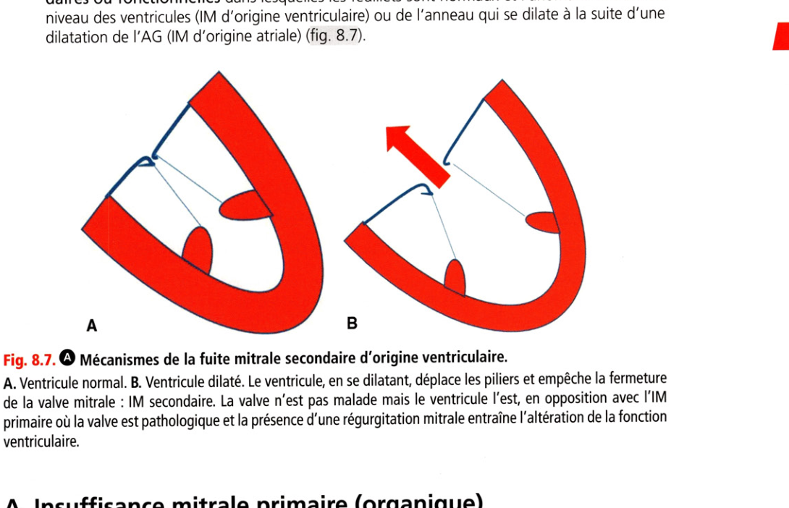
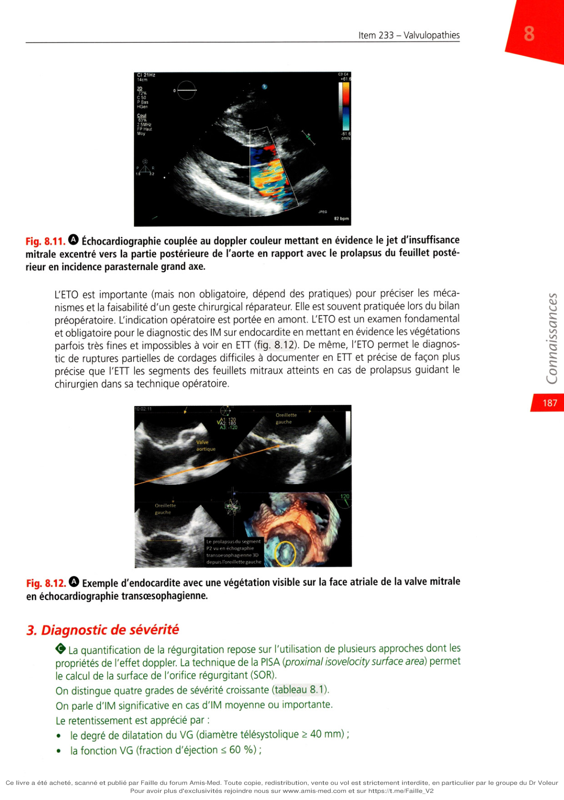
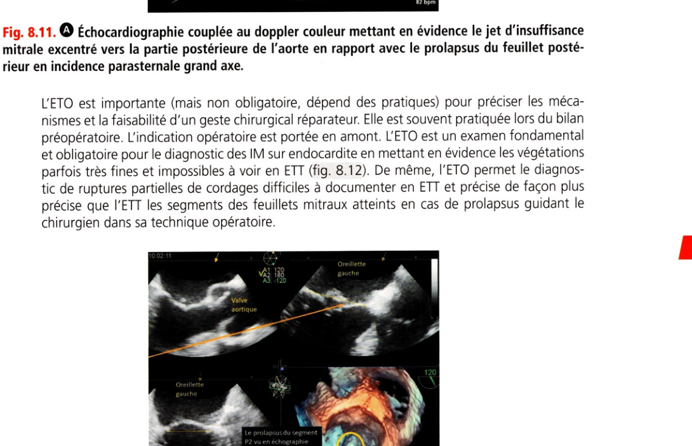
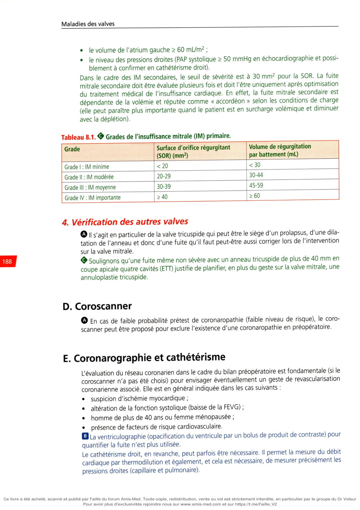

# Item 233 — Insuffisance mitrale

> **Collège CNEC / SFC** · 3e édition (2025) · p. 178–194 · R2C  
> Partie II — Maladies des valves

---

## Trois repères à ne pas confondre

| Badge | Signification (R2C) |
|---|---|
| **Rang A** | Connaissances fondamentales de fin de 2e cycle |
| **Rang B** | Connaissances essentielles, plus spécialisées |
| **Rang C** | Connaissances de 3e cycle (DES) |

Les pastilles du livre (● = A, ■ = B) sont reprises inline.

---

## Situations de départ

18 Découverte d'anomalies à l'auscultation cardiaque..
20 Découverte d'anomalies à l'auscultation pulmonaire..
21 Asthénie..
22 Diminution de la diurèse..
44 Hyperthermie/fièvre..
50 Malaise/perte de connaissance..
160 Détresse respiratoire aiguë..
161 Douleur thoracique..
162 Dyspnée..
165 Palpitations..
166 Tachycardie..
178 Demande/prescription raisonnée et choix d'un examen diagnostique..
185 Réalisation et interprétation d'un électrocardiogramme (ECG)..
190 Hémoculture positive..
203 Élévation de la protéine C-réactive (CRP)..
230 Rédaction de la demande d'un examen d'imagerie..
231 Demande d'un examen d'imagerie..
232 Demande d'explication d'un patient sur le déroulement, les risques et les bénéfices attendus d'un examen d'imagerie..
233 Identifier/reconnaître les différents examens d'imagerie (type/fenêtre/séquences/incidences/injection)..
239 Explication préopératoire et recueil de consentement d'un geste invasif diagnostique ou thérapeutique..
247 Prescription d'une rééducation..
248 Prescription et suivi d'un traitement par anticoagulant et/ou antiagrégant..
253 Prescrire des diurétiques..
255 Prescrire un anti-infectieux..
258 Prévention de la douleur liée aux soins..
259 Évaluation et prise en charge de la douleur aiguë..
271 Prescription et surveillance d'une voie d'abord vasculaire..
279 Consultation de suivi d'une pathologie chronique..
285 Consultation de suivi éducation thérapeutique d'un patient avec antécédents cardiovasculaires..
300 Consultation pré-anesthésique..
311 Prévention des infections liées aux soins..
314 Prévention des risques liés au tabac..
320 Prévention des maladies cardiovasculaires..
324 Modification thérapeutique du mode de vie (sommeil, activité physique, alimentation, etc.)..
328 Annonce d'une maladie chronique..
334 Demande de traitement et investigation inappropriés..
335 Évaluation de l'aptitude au sport et rédaction d'un certificat de non-contre-indication..
339 Prescrire un arrêt de travail..
342 Rédaction d'une ordonnance/d'un courrier médical..
352 Expliquer un traitement au patient (adulte/enfant/adolescent)..
354 Évaluation de l'observance thérapeutique..
355 Organisation de la sortie d'hospitalisation..

---

## Hiérarchisation des connaissances

| Rang | Rubrique | Intitulé | Descriptif |
|---|---|---|---|
| **A** | Définition | Définition IM, RA, IA, RM | |
| **A** | Étiologies | Principales étiologies des valvulopathies (IM, RA, IA, RM) | |
| **A** | Diagnostic positif | Signes fonctionnels et auscultation IM, RA, IA, RM | |
| **A** | Examens complémentaires | Valeur primordiale de l'échocardiographie (IM, IA, RA, RM) | Diagnostic positif, mécanisme, étiologie, sévérité |
| **A** | Physiopathologie | Mécanismes et conséquences IM, IA, RA, RM | |
| **B** | Examens complémentaires | Intérêt ECG, radiographie thoracique, épreuve d'effort | |
| **B** | Suivi et/ou pronostic | Évolutions et complications IM, RA, IA, RM | |
| **B** | Prise en charge | Principes du traitement chirurgical IM, RA, IA, RM | Plastie ou remplacement valvulaire |
| **B** | Prise en charge | Traitements percutanés IM, RA, RM | TAVI ; alternative percutanée IM (MitraClip®) |
| **A** | Prise en charge | Indications chirurgicales IM, RA, RM, IA | |
| **A** | Prise en charge | Indications percutanées RA et IM | |
| **A** | Prise en charge | Modalités du traitement médical de l'IA | Bêtabloquant dans le Marfan |

---

## Parcours Rang A

- [I. Définition](#i-définition)
- [IV. Étiologies](#iv-étiologies)
- [VI. Clinique](#vi-clinique)
- [VII. Examens complémentaires](#vii-examens-complémentaires)
- [IX. Traitement](#ix-traitement)

---

## Sommaire

- [Vignette clinique](#vignette-clinique)
- [I. Définition](#i-définition)
- [II. Rappel anatomique et mécanismes](#ii-rappel-anatomique-et-mécanismes-de-la-fuite)
- [III. Physiopathologie](#iii-physiopathologie)
- [IV. Étiologies](#iv-étiologies)
- [V. Causes des IM aiguës](#v-causes-des-insuffisances-mitrales-aiguës)
- [VI. Clinique](#vi-clinique)
- [VII. Examens complémentaires](#vii-examens-complémentaires)
- [VIII. Évolution et complications](#viii-évolution-naturelle-et-complications)
- [IX. Traitement](#ix-traitement)
- [Points](#points)
- [Notions indispensables et inacceptables](#notions-indispensables-et-inacceptables)
- [Réflexes transversalité](#réflexes-transversalité)
- [Entraînement](../../Entrainement/QI/233_Valvulopathies.md)

---

## Vignette clinique

M. B, 63 ans, est adressé en consultation de cardiologie par son médecin traitant qui a entendu un souffle systolique. Il n'a pas d'antécédent particulier, ne prend aucun traitement et indique se sentir plus essoufflé depuis quelques semaines pour ses sorties à vélo avec des palpitations fréquentes. L’auscultation retrouve un souffle apexien en jet de vapeur, holosystolique avec renforcement télésystolique 3/6 irradiant dans l'aisselle. L'auscultation pulmonaire est normale. L'échocardiographie retrouve une insuffisance mitrale (IM) par prolapsus de valve postérieure (feston P2) par rupture de cordage. Le ventricule gauche est dilaté (diamètre télésystolique à 43 mm), la fraction d'éjection ventriculaire gauche est normale à 65 %, l'atrium gauche est dilaté à 65 mL/m². L'insuffisance mitrale est sévère (surface d'orifice régurgitant mesurée à 50 mm², volume régurgité à 67 mL).

> 

S'agit-il d'une insuffisance mitrale récente ?

> 

Quelles anomalies pourriez-vous retrouver à l'ECG ?

> 

Quels bilans complémentaires envisagez-vous pour ce patient ?

> 

Quel(s) traitement(s) proposez-vous au patient ?

> 

Ce patient est-il à risque d'endocardite infectieuse ?

# I. Définition

**Rang A.**

**Rang A.** L'insuffisance mitrale (IM) est liée à un défaut d'étanchéité de la valve mitrale entraînant

un reflux de sang du ventricule gauche (VG) vers l'atrium gauche (AG) au cours de la systole.

---

# II. Rappel anatomique et mécanismes de la fuite

**Rang A** · **Rang B**.

La valve mitrale comporte deux feuillets (un feuillet antérieur et un feuillet postérieur), qui s'insèrent sur un anneau fibreux et se rejoignent au niveau de deux commissures (antéroexterne et postéro-interne). La valve mitrale est rattachée au VG par des cordages, qui s'insèrent au niveau de deux piliers musculaires faisant partie intégrante du myocarde ventriculaire gauche. Lors de la systole ventriculaire, les deux feuillets (postérieur et antérieur) s'affrontent dans le plan de l'anneau mitral et la valve mitrale est étanche (pas de fuite). La classification des IM initialement proposée par Carpentier (fig. 8.6) tient compte du mouvement et de la position des valves lors de la systole ventriculaire : type I : les valves restent dans le plan de l'anneau lors de la systole ventriculaire et le jeu valvulaire est normal. La fuite est liée soit à la présence d'un « trou » dans la valve comme en cas de perforation ou de fente mitrale, soit à un contact insuffisant entre les deux feuillets comme dans les IM secondaires à la dilatation de l'anneau qui fait suite à une dilatation importante de l'AG (IM atriale), comme ce peut être le cas dans les fibrillations atriales permanentes ; type II : au moins un des deux feuillets dépasse le plan de l'anneau lors de la systole ventriculaire. Le jeu valvulaire est exagéré : c'est typiquement le cas des IM dystrophiques par prolapsus : la coaptation ne se fait plus au niveau du plan de l'anneau mais dans l'atrium gauche ; type III : les valves restent au-dessus du plan de l'anneau lors de la systole ventriculaire (dans le ventricule), le jeu valvulaire est restreint :

-

il peut être restrictif en systole et en diastole (type Ilia) avec limitation de l'ouverture et de la fermeture de la valve : rhumatisme articulaire aigu (RAA), radiothérapie, IM médicamenteuses,

-

il peut être restrictif seulement en systole (type lllb) avec limitation uniquement de la fermeture : IM secondaire liée au remodelage du VG dans les cardiopathies dilatées ou ischémiques chroniques qui entraînent un éloignement des piliers avec traction sur les cordages et par conséquent restriction du jeu valvulaire. 0 Ainsi, l’IM peut être liée à une ou plusieurs anomalies de chacun des constituants de l'appareil valvulaire mitral, soit isolément soit de manière conjointe :

• l'anneau ;

• les feuillets;

• les cordages ;

• les piliers et leur déplacement si le ventricule devient plus sphérique, plus dilaté.

---

# III. Physiopathologie

**Rang A** · **Rang B**.

La régurgitation mitrale entraîne des conséquences en amont et en aval. Le volume régurgité dans l'AG dépend de trois facteurs principaux : la taille de l'orifice régurgitant ; le gradient de pression entre le ventricule gauche et l'atrium gauche ; la durée de la systole. Les conséquences hémodynamiques sont : en aval :

-

surcharge volumique du VG aboutissant à une dilatation de la cavité ventriculaire gauche : en effet, le VG s'adapte car il doit faire face à une augmentation du volume diastolique (il reçoit beaucoup de sang de l'AG qui arrive à la fois des veines pulmonaires mais aussi de la régurgitation lors de la systole précédente),

-

augmentation de l'épaisseur des parois du VG pour lutter contre l'accroissement du stress pariétal lié à la dilatation, aboutissant à une hypertrophie excentrique. Celle-ci finit par être insuffisante quand le ventricule devient trop sphérique, ce qui entraîne une dysfonction ventriculaire avec apparition d'une fibrose myocardique et potentiel de récupération réduit. Noter que la fraction d'éjection du VG est surestimée dans l'IM car le VG est déchargé. En effet, il éjecte moins de sang que ce qu'il devrait dans l'aorte car une proportion plus ou moins importante de sang va dans l'atrium gauche. Ainsi, on parle de dysfonction à moins de 60 % de fraction d'éjection ; La correction de l'IM est recommandée chez un patient (même) asymptomatique dont le diamètre télésystolique du ventricule gauche est > 40 mm et/ou la fraction d'éjection < 60 %. en amont :

-

dilatation de l'atrium gauche en raison de la régurgitation avec risque de fibrillation atriale.

-

hypertension pulmonaire (HTP) post-capillaire par élévation de la pression de l'atrium gauche et reflux dans les veines pulmonaires (au cathétérisme : pression artérielle pulmonaire d'occlusion (PAPO) > 15 mmHg et présence d'une onde V de reflux de la fuite dans les veines pulmonaires),

-

l'HTP est fonction du volume régurgité, de la compliance de l'atrium gauche et des veines pulmonaires. En effet, dans l'IM primaire (organique) chronique, il existe fréquemment une dilatation de l'AG qui permet de maintenir la pression intra-atriale pratiquement normale malgré un volume régurgité parfois important et donc une pression artérielle pulmonaire (PAP) normale ou peu élevée. Cependant, la dilatation de l'AG peut favoriser la survenue de trouble du rythme atrial. Lorsque le volume régurgité devient trop important et que la compliance de l'AG ne peut plus augmenter, la pression dans l'AG et les vaisseaux pulmonaires augmente (HTP),

-

en cas d'IM aiguë : la régurgitation aiguë de sang dans un AG qui n'a pas eu le temps de se dilater avec une compliance d'emblée inadaptée a pour conséquence une HTP immédiatement importante.

---

# IV. Étiologies

**Rang A** · **Rang B**.

**Rang A.** On distingue aujourd'hui les IM primaires, primitives ou organiques dans lesquelles

l'anomalie initiale se situe au niveau des feuillets valvulaires ou des cordages, des IM secondaires ou fonctionnelles dans lesquelles les feuillets sont normaux et l'anomalie se situe au niveau des ventricules (IM d'origine ventriculaire) ou de l'anneau qui se dilate à la suite d'une dilatation de l'AG (IM d'origine atriale) (fig. 8.7). J 181

**Fig. 8.7.** Mécanismes de la fuite mitrale secondaire d'origine ventriculaire.

A. Ventricule normal. B. Ventricule dilaté. Le ventricule, en se dilatant, déplace les piliers et empêche la fermeture de la valve mitrale : IM secondaire. La valve n'est pas malade mais le ventricule l'est, en opposition avec l'IM primaire où la valve est pathologique et la présence d'une régurgitation mitrale entraîne l'altération de la fonction ventriculaire.

## A. Insuffisance mitrale primaire (organique)

avec excès de jeu valvulaire (type II de Carpentier) L'IM dystrophique est l'étiologie la plus fréquente des fuites mitrales sévères. Il s'agit d'une insuffisance mitrale primaire. L'IM dystrophique correspond au type II de Carpentier, caractérisé par des élongations ou des ruptures de cordages, associées ou non à un excès de tissu valvulaire avec ballonnisation, responsables d'un prolapsus valvulaire mitral. Une ballonnisation est définie comme un bombement d'un feuillet valvulaire trop ample en systole dans l'AG alors que son bord libre (extrémité) reste dans le plan de l'anneau. Le prolapsus survient quand une partie plus ou moins étendue de l'extrémité du feuillet passe en arrière du plan de l'anneau. L'anomalie peut prédominer sur la valve postérieure (ou petite valve), sur la valve antérieure (ou grande valve) ou les deux. On distingue deux groupes de lésions, bien que cette distinction soit parfois artificielle : les « dégénérescences myxoïdes » (maladie de Barlow). Il y a un excès de tissu, les valves sont le plus souvent redondantes, épaissies. Ceci conduit à un excès de mobilité avec prolapsus. La traction exercée sur les cordages peut conduire à des ruptures ; les dégénérescences fibroélastiques, plus fréquentes. Elles surviennent chez les sujets plus âgés, plus souvent les hommes, et intéressent en particulier la valve postérieure. À l'inverse du groupe précédent, la quantité de tissu valvulaire est adaptée à la taille de l'orifice (pas d'excès notable). Le mécanisme essentiel de la fuite est une rupture de cordages.

**Rang B.** Les IM dystrophiques peuvent parfois se rencontrer dans le cadre d'une maladie de Marfan

ou d'Ehlers-Danlos.

## B. Insuffisance mitrale secondaire (fonctionnelle)

par limitation du jeu valvulaire en systole (type lllb de Carpentier)

**Rang A.** Ce terme regroupe les insuffisances mitrales d'origine ischémique, classiquement après

un infarctus inférieur avec un trouble séquellaire de la cinétique de la paroi inférieure, et les insuffisances mitrales par dilatation et dysfonction du ventricule gauche quelle qu'en soit la cause (cf. fig. 8.7).

## C. Insuffisance mitrale primaire rhumatismale et apparentées

(restriction systolodiastolique, type Ilia de Carpentier) Elle est devenue rare dans les pays développés depuis la prévention du rhumatisme articulaire aigu mais reste endémique dans les pays en développement. Elle est le plus souvent associée à un rétrécissement mitral et à une atteinte de la valve aortique. Les valves sont épaissies, rétractées. L'appareil sous-valvulaire est remanié, les cordages raccourcis. Des ruptures de cordages sont possibles. Il s'agit d'IM « restrictive », de type III de Carpentier. L'association d'une sténose et d'une insuffisance mitrale est désignée sous le terme de « maladie mitrale ». Pour les IM apparentées, il peut s'agir : de lésions très proches du rhumatisme articulaire aigu dans le cas des IM médicamenteuses : dérivés de l'ergot de seigle, anorexigènes (fenfluramine, benfluorex, retirés du marché) ; d'IM secondaires aux lésions induites par la radiothérapie (lésions chroniques).

## D. Insuffisance mitrale atriale, par dilatation de l'anneau

(type I de Carpentier) Il s'agit d'une IM secondaire de mécanisme différent (dilatation de l'anneau sans atteinte des feuillets) Elle est plus rare, liée à une dilatation de l'anneau sur des atriums très dilatés.

## E. Insuffisance mitrale sur endocardite

Elle survient dans plus de la moitié des cas sur une lésion préexistante, prolapsus valvulaire mitral ou IM d'une autre étiologie. Les lésions sont végétantes (présence de végétations) et mutilantes (destruction du feuillet). L'insuffisance mitrale est le plus souvent en rapport avec des ruptures de cordages (type II de Carpentier) ou des perforations ou déchirures valvulaires (type I de Carpentier), surtout de la valve antérieure.

## F. Autres causes

Il peut s'agir : d'IM ischémique aiguë par dysfonction ou rupture de pilier mitral (cf. chapitre 5), rupture (totale ou partielle) de pilier mitral entraînant un choc, une régurgitation très sévère et constituant une urgence chirurgicale le plus souvent ; de cardiomyopathie hypertrophique (CMH) avec obstruction : le feuillet antérieur est « aspiré » dans la chambre de chasse du ventricule gauche en systole (SAM : mouvement systolique antérieur de la valve mitrale). Il y a de fait un défaut de coaptation de la valve mitrale et une fuite qui peut être sévère ; d'une origine congénitale par « fente » de la valve antérieure mitrale ou dans le cadre d'un canal atrioventriculaire ; d'une origine traumatique, consécutive à un traumatisme fermé du thorax (très rare) ; de dystrophies conjonctivoélastiques (syndrome de Marfan, syndrome d'Ehlers-Danlos, pseudoxanthome élastique, etc.) : donnant des fuites dystrophiques avec prolapsus ; de maladies auto-immunes comme un lupus souvent avec syndrome des antiphospholipides ; de calcifications de l'anneau mitral, d'origine dégénérative.

---

# V. Causes des insuffisances mitrales aiguës

**Rang A** · **Rang B**.

Les insuffisances mitrales aiguës peuvent survenir par : rupture de cordages en cas :

-

de dégénérescence myxoïde ou fibroélastique,

-

d'endocardite,

-

de traumatisme thoracique ; On peut rencontrer là un œdème pulmonaire unilatéral avec une régurgitation sévère « directionnelle » n'allant que dans les veines pulmonaires d'un seul poumon. rupture de pilier, restriction aiguë sur akinésie segmentaire, dysfonction ischémique de pilier dans un contexte d'infarctus du myocarde ; traumatisme thoracique ; perforation par endocardite. La régurgitation mitrale aiguë est le plus souvent responsable d'un tableau hémodynamique grave justifiant une prise en charge en urgence (urgence vitale).

---

# VI. Clinique

**Rang A** · **Rang B**.

## A. Circonstances de découverte

Ce sont : la découverte d'un souffle à l'occasion d'une visite systématique ; des signes fonctionnels : palpitations, dyspnée d'effort ou asthénie d'effort ; une complication, par exemple : œdème aigu du poumon ou fibrillation atriale ; une fièvre prolongée (en cas d'endocardite).

## B. Signes fonctionnels

Ils sont absents en cas d'IM modérée, mais un patient avec IM sévère peut parfois être asymptomatique. Une dyspnée d'effort s'installe souvent lentement et progressivement dans l'IM chronique. Il faut savoir rechercher cette dyspnée et cette altération des performances physiques au fil du temps, parfois associée à une asthénie d'effort. Puis tardivement, on peut observer dyspnée de repos, palpitations, orthopnée, dyspnée paroxystique nocturne. L'OAP fait partie des signes fonctionnels de l'IM. Mais c'est un signe tardif et de gravité.

## C. Examen clinique

### 1. Palpation

Elle retrouve : un frémissement systolique à l'apex ; une déviation et un abaissement du choc de pointe en cas de dilatation du VG.

### 2. Auscultation

Elle met en évidence un souffle holosystolique de régurgitation, débutant dès B1 et se poursuivant jusqu'à B2 qu'il peut dépasser (fig. 8.8) : maximum à la pointe ou de siège apexoaxillaire (foyer mitral) ; de timbre en « jet de vapeur », doux, parfois rude ; d'intensité variable (souvent proportionnelle à la sévérité mais pas toujours) ; avec irradiation, le plus souvent vers l'aisselle sauf dans le prolapsus du feuillet postérieur où elle peut se faire vers la base du cœur (foyer aortique) en raison d'un jet orienté vers le septum interauriculaire et la partie postérieure de l'aorte ; ne se renforçant pas après une diastole longue. Dans le prolapsus, ce souffle débute parfois après B1 par un clic mésosystolique (mise en tension des cordages), et il est donc mésotélésystolique ou télésystolique. Les autres signes suivants peuvent être présents si l'IM est importante : galop protodiastolique (B3) ; roulement mésodiastolique (lié à l'hyperdébit en diastole mimant un rétrécissement mitral) ; éclat de B2 au foyer pulmonaire en cas d'HTP ; souffle d'insuffisance tricuspidienne fonctionnelle possible en cas d'IM évoluée avec HTP et retentissement important sur les cavités droites. L'auscultation pulmonaire peut retrouver des râles crépitants d'insuffisance cardiaque gauche. Le souffle des IM secondaires est souvent très discret et même quelquefois inaudible, et très mal corrélé à la sévérité de la fuite.

---

# VII. Examens complémentaires

**Rang A** · **Rang B**.

## A. ECG

fl II reste longtemps normal dans les IM mais peut objectiver : une hypertrophie atriale gauche ; une hypertrophie ventriculaire gauche ; une fibrillation atriale ; une hypertrophie ventriculaire droite des IM évoluées avec HTP sévère.

## B. Radiographie thoracique

Normale dans les IM minimes ou modérées, elle permet d'observer : une cardiomégalie par dilatation du VG dans les IM plus importantes ; une dilatation de l'AG (arc moyen gauche convexe, débord arc inférieur droit) ; des signes d'HTP et d'insuffisance cardiaque en cas d'IM chronique évoluée ou aiguë :

-

dilatation des artères pulmonaires,

-

redistribution vasculaire vers les sommets,

-

lignes de Kerley,

-

œdème alvéolaire.

## C. Échocardiographie doppler

• **Rang A.** L'échocardiographie doppler transthoracique (ETT) est l'examen clé pour :

-

le diagnostic positif ;

-

le diagnostic étiologique ;

-

le diagnostic de sévérité : quantification de la fuite et appréciation de son retentissement d'amont et d'aval. L'échocardiographie transœsophagienne complète l'étude des mécanismes et étiologies et aide à planifier un éventuel geste de réparation valvulaire (plastie mitrale).

### 1. Diagnostic positif

La fuite est confirmée par un signal doppler holosystolique en arrière du plancher mitral enregistré en doppler pulsé, continu et couleur (fig. 8.9). Cl 12H 18cm Zfi 69% C 50 P 81$ HGer Çoyl 76% 2 5MHz FPHiue Mov

### 2. Diagnostic étiologique

L'échocardiographie doppler permet de préciser le mécanisme (selon la classification de Carpentier) (fig. 8.10 et 8.1 1). cTCüHz 14cm 2D 68% C50 P 81$ HGen © « Dist 0.468 cm

**Fig. 8.10.** Échocardiographie bidimensionnelle d'un prolapsus du feuillet postérieur avec probable

rupture de cordage en incidence parasternale grand axe. 2 5MHz FPHaut Moy

**Fig. 8.11.** Échocardiographie couplée au doppler couleur mettant en évidence le jet d'insuffisance

mitrale excentré vers la partie postérieure de l'aorte en rapport avec le prolapsus du feuillet postérieur en incidence parasternale grand axe. L'ETO est importante (mais non obligatoire, dépend des pratiques) pour préciser les mécanismes et la faisabilité d'un geste chirurgical réparateur. Elle est souvent pratiquée lors du bilan préopératoire. L'indication opératoire est portée en amont. L'ETO est un examen fondamental et obligatoire pour le diagnostic des IM sur endocardite en mettant en évidence les végétations parfois très fines et impossibles à voir en ETT (fig. 8.12). De même, l'ETO permet le diagnostic de ruptures partielles de cordages difficiles à documenter en ETT et précise de façon plus précise que l'ETT les segments des feuillets mitraux atteints en cas de prolapsus guidant le chirurgien dans sa technique opératoire. J 187 Oreillette gauche Æli8 A3 120 Valve aortique 120\ Oreillette gauche V ■ Le prolapsusdu segment P2 vu en échographie transoesophagienne 3D depuis l'oreillette gauche

**Fig. 8.12.** Exemple d'endocardite avec une végétation visible sur la face atriale de la valve mitrale

en échocardiographie transœsophagienne.

### 3. Diagnostic de sévérité

propriétés de l'effet doppler. La technique de la PISA {proximal isovelocity surface area) permet le calcul de la surface de l'orifice régurgitant (SOR). On distingue quatre grades de sévérité croissante (tableau 8.1). On parle d'IM significative en cas d'IM moyenne ou importante. Le retentissement est apprécié par : le degré de dilatation du VG (diamètre télésystolique > 40 mm) ; la fonction VG (fraction d'éjection < 60 %) ; le volume de l'atrium gauche ≤ 60 mL/m2 ; le niveau des pressions droites (PAP systolique s 50 mmHg en échocardiographie et possiblement à confirmer en cathétérisme droit). Dans le cadre des IM secondaires, le seuil de sévérité est à 30 mm² pour la SOR. La fuite mitrale secondaire doit être évaluée plusieurs fois et doit l'être uniquement après optimisation du traitement médical de l'insuffisance cardiaque. En effet, la fuite mitrale secondaire est dépendante de la volémie et réputée comme « accordéon » selon les conditions de charge (elle peut paraître plus importante quand le patient est en surcharge volémique et diminuer avec la déplétion). Tableau 8.1. 0 Grades de l'insuffisance mitrale (IM) primaire. Grade Surface d'orifice régurgitant (SOR) (mm2) Volume de régurgitation par battement (mL) Grade I : IM minime <20 <30 Grade II : IM modérée 20-29 30-44 Grade III : IM moyenne 30-39 45-59 Grade IV : IM importante

### 4. Vérification des autres valves

**Rang A.** II s'agit en particulier de la valve tricuspide qui peut être le siège d'un prolapsus, d'une dilatation de l'anneau et donc d'une fuite qu'il faut peut-être aussi corriger lors de l'intervention

sur la valve mitrale. Soulignons qu'une fuite même non sévère avec un anneau tricuspide de plus de 40 mm en coupe apicale quatre cavités (ETT) justifie de planifier, en plus du geste sur la valve mitrale, une annuloplastie tricuspide.

## D. Coroscanner

**Rang A.** En cas de faible probabilité prétest de coronaropathie (faible niveau de risque), le coroscanner peut être proposé pour exclure l'existence d'une coronaropathie en préopératoire.

## E. Coronarographie et cathétérisme

L'évaluation du réseau coronarien dans le cadre du bilan préopératoire est fondamentale (si le coroscanner n'a pas été choisi) pour envisager éventuellement un geste de revascularisation coronarienne associé. Elle est en général indiquée dans les cas suivants : suspicion d'ischémie myocardique ; altération de la fonction systolique (baisse de la FEVG) ; homme de plus de 40 ans ou femme ménopausée ; présence de facteurs de risque cardiovasculaire. 0La ventriculographie (opacification du ventricule par un bolus de produit de contraste) pour quantifier la fuite n'est plus utilisée. Le cathétérisme droit, en revanche, peut parfois être nécessaire. Il permet la mesure du débit cardiaque par thermodilution et également, et cela est nécessaire, de mesurer précisément les pressions droites (capillaire et pulmonaire).

## F. Épreuve d'effort classique ou avec mesure

de la consommation d'oxygène (épreuve d'effort cardiorespiratoire) et échocardiographie d'effort Les indications de ces deux examens dynamiques ne sont pas encore bien précisées dans l'évaluation de l'IM. Leur principal intérêt est de démasquer des symptômes et de les comprendre chez des patients qui se disent asymptomatiques. La VO2 permet de mieux apprécier la capacité à l'effort du patient. L'échocardiographie d'effort permet d'apprécier la fuite à l'effort, son éventuelle augmentation, et son retentissement notamment sur les pressions pulmonaires.

---

# VIII. Évolution naturelle et complications

**Rang A** · **Rang B**.

## A. Évolution naturelle

**Rang A.** Elle est fonction :

de la sévérité de la fuite ; de l'étiologie ; de la rapidité de constitution de l'IM ; de la fonction ventriculaire ; des lésions associées, en particulier de l'existence d'une coronaropathie. D'une manière générale, les IM constituées progressivement sont bien tolérées pendant longtemps et les signes d'insuffisance cardiaque apparaissent tardivement. Il faut donc souligner l'importance d'un suivi régulier d'un patient porteur d'une IM significative, même asymptomatique, avec la réalisation d'une ETT annuelle. Au contraire, les IM d'installation brutale (rupture de cordages, endocardite, IM sur infarctus) sont en général mal tolérées et peuvent se compliquer rapidement d'un œdème du poumon.

## B. Complications

Il peut s'agir : de rupture de cordage en cas d'IM dystrophique par prolapsus, parfois dans d'autres étiologies (RAA, CMH) ; d'endocardite infectieuse, entraînant souvent une aggravation de la fuite ; de troubles du rythme :

-

fibrillation atriale ou flutter atrial : leur apparition peut entraîner une décompensation cardiaque. Ils sont favorisés par la dilatation de l'AG et justifient une chirurgie précoce chez le patient asymptomatique,

-

troubles du rythme ventriculaire, plus rares, traduisant en général une détérioration de la fonction ventriculaire ; 0 II peut aussi y avoir des troubles du rythme ventriculaire associés aux prolapsus mitraux même en l'absence de fuite sévère lorsqu'il y a une anomalie anatomique marquée avec ce que l'on appelle une disjonction annulaire qui est classiquement retrouvée chez la femme jeune ayant des extrasystoles et des ondes T négatives dans le précordium à l'ECG. Exceptionnellement, ce type de prolapsus mitral peut être une cause de mort subite.

• **Rang A.** d'insuffisance cardiaque :

-

d'apparition généralement tardive dans les IM chroniques,

-

pouvant survenir rapidement en cas d'IM aiguë,

-

pouvant être favorisée par un trouble du rythme.

---

# IX. Traitement

**Rang A** · **Rang B**.

## A. Surveillance

**Rang B.** Elle concerne l'IM minime ou modérée (grade I ou II). Elle consiste en :

une réévaluation clinique et échocardiographique régulière ; la prévention (oslérienne) de l'endocardite par une bonne hygiène cutanée et des soins dentaires réguliers essentiellement (pas d'antibioprophylaxie recommandée). ictionnelle, c'est

## B. Traitement médical

tptomatologi' Si la fuite mitrale est importante et responsable d' qu'il est urgent de penser à I4 chirurgie. Le traitement de l'IM secondaire repose d'aborr diaque (médicaments, resynchronisation sjwlS I plutôt percutané ) doit être discutée en cas d'écf tement de I insuffisance carinterVention (chirurgicale ou i mitrale primaire, cependant : ite classiquement (diurétique-vaso-

-

en cas de poussée d'insuffis< dilatateurs -

-

en-cas d'IM aiguë, o

-

une anticoagulatia

-

des bêtabloquants s< dissection aorjrgue). it prescrit: choc, et on discute de la chirurgie en urgence ; efpcas de fibrillation atriale ; de maladie de Marfan (pour réduire le risque de 'e (réparation mitrale) = traitement chirurgical

### 1. Plastie reconstn

« idéal » Elle respecte l'appareil sous-valvulaire et entraîne moins de dysfonctions VG postopératoires qu'un remplacement valvulaire. Elle est associée à une moindre morbimortalité à long terme que le remplacement prothétique. Elle expose à un moindre risque d'endocardite infectieuse.

• Indiquée dans les prolapsus avec ou sans rupture de cordages, son résultat à long terme

est bon. Elle est possible mais difficile dans certains cas d'IM post-rhumatismale si la valve n'est pas trop remaniée et dans certains cas d'IM ischémique, mais il existe un risque de récidive de l'IM à moyen et long terme. Ce geste nécessite une expérience importante du chirurgien. La plastie reconstructrice n'est pas possible dans tous les cas d'IM.

### 2. Remplacement valvulaire

En l'absence de possibilité de plastie reconstructrice, c'est-à-dire en cas de valve et appareil sous-valvulaire trop remaniés, il se fait par : prothèse mécanique :

-

imposant un traitement anticoagulant,

-

sa durée de vie est longue,

-

souvent préférée chez un patient jeune ou en cas de nécessité par ailleurs d'un traitement anticoagulant, par exemple si une fibrillation atriale est associée ; prothèse biologique (bioprothèse) :

-

ne nécessitant pas un traitement anticoagulant au long cours,

-

associée à des risques de dégénérescence à terme,

-

indiquée chez les patients plus âgés et en cas de contre-indication aux anticoagulants ou de désir de grossesse chez une femme en âge de procréer. Le choix entre prothèses mécanique et biologique dépend essentiellement de l'âge du patient, du rythme (sinusal, FA, etc.), de sa préférence et du risque du traitement anticoagulant. Après 70 ans, on s'oriente le plus souvent vers une bioprothèse, et avant 65 ans vers une prothèse mécanique.

### 3. Traitement percutané

0 Des techniques de cardiologie interventionnelle permettent de réaliser une correction de la fuite mitrale par voie percutanée, en rapprochant grâce à un clip les feuillets mitraux antérieur et postérieur (recommandations ESC 2021). Des registres et des études randomisées récentes ont permis de déterminer les bénéfices et limites de tels systèmes en cas d'IM primaires et secondaires. Ces techniques se discutent uniquement en cas de haut risque ou de contreindication à la chirurgie.

### 4. Bilan préopératoire

• **Rang A.** II doit permettre d'évaluer le risque opératoire.

Il comporte en général :

-

imagerie des coronaires (coronarographie ou coroscanner) ;

-

échodoppler des troncs supra-aortiques ;

-

recherche de foyers infectieux de la sphère ORL ou stomatologique avec radiographie des sinus et panoramique dentaire ;

-

recherche de comorbidités (fonction rénale, pathologie pulmonaire, etc.) ;

-

avis gériatrique chez le sujet très âgé pour bien peser le rapport risque/bénéfice de la procédure.

## D. « Cliniques des valves » et Heart Team

0 Pour les IM primaires, comme les IM secondaires, il existe des systèmes de réparation bord à bord percutanée, ainsi que de nouvelles prothèses implantables par voie percutanée en cours de validation. Ces différentes options thérapeutiques pour un même patient justifient le concept de : clinique des valves regroupant les expertises, cliniques, d'imagerie, de chirurgie, d'anesthésie, de cathétérisme interventionnel ; la discussion collégiale pour proposer, à chaque patient, le choix de la meilleure stratégie selon l'expertise de chaque centre. Les recommandations actuelles insistent sur la nécessité d'adresser les patients à une équipe pluridisciplinaire avec des compétences propres pour prendre les meilleures décisions (niveau 1 des recommandations ESC 2021).

## E. Indications thérapeutiques

• 0 Une IM aiguë mal tolérée requiert une chirurgie urgente.

Le traitement d'une IM chronique primaire significative (grade III ou IV) chez un patient symptomatique repose sur la chirurgie en privilégiant si possible la plastie reconstructrice. Une plastie reconstructrice peut toujours être envisagée même en cas de dysfonction VG. Si la plastie n'est pas réalisable :

-

on effectue un remplacement valvulaire en cas de fraction d'éjection (FE) > 30 % ; en cas de FE < 30 %, le remplacement valvulaire devient contre-indiqué (la FE baisse d'en moyenne 10-15 % en postopératoire, entraînant un risque de dysfonction VG sévère), il faut alors en rester au traitement médical ou, si le patient est encore relativement jeune, discuter une transplantation cardiaque ;

-

le traitement percutané par réparation bord à bord peut être envisagé en cas d'insuffisance mitrale dystrophique chez les patients symptomatiques qui remplissent les critères précis échocardiographiques d'éligibilité et jugés inopérables, ou à haut risque chirurgical par l'équipe multidisciplinaire et pour lesquels la procédure n'est pas considérée comme futile ;

-

la persistance d'une IM fonctionnelle importante secondaire à l'insuffisance cardiaque malgré un traitement optimal est associée à une surmortalité, des hospitalisations plus fréquentes et des symptômes plus marqués. Sur la base de critères échocardiographiques précis et d'une discussion multidisciplinaire, il est possible de proposer un traitement percutané de l'IM par clip si l'insuffisance cardiaque n'est pas trop avancée.

• 0 Le traitement d'une IM chronique primaire importante (grade III ou IV) chez un patient

asymptomatique repose sur :

-

la chirurgie en privilégiant si possible la plastie reconstructrice si l'IM retentit sur le VG avec au moins un des signes suivants :

-

diamètre télésystolique (DTS) du VG > 40 mm et rupture de cordage,

-

FEVG < 60 %,

-

élévation des pressions droites au repos (PAP systolique > 50 mmHg),

-

fibrillation atriale associée (même paroxystique) ou dilatation importante de l'AG (> 60 mL/m²) en rythme sinusal ;

-

le plus souvent, une surveillance avec échographie doppler tous les 6 mois dans les autres cas, et la chirurgie en cas d'apparition :

-

d'un retentissement de l'IM (FE < 60 %, DTS ≥ 40mmn, volume indexé de l'atrium gauche > 60 mL/m²) d'un examen échocardiographique à l'autre,

-

de symptômes (dyspnée d'effort),

-

de trouble du rythme supraventriculaire (FA).

**Rang A.** L'IM est caractérisée à l'auscultation par un souffle apexoaxillaire, holosystolique de régurgitation

débutant dès B1, ou par un souffle mésosystolique ou télésystolique précédé par un clic en cas de prolapsus. 0 L'ECG et la radiographie thoracique sont d'un intérêt limité, n'objectivant pas de signes « spécifiques » d'IM. Des anomalies sont détectables en cas de dilatations des cavités (AG, VG). Des signes de retentissement sont observables au niveau de la circulation pulmonaire (HTP).

**Rang A.** L'examen clé est l'échocardiographie doppler par voie transthoracique complétée si besoin par une

échocardiographie par voie transœsophagienne qui :

- confirme le diagnostic d'IM et en précise le mécanisme ;

- quantifie son degré de sévérité (mesures précises du volume régurgité et de la surface de l'orifice

régurgitant) ;

- évalue la fonction VG et les autres valves.

• L’ETO est importante dans l'évaluation de l'IM (mécanisme de l'IM, végétations, ruptures de cordages,

quantification) et l'appréciation de la faisabilité d'une plastie chirurgicale quand la voie transthoracique ne répond pas à toutes les questions.

• Autrefois examen de référence, le cathétérisme présente un intérêt limité dont les mesures peuvent être

obtenues par l'échocardiographie doppler. Son seul intérêt repose sur la coronarographie avant l'intervention chirurgicale chez les patients ayant un angor d'effort ou des facteurs de risque de la maladie coronarienne, ou systématiquement chez les patients âgés.

• 0 Le traitement de l'IM primaire repose sur :

- la réparation valvulaire chirurgicale, technique de référence lorsqu'elle est possible. Réalisable surtout dans les IM sur prolapsus, elle entraîne moins de dysfonctions VG après l'intervention et une

moindre morbimortalité à long terme. Les anticoagulants ne sont pas nécessaires au long cours. Il y a en revanche un léger risque de récidive de l'IM à long terme ;

- le remplacement valvulaire mitral par mise en place soit d’une bioprothèse (intérêt : pas de traitement

anticoagulant ; inconvénients : risque de dégénérescence à long terme de la prothèse ; indiquée par conséquent plutôt chez le patient âgé > 70 ans), soit d'une prothèse mécanique (intérêt : pas de dégénérescence ; inconvénients : anticoagulants par AVK à vie ; plutôt < 65 ans) ;

- le traitement percutané, avec le développement en particulier de la suture bord à bord percutanée

(clip), proposé aux patients à haut risque dans les centres expérimentés ayant une clinique des valves et une équipe pluridisciplinaire médicochirurgicale.

• La stratégie thérapeutique est la suivante :

- non-intervention en cas d'IM isolée de grade l-ll ;

- surveillance clinique et échocardiographique tous les 6 mois dans les autres cas ;

- indication chirurgicale en cas d'IM primaire importante de grade III ou IV symptomatique en privilégiant la plastie reconstructrice si possible. Le remplacement valvulaire (prothèse mécanique ou

biologique) n'est pas envisageable si la FE est < 30 %, contrairement à la plastie reconstructrice ;

- chez un patient asymptomatique, intervention chirurgicale en cas de dilatation du VG (DTS ventriculaire ≥ 40 mm) et/ou fraction d’éjection ≤ 60 % et/ou élévation de la PAP ≥ 50 mmHg et/ou

fibrillation atriale associée.

• Le traitement de l'IM secondaire repose d'abord sur le traitement de l'insuffisance cardiaque (médicaments, resynchronisation si QRS larges). La chirurgie est discutée en cas d'échec.
---

## Notions indispensables et inacceptables

### Notions indispensables

• **Rang A.** On opère les patients symptomatiques ayant une IM importante (grade III ou IV).
• On peut opérer les patients asymptomatiques ayant une IM importante quand il existe des signes
• échocardiographiques de mauvaise tolérance ou une fibrillation atriale.
• La chirurgie de réparation valvulaire doit être privilégiée dans les prolapsus.
• Ne pas oublier la coronarographie dans le bilan préopératoire.

### Notions inacceptables

• Oublier l'éducation thérapeutique du patient connu pour une IM concernant la prévention de l'endo-
• cardite infectieuse et, le cas échéant, une consultation urgente si apparaissent des symptômes à
• l'effort.
• Ne pas penser à une endocardite infectieuse en cas de fièvre.
• Ne pas référer à un spécialiste un patient porteur d'une IM symptomatique.
• Ne pas référer à un spécialiste un patient d'une IM avec un souffle modifié, ou des symptômes nouveaux.
• Ne pas référer à un spécialiste un patient porteur d’une IM pour son suivi annuel.

---

## Réflexes transversalité

• Item 152 - Endocardite infectieuse
• Item 153 - Surveillance des porteurs de valves et prothèses vasculaires

---

## Entraînement

Questions isolées et corrigés : [Entrainement/QI/233_Valvulopathies.md](../../Entrainement/QI/233_Valvulopathies.md)
