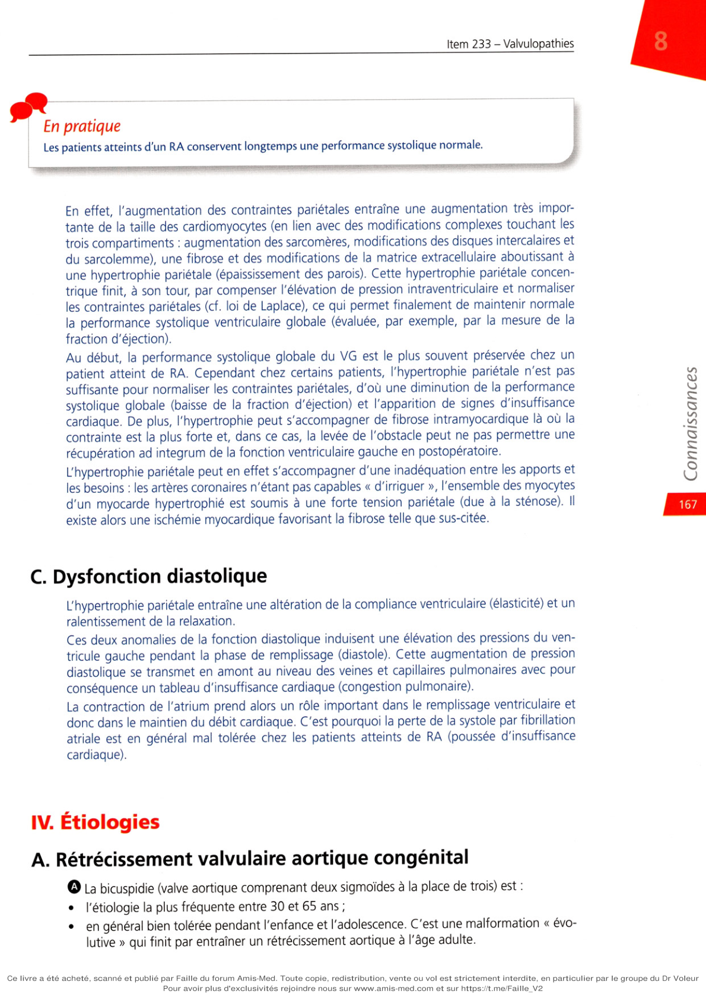
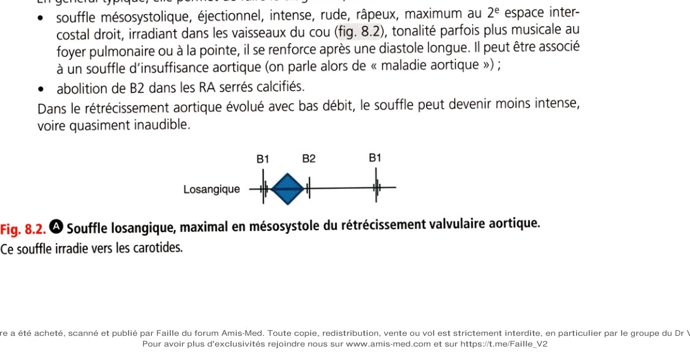
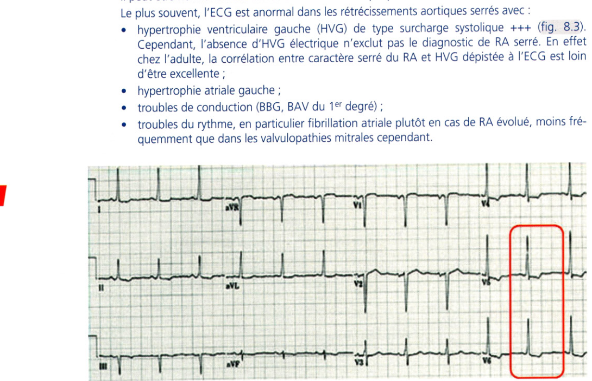
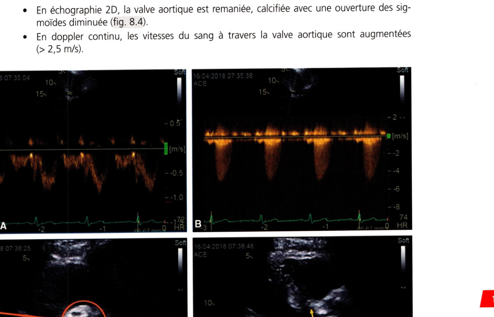
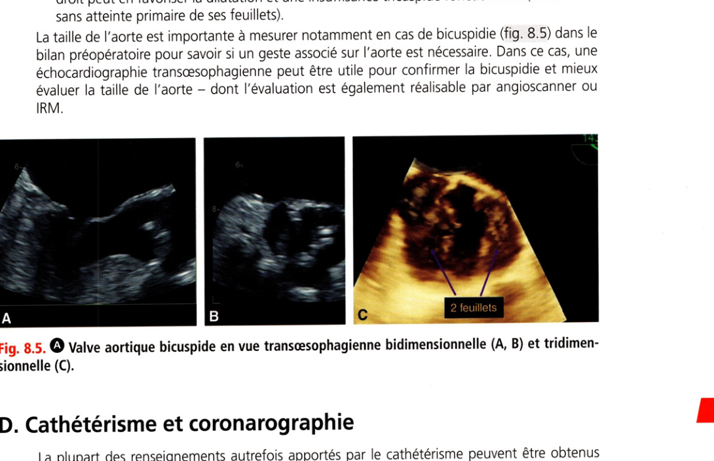

# Item 233 — Rétrécissement aortique

> **Collège CNEC / SFC** · 3e édition (2025) · p. 164–178 · R2C  
> Partie II — Maladies des valves

---

## Trois repères à ne pas confondre

| Badge | Signification (R2C) |
|---|---|
| **Rang A** | Connaissances fondamentales de fin de 2e cycle |
| **Rang B** | Connaissances essentielles, plus spécialisées |
| **Rang C** | Connaissances de 3e cycle (DES) |

Les pastilles du livre (● = A, ■ = B) sont reprises inline.

---

## Situations de départ

18 Découverte d'anomalies à l'auscultation cardiaque..
20 Découverte d'anomalies à l'auscultation pulmonaire..
21 Asthénie..
22 Diminution de la diurèse..
44 Hyperthermie/fièvre..
50 Malaise/perte de connaissance..
160 Détresse respiratoire aiguë..
161 Douleur thoracique..
162 Dyspnée..
165 Palpitations..
166 Tachycardie..
178 Demande/prescription raisonnée et choix d'un examen diagnostique..
185 Réalisation et interprétation d'un électrocardiogramme (ECG)..
190 Hémoculture positive..
203 Élévation de la protéine C-réactive (CRP)..
230 Rédaction de la demande d'un examen d'imagerie..
231 Demande d'un examen d'imagerie..
232 Demande d'explication d'un patient sur le déroulement, les risques et les bénéfices attendus d'un examen d'imagerie..
233 Identifier/reconnaître les différents examens d'imagerie (type/fenêtre/séquences/incidences/injection)..
239 Explication préopératoire et recueil de consentement d'un geste invasif diagnostique ou thérapeutique..
247 Prescription d'une rééducation..
248 Prescription et suivi d'un traitement par anticoagulant et/ou antiagrégant..
253 Prescrire des diurétiques..
255 Prescrire un anti-infectieux..
258 Prévention de la douleur liée aux soins..
259 Évaluation et prise en charge de la douleur aiguë..
271 Prescription et surveillance d'une voie d'abord vasculaire..
279 Consultation de suivi d'une pathologie chronique..
285 Consultation de suivi éducation thérapeutique d'un patient avec antécédents cardiovasculaires..
300 Consultation pré-anesthésique..
311 Prévention des infections liées aux soins..
314 Prévention des risques liés au tabac..
320 Prévention des maladies cardiovasculaires..
324 Modification thérapeutique du mode de vie (sommeil, activité physique, alimentation, etc.)..
328 Annonce d'une maladie chronique..
334 Demande de traitement et investigation inappropriés..
335 Évaluation de l'aptitude au sport et rédaction d'un certificat de non-contre-indication..
339 Prescrire un arrêt de travail..
342 Rédaction d'une ordonnance/d'un courrier médical..
352 Expliquer un traitement au patient (adulte/enfant/adolescent)..
354 Évaluation de l'observance thérapeutique..
355 Organisation de la sortie d'hospitalisation..

---

## Hiérarchisation des connaissances

| Rang | Rubrique | Intitulé | Descriptif |
|---|---|---|---|
| **A** | Définition | Définition IM, RA, IA, RM | |
| **A** | Étiologies | Principales étiologies des valvulopathies (IM, RA, IA, RM) | |
| **A** | Diagnostic positif | Signes fonctionnels et auscultation IM, RA, IA, RM | |
| **A** | Examens complémentaires | Valeur primordiale de l'échocardiographie (IM, IA, RA, RM) | Diagnostic positif, mécanisme, étiologie, sévérité |
| **A** | Physiopathologie | Mécanismes et conséquences IM, IA, RA, RM | |
| **B** | Examens complémentaires | Intérêt ECG, radiographie thoracique, épreuve d'effort | |
| **B** | Suivi et/ou pronostic | Évolutions et complications IM, RA, IA, RM | |
| **B** | Prise en charge | Principes du traitement chirurgical IM, RA, IA, RM | Plastie ou remplacement valvulaire |
| **B** | Prise en charge | Traitements percutanés IM, RA, RM | TAVI ; alternative percutanée IM (MitraClip®) |
| **A** | Prise en charge | Indications chirurgicales IM, RA, RM, IA | |
| **A** | Prise en charge | Indications percutanées RA et IM | |
| **A** | Prise en charge | Modalités du traitement médical de l'IA | Bêtabloquant dans le Marfan |

---

## Parcours Rang A

- [I. Définition](#i-définition)
- [III. Physiopathologie](#iii-physiopathologie-et-conséquences-hémodynamiques)
- [V. Aspects cliniques](#v-aspects-cliniques)
- [VI. Examens complémentaires](#vi-examens-complémentaires)
- [VIII. Traitement](#viii-traitement)

---

## Sommaire

- [Vignette clinique](#vignette-clinique)
- [I. Définition](#i-définition)
- [II. Rappel anatomique](#ii-rappel-anatomique)
- [III. Physiopathologie](#iii-physiopathologie-et-conséquences-hémodynamiques)
- [IV. Étiologies](#iv-étiologies)
- [V. Aspects cliniques](#v-aspects-cliniques)
- [VI. Examens complémentaires](#vi-examens-complémentaires)
- [VII. Évolution et complications](#vii-évolution-et-complications)
- [VIII. Traitement](#viii-traitement)
- [Points](#points)
- [Notions indispensables et inacceptables](#notions-indispensables-et-inacceptables)
- [Réflexes transversalité](#réflexes-transversalité)
- [Entraînement](../../Entrainement/QI/233_Valvulopathies.md)

---

## Vignette clinique

Vous êtes sollicité pour une consultation urgente pour une patiente âgée de 82 ans en raison d'une syncope survenue à l'effort et qui relate une dyspnée croissante depuis plusieurs semaines à l'effort. Elle est suivie pour une hypertension artérielle et pour un souffle cardiaque systolique depuis quelques années. En qualité de médecin traitant :

> vous voyez cette patiente immédiatement ou vous prévoyez de la voir dans le mois à venir ?

> quels sont les arguments auscultatoires pour un rétrécissement aortique serré ?

> la syncope associée à un souffle systolique vous incite à prendre le téléphone pour que la patiente

soit rapidement hospitalisée en cardiologie ?

> quels sont les deux examens complémentaires à réaliser en 1re intention ?

> pensez-vous qu'un test d'effort soit nécessaire pour préciser le diagnostic et la prise en charge ?

> quelle est l'anomalie la plus probable à l'ECG ?

> quels paramètres échocardiographiques permettent de retenir un rétrécissement aortique serré ?

> à l'échocardiographie, l'hypertrophie ventriculaire gauche est associée à un petit ventricule gauche,

sans dilatation. Est-ce concordant avec le tableau clinique ?

# I. Définition

**Rang A.**

**Rang A.** Le rétrécissement aortique (RA) est la valvulopathie la plus fréquente : il est défini comme

un obstacle à l'éjection du ventricule gauche localisé le plus souvent au niveau de la valve aortique. L'étiologie la plus fréquente est le RA dégénératif du sujet âgé de plus de 65 ans. Il existe d'autres formes d'obstacle à l'éjection du ventricule gauche qui se localisent en aval ou en amont de la valve aortique, non abordées ici : rétrécissement supra-aortique ; rétrécissement sous-aortique (diaphragme) ; obstruction dynamique des cardiomyopathies obstructives.

---

# II. Rappel anatomique

**Rang A.**

La valve aortique est normalement constituée de trois feuillets valvulaires (elle est dite tricuspide) également appelés cusps ou sigmoïdes : une cusp antérodroite en regard du sinus aortique (ou sinus de Valsalva) antérodroit, une cusp antérogauche en regard du sinus antérogauche, et une cusp non coronaire. Les trois cusps s'ouvrent vers l'aorte au cours de l'éjection ventriculaire de manière passive suivant le gradient de pression ventriculoaortique. Avec le vieillissement et au cours de différents processus physiopathologiques, les cusps peuvent s'épaissir, devenir plus rigides et/ou se calcifier, ce qui aboutit à restreindre leur mobilité. Chez 1-2 % de la population générale, la valve aortique est constituée de seulement deux cusps, en général par fusion ou défaut de séparation embryologique de deux cusps. Il s'agit d'une anomalie congénitale, qui apparaît lors du développement fœtal. On parle de bicuspidie aortique. La bicuspidie aortique favorise la survenue d'un RA.

---

# III. Physiopathologie et conséquences hémodynamiques

**Rang A** · **Rang B**.

hémodynamiques

• La diminution de la surface de l'orifice aortique réalise une résistance à l'éjection ventriculaire entraînant plusieurs conséquences : gradient de pression ventriculoaortique, hypertrophie

pariétale et dysfonction diastolique. Le ventricule gauche s'hypertrophie, s'épaissit de manière concentrique car il doit, à chaque systole, pousser plus fort que normalement sur la valve aortique qui constitue un obstacle à l'éjection.

## A. Gradient de pression ventriculoaortique

En l'absence de RA, le gradient de pression est extrêmement faible entre ventricule gauche et aorte pendant l'éjection (2 à 5 mmHg), les courbes de pressions ventriculaire gauche (PVG) et aortique (PAo) sont pratiquement superposables. En présence d'un obstacle à l'éjection ventriculaire, apparaît une hyperpression intraventriculaire gauche (fig. 8.1) avec gradient de pression ventriculoaortique (PVG > PAo). Le gradient de pression VG - aorte est d'autant plus élevé que le rétrécissement aortique est serré. Lorsque le gradient moyen de pression VG - aorte atteint 40 mmHg, le RA est considéré comme serré. Gradient de pic à pic : max du ventricule gauche - max de l’aorte Gradient moyen : surface orange, correspondant au gradient moyen en échocardiographie Gradient maximal : max du gradient entre ventricule et aorte Courbe de pression enregistrée dans l’aorte

|

I J Diastole / I Diastole I /v Systole I I Systole Courbe de pression enregistrée dans le ventricule gauche Systole PTDVG augmentée (22 mmHg)

**Fig. 8.1.** • Exemple d'enregistrement par cathétérisme des pressions dans l'aorte et dans le ventricule

gauche chez un patient ayant un gradient en rapport avec un rétrécissement valvulaire aortique. PTDVG : pression télédiastolique du ventricule gauche.

## B. Hypertrophie pariétale

L'augmentation de pression intraventriculaire gauche entraîne dans un premier temps une augmentation des contraintes pariétales ou postcharge. Selon la loi de Laplace : _ Pression x Diamètre de la cavité Contrainte = -------------------------------------------- Épaisseur pariétale Si les contraintes pariétales restent élevées, on assiste à une diminution de la performance systolique du ventricule gauche puisque les contraintes pariétales s'opposent physiologiquement au déplacement des parois du ventricule. En pratique Les patients atteints d'un RA conservent longtemps une performance systolique normale. En effet, l'augmentation des contraintes pariétales entraîne une augmentation très importante de la taille des cardiomyocytes (en lien avec des modifications complexes touchant les trois compartiments : augmentation des sarcomères, modifications des disques intercalaires et du sarcolemme), une fibrose et des modifications de la matrice extracellulaire aboutissant à une hypertrophie pariétale (épaississement des parois). Cette hypertrophie pariétale concentrique finit, à son tour, par compenser l'élévation de pression intraventriculaire et normaliser les contraintes pariétales (cf. loi de Laplace), ce qui permet finalement de maintenir normale la performance systolique ventriculaire globale (évaluée, par exemple, par la mesure de la fraction d'éjection). Au début, la performance systolique globale du VG est le plus souvent préservée chez un patient atteint de RA. Cependant chez certains patients, l'hypertrophie pariétale n'est pas suffisante pour normaliser les contraintes pariétales, d'où une diminution de la performance systolique globale (baisse de la fraction d'éjection) et l'apparition de signes d'insuffisance cardiaque. De plus, l'hypertrophie peut s'accompagner de fibrose intramyocardique là où la contrainte est la plus forte et, dans ce cas, la levée de l'obstacle peut ne pas permettre une récupération ad integrum de la fonction ventriculaire gauche en postopératoire. L'hypertrophie pariétale peut en effet s'accompagner d'une inadéquation entre les apports et les besoins : les artères coronaires n'étant pas capables « d'irriguer », l'ensemble des myocytes d'un myocarde hypertrophié est soumis à une forte tension pariétale (due à la sténose). Il existe alors une ischémie myocardique favorisant la fibrose telle que sus-citée.

## C. Dysfonction diastolique

L'hypertrophie pariétale entraîne une altération de la compliance ventriculaire (élasticité) et un ralentissement de la relaxation. Ces deux anomalies de la fonction diastolique induisent une élévation des pressions du ventricule gauche pendant la phase de remplissage (diastole). Cette augmentation de pression diastolique se transmet en amont au niveau des veines et capillaires pulmonaires avec pour conséquence un tableau d'insuffisance cardiaque (congestion pulmonaire). La contraction de l'atrium prend alors un rôle important dans le remplissage ventriculaire et donc dans le maintien du débit cardiaque. C'est pourquoi la perte de la systole par fibrillation atriale est en général mal tolérée chez les patients atteints de RA (poussée d'insuffisance cardiaque).

---

# IV. Étiologies

**Rang A** · **Rang B**.

## A. Rétrécissement valvulaire aortique congénital

**Rang A.** La bicuspidie (valve aortique comprenant deux sigmoïdes à la place de trois) est :

l'étiologie la plus fréquente entre 30 et 65 ans ; en général bien tolérée pendant l'enfance et l'adolescence. C'est une malformation « évolutive » qui finit par entraîner un rétrécissement aortique à l'âge adulte. Il est important de retenir que la valve bicuspide est souvent associée à un anévrisme de l'aorte ascendante qu'il faut savoir rechercher, au même titre qu'une coarctation (beaucoup plus rare). Il faut savoir dépister une bicuspidie dans les familles (apparentés du 1er degré) où cette anomalie a été détectée. Une transmission possiblement autosomique dominante à pénétrance variable pourrait affecter un ou plusieurs gènes non identifiés ayant un rôle dans la synthèse des protéines élastiques de la média aortique (notamment la fibrilline, comme dans la maladie de Marfan). La bicuspidie peut avoir une présentation multiple : certaines formes sont responsables d'une insuffisance aortique et d'autres d'un rétrécissement valvulaire aortique. La forme la plus fréquente est la bicuspidie dite de type I avec raphé : fusion entre les sigmoïdes antérogauche et antérodroite.

## B. Rétrécissement aortique acquis

### 1. Dégénératif ou maladie de Mônckeberg

• **Rang A.** C'est la forme de loin la plus fréquente de rétrécissement aortique chez le patient âgé

(> 65-70 ans). La prévalence du rétrécissement valvulaire aortique dégénératif augmente avec l'âge et de fait, constitue de loin la cause la plus fréquente de rétrécissement valvulaire aortique.

• Il est caractérisé par un dépôt de calcifications à la base des valvules qui deviennent rigides.

La valve est ainsi très calcifiée, d'autant plus que la sténose est sévère. Noter que la physiopathologie de cette forme de RA est proche de celle conduisant à l'athérosclérose sur la paroi des artères.

### 2. Post-rhumatismal

Cette étiologie est devenue rare, mais on la rencontre encore en particulier chez les migrants. En général, le RA est associé à une insuffisance aortique (IA) et à une atteinte mitrale (RM [rétrécissement mitral] + IM [insuffisance mitrale]). Les étiologies du rétrécissement aortique peuvent être résumées ainsi :

• bicuspidie dans la majorité des cas avant 65-70 ans ;

• dégénératif dans la majorité des cas après cette limite d'âge.

---

# V. Aspects cliniques

**Rang A** · **Rang B**.

## A. Circonstances de découverte

Il s'agit de : souffle entendu lors d'une consultation ; symptômes (cf. infra) ; complication : insuffisance cardiaque ; échocardiographie réalisée pour une autre cause.

## B. Signes fonctionnels

Longtemps asymptomatique, le RA peut se manifester par : une dyspnée d'effort ; un angor d'effort ; une syncope d'effort. L'apparition des symptômes en présence d'un RA serré est précédée d'une longue période asymptomatique qui peut durer plusieurs années. L'interrogatoire est fondamental : le patient a des symptômes à l'effort. Mais il peut avoir limité ses efforts pour ne plus avoir de symptôme et se dire asymptomatique. L'interrogatoire est donc minutieux et recherche si le patient a progressivement diminué ses activités par rapport aux mois ou années précédents et précise les efforts au cours desquels il est anormalement limité. L’angor d’effort, la syncope d'effort et la dyspnée d'effort sont les trois maîtres symptômes du rétrécissement aortique, signent une cassure dans l'évolution de la pathologie et s'accompagnent d'un mauvais pronostic en l'absence de traitement.

## C. Examen et auscultation

### 1. Palpation

Elle retrouve : un frémissement palpatoire : perçu avec le plat de la main, au foyer aortique, le patient étant en fin d'expiration penché en avant. En général, il traduit la présence d'un rétrécissement aortique hémodynamiquement significatif et d'un souffle d'intensité 4/6 ; dans les cas évolués : un élargissement du choc de pointe qui est dévié en bas et à gauche, signant la dilatation du ventricule gauche.

### 2. Auscultation

En général typique, elle permet de faire le diagnostic, avec : souffle mésosystolique, éjectionnel, intense, rude, râpeux, maximum au 2e espace intercostal droit, irradiant dans les vaisseaux du cou (fig. 8.2), tonalité parfois plus musicale au foyer pulmonaire ou à la pointe, il se renforce après une diastole longue. Il peut être associé à un souffle d'insuffisance aortique (on parle alors de « maladie aortique ») ; abolition de B2 dans les RA serrés calcifiés. Dans le rétrécissement aortique évolué avec bas débit, le souffle peut devenir moins intense, voire quasiment inaudible.

**Fig. 8.2.** Souffle losangique, maximal en mésosystole du rétrécissement valvulaire aortique.

Ce souffle irradie vers les carotides.

---

# VI. Examens complémentaires

**Rang A** · **Rang B**.

## A. Radiographie thoracique

**Rang B.** Elle peut être strictement normale ou objectiver :

une dilatation du VG en cas de RA évolué avec cardiomégalie ; une surcharge pulmonaire en cas de RA évolué avec insuffisance cardiaque gauche.

## B. Électrocardiogramme

Il peut être normal en cas de rétrécissement aortique peu évolué. Le plus souvent, l'ECG est anormal dans les rétrécissements aortiques serrés avec : hypertrophie ventriculaire gauche (HVG) de type surcharge systolique +++ (fig. 8.3). Cependant, l'absence d'HVG électrique n'exclut pas le diagnostic de RA serré. En effet chez l'adulte, la corrélation entre caractère serré du RA et HVG dépistée à l'ECG est loin d'être excellente ; hypertrophie atriale gauche ; troubles de conduction (BBG, BAV du 1er degré) ; troubles du rythme, en particulier fibrillation atriale plutôt en cas de RA évolué, moins fréquemment que dans les valvulopathies mitrales cependant.

**Fig. 8.3.** • Hypertrophie ventriculaire gauche avec surcharge dite systolique (T négatives et asymétriques dans les précordiales gauches).

## C. Échocardiographie doppler transthoracique (ETT)

**Rang A.** C'est l'examen clé de l'exploration du RA comme de l'exploration de toute valvulopathie.

Il permet de : confirmer le diagnostic de RA ; quantifier le degré de sévérité ; apprécier le retentissement ventriculaire et hémodynamique ; éliminer une autre atteinte valvulaire associée (mitrale).

### 1. Confirmer le diagnostic

En échographie 2D, la valve aortique est remaniée, calcifiée avec une ouverture des sigmoïdes diminuée (fig. 8.4). En doppler continu, les vitesses du sang à travers la valve aortique sont augmentées (> 2,5 m/s).

-2

— |[m s]

--8

...Q HR Soft ■ HR

**Fig. 8.4.** Échocardiographie doppler transthoracique.

A. Enregistrement en doppler pulsé du flux en amont de la valve aortique, c'est-à-dire en amont de l'accélération des flux, liée à la sténose aortique. Reflet du débit cardiaque. B. Enregistrement en doppler continu de la vitesse maximale au travers de la valve sténosée. De cette mesure de vitesse, on extrait les gradients maximal et moyen (intégration des vitesses maximales tout au long de la systole). C. Vue petite axe avec, au centre, la valve aortique tricuspide très remaniée et calcifiée. D. En long axe, idem + incidence permettant la mesure du diamètre de la chambre de l'anneau utile au calcul de la surface dite fonctionnelle de la valve aortique sténosée.

### 2. Quantifier le degré de sévérité du rétrécissement

Par la mesure de la vitesse maximale (Vmax) (cf. fig. 8.4) du sang à travers l'orifice aortique en doppler continu (qui est augmentée du fait de la réduction de l'orifice) : une Vmax

> 4 m/s est en général associé à un RA serré (elle est normalement de l'ordre de 1 m/s).

Mais elle est dépendante du débit. Par le calcul du gradient de pression VG - aorte à partir de l'enregistrement en doppler continu des vitesses du flux transaortique. Un gradient moyen calculé en doppler

> 40 mmHg correspond en général à un rétrécissement aortique serré.

Noter cependant qu'un rétrécissement aortique serré peut s'accompagner d'un gradient de pression faible en cas de bas débit. Par conséquent, la seule mesure du gradient de pression peut ne pas suffire pour évaluer la sévérité d'un RA. On la complète par la mesure de la surface aortique. Par la mesure de la surface valvulaire aortique à l'aide du doppler. La surface orificielle d'une valve aortique normale est de 2 à 3,5 cm2. En cas de rétrécissement aortique, cette surface diminue. On parle de rétrécissement aortique serré pour une surface < 1 cm2 ou < 0,60cm²/m² de surface corporelle, et critique si la surface est £ 0,75 cm2 ou < 0,4cm²/m2 de surface corporelle. La surface valvulaire peut parfois s'apprécier directement par planimétrie en bidimensionnel en ETT ou, mieux, en ETO, qui n'est donc réservée qu'à de rares patients dont le diagnostic de sévérité reste difficile. Critères de RA serré

• Vmax > 4 m/s

• Gradient moyen > 40 mmHg

• Surface aortique < 1 cm² ou < 0,6 cm2/m²

Important Le RA peut être serré malgré un gradient moyen VG - aorte < 40 mmHg. Dans ce cas, le débit cardiaque est altéré et le volume d’éjection systolique est <, 35 mL/m², que la FEVG soit préservée ou altérée. Pour être certain du caractère serré du RA, on peut effectuer une échocardiographie sous faible dose de dobutamine pour augmenter le débit et confirmer le caractère serré du RA. Si, sous dobutamine, la surface dépasse 1 cm², on parle de pseudosténose valvulaire aortique qu'il faut surveiller et traiter comme une insuffisance cardiaque avec les médicaments appropriés.

### 3. Apprécier les signes de retentissement indirect

L'ETT peut évaluer les conséquences du RA au niveau : du ventricule gauche :

-

degré d'hypertrophie du VG,

-

dilatation du VG,

-

altération de la FEVG ;

**Rang B.** Même asymptomatique, il peut être discuté un remplacement valvulaire aortique si la seule

FEVG est < 55 % et si le rétrécissement valvulaire aortique est la seule cause de la « relative » dégradation de la FEVG. Cette mesure de la FEVG peut être complétée par la mesure des déformations (strain) mais aussi de la recherche de fibrose en IRM si un doute sur l'indication opératoire et sur le retentissement de la valvulopathie existe.

• **Rang A.** du débit cardiaque : pendant longtemps, le débit cardiaque au repos reste conservé

dans le RA. Mais dans le RA serré, évolué avec atteinte de la fonction ventriculaire, le débit peut s'abaisser. de la pression artérielle pulmonaire (PAP) : elle reste en général longtemps normale en cas de RA. Ce n'est que dans le RA évolué avec altération de la fonction ventriculaire gauche que la PAP s'élève.

### 4. Éliminer une autre atteinte valvulaire et mesurer la taille de l'aorte

Il peut s'agir d'une atteinte : de la valve mitrale principalement ; de la valve tricuspide : la dysfonction diastolique peut s'associer à une augmentation chronique des pressions pulmonaires. Celle-ci constituant un obstacle à l'éjection du ventricule droit peut en favoriser la dilatation et une insuffisance tricuspide fonctionnelle (c'est-à-dire sans atteinte primaire de ses feuillets). La taille de l'aorte est importante à mesurer notamment en cas de bicuspidie (fig. 8.5) dans le bilan préopératoire pour savoir si un geste associé sur l'aorte est nécessaire. Dans ce cas, une échocardiographie transœsophagienne peut être utile pour confirmer la bicuspidie et mieux évaluer la taille de l'aorte - dont l'évaluation est également réalisable par angioscanner ou IRM. 2 feuillets

**Fig. 8.5.** Valve aortique bicuspide en vue transœsophagienne bidimensionnelle (A, B) et tridimensionnelle (C).

## D. Cathétérisme et coronarographie

La plupart des renseignements autrefois apportés par le cathétérisme peuvent être obtenus aujourd'hui par échocardiographie doppler. Il s'agit des mêmes paramètres : gradient de pression VG - aorte, surface valvulaire, fonction VG et mesure du débit cardiaque. Le cathétérisme n’est donc habituellement pas réalisé. Les seules indications qui restent du cathétérisme sont les rares cas de discordance entre la clinique et les données de l'échocardiographie doppler. Ces cas correspondent souvent à ceux des patients peu échogènes. En revanche, il faut éliminer une atteinte coronarienne par la coronarographie préopératoire : si l'âge est > 40 ans chez l'homme et chez la femme ménopausée sans facteur de risque ; en cas de facteurs de risque coronarien (personnels ou familiaux) ou si le patient se plaint d'angor d'effort ou de signes d'insuffisance cardiaque, quel que soit l'âge. En effet, Tanger peut s'observer dans le RA en l'absence de toute atteinte coronarienne, mais la distinction entre angor fonctionnel et angor lié à une coronaropathie est impossible à faire cliniquement. Place du scanner coronarien (coroscanner) et cardiaque

• La place du coroscanner en remplacement de la coronarographie préopératoire reste controversée

chez des patients souvent âgés dont la prévalence des calcifications coronariennes, qui gênent l'interprétation du scanner, est importante.

• Le scanner cardiaque trouve en revanche toute sa place dans le bilan préopératoire lorsque l'on s’oriente

vers un remplacement valvulaire percutané (TAVI : trans aortic valve implantation) afin de bien mesurer la taille de l’anneau aortique et du culot aortique, la distance des ostia coronaires par rapport à l'anneau, ce qui permet de choisir la taille appropriée de la prothèse.

• Le scanner permet également d'apprécier la taille et diamètres de l'aorte ascendante lorsque l'ETT n'a

pas permis de donner une évaluation suffisante. Aussi, le scanner permet de quantifier le degré de calcification de la valve aortique qui est corrélé à la sévérité de l'obstacle dans le RA dégénératif quand parfois existe une discordance encre une surface < 1 cm² et pourtant des gradients < 40 mmHg malgré une bonne fraction d'éjection du ventricule gauche. Une valeur de plus de 2 000 unités Agatston chez l'homme ou de plus de 1 200 unités Agatston chez la femme est en faveur d'un RA serré.

• Le scanner pré-TAVI permet enfin d'apprécier les diamètres et tortuosités des axes vasculaires afin de

discuter la voie d’abord pour le geste percutané.

## E. Épreuve d'effort

**Rang B.** Elle est préconisée dans le RA serré asymptomatique pour justement vérifier de manière

objective son caractère asymptomatique. En effet, certains patients sous-estiment leurs symptômes car ils se sont adaptés et ne font pratiquement pas d'effort. L'épreuve d'effort s'attache à évaluer le niveau d'effort atteint et surtout une augmentation inadéquate ou une baisse de la pression artérielle au cours de l'effort. Le scanner peut être utilisé pour calculer le score calcique et il permet de planifier la pose d'un TAVI par l'étude du culot aortique et ses dimensions et par analyse de l'arbre artériel (iliofémoral, subclavier ou carotidien).

---

# VII. Évolution et complications

**Rang A** · **Rang B**.

Le RA peut rester longtemps asymptomatique. L'apparition de symptômes, a fortiori de complications, est importante à prendre en compte car elle est associée à un mauvais pronostic en l'absence de traitement spécifique et en pratique doit faire poser une indication de traitement. Les complications possibles sont les suivantes : insuffisance cardiaque ; fibrillation atriale, en général mal tolérée (car perte de la systole atriale, cf. III. Physiopathologie et conséquences hémodynamiques) ; troubles de la conduction électrique ; mort subite +++ : surtout dans le RA serré symptomatique ; endocardite (rare) ; hyperexcitabilité ventriculaire (rare) ; embolies calcaires systémiques (rares) pouvant intéresser les artères cérébrales, rénales, coronaires et l'artère centrale de la rétine (responsables de pertes transitoires de la vision) ; anémie ferriprive par hémorragie digestive secondaire à des angiodysplasies intestinales pouvant être associées à une anomalie acquise du facteur Von Willebrand (syndrome de Heyde).

---

# VIII. Traitement

**Rang A** · **Rang B**.

## A. Possibilités thérapeutiques

### 1. Remplacement valvulaire chirurgical

Prothèse mécanique Elle impose un traitement anticoagulant à vie. Elle est caractérisée par une longue durabilité. Elle est indiquée si le sujet est jeune. Prothèse biologique Elle évite le traitement anticoagulant. Elle est indiquée si le patient est âgé de plus de 65 ans.

• Il existe un risque de dégénérescence dans les 10-15 ans.

### 2. Implantation percutanée d'une valve aortique

(nom souvent utilisé : TAVI pour trans aortic valve implantation) Il s'agit de l'implantation par voie percutanée (voie fémorale ou apicale) d'une prothèse aortique biologique chez les patients avec un RA valvulaire pour lesquels le risque chirurgical est jugé élevé ou intermédiaire, alors qu'on peut espérer un gain fonctionnel du patient. L'indication de TAVI ne peut pas être portée sans l'aval d'une équipe médicochirurgicale expérimentée et seulement après une discussion pluridisciplinaire en réunion médicochirurgicale dédiée (Heart Team des recommandations ESC). L'âge du patient, sa fragilité, ses comorbidités et ses souhaits sont pris en compte pour choisir entre chirurgie conventionnelle et TAVI. Cette technique est de plus en plus employée et a même dépassé en nombre les remplacements valvulaires chirurgicaux en France. Le TAVI est actuellement recommandé chez les patients inopérables ou à risque opératoire quel que soit l'âge et en 1re intention chez les patients de plus de 75 ans quel que soit le risque chirurgical si une voie fémorale est possible.

### 3. Valvuloplastie percutanée

Il s'agit d'une dilatation simple du RA par un ballon situé à l'extrémité d'un cathéter introduit de manière rétrograde dans l'aorte à partir d'un point de ponction fémorale sans mise en place de prothèse. Cette technique, qui avait précédé le TAVI, est quasiment abandonnée en raison du taux très élevé de resténose précoce. Elle reste indiquée en cas de chirurgie urgente non cardiaque à risque chez les patients ayant un RA serré et symptomatique.

## B. Indications

### 1. RA serré symptomatique

Tout rétrécissement aortique serré symptomatique doit être pris en charge (remplacement valvulaire ou TAVI) compte tenu du risque vital existant et ce, pratiquement sans limite d'âge, sous réserve d'un état général conservé et d'absence d'une autre pathologie mettant en jeu le pronostic vital à court terme.

### 2. RA serré asymptomatique

La surveillance est recommandée et préférée à la chirurgie si le RA est vraiment asymptomatique et s'accompagne d'une FEVG normale, sauf dans les cas suivants où la chirurgie (ou le TAVI) est tout de même recommandée : RA asymptomatique associé à une épreuve d'effort anormale ; RA asymptomatique très serré (Vmax > 5 m/s) ; RA asymptomatique avec aggravation rapide de la sténose lors de la surveillance ; RA asymptomatique avec altération de la FEVG (FEVG < 55 %).

### 3. Cas des RA avec dysfonction systolique ventriculaire gauche

(FE < 35 %) C'est un problème difficile car le risque opératoire est plus élevé et le pronostic est plus mauvais à long terme. Mais attention, le pronostic à long terme le plus mauvais est celui observé chez les patients non opérés. La décision de remplacement valvulaire peut être facilitée par la réalisation d'une échocardiographie doppler de stress sous dobutamine (évaluation de la réserve de contractilité du VG) qui permet d'exclure (comme évoqué supra) la pseudosténose (gradient < 40 mmHg et surface < 1 cm2 au repos, qui devient > 1 cm2 sous dobutamine).

## C. Bilan préopératoire

• **Rang A.** II doit permettre d'évaluer le risque opératoire.

• Il comporte en général :

-

imagerie des coronaires (coronarographie ou coroscanner) ;

-

scanner ou IRM de l'aorte en cas de dilatation aortique (bicuspidie) ; Q mais aussi pour le score calcique valvulaire et en cas de doute sur une valve tricuspide pour le scanner. L'IRM cardiaque peut quantifier la fibrose de remplacement du myocarde ventriculaire gauche (pour les cas difficiles) ;

-

O échodoppler des troncs supra-aortiques ;

-

recherche de foyers infectieux de la sphère ORL ou stomatologique avec radiographie de sinus et panoramique dentaire ;

-

recherche d'autres comorbidités (fonction rénale, pathologie pulmonaire, etc.) ;

-

avis gériatrique chez le sujet très âgé pour bien peser le rapport risque/bénéfice de la procédure.

---

## Points

• Le rétrécissement aortique est la valvulopathie la plus fréquente, notamment chez le sujet âgé.

•• s'agit sur le plan physiopathologique d'un obstacle entre le VG et l'aorte en systole, qui se traduit

• par un gradient de pression systolique VG - aorte, et qui est responsable d'une surcharge en pression du

• VG et d'une hypertrophie réactionnelle pour normaliser la contrainte.

• **Rang A.** Deux étiologies dominent : la bicuspidie aortique et le RA dégénératif ; le RAA peut se voir chez les

• migrants.

• Le RA est souvent asymptomatique, sinon les trois symptômes cardinaux sont : dyspnée d'effort, angor

• d'effort, syncope d'effort.

• L’auscultation retrouve un souffle systolique éjectionnel râpeux au foyer aortique, irradiant dans les

• vaisseaux du cou, un B2 aboli en cas de RA serré.

• L'échocardiographie:

- confirme le diagnostic de RA ;

- quantifie son degré de sévérité (RA serré : Vmax > 4 m/s, gradient moyen VG-Ao > 40 mm Hg, surface

• < 1 cm² ou < 0,6 cm²/m²) ;

- évalue la FEVG.

• L’ETO présente peu d’intérêt sauf si le patient est peu échogène, pour faire la planimétrie du RA.

• 0 Une épreuve d’effort peut être parfois indiquée chez le sujet asymptomatique.

• 0 Le cathétérisme présente peu d’intérêt.

• La coronarographie, presque toujours réalisée en présence de facteurs de risque CV ou d'angor ou selon

• l'âge (> 40 ans chez l'homme, après la ménopause chez la femme), peut être remplacée par le coro-

• scanner. Le scanner cardiaque est toujours réalisé avant la mise en place d’un TAVI.

• 0 Le traitement repose sur :

- le remplacement valvulaire aortique chirurgical conventionnel le plus souvent par bioprothèse (sujet

• âgé), parfois par prothèse mécanique ;

- le TAVI, actuellement recommandé chez les patients inopérables ou à risque opératoire quel que soit

• l’âge et en 1re intention chez les patients de plus de 75 ans quel que soit le risque chirurgical (si une

• voie fémorale est possible).

• Le traitement est indiqué en cas de RA serré avec présence de symptôme et, en l'absence de symptômes,

• en cas de :

- RA serré et baisse de la FEVG ;

- RA serré et épreuve d’effort anormale ;

- RA très serré ou aggravation rapide de la sténose.

• Dans les autres cas, la conduite à tenir comporte surveillance médicale et ETT.
---

## Notions indispensables et inacceptables

### Notions indispensables

• **Rang A.** Ne pas oublier de vérifier les coronaires à partir d'un certain âge dans le bilan préopératoire.
• Penser à évaluer la taille de l'aorte dans la bicuspidie.

### Notions inacceptables

• Oublier l'éducation thérapeutique du patient connu pour une sténose aortique concernant la prévention
• de l'endocardite infectieuse et, le cas échéant, une consultation urgente si apparaissent des symptômes
• à l'effort.
• Ne pas penser à une endocardite infectieuse en cas de fièvre.
• Ne pas adresser à un spécialiste un patient avec une sténose valvulaire aortique symptomatique.
• Ne pas adresser à un spécialiste un patient qui a une sténose valvulaire avec un souffle modifié, ou de
• nouveaux symptômes.
• Ne pas adresser à un spécialiste un patient ayant une sténose valvulaire pour son suivi annuel.

---

## Réflexes transversalité

• Item 152 - Endocardite infectieuse.
• Item 153 - Surveillance des porteurs de valves et prothèses vasculaires.
• Item 342 - Malaises, perte de connaissance, crise comitiale de l'adulte.

---

## Entraînement

Questions isolées et corrigés : [Entrainement/QI/233_Valvulopathies.md](../../Entrainement/QI/233_Valvulopathies.md)
