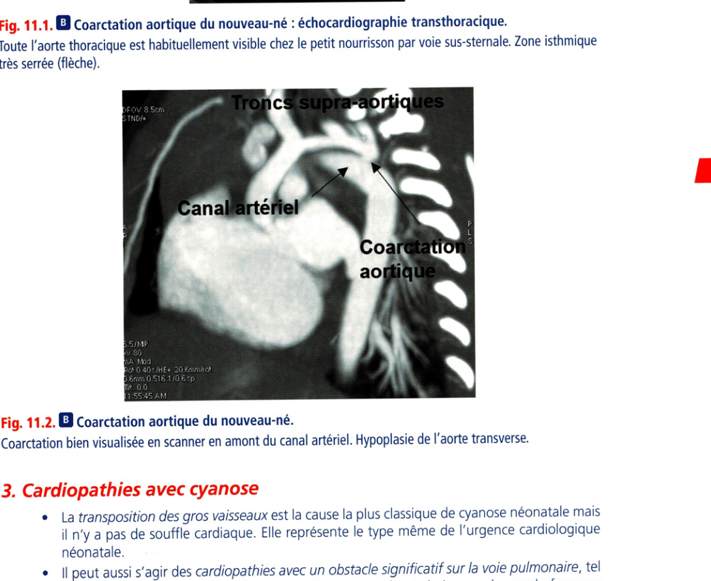
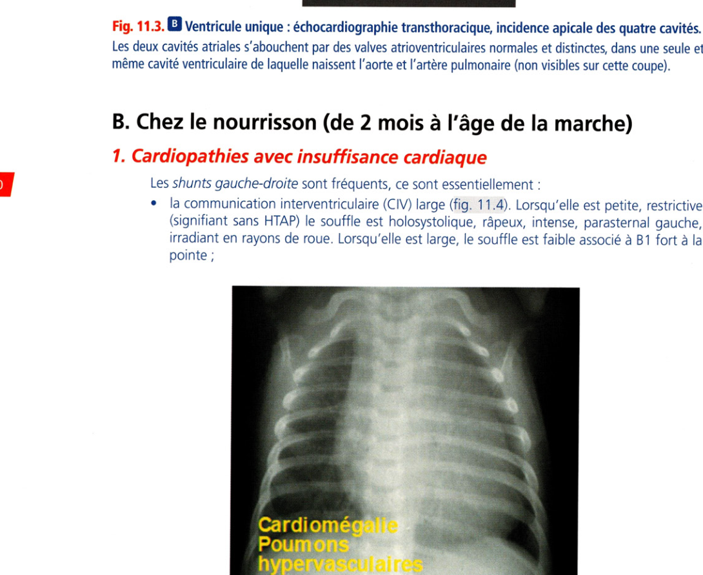
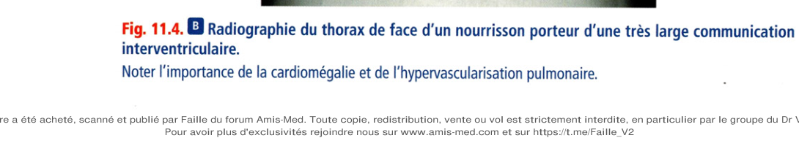
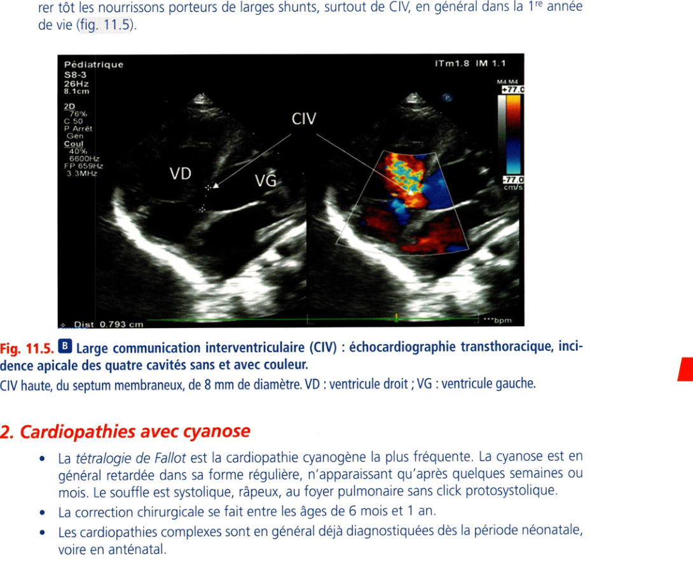
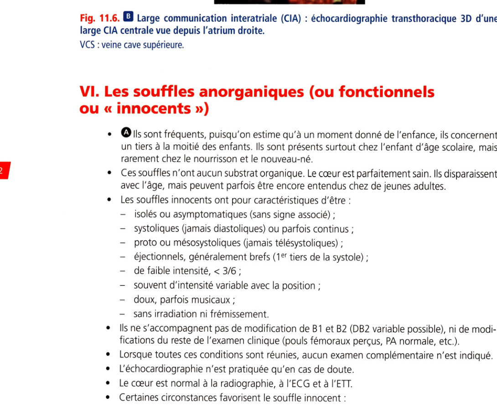

# Item 238 — Souffle cardiaque chez l'enfant

> **Collège CNEC / SFC** · 3e édition (2025) · p. 262–274 · R2C  
> Partie II — Maladies des valves

---

## Trois repères à ne pas confondre

| Badge | Signification (R2C) |
|---|---|
| **Rang A** | Connaissances fondamentales de fin de 2e cycle |
| **Rang B** | Connaissances essentielles, plus spécialisées |
| **Rang C** | Connaissances de 3e cycle (DES) |

Les pastilles du livre (● = A, ■ = B) sont reprises inline.

---

## Situations de départ

18 Découverte d'anomalies à l'auscultation cardiaque.  
19 Découverte d'un souffle vasculaire.  
20 Découverte d'anomalies à l'auscultation pulmonaire.  
26 Anomalies de la croissance staturo-pondérale.  
39 Examen du nouveau-né à terme.  
42 Hypertension artérielle.  
43 Découverte d'une hypotension artérielle.  
46 Hypotonie/malaise du nourrisson.  
55 Pâleur de l'enfant.  
160 Détresse respiratoire aiguë.  
162 Dyspnée.  
165 Palpitations.  
166 Tachycardie.  
178 Demande/prescription raisonnée et choix d'un examen diagnostique.  
185 Réalisation et interprétation d'un électrocardiogramme (ECG).  
230 Rédaction de la demande d'un examen d'imagerie.  
231 Demande d'un examen d'imagerie.  
265 Consultation de suivi d'un nourrisson en bonne santé.  
296 Consultation de suivi pédiatrique.  
308 Dépistage néonatal systématique.  
335 Évaluation de l'aptitude au sport et rédaction d'un certificat de non-contre-indication.

---

## Hiérarchisation des connaissances

| Rang | Rubrique | Intitulé | Descriptif |
|---|---|---|---|
| **A** | Diagnostic positif | Sémiologie cardiovasculaire chez l'enfant | |
| **A** | Définition | Définition d'un souffle cardiaque organique et non organique | Fréquence en fonction de l'âge |
| **B** | Examens complémentaires | Apports des examens de 1re intention devant un souffle de l'enfant | Radiographie thoracique, ECG, échocardiographie |
| **B** | Étiologies | Orientation étiologique des souffles cardiaques | |

---

## Parcours Rang A

- [I. Généralités cardiopathies enfant](#i-généralités-cardiopathies-enfant)
- [II. Particularités auscultation enfant](#ii-particularités-auscultation-enfant)
- [III. Circonstances de découverte](#iii-circonstances-de-découverte)
- [VI. Souffles anorganiques/innocents](#vi-souffles-anorganiquesinnocents)

---

## Sommaire

- [Vignette clinique](#vignette-clinique)
- [I. Généralités cardiopathies enfant](#i-généralités-cardiopathies-enfant)
- [II. Particularités auscultation enfant](#ii-particularités-auscultation-enfant)
- [III. Circonstances de découverte](#iii-circonstances-de-découverte)
- [IV. Clinique et examens complémentaires](#iv-clinique-et-examens-complémentaires)
- [V. Principales cardiopathies par âge](#v-principales-cardiopathies-par-âge)
- [VI. Souffles anorganiques/innocents](#vi-souffles-anorganiquesinnocents)
- [Points](#points)
- [Notions indispensables et inacceptables](#notions-indispensables-et-inacceptables)
- [Réflexes transversalité](#réflexes-transversalité)
- [Entraînement](../../Entrainement/QI/238_Souffle_cardiaque_enfant.md)

---

## Vignette clinique

Vous êtes médecin généraliste et vous recevez en consultation un enfant âgé de 3 ans, qui vient pour un écoulement nasal fébrile. À l'auscultation précordiale, vous entendez un souffle systolique et notez une irradiation dans le dos.

> Vous rassurez les parents, l'enfant a de la fièvre et c'est normal d'entendre un souffle ?

> Un souffle holosystolique est évocateur d'un souffle fonctionnel ?

> Vous précisez aux parents qu'il pourrait bien s'agir d'une coarctation aortique ?

> Vous adressez rapidement l'enfant à un cardiopédiatre pour réaliser une échocardiographie ?

# I. Généralités cardiopathies enfant

**Rang A.**

• La découverte d'un souffle cardiaque est très fréquente chez l'enfant : il peut être soit

organique (c'est-à-dire correspondant à une anomalie cardiaque anatomique sousjacente), soit anorganique (dit aussi fonctionnel, ou « innocent » c'est-à-dire sans anomalie cardiaque sous-jacente). Un souffle peut être entendu chez l'enfant dans plusieurs situations :

•

un souffle en relation avec une malformation cardiaque congénitale, qui touche 1 % des enfants à la naissance :

•

rarement, un souffle en relation avec une cardiomyopathie ou une myocardite,

•

exceptionnellement en relation avec une cardiopathie acquise puisque les valvulopathies rhumatismales ont totalement disparu dans les pays occidentaux,

•

chez le grand enfant surtout, un souffle fonctionnel, dit encore « anorganique », ou mieux «innocent» sans aucun substrat anatomique qui est rencontré au cours de l'enfance chez un tiers à la moitié des enfants d'âge scolaire. L'âge permet d'emblée d'orienter vers une cause organique ou fonctionnelle : 90 % des souffles chez le nourrisson sont organiques et plus des trois quarts des souffles chez l'enfant d'âge scolaire sont fonctionnels. La découverte d'un souffle cardiaque est une source d'anxiété majeure chez les parents. Il est le plus souvent innocent mais parfois le seul point d'appel d'une cardiopathie congénitale.

---

# II. Particularités auscultation enfant

**Rang A.**

L'auscultation n'est pas toujours facile chez le petit enfant car le cœur est rapide et l'auscultation est souvent gênée par les cris, les pleurs et l'agitation. Il est nécessaire de connaître les petits moyens pour distraire l'enfant : jouets, sucette, etc. Un stéthoscope pédiatrique est utilisé. Le rythme cardiaque de l'enfant est rapide et souvent irrégulier car l'arythmie sinusale respiratoire, physiologique, peut être très marquée. En cas de doute, un ECG doit être réalisé. Un dédoublement du 2e bruit (DB2) le long du bord sternal gauche, variable avec la respiration, est fréquent et physiologique. En revanche, un DB2 large et fixe est anormal (communication interatriale ou bloc de branche droit). Une accentuation ou éclat du 2e bruit le long du bord sternal gauche peut correspondre à une hypertension artérielle pulmonaire (HTAP). Un 3e bruit ou B3 est fréquent à l'apex chez l'enfant (50 % des cas) ; il est physiologique. La constatation d'un bruit surajouté de type clic n'est pas exceptionnelle chez l'enfant, il s'agit :

•

soit d'un clic mésosystolique apexien (foyer mitral) de prolapsus mitral ;

•

soit d'un clic protosystolique traduisant la présence d'une sténose valvulaire sur l'un des gros vaisseaux, aorte ou artère pulmonaire.

> Il n'y a généralement pas de corrélation entre l'intensité d'un souffle et la gravité de la maladie sous-jacente.

---

# III. Circonstances de découverte

**Rang A.**

## A. Symptômes qui font suspecter une cardiopathie

### 1. Chez le nouveau-né et le nourrisson

Il peut s'agir d'une cyanose et/ou d'une insuffisance cardiaque. La cyanose est une coloration bleutée de la peau et des téguments, qui peut être témoin d'une hypoxie, mais peut apparaître aussi en cas d'hypothermie ou hypoglycémie. C'est la mesure de la saturation cutanée en oxygène qui permet de diagnostiquer l'hypoxie qui est réfractaire à l'oxygène quand elle est d'origine cardiaque. L'insuffisance cardiaque se manifeste par des difficultés alimentaires, un retard staturopondéral ou des signes respiratoires (polypnée, tirage, toux).

### 2. Chez l'enfant plus grand

On observe les mêmes symptômes que précédemment (mais plus rarement), des infections respiratoires à répétition, ou une dyspnée d'effort, une fatigabilité, rarement une syncope ou une douleur thoracique d'effort (obstacle à l'éjection du ventricule gauche : sténose aortique ou cardiomyopathie obstructive). Parfois, il s'agit d'une altération de l'état général avec anorexie, asthénie et douleurs abdominales.

## B. Anomalies de l'examen clinique cardiovasculaire

Elles orientent vers une cardiopathie, même en l'absence de symptômes. L'hépatomégalie est le signe le plus pertinent d'insuffisance cardiaque chez le nourrisson et l'enfant. Les œdèmes des membres inférieurs sont exceptionnels chez l'enfant. Le plus souvent, c'est un souffle cardiaque découvert à un âge variable ou une anomalie des bruits du cœur. Plus rarement, ce peut être l'absence d'un pouls, surtout fémoral, qui oriente d'emblée vers une coarctation aortique, un trouble du rythme à l'auscultation, etc.

## C. Symptômes extracardiaques

Les symptômes pouvant faire évoquer une cause cardiologique sont la survenue d'un accident vasculaire cérébral, une fièvre au long cours, une cassure de la courbe de croissance pondérale.

## D. Contexte particulier faisant suspecter une atteinte

cardiaque Il peut s'agir : d'un syndrome polymalformatif nécessitant une échocardiographie systématique lors du bilan, qu'il y ait ou non des symptômes, et qu'il y ait ou non un souffle ; d'un contexte de maladie génétique familiale pouvant toucher le cœur ou les gros vaisseaux, comme le syndrome de Marfan ; d'un contexte de cardiopathie congénitale familiale dans la famille proche (apparentés du 1er degré).

**Rang A.** Les syndromes chromosomiques et génétiques associés le plus fréquemment aux cardiopathies

congénitales comportent : la trisomie 21, la microdélétion 22q11 (syndrome de Digeorge), le syndrome de Turner (45, XO), le syndrome de Williams Beuren (microdélétion du chromosome 7), le syndrome de Noonan, le syndrome CHARGE [coloboma, heart defect, atresia choanae, retarded growth and development, genital hypoplasia, ear anomalies/deafness], le syndrome de Marfan.

**Rang A.** Dans ces circonstances, il faut adresser l'enfant au cardiopédiatre.

**Rang B.** Il pratique un examen clinique et une échocardiographie doppler souvent associée à un

ECG conduisant le plus souvent au diagnostic d'emblée.

---

# IV. Clinique et examens complémentaires

**Rang A** · **Rang B**.

## A. Signes fonctionnels

**Rang A.** Ils sont souvent absents : le souffle est une découverte fortuite au cours d'un examen

clinique systématique. La dyspnée d'effort est le symptôme le plus commun. Les malaises sont un motif de consultation fréquent chez l'enfant. Ils sont assez rarement d'origine cardiaque. Chez le petit nourrisson, il peut s'agir de spasmes du sanglot ; chez l'enfant plus grand et l'adolescent, les malaises d'origine vagale sont communs. Les syncopes d'effort des obstacles aortiques congénitaux sont rares. Les syncopes du BAV congénital ou des canalopathies congénitales (syndrome du QT long congénital, syndrome de Brugada, etc.) sont diagnostiquées par l'ECG et le holter. Les douleurs thoracigues, fréquentes, sont exceptionnellement d'origine cardiaque chez l'enfant, contrairement à l'adulte.

## B. Caractéristiques du souffle

Comme chez l'adulte, il faut préciser : le temps du souffle, systolique, diastolique, systolodiastolique ou continu ; double souffle, systolique et diastolique :

•

sa durée pour un souffle systolique (proto, meso, télé, holo),

•

son intensité sur une échelle de 1 à 6 sur 6 (1 : très faible ; 2 : faible mais entendu immédiatement ; 3 : fort ; 4 : avec thrill ou entendu avec rebord du stéthoscope ; 5 : entendu à distance du thorax avec stéthoscope ; 6 : entendu à distance du thorax sans stéthoscope),

•

son caractère frémissant ou non,

•

sa topographie sur le thorax (foyer d'auscultation : foyers pulmonaire, aortique, mitral ou tricuspidien, mais aussi sous-claviculaire gauche et au niveau de la fontanelle antérieure pour les nourrissons),

•

ses irradiations : dans le dos, en écharpe de la base à l'apex, en rayon de roue au niveau de tout le précordium,

•

sa variabilité : c'est une caractéristique très importante à évaluer, en fonction de la respiration (inspiration, expiration), de la position (couché, assis, debout), de la compression vasculaire (carotide ou jugulaire) ; les modifications éventuelles des bruits du cœur associées (dédoublement fixe ou variable du 2e bruit, augmentation d'intensité du 2e bruit). Ces caractéristiques orientent déjà assez facilement le diagnostic : un souffle variable dans le temps et avec la position est pratiquement toujours innocent, mais ce caractère variable des souffles anorganiques est inconstant ; les souffles innocents irradient peu. Un souffle bruyant, irradiant largement, est a priori organique ; un souffle diastolique ou un double souffle est toujours organique ; les souffles innocents sont presque toujours systoliques, plus rarement systolodiastoliques (souffle « veineux » du cou) ; un souffle frémissant est toujours organique ; un souffle innocent est toujours bref dans la systole ; un souffle entendu et/ou frémissant dans le cou et en sus-sternal est probablement lié à un obstacle aortique ; un souffle entendu dans le dos évoque un obstacle pulmonaire ; un souffle irradiant dans toutes les directions ou « panradiant » à partir de la région mésocardiaque évoque une communication interventriculaire.

## C. Signes associés

La cyanose discrète (SaO2 transcutanée > 80 à 85 %) peut être de diagnostic difficile, même pour un œil averti. Il s'agit d'une coloration bleutée de la peau et des téguments qui peut traduire une hypoxie. Il faut la confirmer par la mesure de la saturation transcutanée en O2 au saturomètre de pouls. La cyanose clinique apparaît quand la saturation en O2 est < 85 %. Elle doit être recherchée au niveau des extrémités (ongles), des lèvres, de la muqueuse buccale. L'hypoxie d'origine cardiaque est réfractaire à l'oxygène (non modifiée par l'administration d'O2 à 100 %), à la différence de l'hypoxie d'origine bronchopulmonaire qui est sensible à l'oxygénothérapie. L'insuffisance cardiaque est souvent moins typique chez l'enfant que chez l'adulte. Il est important de savoir reconnaître ses signes chez le nourrisson qui incluent des symptômes respiratoires (polypnée, tirage, toux) et/ou digestifs (difficultés alimentaires, vomissements postprandiaux, stagnation pondérale ou perte de poids), et peuvent égarer le diagnostic vers une pathologie bronchopulmonaire ou gastro-intestinale. À l'examen clinique, on retrouve une polypnée de repos, une tachycardie et une hépatomégalie qui est un signe majeur. Un retard staturopondéral plus ou moins important, lié à des difficultés alimentaires, une mauvaise prise des biberons, avec dyspnée et sueurs, est fréquent dans les larges shunts du nourrisson. La croissance pondérale est souvent altérée par les cardiopathies significatives et est un paramètre important de l'examen clinique. On peut noter des anomalies de l'examen physique :

•

anomalie de la pression artérielle : une HTA avec absence des pouls fémoraux oriente d'emblée vers une coarctation aortique. La pression artérielle doit être mesurée avec un brassard pédiatrique adapté à la taille et l'âge de l'enfant, et au membre inférieur autant qu'au membre supérieur ;

•

la palpation des pouls recherche leur présence et leur amplitude comparativement entre les membres supérieurs (pouls huméraux) et inférieurs (pouls fémoraux) ;

•

la palpation d'un frémissement précordial ou sus-sternal (thrill) est toujours un signe pathologique ;

•

la fréquence cardiaque diminue avec l'âge : un rythme cardiaque rapide au repos peut être témoin d'une insuffisance cardiaque. D'autres anomalies de l'auscultation peuvent être associées au souffle :

•

DB2 : anormal s'il est fixe et invariable ;

•

éclat de B2 : témoin d'une élévation anormale de la pression pulmonaire ;

•

clic protosystolique : bruit anormal d'ouverture valvulaire ;

•

galop avec B3. La présence d'un de ces signes suffit à envoyer l'enfant au spécialiste, qui réalise une échocardiographie dans tous les cas, un ECG, et rarement une radiographie thoracique.

## D. Examens complémentaires

### 1. Radiographie de thorax

Une cardiomégalie oriente vers une cardiopathie, sans qu'il soit possible d'en préciser la nature, malformative ou plus rarement cardiomyopathie ou myocardite aiguë. Il faut se méfier des « fausses cardiomégalies » par superposition de l'image du thymus sur la silhouette cardiaque. Une saillie de l'arc moyen gauche évoque une dilatation du tronc de l'artère pulmonaire et oriente vers un shunt gauche-droite, alors qu'un arc moyen gauche concave évoque une hypoplasie de la voie pulmonaire proximale, comme dans la tétralogie de Fallot. Un pédicule vasculaire étroit évoque une anomalie de position des gros vaisseaux. Une hypervascularisation pulmonaire est en faveur d'un hyperdébit pulmonaire, donc d'une cardiopathie avec shunt gauche-droite. Une hypovascularisation pulmonaire évoque un obstacle sur la voie pulmonaire.

### 2. Électrocardiogramme

L'ECG de l'enfant est différent de celui de l'adulte ; il varie avec l'âge, et un ECG doit toujours être interprété en fonction de l'âge de l'enfant. La fréquence cardiaque est d'autant plus rapide que l'enfant est jeune. L'axe de QRS est plus droit que chez l'adulte, le délai PR est plus court. Les ondes T sont positives en précordiales droites à la naissance et se négativent vers la fin de la 1re semaine ; elles demeurent négatives de V1 à V4 pendant l'enfance. L'arythmie sinusale respiratoire est banale chez l'enfant.

### 3. Échocardiographie cardiaque

C'est l'examen clé du diagnostic, qui permet en règle de porter un diagnostic précis. Sa qualité est constamment bonne chez l'enfant, mais sa réalisation est parfois rendue difficile par l'agitation du patient. L'usage d'un appareillage performant, de capteurs pédiatriques spécifiques, la réalisation de l'examen par un opérateur expérimenté, formé au diagnostic des cardiopathies congénitales, qui sont différentes des maladies cardiaques de l'adulte, sont des conditions indispensables à l'obtention d'un diagnostic fiable chez l'enfant.

### 4. Autres examens paracliniques

Ce sont : l'épreuve d'effort, sur tapis roulant chez le petit, ou sur bicyclette ergométrique ; le holter ECG, en cas de troubles du rythme idiopathiques ou postopératoires ; \l'IRM cardiaque, très performante, notamment pour les gros vaisseaux intrathoraciques ; le scanner de bonne résolution spatiale qui, à l'inverse de ll'IRM, a l'inconvénient d'être un examen irradiant ; le cathétérisme cardiaque, dont les indications sont limitées chez l'enfant pour le diagnostic. L'examen est généralement réalisé sous anesthésie générale avant 10 ans. Il est réservé au bilan préopératoire des cardiopathies congénitales complexes, ou alors à visée thérapeutique en cathétérisme interventionnel.

---

# V. Principales cardiopathies par âge

**Rang A** · **Rang B**.

## A. Chez le nouveau-né (de la naissance à la fin du 2e mois)

### 1. Souffle isolé chez un nouveau-né

Un souffle noté en période néonatale, même si l'enfant est asymptomatique, est toujours potentiellement pathologique.

Il est donc nécessaire d'effectuer une échographie cardiaque avant la sortie de la maternité en cas de souffle chez un nouveau-né. Il faut réaliser : un examen clinique complet ; une échographie cardiaque systématique ; souvent un ECG ; souvent une radiographie pulmonaire de face.

### 2. Cardiopathies avec insuffisance cardiaque

La coarctation aortique ou sténose de l'isthme de l'aorte peut être symptomatique dès les premiers jours de vie, mais les symptômes n'apparaissent qu'au moment de la fermeture du canal artériel. Les pouls fémoraux sont abolis. Le tableau est bruyant et la chirurgie est urgente (fig. 11.1 et 11.2). Le souffle est systolique, doux, sous claviculaire gauche irradiant en interscapulaire dans le dos. Les autres causes sont plus rares ou dépistées en anténatal.

**Fig. 11.1.** Coarctation aortique du nouveau-né : échocardiographie transthoracique.

Toute l'aorte thoracique est habituellement visible chez le petit nourrisson par voie sus-sternale. Zone isthmique très serrée (flèche). 0 40? /HE* 20 i 6mm 0.516 1/06sp

### 3. Cardiopathies avec cyanose

La transposition des gros vaisseaux est la cause la plus classique de cyanose néonatale mais il n'y a pas de souffle cardiaque. Elle représente le type même de l'urgence cardiologique néonatale. Il peut aussi s'agir des cardiopathies avec un obstacle significatif sur la voie pulmonaire, tel qu'une sténose valvulaire pulmonaire serrée avec un shunt droite-gauche par le foramen ovale perméable. Le souffle est systolique râpeux au foyer pulmonaire avec click protosystolique lorsque la sténose est valvulaire. Enfin, les cardiopathies complexes sont fréquentes, très polymorphes (ventricule unique [fig. 11.3], ou tronc artériel commun, etc.). Elles associent, à des degrés divers, cyanose et défaillance cardiaque suivant les cas et le souffle peut être absent ou faible.

**Fig. 11.3.** Ventricule unique : échocardiographie transthoracique, incidence apicale des quatre cavités.

Les deux cavités atriales s'abouchent par des valves atrioventriculaires normales et distinctes, dans une seule et même cavité ventriculaire de laquelle naissent l'aorte et l'artère pulmonaire (non visibles sur cette coupe).

## B. Chez le nourrisson (de 2 mois à l'âge de la marche)

### 1. Cardiopathies avec insuffisance cardiaque

Les shunts gauche-droite sont fréquents, ce sont essentiellement : la communication interventriculaire (CIV) large (fig. 11.4). Lorsqu'elle est petite, restrictive (signifiant sans HTAP) le souffle est holosystolique, râpeux, intense, parasternal gauche, irradiant en rayons de roue. Lorsqu'elle est large, le souffle est faible associé à B1 fort à la pointe ;

**Fig. 11.4.** Radiographie du thorax de face d'un nourrisson porteur d'une très large communication

interventriculaire. Noter l’importance de la cardiomégalie et de (l'hypervascularisation pulmonaire. la persistance du canal artériel avec un souffle continu au bord gauche du sternum, crescendo en systole et decrescendo en diastole ; le canal atrioventriculaire (chez le patient trisomique 21). Il existe un risque d'HTAP irréversible si le shunt est opéré trop tard. Il est donc impératif d'opérer tôt les nourrissons porteurs de larges shunts, surtout de CIV, en général dans la 1re année de vie (fig. 11.5).

**Fig. 11.5.** Large communication interventriculaire (CIV) : échocardiographie transthoracique, incidence apicale des quatre cavités sans et avec couleur.

CIV haute, du septum membraneux, de 8 mm de diamètre. VD : ventricule droit ; VG : ventricule gauche.

### 2. Cardiopathies avec cyanose

La tétralogie de Fallot est la cardiopathie cyanogène la plus fréquente. La cyanose est en général retardée dans sa forme régulière, n'apparaissant qu'après quelques semaines ou mois. Le souffle est systolique, râpeux, au foyer pulmonaire sans click protosystolique. La correction chirurgicale se fait entre les âges de 6 mois et 1 an. Les cardiopathies complexes sont en général déjà diagnostiquées dès la période néonatale, voire en anténatal.

## C. Dans la deuxième enfance (de 2 à 16 ans) : cardiopathies

malformatives Il s'agit en général de cardiopathies bien tolérées, telles que la communication interatriale (fig. 11.6). Le souffle est systolique au foyer pulmonaire (lié à l'hyperdébit au travers) et souvent associé à un dédoublement fixe et constant de B2 (lié au retard de fermeture de la valve pulmonaire). La coarctation aortique, lorsqu'elle est d'installation progressive, a souvent pour signe d'appel une HTA associé à une diminution des pouls fémoraux, un gradient tensionnel membre supérieur/inférieur et un souffle systolique, doux, sous claviculaire gauche irradiant en interscapulaire dans le dos. La sténose valvulaire pulmonaire peut être diagnostiquée à différents âges de la vie selon sa sévérité et peut se traduire par une dyspnée d'effort chez le grand enfant.

**Fig. 11.6.** Large communication interatriale (CIA) : échocardiographie transthoracique 3D d'une

large CIA centrale vue depuis l'atrium droite. VCS : veine cave supérieure.

---

# VI. Souffles anorganiques/innocents

**Rang A.**

ou « innocents »)

• **Rang A.** Ils sont fréquents, puisqu'on estime qu'à un moment donné de l'enfance, ils concernent

un tiers à la moitié des enfants. Ils sont présents surtout chez l'enfant d'âge scolaire, mais rarement chez le nourrisson et le nouveau-né. Ces souffles n'ont aucun substrat organique. Le cœur est parfaitement sain. Ils disparaissent avec l'âge, mais peuvent parfois être encore entendus chez de jeunes adultes. Les souffles innocents ont pour caractéristiques d'être :

•

isolés ou asymptomatiques (sans signe associé) ;

•

systoliques (jamais diastoliques) ou parfois continus ;

•

proto ou mésosystoliques (jamais télésystoliques) ;

•

éjectionnels, généralement brefs (1er tiers de la systole) ;

•

de faible intensité, < 3/6 ;

•

souvent d'intensité variable avec la position ;

•

doux, parfois musicaux ;

•

sans irradiation ni frémissement. Ils ne s'accompagnent pas de modification de B1 et B2 (DB2 variable possible), ni de modifications du reste de l'examen clinique (pouls fémoraux perçus, PA normale, etc.). Lorsque toutes ces conditions sont réunies, aucun examen complémentaire n'est indiqué. L'échocardiographie n'est pratiquée qu'en cas de doute. Le cœur est normal à la radiographie, à l'ECG et à l'ETT. Certaines circonstances favorisent le souffle innocent :

•

toutes les causes d'augmentation du débit cardiaque (fièvre, effort, émotion, anémie, hyperthyroïdie) ;

•

certaines anomalies morphologiques : syndrome du « dos droit » ou du « dos plat », thorax en entonnoir, scolioses, etc. Aucune thérapeutique, ou surveillance, ou restriction d'activité, n'est justifiée, et ces enfants peuvent mener une vie strictement normale, puisqu'ils ne sont pas malades. Tous les sports sont autorisés, y compris en compétition. Il est inutile de revoir l'enfant en consultation.

• Il est important de formuler une conclusion ferme et précise dès le premier examen, afin de

rassurer la famille et l'enfant, inquiets du « souffle au cœur ».

### Pourquoi entend-on un souffle fonctionnel ?

Il s'agit du bruit normal du flux sanguin lors de l’éjection du sang. On l'entend car la distance du cœur avec le stéthoscope est plus faible et que les cavités cardiaques sont de plus petite taille, ce qui explique qu’à l'âge adulte, celui-ci disparaît. Avant 3 mois, il peut être lié à une accélération du flux sur les branches pulmonaires en raison de la différence de calibre entre le tronc et les branches pulmonaires à cet âge.

---

## Points

**Points clés**

• Les souffles découverts dans la 2e enfance correspondent le plus souvent à des souffles anorganiques (« innocents », « fonctionnels », « normaux »), apanage de l'enfant et de l'adolescent.

• Dans les pays occidentaux, les cardiopathies organiques de l'enfant sont pratiquement toujours liées à des malformations congénitales ; les valvulopathies rhumatismales ont disparu. Il existe également des cardiomyopathies et des myocardites.

• Les signes d'appel : cyanose ou défaillance cardiaque chez le nouveau-né (plus rarement chez le nourrisson), dyspnée, insuffisance cardiaque, difficultés de croissance ; souvent la découverte fortuite d'un souffle asymptomatique.

• Les syndromes polymalformatifs (caryotype normal ou anormal) s'accompagnent fréquemment de cardiopathies congénitales : échocardiographie systématique.

• Particularités de l'auscultation de l'enfant : tachycardie sinusale, arythmie sinusale respiratoire, dédoublement variable du B2, B3 fréquent et physiologique.

• Il n'y a pas toujours de parallélisme entre l'intensité d'un souffle et la gravité de la cardiopathie. Une cardiopathie grave peut ne pas s'accompagner de souffle ; une cardiopathie mineure (petite CIV) peut générer un souffle intense.

• **Rang B.** L'ECG et le cliché de thorax n'ont qu'une valeur d'orientation ; l'ECG doit toujours être interprété en fonction de l'âge.

• Dans l'immense majorité des cas, l'interrogatoire et l'examen physique (dont une bonne auscultation) permettent d'étiqueter l'origine du souffle et son caractère organique ou fonctionnel. L'échocardiographie est l'examen clé ; elle permet de limiter les indications du cathétérisme, surtout à visée interventionnelle.

• D'autres examens peuvent être indiqués : holter ECG, épreuve d'effort dans la 2e enfance, IRM ou scanner.

• Les communications interatriales sont les cardiopathies bénignes les plus répandues.

• Chez le nourrisson, les shunts gauche-droite sont les malformations les plus communes, surtout les CIV. La cardiopathie cyanogène la plus courante est la tétralogie de Fallot (souffle précoce, cyanose retardée).

• **Rang A.** Dans la 2e enfance, les souffles fonctionnels dominent : il faut en connaître les caractéristiques.

• En cas de souffle fonctionnel (le plus fréquent en 2e enfance), aucun suivi, aucune restriction d'activité ni examen complémentaire ne sont indiqués.
---

## Notions indispensables et inacceptables

### Notions indispensables

• Connaître les particularités de l'auscultation cardiaque de l'enfant.
• Connaître les caractéristiques de l'examen cardiovasculaire de l'enfant.
• Connaître les circonstances de découverte d'une cardiopathie chez l'enfant et les signes cliniques qui
• orientent vers ce diagnostic : cyanose ou défaillance cardiaque chez le nouveau-né, plus rarement chez le
• nourrisson, dyspnée, insuffisance cardiaque, difficultés de croissance dans la 2e enfance, malaises. Souvent,
• c'est la découverte d'un souffle asymptomatique qui motive la consultation.
• Connaître les caractéristiques des souffles innocents, et leurs différents types.

### Notions inacceptables

• Méconnaître un souffle cardiaque en période néonatale qui, même si l'enfant est asymptomatique, est
• toujours potentiellement pathologique.
• Ne pas adresser l'enfant à un cardiopédiatre en cas de cyanose, insuffisance cardiaque, retard staturo-
• pondéral non expliqué, HTA, anomalie des pouls fémoraux, frémissement précordial, dédoublement fixe
• du B2, éclat de B2, clic protosystolique ou galop.

---

## Réflexes transversalité

• Item 53 - Retard de croissance staturopondérale
• Item 152 - Endocardite infectieuse
• Item 224 - Hypertension artérielle de l'adulte et de l'enfant
• Item 233 - Valvulopathies
• **Rang A.** QRU 1
• Parmi les propositions suivantes concernant les souffles cardiaques de l’enfant, laquelle est vraie ?
• A Le souffle innocent est le plus fréquent des souffles cardiaques de l'enfant
• B Le souffle innocent peut être systolique ou diastolique
• C Le souffle innocent est souvent intense
• D Le souffle innocent peut varier avec le temps et la position
• E Le souffle innocent a souvent une irradiation dorsale
• Un enfant de 1 mois vous est présenté pour défaut de croissance staturo-pondérale. Il prend ses biberons en
• plusieurs fois, semble s'essouffler. L'enfant est rose avec des saturations à 100 % au repos. L'auscultation révèle
• un souffle intense, 4/6, au 4e espace intercostal. Ce souffle irradie tout autour de ce foyer en rayon de roue. Le
• diagnostic le plus probable que vous suspectez est :
• A Un canal artériel persistant
• B Une communication interventriculaire
• C Une sténose pulmonaire
• D Une tétralogie de Fallot
• E Un souffle innocent
• Concernant la coarctation de l'aorte, indiquer les bonnes réponses :
• A Elle est typiquement accompagnée d'un souffle diastolique irradiant dans le dos
• B Elle est une cause d'hypertension artérielle systémique chez l'enfant
• C Elle est associée à une diminution de la perception des pouls fémoraux
• D Elle peut être associée à une hypertrophie ventriculaire gauche électrique
• E Elle peut être associée à une bicuspidie aortique
• Concernant l'auscultation précordiale de l'enfant :
• A Le 2e bruit (B2) est presque toujours dédoublé de façon fixe
• B II n'y a généralement pas de corrélation entre l'intensité d'un souffle et la gravité de la cardiopathie
• sous-jacente
• C Un rythme cardiaque variable doit faire évoquer une arythmie
• D L'auscultation cardiaque est souvent parasitée par les bruits respiratoires chez le petit enfant
• E La perception d'un 3e bruit (B3) est toujours pathologique
• Rythmologie

---

## Entraînement

Questions isolées et corrigés : [Entrainement/QI/238_Souffle_cardiaque_enfant.md](../../Entrainement/QI/238_Souffle_cardiaque_enfant.md)
