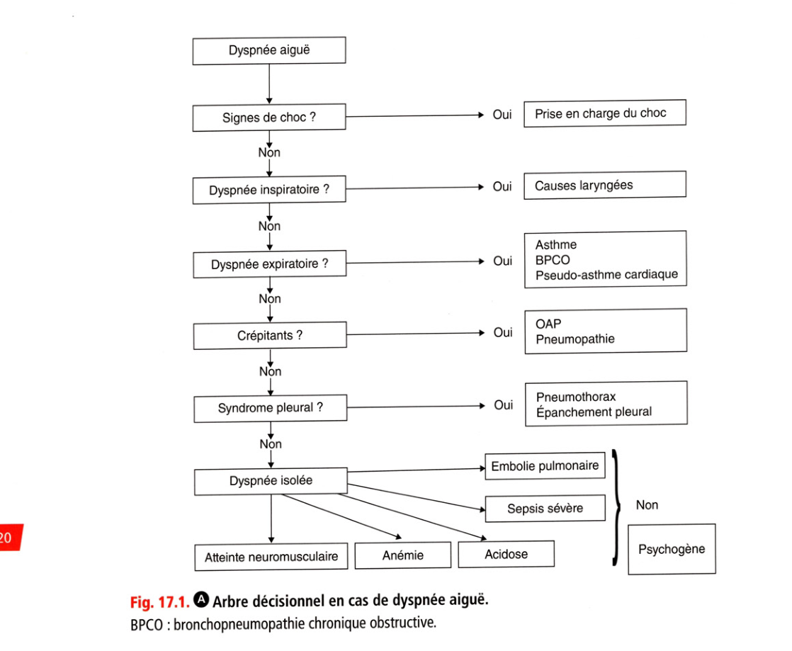

# Item 203 — Dyspnée aiguë et chronique

> **Collège CNEC / SFC** · 3e édition (2025) · p. 411–424 · R2C  
> Partie IV — Insuffisance cardiaque

---

## Trois repères à ne pas confondre

| Badge | Signification (R2C) |
|---|---|
| **Rang A** | Connaissances fondamentales de fin de 2e cycle |
| **Rang B** | Connaissances essentielles, plus spécialisées |
| **Rang C** | Connaissances de 3e cycle (DES) |

Les pastilles du livre (● = A, ■ = B) sont reprises inline.

---

## Situations de départ

18 Découverte d'anomalies à l'auscultation cardiaque.  
20 Découverte d'anomalies à l'auscultation pulmonaire.  
145 Douleur pharyngée.  
149 Ingestion ou inhalation d'un corps étranger.  
160 Détresse respiratoire aiguë.  
162 Dyspnée.  
163 Expectoration.  
167 Toux.  
223 Interprétation de l'hémogramme.  
283 Consultation de suivi et éducation thérapeutique d'un patient asthmatique.  
285 Consultation de suivi et éducation thérapeutique d'un patient avec un antécédent cardiovasculaire.  
286 Consultation de suivi et éducation thérapeutique d'un patient BPCO.  
287 Consultation de suivi et éducation thérapeutique d'un patient insuffisant cardiaque.

---

## Hiérarchisation des connaissances

| Rang | Rubrique | Intitulé | Descriptif |
|---|---|---|---|
| **A** | Définition | Dyspnée, inspiratoire / expiratoire | |
| **A** | Diagnostic positif | Examen clinique d'un patient dyspnéique | |
| **A** | Étiologies | Principales étiologies d'une dyspnée aiguë | OAP, EP, asthme, BPCO, pneumopathie, PNO, SDRA, corps étranger, Quincke, anémie |
| **A** | Diagnostic positif | Signes de gravité d'une dyspnée aiguë | |
| **A** | Diagnostic positif | Orientation diagnostique d'une dyspnée chronique | |
| **A** | Étiologies | Signes d'orientation étiologique | |
| **A** | Examens complémentaires | Examens de 1re intention selon aigu/chronique | |
| **A** | Examens complémentaires | Examens de 2e intention | |
| **B** | Étiologies | Étiologies plus rares | |

---

## Parcours Rang A

- [I. Généralités](#i-généralités)
- [II. Orientation diagnostique devant une dyspnée aiguë](#ii-orientation-diagnostique-devant-une-dyspnée-aiguë)
- [III. Orientation diagnostique devant une dyspnée chronique](#iii-orientation-diagnostique-devant-une-dyspnée-chronique)

---

## Sommaire

- [Vignette clinique](#vignette-clinique)
- [I. Généralités](#i-généralités)
- [II. Orientation diagnostique devant une dyspnée aiguë](#ii-orientation-diagnostique-devant-une-dyspnée-aiguë)
- [III. Orientation diagnostique devant une dyspnée chronique](#iii-orientation-diagnostique-devant-une-dyspnée-chronique)
- [Points](#points)
- [Notions indispensables et inacceptables](#notions-indispensables-et-inacceptables)
- [Réflexes transversalité](#réflexes-transversalité)
- [Entraînement](../../Entrainement/QI/203_Dyspnee.md)

---

## Vignette clinique

Mme X, 69 ans, consulte pour un essoufflement apparu depuis quelques semaines. Elle a comme antécédent une hypertension artérielle traitée depuis 10 ans, une dyslipidémie traitée par régime seul et un tabagisme évalué à 15 PA. À l'examen, son poids est de 85 kg, sa taille de 163 cm, sa pression artérielle est mesurée à 165/94 mmHg et sa fréquence cardiaque à 90 bpm.

> À l'interrogatoire, comment caractérisez-vous la dyspnée et comment évaluez-vous son importance

et retentissement ?

> Que recherchez-vous à l'examen clinique pour évoquer une insuffisance cardiaque ?

> Quels examens complémentaires sont nécessaires pour préciser la prise en charge ?

# I. Généralités

**Rang A.**

## A. Définition de la dyspnée

• **Rang A.** La dyspnée est un inconfort, une difficulté respiratoire survenant pour un niveau d'activité usuelle n'entraînant normalement aucune gêne.

• Il s'agit d'une sensation subjective.

• C'est un symptôme très fréquent.

• Ses causes sont multiples : ORL, pneumologiques, cardiologiques, neurologiques.

• Il faut distinguer :

- dyspnée aiguë (d'apparition récente) et dyspnée chronique ;

- dyspnée et insuffisance respiratoire, les deux termes ne sont pas synonymes :

- une dyspnée peut s'observer en l'absence d'insuffisance respiratoire, par exemple dans l'anémie aiguë,

- une insuffisance respiratoire peut survenir sans dyspnée, par exemple au cours d'un coma.

## B. Analyse sémiologique

### 1. Interrogatoire

Il apprécie le terrain : antécédents, comorbidités, traitement en cours. La dyspnée est caractérisée :

• rapidité d'installation : aiguë (quelques heures ou jours) ou chronique (quelques semaines ou mois) ;

• circonstances de survenue :

- repos ou effort,

- position : décubitus (orthopnée) ou orthostatisme (platypnée),

- facteurs saisonniers, climatiques, environnementaux ou toxiques déclenchant la dyspnée,

- horaire. L'intensité est évaluée par la classification de la New York Heart Association (NYHA), la plus utilisée :

• stade I : absence de dyspnée pour les efforts habituels : aucune gêne n'est ressentie dans la vie courante ;

• stade II : dyspnée pour des efforts importants habituels, tels que la marche rapide ou en côte ou la montée des escaliers (> 2 étages) :

• stade III : dyspnée pour des efforts peu intenses de la vie courante, tels que la marche en terrain plat ou la montée des escaliers (< 2 étages) ;

• stade IV : dyspnée permanente de repos ou pour des efforts minimes (se laver, enfiler un vêtement). On peut en rapprocher l'échelle MRC (Medical Research Council) utilisée en pneumologie :

• stade 0 : exercice intense ;

• stade 1 : marche rapide sur terrain plat ou montée d'une pente légère ;

• stade 2 : marche à plat plus lente que les gens du même âge, ou obligeant à l'arrêt si le patient marche à son rythme à plat ;

• stade 3 : arrêt nécessaire après marche de 100 m environ ou de quelques minutes ;

• stade 4 : empêchant de sortir de la maison ou survenant à l'habillement. 0 L'intensité de la dyspnée aiguë peut aussi être évaluée par :

• une échelle visuelle analogique (EVA) de 10 cm : 0 = absence de dyspnée, 10 = dyspnée maximale ;

• l'échelle de Borg (qui s'applique aussi après un exercice prédéterminé) de 0 à 10 (0 = nulle, 10 maximale) ;

• le nombre d'oreillers utilisés pendant la nuit en cas d'orthopnée.

**Rang A.** L'interrogatoire recherche des signes fonctionnels associés : généraux, respiratoires, cardiologiques, ORL, neurologiques.

### 2. Examen clinique

Caractériser la dyspnée Cela consiste à :

• déterminer la phase du cycle respiratoire concerné : dyspnée inspiratoire, expiratoire ou aux deux temps ;

• évaluer :

- la fréquence respiratoire : tachypnée ou polypnée (> 20 cycles/min), bradypnée (< 10 cycles/min) ;

- le rythme respiratoire : régulier ou irrégulier :

- dyspnée de Kussmaul : alternance inspiration, pause, expiration, pause (acidose métabolique),

- dyspnée de Cheynes-Stokes : succession de périodes de polypnée croissante, puis décroissante entrecoupées de périodes d'apnée, vue dans l'IC grave (dyspnée d'origine centrale, bas débit au niveau des centres respiratoires ou du tronc cérébral),

- l'intensité : hyperpnée (augmentation de l'amplitude du volume courant), hypopnée ou oligopnée (diminution de l'amplitude du volume courant). Rechercher des éléments d'orientation étiologique Ce sont :

• des signes généraux : fièvre, frissons, amaigrissement, etc. ;

• des symptômes associés : douleur thoracique, toux, expectorations, bruits respiratoires associés : wheezing, cornage ;

• la présence de signes à l'auscultation pulmonaire : normale, crépitants, sibilants, râles bronchiques, abolition du murmure vésiculaire, etc. ;

• une anomalie de percussion : matité ou tympanisme. Cette recherche est complétée par des examens :

• cardiovasculaire complet à la recherche, en particulier, de signe d'IC et de signes de thrombose veineuse profonde ;

• ORL;

• thyroïdien ;

• neuromusculaire. Rechercher des signes de gravité devant une dyspnée aiguë Il s'agit de :

• signes de mise en jeu des muscles respiratoires accessoires : tirage sus-sternal ou susclaviculaire, creusement intercostal, battement des ailes du nez, balancement thoracoabdominal, contracture active expiratoire abdominale ;

• cyanose, sueurs, tachycardie > 1 20/min, signes de choc (marbrures), angoisse, SpO2 < 90 % ;

• retentissement neurologique : encéphalopathie respiratoire (astérixis), agitation, somnolence, sueurs, coma.

## C. Examens complémentaires à discuter en 1re intention

• La gazométrie artérielle apprécie la gravité (hypoxémie et hypercapnie témoignant d'une insuffisance respiratoire) et permet une parfois orientation étiologique. Attention, une SpO2 < 90 % témoigne d'une hypoxémie et indique l'administration d'oxygène.

• L'électrocardiogramme recherche des signes en faveur d'une embolie pulmonaire, d'une coronaropathie, un trouble du rythme, etc.

• La radiographie du thorax recherche une anomalie de la paroi thoracique, une anomalie pleurale, parenchymateuse pulmonaire, médiastinale, une cardiomégalie.

• Le bilan biologique comporte numération formule plaquettaire, ionogramme sanguin, glycémie, BNP (brain natriuretic peptide) ou NT-proBNP, D-dimères (en cas de suspicion d'embolie pulmonaire).

- Devant une dyspnée aiguë, un BNP < 100 pg/mL (ou un NT-proBNP < 300 pg/mL) rend le diagnostic d'insuffisance cardiaque peu probable. À l'inverse, des valeurs de BNP

> 1 00 pg/mL ou de NT-proBNP > 300 pg/mL sont en faveur d'une IC.

**Rang A.** En fait, les valeurs seuils varient en fonction de l'âge, par exemple pour le NT-proBNP,

les recommandations ESC 2021 retiennent des seuils > 450 pg/mL si âge < 55 ans,

> 900 pg/mL si âge entre 55 et 75 ans, > 1 800 pg/mL si âge > 75 ans.

**Rang A.** De même, un dosage de D-dimères < 500 pg/mL permet d'exclure le diagnostic

d'embolie pulmonaire si la probabilité est faible ou intermédiaire.

## D. Autres examens complémentaires

En fonction du contexte et de l'orientation étiologique, on discute de la réalisation de divers examens complémentaires, par exemple :

• échodoppler veineux des membres inférieurs et/ou angioscanner pulmonaire et/ou scintigraphie pulmonaire de ventilation/perfusion en cas de suspicion d'embolie pulmonaire ;

• échocardiographie avec doppler, épreuves fonctionnelles respiratoires, cathétérisme cardiaque, épreuve d'effort métabolique, etc.

---

# II. Orientation diagnostique devant une dyspnée aiguë

**Rang A.**

**Encadré 17.1 — Étiologies principales des dyspnées aiguës et chroniques**

### Dyspnées aiguës

1. **Étiologies d'origine cardiaque** — OAP, pseudoasthme cardiaque, tamponnade, troubles du rythme mal tolérés, choc cardiogénique 2. **Embolie pulmonaire** 3. **Pulmonaires et pleurales** — crise d'asthme, exacerbation de BPCO, pneumopathie, SDRA, décompensation d'une IRC, atélectasie, pneumothorax, épanchement pleural, traumatisme thoracique 4. **Laryngotrachéales** — œdème de Quincke, corps étranger, épiglottite/laryngite (enfant), sténose tumorale, granulome post-intubation 5. **Autres** — choc, acidose métabolique, causes neurologiques (bulbares, polyradiculonévrite, myasthénie), anémie aiguë, hyperthermie, intoxication CO, hyperventilation psychogène

### Dyspnées chroniques

1. **Cardiaques** — insuffisance cardiaque, constriction péricardique 2. **Pulmonaires et pleurales** — BPCO, asthme à dyspnée continue, PID, pneumoconioses, séquelles pleurales, paralysie phrénique, cyphoscoliose 3. **HTAP** — idiopathique, familiale, connectivite (sclérodermie), shunt, VIH, toxique 4. **HTP post-embolique** 5. **Autres** — obstacles VAS, anémie, acidose, neuromusculaire, dyspnée psychogène, troubles du transport de l'O2, intoxication CO

aiguë (encadré 17.1) La dyspnée aiguë est un motif extrêmement courant de consultation dans les services d'urgence. Les diagnostics les plus fréquents chez l'adulte sont l'œdème aigu du poumon (ou l'insuffisance cardiaque aiguë), l'embolie pulmonaire et la décompensation aiguë d'une pathologie respiratoire chronique souvent à l'occasion d'une surinfection. Outre l'interrogatoire et l'examen clinique, les principaux examens complémentaires réalisés sont les suivants :

• bilan sanguin avec en particulier une numération globulaire ;

• ECG;

• radiographie de thorax ;

• gazométrie artérielle ;

• dosage des D-dimères, du BNP (ou NT-proBNP) ;

• puis, en fonction de l'orientation initiale : angioscanner pulmonaire ou scanner pulmonaire, échocardiographie.

## A. Étiologies d'origine cardiaque

### 1. Œdème aigu du poumon

L'étiologie d'origine cardiaque est la plus fréquente. Ses principales caractéristiques cliniques sont :

• orthopnée, wheezing ;

• présence de crépitants bilatéraux à l'auscultation pulmonaire ;

• expectoration rose saumonée ;

• terrain : cardiopathie connue, antécédent d'infarctus, facteurs déclenchants (ex : FA) ;

• à la radiographie de thorax : œdème alvéolaire, cardiomégalie ;

• à l'ECG : anomalie (onde Q de nécrose), fibrillation atriale rapide ;

• BNP (ou NT-proBNP) augmenté. La réponse à un traitement adapté (diurétique ou trinitrine IV) peut être un argument en faveur du diagnostic.

### 2. Pseudoasthme cardiaque

El II doit être considéré comme un équivalent d'OAP. Ses caractéristiques cliniques sont les suivantes :

• orthopnée ;

• présence de sibilants ± crépitants à l'auscultation pulmonaire.

### 3. Tamponnade

C'est une complication des péricardites avec épanchement péricardique. Ses caractéristiques sont les suivantes :

• orthopnée ;

• tachycardie ;

• à l'auscultation cardiaque : assourdissement des bruits du coeur ;

• auscultation pulmonaire normale ;

• turgescence jugulaire ;

• pouls paradoxal (diminuant à l'inspiration profonde). En général, c'est un tableau de collapsus ou d'état de choc avec signes d'insuffisance ventriculaire droite.

### 4. Troubles du rythme cardiaque mal tolérés

Les troubles du rythme supraventriculaire et la tachycardie ventriculaire peuvent s'accompagner d'une dyspnée.

### 5. Choc cardiogénique

G La dyspnée n'est pas au premier plan, on note un collapsus et des signes d'hypoperfusion.

## B. Embolie pulmonaire

• **Rang A.** Très fréquente, son diagnostic est souvent difficile.

• Elle fait rechercher un contexte favorisant (alitement, voyage de longue durée, immobilisation sous plâtre, contexte postopératoire, etc.).

• Sa survenue est en règle très brutale mais la dyspnée est d'intensité variable, généralement associée à une douleur thoracique.

• L'auscultation cardiaque et pulmonaire est souvent normale sauf en cas de tachycardie.

• La gazométrie artérielle retrouve un effet shunt (hypoxie - hypocapnie).

## C. Étiologies d'origines pulmonaires et pleurales

### 1. Crise d'asthme

Elle est caractérisée par une dyspnée expiratoire avec sibilants à l'auscultation pulmonaire. Il faut distinguer la crise d'asthme de l'asthme aigu grave : dans ce dernier cas, le thorax est bloqué en inflation, les sibilants ne sont plus retrouvés ni le murmure vésiculaire, un pouls paradoxal est possible, l'élocution est impossible, c'est une urgence vitale.

• Elle survient souvent à l'occasion d'une surinfection bronchique. On parle d'exacerbation en cas de majoration de la dyspnée, de la toux, du volume ou de la purulence des expectorations.

• Elle concerne le patient ayant des antécédents de tabagisme, de BPCO ou d'emphysème connus.

• Elle est caractérisée par une dyspnée expiratoire avec sibilants, toux, expectoration, parfois la présence d'hippocratisme digital.

• Il faut rechercher des signes de gravité : dyspnée de repos, cyanose, désaturation, polypnée

> 25/min, défaillance hémodynamique, signes neurologiques, hypercapnie, etc. faisant

évoquer une décompensation engageant le pronostic vital. Remarques

• Parfois, une surinfection bronchopulmonaire dans un contexte de BPCO contribue à déclencher une

### 3. Pneumopathie infectieuse

• Il s'agit d'un syndrome infectieux : fièvre + toux majorée ou expectoration purulente ou parfois douleur thoracique.

• L'auscultation pulmonaire retrouve un foyer de crépitants ± syndrome de condensation.

• La radiographie du thorax révèle un foyer avec opacité parenchymateuse systématisée.

### 4. Syndrome de détresse respiratoire aiguë (SDRA)

• C'est une forme très sévère de défaillance pulmonaire aiguë.

• Il est caractérisé par :

- une augmentation de la perméabilité de la membrane alvéolocapillaire ;

- une mortalité élevée ;

- un œdème pulmonaire lésionnel dont le principal diagnostic différentiel est l'œdème pulmonaire hémodynamique.

• Ses causes sont multiples : pneumopathies infectieuses, sepsis, inhalation, embolie pulmonaire, traumatisme, état de choc, origine toxique, etc.

• Le traitement nécessite une hospitalisation en réanimation.

### 5. Atélectasies pulmonaires d'origine maligne ou bénigne

Le diagnostic est radiologique.

### 6. Étiologies pleurales

**Rang A.** II peut s'agir :

• d'un pneumothorax : sujet longiligne, tabac, notion d'emphysème, début brutal parfois déclenché à l'effort, douleur latérothoracique, abolition des vibrations vocales et du murmure vésiculaire, tympanisme à la percussion, hyperclarté à la radiographie ;

• d'un épanchement pleural.

### 7. Traumatismes du thorax

& Il peut s'agir d'hémopéricarde, de contusion pulmonaire, de pneumothorax, de pneumomédiastin, d'hémothorax ou de volet thoracique.

## D. Étiologies laryngotrachéales

• **Rang A.** Elles sont souvent caractérisées par une dyspnée inspiratoire avec bradypnée inspiratoire, cornage, tirage.

• Une dysphonie est fréquemment associée en cas d'origine laryngée.

• Elles peuvent s'intégrer à un oedème de Quincke avec œdème de la glotte, souvent dans un contexte de choc anaphylactique.

• Il peut s'agir :

- de l'inhalation d'un corps étranger (le plus souvent chez l'enfant) ;

- d'étiologies infectieuses chez l'enfant : épiglottite, laryngite ;

- d'étiologies trachéales : sténose tumorale endoluminale ou extraluminale, corps étranger, granulome post-intubation.

## E. Autres étiologies

Ce sont :

• D les états de choc ;

• l'acidose métabolique ;

• **Rang A.** les causes neurologiques : atteintes bulbaires, polyradiculonévrite, myasthénie, etc. ;

• l'intoxication au monoxyde de carbone ;

• l'anémie aiguë ;

• l'hyperthermie ;

• le syndrome d'hyperventilation ou dyspnée psychogène. Orientation étiologique (fig. 17.1)

**Fig. 17.1.** Arbre décisionnel en cas de dyspnée aiguë.

BPCO : bronchopneumopathie chronique obstructive.

---

# III. Orientation diagnostique devant une dyspnée chronique

**Rang A.**

chronique (cf. encadré 17.1) Toutes les causes de dyspnée aiguë peuvent initialement évoluer de manière chronique ou subaiguë. Comme pour la dyspnée aiguë, les principales causes sont d'origine cardiopulmonaire. Le bilan peut se faire sans urgence, contrairement à la dyspnée aiguë. Les principaux examens complémentaires devant être discutés sont les suivants :

• numération formule plaquettaire (toujours éliminer une anémie avant de se lancer dans des bilans plus poussés) ;

• exploration fonctionnelle respiratoire (EFR) avec gazométrie artérielle ;

• électrocardiogramme ;

• échocardiographie doppler ;

• radiographie du thorax ;

• épreuve d'effort avec mesure des gaz respiratoires et de la consommation d'oxygène (et éventuellement de la saturation à l'effort). Cet examen est extrêmement intéressant car il permet une évaluation plus objective de la gêne respiratoire et une orientation vers une cause plutôt cardiaque ou pulmonaire ;

• scanner thoracique pour l'étude du parenchyme pulmonaire.

• cathétérisme cardiaque.

## A. Étiologies d'origine cardiaque

Elles sont nombreuses et regroupent :

• toutes causes d'IC (cardiopathies valvulaires, ischémiques ; cardiomyopathies dilatées primitive ou toxique ; insuffisance cardiaque à fonction systolique préservée, etc.) ;

• constriction péricardique. Outre l'examen clinique, l'ECG et la radiographie de thorax permettent d'orienter le diagnostic. Le dosage du BNP (ou du NT-proBNP) peut aider à orienter le diagnostic vers l'IC (bien que moins validé que dans une situation aiguë) : un BNP strictement normal rend le diagnostic peu probable. Lorsque le diagnostic est suspecté, une échocardiographie doit être réalisée à la recherche d'une cardiopathie et de signes en faveur d'une augmentation des pressions intracardiaques.

## B. Étiologies pulmonaires

Il peut s'agir de pathologies associées :

• à un trouble ventilatoire de type obstructif :

- BPCO,

- asthme à dyspnée continue ;

• à un trouble ventilatoire de type restrictif :

- pneumopathies infiltrantes diffuses : elles regroupent de nombreuses affections ayant pour dénominateur commun une infiltration diffuse de la charpente conjonctive du poumon et souvent des espaces alvéolaires, des bronchioles et des vaisseaux de petit calibre avec atteinte extracellulaire sous forme de fibrose collagène ou dépôt d'autres substances,

- pneumoconioses : maladies pulmonaires non néoplasiques résultant de l'inhalation de particules (ex : asbestose),

- séquelles pleurales post-tuberculeuses,

- paralysie phrénique,

- cyphoscoliose,

- obésité morbide. f 421

## C. Hypertension artérielle pulmonaire

Les étiologies sont nombreuses et les plus fréquentes sont :

• l'HTAP idiopathique (anciennement appelée HTAP primitive) ;

• la forme familiale ;

• l'HTAP associée à :

- une connectivité (le plus souvent sclérodermie),

- un shunt intracardiaque (ex : communication interauriculaire),

- une infection à VIH ;

• l'HTAP d'origine toxique avec notamment les antécédents de prise d'anorexigènes (dexfenfluramine - Isoméride® - retirée du marché). Il s'agit d'une hypertension pulmonaire précapillaire (définie par une pression artérielle pulmonaire moyenne [PAPm] > 25 mmHg au repos ou > 30 mmHg à l'effort et une pression capillaire moyenne < 1 5 mmHg mesurées lors d'un cathétérisme cardiaque droit). Il est à noter que le terme d'hypertension artérielle pulmonaire doit être réservé aux hypertensions pulmonaires dans lesquelles il existe une élévation isolée de pression dans les artères pulmonaires. Dans les autres cas, le terme d'hypertension pulmonaire doit être employé (ex : hypertension pulmonaire post-capillaire associée à une cardiopathie gauche, hypertension pulmonaire associée à une maladie respiratoire ou postembolique). Cliniquement, il s'agit d'une dyspnée pouvant survenir chez un patient de tout âge avec un examen cardiologique et pulmonaire pouvant rester normal et sans modification franche de la radiographie du thorax. Le diagnostic est évoqué à l'échocardiographie permettant de mettre en évidence une élévation des pressions pulmonaires et est confirmé par le cathétérisme cardiaque droit. Le pronostic de cette pathologie, bien que restant réservé, a été récemment nettement amélioré avec l'émergence de nouvelles thérapeutiques telle que les antagonistes des récepteurs de l'endothéline (bosentan : Tracleer®).

## D. Hypertension pulmonaire post-embolique

**Rang A.** II s'agit d'une complication grave de la maladie thromboembolique faisant suite à un ou

plusieurs épisodes d'embolie pulmonaire avec persistance d'une hypertension pulmonaire précapillaire.

## E. Autres causes

Il peut enfin s'agir :

• d'obstacles sur les voies aériennes supérieures : tumeur ORL, corps étranger méconnu, tumeurs trachéales ou médiastinales ;

• d'anémie (toujours y penser) ;

• d'acidose métabolique ;

• de causes d'origine neuromusculaires (myopathie) ;

• de syndrome d'hyperventilation ou dyspnée psychogène ;

• de pathologies du transport de l'oxygène : sulfhémoglobinémie et méthémoglobinémie ou intoxication au monoxyde de carbone ;

• de dyspnée en orthostatisme associée à une désaturation : syndrome de platypnéeorthodéoxie faisant rechercher un shunt droite-gauche (foramen ovale perméable). La dyspnée esc un symptôme extrêmement fréquent défini comme une sensation d'inconfort, de difficulté respiratoire ne survenant que pour un niveau d'activité usuelle n'entraînant normalement aucune gêne. L’interrogatoire permet de distinguer son caractère aigu ou chronique, les circonstances de survenue ainsi que son stade de gravité, il précise le terrain et les antécédents en faveur d'une étiologie cardiaque ou bronchopulmonaire. L'examen clinique précise le caractère inspiratoire ou expiratoire de la dyspnée, l'existence d'anomalies auscultatoires (sibilants, ronchi, crépitants) qui ont valeur d'orientation étiologique, et recherche des signes de gravité. Les signes de gravité sont cliniques : épuisement ventilatoire visible à l'inspection du patient, signes d’hypoxémie et/ou d'hypercapnie, signes de défaillance circulatoire. Les examens complémentaires à discuter en 1re intention sont la gazométrie artérielle, la radiographie du thorax, l'électrocardiogramme et des examens biologiques tels que numération formule plaquettaire, dosage des D-dimères, du BNP, etc.

• D’autres examens complémentaires sont discutés en fonction de l’orientation étiologique (épreuve fonctionnelle respiratoire, échographie cardiaque, scintigraphie pulmonaire de ventilation perfusion, angioscanner thoracique, etc.).

• Les étiologies les plus fréquentes de dyspnée aiguë chez l'adulte sont l’OAP, l’embolie pulmonaire et la décompensation d'une pathologie respiratoire.

• Attention au diagnostic d’OAP souvent porté par excès chez les patients atteints de BPCO et présentant un encombrement trachéobronchique.

• Attention aux tableaux trompeurs, notamment le pseudoasthme cardiaque réalisant un subœdème pulmonaire à forme bronchospastique, ainsi que l'embolie pulmonaire survenant sur un terrain bronchoemphysémateux.

• Les causes extrathoraciques (acidose, anémie, etc.) entraînent davantage une polypnée qu’une dyspnée.

• Chez l'enfant, les étiologies les plus fréquentes de dyspnée aiguë sont l'inhalation de corps étranger, la laryngite et l'épiglottite.

• La gravité des causes laryngées (œdème de Quincke), de même que celle des causes neuromusculaires (polyradiculonévrites) sont fréquemment sous-estimées.

• Le SDRA est une étiologie gravissime de dyspnée aiguë nécessitant un traitement en réanimation.

• Les étiologies de dyspnée chroniques sont nombreuses et le plus souvent d'origine cardiaque ou pulmonaire.

---

## Points

• Devant une dyspnée aiguë, le bilan de 1re intention associe : clinique, radiographie du thorax, ECG, NFS, D-dimères, BNP (ou NT-proBNP), gazométrie.

• D'autres examens sont discutés selon l'orientation : EFR, échographie cardiaque, scintigraphie V/Q, angioscanner thoracique.

• Étiologies les plus fréquentes de dyspnée aiguë chez l'adulte : OAP, embolie pulmonaire, décompensation d'une pathologie respiratoire.

• Attention au diagnostic d'OAP souvent porté par excès chez les patients BPCO avec encombrement trachéobronchique.

• Tableaux trompeurs : pseudoasthme cardiaque (subœdème pulmonaire bronchospastique) ; EP sur terrain broncho-emphysémateux.

• Les causes extrathoraciques (acidose, anémie) entraînent davantage une polypnée qu'une dyspnée.

• Chez l'enfant : corps étranger, laryngite, épiglottite.

• Gravité souvent sous-estimée : causes laryngées (Quincke), neuromusculaires (polyradiculonévrites). Le SDRA est une urgence de réanimation.

• Dyspnées chroniques : nombreuses, le plus souvent cardiaques ou pulmonaires.
---

## Notions indispensables et inacceptables

### Notions indispensables

• Connaître la classification NYHA.
• Connaître les signes de gravité devant une dyspnée aiguë.
• Savoir la conduite à tenir devant une dyspnée aiguë.
• Savoir aussi penser aux causes extracardiaques et extrapulmonaires de dyspnée (anémie, causes ORL, etc.).

### Notions inacceptables

• Oublier les examens à prescrire en 1re intention devant une dyspnée aiguë.

---

## Réflexes transversalité

• 188 - Hypersensibilité et allergies respiratoires chez l'enfant et chez l'adulte. Asthme, rhinite
• 209 - Bronchopneumopathie chronique obstructive chez l'adulte
• 226 - Thrombose veineuse profonde et embolie pulmonaire
• 234 - Insuffisance cardiaque de l'adulte
• 359 - Détresse et insuffisance respiratoire aiguë du nourrisson, de l'enfant et de l'adulte

---

## Entraînement

Questions isolées et corrigés : [Entrainement/QI/203_Dyspnee.md](../../Entrainement/QI/203_Dyspnee.md)
