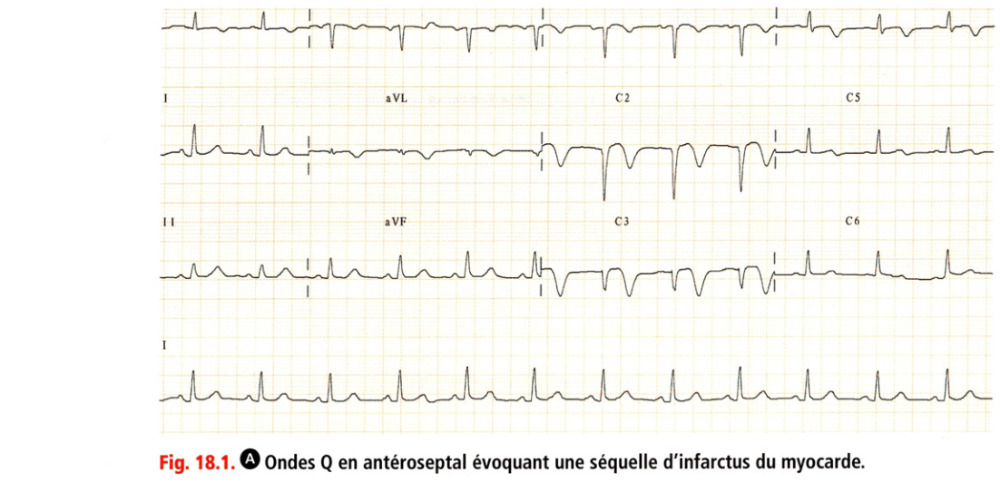
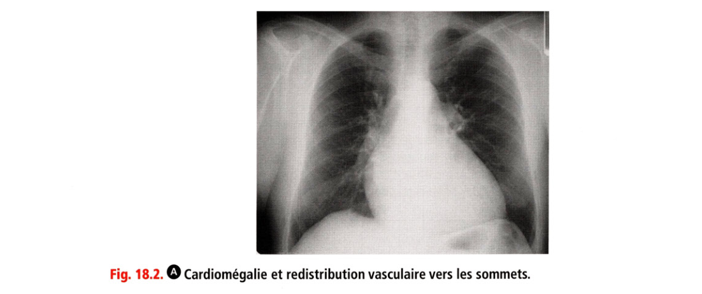
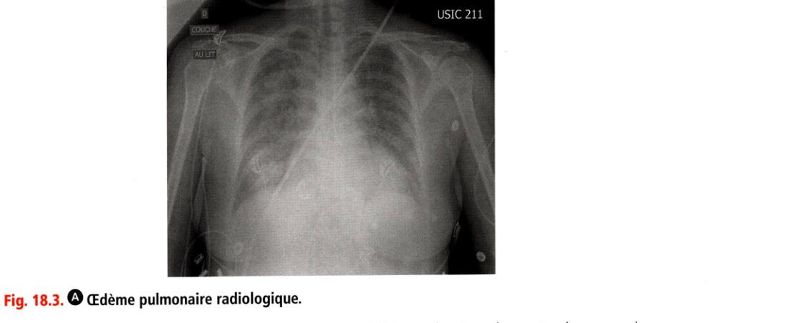
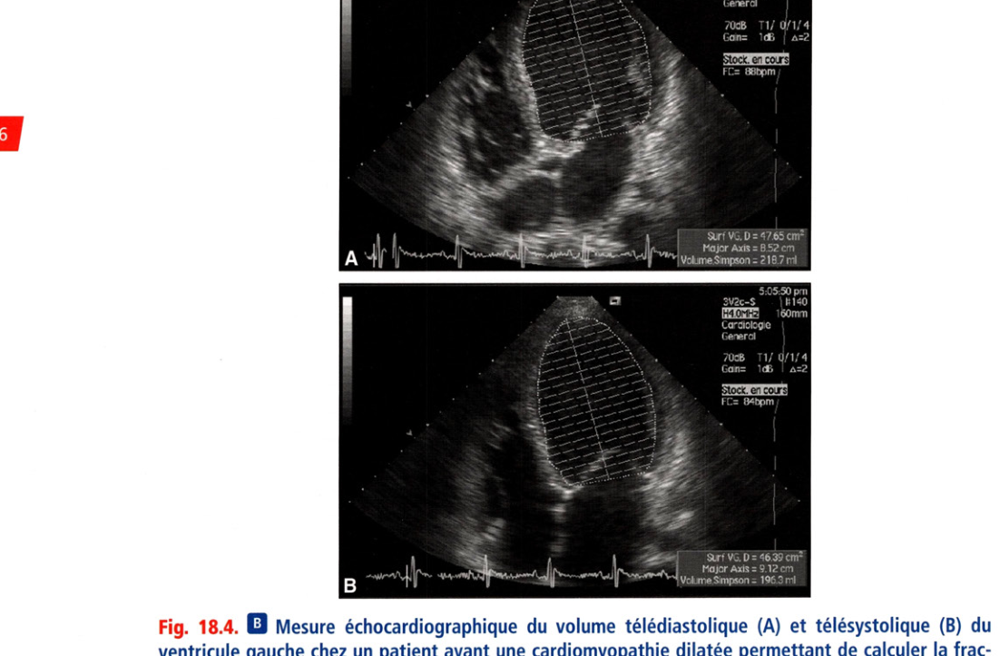
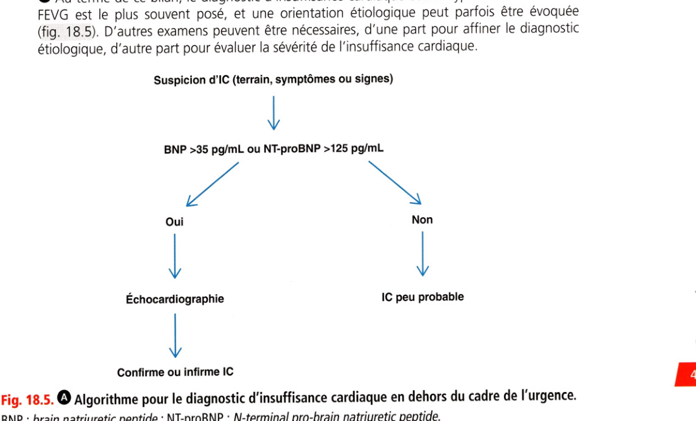
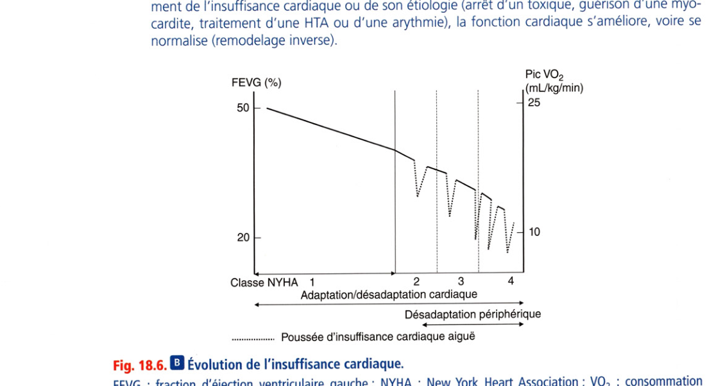
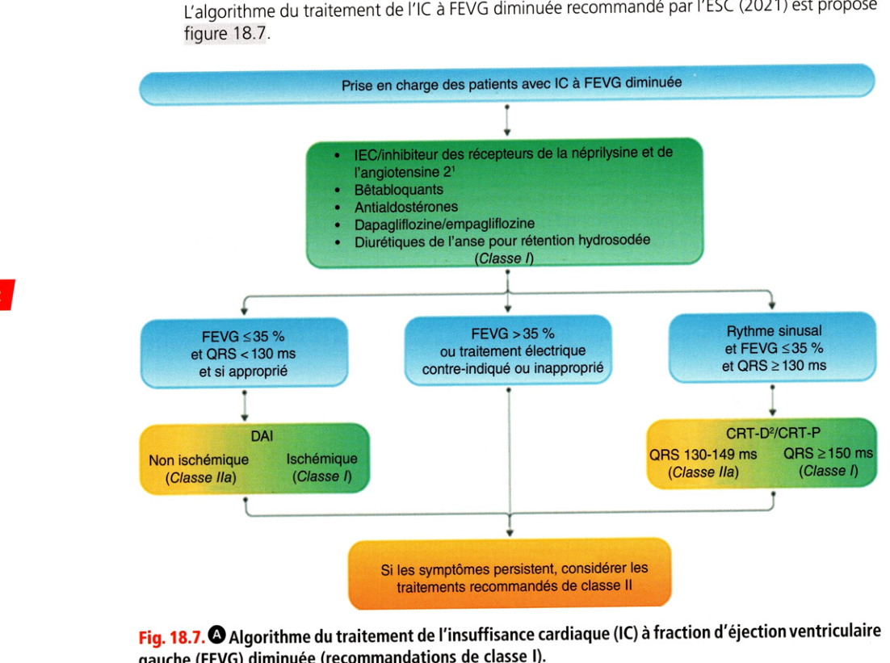

# Item 234 — Insuffisance cardiaque de l'adulte

> **Collège CNEC / SFC** · 3e édition (2025) · p. 425–462 · R2C  
> Partie IV — Insuffisance cardiaque

---

## Trois repères à ne pas confondre

| Badge | Signification (R2C) |
|---|---|
| **Rang A** | Connaissances fondamentales de fin de 2e cycle |
| **Rang B** | Connaissances essentielles, plus spécialisées |
| **Rang C** | Connaissances de 3e cycle (DES) |

Les pastilles du livre (● = A, ■ = B) sont reprises inline.

---

## Situations de départ

18 Découverte d'anomalies à l'auscultation cardiaque.  
20 Découverte d'anomalies à l'auscultation pulmonaire.  
21 Asthénie.  
42 Hypertension artérielle.  
50 Malaise/perte de connaissance.  
54 Œdème localisé ou diffus.  
159 Bradycardie.  
160 Détresse respiratoire aiguë.  
161 Douleur thoracique.  
162 Dyspnée.  
165 Palpitations.  
166 Tachycardie.  
178 Demande/prescription raisonnée et choix d'un examen diagnostique.  
185 Réalisation et interprétation d'un électrocardiogramme (ECG).  
201 Dyskaliémie.  
204 Élévation des enzymes cardiaques.  
232 Demande d'explication d'un patient sur le déroulement, les risques et les bénéfices attendus d'un examen d'imagerie.  
239 Explication préopératoire et recueil de consentement d'un geste invasif diagnostique ou thérapeutique.  
248 Prescription et suivi d'un traitement par anticoagulant et/ou antiagrégant.  
253 Prescrire des diurétiques.  
271 Prescription et surveillance d'une voie d'abord vasculaire.  
285 Consultation de suivi et éducation thérapeutique d'un patient avec un antécédent cardiovasculaire.  
287 Consultation de suivi et éducation thérapeutique d'un patient insuffisant cardiaque.  
320 Prévention des maladies cardiovasculaires.  
328 Annonce d'une maladie chronique.  
352 Expliquer un traitement au patient (adulte/enfant/adolescent).  
354 Évaluation de l'observance thérapeutique.  
355 Organisation de la sortie d'hospitalisation.

---

## Hiérarchisation des connaissances

| Rang | Rubrique | Intitulé | Descriptif |
|---|---|---|---|
| **A** | Épidémiologie | Épidémiologie de l'IC | Vieillissement, amélioration du traitement des pathologies CV |
| **A** | Définition | IC à FE diminuée ou conservée | Définir HFrEF / HFpEF |
| **A** | Définition | OAP cardiogénique | IC gauche → œdème pulmonaire transsudatif |
| **A** | Définition | Choc cardiogénique | Défaillance aiguë sévère, hypoperfusion, anoxie tissulaire |
| **A** | Physiopathologie | IC gauche et droite | Débit, FE, remodelage, désynchronisation, arythmies ; ICD souvent secondaire à ICG |
| **A** | Physiopathologie | OAP cardiogénique vs lésionnel | Œdème hydrostatique vs lésion de membrane alvéolocapillaire |
| **A** | Diagnostic positif | Diagnostics différentiels de l'OAP | Pneumonie, exacerbation de BPCO, asthme |
| **A** | Diagnostic positif | IC à FE diminuée ou conservée | Valeurs seuils de FEVG |
| **A** | Diagnostic positif | Diagnostic d'une IC | Signes fonctionnels, NYHA, signes physiques, tableaux cliniques |
| **B** | Examens complémentaires | Bilan d'une IC | ECG, biologie, indications coronarographie / coroscanner |
| **A** | Examens complémentaires | Examens en urgence dans l'OAP | ECG, GDS, radio thorax, biologie, BNP/NT-proBNP, troponine, ETT |
| **A** | Examens complémentaires | BNP / NT-proBNP | Intérêt et limites pour diagnostic et suivi |
| **A** | Examens complémentaires | ETT | Diagnostic positif et étiologique |
| **A** | Examens complémentaires | Sémiologie radiographique de l'OAP | Syndrome alvéolo-interstitiel gravitodépendant, Kerley, redistribution, épanchements |
| **A** | Étiologies | Principales étiologies | Ischémique, HTA, valvulopathies, cardiomyopathies, rythmiques |
| **A** | Identifier une urgence | Diagnostic d'un OAP | Détresse respiratoire, orthopnée, crépitants, tachycardie, galop, signes de gravité |
| **A** | Prise en charge | Traitement d'urgence de l'OAP | Diurétiques de l'anse, dérivés nitrés, oxygénothérapie |
| **A** | Prise en charge | Mesures hygiénodiététiques, ETP, réadaptation | Régime pauvre en sel, observance, signes d'alerte |
| **A** | Prise en charge | Classes médicamenteuses HFrEF | Cardioprotecteurs, diurétiques, réadaptation |
| **A** | Suivi / pronostic | Complications de l'IC | Décès, décompensations, rythme, embolie, hypotension, IR |
| **A** | Identifier une urgence | Diagnostiquer un choc cardiogénique | PA, perfusion périphérique, oligurie, conscience |
| **A** | Prise en charge | Traitement du choc cardiogénique | Inotropes, diurétiques |

---

## Parcours Rang A

- [I. Généralités](#i-généralités)
- [II. Diagnostic](#ii-diagnostic)
- [III. Diagnostic étiologique](#iii-diagnostic-étiologique)
- [IV. Formes cliniques](#iv-formes-cliniques)
- [V. Évolution, complications, pronostic](#v-évolution-complications-pronostic)
- [VI. Traitement de l'insuffisance cardiaque chronique](#vi-traitement-de-linsuffisance-cardiaque-chronique)
- [VII. Traitement de l'insuffisance cardiaque aiguë](#vii-traitement-de-linsuffisance-cardiaque-aiguë)

---

## Sommaire

- [Vignette clinique](#vignette-clinique)
- [I. Généralités](#i-généralités)
- [II. Diagnostic](#ii-diagnostic)
- [III. Diagnostic étiologique](#iii-diagnostic-étiologique)
- [IV. Formes cliniques](#iv-formes-cliniques)
- [V. Évolution, complications, pronostic](#v-évolution-complications-pronostic)
- [VI. Traitement de l'insuffisance cardiaque chronique](#vi-traitement-de-linsuffisance-cardiaque-chronique)
- [VII. Traitement de l'insuffisance cardiaque aiguë](#vii-traitement-de-linsuffisance-cardiaque-aiguë)
- [Points](#points)
- [Notions indispensables et inacceptables](#notions-indispensables-et-inacceptables)
- [Réflexes transversalité](#réflexes-transversalité)
- [Entraînement](../../Entrainement/QI/234_Insuffisance_cardiaque.md)

---

## Vignette clinique

M. R, 72 ans, consulte aux urgences pour une dyspnée aiguë. Il présente une HTA traitée par amlodipine, un diabète de type 2 traité par metformine, une obésité (IMC 32 kg/m²), un tabagisme sevré depuis 1 an, et une notion de BPCO. Il n’a pas de cardiopathie connue. À l'examen, il est polypnéique au repos, sa pression artérielle est à 172/82 mmHg, le rythme est rapide et irrégulier, les bruits du cœur sont assourdis.

>  Quelle prise en charge immédiate envisagez-vous ?

>  Quels éléments sont en faveur d’un œdème aigu pulmonaire (OAP) ?

>  Comment le confirmer ?

>  Quels facteurs déclenchants rechercher ?

>  Quels diagnostics différentiels éliminer ?

> Si l'OAP est confirmé, quels traitements mettre en œuvre et dans quel délai ?

>  Une fois l’épisode aigu contrôlé, quelle prise en charge thérapeutique envisagez-vous pour le moyen et le long terme ?

# I. Généralités

**Rang A.**

## A. Définition

**Rang A.** Toutes les pathologies cardiovasculaires, si elles ne sont pas dépistées ou traitées à temps et si elles sont suffisamment graves, peuvent conduire à l'insuffisance cardiaque (IC).

• D'un point de vue physiopathologique, l'IC peut être définie comme l'incapacité du cœur à délivrer un débit adapté aux besoins de l'organisme et/ou à fonctionner avec des pressions de remplissages normales.

• D'un point de vue clinique (encadré 18.1), l'IC est un syndrome défini par l'association de symptômes, de signes cliniques (dyspnée, fatigue, prise de poids, œdèmes, etc.) et d'un dysfonctionnement cardiaque responsable d'un débit cardiaque insuffisant et/ou des pressions intracardiaques élevées à l'effort ou au repos et/ou d'une rétention hydrosodée ; ce dysfonctionnement peut être d'origine myocardique, valvulaire, péricardique, ou lié à une anomalie du rythme ou de la conduction.

**Encadré 18.1 — Définition de l'insuffisance cardiaque (ESC 2021)**

L'insuffisance cardiaque est un **syndrome clinique** constitué de symptômes cardinaux (dyspnée, œdème des chevilles, fatigue) qui peuvent être accompagnés de signes (turgescence jugulaire, crépitants pulmonaires, œdèmes périphériques). Il est dû à une **anomalie de structure et/ou de fonction du cœur**, entraînant une élévation des pressions intracardiaques et/ou un débit cardiaque inadapté au repos et/ou à l'effort.

Source : McDonagh TA et al. 2021 ESC Guidelines for the diagnosis and treatment of acute and chronic heart failure. *Eur Heart J* 2021 ; 42 : 3599–726.

Le diagnostic peut être difficile car les symptômes ne sont pas spécifiques et les signes ne sont pas sensibles (dans la mesure où la rétention hydrosodée peut disparaître rapidement sous traitement). De plus, l'apparition des symptômes peut être précédée par une période plus ou moins longue de dysfonctionnement cardiaque systolique ou diastolique asymptomatique, dont le dépistage permet l'instauration de traitement et l'amélioration du pronostic en cas de dysfonctionnement systolique.

## B. Épidémiologie

**Rang A.** On estime que la prévalence de l'insuffisance cardiaque dans la population générale est entre 1 et 2 %. Toutes les études sont concordantes pour retrouver une augmentation de la prévalence avec l'âge, l'âge moyen du diagnostic en Europe se situant entre 75 et 80 ans. Le vieillissement de la population, la meilleure prise en charge des facteurs de risque cardiovasculaire et des événements coronariens, et le fait que cette pathologie soit actuellement mieux dépistée et mieux prise en charge, expliquent que la prévalence de l'IC augmente dans la population, alors même que l'incidence standardisée sur l'âge tend à diminuer.

## C. Physiopathologie

### 1. Quelques rappels simples

• Le débit cardiaque (DC) dépend du volume d'éjection systolique ventriculaire (VES) et de la fréquence cardiaque (FC) : DC = VES x FC.

• Le VES dépend de la précharge (degré de remplissage du VG et d'étirement des fibres en fin de diastole), de la postcharge (ensemble des forces s'opposant à l'éjection) et de la contractilité du cœur (inotropie). Le VES est la différence entre le volume ventriculaire maximal en fin de diastole (ou volume télédiastolique, VTD) et le volume ventriculaire minimal en fin de systole (ou volume télésystolique, VTS).

• La fraction d'éjection (FE) est la fraction de sang éjectée à chaque systole en pourcentage du VTD : FE = VES/VTD = (VTD - VTS)/VTD. La fraction d'éjection est le paramètre le plus utilisé pour caractériser la fonction systolique.

• Un dysfonctionnement de la pompe cardiaque peut avoir deux conséquences principales : - une baisse du débit cardiaque ou une incapacité du débit à augmenter quand cela est nécessaire (effort) pour perfuser les différents organes de manière adaptée ; - une augmentation des pressions de remplissage (diastolique) intraventriculaires qui se transmettent en amont : - pour le ventricule gauche, cette augmentation de la pression télédiastolique du ventricule gauche se transmet à l'oreillette gauche, puis aux veines pulmonaires, aux capillaires pulmonaires, puis à la circulation artérielle pulmonaire et aux cavités droites, - au niveau du ventricule droit, l'augmentation des pressions diastoliques se transmet à l'oreillette droite, puis à la circulation veineuse systémique, entraînant une gêne au retour veineux et une stase au niveau hépatique et jugulaire.

**Rang A.** Lorsque la pression capillaire pulmonaire s'élève au-delà d'environ **25 mmHg**, un passage de liquide (transsudat) des capillaires vers les alvéoles pulmonaires peut survenir : c'est l'**œdème aigu pulmonaire cardiogénique** (hydrostatique).

**Rang A.** Par opposition, l'**œdème pulmonaire lésionnel** non cardiogénique est dû à des lésions de la membrane alvéolocapillaire (origines nombreuses), avec accumulation intra-alvéolaire. La distinction a une implication immédiate thérapeutique.

### 2. En cas de dysfonction cardiaque

L'organisme réagit en mettant en jeu des mécanismes compensateurs destinés à maintenir le débit cardiaque et les pressions de perfusion des différents organes ; ces mécanismes aboutissent à augmenter le travail et la consommation d'oxygène du cœur et à favoriser les processus d'hypertrophie et de fibrose.

### Mécanismes cardiaques

• Le remodelage cardiaque est défini comme les changements de la géométrie des cavités cardiaques : - la dilatation ventriculaire. En cas d'altération de la fraction d'éjection (ex : infarctus du myocarde, cardiomyopathie dilatée), le volume télésystolique (volume résiduel après l'éjection ventriculaire) est augmenté. Lors de la diastole suivante, la pression télédiastolique a tendance à augmenter, d'où une majoration de la contrainte sur les parois, qui contribue progressivement à accroître le volume télédiastolique (remodelage ou hypertrophie excentrique). Cette dilatation ventriculaire est un processus très important dans la compensation. Par exemple, si un volume télédiastolique passe de 100 à 200 mL, alors que la fraction d'éjection ventriculaire gauche a diminué de 60 à 30 %, on remarque que le volume d'éjection ventriculaire reste conservé à 60 mL ; L'effet délétère est une augmentation de la contrainte pariétale (qui est proportionnelle au rayon de la cavité). - l'hypertrophie des parois pour faire face à une augmentation de pression systolique (ex : HTA, sténose aortique). L'augmentation de l'épaisseur des parois permet de normaliser la contrainte de la paroi ventriculaire selon la loi de Laplace (hypertrophie concentrique) : Contrainte = P développée x Rayon de la cavité/Épaisseur de la paroi. L'effet délétère est une augmentation du travail cardiaque et de la rigidité des parois.

• D'après la loi de Starling, l'étirement des fibres lié à l'augmentation de la pression au moment du remplissage cardiaque (précharge) s'accompagne d'une augmentation de l'inotropie du ventricule jusqu'à une certaine limite de dilatation.

• La tachycardie, sous la dépendance de l'activation du système sympathique, contribue également à maintenir le débit cardiaque (DC = VES x FC). L'effet délétère est une augmentation du travail cardiaque et de la consommation en oxygène du cœur.

### Mécanismes extracardiaques

• La vasoconstriction, en réponse à l'activation du système sympathique et du système rénine-angiotensine, contribue à maintenir une pression de perfusion. Elle est inhomogène car elle épargne certains territoires (circulation cérébrale et coronarienne) aux dépens d'autres territoires (cutanés, muscles, rate, rein, etc.). L'effet délétère est une augmentation du travail cardiaque.

• La rétention hydrosodée, liée à la baisse de la perfusion rénale et à la diminution de l'excrétion sodée (liée à l'activation du système rénine-angiotensine), contribue à augmenter le volume circulant et à augmenter la précharge (Starling). L'effet délétère est la survenue de signes congestifs cliniques (œdèmes, épanchements, etc.).

• L'activation neurohormonale met en jeu de nombreux systèmes neurohormonaux mais les plus importants sont le système sympathique et le système rénine-angiotensine-aldostérone avec les conséquences que nous avons déjà vues. Les effets délétères sont une augmentation du travail cardiaque, des effets proarythmiques, des effets toxiques directs des catécholamines sur les myocytes, etc.

### 3. Désynchronisation

La désynchronisation cardiaque peut aggraver une insuffisance cardiaque. On parle de désynchronisation quand tous les segments myocardiques ne se contractent pas de manière synchrone le plus souvent du fait d'un trouble de conduction : dans le bloc de branche gauche qui est l'exemple le plus démonstratif, la dépolarisation se fait de proche en proche en commençant par le septum interventriculaire pour finir par la paroi latérale, d'où une contraction retardée de la paroi latérale. Ce phénomène peut contribuer à aggraver une insuffisance cardiaque.

### 4. Insuffisance cardiaque à fraction d'éjection diminuée ou préservée

Une fois éliminée une cause réversible ou curable (ex : valvulopathie), on distingue deux mécanismes principaux d'IC :

• IC à fraction d'éjection diminuée (anciennement appelée IC systolique) : le mécanisme principal est un défaut de contraction et donc d'éjection du VG. Le volume de sang éjecté à chaque systole est diminué et le VG a tendance à se dilater. Elle est définie par une fraction d'éjection < 40 % ;

• IC à fraction d'éjection préservée (anciennement appelée IC diastolique) : le mécanisme principal est un problème de remplissage ; le cœur se vide bien, mais ne se remplit pas bien. En général, la cavité VG n'est pas dilatée et les parois sont souvent épaissies avec présence de fibrose : le VG est donc plus rigide et toute augmentation de volume entraîne une augmentation importante de la pression diastolique. Cette IC est définie par une FE > 50 %. Ce mécanisme d'IC est plus fréquent chez le sujet âgé et chez la femme, et plus souvent associé à l'HTA et à l'obésité. Lorsque la fraction d'éjection est entre 41 et 49 %, on parle d'IC à FE légèrement diminuée ; cette forme d'insuffisance cardiaque se rapprochant finalement plus de l'IC à FE diminuée. La distinction entre ces différentes formes a surtout des implications thérapeutiques, car les études évaluant l'efficacité des médicaments ont inclus les patients sur des critères de fraction d'éjection.

### 5. Arythmies

Les troubles du rythme sont fréquents dans l'IC.

• La fibrillation atriale est favorisée par la dilatation de l'atrium secondaire à l'augmentation des pressions intracavitaires. La perte de la systole atriale s'accompagne souvent d'une aggravation de l'IC et d'une augmentation du risque d'AVC.

• Les troubles du rythme ventriculaires sont également fréquents. Ils sont favorisés par les plages de fibrose intramyocardiques qui favorisent les phénomènes de réentrées, les anomalies du couplage du calcium, la stimulation du système sympathique. Les troubles du rythme ventriculaires graves (TV, FV) sont à l'origine de la plupart des morts subites et expliquent l'intérêt du défibrillateur automatique implantable.

---

# II. Diagnostic

**Rang A** · **Rang B**.

## A. Signes fonctionnels

### 1. Symptômes respiratoires

**Rang A.** La dyspnée d'effort, fréquente mais peu spécifique, est souvent révélatrice de la maladie. Le degré d'effort pour lequel elle apparaît permet de quantifier la tolérance fonctionnelle de la maladie et représente un bon reflet de sa sévérité. La classification de loin la plus utilisée est celle de la New York Heart Association (NYHA) (tableau 18.1).

**Tableau 18.1.** Classification NYHA (New York Heart Association).

| Stade | Définition |

|---|---|

| **I** | Absence de dyspnée, palpitations ou fatigue pour les efforts habituels : aucune gêne n'est ressentie dans la vie courante |

| **II** | Dyspnée, palpitations ou fatigue pour des efforts importants habituels (marche rapide ou en côte, montée des escaliers > 2 étages) |

| **III** | Dyspnée, palpitations ou fatigue pour des efforts peu intenses de la vie courante (marche en terrain plat, montée des escaliers < 2 étages) |

| **IV** | Dyspnée, palpitations ou fatigue permanente de repos ou pour des efforts minimes (s'habiller, se laver) |

Adapté de l'American Heart Association.

• L'orthopnée est plus spécifique. Il s'agit d'une dyspnée de décubitus, obligeant à dormir la tête surélevée par des oreillers, ou en position demi-assise ou assise. Elle est liée à la redistribution en décubitus des volumes sanguins vers le thorax qui s'associe à une augmentation de pression dans la circulation pulmonaire et surtout dans le capillaire pulmonaire.

• La dyspnée paroxystique nocturne, également plus spécifique, réveille le patient au cours de la nuit et l'oblige à se lever pour reprendre son souffle (début d'œdème pulmonaire). Certains signes respiratoires peuvent être trompeurs et orienter vers une origine pulmonaire :

• l'asthme cardiaque est une bradypnée expiratoire avec respiration sifflante pouvant faussement orienter vers une cause pulmonaire ;

• la toux, lorsqu'elle survient électivement à l'effort ou au décubitus, doit faire évoquer le diagnostic d'insuffisance cardiaque ;

• les hémoptysies, rarement isolées, traduisent l'hypertension veineuse pulmonaire. L'insuffisance cardiaque peut aussi se manifester par une dyspnée aiguë de repos, au cours de l'œdème aigu pulmonaire (cf. infra A. Insuffisance cardiaque aiguë) : cette crise d'étouffement oblige le patient à rester en position assise, s'accompagne d'anxiété, de sueurs, d'un grésillement laryngé, avec toux ramenant une expectoration mousseuse. Lorsque la crise est spontanément résolutive, on parle de subœdème pulmonaire.

### 2. Autres symptômes

L'insuffisance cardiaque peut aussi s'accompagner :

• d'une fatigue de repos liée à l'hypotension artérielle ou à l'effort ;

• d'une prise de poids associée à des œdèmes ;

• d'une faiblesse musculaire, qui doit parfois faire rechercher une myopathie associée, surtout dans le cas d'une cardiomyopathie dilatée ;

• de palpitations. En cas d'insuffisance cardiaque sévère ou terminale, on peut observer :

• des troubles respiratoires (syndrome d'apnées du sommeil avec respiration de Cheyne-Stokes). La prévalence du syndrome d'apnées du sommeil est augmentée dans l'IC ;

• des troubles neurologiques (confusion liée à un bas débit cérébral) ;

• des troubles digestifs (douleurs abdominales, nausées, vomissements).

### 3. Symptômes d'insuffisance cardiaque droite

L'hépatalgie d'effort ou de repos est une pesanteur douloureuse de l'hypocondre droit survenant d'abord à l'effort, puis au repos, secondaire à la distension de la capsule hépatique. Ces signes peuvent s'associer aux précédents dans l'insuffisance cardiaque globale ou à une dyspnée liée à la maladie pulmonaire sous-jacente.

## B. Signes physiques

En dehors d'une poussée aiguë de la maladie, l'examen physique du patient insuffisant cardiaque est souvent assez pauvre, notamment lorsqu'il est traité. La présence de signes physiques d'insuffisance cardiaque est donc un élément de gravité, traduisant une rétention hydrosodée ou un bas débit périphérique.

• Au niveau cardiaque, la palpation permet parfois de noter un choc de pointe dévié vers l'aisselle, lié à une dilatation ventriculaire gauche. L'auscultation peut retrouver : - une tachycardie plutôt modérée, et souvent absente chez les patients sous bêtabloquants, parfois un rythme irrégulier en cas de fibrillation ou flutter atrial ou d'extrasystoles atriales ou ventriculaires ; - un bruit de galop protodiastolique (B3), difficile à rechercher par le non-spécialiste ; - un éclat du B2 au foyer pulmonaire en cas d'hypertension artérielle pulmonaire ; - un souffle d'insuffisance mitrale ou d'insuffisance tricuspidienne fonctionnelles ; - enfin, un souffle anormal en faveur d'une valvulopathie organique (insuffisance mitrale, insuffisance aortique, rétrécissement aortique, rétrécissement mitral).

• Au niveau pulmonaire, l'auscultation recherche : - des râles crépitants ou sous-crépitants, qui sont le plus souvent bilatéraux ; - un éventuel épanchement pleural. S'il est confirmé par la radiographie thoracique et sudatif de l'épanchement (concentration en protides < 30 g/L).

• Au niveau artériel, le pouls peut être rapide (signe souvent absent chez les patients sous bêtabloquants). La pression artérielle systolique peut être normale, basse ou élevée ; lorsqu'elle est basse (PAS < 100 mmHg), c'est un facteur de gravité traduisant la diminution du volume d'éjection systolique ou les effets hypotenseurs des médicaments. Néanmoins, en cas d'insuffisance cardiaque d'origine hypertensive, une pression artérielle élevée peut être contemporaine d'une insuffisance cardiaque, y compris au cours d'un OAP (OAP hypertensif).

• Les signes périphériques d'insuffisance cardiaque droite traduisent la rétention hydrosodée et l'augmentation de la pression dans la circulation veineuse systémique liée à la diminution du retour veineux, elle-même secondaire à l'augmentation de pression dans les cavités droites. Il s'agit de : - la turgescence jugulaire : dilatation anormale de la veine jugulaire, chez un patient en position demi-assise. Signe très spécifique, il est parfois difficile à rechercher chez les sujets obèses ; - le reflux hépatojugulaire : dilatation anormale de la veine jugulaire après compression manuelle du foie, due à la congestion hépatique et à l'incapacité du cœur droit à assimiler le volume sanguin supplémentaire ainsi déplacé par la compression ; ce signe se recherche dans la même position que précédemment ; - l'hépatomégalie régulière, ferme et douloureuse à la compression. L'existence d'une fuite tricuspidienne volumineuse peut être à l'origine d'une expansion systolique palpable du foie ; - les œdèmes périphériques : mous, blancs, indolores, prenant le godet et prédominant dans les parties déclives du corps (membres inférieurs, région lombaire chez le patient alité) ; - l'ascite : souvent tardive, sauf dans les atteintes organiques de la valve tricuspide ou la péricardite chronique constrictive. Elle peut être trompeuse et orienter vers une cause hépatique. D'autres séreuses peuvent être touchées par cette accumulation de liquide, comme le péricarde, ce qui réalise parfois de véritables états d'anasarque.

• À un stade très avancé, l'insuffisance cardiaque peut s'accompagner d'un pouls alternant, d'une oligurie, d'une fonte musculaire, réalisant un véritable état cachectique. Cette cachexie peut être due à une perte d'appétit, au déconditionnement physique ou aux troubles digestifs (malabsorption, hypoperfusion mésentérique et hépatique). Une dyspnée de Cheyne-Stokes est parfois notée chez le patient insuffisant cardiaque au cours du sommeil, secondaire à une diminution de la sensibilité des centres respiratoires au CO2.

## C. Électrocardiogramme

L'ECG est peu contributif pour le diagnostic d'insuffisance cardiaque. Il permet parfois d'orienter vers une étiologie (onde Q de nécrose en faveur d'un infarctus ancien ou troubles du rythme par exemple) (fig. 18.1). Des signes d'hypertrophie atriale ou ventriculaire gauche ou droite sont parfois notés en fonction de l'étiologie. L'existence d'un bloc de branche, en particulier gauche (durée du QRS > 120 ms), est un élément important à prendre en compte vu les implications thérapeutiques actuelles (cf. 1. Resynchronisation ventriculaire par un stimulateur biventriculaire [ou pacemaker triple chambre]).

**Fig. 18.1.** Ondes Q en antéroseptal évoquant une séquelle d'infarctus du myocarde

## D. Radiographie thoracique

Même si elle a perdu de l'intérêt depuis l'essor de l'échocardiographie pour apprécier la taille du cœur, elle est toujours réalisée en cas de dyspnée aiguë et reste primordiale pour évaluer le retentissement pleuropulmonaire. En cas de dilatation cardiaque, la silhouette cardiaque est augmentée de volume, et le rapport cardiothoracique (RCT) est augmenté (> 0,5) (fig. 18.2). L'absence de cardiomégalie ne doit pas faire remettre en cause le diagnostic d'insuffisance cardiaque (dans l'insuffisance cardiaque à fraction d'éjection préservée, l'absence de dilatation ventriculaire est fréquente).

**Fig. 18.2.** Cardiomégalie et redistribution vasculaire vers les sommets

Les signes radiologiques traduisant la stase pulmonaire sont, selon une gravité croissante :

• la redistribution vasculaire de la base vers les sommets ;

• l'œdème interstitiel avec lignes B de Kerley, aspect flou des gros vaisseaux hilaires et images réticulonodulaires prédominant aux bases ;

• l'œdème alvéolaire, qui se traduit par des opacités floconneuses à contours flous partant des hiles vers la périphérie (aspect dit « en ailes de papillon ») (fig. 18.3). Ces opacités sont le plus souvent bilatérales mais des formes unilatérales trompeuses peuvent se voir.

**Fig. 18.3.** Œdème pulmonaire radiologique

Enfin, la radiographie thoracique peut mettre en évidence des épanchements pleuraux uni ou bilatéraux.

## E. Dosage des peptides natriurétiques (BNP ou NT-proBNP)

Le dosage du BNP ou du NT-proBNP est aujourd'hui recommandé en 1re intention pour le diagnostic de l'insuffisance cardiaque, avec une bonne valeur prédictive négative.

• Ces peptides natriurétiques sont synthétisés et libérés dans la circulation par les myocytes cardiaques lorsqu'ils sont étirés (c'est-à-dire en présence d'une augmentation de pression à l'intérieur des cavités droites ou gauches).

• Des valeurs de BNP < 100 pg/mL ou de NT-proBNP < 300 pg/mL rendent le diagnostic d'IC très improbable en présence d'une dyspnée aiguë avec une bonne valeur prédictive négative (situation d'un patient vu aux urgences pour une dyspnée aiguë).

• Des seuils plus bas sont proposés (BNP < 35 pg/mL, NT-proBNP <125 pg/mL) pour éliminer une IC en cas de présentations cliniques non aiguës (situation d'un patient vu en consultation pour une dyspnée chronique ou l'apparition d'œdème des membres inférieurs). Les recommandations de l'ESC 2021 indiquent que chez les patients avec des facteurs de risque d'insuffisance cardiaque, en présence de symptômes et/ou de signes ou un ECG anormal, il est nécessaire de doser les peptides natriurétiques pour le diagnostic d'insuffisance cardiaque. Lorsque les valeurs de BNP sont > 35 pg/mL ou de NT-proBNP > 125 pg/mL ou si l'insuffisance cardiaque est fortement suspectée ou si les peptides natriurétiques ne sont pas disponibles, il est nécessaire de réaliser une échocardiographie (cf. paragraphe suivant)

• Ces marqueurs permettent également d'orienter le diagnostic vers l'IC lorsque les concentrations sont très élevées (les valeurs seuils suivantes ont été proposées en faveur d'une origine cardiaque lors d'une dyspnée aiguë : BNP > 300 pg/mL ou NT-proBNP > 450 pg/mL chez le sujet de moins de 50 ans, > 900 pg/mL de 50 à 75 ans, > 1 800 pg/mL au-delà de 75 ans).

• Il existe donc des valeurs de BNP/NT-proBNP pour lesquelles le diagnostic est incertain et comme avec tout marqueur biologique, l'interprétation doit impérativement tenir compte des données cliniques.

• Certains facteurs tendent à augmenter (âge, insuffisance rénale, fibrillation atriale) ou diminuer (obésité) les concentrations de BNP/NT-proBNP.

## F. Échocardiographie transthoracique (ETT)

**Rang A.** Couplée au doppler, l'ETT est l'examen clé indispensable en cas d'insuffisance cardiaque ou de suspicion d'insuffisance cardiaque. Il permet de définir le type d'insuffisance cardiaque selon la FEVG (< 40, 41-49, > 50 %), de rechercher une étiologie éventuellement curable, de renseigner sur les conséquences hémodynamiques et enfin d'orienter le traitement.

**Rang A.** L'ETT permet d'évaluer (vidéos 18.1 et 18.2 ) :

• la taille du ventricule gauche qui peut être mesurée par les diamètres ou les volumes diastolique et systolique du VG (VTD ou VTS) (fig. 18.4) ;

• la fonction systolique du ventricule gauche mesurée par la fraction d'éjection (FEVG = (VTD

- VTS)/VTD, valeurs normales > 50-60 %) ;

• la taille et la fonction du ventricule droit, la taille de la veine cave inférieure ;

• la taille des atriums ;

• l'aspect des valves cardiaques ;

• le niveau des pressions de remplissage de manière semi-qualitative ;

• des indices hémodynamiques (débit cardiaque, pressions dans la circulation pulmonaire).

**Fig. 18.4.** Mesure échocardiographique des volumes télédiastolique (A) et télésystolique (B)

Elle peut en plus orienter vers une étiologie :

• anomalie de la cinétique segmentaire pouvant évoquer une pathologie ischémique ;

• valvulopathie organique (ex : insuffisance mitrale ou aortique, rétrécissement mitral ou aortique) ;

• hypertrophie en faveur d'une cardiopathie hypertensive, hypertrophie asymétrique (c'est-à-dire prédominant sur le septum interventriculaire [SIV]) en faveur d'une cardiomyopathie hypertrophique.

**Rang A.** Au terme de ce bilan, le diagnostic d'insuffisance cardiaque et son type en fonction de la FEVG est le plus souvent posé, et une orientation étiologique peut parfois être évoquée (fig. 18.5). D'autres examens peuvent être nécessaires, d'une part pour affiner le diagnostic étiologique, d'autre part pour évaluer la sévérité de l'insuffisance cardiaque.

**Fig. 18.5.** Algorithme pour le diagnostic d'insuffisance cardiaque hors urgence

## G. Examens biologiques standards

**Rang A.** Devant une insuffisance cardiaque ou une suspicion d'insuffisance cardiaque, les examens biologiques simples suivants sont demandés (recommandations de l'ESC 2021) en plus de l'ECG, l'échocardiographie et la radiographie thoracique :

• natrémie ;

• kaliémie ;

• créatininémie ;

• BNP ou NT-proBNP ;

• glycémie à jeun, HbA1c ;

• bilan lipidique ;

• bilan hépatique ;

• TSHus ;

• numération globulaire ;

• ferritinémie, coefficient de saturation de la transferrine.

## H. Autres examens complémentaires

• Le coroscanner est devenu aujourd'hui l'examen à privilégier chez les patients ayant une probabilité faible ou intermédiaire de maladie coronarienne pour éliminer cette étiologie, ou lorsque des tests de provocation d'ischémie myocardique ne permettent pas de trancher.

• La coronarographie est réservée aux patients ayant des manifestations d'angor, ou une probabilité intermédiaire à haute de maladie coronarienne, ou en cas d'ischémie documentée par des tests non invasifs (scintigraphie myocardique, échocardiographie ou IRM de stress) si le patient est potentiellement éligible à un geste de revascularisation. Si une ou des sténoses coronariennes sont mises en évidence et si elles s'accompagnent d'une ischémie ou d'une viabilité myocardique (dysfonction contractile d'origine ischémique potentiellement réversible en cas de revascularisation), une revascularisation doit être discutée. À l'opposé, en cas de FEVG basse, la normalité du réseau coronarien et l'absence d'autres causes orientent vers une cardiomyopathie dilatée (maladie du muscle cardiaque).

• L'IRM cardiaque peut : - compléter l'échocardiographie, notamment dans les rares cas où le patient n'est pas - orienter le bilan étiologique en recherchant des signes en faveur d'une myocardite, d'une dysplasie arythmogène du VD ou d'une cardiomyopathie primitive, d’une sarcoïdose cardiaque, d'une amylose cardiaque ; - aider au diagnostic de cardiopathie ischémique (rehaussement tardif sous-endocardique en faveur d'une séquelle d'infarctus du myocarde) et à l'évaluation de la viabilité afin d'orienter un geste de revascularisation ; - aider à l'évaluation du pronostic dans la cardiomyopathie dilatée, par la présence et l'importance du rehaussement tardif (qui est un marqueur de fibrose).

• La scintigraphie isotopique peut d'une part aider à la mesure de la fraction d'éjection ventriculaire gauche et droite chez les patients non échogènes (FE isotopique exceptionnellement pratiquée), et d'autre part évaluer la présence d'une ischémie myocardique ou d'une viabilité. La scintigraphie au technétium marqué permet aussi de faire le diagnostic d'amylose cardiaque à ttransthyrétine en cas de suspicion.

• L'enregistrement holter sur 24 heures (ou sur une durée plus longue) permet de dépister des troubles du rythme ventriculaires (ESV, TV non soutenue) ou supraventriculaire (fibrillation atriale), ou des troubles de la conduction atrioventriculaire.

• Une épreuve d'effort avec mesure de la consommation d'oxygène (VO2) permet une évaluation plus précise de la capacité fonctionnelle à l'effort des patients que les données de l'interrogatoire qui sont plus subjectives. Le pic de consommation d'oxygène à l'effort a une valeur pronostique, et une valeur très abaissée permet de discuter de l'indication d'une greffe cardiaque chez les patients éligibles.

• Le cathétérisme droit permet de mesurer directement les pressions pulmonaires et le débit cardiaque par la technique de thermodilution. Il consiste à introduire un cathéter par voie veineuse qui est monté dans l'artère pulmonaire via les cavités droites, puis dans une branche artérielle pulmonaire. Il permet de mesurer la pression dans l'atrium droit (normale < 5 mmHg), dans le ventricule droit (normale 25/0 mmHg), dans l'artère pulmonaire, puis dans le capillaire pulmonaire (PCAP ou PAPO [pression artérielle pulmonaire d'occlusion] < 15 mmHg). L'hypertension artérielle pulmonaire est définie comme une PAP moyenne > 25 mmHg. Enfin, le débit cardiaque normal est de 5 L/min, l'index cardiaque de 3 L/min/m2. La mesure simultanée de la pression et du débit permet d'estimer les résistances pulmonaires qui sont un paramètre important à prendre en compte avant une éventuelle greffe cardiaque (lorsque les résistances artérielles pulmonaires sont

> 5 unités Wood, la greffe cardiaque est contre-indiquée). On peut compléter le cathétérisme droit par un cathétérisme gauche qui permet de mesurer la pression télédiastolique du ventricule gauche.

---

# III. Diagnostic étiologique

**Rang A.**

**Rang A.** Toutes les pathologies cardiaques peuvent aboutir à l'insuffisance cardiaque.

## A. Cardiopathies ischémiques

• Elles représentent aujourd'hui la première cause d'insuffisance cardiaque.

• Elles sont le plus souvent la conséquence d'un ou de plusieurs infarctus du myocarde qui diminuent le nombre de myocytes fonctionnels, les remplacent par de la fibrose et entraînent une perte de la contractilité d'un ou plusieurs segments du ventricule gauche, d'où une baisse de la FEVG (vidéo 18.3).

• Parfois, il n'y a pas eu d'infarctus du myocarde, mais l'ischémie chronique provoquée par la maladie coronarienne est responsable d'une altération de la fraction d'éjection, qui peut être éventuellement réversible lorsque le patient est revascularisé (viabilité myocardique).

## B. Hypertension artérielle

L'HTA est également un facteur direct ou indirect d'insuffisance cardiaque. Elle agit :

• soit par le développement d'une hypertrophie cardiaque souvent associée à de la fibrose qui, en premier lieu, provoquent une altération de la fonction diastolique et du remplissage ventriculaire. Ce mécanisme est fréquemment en cause dans l'IC à fraction d'éjection préservée et se rencontre plus souvent chez le sujet âgé (plus de 50 % des formes d'insuffisance cardiaque) ;

• soit en favorisant le développement d'une maladie coronaire classique (HTA = un des principaux facteurs de risque d'athérosclérose) à l'origine d'infarctus du myocarde ou d'atteinte des petites artères coronaires ;

• soit par l'intrication des deux mécanismes précédents ;

• soit enfin en entraînant une altération de fraction d'éjection du fait de l'augmentation chronique de la postcharge. Dans ce cas, la baisse de la FEVG s'accompagne souvent d'une hypertrophie des parois.

## C. Cardiomyopathies

Ce sont des maladies du muscle cardiaque, leur diagnostic suppose donc que l'on ait éliminé une cause ischémique, valvulaire, congénitale ou une HTA.

### 1. Cardiomyopathies dilatées (CMD)

Elles sont définies par une atteinte du muscle cardiaque qui aboutit à une dilatation et une baisse de la FEVG. Cette pathologie peut parfois toucher des sujets jeunes (chez qui elle représente la 1re cause d'insuffisance cardiaque et de transplantation). Il existe de nombreuses causes de CMD (cf. vidéo 18.2) :

• dans environ 25 % des cas, maladie familiale (au moins deux apparentés du 1er degré atteints dans la même famille) en rapport avec une maladie monogénique (mutation sur un gène). Transmission le plus souvent (mais non exclusivement) autosomique dominante, et pénétrance variable, augmentant avec l'âge. Nombreux gènes impliqués (codant pour les protéines du sarcomère, du cytosquelette ou de la membrane nucléaire comme la lamine, etc.) et pour chaque gène, de nombreuses mutations différentes en cause ;

• origines toxiques (alcool, amphétamines, drogues comme la cocaïne) ;

• myocardites virales (coxsackie, cytomégalovirus, human herpes virus 6, VIH, etc.) ou bactériennes (brucellose, borréliose, etc.), maladie de Chagas ;

• causes auto-immunes (sarcoïdose, Churg et Strauss, sclérodermie, lupus) ;

• origines endocrines (dysthyroïdie, phéochromocytome, hypocalcémie d'une hypoparathyroïdie, etc.) ;

• causes nutritionnelles (carence en carnitine, thiamine, sélénium) ;

• cardiomyopathie liée à la grossesse (cardiomyopathie du péripartum) ;

• origines médicamenteuses (chloroquine, clozapine) ou chimiothérapie (anthracycline, trastuzumab),

• cardiomyopathie de stress (ou takotsubo). Il n'est cependant pas rare qu'aucune cause ne soit retrouvée.

### 2. Cardiomyopathies hypertrophiques (CMH)

• Elles sont caractérisées par une hypertrophie anormale des parois le plus souvent asymétriques et prédominant sur le SIV avec une cavité de taille normale ou petite, une fraction d'éjection conservée et un trouble du remplissage cardiaque (vidéo 18.4).

• Dans environ 25 % des cas, elles s'accompagnent d'une obstruction au niveau sous-aortique lors de l'éjection du fait de l'hypertrophie qui fait saillie dans la chambre de chasse du VG et d'un gradient de pression en systole entre le VG et l'aorte : on parle alors de CMH obstructive.

• En général, il s'agit d'une maladie familiale monogénique dont la transmission est le plus souvent autosomique dominante, en rapport avec des mutations sur les gènes codant les protéines du sarcomère (les plus fréquemment en cause sont le gène codant la chaîne lourde bêta de la myosine et celui codant la protéine C cardiaque). D'autres causes plus rares existent (ex : glycogénoses comme la maladie de Fabry = maladie génétique liée à un déficit de l'enzyme alphagalactosidase).

• Il existe une grande variabilité clinique avec des patients pouvant rester totalement asymptomatiques, mais la CMH peut se compliquer de mort subite (1re cause de mort subite chez le jeune athlète), d'insuffisance cardiaque ou de fibrillation atriale.

### 3. Cardiomyopathies restrictives

Elles sont plus rares ; la plus fréquente est représentée par l'amylose cardiaque (que l'on classe parfois également dans les cardiomyopathies hypertrophiques car les parois sont épaissies) dont les dépôts amyloïdes entraînent progressivement une infiltration extracellulaire à l'origine d'une augmentation d'épaisseur diffuse des parois, qui deviennent rigides et moins compilantes, d'où une difficulté majeure du remplissage cardiaque, la fonction systolique étant généralement atteinte plus tardivement. Le pronostic de l'amylose cardiaque est en général sévère lorsque des manifestations d'insuffisance cardiaque apparaissent.

## D. Valvulopathies gauches

Elles peuvent toutes se compliquer d'insuffisance cardiaque (insuffisance mitrale ou aortique, rétrécissement mitral ou aortique). Il s'agit d'un tournant évolutif grave qui justifie souvent une prise en charge radicale de la valvulopathie (remplacement valvulaire, plastie ou traitement percutané). La particularité du rétrécissement mitral est qu'il peut être à l'origine de manifestations d'insuffisance cardiaque gauche (OAP), alors même que le ventricule gauche n'est pas atteint.

## E. Troubles du rythme ventriculaire ou supraventriculaire ou de conduction

Une tachycardie rapide ou une bradycardie extrême peuvent provoquer une insuffisance cardiaque ou agir comme des facteurs déclenchants. Elles peuvent également entraîner une altération de la fraction d'éjection : par exemple, une fibrillation atriale rapide permanente et prolongée peut entraîner une cardiomyopathie (tachycardiomyopathie). Les extrasystoles fréquentes peuvent également contribuer à altérer la fonction. Le traitement du trouble du rythme permet souvent la guérison de l'insuffisance cardiaque.

## F. Causes péricardiques

Elles regroupent l'épanchement péricardique abondant, la tamponnade, la péricardite chronique constrictive.

## G. Étiologies de l'insuffisance cardiaque droite

• L'insuffisance cardiaque gauche représente la cause la plus fréquente d'insuffisance cardiaque droite par l'augmentation induite des pressions dans la circulation pulmonaire. On parle dans ce cas d'insuffisance cardiaque globale.

• Il existe cependant des causes d'insuffisance cardiaque droite isolée, comme : - toutes les pathologies pulmonaires qui, par le biais de l'hypoxémie, entraînent une vasoconstriction artérielle pulmonaire et une augmentation de la pression pulmonaire pouvant conduire à l'insuffisance cardiaque droite (on parle de cœur pulmonaire). L'embolie pulmonaire aiguë peut générer une insuffisance cardiaque droite aiguë brutale (cœur pulmonaire aigu), et les séquelles d'embolie pulmonaire grave conduire à un cœur pulmonaire chronique ; - l'hypertension artérielle pulmonaire primitive ou secondaire à certaines connectivités (sclérodermie) ; - la cardiomyopathie ventriculaire droite arythmogène (atteinte spécifique du ventricule droit) ; - les pathologies tricuspidiennes isolées : insuffisance tricuspidienne (IT) volumineuse post-traumatique après accident de la circulation, IT post-endocarditique chez un toxicomane, IT des syndromes carcinoïdes ; - l'infarctus du ventricule droit ; - la péricardite chronique constrictive.

## H. Insuffisance cardiaque à débit augmenté

Une augmentation permanente du débit peut entraîner une surcharge en volume du cœur et une insuffisance cardiaque. Cette situation se rencontre dans les anémies chroniques, les fistules artérioveineuses (FAV acquises chez les patients insuffisants rénaux en hémodialyse, FAV dans le cadre d'une maladie de Rendu-Osler), l'hyperthyroïdie, la carence en thiamine (béribéri) et la maladie de Paget (rare).

---

# IV. Formes cliniques

**Rang A** · **Rang B**.

## A. Insuffisance cardiaque aiguë

Elle peut être définie comme l'apparition généralement rapide de symptômes et de signes en rapport avec une altération de la fonction de la pompe cardiaque. Il peut s'agir d'une symptomatologie de novo chez un patient sans cardiopathie connue ou d'une aggravation des symptômes chez un patient porteur d'une cardiopathie connue. Elle nécessite le plus souvent une hospitalisation pour mettre en place un traitement intraveineux.

### 1. Œdème aigu pulmonaire cardiogénique

C'est la forme la plus typique ; elle représente une des grandes urgences cardiovasculaires. Il s'agit d'une détresse respiratoire aiguë liée à une inondation alvéolaire du fait d'une augmentation importante de la pression capillaire pulmonaire (transsudât qui passe du capillaire dans les alvéoles). Le tableau associe :

• une polypnée et une orthopnée obligeant le patient à garder la position assise ;

• des sueurs ;

• une cyanose ;

• un grésillement laryngé ;

• une toux ramenant classiquement une expectoration « mousseuse saumonée ». L'examen clinique peut retrouver un tirage sus-claviculaire et intercostal et l'auscultation pulmonaire révèle des râles crépitants remontant d'autant plus haut dans les champs pulmonaires que le tableau est sévère (« marée montante des râles crépitants »). L'OAP nécessite une prise en charge immédiate. Une poussée hypertensive peut accompagner un œdème pulmonaire. Les examens complémentaires ne doivent pas retarder l'instauration d'un traitement :

• dosage du BNP ou NT-proBNP : des valeurs basses doivent remettre en cause l'origine cardiogénique de la détresse respiratoire ;

• dosage de la troponine : une élévation modérée peut se rencontrer même en l'absence de pathologie coronarienne aiguë ;

• radiographie thoracique : opacités floconneuses périhilaires à contours flous bilatérales ;

• gazométrie artérielle : hypoxie/hypocapnie ;

• échocardiographie : mise en évidence d'une cardiopathie sous-jacente, mesure de la fraction d'éjection VG, évaluation des pressions intracardiaques. Devant une dyspnée aiguë, il faut savoir évoquer les principaux diagnostics différentiels (cf. chapitre 17) :

• pneumopathie aiguë : tableau infectieux, foyer de crépitants localisé, opacité systématisée à la radiographie de thorax, BNP/NT-proBNP normal ou peu augmenté ;

• embolie pulmonaire : contexte ou terrain favorisant, auscultation pulmonaire souvent normale ;

• exacerbation de BPCO : antécédents connus, ronchi, sibilants, expectoration ;

• crise d'asthme : antécédent, dyspnée expiratoire, sibilants.

### 2. Autres formes cliniques

• **Rang B.** Parfois, le tableau est moins aigu : il s'agit d'une aggravation progressive de la dyspnée qui devient invalidante et qui est associée à l'apparition ou l'aggravation de signes congestifs (œdèmes).

• Dans d'autres cas, il peut s'agir d'un tableau d'insuffisance cardiaque droite isolée.

• Il peut s'agir d'une insuffisance cardiaque aiguë survenant au cours d'un syndrome coronarien aigu, qui pose des problèmes particuliers dans la mesure où il faut à la fois prendre en charge le syndrome coronarien et traiter la poussée d'insuffisance cardiaque.

**Rang A.** Devant tout épisode d'insuffisance cardiaque aiguë, il faut rechercher des facteurs favorisants (encadré 18.2), en particulier si le patient présente une cardiopathie connue ou est insuffisant cardiaque chronique, le premier facteur étant une rupture de traitement ou de régime sans sel.

**Encadré 18.2 — Principaux facteurs déclenchants d'insuffisance cardiaque**

- **Rang A.** Rupture ou observance imparfaite au traitement

- Écarts de régime (sel)

- Surinfection bronchique

- Troubles du rythme (fibrillation atriale)

- Anémie

- Embolie pulmonaire

- Dysthyroïdie (amiodarone)

- Causes iatrogènes : antiarythmique déprimant la fonction cardiaque, bêtabloquants, AINS, inhibiteurs calciques (diltiazem, vérapamil), diminution trop importante de la précharge (diurétiques, vasodilatateurs)

- Poussée hypertensive

- Syndrome coronarien aigu, ischémie myocardique

### 3. Choc cardiogénique

• Il s'agit du tableau ultime d'une défaillance aiguë et sévère de la fonction cardiaque avec baisse du débit, entraînant une baisse profonde de la perfusion tissulaire périphérique et une anoxie tissulaire.

• Il s'accompagne d'un mauvais pronostic.

• Les signes cliniques comportent : - pression artérielle systolique < 90 mmHg ou chute de la PAS > 30 mmHg par rapport aux valeurs de bases pendant au moins 30 minutes ; - troubles de la perfusion périphérique : extrémités froides, cyanosées et marbrées ; - oligurie < 20 mL/h ; - sueurs ; - altération de la conscience (agitation, confusion mentale) ; - diminution du débit mesuré par échocardiographie.

## B. Insuffisance cardiaque chronique

Elle définit l'état du patient en dehors d'une décompensation aiguë. Le patient est ambulatoire, il garde une gêne fonctionnelle plus ou moins importante en fonction de la gravité de sa maladie, et suit le traitement prescrit par voie orale.

## C. Insuffisance cardiaque à fonction systolique conservée (ou IC à FE préservée, FEVG > 50 %)

Elle représente au moins 50 % des causes d'insuffisance cardiaque, en particulier chez la femme ou le sujet âgé. Le diagnostic repose sur :

• la présence de symptômes ou de signes d'insuffisance cardiaque ;

• la présence d'une fonction systolique normale à l'échocardiographie (FEVG > 50 %) (en l'absence de valvulopathie significative, d'anomalie du rythme ou de la conduction et de pathologie péricardique) ;

• une augmentation du BNP ou du NT-proBNP ;

• des arguments pour une augmentation des pressions de remplissage à l'ETT ou une hypertrophie ventriculaire gauche (HVG, définie par une masse VG indexée > 115 g/m2 chez l'homme, > 95 g/m2 chez la femme) ou une dilatation de l'atrium gauche en échocardiographie (volume AG indexé > 34 mL/m2).

---

# V. Évolution, complications, pronostic

**Rang A** · **Rang B**.

## A. Histoire naturelle, évolution

**Rang B.** Le délai entre l'apparition d'une dysfonction cardiaque et les premiers signes d'insuffisance cardiaque est très variable et peut aller de quelques minutes (infarctus étendu, insuffisance valvulaire aiguë liée à une rupture de cordage ou une endocardite, etc.) à plusieurs années (fig. 18.6); il est lié d'une part à l'importance et au caractère progressif (hypertension artérielle) ou soudain (infarctus du myocarde, insuffisance valvulaire aiguë) de l'agression initiale, et d'autre part à la capacité de la pompe cardiaque à mettre en jeu des processus efficaces d'adaptation. Lorsque des mécanismes de compensation ont le temps de se mettre en place, l'évolution est progressive, avec d'abord une période de dysfonction cardiaque asymptomatique au cours de laquelle le processus de remodelage cardiaque s'installe, puis une période où la dysfonction cardiaque devient telle que des manifestations d'insuffisance cardiaque apparaissent. L'état clinique du patient oscille alors entre des périodes de stabilité où la gêne fonctionnelle est plus ou moins importante et des épisodes d'insuffisance cardiaque aiguë souvent déclenchée par des facteurs favorisants. Il n'est cependant pas rare que sous l'effet du traitement de l'insuffisance cardiaque ou de son étiologie (arrêt d’un toxique, guérison d'une myocardite, traitement d'une HTA ou d'une arythmie), la fonction cardiaque s'améliore, voire se normalise (remodelage inverse). Pic VO2 (mL/kg/min) FEVG (%) .............. Poussée d’insuffisance cardiaque aiguë

**Fig. 18.6.** Évolution de l'insuffisance cardiaque

## B. Principales complications

Il peut s'agir :

• de décès : la mortalité reste élevée dans l'insuffisance cardiaque, elle est en moyenne de 50 % à 5 ans mais peut atteindre jusqu'à 40 à 50 % par an dans l'insuffisance cardiaque grave (NYHA IV). La mortalité est le plus souvent secondaire soit à une mort subite (décès brutal), généralement liée à des troubles du rythme ventriculaires (TV ou FV), soit à une insuffisance cardiaque réfractaire au traitement ;

• d'épisodes d'insuffisance cardiaque aiguë nécessitant une hospitalisation pour une administration de diurétiques intraveineux ou d'inotropes en cas de bas débit. Ces hospitalisations sont très fréquentes, on considère que l'IC est une des premières causes d'hospitalisation après 65 ans. Une hospitalisation pour décompensation cardiaque représente toujours un facteur de gravité ;

• de troubles du rythme ventriculaires (ESV, TV non soutenues ou soutenues) ou supraventriculaires (fibrillation atriale) ;

• de complications thromboemboliques : embolies systémiques (AVC, etc.) par formation de thrombus dans les cavités gauches dilatées favorisée par le bas débit ou la fibrillation atriale, embolie pulmonaire notamment lors des épisodes d'alitement ou des hospitalisations (patients à risque) ;

• d'hypotension artérielle parfois aggravée par les médicaments ;

• de troubles hydroélectrolytiques (hypo ou hyperkaliémie, hyponatrémie), insuffisance rénale favorisés par le bas débit rénal et les traitements ;

• d'une anémie, d'une carence martiale, d'un syndrome d'apnées du sommeil.

## C. Principaux facteurs pronostiques

Ce sont :

• des facteurs cliniques : classe NYHA III ou IV versus I ou II, hospitalisations répétées, étiologie ischémique, hypotension, tachycardie, troubles du rythme ventriculaire ;

• des facteurs hémodynamiques : fraction d'éjection basse, débit cardiaque diminué, pressions pulmonaires augmentées ;

• des caractéristiques ECG : augmentation de la durée des QRS > 120 ms (bloc de branche gauche) ;

• des facteurs biologiques : hyponatrémie, augmentation du BNP/NT-proBNP ;

• une diminution du pic de consommation d'oxygène lors de l'épreuve d'effort métabolique.

### Prise en charge des comorbidités

Les comorbidités cardiaques et non cardiaques associées à l'insuffisance cardiaque sont fréquentes, souvent associées chez un même patient et doivent être prises en charge pour améliorer la qualité de vie, réduire les réhospitalisations et augmenter la survie. Elles peuvent également être causes de décompensation cardiaque : HTA, diabète, obésité, pathologies respiratoires, maladie coronaire, insuffisance rénale, dyskaliémies, goutte, troubles du sommeil, carence martiale, anémie, démences, troubles cognitifs, AVC, troubles de l'humeur, anorexie, sarcopénie, fragilité. Elles entraînent une moindre tolérance aux traitements cardioprotecteurs, des erreurs de prise médicamenteuse, des effets indésirables plus fréquents et impactent leur rapport bénéfice/risque.

---

# VI. Traitement de l'insuffisance cardiaque chronique

**Rang A** · **Rang B**.

## A. Traitement étiologique et préventif

**Rang A.** La prévention de l'insuffisance cardiaque passe par la prise en charge de tous les facteurs étiologiques. Il peut s'agir :

• de diminuer le travail imposé au ventricule gauche dans les surcharges de pression (HTA, RA) ou de volume (IM, IA) par le contrôle de l'HTA ou la correction chirurgicale ou percutanée de la valvulopathie ;

• de traiter les facteurs de risque cardiovasculaire (statines chez les patients à haut risque ou en cas de maladie cardiovasculaire avérée) ;

• de traiter au mieux le diabète, en privilégiant les gliflozines chez les patients diabétiques à haut risque cardiovasculaire ou avec une maladie cardiovasculaire avérée ;

• de la reperfusion précoce à la phase aiguë de l'infarctus de myocarde pour limiter la taille de la nécrose et préserver le muscle cardiaque, ou de la revascularisation d'un muscle cardiaque ischémique ;

• de l'éviction des toxiques (alcool, cocaïne, etc.), la prévention de l'obésité, de la sédentarité, du tabagisme ;

• de la surveillance des chimiothérapies cardiotoxiques ;

• du contrôle d'un trouble du rythme. Toutes ces actions préventives sont destinées à préserver la structure et la fonction du myocarde et représentent les meilleurs traitements à long terme.

## B. Mesures hygiénodiététiques

Ces mesures générales s'adressent à presque tous les patients et restent fondamentales, bien qu'aucun essai ne les ait validées. Comme dans toutes les maladies chroniques, le succès du traitement dépend étroitement de l'éducation du patient et de la compréhension qu'il a de sa maladie.

### 1. Régime hyposodé

Toujours de mise, il consiste à bannir la salière de la table, à ne plus saler l'eau de cuisson des aliments, et à remettre au patient la liste détaillée des aliments contenant le plus de sel, à éviter. On vise à ne pas dépasser 5 à 6 g de sel par jour. Chez certains malades, le régime sans sel peut être nuisible en conduisant à un certain degré de dénutrition ; l'aide d'un diététicien peut dans ce cas s'avérer utile pour indiquer au patient d'autres agents de sapidité en remplacement (utiliser des épices, éviter les sels de régime qui contiennent du potassium). Si un écart de régime est fait, on peut alors conseiller au patient d'augmenter sa dose de diurétiques le jour même, voire le lendemain.

### 2. Surveillance du poids et des symptômes

La pesée régulière permet au patient de consulter rapidement si une prise de poids de 2 à 3 kg est constatée, a fortiori si elle est soudaine, en 2 à 3 jours. A contrario, une perte de poids progressive en l'absence d'œdème signe un certain degré de dénutrition, qui témoigne souvent de la gravité de l'insuffisance cardiaque et indique un mauvais pronostic. L'aggravation de la dyspnée, l'apparition d'une orthopnée ou l'apparition d'œdèmes des membres inférieurs ou d'un météorisme abdominal (signes d'alerte) doivent aussi alerter et inciter le patient à consulter sans attendre.

### 3. Alcool et tabac

En cas de cardiomyopathie dilatée, lorsqu'une consommation excessive a été repérée, l'arrêt total de l'alcool peut dans certains cas s'accompagner d'une régression partielle, voire totale de la cardiopathie. Ce conseil vaut également pour les autres causes, compte tenu du caractère potentiellement aggravant de l'alcool ; dans ce cas, il est licite de conseiller une réduction de la consommation, même si aucune donnée n'existe pour attester de l'efficacité de ces mesures. L'arrêt du tabac est impératif chez tous les patients, a fortiori s'ils sont atteints d'une cardiopathie ischémique.

### 4. Activité physique

L'exercice doit être encouragé en dehors des épisodes de décompensation. Contrairement à ce qui était préconisé il y a quelques années, le repos strict n'est pas souhaitable car le déconditionnement physique progressif ne fait qu'aggraver les symptômes à l'effort. On conseille une activité physique régulière et prolongée (marche par exemple) à un rythme n'essoufflant pas le malade.

### 5. Travail et réinsertion professionnelle

Dans l'insuffisance cardiaque avérée, la poursuite d'une activité professionnelle nécessitant des efforts physiques importants (manutention, port de charge, bâtiment et travaux publics) est proscrite, de même que certains emplois à risque (chauffeur de poids lourds ou de transport en commun par exemple), ainsi que les horaires décalés. Dans les cas les plus graves, une demande d'invalidité doit être envisagée. La reprise d'une activité physique peut se faire dans un centre de réadaptation cardiaque, dans lequel le patient peut aussi bénéficier de séances d'éducation thérapeutique.

### 6. Vaccinations

Les patients insuffisants cardiaques sont plus fragiles et une surinfection bronchopulmonaire peut parfois être à l'origine d'un épisode de décompensation. C'est la raison pour laquelle la vaccination antigrippale, anti-Covid-19, ainsi que la vaccination antipneumococcique sont recommandées.

### 7. Contraception

La grossesse expose à des risques : c'est le cas pour l'insuffisance cardiaque sévère où le pronostic vital de la mère peut être engagé, mais aussi pour l'insuffisance cardiaque plus modérée, en raison de l'effet délétère possible d'une grossesse sur la cardiopathie. Le choix peut se porter sur des contraceptifs minidosés en œstrogènes ou sur des dispositifs intra-utérins.

## C. Traitements médicamenteux de l'insuffisance cardiaque à fraction d'éjection diminuée (FEVG < 40 %) ou modérément diminuée (FEVG entre 41 et 49 %)

Quatre classes médicamenteuses sont associées à une baisse de la mortalité et des hospitalisations pour insuffisance cardiaque dans l’IC à FE basse (< 40 %) et doivent donc être prescrites avec un haut niveau de recommandation (I) et un haut niveau de preuve (A). Dans l’IC à FE entre 41 et 49 %, les mêmes traitements sont recommandés mais avec niveau de recommandation et un niveau de preuve moindres (IIb, C) :

• les inhibiteurs de l’enzyme de conversion ou les inhibiteurs des récepteurs de l'angiotensine 2 et de la néprilysine ;

• les bêtabloquants ;

• les antagonistes des récepteurs aux minéralocorticoïdes ;

• les inhibiteurs du cotransporteur sodium-glucose de type 2 ou gliflozines. À ces 4 classes, s'ajoute le traitement diurétique qui permet de contrôler la rétention hydrosodée.

### 1. Inhibiteurs de l'enzyme de conversion (IEC) (encadré 18.3)

**Encadré 18.3 — Procédures d'introduction et de surveillance d'un traitement par IEC**

- **Rang A.** Commencer à **faibles doses**.

- Surveiller la **pression artérielle**, la **créatininémie** et la **kaliémie** une semaine après l'introduction et après chaque augmentation de doses ; diminuer la posologie ou arrêter en cas d'hypotension artérielle symptomatique ou d'augmentation de la créatinine > 20–30 %.

- Être particulièrement vigilant en cas d'introduction chez un patient âgé, déshydraté ou ayant reçu de fortes doses de diurétiques, diabétique, insuffisant rénal ou ayant déjà une hypotension artérielle (PAS < 100 mmHg).

- Éviter d'introduire simultanément IEC et antialdostérones ; les AINS sont à proscrire.

- Respecter les contre-indications : sténose bilatérale des artères rénales, antécédent d'angio-œdème, grossesse, hyperkaliémie.

Les IEC diminuent la transformation de l'angiotensine 1 en angiotensine 2 en bloquant l'enzyme de conversion. Ils doivent être prescrits chez tous les patients ayant une FE diminuée quelle que soit la classe fonctionnelle NYHA. Ils permettent d'améliorer les symptômes et de diminuer la mortalité et la fréquence des hospitalisations pour décompensation cardiaque. Les principaux effets indésirables possibles sont l'hypotension artérielle et l'insuffisance rénale. Il est actuellement conseillé d'utiliser des doses le plus proches possibles de celles utilisées dans les essais thérapeutiques (ex : énalapril 20 mg, captopril 150 mg, ramipril 10 mg) à condition qu'elles soient tolérées par le patient. On peut aussi prescrire d'autres bloqueurs du système rénine angiotensine à la place des IEC.

### 2. Antagonistes des récepteurs de l'angiotensine 2 (ARA2) (recommandation I, B)

• Ils agissent en bloquant le récepteur AT1 de l'angiotensine 2.

• Ils sont mieux tolérés, et génèrent en particulier moins de toux.

• Leur efficacité est à peu près comparable à celles des IEC, mais on les réserve aux patients intolérants aux IEC.

• Les règles de prescription sont les mêmes que celles des IEC.

### 3. Inhibiteur des récepteurs de l'angiotensine 2 et de la néprilysine (association valsartan/sacubitril)

• Cette association inhibe à la fois le système rénine-angiotensine, via le récepteur AT1 de l'angiotensine 2, et la néprilysine, enzyme impliquée dans la dégradation de nombreux peptides dont les peptides natriurétiques : d'où une augmentation de la disponibilité de ces peptides et donc une potentialisation de leurs effets vasodilatateurs et natriurétiques.

• Une étude a montré une plus grande efficacité du valsartan/sacubitril par rapport à un IEC (énalapril) pour diminuer la mortalité et les hospitalisations pour insuffisance cardiaque aiguë chez des patients ayant une FE basse.

• Ce traitement peut être indiqué en 1re intention (recommandation IIb, B) ou en remplacement des IEC chez les patients restant symptomatiques malgré un traitement conventionnel optimal (I, B).

### 4. Bêtabloquants

Ils doivent être prescrits dans le traitement de l'insuffisance cardiaque symptomatique avec FE diminuée (et aussi en post-IDM si la FE est basse même en l'absence de symptômes d'IC). Leur efficacité a été démontrée pour quatre molécules : carvédilol, métoprolol, bisoprolol et nébivolol. Les bêtabloquants permettent d'améliorer les symptômes, et de diminuer la mortalité et la fréquence des hospitalisations pour IC aiguë. Ils réduisent aussi le risque de mort subite par arythmie. Les conditions d'administration restent assez strictes chez des patients stabilisés en commençant par des doses très faibles et en augmentant la posologie très progressivement (encadré 18.4). Au cours d'une poussée d'insuffisance cardiaque aiguë, le traitement ne doit être introduit que lorsque le patient est stabilisé au bout de quelques jours. La prescription immédiate serait une faute. En revanche, en cas d'hospitalisation pour décompensation cardiaque chez un patient déjà traité par bêtabloquant, il n'est pas recommandé d'arrêter le bêtabloquant sauf en cas de difficulté de réponse au traitement ou de choc cardiogénique.

**Encadré 18.4 — Procédures d'introduction et de surveillance d'un traitement bêtabloquant**

- **Rang A.** Introduire le traitement chez un patient **stabilisé** sans signe de décompensation (instauration possible au décours d'une poussée d'IC avant la sortie).

- Commencer par de **très faibles doses** (en règle : 1/8e de la dose maximale, exemple : 3,125 mg de carvédilol 2 fois/j ou 1,25 mg/j de bisoprolol).

- Augmenter les doses par **paliers hebdomadaires** jusqu'à un maximum de 25 mg 2 fois/j de carvédilol ou de 10 mg/j de bisoprolol, en fonction de la tolérance.

- Surveiller la fréquence cardiaque et la pression artérielle.

- Respecter les contre-indications : asthme ou BPCO sévère, bradycardie ou hypotension symptomatique, BAV 2 ou 3.

### 5. Antialdostérones ou antagonistes des récepteurs aux minéralocorticoïdes (spironolactone et éplérénone)

Ce sont aussi des diurétiques - épargneurs potassiques - mais on les classe à part car ils ont fait l'objet d'études spécifiques. Ils sont indiqués chez tous les patients insuffisants cardiaques avec FE basse (classes II à IV de la NYHA). Leur prescription s'accompagne d'une réduction de la mortalité et des épisodes de décompensation. De même, l'adjonction d'éplérénone au traitement conventionnel (BASIC) après un infarctus étendu, avec fraction d'éjection inférieure à 40 % et/ou signes d'insuffisance cardiaque, permet de diminuer encore la mortalité, le risque de mort subite et les récidives d'insuffisance cardiaque. Les risques de ces traitements sont l'hyperkaliémie et l'insuffisance rénale, notamment lorsqu'ils sont prescrits avec un IEC. Ils sont donc contre-indiqués en cas d'hyperkaliémie et d’insuffisance rénale. Outre l'hyperkaliémie, les effets indésirables les plus fréquents de la spironolactone (Aldactone®) sont la gynécomastie et l'impuissance.

### 6. Inhibiteurs du transporteur sodium glucose de type 2 (SGLT2) ou gliflozines

Cette nouvelle classe médicamenteuse, initialement développée comme antidiabétique (effet glycosurique), et représentée aujourd'hui par l'empagliflozine et la dapagliflozine, a démontré une efficacité chez l'insuffisant cardiaque qu'il soit diabétique ou non, pour diminuer la mortalité cardiovasculaire et les hospitalisations pour insuffisance cardiaque. En dehors de son effet diurétique, ses autres mécanismes d'action ne sont pas encore parfaitement élucidés. Les gliflozines sont donc indiquées au même titre que les classes thérapeutiques précédentes pour améliorer le pronostic des patients. Les effets indésirables sont peu fréquents : infections génitales, acidocétose essentiellement chez le diabétique. Elles sont très peu hypotensives, et peuvent entraîner initialement une discrète altération de la fonction rénale, mais s'accompagnent sur le long terme plutôt d'un effet protecteur rénal.

### 7. Diurétiques

Ils doivent être prescrits pour traiter la rétention hydrosodée et améliorer les signes congestifs. Les plus utilisés sont les diurétiques de l'anse de Henle (furosémide ou Lasilix®, bumétamide ou Burinex®). Le furosémide est donné par voie orale à dose variable en fonction des apports sodés (on essaie de trouver la dose minimale permettant de contrôler les œdèmes) pouvant aller de 20 mg/j dans les formes légères à 500 mg/j, voire 1 g/j dans les formes les plus sévères. Lorsque le patient est éduqué, il peut adapter la posologie à ses apports sodés. Les diurétiques thiazidiques (ex : hydrochlorothiazide) sont réservés aux formes graves d'insuffisance cardiaque, en cas de résistance aux diurétiques (persistance de signes de rétention hydrosodée malgré de fortes doses de furosémide). Dans ce cas, on les donne en association au furosémide.

### 8. Autres traitements de l'insuffisance cardiaque donnés en 2e intention aux patients restant symptomatiques malgré l'introduction des traitements précédents

#### Ivabradine

**Rang A.** Ce médicament, dont le seul effet est de diminuer la fréquence cardiaque en bloquant le canal If (courant de dépolarisation à l'origine du potentiel d'action), est réservé aux patients symptomatiques (classes NYHA II à IV), en rythme sinusal, gardant une fréquence cardiaque élevée (> 70 ou 75/min), malgré le traitement bêtabloquant ou en cas d'intolérance ou de contre-indication aux bêtabloquants. Dans cette indication, l'ivabradine a montré qu’en réduisant la fréquence cardiaque, elle diminuait le risque d'hospitalisation pour insuffisance cardiaque.

#### Digoxine

Molécule la plus ancienne utilisée dans le traitement de l'insuffisance cardiaque, elle peut améliorer les symptômes des patients qui restent symptomatiques malgré un traitement optimal. En revanche, elle a un effet neutre sur la survie. Sa faible marge thérapeutique et le risque de surdosage, notamment en cas d'insuffisance rénale associée, ses effets potentiellement proarythmogènes en font actuellement un traitement réservé aux IC résistantes au traitement conventionnel (c'est-à-dire en association aux traitements précédents chez les patients ayant une insuffisance cardiaque grave). En revanche, elle garde sa place en cas de fibrillation atriale où elle permet de ralentir la fréquence cardiaque. Sa prescription justifie un dosage régulier de sa concentration plasmatique.

#### Dérivés nitrés

Ce sont des vasodilatateurs principalement veineux considérés comme un traitement d'appoint chez les patients symptomatiques qui gardent des pressions de remplissage élevées.

### 9. Autres traitements parfois associés

#### Amiodarone

**Rang A.** Elle n'a pas fait la preuve de son efficacité dans la réduction de la mortalité ou des morts subites chez l'insuffisant cardiaque. Sa prescription est réservée aux patients présentant des troubles du rythme ventriculaire graves ou une fibrillation atriale réduite, pour prévenir les récidives. C'est le seul antiarythmique que l'on peut prescrire chez l'IC à FEVG diminuée. Il peut être associé au traitement bêtabloquant.

#### Antiagrégants plaquettaires et anticoagulants

Il est habituel de traiter par aspirine les patients présentant une cardiopathie ischémique stable. Les patients ayant fait un syndrome coronarien aigu ou ayant eu un stent coronarien doivent recevoir une double antiagrégation plaquettaire pendant plusieurs mois. En cas de fibrillation atriale, on privilégie les anticoagulants oraux directs (rivaroxaban, apixaban, dabigatran) aux antivitamines K. Il est recommandé de calculer pour l'évaluation du risque embolique le score CHA2DS2-VA et, pour le risque hémorragique, le score HAS-BLED. Les anticoagulants sont également prescrits en cas de thrombus intracavitaires ou d'AVC emboliques.

### 10. Traitements contre-indiqués

• Les inhibiteurs calciques ne sont pas des traitements de l'insuffisance cardiaque. Le diltiazem et le vérapamil sont contre-indiqués dans l'IC systolique car ils peuvent avoir un effet dépresseur sur la contractilité. Les dihydropyridines (félodipine et amlodipine) ont un effet neutre sur la mortalité et peuvent donc être prescrites lorsqu'une indication associée est présente (angor, HTA).

• Les antiarythmiques de classe I comme le flécaïnide sont contre-indiqués.

• Les anti-inflammatoires non stéroïdiens sont à éviter (risque de rétention hydrosodée).

## D. Traitement dit « électrique » de l'insuffisance cardiaque avec altération de la fraction d'éjection

### 1. Resynchronisation ventriculaire par un stimulateur biventriculaire (ou pacemaker triple chambre)

Ce traitement est réservé aux patients ayant une insuffisance cardiaque symptomatique (classes NYHA II à IV), avec une FEVG inférieure ou égale à 35 % et un allongement de la durée de QRS supérieur ou égal à 130 ms.

**Rang B.** Il consiste à mettre en place une sonde dans l'atrium droit, une dans le ventricule droit et une en regard de la paroi latérale du ventricule gauche en l'insérant via le sinus coronaire. La stimulation simultanée des deux ventricules permet de restaurer une contraction synchrone et harmonieuse. Ce traitement a d'autant plus de chances d'être efficace qu'il s'agit d'un bloc de branche gauche, que la durée du QRS est supérieure ou égale à 150 ms, et qu'il s'agit d'une cardiopathie non ischémique.

### 2. Défibrillateur automatique implantable (DAI)

**Rang A.** Il doit être proposé :

• en prévention secondaire, c'est-à-dire après un arrêt cardiaque par FV récupéré ou après une tachycardie ventriculaire symptomatique ;

• en prévention primaire chez les patients sans antécédents rythmiques, symptomatiques (classes II-III de la NYHA) ayant une fraction d'éjection < 35 % sur une cardiopathie ischémique à distance d'un geste de revascularisation ou d'un infarctus du myocarde (au moins 6 semaines après) ou sur une cardiopathie non ischémique après au moins 3 mois de traitement médical bien conduit.

**Rang B.** Ce dispositif est réservé aux patients dont la probabilité de survie est supérieure à 1 an : ainsi, les patients en stade IV de la NYHA ne relèvent pas du DAI car leur risque de décéder de l'IC à court terme est très élevé, à moins que l'on envisage une greffe cardiaque ou la mise en place d'une assistance.

**Rang A.** Lorsqu'il existe aussi une indication de resynchronisation, on peut choisir un dispositif qui a les deux fonctions (défibrillation et resynchronisation). Les complications du DAI sont les infections de sonde et les chocs inappropriés. L'algorithme du traitement de l'IC à FEVG diminuée recommandé par l'ESC (2021) est proposé figure 18.7.

**Fig. 18.7.** Algorithme du traitement de l'IC à FEVG diminuée (ESC 2021, classe I)

## E. Traitement percutané de la fuite mitrale

La persistance d'une insuffisance mitrale (IM) importante secondaire à l'insuffisance cardiaque, malgré un traitement optimal, est associée à une surmortalité, des hospitalisations plus fréquentes et des symptômes plus marqués. Sur la base de critères échocardiographiques précis et d'une discussion multidisciplinaire, il est possible de proposer un traitement percutané de l'IM par clip si l'insuffisance cardiaque n'est pas trop avancée. De même, il est également possible de corriger par voie percutanée des insuffisances tricuspidiennes fonctionnelles importantes, liées à la dilatation de l'anneau tricuspidien, mais ces traitements sont encore en cours d'évaluation et n'ont pas encore obtenu de remboursement en France.

## F. Traitement de l'insuffisance cardiaque terminale

### 1. Transplantation cardiaque

Les indications de la greffe sont l'insuffisance cardiaque sévère définie par des symptômes invalidants, un mauvais pronostic et aucune alternative thérapeutique (ce qui suppose que le traitement médical et non médical soit considéré comme maximal et optimal). Cela implique que le patient soit motivé et capable de suivre le traitement immunosuppresseur en post-greffe. Le principal obstacle de la greffe cardiaque est le nombre limité de greffons disponibles. Les principales contre-indications sont l'âge (il n'y a pas de vraie limite car cela dépend de l'âge physiologique, mais il est rare que l'on greffe un patient de plus de 65-70 ans), l'existence d'une pathologie qui limiterait l'espérance de vie (cancer par exemple), une infection active, une insuffisance rénale, une HTAP fixée (résistances pulmonaires > 5 unités Wood), une atteinte artérielle périphérique diffuse, etc. Le suivi nécessite la prise chronique d'un traitement immunosuppresseur pour diminuer les risques de rejet. Les complications de la greffe sont liées aux épisodes de rejet, aux effets indésirables des immunosuppresseurs (infection, cancers, HTA, insuffisance rénale) et à la maladie coronarienne du greffon (sorte d'athérome coronarien précoce et diffus) pouvant entraîner à terme un dysfonctionnement du greffon.

### 2. Systèmes d'assistance ventriculaire

Des progrès importants ont été faits dans ce domaine avec apparition de dispositifs de plus en plus petits et de plus en plus fiables. On distingue les systèmes qui permettent une assistance de courte durée (type ECMO : extracorporeal membrane oxygénation), et les systèmes permettant une assistance de plus longue durée (mono ou biventriculaire). Ces systèmes sont mis en place en attente d'une greffe cardiaque, lorsque l'état du patient ne permet pas l'attente d'un greffon compatible disponible. Ils peuvent également être envisagés comme traitement définitif chez un patient ne relevant pas de la greffe cardiaque.

## G. Traitement médicamenteux de l'insuffisance cardiaque à fraction d'éjection conservée (FEVG > 50 %)

**Rang B.** Contrairement au traitement de l'IC à fonction systolique altérée, le traitement de l'IC à fonction systolique préservée est moins codifié car il a fait l'objet de moins d'études. La classe des gliflozines (dapagliflozine, empagliflozine) a néanmoins démontré une efficacité dans la baisse de la mortalité cardiovasculaire et des hospitalisations pour insuffisance cardiaque dans ce type d'insuffisance cardiaque. Le traitement de fond peut s'appuyer sur le moyen mnémotechnique suivant :

• **A.** éviter et traiter arythmies et tachycardie grâce au traitement bêtabloquant ou inhibiteur calcique ralentisseur qui peuvent ralentir la fréquence cardiaque, allonger la diastole et assurer un meilleur remplissage du cœur ;

• **B.** contrôler la pression artérielle (blood pressure) en utilisant les médicaments bloqueurs du système rénine-angiotensine (IEC ou ARA2) mais également les antialdostérones, qui peuvent en théorie améliorer la relaxation et faire régresser l'hypertrophie VG chez l'hypertendu ; une étude vient de montrer l'intérêt d'un antialdostérone de nouvelle génération dans cette indication pour réduire la mortalité cardiovasculaire et les hospitalisations pour insuffisance cardiaque (la finérénone qui n'est pas disponible en France) ;

• **C.** traiter les comorbidités cardiaques (FA, ischémie, valvulopathie, etc.) et non cardiaques (diabète, dysthyroïdie, etc.) ;

• **D.** utiliser un traitement diurétique de fond par thiazidiques ou inhibiteurs de l'anse de Henle, en particulier lorsque des manifestations congestives sont présentes, en surveillant la fonction rénale ;

• **E.** encourager la pratique d'exercices adaptés et d'activité physique régulière qui améliorent capacité d'effort et qualité de vie ;

• **F.** prévoir un suivi (follow-up) régulier ;

• **G.** utiliser les gliflozines (dapagliflozine et empagliflozine) qui sont aujourd'hui hautement recommandées avec haut niveau de preuve (recommandation I, A). On voit donc que ce traitement est finalement semblable à celui de l'IC à fonction systolique altérée.

**Rang A.** Dans le cadre de l'amylose cardiaque à transthyrétine, un traitement spécifique, le tafamidis, est aujourd'hui disponible. D'autres traitements sont en cours de développement.

## H. Prise en charge globale et parcours de soins

**Rang A.** Après une première hospitalisation pour insuffisance cardiaque, le risque de réhospitalisations est important, et il est essentiel de contrôler au mieux les signes congestifs et de poursuivre l'optimisation ambulatoire du traitement avec le cardiologue et le médecin généraliste. Un parcours de soins bien organisé et un suivi régulier sont le garant de l'optimisation du traitement médical et d'une amélioration durable de la qualité de vie et de la survie du patient. Le patient et son entourage doivent bénéficier d'une approche éducative, si possible avec une équipe pluridisciplinaire, lui permettant de développer des compétences d'autoprise en charge de sa maladie et de connaître en particulier les signes d'alerte d'une décompensation afin de prévenir au plus tôt son médecin. L'accompagnement des patients et l'optimisation du traitement peuvent désormais impliquer des infirmiers en pratique avancée ou infirmiers ayant suivi une formation au protocole de coopération, spécifiquement formés au suivi des patients insuffisants cardiaques stabilisés. Ils sont autorisés à prescrire traitements et examens complémentaires sous responsabilité médicale. Il est également recommandé, lorsque cela est possible, de réaliser une réadaptation. Au stade d'insuffisance cardiaque avancée et si la greffe ou l'assistance circulatoire n'est pas envisageable, il est nécessaire d'accompagner le patient avec l'intervention des soins de support ou des soins palliatifs.

### Télésurveillance de l'insuffisance cardiaque

L'insuffisance cardiaque fait partie des maladies chroniques pour lesquelles des programmes de télésurveillance ont été mis en place et depuis peu remboursés par la caisse d'assurance maladie. Ces programmes consistent à surveiller les symptômes des patients et certains paramètres simples (pression artérielle, fréquence cardiaque, poids), qui sont transmis de manière quasi quotidienne à des plateformes où ils sont traités par des algorithmes capables de générer des alertes. Lorsqu’une alerte est déclenchée, le patient est appelé le plus souvent par des infirmiers. L'idée est de dépister précocement une décompensation de manière à intervenir rapidement pour éviter une hospitalisation.

---

# VII. Traitement de l'insuffisance cardiaque aiguë

**Rang A.**

## A. Traitement de l'œdème aigu pulmonaire

C’est une urgence.

• Au domicile du patient, la prise en charge du médecin repose sur la mise en position assise ou demi-assise, l'injection de furosémide en intraveineux (1 mg/kg, à répéter si nécessaire), les dérivés nitrés en sublingual en cas de PAS > 100 mmHg, l'appel du Samu en fonction de la gravité clinique et l'hospitalisation.

• À l'hôpital (soins intensifs) ou à l'arrivée de Samu, le traitement est le suivant : - position assise, mise en place d'une voie d'apport veineuse avec du G5 %, monitorage (fréquence cardiaque, pression artérielle, oxymétrie, scope ; bilan : ECG, cliché thoracique, bilan sanguin, éventuellement échographie pulmonaire, bilan biologique sanguin, urinaire), oxygénothérapie à la sonde nasale en cas de SaO2 < 90 %, au masque, objectif : SaO2 > 90 %, précautions chez les patients à risque d'hypercapnie ; - ECG; - injection de furosémide (1 mg/kg) à adapter ensuite en fonction de la diurèse ; - injection de dérivés nitrés (trinitrine 1 mg/h à adapter en fonction de la pression artérielle) si la PAS est > 110 mmHg ; - utilisation de morphine IV non systématique et réservée uniquement en cas d'anxiété importante non contrôlée ou de douleur thoracique ; - traitement d'un facteur déclenchant : digoxine IV et anticoagulation efficace en cas de fibrillation atriale rapide, traitement d'une poussée hypertensive par perfusion de nicardipine IV (1 à 5 mg/h) ; - anticoagulation préventive par HBPM systématique. En cas de non-réponse aux traitements médicamenteux (fréquence respiratoire > 25/min, SaO2 < 90 %), la ventilation par CPAP (continuous positive airway pressure) peut améliorer les symptômes et la saturation en oxygène. En l'absence de réponse satisfaisante, de persistance de signes d'insuffisance respiratoire aiguë et d'épuisement respiratoire, on procède à une intubation trachéale et une ventilation invasive. Le traitement bêtabloquant ne doit pas être introduit au cours d'une poussée ; si le patient est déjà sous bêtabloquant, il est généralement arrêté ou sa posologie est diminuée. Les IEC, ARA2 ou l'association valsartan/sacubitril ne sont instaurés que secondairement après la poussée.

## B. Poussée d'insuffisance cardiaque globale sans OAP franc

Le traitement comporte :

• hospitalisation fréquente mais non systématique chez un patient IC chronique connu (parfois une simple augmentation de la posologie orale des diurétiques peut être suffisante) ;

• cure de diurétiques IV ;

• rééquilibration du traitement per os (posologies d'IEC, associations médicamenteuses) ;

• recherche de la cause de la déstabilisation.

## C. Choc cardiogénique

En cas de choc cardiogénique (pression artérielle < 90 mmHg, signes d'hypoperfusion périphérique : PA pincée, oligurie, marbrures cutanées, extrémités froides, obnubilation), on procède à l'administration d'inotropes : perfusion de dobutamine IV ou inhibiteurs des phosphodiestérases (milrinone ou énoximone si le patient est sous bêtabloquant), sonde urinaire systématique, monitorage invasif de la pression artérielle (cathéter radial). Le lévosimendan est un sensibilisateur des protéines contractiles au calcium, avec des propriétés à la fois inotropes et vasodilatatrices, parfois utilisé chez les patients que l'on ne peut sevrer du traitement par les inotropes. En cas de non-réponse au traitement, on peut être amené à discuter une assistance circulatoire (de courte durée type ECMO, ou de plus longue assistance uni ou biventriculaire), d'un cœur artificiel ou d'une greffe cardiaque en urgence. La prise en charge en urgence de l'IC aiguë, en particulier de l'OAP ou du choc cardiogénique, doit toujours comprendre la recherche de causes potentielles pouvant justifier un traitement spécifique (CHAMPIT) :

• C : syndrome coronarien aigu ;

• H : urgence hypertensive ;

• A : arythmie ;

• M : cause mécanique lors d'un SCA - rupture, CIV, IM aiguë ;

• P : embolie pulmonaire ;

• I : infections ;

• T : tamponnade.

---

## Points

• L'insuffisance cardiaque est définie par l'association de symptômes (dyspnée) et de signes cliniques à un dysfonctionnement de la pompe cardiaque ; c'est une affection fréquente (1 à 2 % de la population), en particulier chez le sujet âgé (âge moyen du diagnostic : 78 ans). Le pronostic est sévère : environ 50 % de mortalité 5 ans après le diagnostic. La mortalité est le plus souvent due à une mort subite par troubles du rythme ou à une insuffisance cardiaque réfractaire.

• Le signe fonctionnel le plus fréquent est la dyspnée d'effort, quantifiée par la classification de NYHA, mais non spécifique.

• Outre l'ECG et la radiographie de thorax, les examens complémentaires pour confirmer le diagnostic sont le dosage du BNP ou du NT-proBNP et l'échocardiographie.

• Les principales étiologies sont les cardiopathies ischémiques, l'HTA, les maladies du muscle cardiaque (cardiomyopathies). Néanmoins, toutes les affections cardiovasculaires peuvent aboutir à l'insuffisance cardiaque (pathologie valvulaire, troubles du rythme, maladie du péricarde, etc.).

• Lors du bilan, il est important d'éliminer une cardiopathie ischémique si elle n'est pas connue (coroscanner ou coronarographie).

• L'insuffisance cardiaque aiguë caractérise un patient ayant des signes de congestion (hypervolémie, pressions de remplissage élevées) et/ou un bas débit cardiaque. Il faut rechercher des facteurs déclenchants.

• Le patient doit en général être hospitalisé pour recevoir des traitements intraveineux (diurétique, dérivés nitrés, voire inotropes en cas de choc cardiogénique). Le tableau le plus caractéristique est l'OAP, une des grandes urgences cardiovasculaires.

• L'insuffisance cardiaque droite est le plus souvent secondaire à une pathologie du cœur gauche, mais il existe des étiologies d'insuffisance cardiaque droite isolée.

• On oppose les IC à fraction d'éjection abaissée aux IC à fraction d'éjection préservée, forme prédominante chez le sujet âgé.

• Le traitement repose toujours sur la correction d'une cause curable éventuelle (revascularisation coronaire si possible, correction d'une anomalie valvulaire).

• Le traitement symptomatique repose d'abord sur l'éducation du patient et les mesures hygiénodiététiques (régime pauvre en sel, maintien d'une activité physique, vaccination, etc.).

• Le traitement médicamenteux est bien codifié dans l'IC à FE basse (diurétiques, IEC, bêtabloquants, antialdostérone, gliflozines).

• Le traitement « électrique » peut faire appel au DAI pour diminuer le risque de mort subite par FV et/ou au pacemaker biventriculaire en cas de désynchronisation (BBG large).

• En cas de résistance au traitement médical : greffe cardiaque ou pompe d'assistance ventriculaire (attente de greffe ou définitive).

• Le traitement de l'IC à FE préservée est moins codifié mais repose sur la prévention de la FA, des poussées hypertensives et de la surcharge volumique, le traitement de l'ischémie myocardique, et la prescription de gliflozine.
---

## Notions indispensables et inacceptables

### Notions indispensables

• Devant une IC à FEVG abaissée, il faut toujours penser à éliminer une origine ischémique, par la réalisation d'une coronarographie (ou d'un coroscanner chez le sujet jeune).
• Le traitement médical de l'IC à FEVG abaissée repose sur 5 classes thérapeutiques : diurétiques de l'anse de Henle pour contrôler les signes congestifs, bloqueurs du système rénine - angiotensine (IEC ou sacubitril/ valsartan ou encore ARA2 chez les intolérants aux IEC), bêtabloquants, antialdostérones (spironolactone ou éplérénone), gliflozines (dapagliflozine ou empagliflozine).
• Les gliflozines sont hautement recommandées pour le traitement de l'insuffisance cardiaque à FEVG conservée.
• L'OAP est une urgence cardiovasculaire dont la prise en charge doit être parfaitement connue.
• Connaître les facteurs favorisant une poussée d'IC aiguë.
• Prendre en compte et traiter les comorbidités.

### Notions inacceptables

• Méconnaître les médicaments contre-indiqués dans l'IC à FE altérée (vérapamil ou diltiazem, antiarythmiques de classe I comme la flécaïne), et ne pas savoir que les anti-inflammatoires non stéroïdiens doivent être évités.
• Oublier les conseils de régime pauvre en sel.

---

## Réflexes transversalité

• Item 203 - Dyspnée aiguë et chronique.
• Item 224 - Hypertension artérielle de l'adulte.
• Item 232 - Fibrillation atriale.
• Item 233 - Valvulopathies.
• Item 334 - Syndromes coronariens aigus.

---

## Entraînement

Questions isolées et corrigés : [Entrainement/QI/234_Insuffisance_cardiaque.md](../../Entrainement/QI/234_Insuffisance_cardiaque.md)
