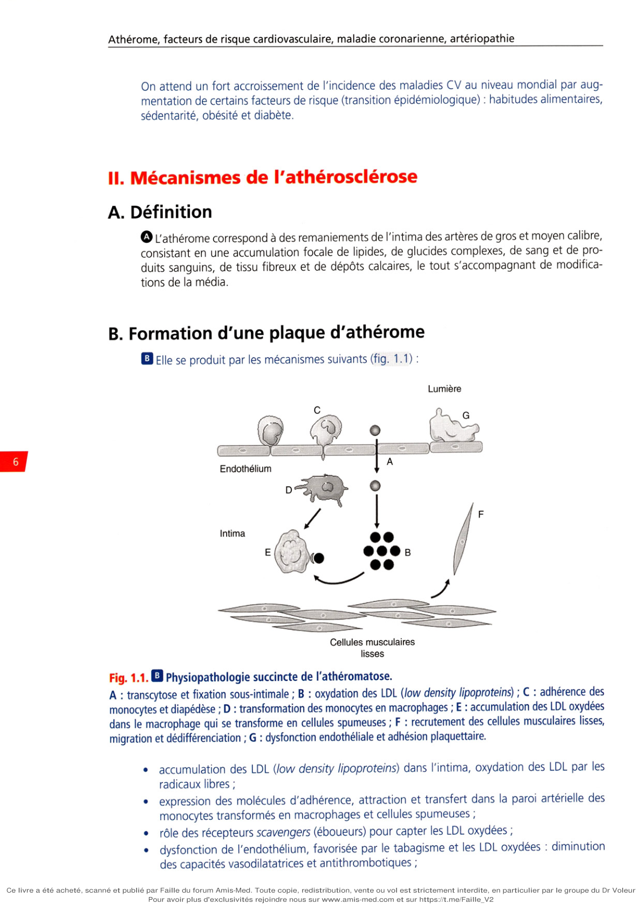

# Item 221 — Athérome : épidémiologie et physiopathologie. Le malade polyathéromateux

> **Collège CNEC / SFC** · 3e édition (2025) · p. 1–14 · R2C  
> Partie I — Athérome, facteurs de risque cardiovasculaire, maladie coronarienne, artériopathie

---

## Trois repères à ne pas confondre

| Badge | Signification (R2C) |
|---|---|
| **Rang A** | Connaissances fondamentales de fin de 2e cycle |
| **Rang B** | Connaissances essentielles, plus spécialisées |
| **Rang C** | Connaissances de 3e cycle (DES) |

Les pastilles du livre (● = A, ■ = B) sont reprises inline. Un objectif sans pastille dans la hiérarchisation = **Rang C**.

---

## Situations de départ

4 Douleur abdominale.  
15 Anomalies de couleur des extrémités.  
19 Découverte d'un souffle vasculaire.  
42 Hypertension artérielle.  
63 Troubles sexuels et troubles de l'érection.  
66 Apparition d'une difficulté à la marche.  
69 Claudication intermittente d'un membre.  
71 Douleur d'un membre (supérieur ou inférieur).  
121 Déficit neurologique sensitif et/ou moteur.  
161 Douleur thoracique.  
178 Demande/prescription raisonnée et choix d'un examen diagnostique.  
185 Réalisation et interprétation d'un électrocardiogramme (ECG).  
195 Analyse du bilan lipidique.  
204 Élévation des enzymes cardiaques.  
224 Découverte d'une anomalie abdominale à l'examen d'imagerie médicale.  
225 Découverte d'une anomalie cervicofaciale à l'examen d'imagerie médicale.  
226 Découverte d'une anomalie du cerveau à l'examen d'imagerie médicale.  
231 Demande d'un examen d'imagerie.  
232 Demande d'explication d'un patient sur le déroulement, les risques et les bénéfices attendus d'un examen d'imagerie.  
242 Gestion du sevrage tabagique contraint.  
248 Prescription et suivi d'un traitement par anticoagulant et/ou antiagrégant.  
252 Prescription d'un hypolipémiant.  
266 Consultation de suivi d'un patient polymédiqué.  
271 Prescription et surveillance d'une voie d'abord vasculaire.  
279 Consultation de suivi d'une pathologie chronique.  
281 Prescription médicamenteuse, consultation de suivi et éducation d'un patient diabétique de type 2 ou ayant un diabète secondaire.  
282 Prescription médicamenteuse, consultation de suivi et éducation d'un patient hypertendu.  
314 Prévention des risques liés au tabac.  
319 Prévention du surpoids et de l'obésité.  
324 Modification thérapeutique du mode de vie (sommeil, activité physique, alimentation, etc.).  
328 Annonce d'une maladie chronique.  
338 Prescription médicale chez un patient en situation de précarité.  
342 Rédaction d'une ordonnance/d'un courrier médical.

---

## Hiérarchisation des connaissances

| Rang | Rubrique | Intitulé | Descriptif |
|---|---|---|---|
| **A** | Définition | Définition de l'athérome | |
| **A** | Définition | Malade polyathéromateux | |
| **B** | Prévalence, épidémiologie | Prévalence et incidence de l'athérome (y compris atteintes infracliniques) | |
| **A** | Épidémiologie | Cardiopathie ischémique, AVC, AOMI, anévrisme de l'aorte abdominale | Mortalité et morbidité : grandes tendances (causes de mortalité, influence de l'âge et du sexe, évolution dans le temps, gradient nord sud) |
| **B** | Physiopathologie | Connaître les mécanismes de formation et l'évolution de la plaque d'athérome | |
| **C** | Physiopathologie | Connaître les particularités de la physiopathologie de l'athérome (cibles et intervenants) | |
| **A** | Diagnostic | Localisations préférentielles de la maladie athéromateuse | |
| **B** | Examens complémentaires | Connaître la stratégie d'exploration en imagerie devant une maladie athéromateuse | Dépistage et diagnostic positif : échodoppler artériel des membres inférieurs avec mesure de l'IPS |
| **A** | Prise en charge | Connaître les principes de prise en charge du malade polyathéromateux | |
| **B** | Prise en charge | Connaître les spécificités de l'éducation thérapeutique du patient athéromateux | |

---

## Parcours Rang A

- [II.A Définition de l'athérome](#iia-définition)
- [I.A Mortalité des maladies cardiovasculaires](#ia-mortalité-des-maladies-cardiovasculaires)
- [V.B Facteurs de risque (FDR) d'athérome](#vb-facteurs-de-risque-fdr-dathérome)
- [IV Localisations préférentielles](#iv-localisations-préférentielles-des-lésions-dathérosclérose)
- [III Points d'impact des thérapeutiques](#iii-points-dimpact-des-thérapeutiques)
- [VI.A Définition du malade polyathéromateux](#via-définition)
- [VI.C–G Prise en charge](#vic-prise-en-charge)

---

## Sommaire

- [Vignette clinique](#vignette-clinique)
- [I. Épidémiologie](#i-épidémiologie)
- [II. Mécanismes de l'athérosclérose](#ii-mécanismes-de-lathérosclérose)
- [III. Points d'impact des thérapeutiques](#iii-points-dimpact-des-thérapeutiques)
- [IV. Localisations préférentielles des lésions d'athérosclérose](#iv-localisations-préférentielles-des-lésions-dathérosclérose)
- [V. Évolution naturelle de la maladie athéromateuse](#v-évolution-naturelle-de-la-maladie-athéromateuse)
- [VI. Le malade polyathéromateux (ou polyvasculaire)](#vi-le-malade-polyathéromateux-ou-polyvasculaire)
- [Points](#points)
- [Notions indispensables et inacceptables](#notions-indispensables-et-inacceptables)
- [Réflexes transversalité](#réflexes-transversalité)
- [Pour en savoir plus](#pour-en-savoir-plus)
- [Entraînement](../../Entrainement/QI/221_Atherome.md)

---

## Vignette clinique

Un homme de 57 ans vous consulte car il présente une sensation progressive d'étau au niveau du mollet gauche lorsqu'il marche, augmentant avec la distance parcourue, qui devient très douloureux l'obligeant à s'arrêter au bout de 250 m. Ce patient n'a pas d'antécédent médical particulier. Son père est décédé d'un infarctus du myocarde à l'âge de 63 ans. Il est fumeur d'un paquet de cigarettes par jour depuis l'âge de 20 ans. Il ne boit pas d'alcool. À l'examen, il pèse 65 kg pour 1,78 m, la pression artérielle est à 150/80 mmHg au bras droit et 140/80 mmHg au bras gauche. L'auscultation cardiopulmonaire est normale, mais vous trouvez un souffle systolique fémoral gauche et carotidien droit. Le pouls fémoral gauche est amorti et en aval, les pouls poplité, tibial postérieur et pédieux ne sont pas retrouvés. À droite, les pouls sont présents. La palpation abdominale est sans particularité. Vous suspectez une artériopathie oblitérante des membres inférieurs (AOMI) chez un patient possiblement polyvasculaire.

> Quels signes cliniques rechercheriez-vous à l'interrogatoire pour détecter une maladie polyvasculaire ?

> Quel examen demandez-vous en premier lieu pour confirmer le diagnostic d'AOMI ?

> Quels examens demandez-vous pour rechercher une maladie polyvasculaire chez ce patient ?

> Quel bilan biologique est nécessaire pour appréhender l'ensemble des facteurs de risque cardiovasculaire du patient ?

> Quelles mesures hygiénodiététiques proposez-vous ?

> Si l'AOMI est confirmée, quel traitement pharmacologique instaurez-vous ?

*(Le collège ne donne pas les réponses — elles guident la lecture du chapitre.)*

---

# I. Épidémiologie

**Rang B.** Les études épidémiologiques recensent surtout les complications provoquées.

## I.A. Mortalité des maladies cardiovasculaires

**Rang A.**

- Les maladies cardiovasculaires (CV) représentent la 1re cause de mortalité dans le monde.
- La mortalité CV a récemment régressé à la 2e place en France derrière la mortalité par cancer, par suite d'une importante baisse depuis 30 ans. Elle reste la 1re cause chez les femmes.
- Si les facteurs de risque CV sont ubiquitaires, il existe néanmoins une variation géographique de la prévalence et de l'incidence des maladies CV : le taux de mortalité CV est plus élevé dans les pays du nord et de l'est de l'Europe, intermédiaire en Amérique du Nord, plus faible en Europe du Sud et au Japon. Une transition épidémiologique est en cours dans les pays en voie de développement, avec augmentation de la prévalence et de l'incidence des maladies athéromateuses. La France est l'un des pays avec la mortalité CV la plus faible en Europe. Elle est classée parmi les pays à faible niveau de risque cardiovasculaire selon la Société européenne de cardiologie (ESC).
- Ces variations sont liées à la diversité des facteurs environnementaux et des habitudes alimentaires plutôt qu'à des différences génétiques (ex : augmentation du risque CV chez les descendants de migrants asiatiques aux États-Unis).

## I.B. Incidence des maladies cardiovasculaires

**Rang B.**

L'incidence est 3-5 fois plus fréquente chez l'homme que chez la femme, mais celle des syndromes coronariens aigus est en augmentation chez les femmes, notamment les plus jeunes du fait de l'augmentation du tabagisme. Cette différence d'incidence, entre les sexes, diminue avec l'âge.

## I.C. Prévalence des maladies cardiovasculaires

**Rang B.**

Elle augmente avec l'âge de la population.

## I.D. Pour l'avenir

**Rang B.**

On observe :

- une tendance à la baisse de la mortalité CV (progrès dans la prise en charge et la prévention) ;
- une augmentation cependant de la prévalence des maladies CV, liée au vieillissement des populations et à la réduction de mortalité de ces maladies.

On attend un fort accroissement de l'incidence des maladies CV au niveau mondial par augmentation de certains facteurs de risque (transition épidémiologique) : habitudes alimentaires, sédentarité, obésité et diabète.

---

# II. Mécanismes de l'athérosclérose

## II.A. Définition

**Rang A.**

L'athérome correspond à des remaniements de l'intima des artères de gros et moyen calibre, consistant en une accumulation focale de lipides, de glucides complexes, de sang et de produits sanguins, de tissu fibreux et de dépôts calcaires, le tout s'accompagnant de modifications de la média.

## II.B. Formation d'une plaque d'athérome

**Rang B.**

Elle se produit par les mécanismes suivants (fig. 1.1) :

**Fig. 1.1. Physiopathologie succincte de l'athéromatose.**

- **A** : transcytose et fixation sous-intimale ;
- **B** : oxydation des LDL (low density lipoproteins) ;
- **C** : adhérence des monocytes et diapédèse ;
- **D** : transformation des monocytes en macrophages ;
- **E** : accumulation des LDL oxydées dans le macrophage qui se transforme en cellules spumeuses ;
- **F** : recrutement des cellules musculaires lisses, migration et dédifférenciation ;
- **G** : dysfonction endothéliale et adhésion plaquettaire.

**Rang C.**

- accumulation des LDL (low density lipoproteins) dans l'intima, oxydation des LDL par les radicaux libres ;
- expression des molécules d'adhérence, attraction et transfert dans la paroi artérielle des monocytes transformés en macrophages et cellules spumeuses ;
- rôle des récepteurs scavengers (éboueurs) pour capter les LDL oxydées ;
- dysfonction de l'endothélium, favorisée par le tabagisme et les LDL oxydées : diminution des capacités vasodilatatrices et antithrombotiques ;
- réaction inflammatoire auto-entretenue aggravant la dysfonction endothéliale et sécrétant des métalloprotéases destructrices de la matrice extracellulaire ;
- migration des cellules musculaires lisses de la média vers (néo-intima) ;
- sécrétion des facteurs de croissance, de collagène et de la matrice extracellulaire ;
- centre lipidique : organisation dans l'intima des cellules spumeuses (stries lipidiques) au sein d'un tissu inflammatoire ;
- tardivement, chape fibreuse qui agit comme couverture du centre lipidique ;
- séquence chronologique comportant les stries lipidiques retrouvées dès le jeune âge (lors d'autopsies), puis constitution d'une véritable plaque d'athérome avec un centre lipidique et sa chape fibreuse.

## II.C. Évolution des plaques d'athérome

**Rang B.**

La plaque d'athérome peut évoluer vers :

### Une rupture

- c'est une complication brutale, à l'origine des accidents cliniques aigus (ex : syndrome coronarien aigu, AVC [accident vasculaire cérébral]),
- elle se produit par érosion ou déchirure de la chape fibreuse recouvrant la plaque d'athérome,
- la formation immédiate d'un thrombus entraîne des accidents aigus par réduction ou obstruction de la lumière de l'artère,
- le thrombus peut se fragmenter et créer des embolies,
- la rupture est d'autant plus probable que la plaque est « jeune », riche en lipides et en cellules inflammatoires, et que la chape fibreuse est fine. Elle concerne donc souvent des plaques d'athérome peu sténosantes,
- de nombreuses ruptures de plaques restent asymptomatiques ;

### Une progression

- réduction de la lumière du vaisseau due à l'augmentation de volume de la plaque,
- augmentation du volume de la plaque (composante lipidique et matrice),
- augmentation progressive possible, mais surtout par poussées, lors d'accidents aigus de rupture de plaque, en incorporant du matériel thrombotique,
- évolution lente vers un tissu fibreux et calcifié,
- une hémorragie intraplaque : elle entraîne une augmentation brusque du volume de la plaque pouvant rompre la chape fibreuse,
- une régression observée expérimentalement chez des animaux, mais difficilement démontrable chez l'homme.

## II.D. Évolution des sténoses artérielles (remodelage)

**Rang B.**

L'augmentation de l'épaisseur de la paroi, par augmentation du volume des plaques, s'associe à une modification du diamètre du vaisseau. On distingue 2 types de remodelage :

- le remodelage compensateur qui élargit le diamètre pour préserver la lumière artérielle ;
- le remodelage constrictif qui réduit le diamètre du vaisseau et majore la sténose vasculaire en regard de la lésion athéromateuse.

**Rang A.**

Une sténose peut s'aggraver progressivement, mais peut également s'aggraver brutalement par la rupture ou érosion de plaque et formation de thrombus responsable de réduction de la lumière, voire d'occlusion.

## II.E. Développement des anévrismes

**Rang B.**

L'athérome peut aussi altérer la structure pariétale du vaisseau et détruire la matrice extracellulaire. Cela provoque les dilatations anévrismales. Mais tous les anévrismes ne sont pas liés à l'athérome.

---

# III. Points d'impact des thérapeutiques

**Rang A.**

Les thérapeutiques peuvent agir en :

- **prévenant le développement de l'athérome par :**
  - diminution de la dysfonction endothéliale : suppression ou traitement de tous les facteurs de risque modifiables (ex : arrêt du tabac, lutte contre la sédentarité),
  - diminution de l'accumulation des LDL : régime alimentaire, statines et autres hypolipémiants,
  - stabilisation des plaques pour diminuer le risque de rupture : il s'agit de l'une des propriétés des statines,
  - régression du volume des plaques : statines à fortes doses, si besoin associées à l'ézétimibe, ou anti-PCSK9,
  - diminution de l'inflammation : aspirine, statines,
  - diminution des contraintes mécaniques : traitements antihypertenseurs ;
- **diminuant les extensions de thromboses lors de la rupture de plaques :** antiplaquettaires et héparines en urgence ;
- **prenant en charge le retentissement des sténoses :** traitement de l'insuffisance coronarienne stable, de l'ischémie, des sténoses serrées des carotides (segment extracrânien), des sténoses des artères rénales (HTA [hypertension artérielle], insuffisance rénale), de l'artériopathie oblitérante des membres inférieurs, des artères digestives, etc. ;
- **prenant en charge les complications CV :** traitement des syndromes coronariens aigus, des AVC, des dissections de l'aorte, des ischémies aiguës des membres inférieurs, etc. ;
- **traitant les lésions athéromateuses les plus menaçantes :** angioplastie ou pontages coronariens, chirurgie ou angioplastie carotidienne, cure chirurgicale des anévrismes (ou endoprothèses), angioplastie ou pontage des artères des membres inférieurs.

---

# IV. Localisations préférentielles des lésions d'athérosclérose

**Rang A.**

L'athérome se développe surtout à proximité de flux artériels turbulents : ostium, bifurcation, zone de contrainte mécanique.

L'athérome atteint les artères de gros et moyen calibre : l'aorte et ses branches.

Son extension à plusieurs territoires artériels est habituelle.

Les localisations principales sont :

- plaques carotidiennes à l'origine d'AVC ;
- plaques coronariennes responsables des cardiopathies ischémiques ;
- plaques de la crosse de l'aorte pouvant entraîner des AVC. Par ailleurs, les plaques et lésions sténosantes de l'aorte terminale peuvent favoriser la survenue d'anévrismes de l'aorte abdominale ;
- sténoses des artères rénales responsables d'HTA et d'insuffisance rénale ;
- sténoses des artères digestives à l'origine d'ischémie mésentérique ;
- sténoses des artères des membres inférieurs provoquant l'artériopathie oblitérante ;
- lésions de plusieurs territoires artériels : habituelles, définissant une atteinte polyvasculaire ou un patient polyathéromateux (cf. VI. Le malade polyathéromateux [ou polyvasculaire]).

---

# V. Évolution naturelle de la maladie athéromateuse

## V.A. Évolution et complications

**Rang B.**

Le début de l'athérome est très précoce, dès l'enfance, puis la vitesse de progression dépend des facteurs de risque et des processus de vieillissement.

La tendance évolutive naturelle de l'athérome est l'aggravation par étapes silencieuses, dépendant du développement intermittent des plaques.

- Les réductions progressives des lumières artérielles provoquent des tableaux d'ischémie chronique stable : angor d'effort, claudication intermittente (membres inférieurs), claudication digestive (douleurs postprandiales), etc.
- Les ruptures de plaques provoquent des complications aiguës cliniques, dépendant du territoire artériel en cause (syndrome coronarien aigu avec sus-décalage du ST en cas de thrombose occlusive, AVC ischémique, ischémie aiguë d'un membre inférieur, etc.).
- Il existe des phénomènes d'érosion de la plaque notamment du fait de contraintes de cisaillement importants avec possibilité de constitution de thrombose superficielle et embolisation distale (ex : syndrome coronarien aigu sans sus-décalage du ST).

La gravité de ces accidents aigus n'est pas toujours proportionnelle à l'ancienneté ou à l'étendue de l'athérome : la rupture d'une plaque athéromateuse coronarienne, jeune, peut être responsable d'infarctus ou de mort subite. À l'inverse, une artère peut progressivement s'occlure (occlusion chronique) de manière asymptomatique, notamment du fait de développement progressif de collatéralité suppléant le territoire correspondant (ex : occlusion chronique d'une artère coronaire avec suppléances issues d'artères voisines, ou d'une artère fémorale superficielle avec suppléance de membre assurée par des collatérales aux dépens de l'artère fémorale profonde).

Cependant, la probabilité de survenue d'une complication de la maladie athéromateuse ou d'une récidive est très dépendante du nombre des facteurs de risque présents.

## V.B. Facteurs de risque (FDR) d'athérome

**Rang A.**

On distingue :

- les FDR non modifiables : âge, sexe masculin, antécédents familiaux ;
- les FDR modifiables principaux : tabagisme, HTA, dyslipidémies et diabète ;
- les facteurs prédisposants : obésité, sédentarité, stress et conditions psychosociales (ex : augmentation du risque CV dans les terrains dépressifs, ou à niveau socioéducationnel bas), facteurs environnementaux tels que la pollution atmosphérique ;
- certains facteurs propres chez la femme, par exemple ménopause précoce ;
- les marqueurs de risque : il s'agit d'éléments associés à une augmentation du risque CV, mais sans lien de causalité établie. Ils sont essentiellement de 2 types :
  - marqueurs biologiques, par exemple : marqueurs inflammatoires (CRP : C-réactive protéine),
  - marqueurs vasculaires témoignant du développement de l'athérome avant le stade clinique (ex : plaques carotidiennes à l'échographie comme marqueur de risque d'accident coronarien).

Les facteurs de risque influencent le développement de l'athérome, la fréquence de survenue des complications CV et de leurs récidives. Ils nécessitent donc une prise en charge en prévention primaire (avant le développement clinique de la maladie) et en prévention secondaire (après la présentation clinique d'une maladie CV chronique, telle que l'angor, ou aiguë, telle qu'un accident vasculaire cérébral). À la frontière entre les deux situations, la présence de lésions sévères asymptomatiques (ex : sténose carotidienne serrée asymptomatique découverte à l'occasion d'un souffle) doit généralement bénéficier d'une stratégie préventive équivalente à la prévention secondaire.

---

# VI. Le malade polyathéromateux (ou polyvasculaire)

## VI.A. Définition

**Rang A.**

Un malade est dit polyathéromateux en cas d'atteinte athéromateuse d'au moins deux territoires artériels différents. L'atteinte peut être symptomatique (ex : claudication intermittente des membres inférieurs chez un patient aux antécédents d'infarctus du myocarde) ou asymptomatique mais significative (ex : présence d'une sténose carotidienne à 50 %, asymptomatique, chez un patient déjà touché par une AOMI [artériopathie oblitérante des membres inférieurs] clinique). La présence d'une simple plaque non sténosante (< 50 %) et non compliquée ne peut être considérée pour qualifier un patient comme polyvasculaire, même si celle-ci est bien le reflet du développement de l'athérosclérose débutant.

Ces fréquentes associations imposent de dépister les lésions des autres territoires artériels chaque fois qu'une lésion athéromateuse est découverte, mais également tout au long de la prise en charge et du suivi du patient. Ce dépistage n'a cependant de l'intérêt que s'il modifie la prise en charge du patient (ex : revascularisation préventive d'une sténose carotidienne découverte dans le bilan d'un patient atteint d'AOMI).

## VI.B. Prévalence de l'atteinte polyartérielle

**Rang B.**

Elle varie selon le siège de la première lésion qui est devenue symptomatique :

- chez un coronarien, l'examen systématique découvre une artériopathie des membres inférieurs dans 20 % des cas, une sténose carotidienne dans 20 % des cas et une sténose des artères rénales dans 20 % des cas ;
- chez un patient ayant une artériopathie des membres inférieurs, ainsi que chez un patient avec une sténose carotidienne ou un anévrisme de l'aorte abdominale, l'atteinte coronarienne est présente dans 40-50 % des cas. Les patients atteints d'une AOMI sont ceux ayant le plus souvent une atteinte polyvasculaire associée.

Ne pas oublier la recherche de dysfonction érectile, pouvant également être un indicateur de maladie artérielle.

## VI.C. Prise en charge

### 1. Évaluation des facteurs de risque

**Rang A.**

Elle comporte :

- l'évaluation des facteurs de risque, commune à tous les territoires artériels atteints ;
- le calcul du risque CV global.

### 2. Bilan d'extension des lésions

**Rang A** (clinique) · **Rang B** (imagerie / IPS)

- On procède à un bilan clinique systématique de tous les territoires (interrogatoire et examen clinique). Ne pas oublier la mesure de la pression artérielle brachiale bilatérale (une différence de pression artérielle > 15 mmHg entre les deux bras sur plusieurs mesures doit faire suspecter une sténose unilatérale de l'artère subclavière).
- Une sélection des explorations complémentaires spécifiques est effectuée d'après :
  - le bilan clinique ;
  - le niveau du risque CV global ;
  - la prévalence d'atteinte d'un autre territoire ;
  - la nécessité ou non d'un geste invasif.
- L'ECG est systématique.
- Une mesure de l'IPS (index de pression systolique) est réalisée aux membres inférieurs.
- **Objectif Rang B (hiérarchisation) :** dépistage et diagnostic positif par **échodoppler artériel des membres inférieurs avec mesure de l'IPS**.
- Un dépistage d'anévrisme de l'aorte abdominale est effectué, notamment chez les hommes après 65 ans.

## VI.D. Thérapeutiques admises pour l'ensemble des patients polyvasculaires

**Rang A.**

### 1. Prise en charge intensive de tous les facteurs de risque modifiables

Elle repose sur :

- l'arrêt du tabac ;
- la diététique et l'éducation thérapeutique (cf. F. Éducation thérapeutique — Compréhension de la maladie) ;
- la prescription d'activité physique régulière.

### 2. Médicaments ayant prouvé leur efficacité pour diminuer la morbimortalité

Il s'agit :

- d'un traitement antiagrégant plaquettaire :
  - de l'aspirine (entre 75 et 325 mg/j) systématique, dont les contre-indications sont rares (intolérance gastrique, allergie, etc.) ;
  - ou du clopidogrel (Plavix®) lors d'intolérance à l'aspirine ou pour les atteintes polyvasculaires compliquées, notamment chez les patients ayant une AOMI ;
- des statines, systématiquement, avec les objectifs d'une prévention secondaire ;
- des IEC — inhibiteurs de l'enzyme de conversion (ou antagonistes des récepteurs de l'angiotensine 2 : ARA2) recommandés pour diminuer le risque d'infarctus, d'AVC et freiner l'altération de la fonction rénale.

Les bêtabloquants ont une efficacité prouvée uniquement après un infarctus du myocarde, notamment en cas d'altération de la FEVG. Leur bénéfice à distance de l'infarctus chez les sujets à FEVG normale est actuellement remis en cause. Leur efficacité n'est pas montrée en cas de maladie coronarienne stable ou chez le malade polyvasculaire.

## VI.E. Prise en charge spécifique de certaines localisations asymptomatiques

**Rang B.**

Des seuils plus ou moins précis ont été établis pour recommander un geste thérapeutique invasif, lorsque le risque d'une complication grave devient élevé :

- chirurgie d'un anévrisme de l'aorte abdominale si le diamètre atteint 55 mm (50 mm chez la femme) ou s'il augmente de 5 mm/an ou plus ;
- endartériectomie d'une sténose carotidienne asymptomatique en cas de sténose > 60 % (le plus souvent > 80 %), seulement si l'espérance de vie dépasse 5 ans ;
- revascularisation myocardique (par angioplastie ou chirurgie) après tout syndrome coronarien aigu si des sténoses coronariennes sont significatives (> 70 %). Elle n'est pas systématique en cas d'ischémie silencieuse ou d'angor stable, sauf en cas :
  - de patient restant symptomatique malgré un traitement médical,
  - de fonction ventriculaire gauche altérée,
  - de faible seuil d'ischémie au test d'effort,
  - d'ischémie étendue documentée par scintigraphie, échocardiographie ou imagerie par résonance magnétique (IRM) de stress,
  - de nécessité de chirurgie à haut risque (de l'aorte abdominale par exemple),
  - d'exploration endocoronarienne prouvant une sténose à risque car hémodynamiquement significative (FFR : fractional flow reserve < 0,8).

Les indications chirurgicales des lésions athéromateuses de plusieurs territoires requièrent une évaluation du risque et la recherche d'une lésion cliniquement instable. En cas de situation aiguë ou instable, la revascularisation de la lésion coupable est envisagée rapidement et sans prolonger le dépistage polyvasculaire. En dehors d'un caractère d'urgence, la hiérarchie de la revascularisation de lésions dans différents territoires se décide au cas par cas en réunion pluridisciplinaire.

## VI.F. Éducation thérapeutique — Compréhension de la maladie

**Rang B.**

Elle repose sur :

- l'apprentissage de l'intensité et de la régularité de l'activité physique et des mesures hygiénodiététiques indispensables ;
- l'apprentissage de l'observance, de l'efficacité et de la tolérance des divers traitements ;
- l'évaluation régulière du respect des objectifs définis de prévention secondaire ;
- la connaissance des signes d'appel de complications (douleur thoracique, déficit neurologique, etc.).

## VI.G. Bilan clinique annuel d'évaluation des lésions athéromateuses

**Rang A.**

Il consiste à pratiquer un examen clinique de tous les territoires artériels et à choisir les explorations complémentaires nécessaires.

---

## Points

L'athérome est le principal responsable des maladies cardiovasculaires et la 1re cause de mortalité dans le monde.

- Il existe une nette tendance à la baisse de la mortalité cardiovasculaire en France, mais une augmentation de la prévalence (vieillissement) et de l'incidence (accroissement du diabète et de l'obésité) des maladies cardiovasculaires, ainsi que de leur incidence chez les femmes jeunes (tabac).
- Une plaque d'athérome stable est composée d'un centre lipidique, de cellules spumeuses, musculaires et inflammatoires, recouvertes d'une chape fibreuse.
- Une plaque instable est une plaque très lipidique et inflammatoire, très vulnérable à la rupture.
- Une rupture de plaque se produit par rupture de la chape fibreuse ou simple érosion, déclenchant une thrombose et souvent une complication aiguë. L'hémorragie intraplaque aggrave le degré de la sténose.
- Le développement de l'athérome est prévenu en diminuant la lésion endothéliale, en évitant l'accumulation des LDL et en stabilisant les plaques.
- Tous les facteurs de risque modifiables doivent être supprimés et traités : arrêt du tabac, diététique équilibrée, statines, antidiabétiques, antihypertenseurs.

La diminution de l'inflammation est assurée par l'aspirine et les statines.

La diminution des contraintes mécaniques sur les plaques repose sur les antihypertenseurs.

Les risques de thrombose lors de rupture de plaque peuvent être diminués par aspirine, clopidogrel, héparine en situation d'urgence.

- La prise en charge repose sur les traitements spécifiques des complications aiguës et le traitement des lésions athéromateuses les plus menaçantes par angioplastie ou chirurgie.

Il existe des localisations préférentielles des lésions d'athérosclérose mais tous les territoires artériels de gros et moyen calibre peuvent être touchés.

Les principales localisations par leur fréquence et leur gravité clinique sont les coronaires, les carotides, les artères des membres inférieurs et les anévrismes de l'aorte.

- La prise en charge au long cours d'un patient polyathéromateux repose sur l'évaluation régulière des facteurs de risque, le calcul du risque cardiovasculaire global et le bilan annuel d'extension des lésions.
- Les médicaments ayant prouvé leur efficacité pour diminuer la morbimortalité en prévention secondaire sont l'aspirine ou le clopidogrel, les statines, les IEC (ou ARA2).

---

## Notions indispensables et inacceptables

### Notions indispensables

- Connaître les quatre principaux territoires de la maladie athéromateuse (coronaire, carotide, artères des membres inférieurs, aorte abdominale).

### Notions inacceptables

- Oublier l'aspirine et les statines en prévention secondaire.

---

## Réflexes transversalité

- Item 222 — Facteurs de risque cardiovasculaire et prévention.
- Item 223 — Dyslipidémies.
- Item 224 — Hypertension artérielle de l'adulte et de l'enfant.
- Item 225 — Artériopathie oblitérante de l'aorte, des artères viscérales et des membres inférieurs ; anévrismes.
- Item 230 — Douleur thoracique aiguë.
- Item 339 — Syndromes coronariens aigus.
- Item 340 — Accidents vasculaires cérébraux.

---

## Pour en savoir plus

- Camm J, Lüscher TF, Serruys PW. *The ESC textbook of cardiovascular medicine*. Oxford : Blackwell Publishing ; 2006.
- SFC. *Cardiologie et maladies vasculaires*. Masson ; 2020.

---

## Entraînement

Questions isolées et corrigés : [Entrainement/QI/221_Atherome.md](../../Entrainement/QI/221_Atherome.md)
