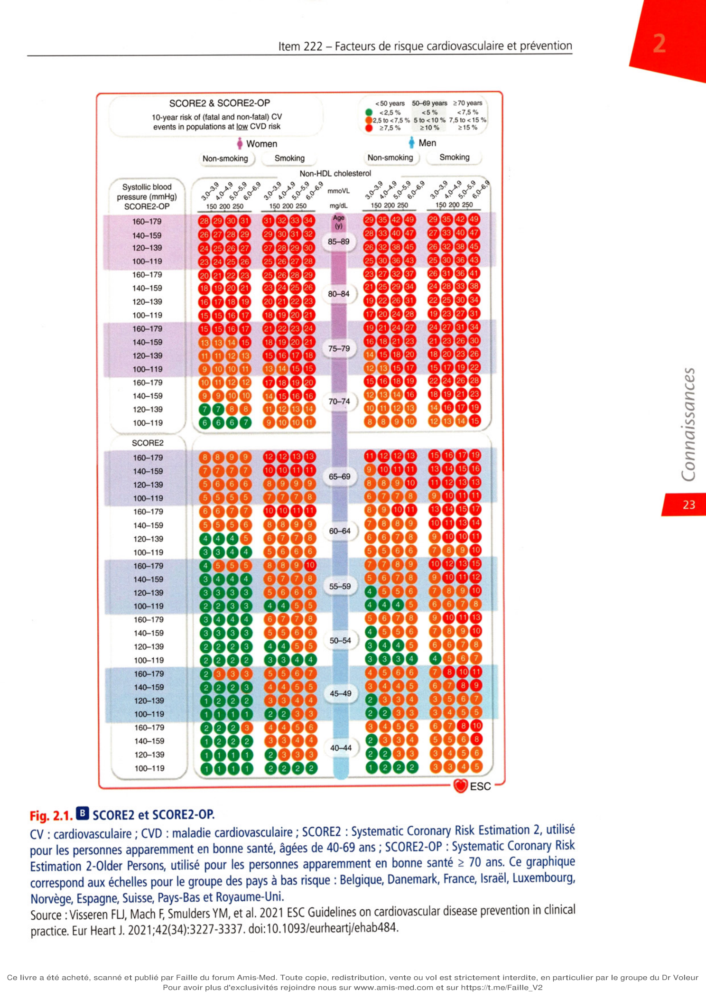

# Item 222 — Facteurs de risque cardiovasculaire et prévention

> **Collège CNEC / SFC** · 3e édition (2025) · p. 15–36 · R2C  
> Partie I — Athérome, facteurs de risque cardiovasculaire, maladie coronarienne, artériopathie

---

## Trois repères à ne pas confondre

| Badge | Signification (R2C) |
|---|---|
| **Rang A** | Connaissances fondamentales de fin de 2e cycle |
| **Rang B** | Connaissances essentielles, plus spécialisées |
| **Rang C** | Connaissances de 3e cycle (DES) |

Les pastilles du livre (● = A, ■ = B) sont reprises inline. Un objectif sans pastille dans la hiérarchisation = **Rang C**. Les objectifs grisés (*) ne sont pas traités dans le corps du chapitre.

---

## Situations de départ

19 Découverte d'un souffle vasculaire.  
42 Hypertension artérielle.  
69 Claudication intermittente d'un membre.  
161 Douleur thoracique.  
162 Dyspnée.  
165 Palpitations.  
195 Analyse du bilan lipidique.  
252 Prescription d'un hypolipémiant.  
285 Consultation de suivi et éducation thérapeutique d'un patient avec un antécédent cardiovasculaire.  
320 Prévention des maladies cardiovasculaires.  
328 Annonce d'une maladie chronique.  
335 Évaluation de l'aptitude au sport et rédaction d'un certificat de non-contre-indication.  
354 Évaluation de l'observance thérapeutique.

---

## Hiérarchisation des connaissances

| Rang | Rubrique | Intitulé | Descriptif |
|---|---|---|---|
| **A** | Définition | Définition de la prévention cardiovasculaire primaire, secondaire et primosecondaire | |
| **A** | Définition | Définition d'un facteur de risque | |
| **A** | Définition | Facteurs de risque majeurs, indépendants, modifiables (tabac, HTA, diabète, dyslipidémie) et non modifiables (âge, sexe masculin, hérédité) | |
| **A** | Définition | Agrégation de facteurs de risque et facteurs de risque indirects (obésité, sédentarité, syndrome métabolique) | |
| **A** | Définition | Stratégies individuelles de prévention : mesures hygiénodiététiques et traitements médicamenteux | |
| **B** | Prévalence, épidémiologie | Prévalence, risque cardiovasculaire associé et pourcentage de pathologies cardiovasculaires évitables en cas de prise en charge des facteurs de risque majeurs modifiables (HTA, tabac, diabète, dyslipidémie), connaître l'existence de scores (sans savoir les calculer) | |
| **C*** | Physiopathologie | Rôle de l'alcool dans le risque cardiovasculaire | *Non traité* |
| **C*** | Physiopathologie | Rôle des facteurs psychosociaux dans le risque cardiovasculaire | *Non traité* |
| **C*** | Physiopathologie | Rôle de l'hypertriglycéridémie dans le risque cardiovasculaire | *Non traité* |
| **B** | Étiologies | Expliquer l'influence de l'excès de poids dans le risque cardiovasculaire | |
| **A** | Prise en charge | Connaître le bénéfice de l'activité physique pour la prise en charge du risque cardiovasculaire | |
| **A** | Prise en charge | Décrire la quantité d'activité physique à conseiller en prévention cardiovasculaire primaire | |
| **A** | Suivi et/ou pronostic | Connaître l'efficacité de la prévention cardiovasculaire centrée sur le patient en soins primaires | |

---

## Parcours Rang A

- [I. Définitions](#i-définitions)
- [II. Facteurs de risque cardiovasculaire](#ii-facteurs-de-risque-cardiovasculaire)
- [III.A Scores de risque (SCORE2)](#iiia-risque-cardiovasculaire-global--scores-de-risque)
- [IV. Prévention cardiovasculaire](#iv-prévention-cardiovasculaire)
- [Encadré 2.3 — Prescription de l'activité physique](#encadré-23--prescription-de-lactivité-physique)

---

## Sommaire

- [Vignette clinique](#vignette-clinique)
- [I. Définitions](#i-définitions)
- [II. Facteurs de risque cardiovasculaire](#ii-facteurs-de-risque-cardiovasculaire)
- [III. Évaluation du risque cardiovasculaire](#iii-évaluation-du-risque-cardiovasculaire)
- [IV. Prévention cardiovasculaire](#iv-prévention-cardiovasculaire)
- [Points](#points)
- [Notions indispensables et inacceptables](#notions-indispensables-et-inacceptables)
- [Réflexes transversalité](#réflexes-transversalité)
- [Pour en savoir plus](#pour-en-savoir-plus)
- [Entraînement](../../Entrainement/QI/222_Facteurs_risque_et_prevention.md)

---

## Vignette clinique

Vous recevez en consultation un patient de 61 ans consulte pour prise en charge de facteurs de risque cardiovasculaire. Il n'a pas d'antécédents familiaux cardiovasculaires précoces. Il indique un tabagisme actif à 40 paquets-années. Il est actif : marche 2 à 3 fois/semaine et balades à vélo quotidiennes. Il n'a aucun symptôme fonctionnel cardiovasculaire et l'examen clinique est normal. Sa pression artérielle mesurée au cabinet médical est 153/91 mmHg, il pèse 83 kg pour 174 cm. Le bilan biologique réalisé il y a 1 mois retrouvait triglycérides : 1,25 g/L, cholestérol total : 2,20 g/L, high density lipoproteins (HDL) : 0,35 g/L, LDL : 1,60 g/L, glycémie à jeun 1,29 g/L.

> Le patient est-il obèse ?

> Le patient est-il hypertendu ? Est-il nécessaire de réaliser d'autres explorations pour le confirmer ?

> Le patient est-il diabétique ? Est-il nécessaire de réaliser d'autres examens pour le confirmer ? Si un diabète était confirmé, quels examens complémentaires biologiques vous semble-t-il important de réaliser pour évaluer le risque cardiovasculaire ?

> Comment évaluer l'activité physique réalisée par le patient ?

> Comment évaluer le risque cardiovasculaire global de ce patient ?

> Le taux de LDL cholestérol est-il aux objectifs attendus ?

> Quelle prise en charge thérapeutique envisagez-vous ?

> Quels conseils lui donnez-vous concernant son alimentation ?

*(Le collège ne donne pas les réponses — elles guident la lecture du chapitre.)*

---

# I. Définitions

**Rang A.**

Un facteur de risque est un élément clinique ou biologique associé à une augmentation du risque de développer une maladie avec une relation de causalité entre le facteur et la maladie. Il faut :

- que le facteur précède la maladie ;
- une relation dose effet ;
- un caractère universel ;
- une plausibilité physiopathologique ;
- une liaison forte et indépendante.

Un marqueur de risque n'a pas de responsabilité causale démontrée dans la survenue de la maladie et de ses complications. Son taux augmente ou diminue en même temps que s'aggrave ou s'améliore la maladie, mais sans influencer son évolution. C'est un simple témoin de la maladie.

La suppression ou la diminution d'un facteur de risque entraîne une baisse de l'incidence de la maladie ou de ses complications, alors que la diminution d'un marqueur de risque ne modifie pas l'évolution d'une maladie.

La prévention cardiovasculaire consiste à supprimer ou à baisser le plus possible l'ensemble des facteurs de risque afin de diminuer le risque de survenue d'événements cardiovasculaires. Elle peut s'appliquer spécifiquement à chaque individu (prévention individuelle) mais également à l'ensemble de la population (prévention collective).

En prévention individuelle, l'effet d'un programme de prévention est d'autant plus important que le risque de la maladie est élevé. Cet effet dépend donc pour chaque patient de son « risque cardiovasculaire global » qui doit être calculé à partir de l'évaluation de l'ensemble des facteurs de risque.

En prévention collective, des mesures de prévention communautaires simples, ayant des effets modérés individuellement, peuvent avoir un impact important sur l'ensemble de la population compte tenu du grand nombre d'individus bénéficiaires.

---

# II. Facteurs de risque cardiovasculaire

Ces facteurs sont multiples, ce qui fait de l'athérosclérose une maladie plurifactorielle. Ils sont classés en facteurs non modifiables et facteurs modifiables.

## II.A. Facteurs de risque non modifiables

### 1. Âge et sexe

**Rang A.**

Le nombre absolu de décès cardiovasculaires est plus important chez les femmes (54 %) que chez les hommes mais avant 65 ans, la mortalité cardiovasculaire des hommes est 3 à 4 fois supérieure à celle des femmes. En pratique, les accidents cardiovasculaires surviennent en moyenne 10 ans plus tôt chez l'homme que chez la femme.

### 2. Hérédité

**Rang A.**

Son évaluation repose sur la notion d'événements précoces (< 55 ans chez les hommes, < 65 ans chez les femmes) chez les parents ou dans la fratrie. Ceux-ci peuvent être liés à la transmission génétique de facteurs de risque modifiables (hypercholestérolémie familiale, hypertension artérielle, diabète, etc.). Mais c'est souvent la seule présence de facteurs environnementaux familiaux défavorables (tabagisme, alimentation déséquilibrée et sédentarité, etc.) qui explique les accidents sur plusieurs générations.

## II.B. Facteurs de risque modifiables

**Rang A.**

L'étude Interheart, étude cas-témoins d'infarctus du myocarde (IDM), incluant toutes les régions du monde, confirme que 9 facteurs expliquent 90 % des cas d'IDM, ceci dans toutes les classes d'âge et dans les deux sexes, avec :

- 6 facteurs de risque :
  - le tabagisme,
  - l'hypercholestérolémie,
  - l'hypertension artérielle,
  - le diabète,
  - l'obésité abdominale,
  - des facteurs psychosociaux ;
- des facteurs « protecteurs » :
  - la consommation de fruits et légumes,
  - l'activité physique,
  - une consommation légère d'alcool est décrite comme étant associée à une absence de risque, voire à une possible réduction du risque cardiovasculaire (Cf. rubrique pour en savoir plus en fin de chapitre).

### 1. Tabagisme

**Rang A.**

Première cause de mortalité évitable, le tabagisme reste un problème mondial majeur de santé publique, avec un nombre de décès annuels estimé à environ 5 millions, soit 13 500 décès par jour. Il est responsable de 1 décès sur 5 chez les hommes et de 1 décès sur 20 chez les femmes. En France, on lui attribue 73 000 décès par an (plus de 10 % de la totalité des décès), avec environ 2 000 décès par tabagisme passif. Un quart de ces décès sont des décès cardiovasculaires.

Le tabagisme favorise :

- l'abaissement du taux d'HDL-cholestérol, facilitant le développement des lésions athéroscléreuses ;
- la majoration du risque thrombotique lié à l'augmentation de l'agrégation plaquettaire, du taux de fibrinogène et de la viscosité sanguine (augmentation des éléments figurés du sang) ;
- l'altération de la vasomotricité artérielle endothélium-dépendante expliquant la fréquence des manifestations de spasme coronarien ;
- une concentration importante de CO circulant, nuisant au transport normal de l'oxygène par l'hémoglobine.

La nicotine n'a pas de rôle spécifique dans les complications cardiovasculaires du tabagisme. Elle est essentiellement responsable de la dépendance. Ses effets hémodynamiques se limitent à des modifications mineures de la fréquence cardiaque et de la pression artérielle systolique par stimulation adrénergique. Présents pour les niveaux de nicotinémie induits par la combustion d'une cigarette, ces effets sont totalement absents pour les taux obtenus avec les substituts nicotiniques quelles que soient la dose et la voie d'administration.

Dans l'étude Interheart, le tabagisme est le 2e facteur de risque d'IDM, juste derrière les dyslipidémies. Celle-ci confirme que :

- le risque d'IDM est proportionnel à la consommation, mais il n'y a pas de seuil de consommation au-dessous duquel le tabagisme est dénué de risque. Les mécanismes en cause sont sensibles à des niveaux très faibles d'exposition avec un effet-dose non linéaire ;
- le risque est le même quel que soit le type de tabagisme (cigarettes avec ou sans filtre, pipe, cigare, narguilé, tabac à mâcher, etc.) ;
- la part attribuable au tabagisme dans la survenue d'un IDM est d'autant plus importante que les sujets sont jeunes. C'est le facteur essentiel et souvent isolé des accidents coronariens aigus des sujets jeunes ;
- le risque d'IDM concerne également le tabagisme passif, avec une augmentation de 24 % du risque pour une exposition de 1 à 7 heures/semaine et de 62 % pour une exposition > 22 heures/semaine.

Par ailleurs, à côté des complications coronariennes, le tabagisme joue un rôle majeur dans la survenue et l'évolution de l'artériopathie oblitérante des membres inférieurs : 90 % des patients ayant cette localisation d'athérosclérose sont fumeurs. Le risque de développer un anévrisme de l'aorte abdominale est significativement augmenté chez les fumeurs. Enfin, les études épidémiologiques montrent une corrélation entre la consommation de tabac et le risque d'AVC aussi bien chez l'homme que chez la femme.

### 2. Hypercholestérolémie (cf. item 223 — chapitre 3)

**Rang A.**

C'est le facteur de risque le plus important pour la maladie coronarienne.

La cholestérolémie totale est corrélée positivement et de façon exponentielle avec le risque coronarien.

Au niveau individuel, le facteur déterminant du risque est un niveau élevé de LDL-cholestérol (cholestérol transporté par les lipoprotéines de basse densité). De façon indépendante, un niveau bas d'HDL-cholestérol (cholestérol transporté par les lipoprotéines de haute densité) est un facteur de risque de maladie coronarienne et un niveau élevé d'HDL-cholestérol est au contraire protecteur (non valable pour des valeurs > 1 g/L), d'où les termes communément utilisés de « mauvais » (LDL-C) et de « bon » cholestérol (HDL-C).

Pour évaluer correctement le risque cardiovasculaire, il faut prescrire une exploration d'une anomalie lipidique (EAL) réalisée à jeun. Celle-ci comprend : cholestérol total (CT), HDL-C, et triglycérides (TG). Le taux de LDL-C est calculé à partir de ces éléments à l'aide de la formule de Friedewald :

**LDL-C (g/L) = CT (g/L) − HDL-C (g/L) − TG (g/L)/5**

Cette formule n'est valable que pour des triglycérides < 3,5 g/L.

Certaines hypercholestérolémies sont liées à des mutations sur un gène (du LDL-récepteur surtout, de l'apoB ou de PCSK9 plus rarement) :

- hypercholestérolémie familiale hétérozygote (1 individu/500) : élévation importante du LDL-C entre 2 et 4 g/L, présence parfois de dépôts de cholestérol sur les tendons (xanthomes tendineux caractéristiques de l'affection : tendon calcanéen surtout, extenseurs des membres supérieurs), au niveau du pourtour de l'iris (arc cornéen), sur les paupières (xanthélasma). En l'absence de traitement institué précocement, les complications coronariennes peuvent survenir à partir de la quarantaine, voire plus tôt en cas d'association avec d'autres facteurs de risque ;
- hypercholestérolémie familiale homozygote (exceptionnelle : 1 individu/1 000 000) : LDL-C > 5 g/L, dépôts cutanés importants dès le plus jeune âge. Les complications coronariennes peuvent survenir avant l'âge de 20 ans.

La majorité des hypercholestérolémies sont dites polygéniques et sont favorisées par l'interaction entre une prédisposition génétique et l'environnement (alimentation riche en acides gras saturés surtout).

### 3. Hypertension artérielle (cf. item 224 — chapitre 4)

**Rang A.**

Elle concerne 20 à 30 % de la population française adulte. Relativement rare avant 35 ans (< 5 %), la prévalence croît rapidement ensuite et dépasse 60 % après 65 ans.

L'hypertension artérielle (HTA) est définie par des chiffres tensionnels supérieurs ou égaux à 140/90 mmHg en consultation médicale et persistant dans le temps (≥ 135/85 mmHg en automesure, ≥ 130/80 mmHg en MAPA [mesure ambulatoire de la pression artérielle] sur 24 heures).

Plus la pression artérielle (PA) augmente, plus le risque cardiovasculaire croît, même pour des valeurs inférieures à la « normale ». Les recommandations ESC de 2024 identifient la notion de PA élevée pour des sujets avec une PA supérieure à 120/70 mmHg en consultation et/ou en mesure ambulatoire (automesure tensionnelle [AMT] ou PA diurne en MAPA) mais qui n'atteint pas les critères diagnostiques d'une hypertension. Il s'agit d'une notion importante car il est nécessaire de réaliser pour ces sujets une évaluation du risque cardiovasculaire global (SCORE2, SCORE-OP) et de discuter d'un traitement antihypertenseur si ce risque est suffisamment élevé.

Aussi, la classification individualise plusieurs stades, tant dans les niveaux normaux que pour l'HTA (tableau 2.1).

**Tableau 2.1. Classification des niveaux de pression artérielle (mmHg).**

| Catégorie | PAS | PAD |
|---|---|---|
| HTA stade 1 | 140-159 | 90-99 |
| HTA stade 2 | 160-179 | 100-109 |
| HTA stade 3 | ≥ 180 | ≥ 110 |
| HTA systolique isolée | ≥ 140 | < 90 |

*HTA : hypertension artérielle.*

L'HTA est le plus souvent silencieuse, avec peu ou pas de symptômes. Elle retentit principalement sur trois organes : le cœur (risque d'insuffisance coronarienne et d'insuffisance cardiaque), le cerveau (risque d'AVC) et les reins (insuffisance rénale).

Dans la majorité des cas, il n'existe pas de cause identifiable à l'HTA (HTA essentielle), elle est favorisée par des facteurs génétiques et environnementaux (surpoids, sédentarité, consommation excessive d'alcool et de sel). Dans seulement 10 % des cas, elle est secondaire à une maladie rénale, une cause hormonale, en particulier surrénalienne, ou à la prise de certains médicaments ou toxiques.

Étant donné la grande variabilité physiologique de la pression artérielle, le diagnostic d'HTA ne doit pas être fait sur une seule mesure. Le chapitre 4 (I. Définition et confirmation diagnostique) reprend les conditions de mesures préconisées dans les recommandations de 2024 de l'ESC, de la Société française d'HTA et de la Haute autorité de santé (HAS). Il est nécessaire de réaliser des mesures répétées, à l'occasion de plus d'une visite, sauf en cas d'hypertension sévère. Il est recommandé d'utiliser des mesures répétées par appareils de mesure semi-automatiques au cabinet médical pour limiter l'effet « blouse blanche » — la mesure au stéthoscope n'est plus recommandée en première intention sauf en cas de fibrillation atriale. Il est recommandé de mesurer la PA en dehors du cabinet médical, au domicile du patient afin de confirmer le diagnostic d'HTA, par AMT ou par mesure ambulatoire.

- La MAPA permet de documenter le profil tensionnel sur 24 heures (exploration d'une variabilité tensionnelle importante, suspicion d'absence de baisse tensionnelle nocturne). Elle permet de confirmer le diagnostic d'HTA, de confirmer l'effet « blouse blanche » ou d'identifier une HTA masquée (HTA non présente au cabinet mais confirmée en MAPA), de confirmer le diagnostic d'HTA résistante, de rechercher une hypotension artérielle chez les patients diabétiques ou âgés.
- Il en est de même de l'automesure tensionnelle qui est également de plus en plus utilisée pour préciser le diagnostic d'HTA et vérifier l'efficacité du traitement.

### 4. Diabète (cf. item 247)

**Rang A.**

Il y a en France environ 3 millions de sujets diabétiques, soit 5 % de la population. Les diabètes de type 1 (d'emblée insulinodépendants, débutant le plus souvent avant 20 ans) représentent environ 5 % des cas, et les diabètes de type 2 (initialement non insulinodépendants) environ 95 %.

**Définitions**

- On parle de diabète lorsque la glycémie à jeun est > 1,26 g/L (7 mmol/L) à deux reprises ou la glycémie > 2 g/L (11,1 mmol/L) à n'importe quel moment de la journée.
- On parle d'hyperglycémie à jeun non diabétique lorsque la glycémie est comprise entre 1,00 et 1,26 g/L.

Le diagnostic est fait le plus souvent lors d'un dépistage systématique, chez un sujet de plus de 50 ans, sédentaire, en surcharge pondérale, asymptomatique. Il existe volontiers une hérédité familiale de diabète. Il s'intègre volontiers dans un tableau de « syndrome métabolique » (cf. infra).

Le risque cardiovasculaire est majoré d'un facteur 2 à 3 dans les deux types de diabète mais c'est surtout le diabète de type 2 qui, du fait de sa prévalence importante et croissante, est dominant dans le risque cardiovasculaire. Le diabète est à l'origine de complications microvasculaires (rétinopathie, néphropathie, neuropathie) et macrovasculaires (maladie coronarienne, AVC, AOMI [artériopathie oblitérante des membres inférieurs]).

### 5. Sédentarité, surpoids et obésité : syndrome métabolique

**Rang A** · **Rang B** (excès de poids).

Le mode de vie occidental sédentaire est à l'origine d'un déséquilibre énergétique entre les apports et les dépenses caloriques. Environ 20 millions de Français sont en surpoids, dont 6 millions sont obèses. Ce phénomène touche également les enfants et les adolescents. Cette sédentarité et ce surpoids ont une influence majeure sur la précocité et l'ampleur des perturbations métaboliques apparaissant chez les adultes jeunes et d'âge moyen (diabète, HTA, hyperlipidémie, etc.) et le risque d'événements cardiovasculaires.

L'évaluation de la surcharge pondérale est exprimée par :

- l'indice de masse corporelle (IMC) = poids P (kg) divisé par le carré de la taille T (m) : **IMC = P/T² (kg/m²)**. Un IMC normal est situé entre 18,5 et 25 kg/m². On parle :
  - de maigreur pour un IMC < 18,5 kg/m²,
  - de surpoids pour un IMC entre 25 et 29,9 kg/m²,
  - d'obésité pour un IMC ≥ 30 kg/m² ;
- la mesure du périmètre ombilical, qui rend compte de la graisse viscérale abdominale, et qui est mieux corrélée avec le risque cardiovasculaire. C'est un des éléments de diagnostic du syndrome métabolique, dont la définition est : une obésité centrale (avec périmètre abdominal > 94 cm pour un homme, > 80 cm pour femme) + au moins deux des facteurs suivants (Fédération internationale du diabète [FID] 2005) :
  - TG > 1,50 g/L,
  - HDL-C < 0,40 g/L pour un homme, < 0,50 g/L pour une femme,
  - PA ≥ 130/85 mmHg,
  - hyperglycémie > 1 g/L ou diabète de type 2.

---

# III. Évaluation du risque cardiovasculaire

**Rang B** (scores).

L'évaluation du risque cardiovasculaire permet l'identification des sujets les plus à même de bénéficier de la prévention.

## III.A. Risque cardiovasculaire global : scores de risque

**Rang A.**

Le cumul des facteurs de risque entraîne une multiplication des risques propres à chacun de ces facteurs. Le risque cardiovasculaire global est défini comme la probabilité, pour un individu, de développer une maladie cardiovasculaire (MCV) dans un temps donné (habituellement 10 ans) en fonction de l'ensemble de ses facteurs de risque. Des équations de risque ont été développées à partir de données épidémiologiques prospectives, comme celles de la ville de Framingham aux États-Unis, et en Europe le système SCORE (Systematic Coronary Risk Estimation). L'ESC en 2016 recommandait d'estimer le risque cardiovasculaire en prévention primaire à l'aide de l'outil SCORE. Celui-ci évaluait le risque de mortalité cardiovasculaire à 10 ans, en fonction du sexe, de l'âge (de 40 à 65 ans), du statut tabagique, de la pression artérielle systolique et des concentrations de cholestérol total.

Cet outil n'était pas adapté pour les patients hypertendus sévères (PA > 180/110 mmHg), diabétiques, insuffisants rénaux chroniques ou atteints d'hypercholestérolémie familiale.

En cas de maladie cardiovasculaire documentée, en prévention secondaire, le risque cardiovasculaire est d'emblée considéré très élevé. Quatre catégories de risque étaient distinguées en fonction desquelles étaient définis des objectifs thérapeutiques pour le LDL-cholestérol.

En 2021, les recommandations européennes pour l'évaluation du risque cardiovasculaire ont été modifiées en prenant en compte non seulement le risque de mortalité mais également la morbidité cardiovasculaire à 10 ans (infarctus du myocarde non fatal, accident vasculaire cérébral non fatal) qui reflètent mieux la charge totale des pathologies cardiovasculaires. Le score désormais utilisé est le **SCORE2** qui estime le risque sur 10 ans d'événements mortels et non mortels (infarctus du myocarde, accident vasculaire cérébral) chez les personnes âgées de 40 à 69 ans, apparemment en bonne santé, présentant des facteurs de risque non traités ou stables depuis longtemps.

Chez les personnes plus âgées, la relation entre les facteurs de risque classiques (dyslipidémie, HTA) avec le risque de MCV s'atténue avec l'âge et le risque de mortalité non liée aux MCV augmente. Les modèles qui ne tiennent pas compte du risque concurrent de mortalité non liée aux MCV ont tendance à surestimer le risque réel de MCV sur 10 ans, ainsi que le bénéfice potentiel du traitement. Chez les personnes âgées de plus de 70 ans et apparemment en bonne santé, il faut utiliser le **SCORE2-OP** (Old Person) qui estime les événements cardiovasculaires fatals et non fatals à 5 ans et à 10 ans (événements myocardiques mortels et non mortels [infarctus du myocarde, accident vasculaire cérébral]) ajustés aux risques concurrents.

SCORE2 et SCORE2-OP (fig. 2.1) sont calibrés pour quatre groupes de pays (faible [dont la France], modéré, élevé et très élevé).

Ils ne s'appliquent pas aux personnes ayant une MCV documentée ou dans les situations à haut risque comme le diabète, l'hypercholestérolémie familiale ou les atteintes génétiques rares, l'insuffisance rénale et chez la femme enceinte (cf. tableau 3.3).

Les personnes atteintes de diabète de type 2 ont un risque 2 à 4 fois plus élevé de développer une MCV au cours de leur vie (coronaropathie, AVC, HTA, FA, artériopathie périphérique) — et de nombreux patients ayant une MCV ont un diabète de type 2 non diagnostiqué. Il est donc très important de dépister le diabète chez les patients ayant une MCV, d'évaluer en cas de diabète le risque CV et rechercher une atteinte cardiovasculaire et rénale.

En 2023, l'ESC a également proposé un nouveau score, le **SCORE2-Diabetes** qui estime avec précision le risque de maladie cardiovasculaire chez les personnes atteintes de diabète de type 2 sans maladie cardiovasculaire athéroscléreuse ou lésion grave d'un organe cible (insuffisance rénale, protéinurie, microalbuminurie, rétinopathie isolée ou en association en fonction de leur gravité). Il intègre au SCORE2 des facteurs prédictifs additionnels spécifiques au diabète : l'âge du patient au moment du diagnostic du diabète, l'hémoglobine glyquée (HbA1c) et le débit de filtration glomérulaire estimé (DFGe).

**Fig. 2.1. SCORE2 et SCORE2-OP.**

CV : cardiovasculaire ; CVD : maladie cardiovasculaire ; SCORE2 : Systematic Coronary Risk Estimation 2, utilisé pour les personnes apparemment en bonne santé, âgées de 40-69 ans ; SCORE2-OP : Systematic Coronary Risk Estimation 2-Older Persons, utilisé pour les personnes apparemment en bonne santé > 70 ans. Ce graphique correspond aux échelles pour le groupe des pays à bas risque : Belgique, Danemark, France, Israël, Luxembourg, Norvège, Espagne, Suisse, Pays-Bas et Royaume-Uni.

*Source : Visseren FU, Mach F, Smulders YM, et al. 2021 ESC Guidelines on cardiovascular disease prevention in clinical practice. Eur Heart J. 2021;42(34):3227-3337. doi: 10.1093/eurheartj/ehab484.*

## Place de l'insuffisance rénale

**Rang B.**

La morbidité et la mortalité cardiovasculaires touchent de manière disproportionnée les personnes atteintes d'insuffisance rénale chronique (IRC). Pour rappel la sévérité de l'IRC est évaluée par la mesure du débit de filtration glomérulaire (DFG) et la recherche et la quantification d'une protéinurie par le dosage du rapport albuminurie/créatinurie (RAC, exprimé en mg/g). Plus le DFGe diminue, plus la protéinurie augmente, plus le risque d'aggravation de la fonction rénale et le risque cardiovasculaire augmentent. Les outils de prédiction du risque cardiovasculaire développés dans la population de sujets sans insuffisance rénale peuvent donc sous-estimer le risque de maladie cardiovasculaire dans les populations atteintes d'IRC. La sous-estimation du risque peut conduire à un traitement sous-optimal des patients alors que des traitements à la fois néphroprotecteurs et cardioprotecteurs pourraient être utilisés. Les SCORE2 et SCORE2-OP ne prennent pas en compte la fonction rénale (tableau 2.2) car les patients sont considérés d'emblée à haut risque ou très haut risque en cas d'IRC. Il faut en revanche noter que le DFGe est bien pris en compte dans le SCORE2-Diabetes. De nouveaux modèles ont été développés spécifiquement pour les adultes atteints d'IRC mais ne font pas l'objet de ce chapitre.

**Tableau 2.2. Paramètres pris en compte pour le calcul des SCORE2, SCORE2-OP et SCORE2-Diabetes.**

| Paramètre | SCORE2 | SCORE2-OP | SCORE2-Diabetes |
|---|---|---|---|
| Région européenne ou pays | + | + | + |
| Sexe H/F | + | + | + |
| Âge (ans) | 40-69 | > 70 | 40-69 |
| Tabagisme actif | + | + | + |
| Pression artérielle systolique | + | + | + |
| Cholestérol total | + | + | + |
| Cholestérol HDL | + | + | + |
| Débit de filtration glomérulaire estimé (mL/min/1,73 m²) | | | + |
| Âge au moment du diagnostic du diabète | NA | NA | + |
| HbA1c (%) | NA | NA | + |

*F : femme ; H : homme ; HbA1c : hémoglobine glyquée ; HDL : high density lipoprotein ; NA : non applicable ; SCORE2(OP) : Systematic Coronary Risk Estimation 2 (Old Person).*

*Source : Marx N, Federici M, Schütt K, Müller-Wieland D, Ajjan RA, Antunes MJ, Christodorescu RM, Crawford C, Di Angelantonio E, Eliasson B, Espinola-Klein C, Fauchier L, Halle M, Herrington WG, Kautzky-Willer A, Lambrinou E, Lesiak M, Lettino M, McGuire DK, Mullens W, Rocca B, Sattar N; ESC Scientific Document Group. 2023 ESC Guidelines for the management of cardiovascular disease in patients with diabetes. Eur Heart J. 2023 Oct 14;44(39):4043-4140. doi: 10.1093/eurheartj/ehad192.*

**Item 18. Santé et numérique**

Cet outil interactif d'estimation et gestion du risque cardiovasculaire est conçu pour aider les médecins à optimiser la réduction du risque cardiovasculaire individuel.

Il s'agit de la version électronique et interactive des tables de risque SCORE2, SCORE2-OP et SCORE2-Diabetes des recommandations européennes sur la prévention des MCV dans la pratique clinique, publiées par l'ESC. Les informations sont rapides à obtenir, fondées sur des preuves scientifiques, personnalisées pour chaque patient avec une représentation graphique du risque d'événement cardiovasculaire dans les 10 ans et permettent une approche éducative en illustrant les champs d'intervention et leur impact sur le risque cardiovasculaire.

- https://academic.oup.com/eurheartj/article/42/34/3227/6358713 et https://doi.org/10.1093/eurheartj/ehad260
- www.heartscore.org/en_GB
- https://u-prevent.com/calculators/score2
- Application ESC CVD Risk Calculation

La décision d'interventions reste une question de réflexion individuelle et de prise de décision partagée mais les recommandations de traitement des facteurs de risque sont fondées sur catégories de risque (« faible à modéré », « élevé » et « très élevé »). Les seuils de risque pour ces catégories sont différents en fonction des groupes d'âge, afin d'éviter un sous-traitement chez les jeunes, le surtraitement chez les personnes âgées ou la présence d'un diabète de type 2 (tableau 2.3).

**Tableau 2.3. Catégories de risque de maladie cardiovasculaire (%) fondées sur SCORE2 et SCORE2-OP chez des personnes apparemment en bonne santé en fonction de l'âge.**

| Risque de maladie cardiovasculaire | < 50 ans | 50-69 ans | > 70 ans¹ |
|---|---|---|---|
| Faible à modéré (traitement médicamenteux généralement non indiqué) | < 2,5 | < 5 | < 7,5 |
| Élevé (traitement médicamenteux le plus souvent indiqué) | 2,5 à < 7,5 | 5 à < 10 | 7,5 à < 15 |
| Très élevé (traitement médicamenteux généralement indiqué) | ≥ 7,5 | ≥ 10 | ≥ 15 |

*SCORE2(OP) : Systematic Coronary Risk Estimation 2 (Old Person).*

*1. Chez les personnes apparemment en bonne santé d'âge ≥ 70 ans, la recommandation de traitement par hypolipémiants est de classe IIb (« peut être envisagé »).*

*Source : Visseren FU, Mach F, Smulders YM, et al. 2021 ESC Guidelines on cardiovascular disease prevention in clinical practice. Eur Heart J. 2021;42(34):3227-3337. doi: 10.1093/eurheartj/ehab484.*

Pour les patients diabétiques, quatre catégories de risque de survenue d'une maladie cardiovasculaire dans les 10 ans ont été définies : faible risque < 5 %, risque modéré entre 5 et < 10 %, risque élevé entre 10 et < 20 % et risque très élevé ≥ 20 % ou en cas de présence d'une maladie cardiovasculaire athéroscléreuse ou d'une lésion grave d'un organe cible (insuffisance rénale, protéinurie, microalbuminurie, rétinopathie isolée ou en association en fonction de leur gravité).

## III.B. Autres éléments utiles pour évaluer le risque cardiovasculaire

### 1. Antécédents familiaux d'accidents cardiovasculaires prématurés et facteurs de risque psychosociaux

**Rang B.**

Les antécédents familiaux d'accidents cardiovasculaires prématurés (avant 55 ans chez le père ou un frère, avant 65 ans chez la mère ou une sœur) et les facteurs de risque psychosociaux (dépression, troubles psychiques, catégorie sociale défavorisée, isolement social) ne sont pas pris en compte dans ces équations de risque (c'est une de leurs limites) en raison des difficultés à les évaluer de façon simple et rigoureuse, bien qu'ils soient significativement associés au risque cardiovasculaire.

### 2. Anomalies d'imagerie sur des organes cibles

Elles ne sont pas actuellement recommandées en routine. Il s'agit : de l'épaisseur intima-média artérielle évaluée par échographie carotidienne, du score calcique coronarien évalué par tomodensitométrie, de l'hypertrophie ventriculaire gauche dans l'HTA évaluée en échographie.

### 3. Certains « marqueurs biologiques »

**Marqueurs d'atteinte rénale** — Cf. supra.

La microalbuminurie peut traduire une atteinte rénale dans le diabète ou l'HTA. L'albuminurie est un marqueur précoce de néphropathie et prédit à la fois le risque d'insuffisance rénale et de maladie cardiovasculaire, indépendamment du DFGe. Le dépistage de l'IRC chez les patients diabétiques est recommandé au moins une fois par an. Un échantillon d'urine ponctuel mesurant le RAC en mg/g permet d'identifier et quantifier l'albuminurie. En fonction de la gravité de l'IRC et de l'importance de la protéinurie, le risque d'aggravation de l'insuffisance rénale augmente ainsi que le risque cardiovasculaire.

**Autres « marqueurs de risque »**

Les facteurs de thrombose, les facteurs inflammatoires (CRPus : C-réactive protéine ultra-sensible) ou l'hyperhomocystéinémie n'ont pas actuellement fait la preuve d'une valeur ajoutée suffisante pour être utilisés en pratique dans l'évaluation du risque en population ou guider l'adaptation du traitement médical.

---

# IV. Prévention cardiovasculaire

**Rang A.**

Élément déterminant de réduction de la morbidité et de la mortalité cardiovasculaires au cours de ces dernières décennies, elle s'appuie à présent sur des études scientifiques rigoureuses, à l'origine de recommandations pertinentes.

Les recommandations de l'HAS concernent les 4 grands facteurs de risque : dyslipidémies, HTA, diabète et tabagisme.

Pour les pathologies cardiovasculaires, on distingue schématiquement :

- la **prévention secondaire** qui est engagée « dans les suites d'un accident vasculaire » ou « en présence de lésions vasculaires documentées », afin de réduire le risque de récidives et de ralentir la progression des lésions ;
- la **prévention primaire** qui vise à réduire l'incidence de la maladie, en dépistant et contrôlant les facteurs de risque « en amont de tout accident vasculaire » ;
- la **prévention primosecondaire** qui vise les patients indemnes de pathologie cardiaque ou vasculaire cliniquement décelable mais ayant des lésions athéromateuses infracliniques.

## IV.A. Prévention secondaire

**Rang A.**

Elle doit être :

- systématique : pour tout sujet ayant présenté un accident vasculaire ou ayant une atteinte artérielle athéroscléreuse ;
- multirisque : tous les facteurs de risque doivent être pris en compte ;
- intensive : optimale pour chacun des facteurs ;
- médicalisée : l'utilisation de médicaments est la règle avec un suivi médicalisé régulier.

Les mesures à prendre peuvent être mémorisées à l'acronyme : **« BASIC »** (prévention secondaire coronarienne) :

- **B** pour bêtabloquant (post-IDM) ;
- **A** pour antiagrégant ;
- **S** pour statine ;
- **I** pour IEC ;
- **C** pour contrôle optimal des facteurs de risque :
  - arrêt du tabagisme,
  - contrôle de la pression artérielle,
  - contrôle de la glycémie,
  - lutte contre la sédentarité.

Chacune des 4 classes de médicaments (bêtabloquant, antiagrégant, statine et IEC) a démontré qu'elle était capable de diminuer la mortalité totale de l'ordre de 25 % dans les suites d'un IDM.

### 1. Traitement hypocholestérolémiant

**Rang A.**

Les études en prévention secondaire ont montré une réduction de la mortalité-totale et de la morbimortalité coronarienne, quels que soient l'âge, le sexe, les facteurs de risque, les traitements associés et le niveau initial de la cholestérolémie. Aussi, la prescription d'une statine est devenue systématique dans ce contexte de prévention secondaire. La cible thérapeutique est un LDL-cholestérol inférieur à 0,55 g/L.

### 2. Sevrage tabagique

**Rang A.**

L'arrêt du tabac diminue de 36 % le risque de récidive d'IDM, surtout après pontage coronarien ou angioplastie. Du fait de la forte dépendance et de la brutalité avec laquelle il est demandé à ces patients de modifier leur comportement, les rechutes sont fréquentes et souvent précoces. Cela implique donc une aide médicalisée et un suivi avec utilisation de la substitution nicotinique dont la sécurité d'utilisation est démontrée : « Les substituts nicotiniques sont recommandés chez les patients coronariens fumeurs. Ils sont bien tolérés chez ces patients et ne provoquent pas d'aggravation de la maladie coronarienne ou de troubles du rythme » (HAS 2014). Peuvent être également utilisées des thérapies comportementales et cognitives. Il convient également d'éviter toute exposition au tabagisme passif.

### 3. Contrôle de la pression artérielle

**Rang A.**

L'objectif préconisé dans les recommandations est d'obtenir une pression artérielle inférieure ou égale à 140/90 mmHg, en privilégiant les mesures hygiénodiététiques (contrôle du poids, activité physique, diminution des apports en alcool et en sodium) et d'associer un traitement médicamenteux chez les patients ayant d'emblée une PA supérieure ou égale à 160/100 mmHg, ou conservant une PA supérieure ou égale à 140/90 mmHg après 3 mois de mesures hygiénodiététiques. Les recommandations de l'ESC en 2021 précisent que les objectifs sous traitement sont d'atteindre dans une première étape des valeurs inférieures à 140/90 mmHg chez tous les patients pour les mesures au cabinet de consultation et, si les traitements antihypertenseurs sont bien tolérés, les valeurs cibles devraient être pour la majorité des patients autour de 130/80 mmHg (120-129 mmHg chez les patients d'âge < 70 ans, 130-139 mmHg chez ceux d'âge > 70 ans ou jusqu'à 130 mmHg en cas de bonne tolérance). L'objectif pour la pression artérielle diastolique (PAD) est une valeur inférieure à 80 mmHg pour tous les patients.

### 4. Contrôle glycémique

**Rang A.**

Le diabète multiplie par 2 à 3 le risque d'événements cardiaques graves dans les suites d'un infarctus du myocarde. Si le bénéfice d'un équilibre glycémique au long cours sur la morbimortalité coronarienne après un infarctus du myocarde n'a pas été formellement démontré, la présence d'un diabète chez un patient coronarien est en revanche un argument supplémentaire pour corriger de façon agressive les autres facteurs de risque.

### 5. Lutte contre la sédentarité

**Rang A.**

La pratique d'une activité physique régulière a été démontrée comme bénéfique chez les patients coronariens. Ses effets physiologiques favorables sont multiples : effet antiagrégant plaquettaire, effet anti-inflammatoire, augmentation de la consommation d'oxygène maximale (VO2max) et de la capacité fonctionnelle à l'effort, action favorable sur la fonction endothéliale, recul du seuil ischémique chez le coronarien, effet antiarythmique avec amélioration de la variabilité sinusale. Elle améliore les performances physiques, limite le retentissement psychologique (anxiété ou dépression) et facilite la réinsertion professionnelle. Il a été démontré, dans une méta-analyse, qu'elle réduisait la mortalité totale et la mortalité coronarienne de l'ordre de 20 à 25 %, mais sans modification significative du risque de récidive d'infarctus non mortel.

### 6. Enquête familiale

**Rang A.**

Devant tout patient coronarien, en particulier s'il est relativement jeune (< 55 ans pour un homme et < 65 ans pour une femme), il faut engager une enquête familiale. Elle consiste à dépister la présence de facteurs de risque chez les collatéraux ainsi que chez les enfants afin de pouvoir assurer le plus tôt possible une prise en charge adaptée de prévention primaire de chaque individu selon son niveau de risque cardiovasculaire.

## IV.B. Prévention primaire

**Rang A.**

Toute consultation doit être une opportunité pour aborder le sujet de la prévention.

Le recueil des principaux facteurs de risque cliniques doit figurer dans tout dossier médical (tabagisme, pression artérielle, poids, taille et périmètre abdominal, antécédents familiaux). Une analyse du mode d'alimentation et de l'activité physique permet d'apprécier le mode de vie. Un bilan biologique de référence (avec glycémie et bilan lipidique complet à jeun) permet de détecter les anomalies métaboliques.

À partir de ces données, il faut :

- évaluer le risque cardiovasculaire (cf. supra) ;
- adapter les conseils et le traitement au niveau de risque.

**En pratique**

- Les sujets ayant un profil de risque favorable doivent être incités à poursuivre les comportements protecteurs qu'ils ont adoptés.
- Ceux ayant un risque faible ou modéré doivent recevoir les conseils correspondant à une stratégie de « prévention collective ».
- Les sujets estimés comme à haut risque doivent bénéficier d'une prise en charge médicalisée spécifique de prévention primaire.

De nombreuses démarches de prévention reposent sur des modifications de comportements, qu'il s'agisse de l'arrêt du tabac, du régime alimentaire ou de l'activité physique. La réussite de la démarche dépend de la qualité du dialogue établi entre le sujet et son médecin, et de la mise en oeuvre d'une démarche d'éducation thérapeutique. Il s'agit de convaincre sans contraindre, de conjuguer les objectifs médicaux avec ceux exprimés par le patient, d'analyser les freins et leviers potentiels pour obtenir une modification durable.

### 1. Pression artérielle

**Rang B.**

L'évaluation du risque prend en compte à la fois le niveau de pression artérielle et les facteurs de risque associés. L'indication d'un traitement et le type de prise en charge dépendent du niveau de PA et de l'évaluation du risque cardiovasculaire global (cf. tableau 4.3).

L'évaluation du risque cardiovasculaire à 10 ans est recommandée par le calcul du risque SCORE2 ou SCORE2-OP chez les patients avec une pression artérielle élevée ou hypertendus qui ne sont pas déjà à un risque élevé ou très élevé en raison d'une pathologie cardiovasculaire, une insuffisance rénale ou un diabète. Les recommandations européennes de 2024 indiquent qu'il n'y a pas de limite d'âge pour envisager un traitement antihypertenseur qui repose sur 4 piliers complémentaires : mesures hygiénodiététiques, traitement des facteurs de risque associés, traitement médicamenteux et éducation thérapeutique. Après instauration du traitement, le patient doit être vu en consultation fréquemment jusqu'à atteindre la cible de PA mesurée par automesures, idéalement atteinte à 3 mois du début du traitement. Il est recommandé chez tout hypertendu d'obtenir une pression artérielle systolique (PAS) entre 120 et 129 mmHg et une PAD entre 70 et 79 mmHg qui sera adaptée soit d'emblée chez certains patients en raison d'hypotension orthostatique, d'une fragilité, d'un âge > 85 ans ou d'une espérance de vie limitée, soit au cours du suivi selon l'évolution clinique et la tolérance des traitements (cf. IV. Traitement dans le chapitre 4).

### 2. Cholestérolémie

**Rang A.**

La stratégie thérapeutique varie en fonction du risque cardiovasculaire et de la concentration en LDL-C (cf. tableau 3.5).

- En 1re intention, une modification du mode de vie est recommandée lorsque le LDL-C est supérieur à l'objectif, seule lorsque le risque est faible ou modéré, associée au traitement hypolipémiant lorsque le risque est élevé ou très élevé en procédant par étapes pour atteindre les objectifs recommandés.
- En 2e intention, lorsque l'objectif n'est pas atteint au bout de 3 mois d'une intervention de 1re intention bien suivie par le patient, un traitement hypolipémiant doit être instauré ou intensifié selon le niveau de risque.

Le LDL-C demeure actuellement le principal objectif thérapeutique car les preuves de bénéfice cardiovasculaire reposent sur son abaissement. Des objectifs thérapeutiques sont proposés pour le LDL-C pour les différentes catégories de risque établies par le calcul de SCORE2, SCORE2-OP ou SCORE-Diabetes (cf. tableau 3.5).

### 3. Tabagisme

**Rang A.**

L'objectif est l'arrêt total et définitif de la consommation de tabac le plus tôt possible.

Les médecins doivent connaître et utiliser les méthodes modernes de sevrage tabagique.

La décision d'arrêter de fumer est le fruit d'un lent processus de maturation. La motivation, qui est faible chez les fumeurs « heureux », peut être renforcée de façon importante par l'attitude des médecins. Le fait d'aborder systématiquement, même de façon brève, la question du tabagisme (« conseil minimum ») peut doubler le taux de sevrage dans un délai d'un an.

Le conseil minimum consiste en une phrase simple sans jugement de valeur du type : « le fait d'arrêter de fumer est une décision importante que vous pouvez prendre pour votre santé. Je peux vous y aider ».

Il faut évaluer le niveau de motivation et le niveau de dépendance physique (test de Fagerström), prendre en compte l'existence d'autres dépendances (alcool, cannabis, anxiolytiques, etc.) et proposer une aide au sevrage et un suivi. L'arrêt du tabagisme peut s'accompagner d'une prise de poids de 5 kg en moyenne mais les bénéfices de l'arrêt surpassent largement les risques de la prise de poids.

Si de nombreux fumeurs sont capables d'arrêter d'eux-mêmes sans aucun traitement spécifique et sans intervention médicale, la majorité doit être aidée avec :

- un renforcement répété de leur motivation ;
- le recours à des moyens thérapeutiques spécifiques, qu'il faut apprendre à prescrire et suivre :
  - les substituts nicotiniques qui évitent le syndrome de sevrage et doublent les chances de sevrage. Il faut prescrire en les associant les patchs et les formes orales (gommes, comprimés sublinguaux, spray buccal ou inhalateur), évaluer rapidement l'efficacité et ajuster la dose utile de façon individuelle. La substitution peut être diminuée progressivement sur une durée non inférieure à 3 mois et souvent plus prolongée. Ils ne contre-indiquent pas la prise de cigarette. Un sevrage progressif sous substitution nicotinique est possible. Les substituts nicotiniques peuvent être prescrits chez la femme enceinte avec un accompagnement médical ;
  - le bupropion et la varénicline, qui peuvent également être utilisés.
- La cigarette électronique n'est pas un dispositif médical de sevrage tabagique. Toutefois les données scientifiques actuelles montrent qu'avec de la nicotine, elle peut être utile au sevrage avec une réduction du risque tabagique. Elle peut être proposée en 2e intention et associée aux autres méthodes de sevrage, notamment les substituts nicotiniques ;
- une prise en charge de l'anxiété et/ou de la dépression, parfois nécessaire ;
- enfin, les thérapies comportementales et cognitives, fondées sur l'apprentissage de l'autocontrôle, de la gestion du stress et sur des techniques d'affirmation de soi, qui ont démontré leur efficacité dans des études contrôlées. Les consultations spécialisées de tabacologie sont destinées à la prise en charge des formes sévères de dépendance tabagique et à l'accompagnement des sujets ayant déjà rechuté ou avec dépendances multiples.

L'impact, en particulier cardiovasculaire, du tabagisme passif explique les mesures législatives d'interdiction de fumer dans les lieux publics. Cette mesure de santé publique a été démontrée comme ayant un effet significatif et rapide sur l'incidence des IDM.

### 4. Alimentation et activité physique

**Rang A.**

Le Programme national nutrition santé (PNNS), plan d'information et d'action d'envergure vis-à-vis de la nutrition associé à une promotion de l'activité physique, a été lancé en France en 2001. Les 4 messages essentiels à visée de prévention cardiovasculaire sont :

- la promotion de la consommation de fruits et légumes (objectif : 5 fruits et légumes/j) ;
- la consommation de poisson 2 fois/semaine ;
- la limitation de la consommation des graisses saturées, des produits sucrés, du sel ;
- la promotion de l'activité physique : au moins 30 minutes 5 jours/semaine (150 à 300 minutes d'activités aérobies d'intensité modérée — course, natation, vélo — ou 75 à 150 minutes/semaine d'activités plus intenses, éventuellement associées à des activités de résistance. La pratique et des conseils concernant ces activités et leur intensification peuvent être discutées avec les médecins) (encadré 2.3).

## Encadré 2.3 — Prescription de l'activité physique

**Rang A.**

L'activité physique (AP) est essentielle pour la santé et une bonne condition physique. Elle participe à l'amélioration de la qualité de vie (anxiété, dépression, sommeil) et au maintien de l'autonomie. Elle a donc toute sa place dans la prévention primaire, secondaire et tertiaire de nombreuses pathologies chroniques. Elle diminue en particulier la mortalité et l'incidence des maladies cardiovasculaires, le diabète de type 2 et les cancers. Ses bénéfices sont largement supérieurs aux risques liés à sa pratique pour la plupart des adultes.

Un avis médical est recommandé chez les personnes souhaitant réaliser une activité d'intensité modérée ou plus importante. L'HAS (Haute autorité de santé) propose un autoquestionnaire d'aptitude à l'AP (Q-AAP+, cf. infra) et précise qu'un bilan médical minimal est nécessaire si cet autoquestionnaire est positif, si la personne a plus de 45 ans, est inactive, si elle envisage des AP d'intensité très élevée, si l'on suspecte une maladie cardiaque, pulmonaire, métabolique ou rénale. Le médecin qui envisage de conseiller ou de prescrire une activité physique devrait donc effectuer au préalable une évaluation médicale minimale comprenant : une évaluation du risque cardiovasculaire du patient — et de ses autres risques liés à la pratique de l'AP —, une estimation de son niveau habituel d'AP, de l'intensité de l'AP envisagée et une appréciation de son état de motivation.

Les indications des examens complémentaires avant prescription d'AP sont limitées (en dehors de ceux nécessaires à la prise en charge d'une pathologie spécifique) et le recours à une épreuve d'effort avant prescription d'une AP d'intensité élevée (> 6 MET — metabolic equivalents task) est donc limité chez les sujets asymptomatiques (tableau 2.4).

*D'après HAS. Guide de promotion, consultation et prescription médicale d'activité physique et sportive pour la santé chez les adultes, juillet 2019.*

**Tableau 2.4. Récapitulatif des recommandations pour épreuve d'effort avant un programme d'AP d'intensité élevée > 6 MET.**

| | Risque CV faible | Risque CV modéré | Risque CV élevé ou très élevé |
|---|---|---|---|
| **Inactif** | EE non préconisée | EE peut être réalisée | EE recommandée |
| **Actif** | EE non recommandée | EE non préconisée | EE recommandée |

*AP : activité physique ; CV : cardiovasculaire ; EE : épreuve d'effort ; MET : metabolic equivalent task.*

*Source : Guide de promotion, consultation et prescription médicale d'activité physique et sportive pour la santé chez les adultes, juillet 2019. Nous remercions la Haute Autorité de santé de nous avoir autorisés à reproduire ce tableau. Il est également consultable sur le site www.has-sante.fr rubrique Toutes nos publications.*

Ces recommandations sont fondamentales dans le contexte de prévention primaire.

De plus, de nombreuses études (PREDIMED en particulier) ont scientifiquement établi les bénéfices cardiovasculaires et métaboliques de l'alimentation de type méditerranéen. Ses caractéristiques sont : la richesse en fruits et légumes, en acides gras insaturés (huile d'olive), en produits de la mer, une faible consommation de viande rouge au profit de la volaille et du poisson.

En pratique, c'est dès l'enfance et l'adolescence que doit être adopté l'ensemble de ces « comportements de prévention collective », si difficiles à obtenir ensuite chez les adultes. Choisir de ne pas fumer, bien s'alimenter et combattre la sédentarité constituent des comportements qui ont d'autant plus de chance d'être maintenus à l'âge adulte qu'ils ont été acquis précocement.

Dans le cadre de la prévention primaire, l'adhésion au traitement est souvent difficile. Cette démarche s'inscrit dans la durée et il est nécessaire de proposer une prise en charge personnalisée pour favoriser les changements de modes de vie et l'adhésion du patient au traitement médicamenteux en s'appuyant sur différentes approches comme l'éducation thérapeutique, les entretiens motivationnels et prises en charge pluridisciplinaires pour renforcer les messages éducatifs.

### Questionnaires pour l'activité physique

**Rang A.**

Le Questionnaire sur l'aptitude à l'activité physique pour tous (Q-AAP+) est le plus utilisé. Il peut être complété en ligne. Le Questionnaire de santé-sport : QS-SPORT est le questionnaire de santé officiel pour obtenir le renouvellement d'une licence pour la pratique sportive en France (disponible sur : https://www.formulaires.service-public.fr/gf/cerfa_15699.do).

**Questionnaire d'aptitude à l'activité physique Q-AAP+**

Lisez les sept questions avec attention et répondez à chacune avec honnêteté, par oui ou par non :

1. Votre médecin vous a dit que vous étiez atteint d'un problème cardiaque ou d'une hypertension artérielle ?
2. Ressentez-vous une douleur à la poitrine au repos, ou au cours de vos activités quotidienne ou lorsque vous faites de l'AP ?
3. Éprouvez-vous des pertes d'équilibre liées à des étourdissements ou avez-vous perdu conscience au cours des 12 derniers mois ? (Répondez non si vos étourdissements étaient liés à de l'hyperventilation, y compris pendant une AP d'intensité élevée)
4. Avez-vous déjà été diagnostiqué d'une autre maladie chronique (autres qu'une maladie cardiaque ou d'hypertension artérielle) ? Lister les maladies ici :
5. Prenez-vous actuellement des médicaments prescrits pour une maladie chronique ? Lister les maladies et les médicaments ici :
6. Avez-vous actuellement (ou avez-vous eu dans les 12 derniers mois) des problèmes osseux, articulaires, ou des tissus mous (muscle, ligament ou tendon) qui pourraient être aggravés par une augmentation d'AP ? (Répondez non si vous avez déjà eu un problème dans le passé mais qui ne limite pas votre pratique d'AP présente). Lister les problèmes ici :
7. Votre médecin vous a-t-il déjà dit que vous ne devriez pas faire d'AP sans supervision médicale ?

*Reproduit avec la permission de la PAR-Q + Collaboration (www.eparmedx.com) et des auteurs du Q-AAP + et du PAR-Q + (Dr Darren Warburton, Dr Norman Gledhill, Dr Veronica Jamnik, Dr Roy Shephard et Dr Shannon Bredin). Nous remercions également la Haute Autorité de santé de nous avoir autorisés à reproduire la traduction de ce questionnaire.*

La pratique d'une activité physique d'intensité modérée à hauteur de 1h30 par semaine répartie en 3 à 5 séances permet à l'adulte en bonne santé de réduire la survenue de maladie cardiovasculaire et la mortalité cardiovasculaire.

Plus la pratique est élevée, plus les bénéfices sont importants, excepté pour les patients avec comorbidités, pour qui une pratique importante (> 5 heures/semaine) peut être à risque.

Place de l'ECG de repos. L'ECG de repos n'est pas un préalable indispensable avant une activité physique de loisir car il est peu performant pour dépister une maladie coronarienne chez un sujet asymptomatique mais il devient indispensable, de même que l'avis cardiologique, pour une pratique intensive chez les adultes aux antécédents personnels ou familiaux cardiovasculaires (cardiomyopathies, maladies rythmiques héréditaires, mort subite, etc.).

Une activité physique régulière et adaptée permet au patient cardiaque stable d'améliorer sa qualité de vie, ses capacités fonctionnelles et agit sur les facteurs de risque cardiovasculaires.

**Item 77. Télémédecine, télésanté et téléservices en santé**

Faut-il conseiller la mesure du nombre de pas ?

Pour favoriser l'adhésion aux mesures de prévention ou l'observance des traitements médicamenteux, les prises en charge de prévention cardiovasculaire, la réadaptation cardiaque voire l'éducation thérapeutique peuvent recourir aux smartphones, montres connectées, traqueurs d'activités, dispositifs de télésurveillance et leurs applications : rappels, questionnaires, monitorage de l'activité physique (pas, escaliers, lever, etc.) ou surveillance de paramètres biologiques (glycémie, pression artérielle, fréquence cardiaque, arythmies, poids, etc.).

Toutefois les applications destinées à la prévention primaire ne sont pas toutes certifiées ni évaluées scientifiquement, en particulier pour ce qui est de leur capacité à maintenir les résultats dans la durée. Ces approches qui offrent la possibilité d'être accessibles à un grand nombre de patients doivent toutefois être couplées à une évaluation précise et un accompagnement personnalisé.

---

## Points

### Facteurs de risque

- Un facteur de risque est un élément clinique ou biologique associé à une augmentation du risque de développer une maladie avec une relation de causalité entre le facteur et la maladie.
- Il existe des facteurs non modifiables (âge, sexe et hérédité) et des facteurs modifiables. Ceux-ci sont multiples, ce qui fait de l'athérosclérose une maladie plurifactorielle.
  - Le tabagisme est responsable en France de 73 000 décès par an (plus de 10 % de la totalité des décès). Un quart de ces décès sont des décès cardiovasculaires.
  - Un niveau élevé de LDL-cholestérol est le facteur de risque déterminant pour les lipides.
  - Plus la pression artérielle augmente, plus le risque cardiovasculaire est important. Même dans les niveaux inférieurs de pression, le risque est proportionnel au niveau tensionnel.
  - Le diabète de type 2, non insulinodépendant d'emblée (95 % des diabétiques), du fait de sa prévalence importante et croissante, devient dominant dans le risque cardiovasculaire.
  - Mauvaise alimentation, sédentarité et surpoids ont une influence majeure sur la précocité et l'ampleur des perturbations métaboliques (hypercholestérolémie, diabète, HTA, etc.) et le risque d'événements cardiovasculaires.

### Évaluation du risque cardiovasculaire

Elle permet l'identification des sujets devant bénéficier en priorité des mesures de prévention.

- Le « risque cardiovasculaire global » est la probabilité de développer une maladie cardiovasculaire dans un temps donné en fonction de l'ensemble des facteurs de risque.
- Les recommandations européennes préconisent l'évaluation du risque en prévention primaire par le système SCORE2, SCORE2-OP et SCORE2-Diabetes et identifient en fonction de l'âge 3 catégories de risque en fonction desquelles sont précisés des objectifs thérapeutiques, en particulier pour le LDL-cholestérol.

### Prévention cardiovasculaire

- Elle consiste à supprimer ou à baisser le plus possible l'ensemble des facteurs de risque afin de diminuer le risque de survenue d'événements cardiovasculaires.
- Les recommandations françaises, consultables en ligne, concernent les 4 grands facteurs de risque : dyslipidémies, HTA, diabète, tabagisme.
- La prévention secondaire est engagée « dans les suites d'un accident vasculaire » ou « en présence de lésions vasculaires documentées », afin de réduire le risque de récidives et de ralentir la progression des lésions. Elle doit être systématique, intensive et optimale pour chacun des facteurs :
  - traitement hypocholestérolémiant avec prescription d'une statine, avec une cible thérapeutique d'un LDL-cholestérol < 0,55 g/L ;
  - sevrage tabagique avec une aide médicalisée, un suivi et l'utilisation d'une substitution nicotinique dont la sécurité d'utilisation est démontrée chez le coronarien ;
  - pression artérielle < 130/80 mmHg, en privilégiant les mesures hygiénodiététiques (contrôle du poids, activité physique, diminution des apports en alcool et en sodium) ;
  - en présence de diabète chez un patient coronarien, correction « agressive » des autres facteurs de risque ;
  - lutte contre la sédentarité, avec pratique d'une activité physique régulière, démontrée comme bénéfique chez les patients coronariens ;
  - dépistage de la présence de facteurs de risque chez les collatéraux ainsi que chez les enfants afin de pouvoir assurer le plus tôt possible une prise en charge de prévention primaire de chaque individu.
- La prévention primaire vise à réduire l'incidence de la maladie, en dépistant et contrôlant les facteurs de risque « en amont de tout accident vasculaire ».
- Toute consultation doit être une opportunité pour aborder le sujet de la prévention. Il faut évaluer le risque cardiovasculaire et adapter les conseils et le traitement au niveau de risque. La réussite de la démarche dépend de la qualité du dialogue établi entre le sujet et son médecin et de la mise en œuvre d'une démarche d'éducation thérapeutique, seuls garants de modifications durables.
- L'attitude à adopter vis-à-vis de la pression artérielle et du LDL-cholestérol, mesures hygiénodiététiques et/ou traitement médicamenteux, est déterminée par le niveau de risque.
- La consommation de tabac doit être arrêtée totalement et définitivement le plus tôt possible. La question du tabagisme doit être abordée systématiquement, même de façon brève (« conseil minimum »). Le niveau de motivation et le niveau de dépendance physique sont évalués. On renforce de façon répétée la motivation et recourt aux médicaments d'aide au sevrage, qu'il faut apprendre à prescrire et suivre. Un suivi prolongé est assuré.
- Toutes ces recommandations font également partie de la prévention à adopter par l'ensemble de la population et c'est dès l'enfance et l'adolescence que doivent être conseillés ces « comportements de prévention collective ». Choisir de ne pas fumer, bien s'alimenter et combattre la sédentarité constituent des comportements qui ont d'autant plus de chance d'être maintenus à l'âge adulte qu'ils ont été précocement acquis.

---

## Notions indispensables et inacceptables

### Notions indispensables

- Connaître les 6 facteurs de risque cardiovasculaire modifiables (tabac, diabète, HTA, dyslipidémie, facteurs psychosociaux, obésité) et les facteurs « protecteurs » (alimentation, activité physique).
- Connaître la notion de risque cardiovasculaire global et les outils SCORE2, SCORE2-OP et SCORE-Diabetes.
- Connaître les principaux conseils nutritionnels et le rôle bénéfique de l'activité physique.

### Notions inacceptables

- Oublier le BASIC (bêtabloquant, antiagrégant, statine, IEC, contrôle des facteurs de risque) après un accident coronarien.
- Ne pas connaître l'objectif de LDL cholestérol (< 0,55 g/L) chez les sujets à très haut risque ou en prévention secondaire.

---

## Réflexes transversalité

- Item 75 — Addiction au tabac.
- Item 221 — Athérome : épidémiologie et physiopathologie. Le malade polyathéromateux.
- Item 223 — Dyslipidémies.
- Item 224 — Hypertension artérielle de l'adulte et de l'enfant.
- Item 225 — Artériopathie oblitérante de l'aorte, des artères viscérales et des membres inférieurs ; anévrismes.
- Item 230 — Douleur thoracique aiguë.
- Item 247 — Diabète sucré de types 1 et 2 de l'enfant et de l'adulte. Complications.
- Item 339 — Syndromes coronariens aigus.
- Item 340 — Accidents vasculaires cérébraux.

---

## Pour en savoir plus

- Collège des enseignants de pneumologie. Item 75 Addiction au tabac, https://cep.splf.fr/wp-content/uploads/2023/07/ITEM_75_TABAC_2023.pdf.
- Piano MR, Marcus GM, Aycock DM, Buckman J, Hwang CL, Larsson SC, Mukamal KJ, Roerecke M; on behalf the American Heart Association Council on Lifestyle and Cardiometabolic Health; Council on Cardiovascular and Stroke Nursing; Council on Clinical Cardiology; and Stroke Council. Alcohol Use and Cardiovascular Disease: A Scientific Statement From the American Heart Association. Circulation. 2025 Jun 9. doi: 10.1161/CIR.0000000000001341. Epub ahead of print. PMID: 40485439.

---

## Entraînement

Questions isolées et corrigés : [Entrainement/QI/222_Facteurs_risque_et_prevention.md](../../Entrainement/QI/222_Facteurs_risque_et_prevention.md)
