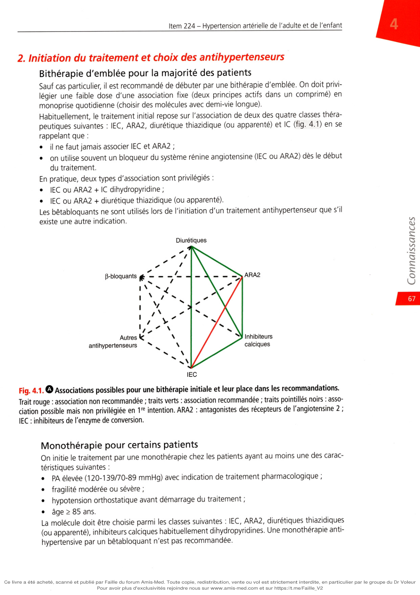

# Item 224 — Hypertension artérielle de l'adulte et de l'enfant

> **Collège CNEC / SFC** · 3e édition (2025) · p. 51–81 · R2C  
> Partie I — Athérome, facteurs de risque cardiovasculaire, maladie coronarienne, artériopathie

---

## Trois repères à ne pas confondre

| Badge | Signification (R2C) |
|---|---|
| **Rang A** | Connaissances fondamentales de fin de 2e cycle |
| **Rang B** | Connaissances essentielles, plus spécialisées |
| **Rang C** | Connaissances de 3e cycle (DES) |

Les pastilles du livre (● = A, ■ = B) sont reprises inline. Un objectif sans pastille = **Rang C**. Les objectifs grisés (*) ne sont pas traités dans le corps du chapitre.

---

## Situations de départ

42 Hypertension artérielle.  
53 Hypertension durant la grossesse.  
178 Demande/prescription raisonnée et choix d'un examen diagnostique.  
185 Réalisation et interprétation d'un électrocardiogramme (ECG).  
201 Dyskaliémie.  
253 Prescrire des diurétiques.  
282 Prescription médicamenteuse, consultation de suivi et éducation d'un patient hypertendu.  
320 Prévention des maladies cardiovasculaires.  
328 Annonce d'une maladie chronique.  
354 Évaluation de l'observance thérapeutique.

---

## Hiérarchisation des connaissances

| Rang | Rubrique | Intitulé | Descriptif |
|---|---|---|---|
| **A** | Définition | Définition de l'HTA | |
| **B** | Prévalence, épidémiologie | Épidémiologie de l'HTA, HTA facteur de risque cardiovasculaire majeur | Prévalence, liens (âge, obésité, diabète, etc.), complications cardiovasculaires, répartition HTA essentielle et secondaire |
| **B** | Physiopathologie | Physiopathologie de l'HTA | Principaux mécanismes (rénine ou volodépendants), facteurs environnementaux |
| **A** | Diagnostic positif | Mesure de la pression artérielle | Connaître les méthodes de mesure de la PA (consultation, automesure, MAPA) et interpréter |
| **A** | Diagnostic positif | Évaluation initiale d'un patient hypertendu | Circonstances de découverte, interrogatoire, risque cardiovasculaire, examen clinique |
| **A** | Examens complémentaires | Examens complémentaires de 1re intention | Bilan biologique minimal, ECG |
| **A** | Suivi et/ou pronostic | Complications de l'HTA, retentissement sur les organes cibles | Neurosensorielles, cardiovasculaires, rénales |
| **A** | Diagnostic positif | Connaître les signes d'orientation en faveur d'une HTA secondaire | Savoir mener l'examen clinique et prescrire les examens complémentaires permettant d'évoquer une HTA secondaire |
| **A** | Étiologies | Connaître les principales causes d'HTA secondaire | Néphropathies parenchymateuses, HTA rénovasculaire, causes endocriniennes, coarctation de l'aorte, etc. |
| **B** | Diagnostic positif | Connaître la démarche diagnostique en cas de suspicion d'HTA secondaire | Clinique, biologie, imagerie |
| **A** | Identifier une urgence | Reconnaître une urgence hypertensive et une HTA maligne | Définition d'une crise hypertensive et d'une urgence hypertensive |
| **B** | Définition | Définition d'une HTA résistante | Connaître les facteurs de résistance (non-observance, sel, syndrome d'apnées du sommeil, médicaments ou substances hypertensives, etc.) |
| **A** | Prise en charge | Connaître les objectifs de la consultation d'annonce | Intérêts et objectifs de la prise en charge, modification du style de vie, prise en charge des autres facteurs de risque |
| **A** | Prise en charge | Connaître la stratégie du traitement médicamenteux de l'HTA | Traitement initial, classes thérapeutiques, adaptation, surveillance, chiffres cibles de PA |
| **A** | Prise en charge | Connaître les principaux effets indésirables et contre-indications des traitements antihypertenseurs | |
| **B** | Prise en charge | Connaître les situations cliniques particulières pouvant orienter le choix du traitement antihypertenseur | |
| **A** | Prise en charge | Connaître les particularités du traitement antihypertenseur du sujet âgé de plus de 80 ans | |
| **B** | Prise en charge | Prise en charge d'une urgence hypertensive | |
| **B** | Suivi et/ou pronostic | Plan de soins à long terme et modalités de suivi d'un patient hypertendu | Savoir évaluer l'efficacité du traitement, la tolérance au traitement et l'observance du patient |
| **A** | Prise en charge | Principes de prise en charge d'une HTA secondaire | HTA rénovasculaire et endocrinienne |
| **C*** | Définition | Connaître la définition de l'HTA chez l'enfant et l'existence de normes pédiatriques | *Non traité* |
| **C*** | Diagnostic positif | Mesure de la pression artérielle chez l'enfant | Connaître les indications de mesure de la PA chez l'enfant (examen systématique annuel après 3 ans, en cas de FDR) et en connaître les modalités (brassards adaptés, abaques pour l'âge et le sexe) · *Non traité* |
| **C*** | Étiologies | Connaître les principales causes d'HTA chez l'enfant | *Non traité* |

---

## Parcours Rang A

- [I. Définition et confirmation diagnostique](#i-définition-et-confirmation-diagnostique)
- [III. Prise en charge initiale](#iii-prise-en-charge-initiale-dun-patient-hypertendu)
- [IV. Traitement](#iv-traitement)
- [VI. HTA secondaire](#vi-hta-secondaire)
- [VII. Urgences hypertensives](#vii-urgences-hypertensives-et-hta-maligne)

---

## Sommaire

- [Vignette clinique](#vignette-clinique)
- [I. Définition et confirmation diagnostique](#i-définition-et-confirmation-diagnostique)
- [II. Épidémiologie, physiopathologie et conséquences](#ii-épidémiologie-physiopathologie-et-conséquences)
- [III. Prise en charge initiale d'un patient hypertendu](#iii-prise-en-charge-initiale-dun-patient-hypertendu)
- [IV. Traitement](#iv-traitement)
- [V. Suivi du patient hypertendu](#v-suivi-du-patient-hypertendu-après-la-prise-en-charge-initiale)
- [VI. HTA secondaire](#vi-hta-secondaire)
- [VII. Urgences hypertensives et HTA maligne](#vii-urgences-hypertensives-et-hta-maligne)
- [Points](#points)
- [Notions indispensables et inacceptables](#notions-indispensables-et-inacceptables)
- [Réflexes transversalité](#réflexes-transversalité)
- [Entraînement](../../Entrainement/QI/224_Hypertension_arterielle.md)

---

## Vignette clinique

Vous voyez pour une première consultation (renouvellement d'ordonnance) une patiente âgée de 47 ans. Elle a des antécédents de diabète de type 2 traité par metformine, elle pèse 75 kg pour 160 cm, fume 15 cigarettes/j depuis 25 ans. Elle décrit une dyspnée d'effort de stade 2 de la NYHA, stable. Sa pression artérielle est à 148/94 mmHg à la consultation. Elle n'a pas réalisé de bilan bio- logique depuis 1 an.

> Comment confirmez-vous le diagnostic d'HTA ?

> Si le diagnostic est confirmé, quel bilan initial clinique et paraclinique réalisez-vous ?

> Si ce bilan ne révèle pas d'anomalie supplémentaire, quel(s) traitement(s) prescrivez-vous ?

> Quels éléments de suivi et surveillance mettez-vous en place ?

> Une fois le diagnostic d'HTA établi, quels sont les principes de la prise en charge de sa pression

artérielle ? L'observance du traitement n'est pas bonne et quelques mois plus tard, elle est hospitalisée aux urgences pour une douleur thoracique brutale avec une pression artérielle mesurée à 3 reprises à 195/110 mmHg.

> Quel(s) diagnostic(s) évoquez-vous et sur quels éléments cliniques ?

> Quels examens complémentaires réalisez-vous ?

> Quelle prise en charge instaurez-vous ?

# I. Définition et confirmation diagnostique

**Rang A.**

I. Définition et confirmation diagnostique

## A. Mesure de la pression artérielle

**Rang A.** Les modalités et conditions de mesures doivent être rigoureuses et standardisées.

1. Pression artérielle de consultation Il est aujourd'hui recommandé en consultation d'utiliser un appareil électronique validé et régu- lièrement recalibré, mesurant la pression artérielle (PA) au bras par la méthode oscillométrique. Des sites comme www.stridebp.org/fr/ répertorient les appareils ayant passé les tests de fia- bilité. La méthode historique auscultatoire utilisant un stéthoscope n'est plus recommandée en 1re intention sauf pour les patients en fibrillation atriale. Les recommandations suivantes

**doivent être respectées :**

• veiller à ce que le sujet soit assis confortablement, dans un environnement calme, au repos physique et psychique depuis > 5 minutes, plus de 30 minutes après un effort physique, d'une prise de café ou d'exposition à la cigarette, vessie vide ;

• utiliser un brassard adapté à la taille du bras (trois tailles : obèse, standard, enfant) et positionné à hauteur du cœur. Le bras doit reposer sur un support (table) pour éviter des contractions musculaires pouvant augmenter la PA. Le dos doit être calé ;

• réaliser au moins 3 mesures espacées de 1 à 2 minutes, on retient la moyenne des 2 dernières mesures. Si les 2 premières mesures diffèrent de plus de 10 mmHg de pression artérielle systolique (PAS), des mesures supplémentaires doivent être réalisées en retenant toujours la moyenne des 2 dernières mesures ;

• mesurer la PA aux deux bras à la première consultation pour rechercher une asymétrie tensionnelle (suspecter une sténose de l'artère subclavière). Dans ce cas, utiliser le bras avec les valeurs les plus élevées comme bras de référence ;

• rechercher une hypotension orthostatique au cours de la première consultation. Elle est fré- quente chez les sujets âgés, fragiles, diabétiques ou avec d'autres causes de dysautonomie :

-

mesurer la PA et la fréquence cardiaque (FC) après 5 minutes en position allongée ou assise,

-

placer le patient en position orthostatique (debout) et mesurer la PA et la FC après 1 et 3 minutes. Le diagnostic d'hypotension orthostatique est confirmé en présence d'une baisse d'au moins 20 mmHg pour la PAS et/ou d'une baisse d'au moins 10 mmHg de la pression artérielle diastolique (PAD) à 1 et/ou 3 minutes ;

• mesurer la FC de repos par la palpation du pouls pendant au moins 30 secondes, en recher- chant une éventuelle arythmie cardiaque. Risque d'erreur de mesure et rigidité artérielle

• Chez le sujet âgé, diabétique et/ou hémodialysé, des calcifications vasculaires importantes peuvent

entraîner une rigidité extrême des artères, qui deviennent incompressibles. Ce phénomène prend en défaut la méthode de mesure avec brassard, aboutissant à une surestimation de la PA de 20 mmHg (et parfois de 40 à 50 mmHg). Chez ces patients, on constate que le pouls radial reste perçu quand le brassard est gonflé au-dessus du niveau de la PAS (manœuvre d'Osler). Un cordon induré huméral ou radial peut être retrouvé.

• Une élévation de la pression pulsée (différence entre PAS et PAD) > 65 mmHg est aussi un marqueur

de rigidité artérielle. 2. Automesure tensionnelle (AMT) L'automesure tensionnelle (mesure de la PA par le sujet lui-même à domicile) est en France l'examen recommandé pour confirmer le diagnostic d'hypertension artérielle (HTA). La mesure des PA sur 3 jours améliore également la prédiction du risque cardiovasculaire, est mieux cor- rélée à l'atteinte des organes cibles et augmente l'adhésion du patient à son traitement. Il est recommandé d'utiliser un appareil validé semi-automatique avec un brassard huméral de préférence (les dispositifs de mesure au poignet exposent à plus de risques d'erreur). Une éducation du patient est nécessaire.

**Schéma recommandé par la Société française d'HTA et l’HAS :**

« règle des 3 »

• Réaliser des mesures 3 jours consécutifs, le matin 20 minutes après le lever, avant le petit-déjeuner et la

prise de médicaments, et le soir dans l'heure avant le coucher.

• À chaque fois, après 5 minutes de repos, réaliser 3 mesures (avec 1-2 minutes d'intervalle) en position

assise avec l’avant-bras posé sur la table permettant d'avoir le brassard à la hauteur du cœur. Il convient donc de réaliser 18 mesures au total : « 3 mesures le matin, 3 mesures le soir, 3 jours de suite ». Le patient reporte les paramètres mesurés (PAS, PAD, FC) sur une fiche de recueil (ou une application sur le smartphone), calcule la moyenne des 2 dernières mesures pour chaque prise et présente le document au médecin lors de la consultation. 3. Mesure ambulatoire de la pression artérielle (MAPA) La MAPA est une autre méthode de mesure ambulatoire de la PA qui est utilisée notamment quand l'AMT n'est pas possible ou pas fiable (difficultés de manipulation ou de report des valeurs par le patient, anxiété induite par l'automesure, etc.). Elle est un bon prédicteur du risque cardiovasculaire (la PA nocturne est plus précise que la PA diurne pour évaluer le risque cardiovasculaire d'un sujet). Elle est très corrélée à l'atteinte des organes cibles et évalue précisément la réduction de PA sous traitement. La MAPA doit être réalisée sur 24 heures durant une période d'activité habituelle du patient. On utilise un appareil de mesure automatique de la PA (déclenchement des mesures sans intervention du patient). Le brassard doit être adapté à la taille du bras. Il est important que le déroulement de l'examen soit expliqué au patient. Celui-ci doit remplir un journal d'activité servant à consigner les heures réelles du coucher et du lever, éventuellement les heures de prise de médicaments et l'horaire d'apparition de symptômes éventuels. Il est recommandé de procéder à des mesures suffisamment rapprochées, soit une mesure toutes les 15-30 minutes pendant la période diurne et toutes les 30-60 minutes pendant la période nocturne.

**On peut aussi utiliser la MAPA dans les situations suivantes spécifiques :**

• confirmer le diagnostic d'HTA résistante ;

• rechercher des épisodes d'hypotension artérielle symptomatiques (asthénie, lipothymies, etc.) ;

• mieux évaluer la PA en cas de forte variabilité des mesures ;

• explorer la PA nocturne.

## B. Définition et stratégie diagnostique

La distribution des PA dans la population est continue et la progression vers l'hypertension est graduelle. La Société européenne de cardiologie (ESC) recommande en 2024 de classer la PA en 3 caté- gories : PA non élevée, PA élevée et HTA, afin de faciliter la prise de décision en matière de traitement. 1. Pression artérielle normale ou non élevée Chez l'adulte, une PA normale est < 120 mmHg pour la PAS et < 70 mmHg pour la PAD, en mesure de consultation ou en AMT (cf. tableau 4.1 pour les valeurs en MAPA). 2. Notion de pression artérielle élevée

• Les recommandations de l'ESC en 2024 identifient la notion de PA élevée chez des sujets

avec une PAS entre 120 et 139 mmHg et/ou une PAD entre 70 à 89 mmHg en consultation. Pour les valeurs d'AMT, une PAS entre 120 et 134 mmHg et/ou une PAD entre 70 à 84 mmHg définissent une PA élevée (cf. tableau 4.1 pour les valeurs en MAPA). Cette notion est importante car ces sujets doivent bénéficier d'une évaluation de leur risque cardiovasculaire global - en prenant en compte les autres facteurs de risque cardio- vasculaire grâce aux SCORE2, SCORE2-OP, SCORE-Diabetes ou les situations d'emblée à haut risque : antécédent de maladie cardiovasculaire, insuffisance rénale ou hypercholestérolémie familiale (cf. chapitre 2) - et d'une prise en charge adaptée avec parfois introduction d'un traitement antihypertenseur si ce risque est suffisamment élevé. 3. Définition de l'hypertension artérielle

• **Rang A.** En mesure de consultation, l'HTA est définie par une moyenne des valeurs de PAS

> 140 mmHg et/ou de PAD > 90 mmHg.

• Pour confirmer le diagnostic d'HTA fait sur des mesures de consultation, il est recommandé (en l'absence d'urgence hypertensive) de mesurer la PA en dehors du cabinet médical, au domicile du patient, préférentiellement par AMT ou à défaut par MAPA.

• En AMT, l'HTA est définie par une moyenne des valeurs de PAS > 135 mmHg et/ou de PAD

> 85 mmHg (tableau 4.1).

**Tableau 4.1. 0 Q Définition des deux catégories de pression artérielle (PA) suivant la méthode de**

mesure utilisée. Type de mesure PA non élevée (mmHg) PA élevée (mmHg) HTA (mmHg) PA de consultation PAS < 120 et PAD <70 PAS 120-139 et/ou PAD 70-89 PAS > 140 et/ou PAD > 90 AMT PAS < 120 et PAD <70 PAS 120-134 et/ou PAD 70-84 PAS > 135 et/ou PAD >85 MAPA sur 24 heures PAS < 115 et PAD <65 PAS 115-130 et/ou PAD 65-79 PAS > 130 et/ou PAD > 80 MAPA diurne PAS < 120 et PAD < 70 PAS 120-134 et/ou PAD 70-84 PAS > 135 et/ou PAD > 85 MAPA nocturne PAS < 110 et PAD <60 PAS 110-119 et/ou PAD 60-69 PAS > 120 et/ou PAD >70 AMT : automesure tensionnelle ; HTA : hypertension artérielle ; MAPA : mesure ambulatoire de la pression artérielle ; PAD : pression artérielle diastolique ; PAS : pression artérielle systolique. Source : McEvoy JW, McCarthy CP, Bruno RM, et al. 2024 ESC Guidelines for the management of elevated blood pressure and hypertension. Eur Heart J. 2024;45(38):3912-4018. doi: 10.1093/eurheartj/ehae178. 4. Niveaux de sévérité de la PA et implication Le tableau 4.2 montre la classification de la sévérité de l'HTA en fonction des valeurs de PA chez l'adulte. En présence d'une HTA de grade 3, il faut systématiquement rechercher une urgence hypertensive. Chez un patient vu en consultation pour la première fois et qui a une PA élevée, la réalisation d'une mesure en dehors du cabinet à but de confirmation diagnostique doit être réalisée dans le mois en cas d'HTA de grade 2, dans la semaine en cas d'HTA de grade 3 sans urgence hypertensive.

**Tableau 4.2. 0 Classification des niveaux d'HTA à partir de la pression artérielle de consultation chez**

l'adulte. Catégorie PAS (mmHg) PAD (mmHg) HTA grade 1 140-159 et/ou 90-99 HTA grade 2 160-179 et/ou 100-109 HTA grade 3

> 180

et/ou ≥ 110 HTA : hypertension artérielle ; PAD : pression artérielle diastolique ; PAS : pression artérielle systolique. 5. Profils particuliers d'HTA (discordance des mesures consultation/ ambulatoire) En cas de concordance entre les mesures de consultation et en dehors du cabinet (AMT et/ou MAPA), le diagnostic d'HTA est confirmé. En revanche, il existe deux situations fréquentes et spécifiques de discordance des mesures. HTA blouse blanche Dans cette situation, qui touche 15-20 % de la population adulte, la PA de consultation est supérieure à 140/90 mmHg mais les mesures ambulatoires ne confirment pas le diagnostic. Les sujets concernés doivent être surveillés régulièrement par des mesures en dehors du cabi- net car ils sont à risque de développer une HTA confirmée secondairement. Il n'y a pas d'indi- cation à démarrer un traitement médicamenteux mais les mesures hygiénodiététiques doivent leur être proposées. HTA masquée Dans cette situation, qui touche 10-15 % de la population adulte, la PA de consultation est inférieure à 140/90 mmHg mais les mesures ambulatoires indiquent un diagnostic d'HTA (par exemple AMT > 135/85 mmHg). Le plus souvent, les patients présentant une HTA masquée ont une PA de consultation proche des seuils diagnostiques d'HTA et un risque cardiovasculaire élevé. L'HTA masquée expose au même risque d'événements cardiovasculaire que les formes habi- tuelles d'HTA et elle doit être prise en charge de la même façon. Les mesures de PA en dehors du cabinet sont préférées pour la surveillance des chiffres tensionnels et les prises de décision sur le traitement.

---

# II. Épidémiologie, physiopathologie et conséquences

**Rang A** · **Rang B**.

II. Épidémiologie, physiopathologie et conséquences

## A. Épidémiologie

L'HTA est la maladie chronique la plus fréquente en France et dans le monde : elle affecte plus de 1,5 milliard de personnes et reste la première cause de mortalité avec plus de 10 millions de décès annuels. En 2023, 17 millions de Français adultes avaient une HTA et 1,6 million de nouveaux patients étaient traités pour HTA chaque année. D'après l'étude ESTEBAN (Étude de santé sur l'environnement, la biosurveillance, l'activité physique et la nutrition) réalisée en France en dans le milieu des années 2010, 30 % de la population adulte entre 18 et 74 ans était hypertendue. Cette étude a également montré que le dépistage et le traitement de l'HTA étaient largement insuffisants : 50 % des hypertendus n'étaient pas traités, voire non diagnostiqués, 50 % des hypertendus diagnostiqués et traités n'atteignaient pas les objectifs tensionnels. Au total, seuls 25 % des hypertendus français étaient diagnostiqués, traités et contrôlés. La prévalence de l'HTA augmente avec l'âge, avec une prévalence de plus de 60 % au-delà de 70 ans et de 70 % après 80 ans. L'HTA est plus fréquente chez les sujets qui ont déjà un autre facteur de risque cardiovasculaire, chez les individus en surpoids et dans les populations défavorisées. La consommation d'alcool, une vie sédentaire et une exposition à des stress répétés favorisent également l'HTA. Le niveau de PA est un trait partiellement héritable, ce qui veut dire que les enfants d'un ou deux parents hypertendus (surtout en cas de démarrage de l'HTA à un âge jeune) sont plus à risque de développer eux-mêmes une HTA. L'HTA est la première maladie chronique, le premier facteur de risque cardiovasculaire de mortalité et le deuxième facteur de risque d'années de vie perdues en bonne santé en France. C'est donc un facteur de risque cardiovasculaire majeur, en particulier de la maladie athéromateuse. Chez les patients hypertendus (en comparaison à des patients normotendus), la morta- lité cardiovasculaire est doublée du fait d'une plus grande incidence des complications

**cardiovasculaires :**

• accident vasculaire cérébral (x 7) ;

• fibrillation atriale ;

• insuffisance coronarienne (x 3) et notamment syndromes coronariens aigus ;

• artériopathie des membres inférieurs (x 2) ;

• insuffisance cardiaque (x 4) ;

• insuffisance rénale chronique terminale ;

• démence vasculaire.

**Rang B.** La mise en place d'un traitement aboutissant au respect des objectifs tensionnels est effi-

cace pour diminuer les complications cardiovasculaires et rénales associées à l'HTA et dimi- nuer la mortalité cardiovasculaire. Cette réversibilité du risque par la correction des chiffres tensionnels est bien meilleure pour les accidents vasculaires cérébraux que pour les accidents coronariens. En 2015, une méta-analyse a montré qu'une réduction de PAD de 5 à 6 mmHg et une baisse de 10 mmHg de la PAS pendant 5 ans permettraient de diminuer le risque d'accident vascu- laire cérébral d'un tiers, le risque d'insuffisance coronarienne de 1/6e et le risque d'insuffisance cardiaque de 46 %.

**Rang A.** Les recommandations européennes de 2024 précisent que le dépistage d'une PA élevée et

de l'HTA doit être envisagé au moins tous les 3 ans pour les adultes âgés de moins de 40 ans et au moins une fois par an à partir de 40 ans.

## B. Physiopathologie

1. Rappel des systèmes régulateurs

**Rang B.** La régulation à court terme de la PA se fait par le système sympathique via le baroréflexe

carotidien et aortique, le tronc cérébral (centre vasopresseur), les voies effectrices à destinée artérielle depuis les chaînes sympathiques latérovertébrales ainsi que les médullosurrénales. Les neuromédiateurs sont oq-adrénergiques vasoconstricteurs ou p2-adrénergiques vasodilatateurs. La régulation à moyen terme de la volémie et de la vasomotricité se fait par le système rénine- angiotensine-aldostérone et les peptides natriurétiques (ANP [atrial natriuretic peptide] et BNP [brain natriuretic peptide]). La régulation à long terme de la PA se fait par le phénomène dit de natriurèse de pression (excrétion urinaire augmentée d'ions sodium en cas d'élévation de PA) et par le système arginine-vasopressine. 2. Hypothèses physiopathologiques Dans 10 % des cas, l'HTA est majoritairement provoquée par une cause spécifique (toxique, iatrogène, rénale, rénovasculaire ou endocrinienne) dont le traitement ciblé (s'il est possible) peut améliorer fortement le contrôle tensionnel et au mieux guérir le patient de son HTA. On parle alors d'HTA secondaire. Dans 90 % des cas, l'HTA est dite essentielle. Elle est la conséquence combinée de facteurs génétiques (héritabilité du niveau de PA) et de facteurs environnementaux nombreux comme d'autres facteurs de risque cardiovasculaire (tabagisme, diabète), des comportements alimen- taires (alimentation riche en sodium et pauvre en potassium, fruits et légumes), le surpoids, l'alcool, la sédentarité, l'absence d'activité physique et le vieillissement. L'HTA essentielle résulte de la dysfonction de plusieurs systèmes de régulation de la PA :

• tonus vasculaire des petites artères (artères de résistance) ;

• balance hydrosodée ;

• système arginine-vasopressine ;

• système rénine-angiotensine-aldostérone ;

• système sympathique (notamment via le baroréflexe) ;

• insulinorésistance (chez les sujets en surpoids).

**Globalement, l'altération de ses systèmes conduit à :**

• une augmentation de la réactivité des vaisseaux de résistance (vasoconstriction) ;

• des anomalies structurelles des artérioles (fibrose de la média et hyperplasie des cellules musculaires lisses) ;

• une augmentation la rigidité artérielle de l'aorte et de ses branches ;

• une rétention hydrosodée (inadéquation entre la PA et l'excrétion de sodium). Ces mécanismes s'associent pour déclencher et amplifier la maladie. Pour 15 % des cas d'HTA essentielle, la maladie se présente sous une forme familiale. Il existe souvent un début précoce avant 30 ans avec le même profil de déclenchement chez un ou les deux parents. Il s'agit de formes d'HTA essentielle avec une composante génétique forte, polygénique et il n'y a pas d'indication à un test génétique. De très rares de formes d'HTA familiale sont liées à une maladie monogénique le plus souvent en lien avec des anomalies de l'homéostasie rénale.

## C. Complications, retentissement sur les organes cibles

**Rang A.** II existe une relation continue et positive entre le niveau de la PA et l'incidence des compli-

cations cardiaques (insuffisance cardiaque, cardiopathie ischémique, fibrillation atriale), neuro- vasculaires (AVC, démence) et rénales (néphropathie). 1. Complications cardiovasculaires

**Ce sont les complications suivantes :**

• **insuffisance cardiaque à fraction d'éjection altérée :**

-

conséquence d'une atteinte ischémique (maladie coronarienne avec ou sans infarctus du myocarde),

-

liée à l'HTA elle-même du fait de l'augmentation permanente de la postcharge (forme rencontrée dans l'HTA sévère, plus souvent chez les sujets noirs). Il s'agit alors d'une insuffisance ventriculaire gauche avec diminution de la fraction d'éjection sur un cœur à la fois dilaté et hypertrophié. On parle d'hypertrophie ventriculaire gauche (HVG) excentrique ;

• insuffisance cardiaque à fraction d'éjection préservée par anomalie du remplissage ventri- culaire (troubles de la compliance et de la relaxation), liée à l'HVG et souvent à la fibrose du ventricule gauche, sur un cœur hypertrophié et non dilaté ;

• cardiopathie ischémique : angor, syndrome coronarien aigu (SCA) avec ou sans sus- décalage du segment ST. L'angor chez un hypertendu peut être lié à une maladie corona- rienne athéromateuse ou à l'HTA elle-même (diminution de la réserve coronarienne due à l'HVG) ou aux deux ;

• fibrillation atriale (FA) dont l'HTA est la première cause (70 % des sujets en FA sont hyper- tendus). La FA est favorisée par les anomalies de remplissage secondaire à l'HVG qui pro- voquent une augmentation de la pression diastolique ventriculaire gauche et une dilatation progressive de l'oreillette gauche. L'HTA est un facteur de risque thromboembolique au cours de la FA (1 point dans le score CHA2DS2VASC) ;

• mort subite : risque x 3 chez l'hypertendu ;

• maladie athéromateuse : artériopathie des membres inférieurs (AOMI), sténose caroti- dienne, anévrisme de l'aorte abdominale, etc. La mortalité cardiovasculaire est accrue chez l'hypertendu, multipliée par 5 chez l'homme et par 3 chez la femme. 2. Complications neurovasculaires

**Il s'agit des complications suivantes :**

• accident ischémique transitoire (AIT) et accident vasculaire cérébral (AVC) ischémique (80 % des formes d'AVC dans l'HTA) ;

• hémorragie cérébrale (20 % des formes d'AVC dans l'HTA) (intraparenchymateuse par rupture de microanévrisme ou par nécrose fibrinoide), hémorragie méningée (dans cette éventualité, une association avec une malformation vasculaire est souvent retrouvée), par- fois mixte ;

• encéphalopathie hypertensive, possible dans toutes les formes d'hypertension mais surtout dans les hypertensions s'aggravant rapidement (hypertension maligne, toxémie gravidique, glomérulonéphrites aiguës) ;

• lacune cérébrale ;

• démence vasculaire ;

• rétinopathie hypertensive avec dans les formes les plus graves (stade 4) un œdème papil- laire et une hémorragie rétinienne. 3. Complications rénales

**Ce sont les complications suivantes :**

• néphroangiosclérose, conséquence d'une HTA chronique non contrôlée altérant séquen- tiellement les artérioles rénales, les glomérules, les tubules rénaux et les tissus interstitiels. Elle peut évoluer vers l'insuffisance rénale par réduction néphronique qui, à son tour, aggrave l'HTA. Un signe précoce est l'apparition d'une microalbuminurie qui marque la glomérulopathie ;

• insuffisance rénale sur maladie athéromateuse des artères rénales avec sténose de l'artère rénale et/ou emboles de cholestérol ;

• insuffisance rénale aiguë iatrogène au cours du traitement d'une HTA après prescription de diurétiques entraînant une déshydratation extracellulaire, ou après prescription d'un bloqueur du système rénine-angiotensine en cas de sténose bilatérale des artères rénales ou de sténose de l'artère rénale d'un rein unique.

---

# III. Prise en charge initiale d'un patient hypertendu

**Rang A.**

III. Prise en charge initiale d'un patient hypertendu

## A. Circonstances de découverte et démarche diagnostique

initiale Le plus souvent, l'HTA est totalement latente et n'est qu'une découverte d'examen systéma- tique. Il est banal de repérer une élévation tensionnelle à l'occasion d'une consultation pour

**des symptômes non spécifiques :**

• céphalées occipitales légèrement battantes, matinales, qui résistent volontiers aux antal- giques habituels et cèdent en quelques minutes au lever ou progressivement dans la matinée ;

• fatigabilité anormale, nervosité, insomnie ;

• phosphènes ;

• épistaxis. En fait, il n'est pas du tout certain que l'HTA soit toujours à l'origine de ces symptômes et son diagnostic ne peut pas être affirmé sur leur présence. La démarche diagnostique habituelle doit être réalisée et les autres causes possibles de ces manifestations fonctionnelles recherchées. Enfin, ces symptômes ne justifient pas à eux seuls un traitement antihypertenseur immédiat. Le dépistage systématique et régulier de l'HTA est donc essentiel. Le médecin généraliste doit mesurer régulièrement la PA de ses patients. D'autres professionnels de santé sont encouragés à participer à ce dépistage : médecin spécialiste, médecin du travail, infirmier, pharmacien, infirmier en pratique avancée, etc. Une PA supérieure ou égale à 140/90 mmHg mesurée au cabinet médical fait suspecter une HTA. Celle-ci doit être confirmée en dehors du cabinet médical par AMT ou MAPA avant de débuter le traitement antihypertenseur, sauf en cas d'urgence hypertensive.

## B. Évaluation initiale du patient hypertendu

**Une fois l'HTA confirmée, la poursuite de la prise en charge doit :**

• préciser le niveau de la PA ;

• évaluer le risque cardiovasculaire global du patient en identifiant les facteurs de risque cardiovasculaire associés ;

• rechercher une atteinte des organes cibles clinique ou infraclinique : atteinte vasculaire, cardiaque, cérébrale ou rénale ;

• rechercher des facteurs aggravant la maladie ;

• rechercher des arguments orientant vers une HTA secondaire. Cette démarche se termine par une consultation d'annonce de l'HTA. 1. Interrogatoire

**Il précise :**

• l'ancienneté de l'HTA et les valeurs antérieures ;

• les facteurs de risque cardiovasculaire associés : dyslipidémie, diabète, tabagisme, anté- cédents (ATCD) familiaux cardiovasculaires précoces ;

• les facteurs pouvant aggraver l'HTA : alimentation riche en graisses animales, en sel, pauvre en fruits et légumes, consommation d'alcool, faible niveau d'activité physique, sédentarité, surpoids (rechercher une prise de poids récente), ronflements et pauses nocturnes (inter- roger le conjoint) évoquant un syndrome d'apnées obstructives du sommeil (SAOS) ;

• les ATCD de grossesse compliquée (HTA ou diabète gravidique, prééclampsie, naissance prématurée, fausses couches à répétition, mort fœtale in utero) ;

• **les ATCD et symptômes évocateurs d'une atteinte des organes cibles :**

-

ATCD de maladie coronarienne, d'insuffisance cardiaque, d'AVC, d'AIT, d'atteinte vas- culaire périphérique, de néphropathie,

-

atteinte neurovasculaire : céphalées, vertiges, troubles visuels, déficit sensitif ou moteur, troubles cognitifs (utiliser le MMSE : Mini Mental State Examination),

-

atteinte cardiaque : palpitations, douleur thoracique, dyspnée, œdèmes des membres inférieurs,

-

atteinte rénale : soif, polyurie, nycturie, hématurie, œdèmes des membres inférieurs,

-

atteinte des artères périphériques : extrémités froides, claudication intermittente ;

• **les symptômes évocateurs d'une HTA secondaire :**

-

histoire familiale de néphropathie (polykystose familiale) ou de polyendocrinopathies (en particulier cancers endocriniens),

-

infections urinaires répétées, hématurie, autre maladie rénale connue,

-

médicaments : contraceptifs oraux, vasoconstricteurs par voie nasale, corticoïdes, AINS (anti-inflammatoires non stéroïdiens), érythropoïétine, ciclosporine, tacrolimus, dérivés de l'ergot de seigle, inhibiteurs de la tyrosine-kinase, anti-VEGF (facteur de croissance de l'endothélium vasculaire).

-

substances toxiques : produits contenant de la réglisse (boissons anisées avec ou sans alcool, bonbons et tisanes à la réglisse, etc.), cannabis, cocaïne, amphétamines, alcool,

-

triade céphalées, sueurs, palpitations (triade de Ménard) du phéochromocytome (symp- tômes survenant par crises brutales sans facteur déclenchant),

-

troubles neuromusculaires avec asthénie, crampes, crises de tétanie, trouble de la sensi- bilité prédominant aux extrémités ou constipation. Ces signes font évoquer une hypo- kaliémie et un hyperaldostéronisme,

-

signes d'hypercatabolisme (ecchymoses faciles), hyperandrogénie chez la femme (oligospanioménorrhée/aménorrhée). Ces signes font évoquer un hypercortisolisme (syndrome de Cushing). 2. Examen clinique

**Il recherche :**

• **une hypotension orthostatique :**

• **des signes évocateurs d'une atteinte des organes cibles :**

-

atteinte neurovasculaire : souffles carotidiens, déficit moteur ou sensitif,

-

atteinte cardiaque : tachycardie, arythmie, galop, œdèmes des membres inférieurs, autres signes d'insuffisance cardiaque droite et gauche,

-

artères périphériques : absence, diminution ou asymétrie des pouls, souffle abdominal, masse abdominale battante, extrémités froides, lésions cutanées d'allure ischémique ;

• **des signes évocateurs d'une HTA secondaire :**

-

souffle précordial, diminution ou abolition des pouls fémoraux (suspicion de coarctation aortique),

-

souffle aortique abdominal (HTA rénovasculaire),

-

gros reins palpables (polykystose),

-

signes cutanés de neurofibromatose (phéochromocytome),

-

éléments du syndrome de Cushing : signes d'hypercatabolisme (fragilité cutanée avec peau fine, vergetures pourpres et larges, érythrose faciale, amyotrophie proximale avec signe du tabouret), répartition faciotronculaire des graisses (« bosse de bison »), hyper- androgénie chez la femme (hirsutisme) ;

• **une obésité viscérale :**

-

poids, indice de masse corporelle,

-

périmètre abdominal en position debout. 3. Examens complémentaires systématiques Le but de ces examens est de rechercher d'autres facteurs de risque cardiovasculaire, une atteinte infraclinique des organes cibles ou des arguments pour une HTA secondaire :

• glycémie à jeun, HbA1c (hémoglobine glyquée) ;

• cholestérol total, HDL-C, triglycérides, calcul du LDL-C ;

• natrémie et kaliémie (éventuellement sans garrot) ;

• dosage de l'hémoglobine et de l'hématocrite ;

• créatininémie, estimation du débit de filtration glomérulaire (formule CKD-EPI [Chronic Kidney Disease Epidemiology collaboration]) ;

• protéinurie par le rapport protéinurie/créatininurie sur un échantillon d'urine (idéalement recueilli le matin) ;

• ECG (électrocardiogramme) de repos ;

• autres examens complémentaires non systématiques, à prescrire en fonction du contexte et

**si cela peut modifier la prise en charge du patient :**

-

échocardiographie en présence d'anomalies sur l'ECG, ou de signes fonctionnels cardio- logiques (dyspnée par exemple),

-

index de pression systolique (IPS) et échodoppler des troncs supra-aortiques ou des artères de membres inférieurs (souffle vasculaire et/ou symptômes évocateurs d'AOMI par exemple),

-

fond d'œil (en cas d'HTA de grade 2 ou 3 avec suspicion d'HTA maligne),

-

dosage de β-hCG (human chorionic gonadotropin) en cas de suspicion de grossesse (certains antihypertenseurs sont contre-indiqués pendant la grossesse). 4. Atteinte infraclinique cardiaque Anomalies ECG

**Les anomalies suivantes sont recherchées :**

• HVG électrique (indices de Sokolow, de Cornell ou de Lewis). La présence de signes élec- triques d'HVG traduit une HVG marquée car l'ECG est peu sensible ;

• séquelle d'un infarctus du myocarde passé inaperçu (non exceptionnel) ;

• anomalies de la repolarisation en lien avec une ischémie, parfois difficiles à distinguer de ceux liés à l'HVG (surcharge ventriculaire gauche) ;

• troubles du rythme, notamment fibrillation atriale. On peut aussi observer un ECG initial normal qui servira de repère en cas d'anomalies ultérieures. Échocardiographie (ne pas réaliser chez le sujet asymptomatique avec ECG normal) Examen sensible pour dépister une HVG et prédire le risque cardiovasculaire, il améliore la stratification du risque (pronostic altéré si HVG concentrique ou remodelage concentrique du

**ventricule gauche [VG]) et aide au choix de la thérapeutique. Il permet :**

• de rechercher une HVG définie par une masse VG > 115 g/m2 chez l'homme et 95 g/m 2 chez la femme, ou un remodelage concentrique du VG ;

• d'étudier la fonction VG : recherche d'une dysfonction systolique (troubles de cinétique segmentaire en faveur d'une maladie coronaire, diminution de fonction globale) et/ou dias- tolique (anomalies du remplissage VG ± dilatation de l'oreillette gauche) ;

• de rechercher un anévrisme de l'aorte ascendante, une dilatation de l'oreillette gauche, une coarctation aortique et un anévrisme de l'aorte abdominale 5. Atteinte infraclinique et vaisseaux (ne pas réaliser chez le sujet asymptomatique) IPS et échodoppler des troncs supra-aortiques ou des artères de membres inférieurs permettent de rechercher une maladie athéromateuse et reclassifier le risque cardiovasculaire. 6. Atteinte infraclinique et reins Une augmentation de la créatinine ou une baisse de la clairance de la créatinine sont le reflet d'une baisse du débit filtration glomérulaire (estimé par la formule CKD-EPI), voire d'une insuf- fisance rénale (DFG < 60 ml/min/1,73 m2). Une maladie rénale chronique secondaire à l'HTA ou à une cause associée peut également se traduire par une protéinurie, d'origine glomérulaire (albuminurie) ou tubulaire. On parle de protéinurie (rapport albuminurie/créatinurie, RAC) au- delà de 300 mg/g mais des valeurs supérieures à 30 mg/g sont déjà considérées comme patho- logiques. La recherche de microalbuminurie n'est systématique que chez le patient diabétique. 7. Fond d'œil Il est recommandé dans les HTA de grade 3. Les rétinopathies hypertensives de stades 3 (hémorragies ou exsudats) et 4 (oedème papillaire) sont associées à un risque accru d'événe- ments cardiovasculaires. Le diagnostic d'HTA maligne (urgence hypertensive) est posé chez un patient avec PA non contrôlée et une rétinopathie hypertensive de stade 4. 8. Avis spécialisé d'emblée

**Il s'impose en cas :**

• d'HTA sévère d'emblée (HTA de grade 3) ;

• d'HTA avant l'âge de 40 ans sauf en cas d'obésité (réalisation préalable d'un dépistage de SAOS) ;

• d'HTA résistante ;

• de situations cliniques et biologiques évocatrices d'une HTA secondaire (HTA + hypo- kaliémie par exemple). Au terme du bilan initial clinique et paraclinique, on définit le niveau de risque cardiovasculaire global du patient. C'est un élément essentiel pour guider la surveillance et le traitement. Cette évaluation repose sur les antécédents cardiovasculaires du patient, la présence d'une atteinte des organes cibles, le dépistage des facteurs de risque cardiovasculaires.

**En pratique:**

• les patients hypertendus sont classés à risque cardiovasculaire élevé d'emblée si : ATCD de maladie

coronarienne, AVC, AIT, AOMI, insuffisance cardiaque, insuffisance rénale modérée ou sévère, atteinte d'organe cible cardiaque ou vasculaire, hypercholestérolémie familiale ;

• la majorité des patients diabétiques hypertendus est aussi à risque cardiovasculaire élevé mais on recom-

mande pour les patients les plus jeunes (40-69 ans) de calculer le score de risque SCORE2-Diabetes pour évaluer le risque cardiovasculaire à 10 ans et adapter les objectifs thérapeutiques ;

• pour tous les autres patients, on réalise l'évaluation par l'utilisation des scores de risque SCORE2,

SCORE2-OP (score de risque sur 10 ans d'événement cardiovasculaire, cf. chapitre 2). 9. Consultation d'annonce Une fois l'HTA confirmée par AMT ou MAPA et le bilan initial réalisé, la consultation d'info-

**rmation et d'annonce permet :**

• d'informer sur la maladie et les risques de complications aiguës et chroniques liés à l'HTA ;

• d'expliquer les bénéfices démontrés du traitement antihypertenseursur la réduction du risque d'événements cliniques ;

• d'expliquer l'ensemble des mesures thérapeutiques médicamenteuses et non médicamen- teuses (sel, alcool, poids, activité physique, alimentation, etc.) ;

• de fixer les objectifs (dont la cible de PA) du traitement médicamenteux et non médicamenteux ;

• d'établir un plan de soins à court et long terme ;

• de recueillir le point de vue du patient et de répondre à ses questions, pour aboutir à une décision médicale partagée entre le médecin et son patient, favorisant l'adhésion de celui-ci au plan de soin.

---

# IV. Traitement

**Rang A.**

IV. Traitement L'objectif principal du traitement antihypertenseur est de réduire la mortalité cardio- vasculaire et rénale sur le long terme. Un traitement adapté permet de réduire le risque d'AVC de 20-30 %, le risque de SCA et d'insuffisance cardiaque de 10-20 %.

## A. Stratégie thérapeutique

L'indication d'un traitement et le type de prise en charge dépendent du niveau de PA et de l'évaluation du risque cardiovasculaire global. Il n'y a aucune limite d'âge pour envisager un traitement antihypertenseur.

**Le traitement repose sur quatre piliers complémentaires :**

• des mesures hygiénodiététiques ;

• un traitement des facteurs de risque associés ;

• un traitement médicamenteux ;

• une éducation thérapeutique ; Après démarrage du traitement, le patient doit être vu en consultation fréquemment (tous les mois si besoin) jusqu'à atteindre la cible de PA. Idéalement, cette cible doit être atteinte à 3 mois de l'initiation du traitement. Les recommandations européennes de 2024 précisent que chez tout hypertendu, la PAS doit être abaissée entre 120 et 129 mmHg et la PAD entre 70 et 79 mmHg en ciblant si possible une PA à 120/70 mmHg.

**Cette cible doit être adaptée :**

• d'emblée pour certains patients (hypotension orthostatique, fragilité, âge > 85 ans et espé- rance de vie limitée) ;

• au cours du suivi selon l'évolution clinique du patient et sa tolérance des traitements. Le tableau 4.3 résume la stratégie initiale à adopter.

**Tableau 4.3. 0 Stratégie thérapeutique en fonction du niveau de pression artérielle de consultation**

et du risque cardiovasculaire global (selon la Société européenne de cardiologie en 2024). Situation de départ PAS entre 120 et 129 mmHg PAS entre 130 et 139 mmHg sans risque CV élevé PAS entre 130 et 139 mmHg avec risque CV élevé Hypertension artérielle confirmée Règles hygiénodiététiques Oui Oui Oui Oui Traitement pharmacologique Non Non (surveillance régulière de la PA et réévaluation annuelle du risque cardiovasculaire) À démarrer après 3 mois d'approche hygiénodiététique si la cible de PA n'est pas atteinte Oui, immédiat chez tous les patients CV : cardiovasculaire ; PAD : pression artérielle diastolique ; PAS : pression artérielle systolique. Source : McEvoy JW, McCarthy CP, Bruno RM, et al. 2024 ESC Guidelines for the management of elevated blood pressure and hypertension. Eur Heart J. 2024;45(38):3912-4018. doi: 10.1093/eurheartj/ehael 78. Chez les patients avec une PA élevée et un risque faible, une surveillance annuelle doit être mise en place, mais en cas de risque élevé, un traitement par antihypertenseur (monothérapie) est recommandé si la PA est supérieure ou égale 130/80 mmHg après 3 mois de mesures hygiénodiététiques. Dans le cas où il n'est pas possible d'atteindre les objectifs susmentionnés ou en cas d'intolérance au traitement, il est conseillé de viser la PA la plus basse possible et inférieure à 140/90 mmHg.

## B. Mesures hygiénodiététiques

Instituées chez tous les patients avec une PA élevée ou une HTA, leur but est de diminuer la PA (réduction attendue de la PAS de 5 à 10 mmHg en moyenne), de contrôler d'autres facteurs de risque ou pathologies, pour réduire le risque de survenue d'évènements cliniques. La bonne adhésion à ces mesures peut aussi conduire à minimiser le nombre et la dose des médicaments

**antihypertenseurs nécessaires :**

• pratiquer une activité physique régulière, adaptée aux possibilités du patient, en combinant des activités aérobies (« endurance ») et des exercices en résistance dynamique (squat, pompes) et/ou isométrique (planche, chaise) ;

• éviter un mode de vie sédentaire ;

• perdre du poids en cas de surcharge pondérale, cible d'IMC 20-25 kg/m2, cible de péri- mètre abdominal < 94 cm et < 80 cm respectivement chez l'homme et la femme ;

• supprimer ou réduire la consommation d'alcool avec une cible < 10 unités d'alcool/semaine ;

• réduire l'apport sodé avec une cible journalière de 5-6 g de sel, soit une natriurèse des 24 heures autour de 100 mmol/j (rappel : 1 g de NaCI = 17 mmol de sodium) ;

• augmenter l'apport en potassium via des substituts de sel ou une alimentation riche en fruits et légumes (en l'absence de maladie rénale chronique avancée) ;

• arrêter le tabagisme ;

• suivre une alimentation de « type méditerranéen », privilégiant la consommation de fruits et légumes et d'aliments peu riches en graisses saturées, limitant au maximum la consom- mation de sucre et de boissons sucrées (sodas, jus de fruit) ;

• ne pas limiter la consommation de café (les boissons contenant de la taurine et de la caféine sont en revanche déconseillées).

## C. Traitement des facteurs de risque associés

Cf. chapitre 2.

## D. Traitement médicamenteux antihypertenseur

1. Thérapeutiques disponibles Cinq classes thérapeutiques ont démontré leur efficacité sur la réduction de la mortalité et de

**la morbidité cardiovasculaires (AVC, SCA et insuffisance cardiaque) :**

• inhibiteurs calciques (IC) de type dihydropyridine ou non dihydropyridine ;

• inhibiteurs de l'enzyme de conversion de l'angiotensine (IEC) ;

• antagonistes des récepteurs à l'angiotensine 2 (ARA2) ;

• bêtabloquants ;

• diurétiques thiazidiques ou apparentés (indapamide). Les bêtabloquants apparaissent moins efficaces que les quatre autres classes pour la préven- tion des AVC. La persistance (maintien de la prise du traitement au long cours) est plus élevée avec les ARA2 et les IEC, moindre avec les IC, et plus faible encore avec les diurétiques thiazidiques et les bêtabloquants. 2. Initiation du traitement et choix des antihypertenseurs Bithérapie d'emblée pour la majorité des patients Sauf cas particulier, il est recommandé de débuter par une bithérapie d'emblée. On doit privi- légier une faible dose d'une association fixe (deux principes actifs dans un comprimé) en monoprise quotidienne (choisir des molécules avec demi-vie longue). Habituellement, le traitement initial repose sur l'association de deux des quatre classes théra- peutiques suivantes : IEC, ARA2, diurétique thiazidique (ou apparenté) et IC (fig. 4.1) en se

**rappelant que :**

• il ne faut jamais associer IEC et ARA2 ;

• on utilise souvent un bloqueur du système rénine angiotensine (IEC ou ARA2) dès le début du traitement.

**En pratique, deux types d'association sont privilégiés :**

• IEC ou ARA2 + IC dihydropyridine ;

• IEC ou ARA2 + diurétique thiazidique (ou apparenté). Les bêtabloquants ne sont utilisés lors de l'initiation d'un traitement antihypertenseur que s'il existe une autre indication. Diurétiques [J-bloquants £ ARA2 Autres k antihypertenseurs Inhibiteurs calciques IEC

**Fig. 4.1. Associations possibles pour une bithérapie initiale et leur place dans les recommandations.**

Trait rouge : association non recommandée ; traits verts : association recommandée ; traits pointillés noirs : asso- ciation possible mais non privilégiée en 1re intention. ARA2 : antagonistes des récepteurs de l'angiotensine 2 ; IEC : inhibiteurs de l'enzyme de conversion. Monothérapie pour certains patients On initie le traitement par une monothérapie chez les patients ayant au moins une des carac-

**téristiques suivantes :**

• PA élevée (120-139/70-89 mmHg) avec indication de traitement pharmacologique ;

• fragilité modérée ou sévère ;

• hypotension orthostatique avant démarrage du traitement ;

• âge > 85 ans. La molécule doit être choisie parmi les classes suivantes : IEC, ARA2, diurétiques thiazidiques (ou apparenté), inhibiteurs calciques habituellement dihydropyridines. Une monothérapie anti- hypertensive par un bêtabloquant n'est pas recommandée. Autres critères importants de choix des médicaments

**Plusieurs autres éléments orientent le choix du traitement :**

• la présence d'une comorbidité (tableau 4.4) qui peut faire préférer certaines classes d'antihypertenseurs ;

• la présence d'une contre-indication médicamenteuse (tableau 4.5) ;

• le risque d'interaction médicamenteuse (autre pathologie traitée).

**Tableau 4.4. G Comorbidité pouvant orienter le choix d'une classe d'antihypertenseur**

IEC ARA2 IC BB Diurétique Diabète avec microalbuminurie ou insuffisance rénale X X Insuffisance rénale et/ou protéinurie X X ATCD d’AVC X X X X ATCD d'infarctus du myocarde X X X Angor X X Insuffisance cardiaque à fonction systolique altérée 1' X X (si intolérance aux IEC) X X ARA2 : antagonistes des récepteurs de l’angiotensine 2 ; ATCD : antécédent ; AVC : accident vasculaire cérébral ; BB : bêtabloquants ; IC : inhibiteurs calciques ; IEC : inhibiteurs de l’enzyme de conversion. 1. Il est probable que ces patients relèvent également d'une indication aux inhibiteurs de la SGLT2 (effet antihypertenseur modeste). 2. Ces patients relèvent également d'une indication aux antagonistes des récepteurs aux minéralocorticoïdes (antihypertenseur de 4 e intention, cf. C. HTA résistante).

**Tableau 4.5. 0 Contre-indications aux différentes classes d'antihypertenseurs**

Antihypertenseurs Contre-indications absolues Contre-indications relatives Thiazidiques (ou apparenté) Hypercalcémie, hypokaliémie, goutte, grossesse Bêtabloquants Asthme, BAV2 et 3 Bradycardie, syndrome de Raynaud IC dihydropyridines Insuffisance cardiaque non contrôlée IC non dihydropyridines (bradycardisants) BAV2 et 3, insuffisance cardiaque à fonction systolique altérée Bradycardie, autres troubles de conduction IEC Grossesse, oedème angioneurotique sous IEC Hyperkaliémie, femme en âge de procréer sans contraception efficace, sténose bilatérale des artères rénales, insuffisance rénale sévère ARA2 Grossesse Hyperkaliémie, femme en âge de procréer sans contraception efficace, sténose bilatérale des artères rénales, insuffisance rénale sévère ARA2 : antagonistes des récepteurs de l’angiotensine 2 ; BAV : bloc atrioventriculaire ; IC : inhibiteurs calciques ; IEC : inhibiteurs de l'enzyme de conversion.

## E. Éducation thérapeutique

L'éducation du patient est essentielle pour renforcer l'adhésion au traitement et in fine le contrôle tensionnel.

**Les actions principales d'éducation thérapeutique sont les suivantes :**

• promotion de la pratique de l'automesure tensionnelle avec éducation à la mesure selon la « règle des 3 » ;

• facilitation de l'observance médicamenteuse (nombre et horaires des prises médicamen- teuses adaptées au patient et usage de piluliers) ;

• éducation à la diminution (ou l'arrêt) transitoire du traitement (en particulier diurétiques, IEC et ARA2) en cas de situation à risque d'hypovolémie marquée (diarrhée, vomissements, déshydratation, forte fièvre, situation de canicule, etc.), notamment chez le sujet âgé. La réalisation d'un ionogramme sanguin et une créatininémie avec DFG sont indiquées ;

• renforcement des messages de la consultation d'annonce et vérification de leur bonne compréhension (les représentations erronées sur la maladie et le traitement sont fréquentes) ;

• éducation thérapeutique spécifique à un facteur de risque cardiovasculaire ou un facteur aggravant (diététique, tabac, activité physique adaptée, alcool, etc.). Éducation thérapeutique et approche centrée sur le patient L’approche centrée sur le patient est importante pour l'observance du traitement au long cours et le meil- leur contrôle de la pression artérielle : elle prend en compte les préférences et besoins du patient et consi- dère celui-ci comme acteur de sa prise en charge. Elle intègre l’approche éducative qui est déterminante et s’inscrit si possible au sein d'une équipe pluridisciplinaire. Elle permet aux patients de comprendre les risques liés à l'hypertension, l'intérêt des traitements, l'importance de la surveillance, de l'autoprise en charge, des modalités des automesures de PA et doit être adaptée à chaque patient.

## F. Traitement antihypertenseur du sujet âgé

Chez le sujet âgé, le critère d'âge seul n'est pas toujours suffisant pour guider le traitement antihypertenseur. L'évaluation du patient âgé doit aussi rechercher la présence d'une fragilité modérée ou sévère et/ou d'arguments en faveur d'une espérance de vie limitée à moyen terme. Il est donc recommandé de rechercher des critères de fragilité gériatrique chez les patients âgés. De même, le risque d'hypotension orthostatique est élevé chez les sujets âgés et doit être systématiquement dépisté. On rappelle également que le risque de iatrogénie est plus important chez ces patients.

**En pratique (recommandations de 2024 de l'ESC) :**

• pour les patients d'âge < 85 ans, sans critère de fragilité et sans facteurs limitant leur espé- rance de vie à moyen terme, il n'y a pas d'indication à adapter la prise en charge ;

• il n'y a pas d'indication systématique à arrêter ou diminuer le traitement d'un patient hypertendu traité qui atteint l'âge de 85 ans s'il est bien toléré (cliniquement et sur la sur- veillance paraclinique) ;

• la prise en charge du patient âgé doit être adaptée en présence d'au moins une des carac-

**téristiques suivantes :**

-

fragilité modérée ou sévère,

-

âge > 85 ans,

-

espérance de vie < 3 ans.

**Les adaptations de la prise en charge sont les suivantes :**

• initier le traitement par une monothérapie ;

• privilégier les molécules suivantes : IC dihydropyridines et/ou IEC/ARA2 en 1re intention, diurétiques thiazidiques (ou apparenté) à faible dose en 2e intention ;

• éviter les bêtabloquants (sauf autre indication formelle) et les alphabloquants ;

• ne pas dépasser une trithérapie antihypertensive ;

• individualiser la cible de PA : elle doit être adaptée à la tolérance (clinique et paraclinique) et le patient doit être exempt d'hypotension orthostatique à cette cible.

## G. Surveillance des traitements, suivi et adaptation

de la prise en charge dans les premiers mois Il est recommandé de surveiller la PA préférentiellement par AMI Celle-ci est à réaliser 1 mois après chaque adaptation thérapeutique et avant chaque consultation médicale de suivi. Après chaque introduction ou adaptation posologique des IEC/ARA2 et/ou des diurétiques, il est recommandé de réévaluer le ionogramme sanguin et la fonction rénale (créatininémie et DFGe). . Chaque consultation permet de réévaluer la tolérance du traitement et de la cible tensionnelle

**fixée :**

- 4-- ' ; '

v

• recherche d'une hypotension orthostâtiqü en particuliëç ez le sujet âgé, le patient insuffisant rénal ou diabétique ;

• recherche des effets indésirables du traitement médicamenteux (tableau 4.6) et, si néces- saire, changement de molécule bü de classe thérapeutique. Les effets indésirables sont réversibles à l'arrêt du traitement ;

• en cas de mauvaise tolérant®, réadapter la cible de PA (cible btën tolérée et aussi proche que possible de cible théorique). Si l'objectif tensionnel n'est pas atteint à 1 mois, il est recommandé (ESC de 2024) :

• d'évaluer et si besoin renforcer l'adhésion du patient aux mesures hygiénodiététiques ;

• d'évalue et si besoin renforcerl'observance du lentement médicamenteux ;

• de majorer le t'raitement-antihypertenseur en privilégiant d'abord le passage en trithérapie (idéalement IEC/ARA.2 + IÔ+ diurétiqueJtfjàzidique ou apparenté) avant de majorer les doses des trois molécules utilisées ;

• de revoir le patient en consultation à 1 mois avec une AMT. \> \Q>°

**Tableau 4.6.© Effets indésirables les plus fréquents pour différentes classes d'antihypertenseurs**

Classes thérapeutiques Effets indésirables fréquents Diurétiques thiazidiques Hypokaliémie, hyponatrémie, troubles métaboliques (hyperglycémie, hyperuricémie), insuffisance rénale fonctionnelle Bêtabloquants Asthénie (principalement en début de traitement), bradycardie sinusale, acrosyndrome, hypoglycémie, troubles de la libido, dysfonction érectile, prise de poids Inhibiteurs calciques (dihydropyridines)\> Œdèmes des membres inférieurs, céphalées, vertiges, flushs Inhibiteurs calciques (non dihydropyridines) Bradycardie, troubles de conduction, constipation, œdèmes des membres inférieurs, céphalées, vertiges, flushs IEC Toux, hyperkaliémie, insuffisance rénale fonctionnelle ARA2 Hyperkaliémie, insuffisance rénale fonctionnelle ARA2 : antagonistes des récepteurs de l'angiotensine 2 ; IEC : inhibiteurs de l'enzyme de conversion.

---

# V. Suivi du patient hypertendu après la prise en charge initiale

**Rang A** · **Rang B**.

V. Suivi du patient hypertendu après la prise en charge initiale

## A. Patient dont la cible de PA est atteinte

**Rang B.** Pour les patients à faible risque ou dont l'HTA est de grade 1, une fois la cible de PA

atteinte, une consultation est à prévoir tous les 6 mois. Des consultations plus fréquentes (3 mois) sont recommandées chez les patients à risque cardiovasculaire élevé, ainsi que chez les patients traités par mesures hygiénodiététiques seules.

**La consultation a pour objectifs :**

• de rechercher des symptômes ;

• de vérifier l'équilibre tensionnel (mesure PA au cabinet et AMT ou MAPA) ;

• d'évaluer l'observance et la tolérance du traitement ;

• de s'assurer du contrôle des facteurs de risque et de l'adhésion aux mesures hygiéno- diététiques ;

• de rechercher une hypotension orthostatique surtout en cas de diabète, de maladie de Parkinson, chez le sujet âgé.

**La surveillance paraclinique comporte :**

• un contrôle biologique tous les ans avec natrémie, kaliémie, créatininémie, recherche de protéinurie. Cette surveillance doit être plus fréquente chez le sujet âgé ;

• en l'absence de diabète ou de dyslipidémie, glycémie à jeun et bilan lipidique tous les 3 ans ;

• un ECG tous les 3 à 5 ans en l'absence de cardiopathie sous-jacente ou d'apparition de symptômes cardiaques.

**Le traitement antihypertenseur doit être adapté en cas :**

• d'hypotension orthostatique et/ou d'apparition d'une fragilité gériatrique modérée à sévère ;

• d'interaction médicamenteuse : médicaments bradycardisants et bêtabloquants, AINS et IEC/ARA2.

## B. Patient dont la cible de PA n'est pas atteinte

sous trithérapie antihypertensive

**La conduite à tenir consiste à :**

• vérifier l'équilibre tensionnel par AMT ou MAPA ;

• réévaluer l'observance et la tolérance du traitement ;

• rechercher des facteurs de résistance au traitement : enquête alimentaire (apport en sel excessif), prise de poids, alcool, dépression, médicaments hypertensiogènes (AINS, corti- coïdes, vasoconstricteurs, oestrogènes, etc.), autres substances consommées notamment psychoactives ou illicites (cannabis, cocaïne, amphétamines, etc.), argument pour une apnée du sommeil ;

• vérifier que la trithérapie est optimale : IEC/ARA2 + IC + diurétique thiazidique ou appa- renté, tous à doses optimales. On ne peut évoquer le diagnostic d'HTA résistante que chez un patient traité par un diurétique thiazidique (ou apparenté). Après avoir vérifié ces éléments, il s'agit d'une HTA résistante nécessitant un avis spécialisé.

## C. HTA résistante

Définition Persistance de valeurs de PA supérieures à la cible malgré l'instauration des mesures hygiénodiététiques et la prise d'au moins trois classes médicamenteuses dont un diurétique thiazidique ou apparenté, tous à dose optimale. Une AMT (et souvent une MAPA) doit confirmer les chiffres tensionnels.

**De nombreuses causes d'HTA « faussement résistante » doivent être éliminées :**

• HTA « blouse blanche », brassard inadapté au patient ;

• doses insuffisantes des traitements antihypertenseurs, absence de diurétique ;

• mauvaise observance du traitement ;

• règles hygiénodiététiques non suivies, notamment apport en sel excessif, prise de poids et abus d'alcool. Un avis spécialisé est nécessaire après avoir éliminé une HTA faussement résistante.

**Les causes d'HTA résistante doivent être recherchées :**

• la présence de médicaments ou de substances hypertensiogènes ;

• un SAOS ;

• une HTA secondaire méconnue ;

• une surcharge volémique : traitement diurétique insuffisant, insuffisance rénale ; Au terme du bilan et en l'absence de cause qui pourrait relever d'un traitement spécifique, on introduit, en plus de la trithérapie, un antagoniste des récepteurs minéralocorticoïdes, spiro- nolactone en 1re intention ou éplérénone si la spironolactone est mal tolérée, puis un bêta- bloquant s'il n'était pas déjà prescrit pour une indication spécifique, éventuellement d'autres classes comme les alphabloquants ou antihypertenseurs centraux et, dans certains cas, la dénervation rénale peut se discuter.

---

# VI. HTA secondaire

**Rang A** · **Rang B**.

VI. HTA secondaire

****Rang A.** Le dépistage d'HTA secondaire doit être réalisé :**

• en cas d'HTA sévère : PA > 180/110 mmHg, notamment d'apparition brutale au diagnostic ou d'aggravation rapide au cours du suivi ;

• en cas d'HTA résistante ;

• en cas d'âge < 40 ans ;

• en cas d'HTA avec hypokaliémie ;

• sur un autre point d'appel obtenu lors de l'interrogatoire, de l'examen clinique et des exa- mens biologiques du bilan initial (cf. B. Évaluation initiale du patient hypertendu). Il est recommandé d'avoir recours à un avis spécialisé pour réaliser des explorations complémentaires.

**Rang B.** Le bilan paraclinique pour rechercher des principales causes d'HTA secondaire (à adapter

**aux points d'appel identifiés) comporte :**

• polygraphie ventilatoire nocturne (dépistage d'un SAOS) ;

• échographie des reins et échodoppler et artères rénales (dépistage d'une néphropathie et d'une sténose des artères rénales) ;

• angioscanner abdominal (dépistage d'une néphropathie, d'une lésion surrénalienne et d'une sténose des artères rénales) ;

• recueil urinaire des 24 heures : natriurèse, kaliurèse, créatininurie, protéinurie, dérivés méthoxylés des catécholamines, cortisol libre urinaire, aldostéronurie (dépistage d'une néphropathie et d'une HTA endocrinienne) ;

• dosages hormonaux sanguins : rénine et aldostérone (conditions de prélèvement spéci- fiques), dérivés méthoxylés des catécholamines, plasmatiques, test de freinage minute en cas de suspicion d'hypercorticisme (dépistage d'une HTA endocrinienne).

**Rang A.** Les principales causes d'HTA secondaire sont les suivantes.

## A. Néphropathies parenchymateuses

Les glomérulopathies chroniques et la polykystose rénale représentent les causes rénales les plus fréquentes d'HTA secondaire.

**Rang A.** Le diagnostic est évoqué devant une HTA de l'adolescent ou de l'adulte jeune. La présence

de masses abdominales bilatérales à la palpation évoque une polykystose. Une protéinurie, une hématurie et une insuffisance rénale orientent vers le diagnostic. L'échographie abdominale mesure la taille des reins, leur contour, l'épaisseur corticale et recherche un obstacle sur les voies excrétrices ou des tumeurs. La prise en charge est adaptée au diagnostic de la néphropathie.

## B. HTA rénovasculaire

**Rang A.** Cette forme d'HTA secondaire est liée à la présence de sténoses sur les artères rénales avec

**deux causes principales :**

• les sténoses des artères rénales d'origine athéromateuse, les plus fréquentes. Elles touchent l'ostium et le tiers proximal de l'artère. La présence d'une autre localisation de la maladie athéromateuse ou de facteurs de risque d'athérosclérose est très fréquemment retrouvée ;

• la dysplasie fibromusculaire, plus rare, qui touche la femme jeune et les deux tiers distaux de l'artère.

**Rang A.** Le diagnostic est évoqué devant un souffle abdominal latéralisé ou un œdème aigu pulmo-

naire récidivant sans cause cardiaque, une hypokaliémie associée à un hyperaldostéronisme secondaire (augmentation de la rénine et de l'aldostérone plasmatique), une insuffisance rénale (parfois compliquant l'introduction d'IEC/ARA2), une diminution de la taille du rein concerné par la sténose. L'échodoppler des artères rénales et l'angioscanner abdominal confir- ment le diagnostic et quantifient la lésion. Le traitement comprend les règles hygiénodiététiques, l'aspirine, une statine (en cas de mala- die athéromateuse) et des antihypertenseurs. Pour la sténose athéromateuse, la revascularisation, principalement par angioplastie avec endoprothèse, se discute uniquement en présence de signes de souffrance du rein homo- latéral (HTA résistante, dégradation de la fonction rénale, protéinurie importante) et si le rein semble suffisamment fonctionnel. Pour la fibrodysplasie, le recours à l'angioplastie (sans pose d'endoprothèse) est plus largement utilisé.

## C. Phéochromocytome

**Rang A.** II s'agit d'une pathologie endocrinienne tumorale rare de la médullosurrénale le plus sou-

vent bénigne qui induit une sécrétion par pics de catécholamines dans la circulation. Elle est associée à une HTA dans 70 % des cas. Le phéochromocytome peut survenir dans un contexte de pathologies familiales géné- tiques (néoplasie endocrine multiple de type 2 [NEM2], maladie de von Hippel-Lindau, neurofibromatose de type 1, paragangliomes familiaux).

**Rang B.** L'HTA est permanente ou paroxystique et alors accompagnée de la triade de Ménard asso-

ciant céphalées, sueurs, palpitations. Des troubles du rythme cardiaque sont possibles. Le phéochromocytome est parfois révélé par une cardiomyopathie de stress. Le diagnostic est posé sur le dosage urinaire et/ou sanguin des dérivés méthoxylés des caté- cholamines (métanéphrines et normétanéphrines). La localisation de la tumeur est déterminée par un scanner couplé à une scintigraphie à la MIBG (méta-iodo-benzyl guanidine) qui permet de localiser le phéochromocytome (parfois extrasurrénalien) et apporte une confirmation fonctionnelle. Le traitement consiste en l'exérèse chirurgicale de la tumeur. Un traitement préalable par a-bloquants débutés à petites doses, augmentés progressivement et associés aux bêta- bloquants limite le risque de complications opératoires (poussée hypertensive et/ou déplé- tion volémique avec hypotension sévère).

## D. Hyperaldostéronisme primaire ou syndrome de Conn

**Rang A.** II est dû à un adénome surrénalien (30 %) ou à une hyperplasie bilatérale des surrénales

(70 %), rarement à un corticosurrénalome malin.

**Rang A.** Une hypokaliémie (< 3,7 mmol/L) chez un patient hypertendu doit faire rechercher un

hyperaldostéronisme, mais ce signe n'est pas systématiquement présent. Une HTA sévère, une HTA résistante, une HTA du sujet jeune, une atteinte des organes cibles disproportionnée par rapport à la sévérité et l'ancienneté de l'HTA, la découverte fortuite d'un nodule surrénalien chez un hypertendu évoquent le diagnostic. La biologie retrouve une augmentation de l'aldostéronémie, une baisse de la rénine plasma- tique et un rapport aldostérone/rénine très élevé. Ces dosages doivent être réalisés le matin, 2 heures après le lever, en normokaliémie, avec des apports sodés larges et après arrêt des antagonistes des récepteurs aux minéralocorticoïdes depuis 6 semaines, des IEC, ARA2, diuré- tiques et β-bloquants depuis 2 semaines. Le scanner identifie une lésion unilatérale (adénome de Conn ou incidentalome) ou une hyper- plasie bilatérale des surrénales. En cas de lésion unilatérale et si le patient est demandeur d'une chirurgie, un cathétérisme des veines surrénaliennes vérifie la latéralisation de l’hypersécrétion d'aldostérone et confirme l'indication chirurgicale de surrénalectomie. Dans les autres cas, un antagoniste des récepteurs aux minéralocorticoïdes (spironolactone en 1re intention) est introduit.

## E. Autres étiologies endocriniennes

****Rang A.** II s'agit des pathologies suivantes :**

• syndrome de Cushing (hypercortisolisme) ;

• acromégalie ;

• hyperthyroïdie.

## F. Coarctation aortique

Elle est observée chez l'enfant et l'adulte jeune. La fermeture anormale du canal artériel pro- voque une lésion sténosante de l'aorte au niveau de l'isthme aortique.

**Rang B.** L'examen clinique retrouve un souffle mésosystolique parasternal gauche et dans le dos,

des pouls fémoraux absents, une HTA aux membres supérieurs associée à une PA basse aux membres inférieurs. Le diagnostic est confirmé par l'échocardiographie et l'IRM. Le traitement est soit chirurgical, soit endoluminal (dilatation avec pose d'une endoprothèse).

## G. Syndrome d'apnées du sommeil (SAOS)

**Rang A.** II est évoqué chez les patients obèses, surtout si l'HTA est résistante ainsi que chez les

patients classés « non dippers » (absence de baisse nocturne de la PA en MAPA).

**Rang A.** Le syndrome est diagnostiqué par polygraphie ou polysomnographie ventilatoire nocturne,

et traité par un appareillage par masque de pression positive nocturne. H. Médicaments et produits augmentant la pression artérielle

**Rang A.** Les médicaments ou substances ayant une action vasopressive (les plus fréquents) sont les

**suivants :**

• antiangiogéniques ;

• alcool ;

• ciclosporine, tacrolimus ;

• cocaïne et amphétamines ;

• contraceptifs oraux ;

• corticoïdes ;

• érythropoïétine ;

• herbes (ephedra, ma huang) ;

• inhibiteurs mixtes de la recapture de la sérotonine et de la noradrénaline ;

• réglisse ;

• sympathomimétiques. Les médicaments ou substances interférant avec le métabolisme et/ou l'action des anti-

**hypertenseurs (les plus fréquents) sont les suivants :**

• AINS;

• antirétroviraux ;

• inhibiteurs de cytochrome P450 1 7A1 (CYP17A1) : jus de pamplemousse, macrolides, anti- fongiques azolés.

---

# VII. Urgences hypertensives et HTA maligne

**Rang A**.

VII. Urgences hypertensives et HTA maligne Ne pas confondre avec la crise hypertensive définie par une HTA de grade 3 sans souffrance viscérale et qui n'est pas une urgence.

## A. Urgence hypertensive (diagnostics et principes

de la prise en charge) L'urgence hypertensive (dont fait partie l'HTA maligne, cf. infra) est caractérisée par une HTA, le plus souvent sévère, associée à une atteinte aiguë des organes cibles. Ces urgences mettent en jeu le pronostic vital. Le traitement de l'hypertension doit être en général précoce, mais il faut éviter une chute trop brutale de la PA. En effet, les anomalies de l'autorégulation de la PA présentes chez l'hyper- tendu peuvent dans ce cas provoquer une hypoperfusion cérébrale, une ischémie myocardique ou rénale en cas de baisse trop rapide de la PA.

**Les principales urgences hypertensives sont :**

• HTA avec syndrome coronarien aigu avec ou sans sus-ST ;

• HTA avec insuffisance ventriculaire gauche (œdème aigu du poumon hypertensif) ;

• HTA avec dissection aortique ;

• encéphalopathie hypertensive (HTA avec hypertension intracrânienne) ;

• syndrome d'encéphalopathie postérieure réversible (PRES) - cécité centrale et lésions occipitales ;

• HTA avec hémorragie méningée ou AVC ;

• HTA du phéochromocytome ;

• HTA liée à l'usage d'amphétamines, de LSD (lysergic acid diethylamidë), de cocaïne, d'ecstasy ;

• prééclampsie sévère ou éclampsie nécessitant une extraction fœtale en urgence. Le diagnostic est clinique, associant des chiffres de PA élevés, souvent supérieurs à 180/110 mmHg, et un point d'appel témoignant d'une atteinte viscérale.

**Les examens paracliniques à adapter en fonction du contexte sont les suivants :**

• biologie de routine avec créatinine et recherche de protéinurie, plaquettes et bilan de coa- gulation (coagulation intravasculaire disséminée), troponine (SCA), dosage de toxiques (cocaïne), NFS (numération formule sanguine), recherche de schizocytes, bilirubine libre, haptoglobine, LDH ;

• ECG à la recherche d'un syndrome coronarien aigu ;

• radiographie de thorax à la recherche de signes de surcharge (OAP) ;

• échocardiographie (fonction systolique et diastolique globale et trouble de cinétique du ventricule gauche, pressions de remplissage du ventricule gauche) ;

• fond d'œil pour rechercher une occlusion de la veine centrale de la rétine ou une rétino- pathie stade 4 ;

• scanner cérébral en cas de suspicion d'hémorragie ou d'AVC ;

• imagerie aortique (échocardiographie transthoracique, scanner, échographie transœso- phagienne) en cas de suspicion de dissection aortique.

****Rang A.** La prise en charge est la suivante :**

• hospitalisation en unité de soins intensifs adaptée à la souffrance viscérale ou en réanimation ;

• surveillance de la PA toutes les 15 minutes ;

• en cas de point d'appel neurologique, scanner indispensable avant de débuter le traite- ment antihypertenseur pour différencier un AVC hémorragique d'un AVC ischémique ;

• dans le cas général, le traitement vise une baisse de la PA de 20 à 25 % en 2 heures pour atteindre 160/110 mmHg dans les 2 à 6 heures, il est crucial d'éviter une baisse brutale et une hypotension (risque d'aggravation, cérébrale, rénale ou cardiaque) ;

• dans la dissection aortique, il est au contraire impératif d'atteindre une PA systolique infé- rieure à 120 mmHg le plus rapidement possible ;

• prescription en 1re intention d'uradipil IV (alphabloquant) et/ou des inhibiteurs calciques IV comme la nicardipine (contre-indiquée dans l'insuffisance cardiaque) ;

• dans le phéochromocytome, emploi du labétalol IV (alpha et bêtabloquant) ;

• dans le cas des SCA ou de l'OAP, utilisation en 1re intention des dérivés nitrés IV. Les recommandations européennes de 2024 indiquent qu'en cas d'hémorragie intra- cérébrale, une baisse immédiate de la PA (dans les 6 heures suivant l'apparition des symp- tômes) doit être envisagée jusqu'à une valeur cible systolique de 140-160 mmHg afin de prévenir l'expansion de l'hématome et d'améliorer les résultats fonctionnels. Toutefois, les diminutions aiguës excessives de la PAS (> 70 mmHg) peuvent être associées à des lésions rénales aiguës et à une détérioration neurologique précoce et doivent être évitées. En cas d'AVC ischémique aigu chez les patients sans traitement de reperfusion (ni throm- bolyse ni thrombectomie mécanique), la réduction active de la PA n'est pas recommandée sauf si elle est extrêmement élevée (> 220/120 mmHg). Dans ce cas, il faut réduire modérément la PA de 10-15 % sur quelques heures pour éviter une hypoperfusion cérébrale (l'autorégulation céré- brale peut être altérée et le maintien de la perfusion cérébrale dépendrait de la PA systémique). En cas d'AVC ischémique aigu chez les patients traités par thrombolyse IV (ou throm- bectomie mécanique), des objectifs de PA inférieurs sont nécessaires afin de prévenir les complications (lésion de reperfusion, hémorragie intracrânienne).

• Thrombolyse IV : abaisser la PA <185/110 mmHg avant le traitement et la maintenir <180/105 mmHg pendant 24 heures après le traitement.

• Thrombectomie mécanique (avec ou sans thrombolyse IV) : réduire la PA <180/105 mmHg avant l'intervention, maintenir cette cible pendant les 24 heures suivantes.

**Rang A.** Pour les patients stables qui restent hypertendus (> 140/90 mmHg) au moins 3 jours après

un AVC ischémique aigu, il est recommandé d'initier ou de réintroduire un médicament antihypertenseur.

## B. HTA maligne

Le diagnostic repose sur la présence d'une PA élevée (pas de valeur seuil mais souvent HTA de grade 3) et d'un œdème papillaire au fond d'œil (stade 4). Cette atteinte peut se compliquer

**d'atteintes d'organes cibles aiguës :**

• cardiaques : insuffisance ventriculaire gauche, ischémie myocardique ;

• rénales : insuffisance rénale aiguë avec élévation de la créatininémie, protéinurie abon- dante et hématurie fréquente ;

• neurologique : PRES, encéphalopathie hypertensive, coma ;

• microangiopathie thrombotique : anémie hémolytique mécanique et thrombopénie.

**On retrouve souvent aussi :**

• une asthénie, avec amaigrissement et altération de l'état général survenant sur quelques semaines ;

• des troubles digestifs (douleurs abdominales, nausées, vomissements), de la soif, des signes possibles de déshydratation ; L'HTA maligne est caractérisée par une évolution particulièrement rapide aboutissant en quelques mois en l'absence de traitement approprié à une insuffisance rénale sévère irréversible et mortelle.

• La PA de consultation est mesurée chez un sujet assis au repos physique et psychique depuis > 5 minutes,

par au moins deux mesures espacées de 1 à 2 minutes, à répéter si les deux premières valeurs sont très différentes, en utilisant un brassard adapté à la taille du bras.

• La mesure en dehors du cabinet par MAPA ou AMT (à utiliser en 1re intention) améliore la prédiction

du risque cardiovasculaire, est mieux corrélée à l'atteinte des organes cibles et évalue mieux la réduction de pression sous traitement.

• L'HTA est définie par une PA de consultation > 140/90 mmHg.

• Il existe trois grades de sévérité (grade 1 : 140/90 à 159/100 mmHg, grade 2 : 160/100 à 179/110 mmHg

et grade 3 > 180/110 mmHg).

• Une mesure de PA en dehors du cabinet (AMT ou MAPA) est nécessaire pour confirmer le diagnostic

(éliminer une HTA blouse blanche) avant de démarrer un traitement antihypertenseur (sauf urgences hypertensives). Les seuils diagnostiques sont fixés à 130/80 mmHg sur 24 heures pour la MAPA et 135/85 mmHg pour l'AMT.

• On identifie également une catégorie de patients avec une PA dite élevée (PA > 120/70 mmHg sans

critère diagnostique pour une hypertension).

• L'HTA touche 30 % des adultes entre 18 et 74 ans. Environ 17 millions de Français sont hypertendus. La

prévalence de l’HTA augmente avec l'âge.

• Il existe une relation continue et positive entre le niveau de la PA et l'incidence des complications neuro-

vasculaires (AIT/AVC, démence, rétinopathies), cardiovasculaires (insuffisance cardiaque, maladie coro- narienne, fibrillation atriale, AOMI), rénales (néphroangiosclérose, insuffisance rénale).

• L'HTA est la première maladie chronique, le premier facteur de risque cardiovasculaire de mortalité et le

deuxième facteur de risque d'années de vie perdues en bonne santé en France.

• L’HTA est dans plus de 90 % des cas dite essentielle, conséquence combinée de facteurs génétiques

(héritabilité du niveau de PA) et de facteurs environnementaux nombreux (autres facteurs de risque cardiovasculaire, alimentation, surpoids, alcool, sédentarité, absence d'activité physique).

• Le plus souvent, l’HTA est totalement latente et n'est qu'une découverte d'examen systématique.

• L'évaluation initiale précise le niveau de la PA, définit le risque cardiovasculaire global du patient, recherche

une atteinte vasculaire, cardiaque, cérébrale ou rénale (organes cibles), des facteurs aggravant la maladie et des arguments pour une HTA secondaire. Cette démarche se termine par une consultation d'annonce de l’HTA. ECG de repos.

• Des anomalies ECG sont recherchées : HVG, séquelle d'infarctus, fibrillation atriale, troubles de

repolarisation.

• Une augmentation de la créatinine est le reflet d'une baisse de la filtration glomérulaire alors que la

protéinurie traduit une altération de la surface filtrante. On parle de protéinurie au-delà d’un rapport protéinurie/créatininurie (sur échantillon urinaire) de 300 mg/g.

• Un traitement médicamenteux et non médicamenteux (mesures hygiénodiététiques) est débuté dès

confirmation du diagnostic d'HTA.

• Un traitement permettant d’atteindre la cible de PA est parfaitement efficace pour diminuer le risque

de complications cardiovasculaires et rénales.

• Les patients avec une PA élevée et un risque cardiovasculaire élevé relèvent de la mise en place d'un

traitement non médicamenteux, puis éventuellement médicamenteux.

• La cible de PA est de 120-129/70-79 mmHg dans le cas général ; elle doit être individualisée après 85 ans

(ou fragilité gériatrique ou espérance de vie < 3 ans), et en cas d’hypotension orthostatique et de mau- vaise tolérance clinique ou paraclinique.

• Les mesures hygiénodiététiques sont instaurées chez tous les patients : arrêt du tabac, réduction pondé-

rale chez les sujets en surpoids, baisse de la consommation d’alcool, activité physique et lutte contre la sédentarité, diminution de l’apport en sel (< 6 g), augmentation des apports en potassium, consomma- tion de fruits et légumes, limitation de l'apport en graisses saturées et en boissons sucrées.

• Cinq classes thérapeutiques peuvent être prescrites en 1re intention : antagonistes calciques, IEC, anta-

gonistes des récepteurs de l'angiotensine 2, diurétiques thiazidiques, bêtabloquants.

• Les bêtabloquants apparaissent moins efficaces que les quatre autres classes pour la prévention des

AVC. La persistance (poursuite du traitement au long cours) est plus élevée avec les ARA2 et les IEC, moindre avec les IC, et plus faible encore avec les diurétiques thiazidiques et les bêtabloquants.

• Les critères de choix sont les comorbidités, les contre-indications, l'efficacité et les effets indésirables

éventuels d'un médicament déjà prescrit.

• Le traitement initial repose sur une bithérapie faiblement dosée d’emblée associant habituellement un

IEC ou un ARA2 à un IC ou un diurétique, en un seul comprimé.

• Une monothérapie initiale est à envisager chez les patients fragiles, en cas de PA élevée (si indication de

traitement), en présence d'une hypotension orthostatique symptomatique.

• Si l'objectif tensionnel n'est pas atteint à 1 mois, il est recommandé de prescrire une trithérapie associant

un IEC ou un ARA2 avec un IC et un diurétique thiazidique ou de type thiazidique.

• Chez le sujet de plus de 85 ans (ou fragilité gériatrique ou espérance de vie < 3 ans) il faut débuter en

monothérapie (en privilégiant IEC/ARA2 et IC), veiller au risque d'hypotension orthostatique et ne pas prescrire plus de trois antihypertenseurs.

• Pour les patients dont la PA est contrôlée à 6 mois, le suivi comporte une consultation tous les 3 à

6 mois, un contrôle biologique annuel avec natrémie, kaliémie, créatininémie, recherche de protéinurie. Cette surveillance doit être plus fréquente chez le sujet âgé.

• En l’absence de diabète ou de dyslipidémie, glycémie à jeun et bilan lipidique sont mesurés tous les

3 ans.

• Un ECG initialement normal est à réaliser de nouveau après 3 à 5 ans sauf en en cas de cardiopathie

sous-jacente ou d'apparition de symptômes cardiaques.

• L'HTA résistante est définie par des chiffres de PA au-delà de la cible chez un patient sous trithérapie

à doses optimales incluant un diurétique ; elle impose un avis spécialisé.

• **Rang A.** Une HTA secondaire est dépistée sur point d'appel (HTA avec hypokaliémie), en cas d'HTA de

**grade 3, d’HTA avant 40 ans ou d'HTA résistante. La cause peut être :**

- rénale : néphropathie parenchymateuse (glomérulopathies chroniques et polykystose rénale) ;

- rénovasculaire (sténose sur maladie athéromateuse ou sur dysplasie fibromusculaire chez la femme

jeune) ;

- endocrinienne : phéochromocytome, adénome de Conn ou hyperplasie bilatérale des surrénales ;

- congénitale (coarctation aortique) ;

- un syndrome d'apnées du sommeil ;

- médicamenteuse (AINS, contraceptifs) ou toxique (cocaïne).

• L'urgence hypertensive est définie par la présence d’une HTA de grade 3 et d'une atteinte aiguë d'un

organe cible.

• Les principales urgences hypertensives regroupent SCA, OAP, dissection aortique, HTA maligne ou

encéphalopathie hypertensive, AVC ou hémorragie cérébrale ou méningée, phéochromocytome, pré- éclampsie, HTA toxique.

• L’urgence hypertensive est prise en charge par hospitalisation en soins intensifs ou réanimation ; le trai-

tement vise une baisse de la PA de 25 %en 2 heures pour atteindre 160/110 mmHgdans les 2 à 6 heures. Une baisse trop rapide peut entraîner une aggravation cérébrale, rénale ou cardiaque.

• Dans le cas particulier des AVC, en cas d'hémorragie intracérébrale, une baisse de la PA dans les 6 heures suivant l'apparition des symptômes doit être envisagée jusqu'à une valeur cible systolique de 140-160 mmHg afin de prévenir l'expansion de l'hématome en évitant les diminutions aiguës excessives de la PA systolique (> 70 mmHg).

• En cas d'ACV ischémique aigu, la réduction active de la PA n'est pas recommandée sauf si elle est extrê-

mement élevée (> 220/120 mmHg). Chez les patients traités par thrombolyse IV ou thrombectomie mécanique, il est nécessaire d'atteindre des chiffres de PA inférieurs afin de prévenir les complications de reperfusion ou hémorragiques.

• Dans le cas particulier de la dissection aortique, la cible de PAS inférieure à 120 mmHg doit être atteinte

le plus vite possible.
---

## Notions indispensables et inacceptables

### Notions indispensables

- Avant de débuter un traitement antihypertenseur, il est indispensable de confirmer le diagnostic d'HTA en dehors du cabinet médical par AMT (de préférence) ou MAPA.
- La stratégie thérapeutique dépend du niveau de PA, du niveau de risque cardiovasculaire et d'une éventuelle atteinte des organes cibles du patient.
- Le bilan minimal comprend natrémie, kaliémie, créatininémie avec estimation de la filtration glomérulaire, glycémie à jeun, exploration d'une anomalie lipidique, ECG, recherche de protéinurie sur échantillon urinaire.
- L'urgence hypertensive est une HTA sévère (grade 3) associée à une atteinte aiguë d'un organe cible.
- L'HTA maligne associe une HTA élevée et un œdème papillaire (fond d'œil stade 4) et éventuellement d'autres atteintes d'organe (insuffisance cardiaque, rénale, trouble neurologique).

### Notions inacceptables

- Ne pas mettre en place les bonnes conditions de mesures de la pression artérielle (AMT, MAPA).
- Ne pas rechercher d'éléments orientant vers une cause secondaire ou de facteurs aggravants lors de la prise en charge initiale : souffle vasculaire abdominal, triade céphalées — palpitations — sueurs, causes toxiques (réglisse ou médicaments), contraception orale, consommation d'alcool, crampes fréquentes, hypokaliémie, syndrome d'apnées du sommeil, etc.
- Ne pas atteindre les objectifs tensionnels recommandés en adaptant le traitement (bi, puis trithérapie et titration).

---

## Réflexes transversalité

- Item 222 — Facteurs de risque cardiovasculaire et prévention.
- Item 234 — Insuffisance cardiaque de l'adulte.
- Item 263 — Néphropathie vasculaire.
- Item 264 — Insuffisance rénale chronique chez l'adulte et l'enfant.
- Item 340 — Accidents vasculaires cérébraux.

---

## Entraînement

Questions isolées et corrigés : [Entrainement/QI/224_Hypertension_arterielle.md](../../Entrainement/QI/224_Hypertension_arterielle.md)
