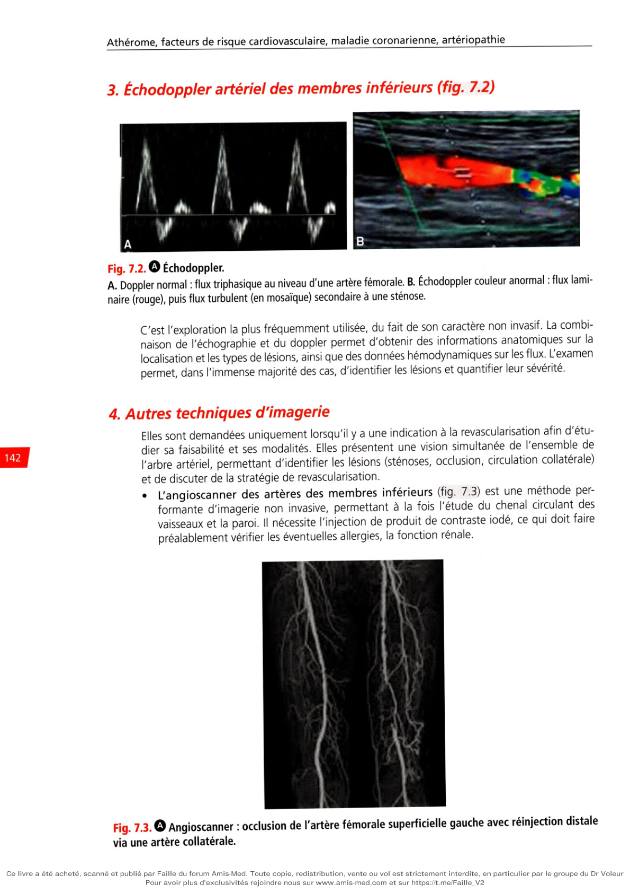
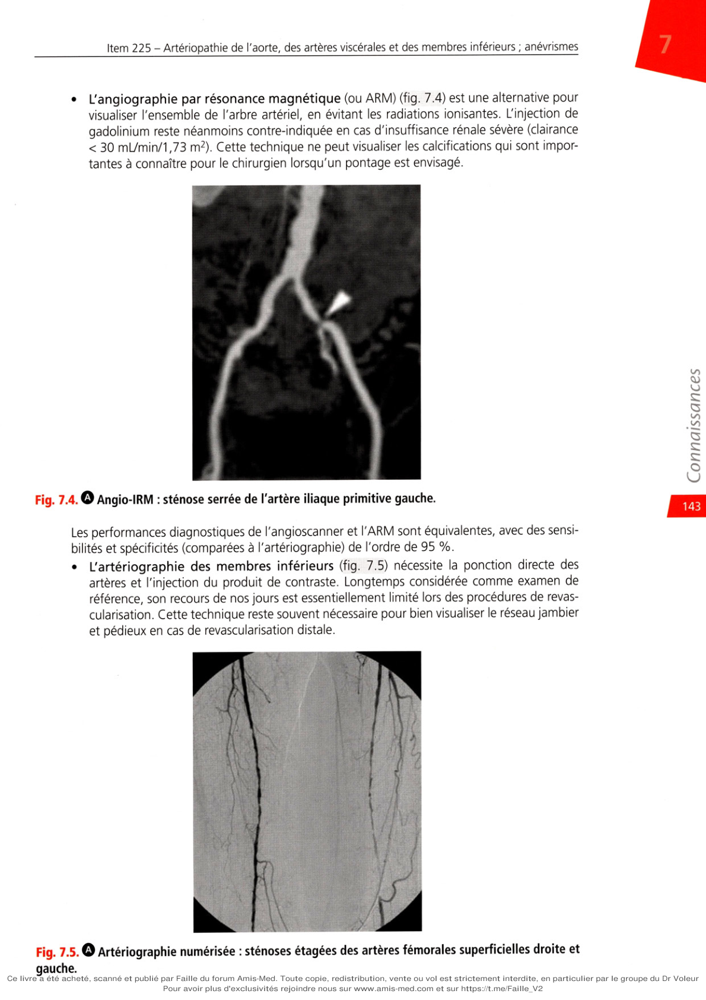
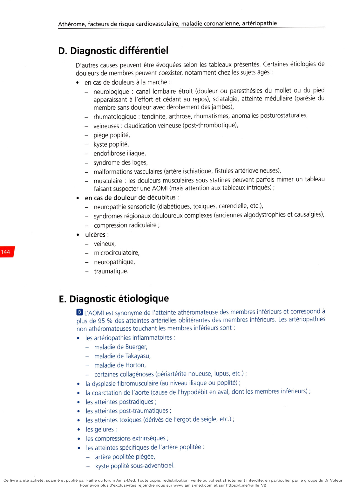
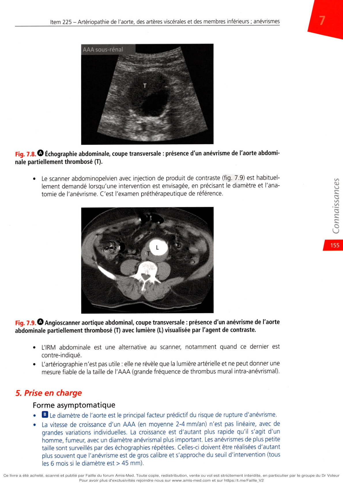
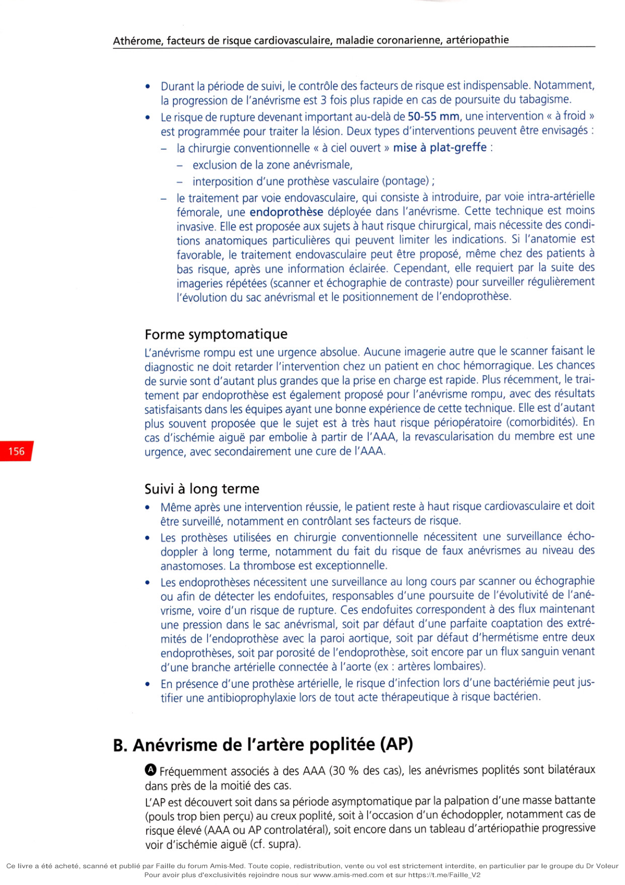
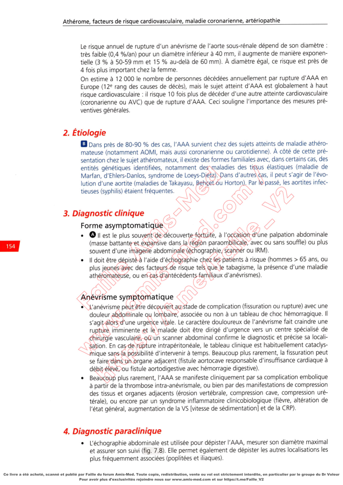

# Item 225 — Artériopathie de l'aorte, des artères viscérales et des membres inférieurs ; anévrismes

> **Collège CNEC / SFC** · 3e édition (2025) · p. 134–162 · R2C  
> Partie I — Athérome, facteurs de risque cardiovasculaire, maladie coronarienne, artériopathie

---

## Trois repères à ne pas confondre

| Badge | Signification (R2C) |
|---|---|
| **Rang A** | Connaissances fondamentales de fin de 2e cycle |
| **Rang B** | Connaissances essentielles, plus spécialisées |
| **Rang C** | Connaissances de 3e cycle (DES) |

Les pastilles du livre (● = A, ■ = B) sont reprises inline. Un objectif sans pastille = **Rang C**.

---

## Situations de départ

3 Distension abdominale.  
4 Douleur abdominale.  
15 Anomalies de couleur des extrémités.  
19 Découverte d'un souffle vasculaire.  
30 Dénutrition/malnutrition.  
42 Hypertension artérielle.  
63 Troubles sexuels et troubles de l'érection.  
66 Apparition d'une difficulté à la marche.  
68 Boiterie.  
69 Claudication intermittente d'un membre.  
71 Douleur d'un membre (supérieur ou inférieur).  
92 Ulcère cutané.  
195 Analyse du bilan lipidique.  
231 Demande d'un examen d'imagerie.  
232 Demande d'explication d'un patient sur le déroulement, les risques et les bénéfices attendus d'un examen d'imagerie.  
248 Prescription et suivi d'un traitement par anticoagulant et/ou antiagrégant.  
252 Prescription d'un hypolipémiant.  
259 Évaluation et prise en charge de la douleur aiguë.  
260 Évaluation et prise en charge de la douleur chronique.  
271 Prescription et surveillance d'une voie d'abord vasculaire.  
281 Prescription médicamenteuse, consultation de suivi et éducation d'un patient diabétique de type 2 ou ayant un diabète secondaire.  
282 Prescription médicamenteuse, consultation de suivi et éducation d'un patient hypertendu.  
300 Consultation pré-anesthésique.  
314 Prévention des risques liés au tabac.  
328 Annonce d'une maladie chronique.

---

## Hiérarchisation des connaissances

| Rang | Rubrique | Intitulé | Descriptif |
|---|---|---|---|
| **A** | Définition | Connaître la définition et la fréquence de l'AOMI | |
| **B** | Physiopathologie | Connaître l'étiologie et les facteurs de risque de l'AOMI | |
| **A** | Diagnostic positif | Connaître les manifestations cliniques et la classification de l'AOMI et savoir évoquer les diagnostics différentiels | |
| **A** | Examens complémentaires | Savoir prescrire les examens complémentaires de 1re intention | |
| **A** | Prise en charge | Connaître le traitement médical : traitement médicamenteux et principes du traitement chirurgical | |
| **A** | Suivi et/ou pronostic | Connaître les complications et le pronostic : ischémie aiguë des membres inférieurs, morbimortalité cardiovasculaire | |
| **A** | Diagnostic positif | Savoir définir et identifier les manifestations cliniques d'ischémie aiguë complète ou incomplète | |
| **B** | Étiologies | Connaître les autres causes de l'ischémie aiguë | |
| **A** | Identifier une urgence | Connaître les principes d'un traitement en urgence | |
| **A** | Définition | Connaître la définition et l'histoire naturelle d'un anévrisme de l'aorte abdominale et savoir rechercher d'autres localisations anévrismales | |
| **B** | Étiologies | Connaître les principales étiologies des anévrismes de l'aorte abdominale et les principes du dépistage | |
| **A** | Diagnostic positif | Connaître les signes cliniques des anévrismes de l'aorte | |
| **A** | Examens complémentaires | Savoir comment faire le diagnostic des anévrismes de l'aorte abdominale | |
| **C** | Prise en charge | Connaître les principes thérapeutiques d'un anévrisme de l'aorte abdominale | |
| **A** | Identifier une urgence | Savoir reconnaître et prendre en charge une situation d'urgence chez les patients porteurs d'un anévrisme de l'aorte abdominale | |
| **A** | Définition | Connaître la définition de l'ischémie intestinale aiguë et chronique | |
| **A** | Diagnostic positif | Connaître la sémiologie de l'ischémie intestinale aiguë et chronique : signes fonctionnels et signes physiques | |

---

## Parcours Rang A

- [I. Artériopathie de l'aorte et des artères viscérales](#i-artériopathie-de-laorte-et-des-artères-viscérales)
- [II. AOMI](#ii-artériopathie-oblitérante-des-membres-inférieurs-aomi)
- [III. Ischémie aiguë des membres inférieurs](#iii-ischémie-aiguë-des-membres-inférieurs)
- [IV. Anévrismes](#iv-anévrismes)

---

## Sommaire

- [Vignette clinique](#vignette-clinique)
- [I. Artériopathie de l'aorte et des artères viscérales](#i-artériopathie-de-laorte-et-des-artères-viscérales)
- [II. Artériopathie oblitérante des membres inférieurs (AOMI)](#ii-artériopathie-oblitérante-des-membres-inférieurs-aomi)
- [III. Ischémie aiguë des membres inférieurs](#iii-ischémie-aiguë-des-membres-inférieurs)
- [IV. Anévrismes](#iv-anévrismes)
- [Points](#points)
- [Notions indispensables et inacceptables](#notions-indispensables-et-inacceptables)
- [Réflexes transversalité](#réflexes-transversalité)
- [Entraînement](../../Entrainement/QI/225_Arteriopathie_AOMI_anevrismes.md)

---

## Vignette clinique

Un homme de 68 ans, hypertendu consulte en raison de la découverte fortuite sur une échographie abdominale (réalisée lors d'un épisode de colique néphrétique) d'une augmentation de calibre de l'aorte abdominale sous-rénale.

> Que suspectez-vous ? Quelle est la cause principale ?

> Que recherchez-vous ?

> Quels examens complémentaires réalisez-vous ?

Les examens complémentaires confirment un anévrisme de l'aorte abdominale sous-rénale mesuré à 40 mm de diamètre.

> Quelle est votre attitude thérapeutique ?

Cinq ans plus tard, lors du suivi, on dépiste un anévrisme mesurant 60 mm de diamètre.

> Par quel(s) examen(s) complétez-vous le bilan ? Quelle est votre attitude thérapeutique ?

# I. Artériopathie de l'aorte et des artères viscérales

**Rang A** · **Rang B**.

## A. Généralités

**Rang A.** L'aorte peut être le siège de lésions d'athérome dès le jeune âge (stries lipidiques, plaques

jeunes). Tous les segments de l'aorte peuvent être atteints, mais les sièges préférentiels sont la bifurcation aortique (naissance des artères iliaques) ainsi que l'origine de toute branche nais- sante de l'aorte. À l'imagerie, on retrouve des plaques athéromateuses chez 25 % des hommes et 20 % des femmes de 40-55 ans. Parmi tous les facteurs de risque, le tabagisme est le plus fortement associé à ces lésions. Ces lésions sont le plus souvent asymptomatiques, mais peuvent avoir une traduction clinique en cas d'ulcération de la paroi, ou lors de phénomènes emboliques du matériel fibrinocruorique touchant alors le cerveau (plaques de l'aorte ascen- dante ou horizontale), les membres ou les viscères abdominales. Mais le plus souvent, ces plaques sont de découverte fortuite lors d'une imagerie radiologique thoracique ou abdomi- nale, mettant en évidence des calcifications sur le trajet aortique. La présence de ces plaques peut être considérée comme un marqueur de risque cardiovasculaire : le risque cardiovasculaire général d'un patient augmente avec la présence et l'extension des calcifications, même asymptomatiques. Les plaques athéromateuses aortiques sont souvent associées à d'autres atteintes d'artères naissant de l'aorte (artères coronaires, digestives, rénales). L'athérome au niveau des artères rénales peut être responsable de sténose et donc d'ischémie rénale, avec comme réponse physiopathologique une activation de la cascade rénine-angiotensine- aldostérone, responsable d'hypertension artérielle rénovasculaire (cf. chapitre 4), une des étio- logies de l'hypertension secondaire. Les autres artères viscérales peuvent être touchées, le plus souvent asymptomatiques. Les sténoses au niveau du tronc cœliaque et/ou des artères mésentériques supérieures et/ou infé- rieures peuvent être responsables d'ischémie digestive (chronique ou aiguë) encore appelée ischémie mésentérique (chronique ou aiguë).

## B. Ischémie mésentérique chronique

### 1. Signes cliniques

Elle se manifeste typiquement par un angor digestif, avec des douleurs abdominales surve- nant après le repas. Dans les cas graves, ce tableau peut mener vers une altération de l'état général et un amaigrissement car le patient limite ses repas pour éviter les douleurs. Les signes physiques sont limités à l'éventuelle présence d'un souffle abdominal évoquant une sténose artérielle viscérale.

### 2. Examen paraclinique

**Rang B.** La sténose artérielle peut être diagnostiquée par l'échodoppler des artères digestives, ou

bien un angioscanner ou encore une angio-IRM. L'artériographie n'est réalisée que lors d'une procédure de revascularisation par voie endovasculaire.

### 3. Prise en charge et traitement

La revascularisation est nécessaire dans les meilleurs délais, de préférence par voie endo- vasculaire (angioplastie avec stenting) chaque fois que cela est possible, ou bien par voie chirurgicale à ciel ouvert si la première option n'est pas possible. Une prise en charge nutri- tionnelle peut être nécessaire après revascularisation. Un traitement antiplaquettaire au long cours est indiqué.

## C. Ischémie mésentérique aiguë

**Rang A.** II s'agit d'une interruption brutale de perfusion d'une partie des intestins par occlusion

d'une ou plusieurs artères à visée digestive. Cette occlusion peut être due à une thrombose in situ ou par embolie. Compte tenu des nombreuses collatéralités, l'infarctus digestif est rare. Il s'agit d'une urgence vitale et le pronostic dépend de la rapidité de la prise en charge.

### 1. Clinique

Dans la majorité des cas, il s'agit d'une occlusion de l'artère mésentérique se présentant sous

**forme d'une triade associant :**

• une douleur abdominale aiguë avec une paucité de signes physiques ;

• une vidange digestive accélérée (vomissement et/ou diarrhée) ;

• des indices évoquant une cause embolique et notamment la présence d'une fibrillation atriale. Elle peut être associée à des signes cliniques d'embolie dans d'autres territoires, renforçant la présomption d'une étiologie embolique. Des formes plus frustres peuvent être la cause d'errances diagnostiques.

### 2. Examens paracliniques

**Rang A.** Comme pour tout phénomène thrombotique, le taux de D-dimères est augmenté mais

n'est pas spécifique et son dosage ne doit pas retarder la prescription d'imagerie si le diag- nostic est évoqué. L'augmentation des lactates est un signe déjà tardif évoquant l'apparition de nécrose tissulaire digestive. La radiographie d'abdomen sans préparation ou l'échographie abdominale peuvent être nor- males ou montrer de la stase digestive sans spécificité. L'examen de référence pour le diag- nostic est l'angioscanner. En dehors d'une interruption de produit de contraste dans un segment proximal d'une ou plusieurs artères, le scanner permet également d'observer un épaississement de la paroi intestinale avec oedème, une dilatation, une pneumatose intesti- nale, de l'air dans la veine porte, et la présence d'ascite.

### 3. Traitement

La prise en charge consiste en la résection des segments intestinaux infarcis, associée à un geste de revascularisation quand cela est possible, par voie endovasculaire ou chirurgicale.

---

# II. Artériopathie oblitérante des membres inférieurs (AOMI)

**Rang A** · **Rang B**.

II. Artériopathie oblitérante des membres inférieurs

## A. Généralités

**Rang A.** L'artériopathie oblitérante des membres inférieurs (AOMI) correspond à toute atteinte athé-

romateuse significative touchant les artères localisées entre l'aorte terminale et les artères digitales (orteils). Les lésions sont d'aspect et de développement semblables à ceux des autres localisations athéromateuses (cf. chapitre 1). Après l'atteinte coronarienne et cérébrale, l'AOMI est, par sa fréquence, la troisième localisa- tion de l'athérosclérose. Elle est, dans sa forme symptomatique, plus fréquente chez l'homme que chez la femme. Le pic de présentation se situe entre 60 et 75 ans chez l'homme et entre 70 et 80 ans chez la femme. La prévalence de la maladie dans ses formes cliniques varie de 1 à 5 % après 60 ans, allant jusqu'à 10-15 % dans cette tranche d'âge si l'on inclut la forme asymptomatique. On estime que pour chaque cas d'AOMI clinique, il y a deux à quatre patients qui présentent une forme infraclinique de la maladie. Ceci souligne l'intérêt du dépistage des formes infracliniques pour une meilleure prévention. On estime ainsi que plus d'un million de personnes en France sont affectées par cette maladie, le plus souvent dans sa forme clinique modérée, voire paucisymp- tomatique. L'incidence de la maladie est de l'ordre de 2-5 ‰.

**Rang A.** Les principaux facteurs de risque sont le tabagisme et le diabète, le premier plus fréquent

chez le sujet plus jeune, le deuxième plus souvent responsable de formes graves d'emblée, avec une atteinte plus distale et un pronostic plus sévère. L'hypercholestérolémie et l'hyper- tension artérielle sont les autres facteurs fréquemment associés.

## B. Clinique

**Rang A.** Au début de la maladie, le patient est longtemps asymptomatique, en raison d'un retentis-

sement hémodynamique modéré et du développement progressif et compensateur d'artères collatérales. Les premiers symptômes apparaissent habituellement à l'effort, lorsque l'hypoxie musculaire survient du fait de l'insuffisance du débit artériel à fournir une oxygénation tissu- laire suffisante : c'est le stade d'ischémie d'effort. L'évolution se fait parfois vers une souffrance tissulaire hypoxique permanente, lorsque le flux sanguin est très réduit. À ce stade, il existe des douleurs de décubitus et des troubles tro- phiques : c'est le stade d'ischémie permanente. Les manifestations cliniques dépendent de la localisation, de l’étendue et de la gravité des lésions artérielles, de la présence d'une circulation collatérale et des capacités du patient à se mobiliser. La collatéralité se développe d'autant plus que la maladie est d'évolution progressive mais est variable d'un individu à un autre. Les différents stades cliniques sont présentés par la classification de Leriche et Fontaine, le plus souvent supplantée de nos jours par la classification internationale de Rutherford (tableau 7.1).

**Tableau 7.1. 0 Stades cliniques d'artériopathie oblitérante des membres inférieurs**

Classification de Leriche et Fontaine Classification de Rutherford Stade Symptômes Grade Catégorie Symptômes I Asymptomatique Asymptomatique II Claudication intermittente I Claudication légère Claudication modérée Claudication sévère III Douleur ischémique de repos II Douleur ischémique de repos IV Ulcération ou gangrène III Perte de substance faible Perte de substance majeure Source : adapté de Fontaine R, Kim M, Kieny R. Surgical treatment of peripheral circulation disorders. Helv Chir Acta 1954 ; 21 : 499-533 et de Rutherford RB, Baker JD, Ernst C, Johnston KW, Porter JM, Ahn S, Jones DN. Recommended standards for reports dealing with lower extremity ischemia: revised version. J Vase Surg. 1997 Sep;26(3):5 17-38.

### 1. Signes fonctionnels

Dans sa forme typique, la claudication intermittente correspond à l'apparition d'une dou- leur de type crampe au mollet, déclenchée après une certaine distance de marche (distance de gêne), obligeant finalement le sujet à s'arrêter au bout d'un certain parcours (dis- tance de marche). La douleur disparaît habituellement en moins de 5 minutes La distance de marche est classiquement stable et s'évalue sur un terrain plat ou lors d'une épreuve de marche (cf. infra 1 . Test de marche). La claudication est dite sévère si la distance de marche est

**inférieure à 100 m. Cependant, les formes atypiques sont fréquentes, avec :**

• distances de marche variables d'un jour à un autre ;

• autres localisations : pied, cuisse ou bien claudication fessière par atteintes aorto-iliaques ;

• douleurs de faible intensité parfois de repos et d'effort. La douleur peut être remplacée par une paresthésie ou un engourdissement d'effort ;

• un sujet qui n'est pas obligé de s'arrêter mais qui ralentit suffisamment le pas pour ne plus souffrir. Soulignons qu’une atteinte sévère peut rester asymptomatique pour plusieurs raisons, parfois

**concomitantes :**

• soit pour cause d'un développement important de circulation collatérale ;

• soit chez le sujet très âgé, avec d'autres comorbidités l'empêchant de marcher suffisamment pour exprimer la maladie (insuffisance cardiaque ou respiratoire, atteintes articulaires, etc.) ;

• soit lors d'une neuropathie altérant la sensibilité (diabète, insuffisance rénale, âge avancé). Dans les deux derniers cas (souvent associés), le patient peut présenter d'emblée une forme cli- nique grave d'ischémie permanente alors qu'il semblait être asymptomatique il y a peu de temps. Cette forme d'AOMI masquée doit être distinguée de la forme purement asymptomatique et souligne l'importance d'un dépistage d'AOMI dans des populations à risque (cf. infra). Avant même d'interroger le patient quant à la présence éventuelle de douleurs à la marche, il faut bien s'assurer qu'il marche et qu'il n'est pas limité ou ne se limite pas justement pour éviter la douleur. À un stade plus avancé, les manifestations cliniques apparaissent dès le repos, définissant \' ischémie permanente, avec un haut risque d'amputation en l'absence de revascularisation :

• les douleurs de décubitus (stade III), de type brûlures des orteils et de l'avant-pied, tra- duisent une ischémie permanente. Elles apparaissent classiquement au bout de quelques minutes à quelques heures de décubitus, et s'améliorent en position déclive, obligeant le patient à rester jambe(s) pendante(s) au bord du lit, voire à se lever plusieurs fois dans la nuit. Ces douleurs intenses, sources d'une altération de l'état général (insomnie), néces- sitent le recours à des antalgiques d'intensité croissante. À l'examen, le pied est froid, pâle ou cyanosé. Un œdème de déclivité peut apparaître, source de complications trophiques ;

• les troubles trophiques (stade IV) sont caractérisés par une peau mince, fragile, avec perte de pilosité, puis apparaissent les plaies, ulcères et gangrènes, souvent très algiques, portes d'entrée à une infection locorégionale (cellulite, arthrite, ostéite), voire générale (septicémie).

-

Les ulcères siègent le plus souvent au niveau des zones de frottement ou d'appui (orteil, dos et bord externe du pied, talon), et parfois à la face antérieure de la jambe (ulcère « suspendu »). Ils peuvent apparaître spontanément ou après un traumatisme parfois minime (ex : geste de pédicure agressif). Généralement de faible surface, ils peuvent être creusants, jusqu'à l'aponévrose ou l'os.

-

La gangrène apparaît surtout au niveau des orteils ou du talon, pouvant s'étendre à l'avant-pied, voire à la jambe. Elle est plus fréquente chez le diabétique, avec souvent des lésions infectées ;

• \‘ischémie permanente englobe les stades III et IV, avec des douleurs durant plus de 1 5 jours, résistant aux antalgiques usuels. En présence d'effondrement de pressions de perfusion (< 50 mmHg au niveau de la cheville ou < 30 mmHg à l'hallux), ce tableau clini- cohémodynamique définit ischémie critique. Le pronostic vital du membre est engagé ;

• enfin, en dehors de ces différents tableaux chroniques, le patient peut déclarer sa maladie sous forme d'ischémie aiguë ou subaiguë (cf. III. Ischémie aiguë des membres inférieurs). L'interrogatoire doit systématiquement rechercher des signes fonctionnels témoignant d'autres atteintes athéromateuses (notamment l'angor ou les symptômes déficitaires cérébraux). Plus particulièrement, les hommes atteints d'AOMI peuvent présenter des troubles d'érection pou- vant s'intégrer dans le syndrome de Leriche, associant claudication fessière et/ou fatigabilité à la marche et impuissance, en rapport avec une atteinte aorto-iliaque.

### 2. Signes physiques

L'examen clinique doit être systématiquement bilatéral et comparatif.

• À l'inspection, le pied peut être de couleur normale, pâle ou cyanosée. Les troubles tro- phiques sont systématiquement recherchés (espaces interdigitaux).

• À palpation, le pied peut être froid. Une douleur à la pression des masses musculaires du mollet témoigne d'une ischémie sévère. Les pouls sont systématiquement recherchés, à la recherche d'un amortissement ou d'une abolition (fémoral, poplité, tibial postérieur et pédieux, ce dernier pouvant ne pas être présent de manière congénitale dans 5 % de la population). Au niveau du pied et des orteils, le temps de recoloration cutanée est allongé (normalement < 3 secondes). Au niveau abdominal et au creux poplité, la recherche d'ané- vrisme est systématique.

• L'auscultation recherche un souffle sur les trajets vasculaires. En cas de suspicion clinique d'une AOMI ou lors d'un dépistage, l'examen clinique est systé- matiquement complété par la mesure de l'index de pression systolique (IPS). L'interrogatoire et l'examen physique d'un patient atteint d'AOMI doivent être systématique- ment complétés par un interrogatoire et un examen cardiovasculaire général, du fait de la grande fréquence d'autres atteintes athéromateuses, notamment la maladie coronarienne et l'atteinte cérébrovasculaire.

### 3. Index de pression systolique

C'est le rapport de la pression artérielle systolique de la cheville sur celle du bras. Il est clas- siquement évalué à l'aide d'un brassard tensionnel et d'un doppler de poche. Au niveau des deux chevilles, la pression systolique est mesurée aux niveaux tibial postérieur et pédieux (celle de l'artère fibulaire, de repérage plus difficile, n'est pas mesurée). Après avoir repéré le flux de l'artère par doppler, le brassard placé autour de la cheville est gonflé jusqu'à disparition du signal, puis dégonflé progressivement afin de déterminer la pres- sion systolique, correspondant au moment de la réapparition du signal (fig. 7.1). La pression de cheville est déterminée par la pression la plus élevée des deux artères. La pression brachiale doit également être déterminée aux deux bras par doppler. Artère pédieuse Doppler Artère tibiale postérieure Doppler Doppler Artère humérale Il est conseillé de réaliser une pression d'orteil chez les patients diabétiques ou insuffisants rénaux et très âgés afin de ne pas passer à côté d'une pathologie artérielle périphérique car l'IPS de repos peut être pris en défaut. Dans ce cas, il est conseillé de faire des tests d'effort (IPS posteffort et mesure transcutanée en oxygène à l'effort) chez les patients symptomatiques à IPS de repos normaux. Pour chaque membre, l'IPS est calculé par la pression la plus élevée des deux artères de che- ville, divisée par la pression systolique la plus élevée des deux bras. Chez le sujet sain, l'IPS se situe habituellement entre 1,00 et 1,40. Classiquement, le patient est atteint d'AOMI si au moins l'une des deux chevilles présente un IPS inférieur à 0,90. L'AOMI est considérée sévère quand l'IPS est inférieur à 0,70. Un IPS anormalement élevé (> 1,40) est le témoin d'une rigidité artérielle anormale due à la médiacalcose (calcification de la média de la paroi sans rétrécissement intraluminal, différente de l'athérosclérose), fréquente chez le diabétique âgé et/ou patient dialysé rénal. Dans ce cas, la pression de cheville ne peut être esti- mée de manière adéquate, et est remplacée par la pression d'orteil, avec un manchon adapté. Un index de pression d'orteil inférieur à 0,70 témoigne de l'AOMI. Une pres- sion d'orteil inférieure à 30 mmHg est présente en cas d'ischémie critique. Au-delà de son intérêt diagnostique, l'IPS est par ailleurs utilisé en tant que marqueur de risque cardiovasculaire : une valeur inférieure à 0,90 est associée à un risque cardiovasculaire (sur- venue d'accident coronarien ou cérébral fatal ou non fatal) élevé.

## C. Examens paracliniques

Ils sont demandés pour évaluer objectivement le handicap fonctionnel, la sévérité hémo- dynamique et la localisation des lésions.

### 1. Test de marche

Test de marche de 6 minutes Il n'est pas spécifique du bilan de l'AOMI et est aussi utilisé dans d'autres situations (insuf- fisance cardiaque, etc.) : la distance parcourue en 6 minutes permet d'évaluer le handicap fonctionnel en général. Test de marche sur tapis roulant Il s'agit d’une évaluation standardisée (protocole de Strandness : vitesse à 3,2 km/h, pente à

**10 %) spécifique à l'AOMI, permettant :**

• d'évaluer la distance de gêne et la distance de marche (évolution en cas d'examens répétés)

• de réévaluer les pressions de cheville après la marche. Chez un patient ayant des manifesta- tions de claudication, l'IPS au repos peut être > 0,90. Le test de marche permet de sen- sibiliser le diagnostic : une baisse de la pression systolique de cheville > 30 mmHg et/ou une baisse > 20 % de l'IPS juste après la marche est évocatrice d'une AOMI (intérêt pour le diagnostic différentiel avec d'autres causes de douleurs à la marche).

### 2. Mesure de la TcPO2

La mesure transcutanée de la pression sanguine en oxygène (TcPO2) évalue l'état d'oxygé- nation cutanée. Elle est utile en matière de diagnostic et d'évaluation de l'ischémie critique. À l'état basal, la PO2 cutanée est très basse (3 à 4 mmHg), sans aucune différence entre une peau saine et ischémique. Pour que l'examen soit discriminant, une hyperémie (par chaleur) est provoquée afin d'artérialiser le flux sanguin. Chez le sujet sain, la TcPO2 au dos du pied est supérieure à 50 mmHg.

• Une valeur > 35 mmHg témoigne d'une bonne compensation métabolique de l 'artériopathie.

• Une valeur entre 10 et 35 mmHg traduit la présence d'une hypoxie continue.

• Une TcPO2 < 1 0 mmHg est la preuve d'une hypoxie critique.

### 3. Échodoppler artériel des membres inférieurs (fig. 7.2)

**Fig. Échodoppler.**

## A. Doppler normal : flux triphasique au niveau d'une artère fémorale. B. Échodoppler couleur anormal : flux lami-

naire (rouge), puis flux turbulent (en mosaïque) secondaire à une sténose. C'est l'exploration la plus fréquemment utilisée, du fait de son caractère non invasif. La combi- naison de l'échographie et du doppler permet d'obtenir des informations anatomiques sur la localisation et les types de lésions, ainsi que des données hémodynamiques sur les flux. L'examen permet, dans l'immense majorité des cas, d'identifier les lésions et quantifier leur sévérité.

### 4. Autres techniques d'imagerie

Elles sont demandées uniquement lorsqu'il y a une indication à la revascularisation afin d'étu- dier sa faisabilité et ses modalités. Elles présentent une vision simultanée de l'ensemble de l'arbre artériel, permettant d'identifier les lésions (sténoses, occlusion, circulation collatérale) et de discuter de la stratégie de revascularisation.

• L'angioscanner des artères des membres inférieurs (fig. 7.3) est une méthode per- formante d'imagerie non invasive, permettant à la fois l'étude du chenal circulant des vaisseaux et la paroi. Il nécessite l'injection de produit de contraste iodé, ce qui doit faire préalablement vérifier les éventuelles allergies, la fonction rénale. IL VI A?

**Fig. Angioscanner : occlusion de l'artère fémorale superficielle gauche avec réinjection distale**

via une artère collatérale.

• L'angiographie par résonance magnétique (ou ARM) (fig. 7.4) est une alternative pour visualiser l'ensemble de l'arbre artériel, en évitant les radiations ionisantes. L'injection de gadolinium reste néanmoins contre-indiquée en cas d'insuffisance rénale sévère (clairance < 30 mL/min/1,73 m2). Cette technique ne peut visualiser les calcifications qui sont impor- tantes à connaître pour le chirurgien lorsqu'un pontage est envisagé.

**Fig. Angio-IRM : sténose serrée de l'artère iliaque primitive gauche.**

Les performances diagnostiques de l'angioscanner et l'ARM sont équivalentes, avec des sensi- bilités et spécificités (comparées à l'artériographie) de l'ordre de 95 %.

• L'artériographie des membres inférieurs (fig. 7.5) nécessite la ponction directe des artères et l'injection du produit de contraste. Longtemps considérée comme examen de référence, son recours de nos jours est essentiellement limité lors des procédures de revas- cularisation. Cette technique reste souvent nécessaire pour bien visualiser le réseau jambier et pédieux en cas de revascularisation distale.

**Fig. Artériographie numérisée : sténoses étagées des artères fémorales superficielles droite et**

gauche.

## D. Diagnostic différentiel

D'autres causes peuvent être évoquées selon les tableaux présentés. Certaines étiologies de

**douleurs de membres peuvent coexister, notamment chez les sujets âgés :**

• **en cas de douleurs à la marche :**

-

neurologique : canal lombaire étroit (douleur ou paresthésies du mollet ou du pied apparaissant à l'effort et cédant au repos), sciatalgie, atteinte médullaire (parésie du membre sans douleur avec dérobement des jambes),

-

rhumatologique : tendinite, arthrose, rhumatismes, anomalies posturostaturales,

-

veineuses : claudication veineuse (post-thrombotique),

-

piège poplité,

-

kyste poplité,

-

endofibrose iliaque,

-

syndrome des loges,

-

malformations vasculaires (artère ischiatique, fistules artérioveineuses),

-

musculaire : les douleurs musculaires sous statines peuvent parfois mimer un tableau faisant suspecter une AOMI (mais attention aux tableaux intriqués) ;

• **en cas de douleur de décubitus :**

-

neuropathie sensorielle (diabétiques, toxiques, carencielle, etc.),

-

syndromes régionaux douloureux complexes (anciennes algodystrophies et causalgies),

-

compression radiculaire ;

• **ulcères :**

-

veineux,

-

microcirculatoire,

-

neuropathique,

-

traumatique.

## E. Diagnostic étiologique

**Rang B.** L'AOMI est synonyme de l'atteinte athéromateuse des membres inférieurs et correspond à

plus de 95 % des atteintes artérielles oblitérantes des membres inférieurs. Les artériopathies

**non athéromateuses touchant les membres inférieurs sont :**

• **les artériopathies inflammatoires :**

-

maladie de Buerger,

-

maladie de Takayasu,

-

maladie de Horton,

-

certaines collagénoses (périartérite noueuse, lupus, etc.) ;

• la dysplasie fibromusculaire (au niveau iliaque ou poplité) ;

• la coarctation de l'aorte (cause de l'hypodébit en aval, dont les membres inférieurs) ;

• les atteintes postradiques ;

• les atteintes post-traumatiques ;

• les atteintes toxiques (dérivés de l'ergot de seigle, etc.) ;

• les gelures ;

• les compressions extrinsèques ;

• **les atteintes spécifiques de l'artère poplitée :**

-

artère poplitée piégée,

-

kyste poplité sous-adventiciel.

## F. Traitement

**Rang A.** Le traitement du patient atteint d'AOMI est de deux ordres : le traitement à visée géné-

rale a pour but d'améliorer son pronostic cardiovasculaire et vital en général, et le traitement à visée locale a pour objectif de résoudre les symptômes en traitant l'ischémie et d'améliorer le pronostic du membre.

### 1. Traitement à visée générale

Il s'applique à tout stade d'artériopathie.

• Le contrôle des facteurs de risque, et aux premiers chefs l'arrêt de tabac et le contrôle du diabète, est essentiel (cf. chapitre 2) : une pression artérielle systolique < 120-129 mmHg, une pression artérielle diastolique < 70-79 mmHg (un traitement par inhibiteur de l'enzyme de conversion ou sartan peut être considéré pour tous les patients avec AOMI et quel que soit leur niveau de pression artérielle, en l'absence de contre-indication), une HbA1c < 7 % et un LDL cholestérol < 0,55 g/L (< 1,4 mmol/L). Bien entendu, l'arrêt du tabac, le régime méditerranéen, tout comme un indice de masse corporelle entre 20 et 25 kg/m 2 et un exercice modéré sont préconisés. La cible pour le réentraînement est de 3 fois/semaine pendant 12 semaines.

• Tout patient atteint d'AOMI symptomatique doit bénéficier d'un traitement antiagrégant plaquettaire (aspirine ou clopidogrel) afin de réduire le risque de complications cardio- vasculaires (infarctus, AVC). En cas d'AOMI asymptomatique (IPS < 0,90), le recours aux antiplaquettaires est débattu, à moins que le patient présente également d'autres atteintes athéromateuses dans d'autres territoires (ex : antécédent de cardiopathie ischémique).

• < L)ne bithérapie associant l'aspirine 75-100 mg/j au rivaroxaban 2,5 mg x 2/j a une indica- tion européenne pour cette maladie mais elle est actuellement non remboursée en France dans cette indication. Cette association n'est possible en France que dans les 10 jours qui suivent une revascularisation des membres inférieurs. Chez les patients nécessitant une anticoagulation curative pour indication et un antiplaquettaire pour l'AOMI, seule l'anti- coagulation doit être conservée.

• **Rang A.** Le recours aux statines est systématique, avec pour objectif d'abaisser le LDL-cholestérol

au-dessous de 0,55 g/L, avec une réduction d'au moins 50 % par rapport à la valeur initiale.

• Le recours aux IEC a également un intérêt pronostique, en maintenant la pression artérielle inférieure à 140/90 mmHg.

• Les bêtabloquants peuvent être proposés à ces patients en cas d'existence d'une indication for- melle (cardiopathie ischémique, insuffisance cardiaque à fraction d'éjection altérée, certaines arythmies, etc.), avec prudence en cas d'ischémie critique sans revascularisation possible.

### 2. Traitement à visée locale

Arrêt du tabac et marche régulière Ils favorisent le développement de la circulation collatérale et l'état métabolique musculaire (augmentation du pool mitochondrial), permettant un allongement de la distance de marche, voire une disparition de la claudication. La marche doit être réalisée de préférence de manière supervisée (rééducation). Elle consiste au minimum à pratiquer une marche régulière de 30-45 minutes, au moins 3 fois/semaine, en ralentissant le pas ou s'arrêtant pendant quelques minutes au seuil de la douleur. La réadaptation supervisée en milieu spécialisé (sous mode d'hospitalisation en centre de réadaptation ou plus particulièrement en ambulatoire) est for- tement conseillée, avec de meilleurs résultats que la réadaptation non supervisée où le patient fait son programme de marche seul. La réadaptation supervisée est toujours complétée par l'éducation thérapeutique du patient pour une bonne connaissance de sa maladie, un respect des règles de prévention et une meilleure observance thérapeutique. Athér ome, facteurs de risque cardiovasculaire, maladie coronarienne, artériopathie Traitement médicamenteux

• L'instauration d'un traitement par statines peut être accompagnée d'une augmentation du périmètre de marche.

• Certains traitements ayant des propriétés vasoactives peuvent améliorer modestement le périmètre de marche, sans bénéfice pronostique à long terme sur l'évolution de la mala- die (ex : pentoxifylline). Plusieurs médicaments ont été récemment retirés du marché pour futilité, d'autres déremboursés.

• Les prostaglandines peuvent être proposées en cas d'ischémie critique non revascularisable (perfusions quotidiennes durant plusieurs semaines en milieu spécialisé). Revascularisation

• **Rang A.** Elle est proposée autant que possible lors d'une ischémie permanente.

• Elle peut être proposée en cas de claudication intermittente sévère altérant la qualité de vie du patient, notamment après un traitement médical bien mené incluant la réadaptation, ou parfois d'emblée en cas de périmètre de marche très faible (< 100 m) avec handicap fonctionnel important (ex : professionnel) et/ou d'atteintes aorto-iliaques sévères rendant l'espoir d'un développement de circulation collatérale illusoire.

• Le choix de la technique de revascularisation dépend de l'étendue et de la sévérité des

**lésions et de l'état du patient :**

-

le traitement endovasculaire est essentiellement une angioplastie intraluminale par ballonnet pouvant être complétée par la mise en place d'un stent.

• D'autres techniques telles que l'angioplastie sous-adventicielle peuvent être pro-

posées en cas d'occlusions longues. Les résultats sont d'autant plus favorables que les lésions sont courtes et proximales, mais l'angioplastie des artères distales (pied) s'est développée ces dernières années. Après un geste d'angioplastie avec ou sans stent, une bithérapie antiplaquettaire est proposée pour une période de 1 à 6 mois selon le geste et sa localisation ;

- O la chirurgie consiste essentiellement à réaliser un pontage (de préférence avec du

matériel veineux, ou à défaut par la mise en place de prothèse vasculaire) afin de court- circuiter les lésions sténosantes ou occlusives. Les pontages les plus fréquents sont le pontage aorto-bi-iliaque (ou bifémoral), le pontage fémoropoplité ou fémorojambier. Des pontages extra-anatomiques peuvent être envisagés, tels que le pontage croisé fémorofémoral, voire axillofémoral. Parfois (le plus souvent en association avec un pon- tage), un geste d'endartériectomie peut être proposé, notamment au niveau de la bifur- cation fémorale afin d'améliorer le réseau fémoral profond favorisant le développement de la circulation collatérale de la cuisse lors d'une occlusion fémorale superficielle.

• Ces gestes peuvent être associés (techniques hybrides : chirurgie + endovasculaire) : par exemple un pontage aortobifémoral peut être complété par une angioplastie poplitée.

• Quelle que soit la méthode de revascularisation, une surveillance clinique et paraclinique (échodoppler) est nécessaire car le risque de thrombose de stent ou de pontage, ou bien la dégradation des pontages et des anastomoses sont à craindre. Soins de plaies Ils doivent être réalisés sous supervision d'une équipe multidisciplinaire spécialisée en plaies et cicatrisation. Amputation C'est le geste ultime, à défaut de toute possibilité de revascularisation. Son but est de traiter la douleur et/ou d'éviter ou limiter les complications infectieuses mettant en péril le patient. L'amputation doit être faite en zone saine et bien oxygénée (intérêt de la mesure de TcPO2) tout en sauvegardant autant que possible l'appui (amputation d'orteil ou transmétatarsienne) ou bien l'articulation du genou afin d'espérer l'appareillage par prothèse afin de retrouver la marche et une meilleure autonomie et qualité de vie.

### 3. Stratégies de prise en charge

• Dans tous les cas, le contrôle des facteurs de risque est indispensable et dans l'AOMI symp- tomatique, un traitement antiplaquettaire est indiqué.

• Les autres atteintes et notamment coronariennes et cérébrovasculaires doivent être recher- chées, orientées par la clinique.

• La prise en charge de la claudication intermittente est résumée dans la figure 7.6.

• La prise en charge de l'ischémie critique consiste à chercher à revasculariser le membre autant que possible. En cas d'impossibilité ou en cas d'échec des tentatives de revasculari- sation sans autre option possible, l'amputation est à envisager. Claudication intermittente Dans tous les cas : prise en charge des facteurs de risque CV Statines + traitement antiplaquettaire (+ IEC si HTA ou insuffisance cardiaque) Claudication très invalidante (périmètre de marche < 100 m) ? Atteinte aorto-iliaque sévère et extensive ? Oui Non Réadaptation à la marche (de préférence supervisée en centre de rédaptation) Envisager une revascularisation Disparition de claudication ou allongement significatif du PM

**Fig. O Prise en charge de la claudication intermittente.**

CV : cardiovasculaire ; HTA : hypertension artérielle ; IEC : inhibiteur de l'enzyme de conversion ; PM : périmètre de marche.

## G. Pronostic

Le pronostic de l'AOMI est grave. L'espérance de vie d'un sujet atteint d'ischémie permanente est équivalente à celle de certains cancers. L'espérance de vie des sujets atteints de claudication intermittente est en moyenne réduite de 1 0 ans. Schématiquement, chez les patients claudicants, au bout de 5 ans : 20 % ont des complications cardiovasculaires, 20 % décèdent, pour moitié de causes cardiovasculaires. Sur le plan local, 25 % voient leur artériopathie s'aggraver, dont 1/5 e subissent une amputa- tion majeure. Au niveau des membres inférieurs, à 5 ans, le risque d'amputation est de l'ordre de 5 %, notamment en cas d'un mauvais contrôle des facteurs de risque (tabagisme). Chez le patient atteint d'une ischémie critique, la mortalité à 5 ans est proche de 70 %. Ceci souligne l'importance de l'instauration de mesures préventives, tant hygiénodiététiques que pharmacologiques, et ce même chez des patients revascularisés ne présentant plus de symptômes.

---

# III. Ischémie aiguë des membres inférieurs

**Rang A** · **Rang B**.

III. Ischémie aiguë des membres inférieurs L'ischémie aiguë d'un membre inférieur est définie par une interruption brutale du flux artériel responsable d'une hypoxie tissulaire abrupte pouvant aboutir à une nécrose tissulaire. C'est une urgence vasculaire : le pronostic vital du membre (voire du patient) est engagé.

## A. Physiopathologie

### 1. Baisse du débit artériel

**Sa gravité dépend de trois facteurs :**

• la pression artérielle systémique : celle-ci doit être maintenue à un niveau correct ;

• l'abondance de la circulation collatérale ;

• la qualité du réseau artériel d'aval.

### 2. Ischémie

Les cellules nerveuses sont les premières à souffrir de cette hypoxie (dans les 2 heures), suivies par les cellules musculaires dans les 6-8 heures (rhabdomyolyse), avec des conséquences méta- boliques importantes. L'anoxie musculaire entraîne une vasodilatation capillaire, elle-même responsable d'œdème et d'une augmentation de la pression interstitielle entraînant une stase de la circulation vei- neuse et lymphatique, avec un phénomène d'autoaggravation de l'œdème et de l'hypoxie : les muscles des membres étant dans des loges aponévrotiques inextensibles, le développement de l'œdème peut être responsable d'une compression des tissus avec arrêt total de circulation, ce qui correspond au syndrome des loges. Dans cette situation, seule une aponévrotomie (section chirurgicale de l'aponévrose) de décharge permet de libérer le tissu musculaire, per- mettant ainsi de restaurer la circulation capillaire. Par ailleurs, l'hypoxie développe l'anaérobiose provoquant une libération de métabolites acides également responsables d'une vasodilatation capillaire. La nécrose cutanée apparaît à partir de la 24e heure.

### 3. Reperfusion

Localement, l'atteinte cellulaire peut être aggravée au moment de la remise en circulation, par le relargage d'acides et de radicaux libres : c'est le syndrome de revascularisation. La reperfusion peut paradoxalement entraîner des conséquences sévères chez le patient :

• troubles métaboliques : par relargage de cellules lysées et des métabolites : hyperkalié- mie, acidose métabolique, hyperuricémie, myoglobinémie, myoglobinurie, augmentation de la créatinémie, hypocalcémie, hyperphosphorémie. Une coagulation intravasculaire dis- séminée (CIVD) peut être observée ;

• insuffisance rénale : une nécrose tubulaire aiguë peut être constatée, secondaire au choc et à l'instabilité de la pression de perfusion rénale, à la précipitation intratubulaire de la myoglobine, et à la toxicité directe en milieu acide de la myoglobine et des produits de contraste radiologiques utilisés lors d'une artériographie ;

• plus rarement : choc hypovolémique (exsudation plasmatique) ou infectieux (colonisation microbienne des muscles nécrosés).

## B. Diagnostic

Il est essentiellement clinique, et ne doit pas être inutilement prolongé par des explorations autres que celles nécessaires pour une intervention urgente, afin de confirmer le diagnostic, d'évaluer le niveau d'oblitération, le degré de sévérité orientant le degré d'urgence et la prise en charge (cf. fig. 7.7), et de déterminer la cause probable de l'oblitération artérielle.

### 1. Diagnostic positif

Diagnostic clinique

**Il repose sur la présence de :**

• signes fonctionnels : douleur d'apparition brutale (parfois en quelques heures dans la

forme subaiguë), intense à type de broiement, avec impotence fonctionnelle du membre ;

• signes physiques (examen comparatif avec membre controlatéral) :

-

membre froid, livide,

-

douleurs à la palpation des masses musculaires,

-

abolition des pouls en aval de l'occlusion,

-

examen neurologique : anesthésie et paralysie (notamment du nerf fibulaire commun, avec impossibilité de relever le pied). À partir de ces éléments, le niveau de sévérité de l'ischémie peut être gradué (tableau 7.2). La topographie de l'occlusion peut généralement être estimée par la localisation de la froi- deur du membre et l'abolition des pouls en aval. Dans le cas le plus grave, l'occlusion de la bifurcation aortique est responsable d'une ischémie bilatérale sévère associée à une paralysie sensitivomotrice. Les signes généraux sont alors souvent au premier plan, allant jusqu'au col- lapsus cardiovasculaire.

**Tableau 7.2.0 Niveaux de sévérité de l'ischémie aiguë, d'après Rutherford, proposés dans les recom-**

mandations 2024 de la Société européenne de cardiologie. Grade Catégorie Déficit sensitif Déficit moteur Pronostic I Viable Absent Absent Pas de menace immédiate, urgence relative Ha Ischémie discrètement menaçante Absent ou limité aux orteils Absent Récupérable si prise en charge llb Ischémie immédiatement menaçante Présent au-delà des orteils Modéré Récupération possible si prise en charge immédiate III Irréversible Anesthésie importante Important, paralysie Perte de tissus et déficit séquellaire inévitables © Mazzolai L, Teixido-Tura G, Lanzi S, Boc V, Bossone E, Brodmann M, et al. ; ESC Scientific Document Group. 2024 ESC guidelines for the management of peripheral arterial and aortic diseases. Eur Heart J 2024 ; 45 : 3538-700. Diagnostic paraclinique Le diagnostic d'ischémie aiguë des membres inférieurs restant clinique, lequipe chirurgicale doit être aler- tée au plus tôt. Aucune exploration ne doit retarder l'intervention, notamment en cas d'atteinte neuro- logique (grade II). Une échographie doppler peut être réalisée sans perte de temps si et seulement si les condi- tions locales et la sévérité du tableau clinique le permettent (notamment grade I, en absence d'atteinte neurologique). L'artériographie est le plus souvent réalisée au bloc opératoire pour orienter le geste thé- rapeutique, permettant de localiser l'oblitération, de caractériser l'aspect de cette occlusion (athérome, anévrisme, dissection, etc.) et surtout d'apprécier le réseau artériel d'aval, impor- tant pour la prise en charge interventionnelle (percutanée ou chirurgicale), notamment en cas de thrombose et de réalisation de pontage vasculaire. En cas d'embolie, elle permet aussi de révéler d'autres emboles (homo et/ou controlatéraux) asymptomatiques. La prise en charge selon le degré de sévérité est présentée dans la figure 7.7. Ischémie aiguë de membre Héparine et antalgiques dès que possible, soins locaux Irréversible (grade III) Viable avec déficit sensitif (grade II) Viable (grade I) Revascularisation en urgence absolue (thrombectomie/ pontage) Amputation Imagerie en urgence Revascularisation dans les heures à venir (thrombolyse/ thrombectomie/ pontage) Traitement médical avec anticoagulation, analgésie, équilibration des troubles hydroélectrolytiques Bilan étiologique

**Fig. O Prise en charge de l'ischémie aiguë.**

Source : Mazzolai L, Teixido-Tura G, Lanzi S, et al. 2024 ESC Guidelines for the management of peripheral arterial and aortic diseases. Eur Heart J. 2024;45(36):3538-3700. doi:10.1093/eurheartj/ehae179.

### 2. Diagnostic étiologique

**Rang B.** Deux grands tableaux étiologiques s'opposent. Dès la première phase de prise en charge, il

est important d'obtenir un faisceau d'arguments en faveur de l'un d'entre eux. Thrombose artérielle in situ

• Elle concerne le plus souvent un sujet âgé avec des facteurs de risque cardiovasculaire, voire un tableau préexistant d'AOMI (à rechercher sur l'autre membre).

• Elle est caractérisée par une douleur d'intensité moyenne de survenue progressive ou rapide (grâce au développement préalable de collatéralité).

• **Les étiologies sont les suivantes :**

-

AOMI;

-

artériopathies non athéromateuses (inflammatoires, radiques, etc.) ;

-

anévrisme poplité thrombosé (cf. infra) ;

-

déshydratation et/ou hémoconcentration chez le sujet âgé ;

-

**autres causes survenant sur des artères pouvant initialement être saines :**

-

kyste adventiciel,

-

dissection aorto-iliaque,

-

thrombophlébite ischémique,

-

coagulopathies ;

-

iatrogéniques : cathétérisme, thrombopénie à l'héparine, ergotisme. Embolie sur artères saines

• Elle survient classiquement chez un sujet jeune sans antécédent vasculaire connu (mais pouvant avoir une cardiopathie connue).

• Elle se manifeste par une douleur brutale, aiguë et sévère (absence de collatérales).

• Elle peut suivre des épisodes de palpitations (arythmie cardiaque).

• **Les principales causes d'embolie sont :**

-

**cardiaques :**

-

troubles du rythme (fibrillation atriale),

-

foramen ovale perméable et anévrisme du septum interatrial,

-

infarctus du myocarde, avec notamment un faux anévrisme de paroi,

-

endocardite infectieuse,

-

valvulopathies et prothèses valvulaires,

-

tumeurs cardiaques (myxome de l'atrium),

-

dyskinésie ou anévrisme ventriculaire gauche ;

-

**atteintes aortiques :**

-

athérome aortique,

-

anévrisme,

-

aortites,

-

tumeurs aortiques ;

-

pièges vasculaires. Ces deux tableaux ne sont pas toujours aussi distincts : une embolie peut survenir sur des artères déjà affectées par l’AOMI. Inversement, une thrombose in situ peut survenir à partir d'une rupture d'une plaque initialement non occlusive chez un sujet sans aucun signe préalable d'AOMI.

### 3. Clinique

**Rang A.** L'examen clinique de l'ischémie aiguë est donc toujours complété par une auscultation

cardiaque et un ECG à la recherche d'arythmie, et une palpation abdominale à la recherche d'un anévrisme aortique. Un bilan de coagulation est également nécessaire. Les autres exa-

**mens ne sont réalisés qu'après la revascularisation :**

• bilan cardiaque : Holter ECG, ETT, voire ETO ou IRM ;

• bilan artériel : échodoppler artériel de l'aorte et des artères des membres inférieurs, voire angioscanner ou artériographie.

## C. Évaluation du terrain

La recherche d'autres localisations ischémiques est nécessaire (embolies multiples). L'état général du patient est important à prendre en compte, notamment en cas de présence d'une pathologie incurable ou fortement handicapante. Il faut évaluer rapidement la fonction car- diaque et les comorbidités du patient. Une prise en charge palliative est parfois la seule solu- tion pour un malade très âgé et moribond.

## D. Traitement

L'étape diagnostique doit être la plus rapide possible afin d'instaurer rapidement le traitement selon la sévérité (cf. fig. 7.7).

### 1. Traitement médical

**Il comporte :**

• traitement anticoagulant (par héparine non fractionnée : bolus de 5 000 Ul suivi d'une perfusion continue de 500 Ul/kg/j pour un TCA [temps de céphaline avec activateur] entre 2 et 3) dès le diagnostic et après avoir prélevé le bilan de coagulation ;

• antalgiques de niveau 3 souvent nécessaires d'emblée ;

• oxygénothérapie par voie nasale ;

• équilibration de l'état hémodynamique si nécessaire (remplissage macromoléculaire) ;

• soins locaux immédiats, et ce même au-delà de la revascularisation (protection mousse ou coton, position légèrement déclive, éviction de tout frottement ou traumatisme cutané).

### 2. Revascularisation

**Différentes méthodes sont proposées :**

• l'embolectomie par sonde de Fogarty sous contrôle angiographique est la méthode de référence pour les embolies sur artère saine, mais peut parfois être aussi utilisée sur des artères athéromateuses ;

• si le lit d'aval jambier est de mauvaise qualité, et si l'ischémie est peu sévère, la thrombo- lyse in situ par voie intra-artérielle et la thromboaspiration peuvent être utilisées : injection d'un fibrinolytique directement dans le thrombus, laissant en place donc le cathéter pen- dant plusieurs heures, avec surveillance en milieu spécialisé et contrôles angiographiques répétés. Dans les deux situations, en cas de présence de sténose résiduelle, un geste d'angioplastie peut compléter la revascularisation.

• Dans certains cas, un pontage (souvent distal) peut aussi être envisagé en dernier ressort.

• En cas de revascularisation tardive, le geste est généralement systématiquement complété par une aponévrotomie de décompression, le plus souvent sur la loge antéroexterne de jambe (d'autres régions, y compris le pied, peuvent être décomprimées si besoin) permet- tant d'éviter le syndrome des loges.

• Lorsque l'ischémie est dépassée, une amputation d'emblée peut être envisagée. Ce geste est aussi parfois réalisé pour limiter les désordres métaboliques majeurs d'un syndrome de revascularisation ou après échec de la revascularisation, notamment sur un terrain débilité.

### 3. Traitement des conséquences métaboliques de la revascularisation

Une acidose métabolique hyperkaliémique, une insuffisance rénale aiguë doivent être systé- matiquement recherchées par la surveillance de la diurèse (sonde urinaire, diurèse horaire), ionogramme sanguin et dosage de l'urée, de la créatininémie et de la CPK. L'acidose doit être progressivement compensée par alcalinisation (bicarbonates IV) et la kalié- mie par le recours à un chélateur de potassium : polystyrène sulfonate de sodium (Kayexalate®), voire à une dialyse rénale, ainsi qu'à un lavage de membre au sérum physiologique. À plus long terme, le traitement étiologique d'une cause embolique est à envisager (ex : anti- coagulation au long cours en cas d'arythmie par fibrillation atriale). Dans le cas d'une origine thrombotique, un traitement antiagrégant plaquettaire et un bon contrôle des facteurs de risque cardiovasculaire sont indispensables (cf. chapitre 2).

---

# IV. Anévrismes

**Rang A** · **Rang B**.

IV. Anévrismes Un anévrisme est défini par une dilatation focale et permanente de l'artère avec perte de parallélisme des parois et augmentation de diamètre de plus de 50 % par rapport au diamètre d'amont. En dehors des artères cérébrales, les atteintes les plus fréquentes se trouvent au niveau de l'aorte (notamment l'aorte sous-rénale, mais aussi l'aorte ascendante), les artères poplitées et les artères iliaques.

## A. Anévrisme de l'aorte abdominale (AAA)

La média aortique s'altère par une destruction des fibres élastiques et une fragmentation des fibres de collagène, perdant progressivement sa capacité à lutter contre la distension. Cette destruction est favorisée par la suractivité d'enzymes détruisant la matrice collagénique (ex : métalloprotéases). Dans la grande majorité des cas, l'AAA est localisé au-dessous des artères rénales.

### 1. Épidémiologie

La prévalence des AAA est en baisse dans les populations occidentales, de 2 à 5 % pour les hommes âgés de plus de 65 ans. Entre 75 et 84 ans, la prévalence est de l'ordre de 5 % chez l'homme et de 3 % chez la femme. En dehors de l'âge, les principaux facteurs de risque sont le tabagisme et les antécédents fami- liaux d'anévrisme. Les sujets atteints d'une autre localisation aortique (thoracique) ou artérielle périphérique sont à plus haut risque d'AAA. Les diabétiques sont moins souvent atteints. Le risque annuel de rupture d'un anévrisme de l'aorte sous-rénale dépend de son diamètre : très faible (0,4 %/an) pour un diamètre inférieur à 40 mm, il augmente de manière exponen- tielle (3 % à 50-59 mm et 1 5 % au-delà de 60 mm). À diamètre égal, ce risque est près de 4 fois plus important chez la femme. On estime à 12 000 le nombre de personnes décédées annuellement par rupture d'AAA en Europe (12e rang des causes de décès), mais le sujet atteint d'AAA est globalement à haut risque cardiovasculaire : il risque 10 fois plus de décéder d'une autre atteinte cardiovasculaire (coronarienne ou AVC) que de rupture d'AAA. Ceci souligne l'importance des mesures pré- ventives générales.

### 2. Étiologie

**Rang B.** Dans près de 80-90 % des cas, l'AAA survient chez des sujets atteints de maladie athéro-

mateuse (notamment AOMI, mais aussi coronarienne ou carotidienne). À côté de cette pré- sentation chez le sujet athéromateux, il existe des formes familiales avec, dans certains cas, des entités génétiques identifiées, notamment des rnaladies des tissus élastiques (maladie de Marfan, d'Ehlers-Danlos, syndrome de Loeys-Diéjzy. Dans d'autres cas, il peut s'agir de l'évo- lution d'une aortite (maladies de Takayasu, Pçhçétôu Horton Par W passé, les aortites infec- tieuses (syphilis) étaient fréquentes.

### 3. Diagnostic clinique

Forme asymptomati

• **Rang A.** II est le plus sou

(masse battante et é ive dansjatr , souvent d'une imagerie abdominale (échographie, scanner ou IRM). Il doit être dépisté à l'aide d'échographie chez les patients à risque (hommes > 65 ans, ou plus jeunes avec des facteurs de risque tels que le tabagisme, la présence d'une maladie athéromateuse, ou emcasd'antécédents familiaux d'anévrismes). ite, à l'odcasion d'une palpation abdominale on paraombilicale, avec ou sans souffle) ou plus écouve Anévrisme symptomatique

• L'anévrisme peut être découvert au stade de complication (fissuration ou rupture) avec une

douleur abdominale ou lombaire, associée ou non à un tableau de choc hémorragique. Il s'agiV lôrs 'une urgence vijple. Le caractère douloureux de l'anévrisme fait craindre une rupture imminente et le malade doit être dirigé d'urgence vers un centre spécialisé de chirurgie vasculajrérOù un scanner abdominal confirme le diagnostic et précise sa locali- sation. En cas de rupture intrapéritonéale, le tableau clinique est habituellement cataclys- mique sans la possibilité d'intervenir à temps. Beaucoup plus rarement, la fissuration peut se faire dans un organe adjacent (fistule aortocave responsable d'insuffisance cardiaque à débit élevé, ou fistule aortodigestive avec hémorragie digestive).

• Beaucoup plus rarement, l'AAA se manifeste cliniquement par sa complication embolique à partir de la thrombose intra-anévrismale, ou bien par des manifestations de compression des tissus et organes adjacents (érosion vertébrale, compression cave, compression uré- térale), ou encore par un syndrome inflammatoire clinicobiologique (fièvre, altération de l'état général, augmentation de la VS [vitesse de sédimentation] et de la CRP).

### 4. Diagnostic paraclinique

• L'échographie abdominale est utilisée pour dépister l'AAA, mesurer son diamètre maximal et assurer son suivi (fig. 7.8). Elle permet également de dépister les autres localisations les plus fréquemment associées (poplitées et iliaques). AAA sous-rénal

• Le scanner abdominopelvien avec injection de produit de contraste (fig. 7.9) est habituel- lement demandé lorsqu'une intervention est envisagée, en précisant le diamètre et l’ana- tomie de l'anévrisme. C'est l'examen préthérapeutique de référence.

**Fig. Angioscanner aortique abdominal, coupe transversale : présence d'un anévrisme de l'aorte**

abdominale partiellement thrombosé (T) avec lumière (L) visualisée par l'agent de contraste.

• L'IRM abdominale est une alternative au scanner, notamment quand ce dernier est contre-indiqué.

• L'artériographie n'est pas utile : elle ne révèle que la lumière artérielle et ne peut donner une mesure fiable de la taille de l'AAA (grande fréquence de thrombus mural intra-anévrismal).

### 5. Prise en charge

Forme asymptomatique

• Q Le diamètre de l'aorte est le principal facteur prédictif du risque de rupture d'anévrisme.

• La vitesse de croissance d'un AAA (en moyenne 2-4 mm/an) n'est pas linéaire, avec de grandes variations individuelles. La croissance est d'autant plus rapide qu'il s'agit d'un homme, fumeur, avec un diamètre anévrismal plus important. Les anévrismes de plus petite taille sont surveillés par des échographies répétées. Celles-ci doivent être réalisées d'autant plus souvent que l'anévrisme est de gros calibre et s'approche du seuil d'intervention (tous les 6 mois si le diamètre est > 45 mm).

• Durant la période de suivi, le contrôle des facteurs de risque est indispensable. Notamment, la progression de l'anévrisme est 3 fois plus rapide en cas de poursuite du tabagisme.

• Le risque de rupture devenant important au-delà de 50-55 mm, une intervention « à froid » est programmée pour traiter la lésion. Deux types d'interventions peuvent être envisagés :

-

**la chirurgie conventionnelle « à ciel ouvert » mise à plat-greffe :**

-

exclusion de la zone anévrismale,

-

interposition d'une prothèse vasculaire (pontage) ;

-

le traitement par voie endovasculaire, qui consiste à introduire, par voie intra-artérielle fémorale, une endoprothèse déployée dans l'anévrisme. Cette technique est moins invasive. Elle est proposée aux sujets à haut risque chirurgical, mais nécessite des condi- tions anatomiques particulières qui peuvent limiter les indications. Si l'anatomie est favorable, le traitement endovasculaire peut être proposé, même chez des patients à bas risque, après une information éclairée. Cependant, elle requiert par la suite des imageries répétées (scanner et échographie de contraste) pour surveiller régulièrement l'évolution du sac anévrismal et le positionnement de l'endoprothèse. Forme symptomatique L'anévrisme rompu est une urgence absolue. Aucune imagerie autre que le scanner faisant le diagnostic ne doit retarder l'intervention chez un patient en choc hémorragique. Les chances de survie sont d'autant plus grandes que la prise en charge est rapide. Plus récemment, le trai- tement par endoprothèse est également proposé pour l'anévrisme rompu, avec des résultats satisfaisants dans les équipes ayant une bonne expérience de cette technique. Elle est d'autant plus souvent proposée que le sujet est à très haut risque périopératoire (comorbidités). En cas d'ischémie aiguë par embolie à partir de l'AAA, la revascularisation du membre est une urgence, avec secondairement une cure de l'AAA. Suivi à long terme

• Même après une intervention réussie, le patient reste à haut risque cardiovasculaire et doit être surveillé, notamment en contrôlant ses facteurs de risque.

• Les prothèses utilisées en chirurgie conventionnelle nécessitent une surveillance écho- doppler à long terme, notamment du fait du risque de faux anévrismes au niveau des anastomoses. La thrombose est exceptionnelle.

• Les endoprothèses nécessitent une surveillance au long cours par scanner ou échographie ou afin de détecter les endofuites, responsables d'une poursuite de l'évolutivité de l'ané- vrisme, voire d'un risque de rupture. Ces endofuites correspondent à des flux maintenant une pression dans le sac anévrismal, soit par défaut d'une parfaite coaptation des extré- mités de l'endoprothèse avec la paroi aortique, soit par défaut d'hermétisme entre deux endoprothèses, soit par porosité de l'endoprothèse, soit encore par un flux sanguin venant d'une branche artérielle connectée à l'aorte (ex : artères lombaires).

• En présence d'une prothèse artérielle, le risque d'infection lors d'une bactériémie peut jus- tifier une antibioprophylaxie lors de tout acte thérapeutique à risque bactérien.

## B. Anévrisme de l'artère poplitée (AP)

**Rang A.** Fréquemment associés à des AAA (30 % des cas), les anévrismes poplités sont bilatéraux

dans près de la moitié des cas. L'AP est découvert soit dans sa période asymptomatique par la palpation d'une masse battante (pouls trop bien perçu) au creux poplité, soit à l'occasion d'un échodoppler, notamment cas de risque élevé (AAA ou AP controlatéral), soit encore dans un tableau d'artériopathie progressive voir d'ischémie aiguë (cf. supra).

**Rang A.** Les AP supérieurs à 20 mm sont habituellement opérés (exclusion de l'anévrisme et pon-

tage), d'autant plus que l'anévrisme est thrombosé, sous réserve de la persistance d'un bon réseau artériel sous-jacent permettant le pontage. À l'inverse de l'AAA, la complication la plus fréquente de l'AP est l'embolie, bien plus que la rupture. Les embolies répétées à bas bruit peuvent être responsables d'un tableau ischémique. Le pronostic est souvent sombre, du fait de l'occlusion de l'ensemble de l'arbre artériel distal, avec peu de possibilités de revascularisation. L'ischémie peut survenir aussi par l'occlusion par thrombose de l'AP. Rarement, l'AP se manifeste par compression de tissus adjacents (nerfs, thrombose veineuse compressive).

---

## Points

### Artériopathie de l’aorte et des artères viscérales

• **Rang A.** L'ischémie mésentérique chronique se manifeste typiquement par un angor digestif. Son diagnostic

repose sur l'échodoppler des artères digestives ou par l’imagerie en coupe (angioscanner ou angio-IRM). Son traitement repose sur la revascularisation, préférentiellement par voie endovasculaire.

• L’ischémie mésentérique aiguë est une urgence chirurgicale. Elle se manifeste par des troubles digestifs

aspécifiques (douleur abdominale, vomissements et/ou diarrhées) chez un patient polyathéromateux le plus souvent. Le diagnostic est confirmé par angioscanner et le traitement repose sur la résection des segments intestinaux nécrosés associée à une revascularisation par voie chirurgicale ou endovasculaire.

### Artériopathie oblitérante des membres inférieurs (AOMI)

• L'AOMI est causée par une atteinte athéromateuse des artères des membres inférieurs.

• Les principaux facteurs de risque de l’AOMI sont le tabac et le diabète.

• Son pronostic est grave.

• L'AOMI peut être longtemps asymptomatique, puis entraîne des douleurs à la marche (distance de

marche), puis au repos (classification de Leriche et Fontaine, et de Rutherford).

• Un index de pression systolique sur au moins une cheville < 0,9 permet de faire le diagnostic d'AOMI, qui

est sévère lorsque l'IPS est < 0,7 (attention cependant à la médiacalcose du diabétique).

• Les mesures à l’effort de IPS ou la TcPO2 après hyperémie sont plus sensibles.

• L'échodoppler artériel des membres inférieurs permet de localiser et de quantifier les sténoses. Il peut

être complété par l’angioscanner ou l'angio-IRM des artères des membres inférieurs.

• L'artériographie des membres inférieurs est réservée aux procédures de revascularisation.

• Le traitement repose sur l'arrêt du tabac, le contrôle du diabète, les antiagrégants plaquettaires et les

statines, la marche régulière. La revascularisation est proposée en cas d'ischémie permanente ou de périmètre de marche réduit. Elle repose sur l’angioplastie ou les pontages chirurgicaux.

### Ischémie aiguë des membres inférieurs

• C'est une urgence, son diagnostic est essentiellement clinique, un échodoppler peut être réalisé sans

perte de temps mais aucune exploration ne doit retarder l'intervention, l'artériographie étant le plus souvent réalisée au bloc opératoire.

• Deux grands tableaux s'opposent même s'ils ne sont pas toujours aussi distincts : la thrombose artérielle

in situ d’un sujet ayant déjà une AOMI et l'embolie sur artères saines.

• Le traitement médical repose sur l'anticoagulation et les antalgiques, la revascularisation est réalisée par

embolectomie par sonde de Fogarty ou par thrombolyse. En cas d'ischémie dépassée, seule une ampu- tation peut être envisagée.

• Les conséquences métaboliques de la revascularisation (acidose hyperkaliémique, insuffisance rénale),

de même qu'un éventuel syndrome de loges doivent être systématiquement recherchés et pris en charge.

### Anévrisme de l’aorte abdominale (AAA)

• La cause prédominante (8 à 9/10) est l'athérome.

• Les principaux FDR sont le tabagisme et les antécédents familiaux d'anévrisme.

• La complication redoutée de l'AAA est la rupture dont le risque augmente avec le diamètre de l'anévrisme.

• Par ailleurs, le sujet porteur d'un AAA est à haut risque de complication coronarienne ou d'AVC.

• Il s'agit souvent d'un diagnostic fortuit chez un patient asymptomatique. L'échographie abdominale

est un bon examen pour le dépistage. Un scanner abdominopelvien doit être réalisé pour le bilan préthérapeutique.

• La rupture d'AAA est une urgence absolue.

• Un diamètre de plus de 50-55 mm nécessite une intervention soit chirurgicale classique, soit par mise

en place d’une endoprothèse par voie endovasculaire.
---

## Notions indispensables et inacceptables

### Notions indispensables

- Chez un patient porteur d'un AOMI ou d'un anévrisme de l'aorte abdominale, penser à rechercher une maladie coronarienne sous-jacente ou une sténose carotidienne.
- L'ischémie aiguë des membres inférieurs est une urgence, aucun examen ne doit faire retarder la prise en charge.
- La rupture d'AAA est aussi une urgence absolue dont le diagnostic doit être confirmé par un scanner avant la prise en charge thérapeutique.

### Notions inacceptables

- Réaliser des examens d'imagerie inutiles retardant la prise en charge en cas d'ischémie aiguë de membre.

---

## Réflexes transversalité

- Item 221 — Athérome : épidémiologie et physiopathologie. Le malade polyathéromateux.
- Item 222 — Facteurs de risque cardiovasculaire et prévention.

---

## Entraînement

Questions isolées et corrigés : [Entrainement/QI/225_Arteriopathie_AOMI_anevrismes.md](../../Entrainement/QI/225_Arteriopathie_AOMI_anevrismes.md)
