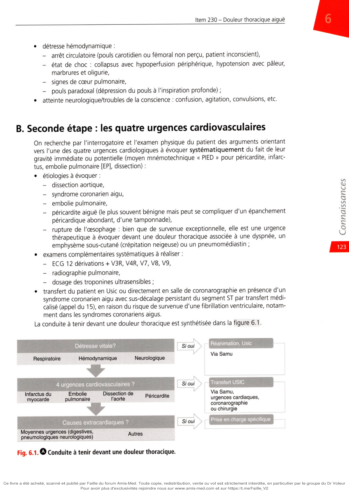

# Item 230 — Douleur thoracique aiguë

> **Collège CNEC / SFC** · 3e édition (2025) · p. 121–133 · R2C  
> Partie I — Athérome, facteurs de risque cardiovasculaire, maladie coronarienne, artériopathie

---

## Trois repères à ne pas confondre

| Badge | Signification (R2C) |
|---|---|
| **Rang A** | Connaissances fondamentales de fin de 2e cycle |
| **Rang B** | Connaissances essentielles, plus spécialisées |
| **Rang C** | Connaissances de 3e cycle (DES) |

Les pastilles du livre (● = A, ■ = B) sont reprises inline. Objectifs grisés (*) non traités dans le corps.

---

## Situations de départ

161 Douleur thoracique.  
162 Dyspnée.  
178 Demande/prescription raisonnée et choix d'un examen diagnostique.  
185 Réalisation et interprétation d'un électrocardiogramme (ECG).  
203 Élévation de la protéine C-réactive (CRP).  
204 Élévation des enzymes cardiaques.  
259 Évaluation et prise en charge de la douleur aiguë.

---

## Hiérarchisation des connaissances

| Rang | Rubrique | Intitulé | Descriptif |
|---|---|---|---|
| **A** | Définition | Savoir définir une douleur thoracique aiguë | |
| **A** | Identifier une urgence | Savoir rechercher une détresse vitale devant une douleur thoracique | Détresse respiratoire ou hémodynamique, troubles de la conscience |
| **A** | Identifier une urgence | Identifier les signes de gravité imposant des décisions thérapeutiques immédiates | |
| **A** | Diagnostic positif | Savoir évoquer les 4 urgences cardiovasculaires devant une douleur thoracique | Dissection aortique, SCA, péricardite avec tamponnade, embolie pulmonaire |
| **A** | Diagnostic positif | Connaître la sémiologie clinique fonctionnelle et physique de la dissection aortique | |
| **A** | Diagnostic positif | Connaître la démarche diagnostique des 4 urgences cardiovasculaires | Terrain, caractéristiques de la douleur, examen clinique |
| **A** | Examens complémentaires | Anomalies ECG des 4 urgences cardiovasculaires | |
| **A** | Examens complémentaires | Place et anomalies de la radiographie thoracique | |
| **A** | Examens complémentaires | Examens biologiques et interprétation | |
| **B** | Examens complémentaires | Place de la coronarographie et principes de prise en charge du SCA | |
| **B** | Examens complémentaires | Place de l'échocardiographie, ETO et scanner thoracique dans la dissection aortique | |
| **C*** | Étiologies | Devant un angor d'effort, principales causes d'angor fonctionnel | *Non traité* |
| **C*** | Étiologies | Principales causes thoraciques de douleur aiguë hors 4 urgences CV | *Non traité* |
| **C*** | Étiologies | Principales causes extrathoraciques | *Non traité* |

---

## Parcours Rang A

- [I. Conduite à tenir](#i-conduite-à-tenir-en-présence-dun-patient-qui-consulte-pour-douleur-thoracique)
- [II. Urgences cardiaques (PIED)](#ii-orientation-diagnostique--identifier-les-urgences-cardiaques)

---

## Sommaire

- [Vignette clinique](#vignette-clinique)
- [I. Conduite à tenir](#i-conduite-à-tenir-en-présence-dun-patient-qui-consulte-pour-douleur-thoracique)
- [II. Urgences cardiaques](#ii-orientation-diagnostique--identifier-les-urgences-cardiaques)
- [III. Douleurs chroniques cardiaques](#iii-orientation-diagnostique--douleurs-chroniques-de-cause-cardiaque)
- [IV. Causes extracardiaques](#iv-orientation-diagnostique--principales-causes-extracardiaques-dune-douleur-thoracique)
- [Points](#points)
- [Notions indispensables et inacceptables](#notions-indispensables-et-inacceptables)
- [Réflexes transversalité](#réflexes-transversalité)
- [Entraînement](../../Entrainement/QI/230_Douleur_thoracique_aigue.md)

---

## Vignette clinique

Une femme âgée de 78 ans vous consulte pour l'apparition depuis 2 heures d'une douleur thoracique survenue au repos de type brûlures, rétrosternales, irradiant dans le bras gauche et le dos. Dans ses antécédents, on note un diabète et une HTA ancienne bien équilibrée avec un inhibiteur de l'enzyme de conversion, un diurétique thiazidique à la dose maximale et un inhibiteur calcique de la classe des dihydropyridines. Elle n'a pas d'autres facteurs de risque. L'examen clinique réalisé alors que la patiente se plaint toujours d'une douleur thoracique est le suivant : poids = 84 kg, taille = 172 cm, température = 37 °C, FC = 95/min, fréquence respiratoire 32/minute. La pression artérielle est de 90/70 mmHg au bras gauche, 95/70 mmHg au bras droit. Les bruits du cœur sont réguliers, le B1 et le B2 sont bien perçus. L'auscultation cardiaque retrouve un souffle systolique au foyer aortique. L'auscultation pulmonaire retrouve des crépitants des bases.

> Comment recherchez-vous une détresse vitale chez cette patiente ?

> Quelles urgences cardiologiques évoquez-vous en 1re intention face aux douleurs thoraciques que

présente cette patiente ?

> Quel examen complémentaire réalisez-vous immédiatement et quelles anomalies recherchez-vous ?

> Quelle est la place du dosage de la troponine ultrasensible ?

> Quand demandez-vous une radiographie thoracique ?

> Quels autres examens paracliniques demandez-vous en 1re intention ?

> Quelles sont les principales causes thoraciques et extrathoraciques de douleur aiguë en dehors des

quatre urgences cardiovasculaires ?

# I. Conduite à tenir en présence d'un patient qui consulte pour douleur thoracique

**Rang A.**

## A. Première étape : rechercher une détresse vitale

**Rang A.** Rechercher les éléments suivants est une étape indispensable afin de prendre en urgence

**les mesures thérapeutiques nécessaires :**

•

**détresse respiratoire :**

-

polypnée (> 30/min) ou bradypnée (< 10/min ou pause respiratoire),

-

tirage par mise en jeu des muscles respiratoires accessoires,

-

sueurs, cyanose, désaturation (SpO2 < 90 %), encéphalopathie respiratoire ;

•

**détresse hémodynamique :**

-

arrêt circulatoire (pouls carotidien ou fémoral non perçu, patient inconscient),

-

état de choc : collapsus avec hypoperfusion périphérique, hypotension avec pâleur, marbrures et oligurie,

-

signes de cœur pulmonaire,

-

pouls paradoxal (dépression du pouls à l'inspiration profonde) ;

•

atteinte neurologique/troubles de la conscience : confusion, agitation, convulsions, etc.

## B. Seconde étape : les quatre urgences cardiovasculaires

On recherche par l'interrogatoire et l'examen physique du patient des arguments orientant vers l'une des quatre urgences cardiologiques à évoquer systématiquement du fait de leur gravité immédiate ou potentielle (moyen mnémotechnique « PIED » pour péricardite, infarc-

**tus, embolie pulmonaire [EP], dissection) :**

•

**étiologies à évoquer :**

-

dissection aortique,

-

syndrome coronarien aigu,

-

embolie pulmonaire,

-

péricardite aiguë (le plus souvent bénigne mais peut se compliquer d'un épanchement péricardique abondant, d'une tamponnade),

-

rupture de l'œsophage : bien que de survenue exceptionnelle, elle est une urgence thérapeutique à évoquer devant une douleur thoracique associée à une dyspnée, un emphysème sous-cutané (crépitation neigeuse) ou un pneumomédiastin ;

•

**examens complémentaires systématiques à réaliser :**

-

ECG 12 dérivations + V3R, V4R, V7, V8, V9,

-

radiographie pulmonaire,

-

dosage des troponines ultrasensibles ;

•

transfert du patient en USIC ou directement en salle de coronarographie en présence d'un syndrome coronarien aigu avec sus-décalage persistant du segment ST par transfert médicalisé (appel du 15), en raison du risque de survenue d'une fibrillation ventriculaire, notamment dans les syndromes coronariens aigus. La conduite à tenir devant une douleur thoracique est synthétisée dans la figure 6.1.

---

# II. Orientation diagnostique : identifier les urgences cardiaques

**Rang A** · **Rang B**.

Si les douleurs thoraciques aiguës dans leurs formes typiques permettent d'évoquer très rapidement une urgence cardiaque, il ne faut pas méconnaître la grande fréquence des formes atypiques. L'interrogatoire et l'examen clinique cherchent un profil de risque particulier pour orienter le diagnostic.

## A. Syndrome coronarien aigu (cf. item 339 - chapitre 5)

•

Le terrain est évoqué par la présence de facteurs de risque et/ou d'antécédents coronariens.

•

Il s'agit d'une douleur spontanée de repos, ou un angor de novo ou un angor crescendo. L'infarctus est à évoquer dès que la durée de la douleur a dépassé 20 minutes, elle est par- fois associée à une dyspnée (10 % des cas).

•

La douleur coronarienne typique est rétrosternale, constrictive, etc. (tableau 6.1) mais attention aux douleurs atypiques surtout chez la femme et le sujet âgé. En pratique, la douleur peut siéger de la mandibule à l'ombilic, parfois mimer une douleur gastrique ou biliopancréatique.

•

L'examen clinique est normal en l'absence de complications ; il recherche également une autre localisation de l'athérosclérose (souffle carotidien ou fémoral, abolition d'un pouls, etc.).

•

L'ECG doit être réalisé le plus rapidement possible car il conditionne la prise en charge ultérieure : il montre un sus ou sous-décalage du segment ST, des ondes T négatives, des ondes Q, etc. Tableau 6.1. 0 Sémiologie en faveur d'une douleur d'origine coronarienne. Douleur de nature ischémique Douleur de nature non ischémique Caractéristiques Constriction Pesanteur Brûlure Acérée En coup de poignard Augmentée par respiration Siège Rétrosternal Médiothoracique Irradiant cou, épaules, avant-bras, tête Avec sueurs, nausées Sous-mammaire gauche Hémithorax gauche Punctiforme (montré du doigt) Dorsal (dissection) Facteurs déclenchants Effort Stress Énervement Temps froid Après fin de l'effort Soulagement par l'effort Provoquée par un mouvement du corps particulier Durée Minutes Secondes Heures (en l’absence d'élévation des troponines) Attention Un ECG percritique normal n'élimine pas le diagnostic. Un bloc de branche gauche doit être considéré comme un équivalent de SCA avec sus-décalage du segment ST. Les ischémies dans le territoire de l’artère cir- conflexe peuvent être électriquement muettes ! (penser à enregistrer les dérivations V7, V8, V9) ou peuvent se manifester par un sous-décalage du segment de V2 à V4 associé à une douleur thoracique prolongée à prendre en charge comme un SCA avec sus-décalage du segment ST (occlusion de l'artère circonflexe).

•

La radiographie pulmonaire est normale et souvent inutile dans les tableaux typiques de syndromes coronariens aigus en l'absence d'insuffisance cardiaque. Quelle est la place du dosage de la troponine ultrasensible (cf. chapitre 5) ?

• Inutile dans la prise en charge des syndromes coronariens aigus avec sus-décalage persistant du

segment ST confirmé par l'ECG, le dosage des troponines ne doit pas retarder la prise en charge, la reperfusion coronarienne par angioplastie ou thrombolyse doit être débutée sans attendre les résultats de la troponine.

• Pour les syndromes coronariens aigus sans sus-décalage persistant du segment ST, le dosage des

troponines ultrasensibles revêt un intérêt diagnostique et pronostique. Deux situations sont à prendre en compte en fonction du niveau des Tn-us (les valeurs de références des Tn-us (très faible, faible, élevé) et leurs variations à 1 ou 2 heures dépendent de la méthode de dosage utilisée) :

- le dosage de la Tn-us à HO est très faible ou faible sans augmentation significative au 2e dosage réalisé

1 ou 2 heures plus tard, il faut évoquer un diagnostic différentiel (ou un syndrome coronarien à bas risque) en poursuivant la surveillance en USIC ;

- le dosage de la Tn-us à HO est élevé ou faible mais avec une augmentation significative au 2e dosage

de troponine réalisé 1 ou 2 heures plus tard, le diagnostic de syndrome coronarien aigu sans sus- décalage du segment ST à haut risque est posé.

## B. Dissection de l'aorte thoracique

•

Les facteurs favorisants sont une HTA ancienne et un syndrome de Marfan.

•

La douleur thoracique est classiquement aiguë, prolongée, intense, de type déchirement, irradiant dans le dos, migratrice, descendant vers les lombes, parfois avec syncope.

•

Cliniquement, on peut observer selon le siège de la dissection : une asymétrie tensionnelle (différence > 20 mmHg), une abolition d'un pouls, un souffle d'insuffisance aortique, un déficit neurologique.

•

Elle est parfois révélée par une complication : tableau d'ischémie aiguë de membre, AVC, tableau d'infarctus mésentérique avec douleur abdominale trompeuse, hémopéricarde avec tamponnade.

• **Rang A.** La probabilité clinique de dissection aortique peut être estimée par un score (tableau 6.2).

La probabilité clinique est faible si le score est de 0 ou 1, et forte s'il est de 2 ou 3. Tableau 6.2. Q Score de probabilité clinique de dissection aortique. Critères Cotation Terrain évocateur

- Syndrome de Marfan

-Antécédent familial de maladie aortique

-Anévrisme de l'aorte thoracique ou pathologie valvulaire aortique connus

-Antécédent de chirurgie aortique

1 point Douleur thoracique évocatrice

- Douleur thoracique, dorsale ou abdominale de début brutal, intense et de type

déchirement 1 point Signes évocateurs à l'examen clinique

-Abolition d'un pouls

-Asymétrie tensionnelle

- Déficit neurologique focal

- Insuffisance aortique

- Hypotension ou choc

1 point

• **Rang A.** L'ECG est normal ou révèle un SCA si la dissection aortique s'est étendue à une artère

coronaire.

•

La radiographie thoracique montre un élargissement du médiastin, éventuellement un épanchement pleural, un aspect de double contour aortique.

•

Les examens biologiques suivants sont requis : NFS, plaquettes, CRP (C-réactive protéine), D-dimères, troponines ultrasensibles (ischémie myocardique), créatine-kinase (rhabdo- myolyse), créatininémie. Il est rare d'avoir une dissection aortique et des D-dimères normaux.

•

Le diagnostic est parfois posé par l'échocardiographie transthoracique (ETT) ou trans- œsophagienne (ETO) (uniquement en cas de stabilité hémodynamique), mais la réalisation d'un angioscanner thoracique est souvent nécessaire au diagnostic positif et à la planifi- cation d'un futur geste chirurgical (porte d'entrée, extension de la dissection, atteinte des artères carotidiennes, mésentériques ou rénales). Chez les patients hémodynamiquement stables et présentant une faible probabilité clinique de dissection aortique (score = 0 ou 1), l'échocardiographie est complétée par la radio- graphie thoracique (élargissement médiastinal) et le dosage des D-dimères (d'emblée très élevés).

• 0 La dissection aortique requiert une prise en charge chirurgicale en urgence en cas d'at-

teinte de l'aorte ascendante (dissection de type A de Stanford et types I et II de De Bakey), sauf pour les formes limitées à l'aorte descendante (dissection de type B) en l'absence de complication périphérique.

• **Rang A.** La pression artérielle doit être normalisée car c'est une urgence hypertensive.

## C. Embolie pulmonaire (cf. item 226 - chapitre 19)

•

Le terrain est évocateur en cas de cancer, contraception œstroprogestative + tabac, période postopératoire, post-partum, alitement, ATCD personnels ou familiaux de maladie thromboembolique.

•

Elle se manifeste classiquement par une douleur basithoracique associée à une dyspnée aiguë avec polypnée, toux, parfois hémoptysie tardive.

•

À l'examen clinique, on note des signes de thrombose veineuse (absents dans un tiers des cas), une tachycardie, des signes d'insuffisance ventriculaire droite (signe de gravité).

•

**Cliniquement, deux tableaux opposés sont possibles :**

-

soit un infarctus pulmonaire avec douleur basithoracique de type pariétopleural fébrile avec hémoptysie noirâtre tardive (bon pronostic) ;

-

soit un cœur pulmonaire aigu avec dyspnée isolée et signes de défaillance ventriculaire droite ou collapsus (la douleur est au second plan compte tenu de l'urgence vitale).

•

L'ECG révèle la présence de signes de cœur pulmonaire aigu : tachycardie sinusale, aspect S1Q3, bloc de branche droit, ondes T négatives dans les précordiales droites (V1, V3).

•

La radiographie pulmonaire peut montrer des atélectasies en bandes, un épanchement pleural basal, une coupole surélevée, une hyperclarté, mais elle est souvent normale. Une douleur thoracique avec dyspnée et radiographie de thorax normale doit faire évo- quer obligatoirement le diagnostic.

•

La stratification initiale du risque repose sur la présence d'une hypotension (PAS < 90 mmHg ou baisse de PAS > 40 mmHg, pendant plus de 15 minutes, en l'absence de troubles du rythme, d'hypovolémie ou de sepsis) ou d'un choc, témoignant d'un haut risque.

•

En cas d'EP à haut risque, on réalise un scanner thoracique s'il est disponible immédiate- ment, sinon une échocardiographie (dilatation du ventricule droit).

•

En cas d'EP sans hypotension ou choc, la probabilité clinique d'embolie pulmonaire est estimée grâce au score de Wells modifié ou au score de Genève modifié.

•

Si la probabilité d'EP est faible ou modérée, les D-dimères doivent être prélevés :

-

s'ils sont positifs (> 500 pg/L ou > 10 x âge pour les patients âgés de plus de 50 ans - recommandations ESC 2019), un angioscanner thoracique est demandé pour confirmer le diagnostic ;

-

les D-dimères hautement sensibles (méthode Elisa : enzyme-linked immunosorbent assay) sont négatifs, le diagnostic d'EP est éliminé, même en présence d'une probabilité prétest modérée.

•

Si la probabilité d'EP est forte, les D-dimères sont inutiles, un angioscanner thoracique est demandé d'emblée pour confirmer le diagnostic.

•

En cas de probabilité intermédiaire ou haute, un traitement antithrombotique doit être débuté avant même la confirmation diagnostique.

## D. Péricardite aiguë (cf. item 235 - chapitre 20)

### 1. Péricardite non compliquée

•

Le terrain est évocateur en cas de contexte viral, fièvre, ou forme récidivante avec antécé- dent connu de péricardite aiguë.

•

La péricardite se manifeste classiquement par une douleur thoracique augmentée à l'inspi- ration profonde, en décubitus et calmée par l'antéflexion du buste.

•

L'examen clinique recherche un frottement péricardique classiquement fugace et inconstant.

•

L'ECG révèle un sus-décalage du segment ST concave et diffus ou non systématisé, sans miroir ni onde Q, un sous-décalage de PQ, un microvoltage.

•

La radiographie pulmonaire montre parfois un élargissement de la silhouette cardiaque.

•

Devant une suspicion de péricardite aiguë, une échocardiographie et un dosage des tro- ponines doivent être réalisés, on peut observer un syndrome inflammatoire biologique ; l'échocardiographie peut montrer un épanchement péricardique, elle peut aussi être nor- male (péricardite sèche), il faut savoir la répéter.

•

C'est l'étiologie la plus bénigne parmi les autres diagnostics à évoquer (c'est donc un diag- nostic d'élimination).

### 2. Tamponnade péricardique

•

À la différence de la péricardite non compliquée, c'est une urgence vitale.

•

**Elle se manifeste par :**

-

une douleur thoracique avec dyspnée, polypnée puis orthopnée et toux, parfois dyspha- gie, nausée, hoquet ;

-

des signes droits : turgescence jugulaire, reflux hépatojugulaire ;

-

des signes de choc avec tachycardie et PAS < 90 mmHg ;

-

un pouls paradoxal : l'inspiration entraîne une augmentation du retour veineux provo- quant une dilatation du VD qui comprime le VG et aboutit à une baisse de la PAS (PAS d'inspiration < PAS d'expiration de 10 mmHg).

•

L'ECG révèle un microvoltage, parfois une alternance électrique.

•

La radiographie de thorax montre une cardiomégalie avec, lorsque l'épanchement péricar- dique est abondant, un aspect en « carafe ».

•

L'échocardiographie confirme le diagnostic de tamponnade et montre un collapsus des cavités droites en expiration, une compression du VG par le VD en inspiration avec un épanchement abondant.

### 3. Myopéricardite

• Il s'agit d'un tableau de péricardite avec atteinte du myocarde le plus souvent virale.

•

La douleur est de type péricarditique mais peut mimer un SCA, parfois avec insuffisance cardiaque.

•

Elle est associée à une élévation prolongée des troponines.

•

L'échocardiographie montre un trouble cinétique du ventricule gauche segmentaire ou diffus avec éventuel épanchement péricardique.

•

La myocardite peut être isolée et le principal diagnostic différentiel dans ce cas est un SCA.

•

La coronarographie est normale.

•

L'IRM peut montrer un oedème et des plages de rehaussement tardif sur les séquences avec injection de gadolinium prédominant en sous-épicardique et sans systématisation artérielle. Les éléments d'orientation clinique, ECG et paraclinique sons résumés dans le tableau 6.3. Tableau 6.3. 0 Rappels sémiologiques cliniques et paracliniques des quatre urgences cardiovasculaires devant une douleur thoracique aiguë. SCA Dissection de l'aorte Embolie pulmonaire Péricardite Terrain FDRCV FDRCV, notamment HTA Âge, comorbidités, chirurgie récente, néoplasie Sujet jeune, contage viral Mode de survenue Brutal Brutal Progressif, associée à une dyspnée Aigu Horaire Effort, repos Repos Repos Inspiration, décubitus Localisation, irradiation Rétrosternale, épigastrique, mâchoire, bras, interscapulaire Rétrosternale, transfixiante Latéro ou basithoracique Rétrosternale Type Constrictif, brûlure Coup de poignard Constrictif Plaintes cardinales à renseigner (douleur thoracique, dyspnée, syncope, palpitation) +++ +++ +++ +++ ECG +++ Ischémie : sus-ST, sous-ST, ondes T ± Normal ou ischémie Tachysinusal, BBD, T négative, S1Q3 ++ Sus-ST concave, sous-PQ Troponine Uniquement si non ST+ ± + (pronostic) + (myocardite ?) Radiographie de thorax

-

+ ±

-

BBD : bloc de branche ; ECG : électrocardiogramme ; FDRCV : facteur de risque cardiovasculaire ; HTA : hypertension artérielle ; SCA : syndrome coronarien aigu.

---

# III. Orientation diagnostique : douleurs chroniques de cause cardiaque

**Rang A** · **Rang B**.

de cause cardiaque

**Il peut s'agir :**

•

d'un angor stable : la douleur peut être atypique dans sa localisation ou ses irradiations, ou se réduire à ses irradiations. Elle est caractéristique en cas de caractère constrictif, si elle est déclenchée par l'effort (ou un repas), cédant à l'effort ou après un spray de trinitrine en 1 à 3 minutes ;

• • d'une douleur d'angor d'effort du rétrécissement aortique serré ;

•

d'une douleur d'angor fonctionnel de l'anémie, des tachycardies comme la fibrillation atriale, de l'hyperthyroïdie ;

•

d'une douleur d'effort de la cardiomyopathie hypertrophique ;

•

de certaines hypertensions artérielles pulmonaires sévères donnant des douleurs d'allure angineuse par souffrance ischémique du ventricule droit lorsque la pression intraventricu- laire droite dépasse la pression de perfusion coronarienne.

## A. Démarche diagnostique en cas de suspicion de syndrome

coronarien chronique (cf. VIII. Angor stable dans le chapitre 5)

**Rang A.** L'approche diagnostique passe par l'utilisation d'un nouveau score permettant d'estimer la

probabilité clinique de maladie coronarienne. Ce score s'appuie sur l'âge, le sexe, les caracté- ristiques de la douleur thoracique ou de la dyspnée (score de 0 à 3 si la douleur thoracique est le symptôme principal [0 à 3 points] : 1 point lorsque la douleur thoracique est typique, 1 point lorsqu'elle est provoquée par l'effort ou le stress, 1 point lorsqu'elle est calmée par le repos ou la trinitrine en moins de 5 minutes ; 2 points si la dyspnée est le symptôme prédominant), mais aussi sur le nombre de facteurs de risque cardiovasculaire (antécédent familial, hypertension artérielle, tabac, dyslipidémie, diabète, score de 0 à 5).

•

Chez les patients à très faible probabilité clinique (< 5 %), aucun examen complémentaire n'est nécessaire.

•

Chez les patients à probabilité clinique modérée (15-50 %), il est recommandé de réaliser un scanner coronarien ou une imagerie fonctionnelle (scintigraphie, échographie d'effort/ de stress, IRM de stress), l'expérience du centre étant essentielle.

•

Pour les probabilités cliniques élevées (> 50-85 %), il est recommandé de réaliser une ima- gerie fonctionnelle.

•

Chez les patients ayant une probabilité clinique très élevée (> 85 %), une coronarographie doit être réalisée à titre diagnostique.

•

La stratégie diagnostique est plus compliquée chez les patients présentant une proba- bilité clinique faible entre 5-15 %. Il est recommandé de réaliser soit un scanner des coronaires d'emblée, soit de réévaluer la probabilité clinique de maladie coronarienne, en s'aidant de divers examens complémentaires (onde Q ou sous-décalage du segment ST sur l'ECG de repos, troubles du rythme ventriculaire, épreuve d'effort anormale, altéra- tion de la fonction ventriculaire gauche à l'échocardiographie, score calcique élevé au scanner, atteinte vasculaire périphérique [doppler des vaisseaux du cou et des membres inférieurs]).

---

# IV. Orientation diagnostique : principales causes extracardiaques d'une douleur thoracique

**Rang A** · **Rang B**.

extracardiaques d'une douleur thoracique

## A. Douleurs d'origine pulmonaire

**Il peut s'agir :**

•

d'un pneumothorax avec douleur de type pleural, tympanisme et abolition du murmure vésiculaire, parfois dyspnée. Le diagnostic est posé par la radiographie en expiration pour les pneumothorax partiels ;

•

d'un épanchement pleural, de douleurs pleurales chroniques (mésothéliome, pachy- pleurite). Il s'agit d'une douleur de type pleural avec matité, parfois dyspnée. Le diagnostic est radiographique avec ligne de Damoiseau pouvant nécessiter des clichés en décubitus latéral, une ponction pleurale à but diagnostique ;

•

de pneumopathies infectieuses. La douleur peut être intense en coup de poignard de type pleural. On retrouve une fièvre, un syndrome de condensation avec un souffle tubaire entouré d'une couronne de râles crépitants, une opacité radiologique systématisée ou non avec bronchogramme aérien, un éventuel épanchement pleural associé.

## B. Douleurs d'origine œsophagienne

**Il peut s'agir :**

•

d'un reflux gastro-œsophagien, d'une œsophagite ;

•

d'un spasme œsophagien, la douleur d'allure angineuse est le plus souvent déclenchée par la déglutition. Attention, la douleur peut être calmée par les dérivés nitrés ;

•

d'une dysphagie ;

•

d'une rupture de l'œsophage, exceptionnelle.

## C. Douleurs pariétales d'origine musculaire ou squelettique

**Il peut s'agir :**

•

d'un syndrome de Tietze (inflammation du cartilage à la jonction du sternum et d'une ou plusieurs côtes), où la douleur est reproduite par la palpation ;

•

de lésions sternales, d'arthralgies chondrocostales ;

•

de fractures costales, éventuellement pathologiques sur métastases ou myélome multiple (atteinte sternale également possible) ;

•

de douleur musculoligamentaire.

## D. Douleurs d'origine neurologique

**Il peut s'agir :**

•

d'un zona intercostal ;

•

d'un tassement vertébral, etc.

## E. Douleurs d'origine abdominale projetées

**Il peut s'agir :**

•

d'une lithiase vésiculaire ;

•

d'un ulcère gastroduodénal ;

•

d'une pancréatite aiguë ;

•

d'une appendicite sous-hépatique ;

•

d'un abcès sous-phrénique.

## F. Douleurs d'origine psychogène

•

Elles sont extrêmement fréquentes.

•

Elles s'accompagnent des signes suivants : angoisse, névrose, etc.

## G. Conclusion

Parmi ces différentes étiologies, six urgences non cardiaques sont à identifier :

•

pleurésies et pneumonies ;

•

pneumothorax ;

•

pancréatite aiguë ;

•

ulcère gastrique ou duodénal compliqué ;

•

cholécystite ;

•

douleurs radiculaires. Pour les autres étiologies, il n'y a pas d'urgence vitale, mais il est urgent de rassurer et de soulager le patient.

---

## Points

• La douleur thoracique est un motif très fréquent de recours aux soins soit aux urgences, soit en consultation.

• La signification de la douleur s'efface devant des signes de détresse vitale qu'il convient de rechercher

immédiatement : collapsus, état de choc, détresse respiratoire ou signes neurologiques.

• Le transfert d’un patient pour douleur thoracique doit être médicalisé via le 15. En effet, s'il s'agit d'un

syndrome coronarien, la mortalité préhospitalière est élevée, ne pas recourir au 15 est une faute grave.

• Même si les SCA dominent, toutes les douleurs thoraciques ne sont pas de nature coronarienne ! Il faut

une prise en charge rationnelle et de l'expérience pour aboutir rapidement au bon diagnostic. Le terrain, l'âge, le contexte et les données de l'examen clinique soigneux ont souvent plus de valeur que les détails sémiologiques de la douleur qui peut être parfois très mal décrite par le patient.

• L’interrogatoire, l'ECG et le dosage répété des troponines ultrasensibles sont la base de la prise en charge,

l’échocardiographie et le scanner thoracique sont souvent utiles en 2e intention. Il faut savoir les réaliser en urgence sur une suspicion d’embolie pulmonaire ou de dissection aortique.

• La prise en charge initiale recherche les quatre grandes urgences cardiovasculaires (« PIED ») que sont

les syndromes coronariens, l'embolie pulmonaire, la dissection aortique et la péricardite aiguë.

• Le syndrome coronarien avec sus-décalage persistant du segment ST est suspecté devant toute douleur

thoracique de plus de 20 minutes. Dans sa forme évocatrice, c'est un patient présentant une douleur rétrosternale dans un contexte de facteurs de risque pour l'athérome. Attention, l'ECG peut être normal ou trompeur (pacemaker, par exemple) et la troponine initialement normale. Attention aussi aux douleurs atypiques ! Il ne faut pas attendre le résultat de la troponine pour traiter une douleur thoracique avec sus-décalage du segment ST (reperfusion urgente !).

• La clinique et l'ECG permettent de faire le diagnostic de SCA dans plus de 90 % des cas mais à l'inverse,

un ECG percritique et des troponines normales n'éliminent pas la présence de lésions coronariennes et notamment un angor instable.

• L'embolie pulmonaire est évoquée devant la triade douleur, dyspnée et radiographie de thorax normale

dans un contexte d'alitement ou de néoplasie.

• Le tableau de péricardite est le moins préoccupant mais le diagnostic est parfois très difficile car les

symptômes pouvant être très voisins d'un syndrome coronarien, les myopéricardites sont encore plus trompeuses en raison de l’élévation de troponine. Attention à ne pas méconnaître les signes de gravité de la tamponnade péricardique qui est une urgence vitale.

• La dissection aortique se présente typiquement par une douleur déchirante à irradiation postérieure

sur poussée hypertensive, cependant les tableaux très atypiques sont possibles : hémopéricarde, insuffisance aortique aiguë, dissection coronarienne avec SCA, extension aux artères digestives avec tableau abdominal, ischémie aiguë de membre révélatrice, etc. Le diagnostic est confirmé par échocardiographie complétée d’une ETO ou le plus souvent par un scanner thoracique notamment chez les patients instables sur le plan hémodynamique. C’est une urgence chirurgicale, sauf pour les formes limitées à l'aorte descendante.

• Devant des douleurs chroniques, il faut savoir reconnaître la sémiologie de l'angor d'effort soit pur,

soit accompagnant un rétrécissement aortique, par exemple.

• Parmi les diagnostics thoraciques non cardiovasculaires, on peut retenir les 4 P : pneumonie, pleurésie,

pneumothorax et pancréatite.

• Les urgences ou pathologies abdominales peuvent avoir une projection douloureuse thoracique, mais

il faut faire attention aussi à l'infarctus du myocarde inférieur qui peut mimer une gastroentérite. Il convient aussi de se méfier d’un tableau d'ischémie mésentérique compliquant une dissection aortique.

• Le diagnostic de douleur psychogène (anxiété) est fréquent mais doit être évoqué avec la plus grande

prudence.
---

## Notions indispensables et inacceptables

### Notions indispensables

- Devant une douleur thoracique aiguë, toujours éliminer en premier une détresse vitale.
- Puis éliminer les urgences cardiaques (PIED : péricardite, infarctus, embolie pulmonaire, dissection aortique).

### Notions inacceptables

- Faire un dosage de la troponine avant de réaliser un ECG.

---

## Réflexes transversalité

- Item 226 — Thrombose veineuse profonde et embolie pulmonaire.
- Item 235 — Péricardite aiguë.
- Item 339 — Syndromes coronariens aigus.

---

## Entraînement

Questions isolées et corrigés : [Entrainement/QI/230_Douleur_thoracique_aigue.md](../../Entrainement/QI/230_Douleur_thoracique_aigue.md)
