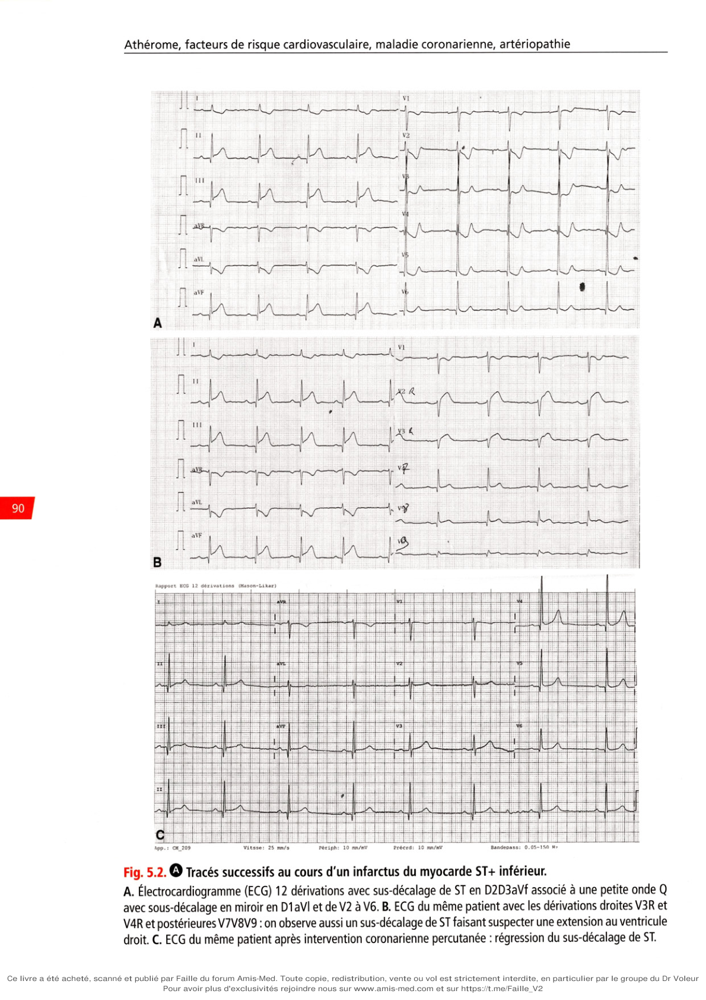
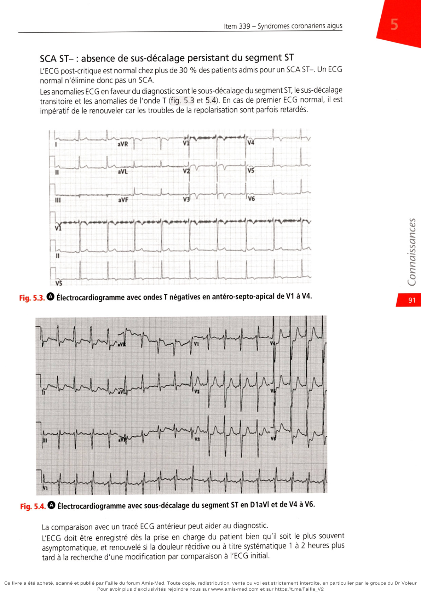
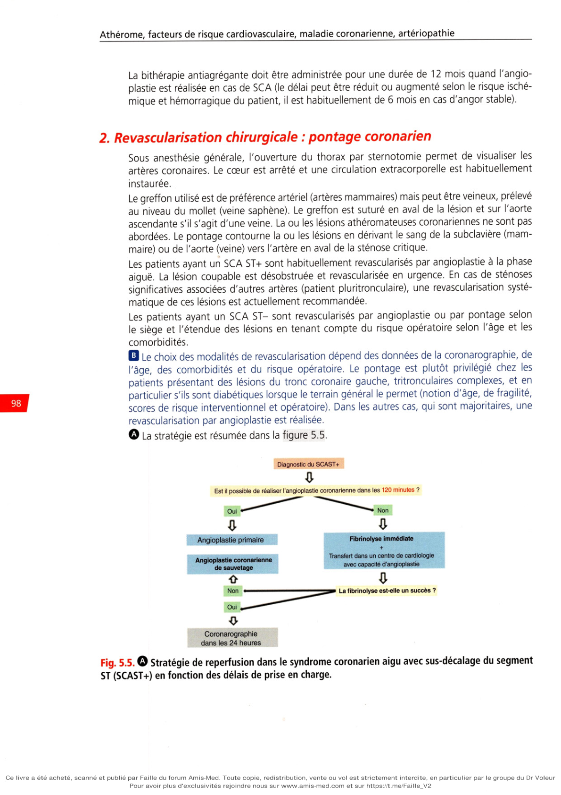
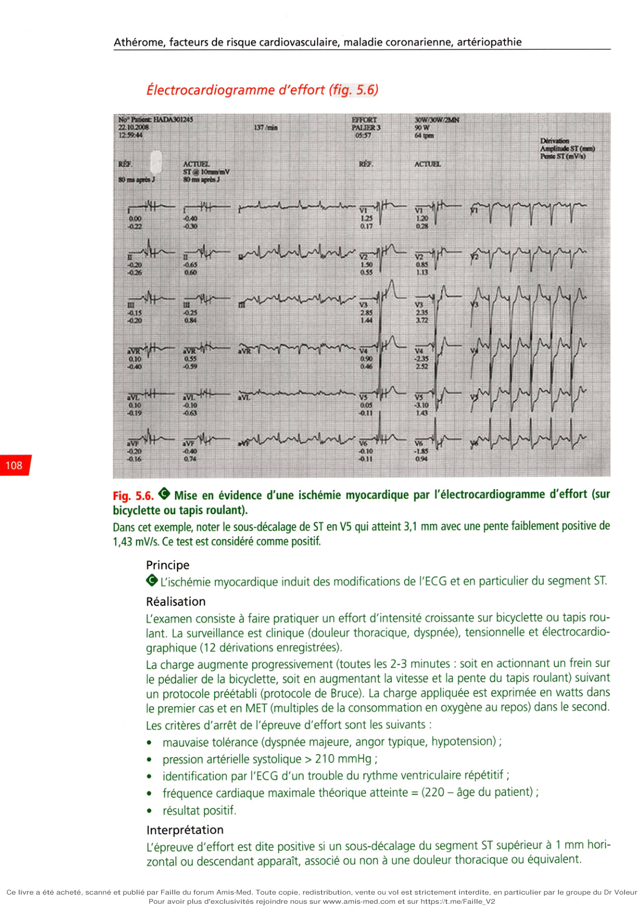
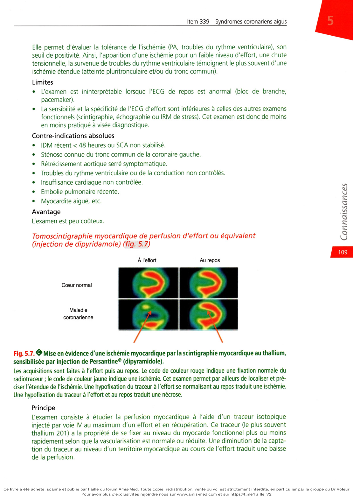
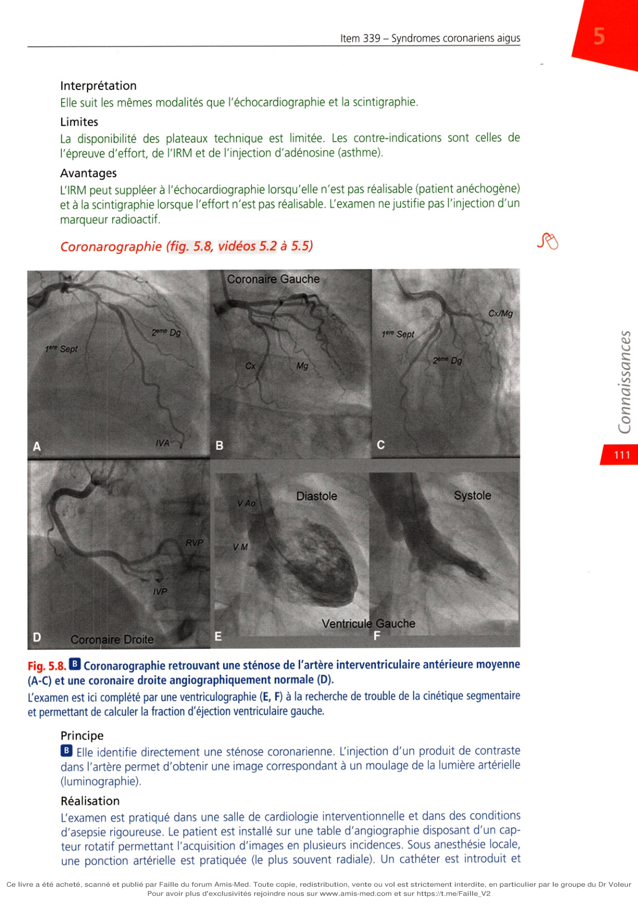
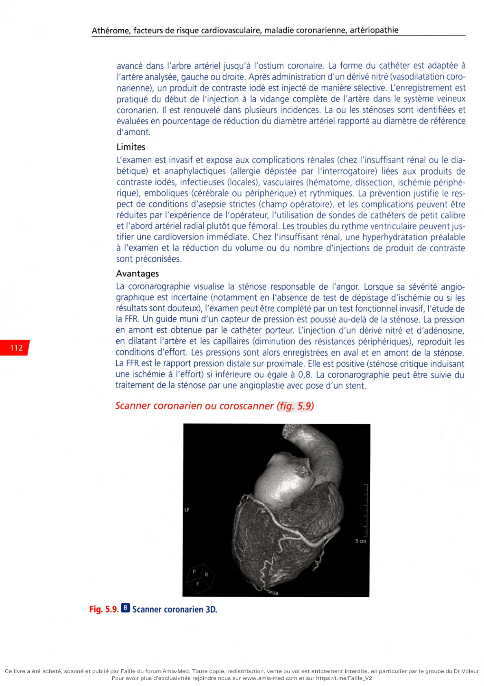

# Item 339 — Syndromes coronariens aigus et angor stable

> **Collège CNEC / SFC** · 3e édition (2025) · p. 82–120 · R2C  
> Partie I — Athérome, facteurs de risque cardiovasculaire, maladie coronarienne, artériopathie

---

## Trois repères à ne pas confondre

| Badge | Signification (R2C) |
|---|---|
| **Rang A** | Connaissances fondamentales de fin de 2e cycle |
| **Rang B** | Connaissances essentielles, plus spécialisées |
| **Rang C** | Connaissances de 3e cycle (DES) |

Les pastilles du livre (● = A, ■ = B) sont reprises inline.

---

## Situations de départ

4 Douleur abdominale.  
42 Hypertension artérielle.  
50 Malaise/perte de connaissance.  
159 Bradycardie.  
161 Douleur thoracique.  
162 Dyspnée.  
165 Palpitations.  
166 Tachycardie.  
185 Réalisation et interprétation d'un électrocardiogramme (ECG).  
204 Élévation des enzymes cardiaques.  
208 Hyperglycémie.  
231 Demande d'un examen d'imagerie.  
239 Explication préopératoire et recueil de consentement d'un geste invasif diagnostique ou thérapeutique.  
247 Prescription d'une rééducation.  
248 Prescription et suivi d'un traitement anticoagulant et/ou antiagrégant.  
252 Prescription d'un hypolipémiant.  
259 Évaluation et prise en charge de la douleur aiguë.  
285 Consultation de suivi et éducation thérapeutique d'un patient avec un antécédent cardiovasculaire.  
314 Prévention des risques liés au tabac.  
316 Identifier les conséquences d'une pathologie/situation sur le maintien d'un emploi.

---

## Hiérarchisation des connaissances

| Rang | Rubrique | Intitulé | Descriptif |
|---|---|---|---|
| **A** | Définition | Connaître la définition de l'infarctus du myocarde | |
| **A** | Définition | Connaître la définition d'un syndrome coronarien aigu (SCA) non ST+ et ST+ | |
| **A** | Épidémiologie | Connaître la prévalence du SCA et sa mortalité | |
| **B** | Physiopathologie | Connaître la physiopathologie des SCA (NST et ST+) et de l'angor stable | |
| **A** | Diagnostic positif | Connaître les éléments de l'interrogatoire et de l'examen clinique d'une douleur angineuse et ses présentations atypiques, du SCA et de ses complications | |
| **A** | Diagnostic positif | Connaître les signes électrocardiographiques d'un SCA ST+ et confirmer sa localisation ; connaître les signes électrocardiographiques d'un SCA NST | |
| **A** | Examens complémentaires | Connaître les indications de l'ECG devant toute douleur thoracique ou suspicion de SCA ; connaître les indications et interpréter le dosage de la troponine | |
| **B** | Examens complémentaires | Connaître l'apport de la coronarographie et du coroscanner | |
| **A** | Identifier une urgence | Reconnaître l'urgence et savoir appeler (SAMU-Centre 15 en extrahospitalier) en cas de douleur thoracique | |
| **A** | Prise en charge | Connaître les modalités de revascularisation coronarienne | |
| **A** | Prise en charge | Connaître les principes et stratégie thérapeutiques depuis la prise en charge par le SAMU du SCA ST+, du SCA NST, de l'angor stable | |
| **B** | Prise en charge | Connaître les principes de la stratégie thérapeutique au long cours devant un angor stable | |

*Note du livre : l'angor stable est traité à part en fin de chapitre (section VIII).*

---

## Parcours Rang A

- [I. Définitions](#i-définitions)
- [II. Épidémiologie](#ii-épidémiologie)
- [III. Physiopathologie](#iii-physiopathologie)
- [IV. Diagnostic](#iv-diagnostic)
- [V. Traitement](#v-traitement)
- [VI. Évolution et complications](#vi-évolution-et-complications)
- [VII. Prise en charge au long cours](#vii-prise-en-charge-au-long-cours-après-hospitalisation-pour-un-sca)
- [VIII. Angor stable](#viii-angor-stable)

---

## Sommaire

- [Vignette clinique](#vignette-clinique)
- [I. Définitions](#i-définitions)
- [II. Épidémiologie](#ii-épidémiologie)
- [III. Physiopathologie](#iii-physiopathologie)
- [IV. Diagnostic](#iv-diagnostic)
- [V. Traitement](#v-traitement)
- [VI. Évolution et complications](#vi-évolution-et-complications)
- [VII. Prise en charge au long cours](#vii-prise-en-charge-au-long-cours-après-hospitalisation-pour-un-sca)
- [VIII. Angor stable](#viii-angor-stable)
- [Points](#points)
- [Notions indispensables et inacceptables](#notions-indispensables-et-inacceptables)
- [Réflexes transversalité](#réflexes-transversalité)
- [Entraînement](../../Entrainement/QI/339_SCA_angor_stable.md)

---

## Vignette clinique

Vous êtes de garde au service d'accueil des urgences. Vous prenez en charge un patient ayant une douleur thoracique aiguë depuis environ 2 heures.

>

Que recherchez-vous en priorité ?

>

Quel(s) examen(s) complémentaire(s) réalisez-vous en premier lieu ?

>

En cas de SCA avec sus-décalage du segment ST (SCA ST+), quelle est votre attitude thérapeutique aux urgences ?

>

En casde perception d'un souffle systolique, quelle(s) est (sont) votre (vos) hypothèses diagnostiques ?

>

En cas d'évolution favorable, quelles sont vos prescriptions à la sortie ?

>

Quels sont vos objectifs thérapeutiques ? I J

# I. Définitions

**Rang A.**

## A. Syndromes coronariens aigus

**Rang A.** L'expression clinique des syndromes coronariens aigus (SCA) est très variée.

Une douleur thoracique aiguë ou un équivalent, survenant dans un contexte prédisposant, justifie d'évoquer ce diagnostic. L'électrocardiogramme (ECG) enregistré dès le premier contact avec le patient permet de défi- nir deux entités : avec et sans sus-décalage persistant du segment ST.

### 1. SCA avec sus-décalage persistant du segment ST (SCA ST+)

ou infarctus du myocarde (IDM) avec sus-décalage persistant du segment ST (IDM ST+, STEMI chez les Anglo-Saxons) La douleur thoracique est persistante depuis plus de 30 minutes. L'ECG identifie un sus- décalage du segment ST. Douleur et sus-décalage persistent après la prise de trinitrine (TNT) sublinguale. L'origine de l'ischémie aiguë transmurale est une occlusion coronarienne aiguë par un throm- bus fibrinocruorique. Le traitement repose sur une désobstruction immédiate de l'artère occluse, soit mécanique (angioplastie primaire), soit médicamenteuse par administration intra- veineuse d'un fibrinolytique.

### 2. SCA sans sus-décalage persistant du segment ST (SCA ST-)

La douleur thoracique est spontanée ou survenant pour des efforts modérés, et de durée variable mais le plus souvent transitoire. L'ECG peut mettre en évidence un sous-décalage transitoire ou persistant, des anomalies de l'onde T, ou bien être normal. Un sus-décalage per- critique du segment ST peut être identifié mais il régresse spontanément ou après TNT. Dans la majorité des cas, la troponine augmente dans les suites de la crise, permettant de poser le diagnostic d'IDM sans sus-décalage persistant du segment ST (IDMNST, NSTEMI chez les Anglo-Saxons). Lorsqu'elle n'augmente pas, le diagnostic d'angor instable est retenu.

## B. Infarctus du myocarde

L'IDM est défini par l'association d'une élévation au-dessus du 99e percentile de la limite supé- rieure de référence de la troponine cardiaque ultrasensible avec au moins l'un des éléments

**suivants :**

• symptomatologie clinique en faveur d'une ischémie myocardique aiguë ;

• apparition d'anomalies de la repolarisation ou d'une onde Q sur un ECG ;

• constatation d'une perte de myocarde viable (identifiée par imagerie par résonance magné- tique nucléaire) dans un territoire présentant une réduction de sa contractilité (identifiée par échocardiographie) ;

• visualisation d'une image évocatrice de thrombus endoluminal (lors d'une coronarographie ou à l'autopsie).

**Rang A.** On distingue cinq types d'IDM :

• l'IDM de type 1 est la conséquence d'une rupture, ulcération, fissuration ou érosion d'une plaque athéromateuse induisant la formation d'un thrombus soit occlusif, soit réduisant la lumière artérielle et/ou emboligène dans la partie distale de l'artère concernée. La lésion sous-jacente est le plus souvent sévère mais elle est mineure dans 5-10 % des cas ;

• l'IDM de type 2 définit un IDM sans relation avec une éventuelle instabilité athéroma- teuse. Le déséquilibre entre apport et demande en oxygène du myocarde peut être la conséquence d'une hyper ou hypotension artérielle, d'une tachy ou bradycardie, d'une arythmie, d'une anémie ou d'une hypoxémie. Sont rattachés à cette définition le spasme coronarien, la dissection coronarienne spontanée, l'embolie coronarienne d'origine car- diaque ou aortique, la dysfonction microvasculaire coronarienne ;

• l'IDM de type 3 caractérise l'IDM compliqué d'une mort subite lorsque le dosage de la troponine n'est pas disponible ;

• les IDM de types 4 et 5 sont « iatrogènes », secondaires à une angioplastie coronaire (type 4) ou à un pontage aortocoronarien (type 5).

---

# II. Épidémiologie

**Rang A.**

**Rang A.** L'incidence européenne des SCA (ST+ et ST-) est estimée à 293 (intervalle de confiance à

95 % [IC 95 %] : 196-530) pour 100 000 habitants. L'incidence de l'IDM ST+ est estimée entre 43 et 144/100 000 par an. En France, plus de 60 000 personnes sont hospitalisées pour un IDM chaque année. Alors que l'incidence du SCA ST+ est en décroissance, celle du SCA ST- augmente, probablement car l'utilisation de la Tn-us (troponine ultrasensible) permet de l'identifier plus facilement. L'IDM ST+ est plus fréquent chez les sujets plus jeunes et chez les hommes. La mortalité hospitalière de l'IDM ST+ varie en Europe entre 4 et 12 % et serait à 1 an proche de 10 %. La mortalité est plus élevée chez les patients plus âgés ou diabétiques, insuffisants rénaux, insuffisants cardiaques, présentant des antécédents d'IDM, une altération de la fonc- tion ventriculaire gauche, une atteinte coronarienne diffuse, ou dont le délai de prise en charge est long. Bien que la maladie coronarienne se développe chez la femme avec un retard de 7 à 10 ans par rapport à l'homme, l'IDM est une cause fréquente de décès dans cette population. Les SCA sont 4 fois plus fréquents chez l'homme avant 60 ans mais plus fréquents chez la femme après 75 ans. La symptomatologie serait plus souvent atypique chez les femmes et leur hospitalisa- tion serait plus tardive. Bien qu'une augmentation des risques iatrogènes de la reperfusion et du traitement antithrombotique chez la femme soit évoquée, la prise charge d'un SCA doit être identique chez les deux sexes.

---

# III. Physiopathologie

**Rang A** · **Rang B**.

**Rang B.** Malgré des présentations cliniques différentes, les SCA partagent la même physio-

pathologie. La rupture ou érosion de la plaque athéromateuse vulnérable (que l'on peut com- parer à un abcès) induit la formation à son contact d'un thrombus qui peut occlure l'artère et/ ou se fragmenter et migrer (embolie) dans la partie distale de l'artère concernée, avec pour conséquence une diminution ou un arrêt de la perfusion myocardique. L'athérosclérose est une maladie chronique qui touche simultanément à des degrés divers les artères de moyen (coronaires) ou gros calibre (aorte). L'accumulation de lipides dans la paroi artérielle induit une réponse inflammatoire puis fibrotique proliférative. La maladie coronarienne peut schématiquement évoluer de deux manières (cf. item 221

- chapitre 1) :

• la réduction progressive sur plusieurs années de la lumière artérielle (athérosclérose) à l'ori- gine de l'angor stable ;

• la rupture brutale imprévisible d'une plaque d'athérome instable et l'expression de la thrombose associée (accident athérothrombotique) sous la forme d'un SCA. L'identification d'un SCA permet d'en prévenir le risque principal qui est la mort subite rythmique, conséquence de l'ischémie myocardique aiguë. La compréhension de la physiopathologie est la base du traitement d'un SCA.

## A. Sténose athérothrombotique

La plaque d'athérome est composée d'un cœur lipidique entouré par une fine chape fibreuse. Le cœur lipidique est nécrotique, renferme des cellules musculaires lisses prove- nant de la média et des cellules inflammatoires. La chape est constituée en grande partie de collagène de type I. La plaque est dite vulnérable (à risque de rupture) quand le cœur lipidique est important et la chape fibreuse fine. Elle peut se rompre ou simplement se fissurer (érosion) et induire la forma- tion à leur contact d'un thrombus. Un thrombus de petite taille, riche en plaquettes (thrombus blanc), non occlusif, est à l'origine d'un SCA ST-. Le thrombus peut être volumineux, fibrino- cruorique (thrombus rouge), et occlure la lumière artérielle à l'origine d'un SCA ST+. Le thrombus peut régresser du fait d'une fibrinolyse physiologique, puis à nouveau augmenter de volume. Il peut se fragmenter et migrer en aval de la lésion dans les artérioles et les capil- laires distaux, induisant la nécrose de territoires myocardiques de petite taille à l'origine d'une élévation de la troponine.

## B. Ischémie myocardique aiguë

Elle survient lorsque les apports ne compensent pas la demande en oxygène du myocarde. La constitution d'une sténose athérothrombotique induit une diminution brutale des apports. Cette sténose est dynamique. En effet, la libération par les plaquettes activées de substances prothrombotiques et vasoconstrictrices (sérotonine, thromboxane A2, ADP [adénosine diphos- phate]), favorise sa majoration paroxystique et la survenue d'épisodes ischémiques transitoires. Une occlusion coronarienne aiguë totale est à l'origine d'une ischémie transmurale dont la traduction ECG est un sus-décalage du segment ST. Lorsqu'elle est secondaire à une vaso- constriction, elle régresse rapidement ou sous l'effet de l'administration d'un vasodilatateur (trinitrine), se traduisant par une régression du sus-décalage du segment ST (angor spastique de Prinzmetal, SCA ST-). Lorsqu'elle est la conséquence d'une thrombose occlusive, elle per- siste malgré l'administration d'un vasodilatateur (SCA ST+ ou IDM ST+).

## C. Patient vulnérable et facteurs déclenchants

Chez un patient présentant un SCA, l'instabilité artérielle n'est pas limitée à la seule plaque rompue. Elle touche l'ensemble de l'arbre artériel justifiant un traitement médicamenteux dont l'effet est multifocal (aspirine par exemple). Les facteurs de vulnérabilité (risque d'instabilité) sont en particulier l'hypercholestérolémie, l'intoxication tabagique, l'hyperfibrinémie. Un exercice physique violent, un manque de sommeil, un excès alimentaire ou une infection aiguë peuvent être des facteurs déclenchants d'un accident coronarien aigu.

---

# IV. Diagnostic

**Rang A** · **Rang B**.

## A. Présentation clinique

### 1. Description d'une « douleur angineuse »

**Rang A.** La douleur angineuse typique est rétrosternale en barre, constrictive. Elle peut irradier vers

le bras gauche, les deux bras ou le bras droit, le cou, la mâchoire. Elle peut être intermittente, le plus souvent prolongée durant quelques minutes, ou persistante. Elle peut être associée à une sudation, des nausées, une gêne épigastrique, une dyspnée ou un malaise lipothymique, voire une syncope. La présentation clinique peut être atypique : par le siège des douleurs (la douleur peut être également épigastrique ou absente, la symptomatologie pouvant mimer une indigestion), se limiter aux irradiations (bras, mâchoire), son type (brûlure thoracique), sa faible intensité, ou se limiter à une dyspnée ou une asthénie. a Une présentation atypique est plus fréquente chez les patients âgés, de sexe féminin, diabé- tiques, insuffisants rénaux ou atteints d'une démence. La régression des symptômes après la prise de trinitrine sublinguale est évocatrice (SCA ST- uniquement) mais non spécifique.

### 2. Critères cliniques évoquant un SCA

Une douleur angineuse persistante (classiquement > 30 minutes), non résolutive après admi- nistration de trinitrine sublinguale est en faveur du diagnostic de SCA ST+ (ou IDM ST+). Le diagnostic doit être immédiatement confirmé par la réalisation d'un ECG (12 ou 18 dériva- tions) qui montre le sus-décalage de ST.

**Sont en faveur d'un SCA ST-, en l'absence de sus-décalage de ST :**

• une douleur thoracique spontanée prolongée (> 20 minutes) ;

• une douleur angineuse inaugurale récente (< 1 mois) survenant à l'effort pour des efforts modérés (classes II ou III de la classification CCS - Canadian Cardiovascular Society) ;

• l'aggravation récente d'un angor d'effort (angor crescendo) ;

• l'apparition d'un angor au décours d'un IDM.

### 3. Facteurs de risque de survenue d'un accident coronarien

La mise en évidence d'un terrain à risque cardiovasculaire accroît la probabilité diagnostique. Sont particulièrement exposés les patients plus âgés, de sexe masculin, tabagiques, rappor- tant une hérédité coronarienne, présentant un diabète, une dyslipidémie, une hypertension artérielle, une insuffisance rénale chronique, ou qui ont déjà été identifiés comme ayant une coronaropathie, une artériopathie périphérique ou une atteinte des troncs supra-aortiques.

### 4. Facteurs favorisant la déstabilisation

Certaines circonstances peuvent favoriser l'apparition d'un SCA comme une anémie, une infection, un syndrome inflammatoire, une hyperthermie, une poussée hypertensive, un accès de colère, une émotion forte, un exercice violent ou un dérèglement métabolique ou endo- crine comme l' hyperthyroïdie, une anesthésie générale, une intervention chirurgicale.

## B. Examen physique

L'examen physique est habituellement sans particularité en l'absence de complication. Il faut rechercher des manifestations d'insuffisance cardiaque congestive et un souffle systo- lique (cf. VL Évolution et complications). La mesure de la pression artérielle aux deux bras est systématique et une asymétrie évoque plutôt une dissection aortique (cf. D. Diagnostic différentiel). L'examen clinique contribue également à la recherche de facteur de risque (pression artérielle, poids) et d'autres localisations de la maladie athéromateuse (palpation et auscultation artérielles).

## C. Examens complémentaires

### 1. Électrocardiogramme

L'ECG 12 dérivations doit être pratiqué sans délai dès lors que le diagnostic de SCA est sus- pecté, soit au domicile lorsque le patient ou son entourage a contacté le centre 1 5, soit dans At héro m e, facteurs de risq ue cardiovasculaire, maladie coronarienne, artériopathie les 10 minutes suivant l'admission en service d'accueil des urgences (SAU) lorsque le patient s'y présente spontanément ou y est adressé par une ambulance non médicalisée. Outre son intérêt diagnostique, il permet de détecter une arythmie ventriculaire susceptible de se dégra- der rapidement en tachycardie ou fibrillation ventriculaire (TV ou FV). SCA ST+ : sus-décalage persistant du segment ST et équivalents Chez un patient présentant une douleur angineuse persistante, l'ECG percritique confirme l'occlusion coronarienne aiguë lorsqu'il met en évidence, dans au moins deux dérivations conti- guës, un sus-décalage (onde de Pardee), classiquement convexe vers le haut, du segment ST supérieure ou égale à 2 mm (> 2,5 mm chez les hommes de moins de 40 ans, > 1,5 mm chez les femmes) en V2-V3, supérieure ou égale à 1 mm dans les autres dérivations, en l'absence de bloc de branche gauche ou d'hypertrophie ventriculaire gauche (fig. 5.1). Le sus-décalage est habituellement associé à un miroir (sous-décalage du segment ST dans les dérivations opposées). Il apparaît ensuite une onde Q de nécrose classiquement à partir de la 6e heure. La localisation du sus-décalage du segment ST à l'ECG permet d'identifier la localisation de la

**nécrose :**

• D1-aVL : latéral haut ;

• D2-D3-aVF : inférieur ;

• V1-V2-V3 : antéroseptal ;

• V4 : apical ;

• V5-V6 : latéral bas ;

• V1-V6 : antérieur étendu ;

• V7-V8-V9 : postérieur. Lorsque le sus-décalage est identifié en dérivations inférieures (D2, D3, VF), un sus-décalage doit être recherché en dérivations droites (V3R, V4R) en faveur d'une extension de l'infarctus au ventricule droit (fig. 5.2). Un sous-décalage du segment ST en dérivations antérieures (V1-V3) chez un patient décrivant un angor (ou équivalent) persistant justifie d'enregistrer des dérivations postérieures (V7-V9). Un sus-décalage du segment ST supérieur ou égal à 0,5 mm dans ces dérivations confirme le diagnostic. Le sous-décalage antérieur est alors considéré comme une « image en miroir ». Blocs de branche et stimulation ventriculaire Si la suspicion clinique est forte (angor persistant), la présence d'un bloc de branche gauche (BBG), qu'il soit récent ou non, doit être considérée comme équivalent d'un sus-décalage du segment ST. À l'inverse, l'identification d'un BBG supposé récent dans un contexte non évocateur (patient asymptomatique lors de l'enregistrement) n'a pas de valeur diagnostique. Le bloc de branche droit (BBD), marqueur de pronostic péjoratif lorsqu'il est associé à une ischémie myo- cardique (parce que souvent en lien avec une atteinte du territoire antérieur), doit également être considéré comme équivalent d'un sus-décalage du segment ST. La stimulation ventriculaire (pacemaker) ne permet pas d'identifier un sus-décalage du segment ST. D'une manière générale, lorsqu'un patient présente une symptomatologie angineuse prolongée persis- tante, ou équivalent, et que l'ECG n'est pas contributif, une coronarographie doit être réalisée le plus rapi- dement possible. Lorsque l'examen clinique évoque en premier lieu un diagnostic différentiel (takotsubo dans un contexte de stress, myocardite ou péricardite au décours d'un épisode infectieux chez un sujet jeune), cet examen reste indiqué en urgence dès lors que le patient présente un terrain à risque d'accident coronarien (âge, sexe, facteurs de risque, antécédents vasculaires) pour ne pas passer à côté du diagnostic. Ai FX-J2O2 HH-02-SO VI FX-72O2-V04-O2-SO

•TDOTIW?

i . . . _j— __4 H V -----‘ V—"“V —

-----Jx/”-

■ ■ 2V\ ____jiA ____p\ ____|/\ ■ , .‘“'.Z ------'~%z ■. A fl 4 —h—p\—| fl '-K-J-7'— p .p— jA— — J' pX—|A |A —f' —— —-C— fl fl — ’r B

!l 4 —h—h—h—

**Fig. Tracés successifs au cours d'un infarctus du myocarde ST+ inférieur.**

## A. Électrocardiogramme (ECG) 12 dérivations avec sus-décalage de ST en D2D3aVf associé à une petite onde Q

avec sous-décalage en miroir en D1aVl etdeV2 àV6. B. ECG du même patient avec les dérivations droites V3R et V4R et postérieures V7V8V9 : on observe aussi un sus-décalage de ST faisant suspecter une extension au ventricule droit. C. ECG du même patient après intervention coronarienne percutanée : régression du sus-décalage de ST. SCA ST- : absence de sus-décalage persistant du segment ST L'ECG post-critique est normal chez plus de 30 % des patients admis pour un SCA ST-. Un ECG normal n'élimine donc pas un SCA. Les anomalies ECG en faveur du diagnostic sont le sous-décalage du segment ST, le sus-décalage transitoire et les anomalies de l'onde T (fig. 5.3 et 5.4). En cas de premier ECG normal, il est impératif de le renouveler car les troubles de la repolarisation sont parfois retardés. vi aVR »VL aVF

**Fig. Électrocardiogramme avec ondes T négatives en antéro-septo-apical de V1 à V4.**

La comparaison avec un tracé ECG antérieur peut aider au diagnostic. L'ECG doit être enregistré dès la prise en charge du patient bien qu'il soit le plus souvent asymptomatique, et renouvelé si la douleur récidive ou à titre systématique 1 à 2 heures plus tard à la recherche d'une modification par comparaison à l'ECG initial. Blocs de branche et stimulation ventriculaire La présence d'un BBG est sans valeur diagnostique si le patient est asymptomatique lors de l'enregistre- ment de l'ECG. En présence d'un BBD, chez un patient symptomatique, la mise en évidence d'un sous-décalage du seg- ment ST en D1-VL et V5-V6 est en faveur d'un SCA ST-. Chez près de la moitié des patients porteurs d'un bloc de branche, gauche ou droit, hospitalisés pour dou- leur thoracique suspecte, le diagnostic final est un SCA. L'ECG n'apporte pas d'aide au diagnostic en cas de stimulation ventriculaire.

### 2. Troponine

C’est un marqueur essentiel pour confirmer le diagnostic d’un IDM et dans la démarche diagnostique du SCA ST-. Le dosage de la troponine n'a pas sa place dans la stratégie diagnostique et thérapeu- tique du SCA ST+. Son dosage est cependant réalisé mais on n'attend pas son résultat pour initier la prise en charge. Il confirme a posteriori le diagnostic d'IDM s'il est élevé. Le dosage de la Tn-us est plus sensible et spécifique d'une lésion des cardiomyocytes que la créatinine-kinase (CK), son isoenzyme (CK-MB) ou la myoglobine. Son élévation est par ailleurs précoce par rapport au début des symptômes. Habituellement, la Tn-us est très sensible, croît rapidement dans l'heure qui suit la douleur thoracique et demeure élevée durant plusieurs jours. Cependant, la spécificité est limitée car son élévation peut être observée dans de nombreuses situa- tions autres qu'un SCA : tachyarythmie, insuffisance cardiaque, poussée hypertensive, urgence vitale, myocardite, valvulopathie, embolie pulmonaire, dissection aortique, takotsubo, etc. Les valeurs de troponine sont également influencées par quatre paramètres : elles augmen- tent avec l'âge, l'existence d'une insuffisance rénale, du délai entre le dosage et le début des symptômes, et le sexe. D'autres biomarqueurs ont été proposés mais leur utilisation est marginale, comme la copeptine, peu spécifique.

• La sensibilité des CK-MB (enzymes libérées par le myocyte nécrosé) est insuffisante pour permettre un diagnostic précoce, mais sa décroissance étant plus rapide que celle de la tro- ponine, une réascension, dans un contexte clinique évocateur (récidive angineuse), plaide en faveur d'une récidive d'IDM.

• L'élévation du BNP, marqueur d'une insuffisance ventriculaire gauche, n'a qu'une valeur pronostique. Algorithme décisionnel : confirmer/ récuser rapidement le diagnostic Pour confirmer le diagnostic de l’IDM ST-

**Rang A.** II existe des algorithmes en fonction du type de Tn-us (I ou T) et du fabricant. Selon la valeur du premier

dosage, du délai entre le dosage et le début des symptômes, et l’évolution à 1 ou 2 heures, il est possible

**d'identifier trois situations :**

• un SCA très probable (ru/e-in) quand la valeur initiale est très élevée ou quand elle augmente de façon significative lors du deuxième prélèvement ;

• un SCA très peu probable (rule-out) quand la valeur initiale est très basse et n'augmente pas lors du deuxième dosage ;

• dans les cas intermédiaires, des investigations complémentaires sont nécessaires pour affirmer ou infirmer le diagnostic.

### 3. Autres données biologiques

Un bilan standard est justifié incluant glycémie, bilan lipidique, créatininémie et numération formule sanguine. Il permet d'identifier un terrain à risque et des anomalies dont il faut tenir compte lors de la prescription d'examens paracliniques ou de traitements médicamenteux.

### 4. Échocardiographie transthoracique

La réalisation d'une échocardiographie transthoracique (ETT) ne doit pas retarder la prise en charge en cas de SCA ST+. Elle est en revanche indiquée en cas de SCA ST+ quand une complication mécanique est suspectée. Dans le SCA ST-, elle est très largement indiquée et participe d'autre part au diagnostic différentiel. En cas de SCA, l'échographie peut retrouver des troubles de la cinétique segmentaire (hypokinésie, akinésie, dyskinésie) et évalue la frac- tion d'éjection du ventricule gauche (paramètre pronostique).

## D. Diagnostic différentiel

Le diagnostic d'une précordialgie aiguë est abordé dans l'item 230 (chapitre 6). Chez des individus non sélectionnés se présentant dans un SAU avec une douleur thoracique, la prévalence attendue de la maladie est la suivante : 5-10 % IDM ST+, 15-20 % IDM ST-, 10 % angor instable, 15 % autres affections cardiaques, 50 % affections non cardiaques. Par ailleurs, la coronarographie peut identifier un mécanisme particulier du SCA, parfois sus- pectée par le contexte et pouvant justifier une prise en charge spécifique.

### 1. Accidents cardiovasculaires non coronariens

• Dissection aortique.

• Embolie pulmonaire.

• Myocardite/péricardite.

• Syndrome de takotsubo (sus-décalage du segment ST parfois absent).

### 2. Accidents extracardiaques

• Pneumothorax, pleurésie.

• Pneumopathie.

• Fracture de côte.

• Douleurs articulaires ou musculaires bénignes.

• Pancréatite, cholécystite.

• Gastrite, œsophagite, reflux gastro-œsophagien. La répétition de l'interrogatoire et de l'examen physique est indispensable afin de justifier la demande d'examens paracliniques dédiés.

### 3. Diagnostics différentiels « angiographiques »

D Certains patients présentent un authentique IDM « à coronaires saines ». Cette entité cli- nique décrite par les Anglo-Saxons par le terme de MINOCA (myocardial infarction with non- obstructive coronary arteries) est définie par l'association des critères d'IDM (élévation de la troponine et symptômes d'ischémie et/ou modification ECG) + absence de lésion obstructive (> 50 %) à la coronarographie ou au coroscanner (pas de diagnostic différentiel). Les MINOCA représentent environ 6 % des SCA. La présentation est plus fréquemment sous la forme d'un IDM ST- chez des patients plus jeunes, avec environ 40 % de femmes. L'IRM et l'imagerie endocoronarienne ont une place importante dans la démarche diagnostique.

**<£► Les principales étiologies sont :**

• **des causes « coronariennes » :**

-

la coronarographie est normale mais l'imagerie endoluminale (échographie endo- coronarienne par exemple) identifie une rupture ou fissuration d'une plaque athéro- mateuse mineure à l'origine de la thrombose endoluminale. La prise en charge initiale est celle d'un SCA,

-

il peut s'agir d'un spasme coronarien. Il peut être identifié lors de la coronarographie lorsqu'une sténose coronarienne disparaît après administration d'un dérivé nitré ou démasqué par l'injection de Méthergin® (méthylergométrine). Un spasme occlusif induit un sus-décalage régressif qui régresse avec la douleur après administration sublinguale de trinitrine. Un spasme non occlusif se traduit une modification moins franche de l'ECG (sous-décalage de ST ou ondes T négatives). En l'absence de spasme spontané, en cas de contexte évocateur, il peut être objectivé par injection intracoronarienne ou intraveineuse de Méthergin® (méthylergométrine) lors d'une coronarographie. Le spasme est le plus souvent la conséquence d'une hyperactivité plaquettaire secondaire à une rupture ou fissuration d'une plaque athéromateuse. Plus rarement, il traduit une dysfonction endothéliale dans l'angor spastique et dans ce dernier cas, en l'absence de phénomène thrombotique associé, il n'induit habituellement pas d'élévation de la troponinémie. Un contexte migraineux ou la notion d'un phénomène de Raynaud, la répétition d'épisodes douloureux spontanés durant plusieurs mois ou années sont en faveur du diagnostic,

-

la dissection coronarienne touche plus volontiers les femmes et sa physiopathologie est encore mal connue. Le diagnostic est évoqué par l'aspect « inhabituel » de la lésion coronarienne identifiée au décours d'un SCA. L'imagerie endocoronarienne permet d'évoquer ce diagnostic dans certaines situations,

-

l'embolie coronarienne à point de départ non coronarien est une autre étiologie de MINOCA, en cas de fibrillation atriale (thrombus) ou d'une endocardite infectieuse (végétation) ;

• des causes « non coronariennes ». Ce sont en fait les diagnostics différentiels de dou- leur thoracique avec modification ECG et élévation de troponine (myocardite, takot- subo, cardiomyopathies notamment hypertrophiques, traumatisme, embolie pulmonaire, médicamenteuses, etc.).

## E. Stratégie de prise en charge

**Rang A.** La survenue d'une douleur thoracique aiguë impose d'appeler le Samu (service d'aide médi-

cale urgente) (15) en urgence car cela déclenche l'envoi d'un Smur (service mobile d'urgence et de réanimation) permettant de réaliser un ECG rapidement pour identifier un SCA et orga- niser la prise en charge. Tout autre intervenant en 1re intention est à prohiber car cela entraîne un retard diagnostique et thérapeutique. Si le patient se présente spontanément aux urgences, sa prise en charge doit être immédiate avec réalisation d'un ECG dans les 10 minutes suivant son admission.

### 1. SCA ST+

Quand un IDM ST+ est évoqué devant la clinique et l'ECG, une stratégie de revascularisation en urgence par angioplastie primaire ou par fibrinolyse est indiquée selon la possibilité ou non d'accéder rapidement à une salle de coronarographie. Une fois le diagnostic évoqué par l'ECG, il faut privilégier le transfert du patient vers une salle de coronarographie quand une désobstruc- tion coronarienne par angioplastie est faisable dans les 120 minutes car dans ce cas, la supé- riorité de cette stratégie a été démontrée par rapport à la fibrinolyse. Dans les autres cas, une fibrinolyse est réalisée, en l'absence de contre-indication, et le patient est également transféré dans un centre disposant d'une salle de cathétérisme afin de pouvoir réaliser dans les meilleurs délais une angioplastie de sauvetage si la fibrinolyse échoue. Les contre-indications absolues à la fibrinolyse sont : antécédent d'AVC hémorragique, anté- cédent d'AVC datant de moins de 6 mois, malformation artérioveineuse ou tumeur cérébrale, traumatisme cérébral antérieur à 1 mois, hémorragie digestive récente (< 1 mois), dissection aortique, ponction ou biopsie hépatique ou rénale et ponction lombaire récentes (< 24 heures), anomalies connues de l'hémostase prédisposant aux saignements. Le bénéfice de la revascularisation dans le SCA ST+ est d'autant plus important (limitation de la taille de l'infarctus, réduction de la mortalité) que la prise en charge est précoce. À partir de la 1 2e heure, le bénéfice de la revascularisation devient faible, voire nul à partir de la 24e heure.

### 2. SCA ST-

Quand un IDM ST- est évoqué, une stratégie invasive est également recommandée. Une coronarographie est habituellement réalisée et son délai de réalisation dépend de la présence

**ou non de signes de gravité :**

• **facteurs associés à un très haut risque :**

-

instabilité hémodynamique, hypotension artérielle, tachycardie, choc cardiogénique,

-

douleur persistante ou récurrente sous traitement,

-

insuffisance cardiaque,

-

arythmies ventriculaires (TV, FV) ou arrêt cardiaque,

-

complication mécanique (cf. infra),

-

-variation dynamique de l'ECG ;

• **facteurs associés à un haut risque :**

-

diagnostic d'IDM ST- confirmé par modification électrique et/ou élévation de la troponine,

-

score de risque GRACE > 140. Il s'agit d'un score pronostique très peu utilisé en France,

-

sus-décalage de ST transitoire,

-

sous-décalage du segment ST dynamique ou négativation des ondes T. Les patients à très haut risque doivent être transférés immédiatement dans un centre disposant d'une salle de coronarographie dont la pratique doit être réalisée dans les 2 heures, comme dans le SCA ST+. Les patients à haut risque doivent pouvoir bénéficier d'une stratégie invasive avec réalisation d’une coronaro- graphie dans les 24 heures. Dans les autres cas, la décision entre une stratégie invasive et la réalisation de test non invasif se discute selon les habitudes des services et la disponibilité des différentes explorations.

---

# V. Traitement

**Rang A** · **Rang B**.

## A. Médicaments

### 1. Traitement antithrombotique

Une trithérapie associant l'aspirine, un inhibiteur des récepteurs P2Y12 et un anticoagulant est indiquée dans les SCA en l'absence de contre-indication hémorragique. Les modalités de prescription diffèrent cependant dans le SCA ST+ et ST- et selon le risque hémorragique ou ischémique du patient. t3 Les facteurs de risque de survenue d'un accident hémorragique sont : un âge supérieur à 75 ans, le sexe féminin, une insuffisance rénale, une diathèse hémorragique, un AVC ancien, un poids inférieur à 65 kg, une chirurgie ou un traumatisme sévère récents. Néanmoins, aucun score de risque hémorragique n'est actuellement validé et l'évaluation reste empirique. Antiagrégants plaquettaires Inhibiteur du thromboxane A2 : acide acétylsalicylique (aspirine)

**Rang A.** Le traitement est habituellement initié par injection IVD de 250 mg suivie d'une dose quoti-

dienne de 75-100 mg per os, associée à un inhibiteur de la pompe à protons (ex : oméprazole). Inhibiteurs des récepteurs P2Y12

• Le dopidogrel (Plavix®) est prescrit lorsque le prasugrel et le ticagrélor sont contre-indiqués (risque hémorragique, antécédent d'AVC, insuffisance hépatique sévère). Il est moins effi- cace et son délai d'action après une dose de charge est plusjong.

• Le prasugrel (Efient®) est contre-indiqué en cas d'antécédent d'AVC et n'est pas recom-

mandé chez les patients après 75 ans et/ou si le poids est inférieur à 60kçj./

• Le ticagrélor (Brilique®) peut induire une bradycardie et une dyspnée réversibles à l'arrêt

du traitement. Ils sont administrés de la manière suivante : < Xp

• dopidogrel : dose de charge per os de 600 mg suivie d'une dose quotidienne de 75 mg ;

• prasugrel : dose de charge per os de 60 mg suivie d'une dose quotidienne de 1 0 mg ;

• ticagrélor : dose de charge de 180 mg suivie d'une dose quotidienne de 90 mg matin et soir En cas de SCA ST+ traité par angioplastie primaire, une bithérapie par aspirine associée soit à du prasugrel soit à du ticagrélor est indiquée en 1re intention. Le prasugrel et/ou le tica- grélor sont remplacés par du dopidogrel en cas de contre-indication ou de patient à risque hémorragique. En cas de SCA ST+ traité par fibrinolyse, l’aspirine est indiquée dès le diagnostic suspecté. Le dopidogrel est ©seul inhibiteur des récepteurs P2Y12 autorisé en association au fibri- nolytique. (Une dose de charge de 300 mg est administrée uniquement chez les patients d'âge < 75 an$j? En cas de SCA ST-, il n'est plus recommandé de prescrire une bithérapie antiagrégante dès l'admission en Usic (unité de soins intensifs cardiologiques) tant que la coronarographie n'a pas été réalisée car des études ont montré une augmentation du risque hémorragique dans cette stratégie. Une bithérapie est indiquée secondairement en cas de revascularisation par angioplastie selon les mêmes modalités que pour le SCA ST+. Une bithérapie avant la réali- sation d'une coronarographie peut être envisagée en cas de délai supérieur à 24 heures pour réaliser la coronarographie. Anticoagulants Le type et les modalités d'administration sont également variables selon le type de SCA et le type de revascularisation.

• En cas d'angioplastie coronarienne immédiate (SCA ST+ ou SCA ST- à très haut

**risque) :**

-

héparine non fractionnée (HNF) : 70-100 Ul/kg IVD ;

-

héparine de bas poids moléculaire (HBPM) : énoxaparine 0,5 mg/kg IVD ;

-

le traitement est habituellement arrêté immédiatement après la revascularisation. Pour avoir plus d’exclusivités rejoindre nous sur www.amis-med.com et sur https://t.me/Faille V2

• **En cas de SCA ST- à haut risque :**

-

énoxaparine (Lovenox®) : 1 mg/kg sous-cutanée matin et soir ;

-

fondaparinux (Arixtra®) : 2,5 mg/j sous-cutané (complété par un bolus d'HNF lors de la réalisation de la coronarographie) ;

-

l'héparine non fractionnée IVSE (400-600 UI/kg/24 h) est de moins en moins utilisée dans cette indication sauf quand les HBPM ou le fondaparinux sont contre-indiqués (insuffisance rénale chronique sévère). L'anticoagulant est habituellement initié lors de l'admission en Usic et interrompu après la réalisation de l'intervention coronarienne percutanée ou du pontage coronarien.

### 2. Médicaments symptomatiques et anti-ischémiques

Médicaments symptomatiques

• Antalgique : une douleur persistante invalidante peut justifier l'administration d'un antal- gique (chlorhydrate de morphine).

• Anxiolytique : un traitement léger est à adapter à la demande (benzodiazépine).

• Oxygénothérapie : elle est réservée aux patients présentant une hypoxémie (SaO2 < 90 % ou PaO2 < 60 mmHg), l'hyperoxie pouvant être délétère. Médicaments anti-ischémiques Dérivés nitrés Ils peuvent être prescrits par voie intraveineuse (dinitrate d'isosorbide 2 mg/h) à visée antal- gique en cas de SCA ST-, antihypertensive ou comme traitement d'une insuffisance cardiaque congestive. La dose est augmentée si la PA est élevée et inversement. Bêtabloquants Ils diminuent la consommation en oxygène du myocarde par leur effet bradycardisant, hypo- tenseur et inotrope négatif. Ils sont largement prescrits à la phase aiguë d'un SCA. Leur poursuite systématique au long cours chez les patients asymptomatiques et ayant une fraction d'éjection du ventricule gauche (FEVG) préservée est actuellement remise en cause. Leur poursuite est en revanche indiquée chez les patients ayant un angor résiduel et/ou une FEVG abaissée.

## B. Revascularisation coronarienne

### 1. Coronarographie et angioplastie coronarienne

La coronarographie permet d'identifier la (les) lésion(s) coronarienne(s) coupable(s). Un cathé- ter est introduit par voie artérielle (radiale ou fémorale) et positionné jusqu'à ce que son extré- mité atteigne l'ostium de l’artère coronaire concernée. Un produit de contraste radio-opaque est injecté dans l'artère par l'intermédiaire de ce cathéter. Pour réaliser une angioplastie, la lésion est franchie par un guide sur lequel coulisse un cathé- ter à ballonnet ou un stent. Le ballonnet est gonflé au niveau de la lésion sténosante. Une endoprothèse métallique (stent) peut être sertie sur le ballonnet et impactée dans la paroi artérielle au niveau de la lésion cible lors de l'inflation du ballonnet qui est ensuite retiré. Pour prévenir la thrombose du cathéter (activation de facteurs contacts de la coagulation), une anticoagulation par HNF ou une HBPM est administrée au moment de la procédure. L'abord artériel radial est préféré à l'abord artériel fémoral car le risque de complication hémor- ragique est beaucoup plus faible. La bithérapie antiagrégante doit être administrée pour une durée de 12 mois quand l'angio- plastie est réalisée en cas de SCA (le délai peut être réduit ou augmenté selon le risque isché- mique et hémorragique du patient, il est habituellement de 6 mois en cas d'angor stable).

### 2. Revascularisation chirurgicale : pontage coronarien

Sous anesthésie générale, l'ouverture du thorax par sternotomie permet de visualiser les artères coronaires. Le cœur est arrêté et une circulation extracorporelle est habituellement instaurée. Le greffon utilisé est de préférence artériel (artères mammaires) mais peut être veineux, prélevé au niveau du mollet (veine saphène). Le greffon est suturé en aval de la lésion et sur l'aorte ascendante s'il s'agit d'une veine. La ou les lésions athéromateuses coronariennes ne sont pas abordées. Le pontage contourne la ou les lésions en dérivant le sang de la subclavière (mam- maire) ou de l'aorte (veine) vers l'artère en aval de la sténose critique. Les patients ayant un SCA ST+ sont habituellement revascularisés par angioplastie à la phase aiguë. La lésion coupable est désobstruée et revascularisée en urgence. En cas de sténoses significatives associées d'autres artères (patient pluritronculaire), une revascularisation systé- matique de ces lésions est actuellement recommandée. Les patients ayant un SCA ST- sont revascularisés par angioplastie ou par pontage selon le siège et l'étendue des lésions en tenant compte du risque opératoire selon l'âge et les comorbidités.

**Rang B.** Le choix des modalités de revascularisation dépend des données de la coronarographie, de

l'âge, des comorbidités et du risque opératoire. Le pontage est plutôt privilégié chez les patients présentant des lésions du tronc coronaire gauche, tritronculaires complexes, et en particulier s'ils sont diabétiques lorsque le terrain général le permet (notion d'âge, de fragilité, scores de risque interventionnel et opératoire). Dans les autres cas, qui sont majoritaires, une revascularisation par angioplastie est réalisée.

**Rang A.** La stratégie est résumée dans la figure 5.5.

Diagnostic du SCA ST+ fl Est il possible de réaliser l’angioplastie coronarienne dans les 120 minutes ? Oui Non fl Fibrinolyse immédiate + Transfert dans un centre de cardiologie avec capacité d'angioplastie fl Angioplastie primaire Angioplastie coronarienne de sauvetage Non Oui fl Coronarographie dans les 24 heures

**Fig. Stratégie de reperfusion dans le syndrome coronarien aigu avec sus-décalage du segment**

ST (SCA ST+) en fonction des délais de prise en charge.

---

# VI. Évolution et complications

**Rang A** · **Rang B**.

## A. Unité de soins intensifs coronariens

### 1. Organisation

L'unité de soins intensifs coronariens et/ou cardiologiques (Usic) est équipée de moniteurs per- mettant l'enregistrement en continu de l'ECG. L'équipe médico-paramédicale est formée à la prise en charge des complications rythmiques, hémodynamiques, et autres (cf. infra) des SCA. L'objectif est de dépister et prendre en charge une complication précoce, en particulier ryth- mique, et d'évaluer les séquelles myocardiques de l'accident coronarien.

**Le patient alité bénéficie d'une surveillance continue :**

• clinique : mesure de la PA et auscultation cardiopulmonaire biquotidienne ;

• électrocardiographique : monitorage ECG continu (rythme) et ECG 12 dérivations biquoti- dien si la douleur récidive ;

• biologique : troponine, glycémie, créatininémie, NFS quotidiennes ;

• échocardiographique : ETT (échographie transthoracique) le jour de l'admission et en fonc- tion de l'évolution.

### 2. Critères d'admission

Les patients ayant un SCA ST+ sont admis après revascularisation, transférés de la salle de coronarographie vers laquelle ils ont été dirigés d'emblée par le service mobile d'urgence et de réanimation (Smur). Les patients ayant un SCA ST- sont habituellement admis en unité de soins intensifs. Certains hôpitaux disposent d'une unité douleur thoracique (UDT) dédiée notamment à la prise en charge des SCA ST- non compliqués ou à bas risque. Ces unités accueillent les patients ayant présenté une douleur thoracique suspecte et/ou chez qui un dosage de la troponine prélevé en SAU est élevé. La mise en évidence d'une complication justifie un transfert en Usic.

### 3. Durée d'hospitalisation

Les patients présentant un SCA ST- retournent habituellement au domicile (ou sont parfois transférés en chambre conventionnelle) et cela est envisageable à partir du jour suivant la réalisation de la coronarographie et de l'angioplastie de la lésion « coupable » (responsable du SCA). La sortie de l'hôpital est habituellement réalisée, en l'absence de complication, 24-48 heures après revascularisation. Pour les SCA ST+, les durées d'hospitalisation sont adaptées. La sortie de l'hôpital peut être envisa- gée entre le 3e et le 5e jour selon l'évolution. Un transfert peut être éventuellement réalisé dans un centre de réadaptation immédiatement après l'IDM ou le plus souvent à distance en ambulatoire.

## B. Complications précoces

Elles sont plus fréquentes en cas de SCA ST+.

### 1. Troubles du rythme et de la conduction

Troubles du rythme ventriculaire Ils sont extrêmement fréquents et indépendants de l'étendue de la zone ischémique ou nécrosée. Par ordre de gravité croissante, il peut s'agir d'extrasystoles ventriculaires, d'une tachycardie ventriculaire non soutenue ou soutenue, ou d'une fibrillation ventriculaire (FV). La FV est responsable de la plupart des morts subites et peut survenir d'emblée (mort subite préhospitalière). Elle n'est jamais réversible spontanément et nécessite l'administration immé- diate d'un choc électrique externe. Troubles du rythme supraventriculaire Ils sont plus rares. La fibrillation atriale peut être à l'origine d'une décompensation hémodyna- mique et justifier une cardioversion électrique immédiate, ou bien être responsable d'accidents thromboemboliques dont la traduction clinique peut être au premier plan (AVC ischémique) et qui peuvent être prévenus par une anticoagulation. Troubles de la conduction

• Le bloc atrioventriculaire (BAV) nodal répond à l'administration d'atropine. Il est habituel- lement transitoire et survient habituellement dans le SCA ST+ de topographie inférieure.

• Le BAV infranodal (ou hissien) est le plus souvent mal toléré. Il ne répond pas à l'adminis- tration d'atropine et justifie l'implantation d'une sonde d'entraînement électrosystolique ou d'un stimulateur cardiaque externe provisoire. Il est le plus souvent définitif et survient plus volontiers dans le SCA ST+ antérieur, notamment en cas de nécrose myocardique étendue prise en charge tardivement, et indique l'implantation d'un stimulateur cardiaque permanent.

• L'hypertonie vagale (bradycardie ou dysfonction sinusale, hypotension artérielle) répond à l'injection d'atropine et au remplissage macromoléculaire. Elle est fréquente dans le SCA ST+ de topographie inférieure.

### 2. Complications hémodynamiques

Insuffisance ventriculaire gauche L'insuffisance ventriculaire gauche (IVG) peut être la conséquence directe de l'étendue de la nécrose myocardique, être favorisée par la survenue d'une arythmie ou traduire une complica- tion mécanique (qu'il faut systématiquement rechercher par la réalisation d'une échographie). Le traitement repose sur les diurétiques, les inhibiteurs de l'enzyme de conversion et les inhi- biteurs des récepteurs aux minéralocorticoïdes. La sévérité de l'IVG est définie par la classification de Killip (tableau 5.1).

**Tableau 5.1.0 Classification de Killip**

Stade d'insuffisance ventriculaire gauche Description Absence de râles crépitants à l'auscultation pulmonaire Râles crépitants aux bases ne dépassant pas la moitié des champs pulmonaires Râles crépitants dépassant la moitié des champs pulmonaires (œdème aigu pulmonaire), galop auscultatoire Choc cardiogénique Source : Killip T 3rd, Kimball JT. Treatment of myocardial infarction in a coronary care unit. A two year expérience with 250 patients. Am J Cardiol 1967;20:457-64. Choc cardiogénique Il est habituellement associé à une nécrose étendue du VG (nécrose antérieure ou récidive de nécrose). La coronarographie retrouve alors le plus souvent une occlusion proximale de l'interventricu- laire antérieure et/ou des lésions pluritronculaires et du tronc commun associées. Le choc cardiogénique peut aussi être la conséquence d'une complication mécanique qu'il faut systématiquement rechercher par une échocardiographie. Il peut être inaugural ou s'installer progressivement en 24 à 48 heures, précédé d'un état de « préchoc » caractérisé par une hypotension artérielle (PAS < 90 mmHg) mal tolérée, ne répondant pas au remplissage macromoléculaire (qui élimine une hypovolémie), persistante après correction d'une éventuelle bradycardie d'origine vagale, plus volontiers associée à une tachycardie. À ce stade, la revascularisation rapide ou la correction chirurgicale d'une compli- cation mécanique peuvent être bénéfiques. Au stade constitué apparaissent des signes d'hypoperfusion périphérique (extrémités froides, oligurie, confusion). Le traitement repose sur l'administration de médicaments inotropes posi- tifs (dobutamine) et rapidement, si le terrain le permet, l'implantation d'un système d'assis- tance circulatoire. Le pronostic hospitalier est très sombre avec une mortalité de plus de 70 %. Infarctus du ventricule droit Il complique classiquement les infarctus du myocarde dans le territoire inférieur. Il peut prendre le masque d'un choc cardiogénique mais son traitement est très différent. La triade symptomatique classique associe, chez un patient présentant un SCA ST+ inférieur, une hypotension artérielle, des champs pulmonaires clairs et une turgescence jugulaire. L'ECG peut identifier un sus-décalage du segment ST en V3R-V4R (dérivations précordiales droites, symétriques des dérivations gauches par rapport au sternum, qu'il faut penser à enre- gistrer dans ce cas). L'ETT met en évidence une dilatation et une hypokinésie du ventricule droit (VD), une dilatation de l'oreillette droite et une insuffisance tricuspidienne par dilatation de l'anneau et restriction valvulaire. L'infarctus du VD est souvent compliqué d'une fibrillation atriale qui compromet l'hémodyna- mique et doit être rapidement réduite. Il contre-indique l'administration de vasodilatateurs.

### 3. Complications mécaniques

Rupture de la paroi libre du ventricule gauche Elle peut être aiguë, responsable d'un collapsus avec dissociation électromécanique et rapide- ment fatale, ou subaiguë. Son pronostic est alors très sombre. La recrudescence de la douleur et la réélévation du segment ST en cours de normalisation, associées à une hypotension artérielle brutale et prolongée, imposent la réalisation immédiate de l'ETT. En cas de doute diagnostique, le scanner cardiaque peut parfois aider. L'identification d'un hémopéricarde impose un geste chirurgical immédiat. Rupture septale Elle entraîne une communication interventriculaire. Elle est rarement inaugurale mais survient dans les 24-48 heures. Elle est plus fréquente en l'absence de revascularisation précoce et chez les sujets âgés. Le souffle précordial systolique est typiquement « en rayon de roue » et le diagnostic est confirmé par l'ETT. La survenue d'une rupture septale est de mauvais pronostic. Le traitement est chirurgical ou interventionnel (fermeture par voie percutanée). Les meilleurs résultats sont habituellement obtenus s'il peut être différé de quelques jours. Rupture (totale ou partielle) de pilier mitral La nécrose d'un pilier mitral (le plus souvent postéromédian en raison de sa vascularisation unique généralement par l'artère coronaire droite) ou d'un chef de pilier mitral induit une insuffisance mitrale massive et se traduit par une IVG brutale, et l'apparition d'un souffle systolique souvent peu intense. En cas de rupture totale, un tableau de choc cardiogénique s'installe habituellement rapidement. Le diagnostic doit être évoqué en cas d'IDM inférieur compliqué d'un OAP et il s'agit alors le plus souvent dans ce cas d'une rupture partielle. Le diagnostic est posé par l'ETT. Le traitement est chirurgical (suture du pilier ou remplacement valvulaire) et urgent. Certains patients ont pu être traités par voie percutanée (Mitraclip®).

### 4. Complications thrombotiques

Thrombose veineuse et embolie pulmonaire C'est une complication devenue rare car les patients reçoivent en phase aiguë des anticoagu- lants et sont ensuite rapidement mobilisés. Elle justifie une anticoagulation préventive si un alitement prolongé est justifié. Thrombus intra-VG et embolies systémiques Le thrombus est habituellement associé à une nécrose myocardique étendue et complique plus volontiers les SCA ST+ antérieurs. Le thrombus est dépisté par l'ETT qui doit être pratiquée dans les 48 heures suivant l'admission en Usic. L'IRM est plus sensible que l'ETT pour en faire le diagnostic. En raison du risque d'embolisation systémique, le thrombus indique une anticoagulation curative.

### 5. Autres complications précoces

Péricardite précoce La péricardite est habituellement inflammatoire et associée à un IDM étendu. Elle peut être responsable d'une douleur thoracique de caractéristiques sémiologiques diffé- rentes de la douleur angineuse. Récidive ischémique La récidive angineuse peut être secondaire à la réocclusion de l'artère désobstruée (SCA ST+) ou à une ischémie controlatérale à la nécrose chez les patients pluritronculaires (SCA ST+ et SCA ST-).

## C. Complications tardives

### 1. Péricardite tardive

Le syndrome de Dressler survient classiquement la 3e semaine suivant un IDM étendu. L'épanchement péricardique peut s'accompagner d'un épanchement pleural, d'arthralgies, d'une hyperthermie. Le syndrome inflammatoire est en général important. L'évolution est en règle favorable sous traitement anti-inflammatoire.

### 2. Insuffisance ventriculaire gauche

Elle complique l'infarctus du myocarde étendu, notamment en l'absence de revascularisation ou si elle a été réalisée tardivement. Elle peut être secondaire à un phénomène de remodelage progressif du VG (dilatation) ou à la constitution d’un anévrisme (déformation diastolique du VG en regard de la zone nécrosée). Le traitement est celui de l'insuffisance cardiaque.

### 3. Troubles du rythme ventriculaire tardifs

Ils sont d'autant plus fréquents que la fonction VG est altérée. La prévention d'un décès par tachycardie ou fibrillation ventriculaire repose sur l'implantation d'un défibrillateur automatique lorsque la FEVG (fraction d'éjection ventriculaire gauche) reste inférieure à 35 % à distance de l'IDM (au moins 6 semaines), après optimisation du traitement médical. Chez les patients ayant une FEVG inférieure à 35 % à la phase précoce, une lifevest est habituellement proposée en attendant de voir si la FEVG s'améliore secondairement après revascularisation (sidération) et après instauration d'un traitement médical. Une réévaluation par échographie est habituellement réalisée au bout de quelques semaines. Un défibrillateur automatique implantable est proposé chez les patients dont la FEVG reste inférieure à 35 %.

---

# VII. Prise en charge au long cours après hospitalisation pour un SCA

**Rang A** · **Rang B**.

pour un SCA

## A. Traitement au long cours

### 1. Antithrombotiques

L'aspirine est recommandée au long cours. Un inhibiteur des récepteurs P2Y12 est habituellement associé à l'aspirine durant 12 mois. Si un anticoagulant oral est justifié (fibrillation atriale, thrombus VG), il est prescrit à pleine dose. Afin d'éviter une complication hémorragique sous trithérapie (double antiagrégation plaquettaire et anticoagulant), il est actuellement recommandé de privilégier par défaut une bithérapie (associant un inhibiteur des récepteurs PY12, en l'occurrence le clopidogrel, et un anticoagulant à pleine dose) pendant 12 mois. Au bout d'un an, une anticoagulation seule est recommandée. Dans certains cas, une trithérapie peut être indiquée pendant une durée limitée (habituellement 1 mois) chez les patients à faible risque hémorragique et à haut risque ischémique.

### 2. Inhibiteurs de la pompe à protons

Ils sont prescrits si un risque d'hémorragie gastro-intestinale élevé est identifié (âge > 65 ans, antécédent d'ulcère, corticothérapie au long cours, etc.), en association à l'aspirine, éventuel- lement avec un autre antiplaquettaire et/ou un anticoagulant oral. En pratique, ils sont largement prescrits.

### 3. Hypolipémiants (cf. item 223 - chapitre 3)

Les statines sont prescrites en 1re intention à forte dose (ex : atorvastatine 80 mg ou rosuvas- tatine 20 mg). L'objectif est une réduction d'au moins 50 % du taux de LDL-C et l'atteinte d'un taux inférieur àO,55g/L. Si l'objectif n'est pas atteint après 4 semaines, à la dose maximale tolérée, une dose de 10 mg d'ézétimibe est associée. Si l'objectif n'est toujours pas atteint, l'adjonction d'un inhibiteur des PCSK9 est justifiée et remboursée en France si le LDL-C reste supérieur à 0,7 g/L.

### 4. Inhibiteurs de l'enzyme de conversion ou antagonistes

des récepteurs de l'angiotensine 2 Leur prescription n'est pas systématique. Ils sont particulièrement indiqués chez les patients qui présentent une FEVG inférieure ou égale à 40 %, un diabète, une insuffisance rénale chronique.

### 5. Bêtabloquants

Leur prescription n'est plus systématique mais ils restent en pratique largement prescrits, notamment après un SCA ST+. Ils sont formellement indiqués en cas de FEVG inférieure ou égale à 40 %.

### 6. Inhibiteurs des récepteurs des minéralocorticoïdes

Ils sont prescrits si la FEVG est inférieure ou égale à 40 % et associée à des manifestations d'insuffisance cardiaque congestive ou un diabète, après introduction d'un bêtabloquant et d'un IEC, en l'absence d'insuffisance rénale (créatininémie > 221 pmol/L) et d'hyperkaliémie (cf. item 234 - chapitre 18).

### 7. Autres mesures

Une réadaptation cardiovasculaire est recommandée et proposée à tous les patients ayant présenté un SCA. Elle peut être réalisée soit en hospitalisation conventionnelle dans les suites du séjour en cardio- logie, soit en ambulatoire. Elle a pour but de vérifier la bonne évolution sous surveillance médicale, comprend générale- ment une éducation thérapeutique (signes d'alerte, suivi des traitements, mode de vie, etc.), et la reprise d'une activité physique. Elle est assurée par une prise en charge pluridisciplinaire comprenant des médecins, des infir- miers, des diététiciens, des éducateurs sportifs, des psychologues.

## B. Suivi médical

Après hospitalisation pour SCA, le patient bénéficie d'un suivi régulier conjointement par son médecin référent et par un cardiologue.

**Le suivi a pour but de s'assurer :**

• du contrôle des facteurs de risque (cf. item 221 - chapitre 2) et de la tolérance des

**traitements :**

-

sevrage tabagique,

-

reprise d'une activité physique,

-

adaptation du régime alimentaire (méditerranéen),

-

LDL-C dans les objectifs et absence de toxicité de la statine (hépatique et musculaire),

-

contrôle de la glycémie chez le diabétique,

-

contrôle de la pression artérielle chez l'hypertendu ;

• **d'identifier d'autres localisations athéromateuses :**

-

échodoppler des troncs supra-aortiques,

-

échographie de l'aorte abdominale à la recherche d'un anévrisme,

-

échodoppler des artères des membres inférieurs ;

• de la bonne observance du traitement médicamenteux et de l'absence d'effet indésirable ;

• **de l'absence de complication tardive :**

-

récidive ischémique (interrogatoire et tests fonctionnels) ;

-

dégradation de la fonction VG (interrogatoire, examen, ECG, échocardiographie).

---

# VIII. Angor stable

**Rang A** · **Rang B**.

## A. Définition

L'angor stable, nouvellement appelé syndrome coronarien chronique, n'a pas de définition propre. L'angor ou angine de poitrine est un signe d'ischémie myocardique, survenant lorsque les besoins en oxygène du cœur sont supérieurs aux apports par un défaut d'irrigation san- guine du muscle cardiaque par les artères coronaires, soit par obstruction (athérosclérose le plus souvent), soit par spasme artériel. L'angor stable survient le plus fréquemment à l'effort, toujours lors du même type d'effort, mais il peut aussi être déclenché par le stress émotionnel, un repas copieux, le froid, etc. Il peut survenir comme première manifestation de la maladie coronarienne ou secondairement chez un patient ayant présenté au préalable un évènement coronarien aigu.

## B. Physiopathologie

• L'ischémie myocardique traduit un déséquilibre entre les apports et les besoins en oxygène

**du myocarde. Elle induit de manière chronologique :**

• une augmentation de la concentration en H+ et K+ dans le sang veineux drainant le terri- toire ischémique ;

• une anomalie de la cinétique segmentaire du ventricule gauche en diastole, puis en systole ;

• des modifications ECG du segment ST et de l'onde T ; Pour répondre aux objectifs nationaux de l'item 339 et par simplification, les auteurs ont choisi de traiter ce sujet à la fin du chapitre. 2.

• une douleur thoracique (favorisée par la libération de métabolites de l'ischémie qui sti- mulent les terminaisons nerveuses) qui peut être absente pour des raisons non élucidées. La tachycardie, l'augmentation de l'inotropisme (force contractile) myocardique et l'élévation de la pression artérielle augmentent la consommation en oxygène du myocarde (effort).

**Des facteurs surajoutés peuvent favoriser l'ischémie myocardique, par :**

• augmentation de la consommation myocardique en oxygène : hyperthermie, tachy- cardie, tachyarythmie, hyperthyroïdie, émotion ou toute cause d'hyperadrénergie, aug- mentation de la post-charge ventriculaire gauche (poussée hypertensive, sténose valvulaire aortique) ;

• diminution des apports en oxygène du myocarde : anémie, hypoxémie, méthémo- globinémie (secondaire à une consommation de poppers par exemple). La réduction fixe du calibre d'une artère coronaire (sténose fibreuse) réduit son débit et les apports en oxygène au segment myocardique qu'elle vascularisé. Lors de l'effort, la vasodilatation du réseau capillaire en aval de la sténose réduit les résistances à l'écoulement sanguin et retarde l'apparition de l'ischémie. < Une sténose est classiquement susceptible d'induire une ischémie d'effort lorsqu'elle réduit d'au moins 70 % le calibre de l'artère coronaire. Cette dernière notion est en fait remise en cause car l'ischémie n'est pas toujours proportion- nelle à la sévérité des lésions angiographiques.

## C. Diagnostic

### 1. Signes fonctionnels

Angor typique

**Rang A.** II est décrit comme une douleur de siège rétrosternal, en barre, d'un pectoral à l'autre (le

patient montre sa poitrine du plat de la main), parfois verticale, plus rarement précordiale. Elle peut irradier dans les deux épaules, les avant-bras, les poignets et les mâchoires, parfois dans le dos. Elle est constrictive (sensation « de poitrine serrée dans un étau »), angoissante (angor). Son intensité est variable : de la simple gêne thoracique à la douleur insoutenable, syncopale. Elle est provoquée par l'effort. Elle cède très rapidement à l'arrêt de l'effort ou après la prise de trinitrine sublinguale. L'angor est stable lorsque la douleur survient exclusivement à l'effort et toujours pour le même type d'effort. Cette notion de stabilité est parfois difficile à affirmer a priori, notamment en cas d'angor de novo, qui doit être considéré comme un SCA jusqu'à preuve du contraire. La sévérité de l'angor est classiquement par ailleurs définie par la Société canadienne de car- diologie (CCS) (tableau 5.2).

**Tableau 5.2**

Classification de l'angor en fonction de sa sévérité (Canadian Cardiovascular Society- CCS). Classe 1 Activités quotidiennes non limitées. L'angor survient lors d'efforts soutenus, abrupts ou prolongés. Classe 2 Limitation discrète lors des activités quotidiennes. L'angor survient à la marche rapide ou en côte (lors de la montée rapide d'escaliers), en montagne, après le repas, par temps froid, lors d'émotions, au réveil. Classe 3 Limitation importante de l'activité physique. L'angor survient au moindre effort (marche à plat sur une courte distance, 100 à 200 m, ou lors de l'ascension à pas lents de quelques escaliers). Classe 4 Impossibilité de mener la moindre activité physique sans douleur. Source : Kaul P, Naylor CD, Armstrong RW, Mark DB, Théroux P, Dagenais GR. Assessment of activity status and survival according to the Canadian Cardiovascular Society angina classification. Can J Cardiol. 2009;25(7):e225-e23 1. doi:10.1016/s0828-282x(09)70506-9. Autres présentations cliniques La douleur peut être atypique par son siège épigastrique ou limitée aux irradiations. Il peut s'agir d'une blocpnée d'effort, impossibilité de vider l'air lors de l'expiration, qui est un équivalent parfois difficile à différencier de la dyspnée. Les palpitations d'effort peuvent traduire l'existence d'un trouble du rythme d'origine ischémique. Les manifestations d'insuffisance ventriculaire gauche peuvent être observées si l'ischémie est étendue. L'ischémie myocardique inductible par l'effort peut être indolore (silencieuse), habituelle- ment détectée lors d'un test fonctionnel de dépistage, ou dans le cadre du suivi d'un patient coronarien. Dans tous les cas, la survenue des signes à l'effort et leur disparition à l'arrêt de l'effort ont une grande valeur diagnostique.

### 2. Examen clinique

Il est habituellement normal. Il contribue à la recherche de facteur de risque (poids, pres- sion artérielle), à la recherche d'autres localisations de la maladie athéromateuse (palpation et auscultation des axes artériels) ou d'étiologies associées (ex : souffle de rétrécissement aortique).

### 3. Examens complémentaires

F 107 Le diagnostic d’angor est habituellement clinique. Deux types d’examens complémentaires peuvent être réalisés : soit des tests fonctionnels à la recherche d'une ischémie myocardique (scintigraphie, écho- graphie, IRM de stress) soit des tests anatomiques à la recherche d'une sténose coronarienne (coroscanner, coronarographie). Examens paracliniques fonctionnels Principes généraux Ces examens sont généralement réalisés à visée diagnostique en cas de suspicion d'un angor stable. Ils sont habituellement contre-indiqués en cas de SCA récent. L'effort ou l'administration de médicaments augmentant la fréquence et l'inotropisme (puis- sance de contraction) cardiaque révèle le déséquilibre entre apport et consommation en oxy- gène du myocarde. Les tests fonctionnels reposent sur ce principe. Un examen de qualité technique optimale peut être faussement positif ou faussement néga- tif. L'indication et l'interprétation justifient une évaluation préalable de la probabilité que le patient concerné présente une maladie coronarienne. Elle dépend de son âge, de son sexe et des caractéristiques de la douleur. La probabilité est forte chez un homme de plus de 40 ans décrivant un angor d'effort typique et faible chez une femme de moins de 50 ans rapportant des précordialgies atypiques. Le choix du test est influencé par sa sensibilité et sa spécificité, ainsi que les disponibilités et spécificités locales. Électrocardiogramme d'effort (fig. 5.6) QTORT PA1JW3 0557 30W30W2MN 90W 64 «n ARtaASTM RMcST(BV/|) ACTUH. STOtlOanV «Omaptel Acrun VI 0.00

-022

-0.40

-030

an tn ■025 V3 V3

-ai»

-020

V4 V4

•235

-0»

VS

-ou

aïo

-0.19

•O 10

-003

ivr

-040

V6 ■010

-011

**Fig. Mise en évidence d'une ischémie myocardique par l'électrocardiogramme d'effort (sur**

bicyclette ou tapis roulant). Dans cet exemple, noter le sous-décalage de ST en V5 qui atteint 3,1 mm avec une pente faiblement positive de 1,43 mV/s. Ce test est considéré comme positif. Principe <£► L'ischémie myocardique induit des modifications de l'ECG et en particulier du segment ST. Réalisation L'examen consiste à faire pratiquer un effort d'intensité croissante sur bicyclette ou tapis rou- lant. La surveillance est clinique (douleur thoracique, dyspnée), tensionnelle et électrocardio- graphique (12 dérivations enregistrées). La charge augmente progressivement (toutes les 2-3 minutes : soit en actionnant un frein sur le pédalier de la bicyclette, soit en augmentant la vitesse et la pente du tapis roulant) suivant un protocole préétabli (protocole de Bruce). La charge appliquée est exprimée en watts dans le premier cas et en MET (multiples de la consommation en oxygène au repos) dans le second.

**Les critères d'arrêt de l'épreuve d'effort sont les suivants :**

• mauvaise tolérance (dyspnée majeure, angor typique, hypotension) ;

• pression artérielle systolique >210 mmHg ;

• identification par l'ECG d'un trouble du rythme ventriculaire répétitif ;

• fréquence cardiaque maximale théorique atteinte = (220 - âge du patient) ;

• résultat positif. Interprétation L'épreuve d'effort est dite positive si un sous-décalage du segment ST supérieur à 1 mm hori- zontal ou descendant apparaît, associé ou non à une douleur thoracique ou équivalent. Elle permet d'évaluer la tolérance de l'ischémie (PA, troubles du rythme ventriculaire), son seuil de positivité. Ainsi, l'apparition d'une ischémie pour un faible niveau d'effort, une chute tensionnelle, la survenue de troubles du rythme ventriculaire témoignent le plus souvent d'une ischémie étendue (atteinte pluritronculaire et/ou du tronc commun). Limites

• L'examen est ininterprétable lorsque l'ECG de repos est anormal (bloc de branche, pacemaker).

• La sensibilité et la spécificité de l'ECG d'effort sont inférieures à celles des autres examens fonctionnels (scintigraphie, échographie ou IRM de stress). Cet examen est donc de moins en moins pratiqué à visée diagnostique. Contre-indications absolues

• IDM récent < 48 heures ou SCA non stabilisé.

• Sténose connue du tronc commun de la coronaire gauche.

• Rétrécissement aortique serré symptomatique.

• Troubles du rythme ventriculaire ou de la conduction non contrôlés.

• Insuffisance cardiaque non contrôlée.

• Embolie pulmonaire récente.

• Myocardite aiguë, etc. Avantage L'examen est peu coûteux. Tomoscintigraphie myocardique de perfusion d'effort ou équivalent (injection de dipyridamole) (fig. 5.7) À l’effort Au repos Cœur normal Maladie coronarienne

**Fig. Mise en évidence d'une ischémie myocardique par la scintigraphie myocardique au thallium,**

sensibilisée par injection de Persantine® (dipyramidole). Les acquisitions sont faites à l'effort puis au repos. Le code de couleur rouge indique une fixation normale du radiotraceur ; le code de couleur jaune indique une ischémie. Cet examen permet par ailleurs de localiser et pré- ciser l'étendue de l'ischémie. Une hypofixation du traceur à l'effort se normalisant au repos traduit une ischémie. Une hypofixation du traceur à l'effort et au repos traduit une nécrose. Principe L’examen consiste à étudier la perfusion myocardique à l'aide d'un traceur isotopique injecté par voie IV au maximum d'un effort et en récupération. Ce traceur (le plus souvent thallium 201) a la propriété de se fixer au niveau du myocarde fonctionnel plus ou moins rapidement selon que la vascularisation est normale ou réduite. Une diminution de la capta- tion du traceur au niveau d'un territoire myocardique au cours de l'effort traduit une baisse de la perfusion. Réalisation Une gammacaméra permet l'acquisition d'images représentant différentes coupes du ventri- cule gauche (coupes longitudinale, transversale, sagittale). Une première série d'images est enregistrée immédiatement après l'effort maximal et une seconde au repos 4 heures plus tard. Interprétation Le ventricule gauche est divisé en 17 segments. La comparaison des deux séries d'images permet d'identifier les segments normaux (fixation normale à l'effort et en récupération), les segments ischémiques (diminution de la fixation à l'effort, normalisation en récupération) et les zones nécrotiques (absence de captation à l'effort et en récupération). Limites L'existence d'un BBG rend l'interprétation de la scintigraphie d'effort aléatoire. L'obésité induit également fréquemment des images artefactuelles. Il s'agit d'un examen plus coûteux que l'épreuve d'effort et irradiant pour le patient. Avantages La sensibilité et la spécificité sont supérieures à celles de l'épreuve d'effort. L'injection de dipyridamole (vasodilatateur favorisant une redistribution de la vascularisation vers les terri- toires normoperfusés) est une alternative (ou un complément) à l'effort lorsqu'il ne peut être réalisé ou est insuffisant, mais elle est contre-indiquée chez l'asthmatique. La scintigraphie permet de localiser et d'évaluer l'étendue de l'ischémie myocardique. Échocardiographie d'effort ou équivalent (échocardiographie de stress sous dobutamine) (vidéo 5.1) Principe L'examen consiste à étudier la cinétique et de l'épaississement pariétal des différents segments du ventricule gauche au repos et au cours du stress (effort ou dobutamine). Réalisation L'analyse est réalisée par échocardiographie en plusieurs incidences au repos et au cours de l'effort. Interprétation Le ventricule gauche est divisé en 17 segments. Une diminution (hypokinésie, akinésie) de la cinétique ou de l'épaississement pariétal d'un segment myocardique au cours de l'effort comparée au repos suggère une ischémie et donc une baisse de la perfusion dans ce segment. Limites Le résultat est très dépendant de l'expérience de l'opérateur. Avantages La sensibilité et la spécificité sont supérieures à celles de l'épreuve d'effort et voisines de celles de la scintigraphie. L'examen ne justifie pas l'injection d'un marqueur radioactif. L'administration intraveineuse de dobutamine (inotrope positif qui augmente la fréquence cardiaque et la contractilité du cœur) peut être une alternative à l'effort s'il n'est pas réalisable (trouble locomoteur, AOMI). Le coût est très inférieur à celui d'un examen isotopique. Imagerie par résonance magnétique nucléaire (IRM) de stress Principe L'apparition de trouble de cinétique segmentaire ou d'une anomalie de perfusion est évaluée au cours d'un stress (soit après injection d'adénosine ou de dobutamine). Réalisation L'effort n'étant pas envisageable sur une table d'IRM, il est remplacé par l'administration de dobutamine pour analyser la cinétique ou d'adénosine pour évaluer la perfusion. L'acquisition des images est faite en début et fin d'examen. Interprétation Elle suit les mêmes modalités que l'échocardiographie et la scintigraphie. Limites La disponibilité des plateaux technique est limitée. Les contre-indications sont celles de l’épreuve d’effort, de l'IRM et de l'injection d'adénosine (asthme). Avantages L'IRM peut suppléer à l'échocardiographie lorsqu'elle n'est pas réalisable (patient anéchogène) et à la scintigraphie lorsque l'effort n'est pas réalisable. L'examen ne justifie pas l'injection d'un marqueur radioactif. Coronarographie (fig. 5.8, vidéos 5.2 à 5.5) Coronaire Gauche Cx/Mg 1'” Sept 1** Sept ' ” IVA Diastole Systole VAo VM RVP & Coronaire Droite D

**Fig. Coronarographie retrouvant une sténose de l'artère interventriculaire antérieure moyenne**

(A-C) et une coronaire droite angiographiquement normale (D). L'examen est ici complété par une ventriculographie (E, F) à la recherche de trouble de la cinétique segmentaire et permettant de calculer la fraction d'éjection ventriculaire gauche. Principe

**Rang B.** Elle identifie directement une sténose coronarienne. L'injection d'un produit de contraste

dans l'artère permet d'obtenir une image correspondant à un moulage de la lumière artérielle (luminographie). Réalisation L'examen est pratiqué dans une salle de cardiologie interventionnelle et dans des conditions d'asepsie rigoureuse. Le patient est installé sur une table d'angiographie disposant d'un cap- teur rotatif permettant l'acquisition d'images en plusieurs incidences. Sous anesthésie locale, une ponction artérielle est pratiquée (le plus souvent radiale). Un cathéter est introduit et avancé dans l'arbre artériel jusqu'à l'ostium coronaire. La forme du cathéter est adaptée à l'artère analysée, gauche ou droite. Après administration d'un dérivé nitré (vasodilatation coro- narienne), un produit de contraste iodé est injecté de manière sélective. L'enregistrement est pratiqué du début de l'injection à la vidange complète de l'artère dans le système veineux coronarien. Il est renouvelé dans plusieurs incidences. La ou les sténoses sont identifiées et évaluées en pourcentage de réduction du diamètre artériel rapporté au diamètre de référence d'amont. Limites L’examen est invasif et expose aux complications rénales (chez l'insuffisant rénal ou le dia- bétique) et anaphylactiques (allergie dépistée par l'interrogatoire) liées aux produits de contraste iodés, infectieuses (locales), vasculaires (hématome, dissection, ischémie périphé- rique), emboliques (cérébrale ou périphérique) et rythmiques. La prévention justifie le res- pect de conditions d'asepsie strictes (champ opératoire), et les complications peuvent être réduites par l'expérience de l'opérateur, l'utilisation de sondes de cathéters de petit calibre et l'abord artériel radial plutôt que fémoral. Les troubles du rythme ventriculaire peuvent jus- tifier une cardioversion immédiate. Chez l'insuffisant rénal, une hyperhydratation préalable à l'examen et la réduction du volume ou du nombre d'injections de produit de contraste sont préconisées. Avantages La coronarographie visualise la sténose responsable de l'angor. Lorsque sa sévérité angio- graphique est incertaine (notamment en l'absence de test de dépistage d'ischémie ou si les résultats sont douteux), l'examen peut être complété par un test fonctionnel invasif, l'étude de la FFR. Un guide muni d'un capteur de pression est poussé au-delà de la sténose. La pression en amont est obtenue par le cathéter porteur. L'injection d'un dérivé nitré et d'adénosine, en dilatant l'artère et les capillaires (diminution des résistances périphériques), reproduit les conditions d'effort. Les pressions sont alors enregistrées en aval et en amont de la sténose. La FFR est le rapport pression distale sur proximale. Elle est positive (sténose critique induisant une ischémie à l'effort) si inférieure ou égale à 0,8. La coronarographie peut être suivie du traitement de la sténose par une angioplastie avec pose d'un stent. Scanner coronarien ou coroscanner (fig. 5.9) V F A, Ml Z /?? I /•(

• )

l' 1 ‘ s

>

V r- P R F FA

**Fig. Scanner coronarien 3D.**

Principe Comme la coronarographie, il identifie la sténose et permet de plus une analyse de la plaque athéromateuse (pariétographie). Réalisation Il s'agit d'un angioscanner mais les acquisitions sont couplées à un ECG de surface après ralen- tissement éventuel de la fréquence cardiaque (administration d'un bêtabloquant). Le produit de contraste est injecté par voie veineuse. Les séquences sont acquises en télédiastole. Les images brutes sont reconstruites à l'aide d'un logiciel dédié qui permet d'individualiser l'arbre coronarien. La sténose identifiée est mesurée. Limites L'examen est difficilement interprétable si la fréquence cardiaque est trop élevée ou irrégulière (fibrillation atriale), si les artères coronaires sont très calcifiées, en particulier en regard de la sténose. Les artères de petit calibre (distales) sont plus difficilement analysables. Le coro- scanner impose une irradiation dont il faut tenir compte en particulier chez les femmes (risque mammaire). Il est par ailleurs difficile d'évaluer la présence ou non d'une sténose à l'intérieur d'un stent. L'examen est en revanche très performant pour évaluer la perméabilité d'un pon- tage coronarien. Avantages C'est un examen peu invasif qui peut être utile lorsque les tests fonctionnels sont douteux ou non réalisables. Il a surtout une excellente valeur prédictive négative. Autres examens Après la réalisation d'un test fonctionnel ou anatomique, les autres examens consistent à éva- luer la fraction d'éjection du VG, habituellement par échographie, ainsi qu'un bilan biologique (facteurs de risque : glycémie à jeun ± HbA1c, cholestérol total, HDL, TG et calcul du LDL; NFS ; ionogramme sanguin et créatininémie).

## D. Principes du traitement

### 1. Stratification du risque

**Rang A.** La prise en charge doit tenir compte de la stratification du risque. L'objectif est de préciser

le niveau de risque de survenue d'un infarctus du myocarde ou d'un décès. Les patients sont classés dans l'une des trois catégories en fonction du risque annuel de décès :

• bas risque : mortalité < 1 % ;

• risque intermédiaire : > 1 % et < 3 % ;

• haut risque : > 3 %. L'évaluation du risque tient compte des données cliniques, de la fraction d'éjection du ventri- cule gauche et des résultats des tests fonctionnels.

**Les critères de haut risque sont les suivants :**

• angor de classe 3 ou 4 ;

• fraction d'éjection ventriculaire gauche diminuée ;

• épreuve d'effort précocement positive (< 6 minutes) ;

• ischémie d'effort étendue à plus de 10 % du ventricule gauche (données obtenues par échocardiographie, scintigraphie ou IRM à l'effort ou équivalent). La stratification peut identifier des situations à haut risque telles qu'une sténose du tronc coronaire gauche ou de l’interventriculaire antérieure gauche proximale, ou des sténoses tri- tronculaires proximales qui justifient habituellement d'une revascularisation en complément du traitement médical.

### 2. Moyens thérapeutiques médicamenteux

Correction des facteurs de risque

• L'arrêt définitif de l'intoxication tabagique est impératif, de même que le maintien d'une activité physique régulière et la perte d'un éventuel excès pondéral.

• L'hypertension artérielle (> 135/85 mmHg en automesure) est traitée en 1re intention par un inhibiteur de l'enzyme de conversion, un antagoniste des récepteurs de l'angiotensine 2 ou un bêtabloquant.

• Le diabète justifie un régime et un traitement.

• La dyslipidémie (même modérée) justifie la prescription d'une statine éventuellement asso- ciée à l'ézétimibe, et l'objectif est d'obtenir un taux de LDL-cholestérol < 0,55 g/L (préven- tion secondaire). Traitement de la crise angineuse L'administration de trinitrine sublinguale, par son effet vasodilatateur artériel, est efficace en quelques secondes. Les effets indésirables peuvent être des céphalées et une chute de la pression artérielle qui justifie de conseiller au patient de s'asseoir ou de s'allonger au moment de la prise. Le médicament est actuellement prescrit sous forme de spray. Médicaments anti-ischémiques (antiangineux) au long cours Le traitement médicamenteux vise à rétablir l'équilibre entre l'apport et les besoins en oxygène du myocarde en favorisant la réduction des besoins à l'effort ou la vasodilatation coronarienne. Bêtabloquants Ils diminuent la consommation en oxygène du myocarde en réduisant la fréquence cardiaque, l'inotropisme et la pression artérielle. Ils sont contre-indiqués dans l'asthme, la BPCO (bronchopneumopathie chronique obstructive) très sévère (bronchoconstricteurs), le phénomène de Raynaud (vasoconstricteurs), en cas de bradycardie sévère (< 50/min) ou de BAV du 2e ou 3e degré. Inhibiteurs calciques Ils réduisent l'inotropisme cardiaque et la pression artérielle et, pour certains, la fréquence cardiaque au repos et à l'effort. Le principal effet indésirable est la survenue d'œdèmes des membres inférieurs, surtout avec les dihydropyridines.

• Les inhibiteurs calciques bradycardisants (diltiazem, vérapamil) sont prescrits lorsque les bêtabloquants sont contre-indiqués ou mal tolérés. Il ne faut pas les prescrire en associa- tion avec les bêtabloquants en raison d'un risque de trouble de conduction.

• Les inhibiteurs calciques non bradycardisants (dihydropyridines) sont prescrits en 1 re inten- tion en cas de contre-indication aux bêtabloquants ou si la fréquence cardiaque est spon- tanément basse (< 60 bpm), et en 2e intention en association aux bêtabloquants en cas d'angor résiduel. Dérivés nitrés à libération prolongée et assimilés

• Ils favorisent la sécrétion de monoxyde d'azote (NO), substance vasodilatatrice au niveau coronarien et au niveau veineux.

• Ils sont prescrits per os ou sous forme de timbre transdermique posé 1 8 h/j dans les formes cliniques invalidantes.

• Ils sont contre-indiqués en association aux médicaments des troubles de l'érection (inhibi- teurs des phosphodiestérases de type V comme le sildénafil).

• Les principaux effets indésirables sont les céphalées et l'échappement thérapeutique.

• Ils sont habituellement prescrits en 3e intention chez les patients restants symptomatiques

sous bêtabloquants et/ou inhibiteur calciques.

• La molsidomine a un mode d'action semblable à celui des dérivés nitrés avec les mêmes effets indésirables et contre-indications. Nicorandil

• C'est un activateur des canaux potassiques ATP (adénosine triphosphate)-dépendants, et un vasodilatateur qui aurait de plus un effet protecteur sur le myocarde vis-à-vis de l'isché- mie (préconditionnement).

• L'effet indésirable principal est l'apparition d'ulcérations péribuccales, intestinales et périanales.

• Comme les dérivés nitrés à libération prolongée, il est habituellement prescrit en 3e intention. Ivabradine Ce médicament est indiqué dans le traitement symptomatique de l'angor stable chronique chez l'adulte coronarien en rythme sinusal ayant une fréquence cardiaque supérieure ou égale à 70 bpm. Il n'est pratiquement plus utilisé dans cette indication.

• L'ivrabadine réduit de manière spécifique la fréquence cardiaque au repos et à l'effort par effet direct sur le nœud sinusal (inhibiteur du canal If).

• Son principal effet indésirable est visuel (phosphènes) et transitoire mais peut justifier l'arrêt.

• Elle est prescrite lorsque les bêtabloquants sont contre-indiqués ou mal tolérés, et peut leur être associée. Elle est inefficace si le rythme cardiaque n'est pas sinusal (fibrillation atriale). Antiagrégants plaquettaires Aspirine

• Elle inhibe de manière irréversible la cydo-oxygénase 1 (Cox-1) plaquettaire et, de ce fait, la production de thromboxane.

• Les effets délétères gastro-intestinaux mais non l'effet antiplaquettaire augmentent avec la dose.

• L'indication est systématique chez tout coronarien en l'absence de contre-indication (aller- gie, gastralgie) à une posologie de 75 à 100 mg/j. Inhibiteurs des P2Y12

• Les thiénopyridines agissent comme antagoniste des récepteurs plaquettaires P2Y12 de l'ADP.

• Le clopidogrel est indiqué en cas de contre-indication à l'aspirine ou en association à l'aspirine durant 6 mois après implantation d'une prothèse endocoronarienne active (stent). Elle est parfois préférée à l'aspirine, notamment chez les patients polyartériels ayant par ailleurs une artériopathie périphérique.

• Les nouveaux inhibiteurs ne sont pas indiqués après intervention coronarienne dans l'angor stable.

### 3. Revascularisation myocardique

Elle peut être proposée à visée fonctionnelle, lorsque les symptômes persistent malgré un traitement anti-ischémique optimal, ou à visée pronostique, chez les patients à haut risque tel que précédemment définis. De nombreuses études ont montré qu'une revascularisation systé- matique n'était pas supérieure à un traitement médical optimal dans l'angor stable. Angioplastie coronarienne (vidéo 5.6 ) Elle est précédée d'une coronarographie de l'artère concernée qui permet de localiser la sté- nose et d'en apprécier la longueur, ainsi que le diamètre de l'artère concernée qui déterminent le choix du matériel. L'inflation d'un ballonnet introduit dans l'artère coronaire en regard de la sténose refoule la lésion en périphérie et en modifie la structure (angioplastie coronarienne par ballonnet). Elle est complétée de l'implantation d'une prothèse endocoronarienne (stent) qui réduit le risque de resténose immédiate (recul élastique de la paroi artérielle) et de com- plication (dissection occlusive de la plaque). Les prothèses actives (enduites d'un traitement antimitotique) réduisent le risque de resténose secondaire à une cicatrisation exubérante. L'implantation d'un stent justifie la poursuite d'une double antiagrégation plaquettaire par aspirine et clopidogrel durant habituellement 6 mois. Pontages coronariens Ils sont pratiqués habituellement sous circulation extracorporelle (arrêt cardiaque, dérivation transitoire du flux sanguin vers un cœur artificiel) ou plus rarement à cœur battant. Le pontage fait appel de préférence aux artères mammaires internes, qui naissent des artères subclavières et dont l'extrémité distale est implantée sur l'artère coronaire en aval de la sténose. Les pontages aortocoronariens consistent à suturer un conduit sur l'aorte et en aval de la sté- nose. Ce conduit peut être une veine saphène prélevée au mollet ou une artère radiale.

### 4. Stratégie thérapeutique (grands principes)

• La correction des facteurs de risque et la prescription d'aspirine et de statines sont systématiques.

• Le traitement médicamenteux anti-ischémique est prescrit à visée symptomatique.

• La coronarographie est indiquée en vue d'une revascularisation lorsque le diagnostic est posé après réalisation de tests fonctionnels ou d'emblée si l'angor est sévère (classe > 3, cf. tableau 5.2) ou la fonction ventriculaire gauche altérée.

• La revascularisation est indiquée à visée symptomatique lorsque l'angor persiste malgré la prescription d'un traitement médical ou à visée pronostique chez les sujets à haut risque.

• Le choix du type de revascularisation (angioplastie ou pontage) tient compte de la diffusion des lésions, de leur localisation, de considérations techniques, de l'évaluation du risque opératoire (EuroSCORE et STS score), de l'âge et des comorbidités.

• D'une manière générale, le pontage est préféré lorsque les lésions sont diffuses, notamment chez le diabétique, et incluent le tronc coronaire gauche et l'interventriculaire antérieure proximale sous réserve que le lit d'aval des artères sténosées soit accessible, mais l'angio- plastie peut être une alternative si la chirurgie est contre-indiquée (comorbidités, âge). clés

---

## Points

Sous la dénomination SCA sont regroupées toutes les manifestations cliniques traduisant l’ischémie myocardique aiguë.

• L'ischémie myocardique est la conséquence d'un déséquilibre entre les apports et les besoins en oxygène

du myocarde.

• La cause la plus fréquente est un accident athérothrombotique associant la rupture ou fissuration d'une

plaque athéromateuse instable et la formation d'un thrombus endocoronarien qui peut être plaquet- taire et fibrinocruorique.

• Le diagnostic d’un SCA ST+ est habituellement facile, fondé sur la clinique (douleur persistante) et l’ECG (sus-

décalage de ST). L'origine est une occlusion coronarienne complète et brutale par un thrombus. Le traitement repose sur la désobstruction mécanique (intervention coronarienne percutanée) réalisée en salle de corona- rographie. Si cette intervention ne peut être réalisée dans les 2 heures du fait de l'éloignement du patient, la désobstruction peut être obtenue par administration intraveineuse d’un agent fibrinolytique dès le domicile. Le patient doit être ensuite transféré dans un centre disposant d’une salle de coronarographie.

• Le diagnostic d'un SCA ST- est parfois beaucoup plus difficile. Le patient est habituellement asymptoma-

tique lorsqu’il est admis en Usic ou au service d'accueil des urgences. Le principe est de retenir ce diagnostic chez toute personne décrivant une douleur angineuse ou équivalente, récente, non expliquée par une autre étiologie évidente (traumatique par exemple), survenant dans un contexte approprié (facteurs de risque, antécédents vasculaires). Il peut être confirmé par la mise en évidence de modifications de l’ECG enregistré à l'occasion d'une récidive douloureuse, et plus simplement par la mise en évidence d’une élévation de la troponine (ultrasensible) qui est dosée à l'admission et 1 à 2 heures plus tard. À ce stade, il est important de rechercher des signes de gravité pour établir dans quels délais réaliser une coronarographie. Le diagnostic est confirmé par une coronarographie qui met en évidence une sténose (athérothrombotique). Elle est traitée le plus souvent par implantation d’un stent. La coronarographie doit être pratiquée très rapidement (< 2 heures) si le tableau clinique l'impose (œdème pulmonaire, douleur récurrente, trouble du rythme ventriculaire menaçant). Elle peut être différée à 24 heures dans le cas contraire.

• La suspicion d'un SCA justifie la prescription d'aspirine et d'un anticoagulant. La coronarographie est

réalisée et l'adjonction d’un inhibiteur des récepteurs P2Y12 est effectuée le plus souvent sur table d’exa- men avant la réalisation de l’angioplastie. La bithérapie antithrombotique est par défaut de 12 mois mais possiblement adaptée au risque hémorragique évalué dès la prise en charge du patient (dans ce cas réduite de 1 à 6 mois).

• L'angor stable est la conséquence d'une sténose athéromateuse fibrocalcaire stable. Il induit une isché-

mie myocardique lors de l'effort. Le diagnostic repose sur la réalisation de tests fonctionnels axés sur la réalisation d’une épreuve d'effort progressive sur bicyclette ou tapis roulant. Elle est de préférence asso- ciée à une imagerie cardiaque (échocardiographie, scintigraphie myocardique, imagerie par résonance magnétique nucléaire). Ces examens permettent de confirmer le diagnostic et de prédire l'existence de sténoses coronariennes sévères ou multiples qui justifient la réalisation d'une revascularisation myo- cardique soit interventionnelle (implantation de stents coronariens), soit chirurgicale (pontage corona- rien). Les données en faveur sont une épreuve d'effort précocement positive et/ou un trouble de la ciné- tique du ventricule gauche, une ischémie isotopique ou un défaut de vascularisation en IRM étendus à plusieurs segments et/ou une mauvaise tolérance de l'épreuve d'effort (chute tensionnelle par exemple).

• Quelle que soit la présentation clinique de la maladie coronarienne, elle impose l’instauration de mesures

hygiénodiététiques appropriées (perte de poids, activité physique, arrêt d'une intoxication tabagique), la prescription d'un traitement hypolipémiant (objectif: LDL-C < 0,55 g/L), le dépistage et le traitement des autres facteurs de risque (HTA, diabète) si nécessaire.

• Les SCA sont les complications les plus redoutées de la maladie coronarienne et la cause principale des

décès précoces (la mort subite peut compliquer toutes les formes cliniques) et tardifs (lorsque le traite- ment n'a pas permis d'éviter la constitution d'un infarctus du myocarde étendu).

• La prévention repose sur un dépistage des facteurs de risque et de localisations athéromateuses débu-

tantes chez des patients identifiés à risque.

• La prédiction de la survenue d'un SCA n’est pas possible (bien que certaines situations comme l’effort

physique violent puissent le favoriser).

• L'amélioration du pronostic du SCA repose sur une prise en charge adaptée très précoce qui impose

de savoir évoquer le diagnostic dès les premiers signes et d'organiser une prise en charge immédiate médicalisée.
---

## Notions indispensables et inacceptables

### Notions indispensables

- Devant toute douleur thoracique aiguë, un ECG doit être réalisé en urgence (dans les 10 minutes).
- Le diagnostic d'IDM repose sur une élévation de la troponine au-dessus du 99e percentile avec au moins un critère associé (symptômes, ECG, imagerie ou thrombus en coronarographie).
- Le SCA ST+ impose une reperfusion coronarienne urgente (angioplastie primaire ou fibrinolyse).
- Le SCA NST avec troponine élevée relève d'une stratégie de revascularisation selon le risque (immédiat, précoce ou différé).

### Notions inacceptables

- Retarder l'ECG ou la prise en charge d'un SCA ST+.
- Ne pas interpréter le dosage de troponine dans son contexte clinique et temporel (courbe, heure de début des symptômes).
- Omettre la double antiagrégation plaquettaire et l'anticoagulation dans le SCA.

---

## Réflexes transversalité

- Item 221 — Athérome : épidémiologie et physiopathologie. Le malade polyathéromateux.
- Item 222 — Facteurs de risque cardiovasculaire et prévention.
- Item 223 — Dyslipidémies.
- Item 230 — Douleur thoracique aiguë.

---

## Entraînement

Questions isolées et corrigés : [Entrainement/QI/339_SCA_angor_stable.md](../../Entrainement/QI/339_SCA_angor_stable.md)
