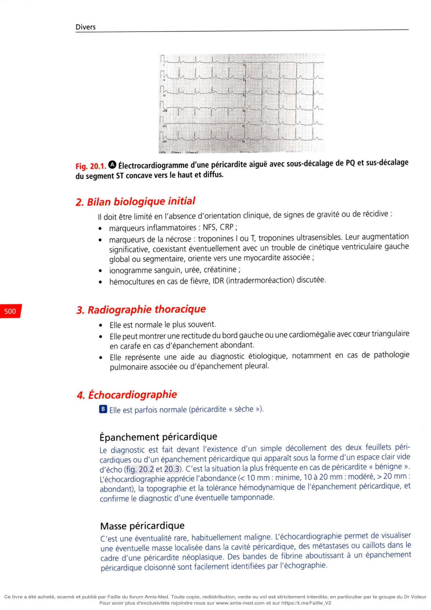
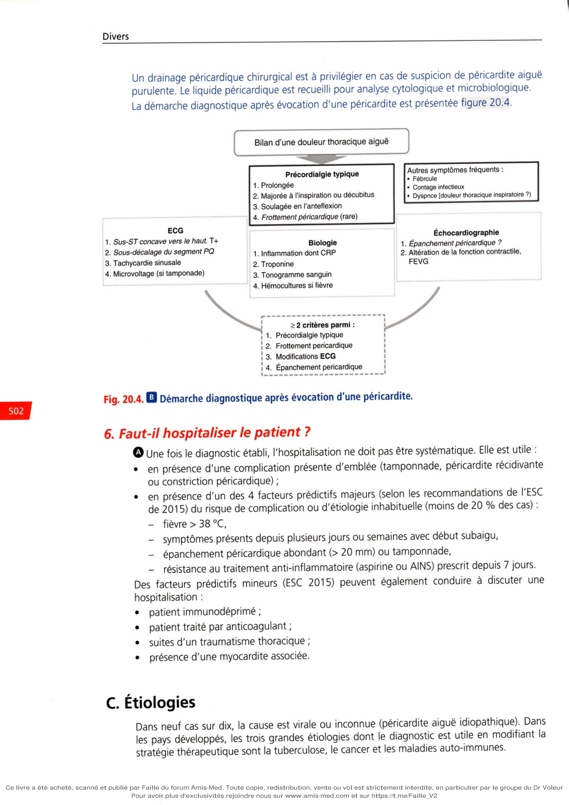

# Item 235 — Péricardite aiguë

> **Collège CNEC / SFC** · 3e édition (2025) · p. 497–510 · R2C  
> Partie VI — Divers

---

## Trois repères à ne pas confondre

| Badge | Signification (R2C) |
|---|---|
| **Rang A** | Connaissances fondamentales de fin de 2e cycle |
| **Rang B** | Connaissances essentielles, plus spécialisées |
| **Rang C** | Connaissances de 3e cycle (DES) |

Les pastilles du livre (● = A, ■ = B) sont reprises inline.

---

## Situations de départ

43 Découverte d'une hypotension artérielle.  
161 Douleur thoracique.  
166 Tachycardie.  
178 Demande/prescription raisonnée et choix d'un examen diagnostique.  
185 Réalisation et interprétation d'un électrocardiogramme (ECG).  
203 Élévation de la protéine C-réactive (CRP).  
249 Prescrire des anti-inflammatoires non stéroïdiens (AINS).

---

## Hiérarchisation des connaissances

| Rang | Rubrique | Intitulé | Descriptif |
|---|---|---|---|
| **A** | Définition | Définition d'une péricardite aiguë | |
| **A** | Diagnostic positif | Symptômes et signes cliniques | Enjeu diagnostique vs SCA |
| **A** | Identification de l'urgence | Signes de gravité, drainage | Insuffisance cardiaque droite, hypotension, pouls paradoxal |
| **A** | Examens complémentaires | ECG et bilan biologique initial | Signes ECG, marqueurs inflammation/nécrose |
| **A** | Examens complémentaires | Intérêt diagnostique de la ponction péricardique | Étiologie infectieuse, IC, tumorale |
| **B** | Examens complémentaires | Imagerie (radio, échocardiographie) | Silhouette cardiaque, épanchement, cinétique |
| **A** | Contenu multimédia | Exemple ECG péricardite aiguë | |
| **A** | Prise en charge | Évaluer les risques de complications | Fièvre, durée, épanchement, résistance AINS |
| **A** | Étiologies | Forme clinique usuelle | Péricardite aiguë virale |
| **B** | Étiologies | Péricardite au cours d'un IDM | Précoce, syndrome de Dressler |
| **B** | Étiologies | Formes cliniques moins fréquentes | Purulente, tuberculeuse, néoplasique, auto-immune, IRC, post-péricardiotomie |
| **A** | Prise en charge | Traitement péricardite aiguë bénigne | Repos, AINS, colchicine |
| **A** | Suivi et/ou pronostic | Complications | Épanchement, tamponnade, myocardite, récidive, constriction |
| **B** | Étiologies | Étiologies devant une tamponnade | Hémopéricarde, traumatique, néoplasique, virale, post-IDM, dissection |
| **A** | Identification de l'urgence | Diagnostic de tamponnade | Signes droits, choc obstructif |

---

## Parcours Rang A

- [I. Diagnostic](#i-diagnostic)
- [II. Complications (tamponnade)](#ii-complications-à-court-et-long-terme)
- [III. Traitement](#iii-traitement)

---

## Sommaire

- [Vignette clinique](#vignette-clinique)
- [Introduction](#introduction)
- [I. Diagnostic](#i-diagnostic)
- [II. Complications à court et long terme](#ii-complications-à-court-et-long-terme)
- [III. Traitement](#iii-traitement)
- [Points](#points)
- [Notions indispensables et inacceptables](#notions-indispensables-et-inacceptables)
- [Réflexes transversalité](#réflexes-transversalité)
- [Entraînement](../../Entrainement/QI/235_Pericardite_aigue.md)

---

## Vignette clinique

Vous accueillez au service des urgences un homme de 26 ans, sportif, qui présente une douleur
thoracique intense (EVA 8/10), rétrosternale, fluctuante car majorée par les inspirations et la position
en décubitus. La douleur a débuté la veille au soir et ne fait qu'augmenter depuis. Il n'y a pas de signes
d'accompagnement. Vous apprenez que lui et son entourage ont présenté une virose ORL sur les
2 dernières semaines.
L'examen physique met en évidence un fébricule à 38 °C, un souffle systolodiastolique à tous les foyers,
l'absence de signes d'insuffisance cardiaque. L'ECG initial était normal mais contrôlé, une demi-heure
plus tard, il montre un sus-décalage diffus du segment ST n'englobant l'onde T.
Vous suspectez fortement une péricardite aiguë et dans l'attente de récupérer les résultats de la biologie sanguine et de réaliser une échocardiographie, vous administrez 1 g d'aspirine. Ceci soulage
quasi complètement la symptomatologie.
Finalement, la biologie rapporte une CRP à 15mg/L, une troponine non élevée, le reste du bilan
est sans particularité. L'échocardiographie est normale mais montre la présence d'un épanchement
péricardique minime.
Vous envisagez un traitement ambulatoire par anti-inflammatoire, insistez sur la nécessité de ne pas
faire d'activité physique pendant au moins 1 mois et sur le contrôle clinique, voire échocardiographique.
## Introduction

**Rang A.** Inflammation aiguë des feuillets péricardiques, la péricardite aiguë pose des problèmes
diagnostiques, expose au risque de tamponnade, de récidives fréquentes (20 à 30 %) et, pour
certaines étiologies, au risque d'évolution vers la constriction péricardique.

# I. Diagnostic

**Rang A** · **Rang B**.
Le diagnostic de péricardite aiguë est évoqué dans le contexte d'une douleur thoracique
aiguë. Les diagnostics différentiels (syndrome coronarien aigu, embolie pulmonaire et
dissection aortique) doivent toujours être évoqués car ils sont grevés d'une morbimortalité
importante. Le diagnostic de péricardite se pose devant l'association d'une douleur thoracique évocatrice, d'un éventuel frottement péricardique, de modifications ECG typiques
et d'un épanchement péricardique. La présence de deux de ces critères est nécessaire
pour confirmer le diagnostic. La réalisation d'un ECG et d'une échocardiographie est donc
systématique.

## A. Signes cliniques

Ils comportent :
fièvre modérée, présente d'emblée, associée à des myalgies, à une asthénie, souvent précédée
• d'un épisode grippal. La fièvre est moins fréquente chez le sujet âgé ;
douleur thoracique, rétrosternale ou précordiale gauche, prolongée, résistante à la trinitrine,
majorée en décubitus, à l'inspiration profonde et à la toux, calmée par la position assise
• penchée en avant (antéflexion) ;
dyspnée parfois associée, également soulagée par la position assise penchée en avant ou
• toux sèche, dysphonie et hoquet également possibles ;
frottement péricardique précoce, systolodiastolique, variant dans le temps et les positions
(également décrit comme le crissement de cuir neuf, froissement de soie, bruit de pas dans
la neige fraîche, etc.), confirmant le diagnostic mais inconstant et fugace. Il s'accompagne
• souvent d'une tachycardie. Son absence n'élimine pas le diagnostic ;
épanchement pleural parfois.

## B. Examens complémentaires

### 1. ECG

Il est à répéter car il peut être normal. Il montre :
des anomalies diffuses non systématisées sans image en miroir évoluant en 4 stades
(fig. 20.1):
-
stade I : sus-décalage ST concave vers le haut, ondes T positives le 1er jour,
-
stade II : ondes T plates entre la 24e et la 48 e heure,
-
stade III : ondes T négatives la 1re semaine,
-
• stade IV : normalisation au cours du 1er mois ;
d'autres signes :
-
sous-décalage de PQ présent à la phase initiale,
-
tachycardie sinusale, extrasystole atriale, fibrillation atriale, flutter atrial,
-
microvoltage en cas d'épanchement abondant (amplitude QRS < 5 mm et < 10 mm
respectivement dans les dérivations périphériques et précordiales),
-
parfois, en cas d'épanchement abondant, alternance électrique (amplitude variable des
QRS).

**Fig. 20.1.** Électrocardiogramme d'une péricardite aiguë avec sous-décalage de PQ et sus-décalage

du segment ST concave vers le haut et diffus.

### 2. Bilan biologique initial

Il doit être limité en l'absence d'orientation clinique, de signes de gravité ou de récidive :
• marqueurs inflammatoires : NFS, CRP ;
marqueurs de la nécrose : troponines I ou T, troponines ultrasensibles. Leur augmentation
significative, coexistant éventuellement avec un trouble de cinétique ventriculaire gauche
• global ou segmentaire, oriente vers une myocardite associée ; ionogramme sanguin, urée, créatinine ;
hémocultures en cas de fièvre, IDR (intradermoréaction) discutée.

### 3. Radiographie thoracique

Elle est normale le plus souvent.
Elle peut montrer une rectitude du bord gauche ou une cardiomégalie avec cœur triangulaire
en carafe en cas d'épanchement abondant.
Elle représente une aide au diagnostic étiologique, notamment en cas de pathologie
pulmonaire associée ou d'épanchement pleural.

### 4. Échocardiographie

**Rang A.** Elle est parfois normale (péricardite « sèche »).
Épanchement péricardique
Le diagnostic est fait devant l'existence d'un simple décollement des deux feuillets péricardiques ou d'un épanchement péricardique qui apparaît sous la forme d'un espace clair vide
d'écho (fig. 20.2 et 20.3). C'est la situation la plus fréquente en cas de péricardite « bénigne ».
L'échocardiographie apprécie l'abondance (< 10 mm : minime, 10 à 20 mm : modéré, > 20 mm :
abondant), la topographie et la tolérance hémodynamique de l'épanchement péricardique, et
confirme le diagnostic d'une éventuelle tamponnade.
Masse péricardique
C'est une éventualité rare, habituellement maligne. L'échocardiographie permet de visualiser
une éventuelle masse localisée dans la cavité péricardique, des métastases ou caillots dans le
cadre d'une péricardite néoplasique. Des bandes de fibrine aboutissant à un épanchement
péricardique cloisonné sont facilement identifiées par l'échographie.

### 5. Autres examens complémentaires parfois utiles en 2e intention

Le scanner thoracique et l'IRM cardiaque sont parfois utiles en 2e intention lorsque le patient
n'est pas échogène, ou en présence d'une péricardite néoplasique ou d'un épanchement
péricardique cloisonné. L'IRM a l'avantage de visualiser la cavité péricardique sans injection
de produit de contraste ni irradiation et permet de mettre en évidence une inflammation
du péricarde avec ou sans épanchement péricardique, ainsi qu'une éventuelle myocardite
associée (séquence de rehaussement tardif après injection de gadolinium).
La ponction péricardique est à envisager en cas de tamponnade, de forte suspicion de
péricardite néoplasique et en présence d'un épanchement péricardique abondant, symptomatique, malgré un traitement médical bien conduit depuis 1 semaine. Les analyses réalisées
sur les prélèvements du liquide péricardique sont les suivantes :
• glucose, protides, lactate déshydrogénase ; cytologie et analyse microscopique (colorations de Gram et de Ziehl-Nielsen) ;
• mise en culture bactérienne ;
techniques de PCR (recherche virale et de tuberculose).
Un drainage péricardique chirurgical est à privilégier en cas de suspicion de péricardite aiguë
purulente. Le liquide péricardique est recueilli pour analyse cytologique et microbiologique.

**Fig. 20.4.** Démarche diagnostique après évocation d'une péricardite.

### 6. Faut-il hospitaliser le patient ?

**Rang A.** Une fois le diagnostic établi, l'hospitalisation ne doit pas être systématique. Elle est utile :
en présence d'une complication présente d'emblée (tamponnade, péricardite récidivante
• ou constriction péricardique) ;
en présence d'un des 4 facteurs prédictifs majeurs (selon les recommandations de l'ESC
de 2015) du risque de complication ou d'étiologie inhabituelle (moins de 20 % des cas) :
-
fièvre > 38 °C,
-
symptômes présents depuis plusieurs jours ou semaines avec début subaigu,
-
épanchement péricardique abondant (> 20 mm) ou tamponnade,
-
résistance au traitement anti-inflammatoire (aspirine ou AINS) prescrit depuis 7 jours.
Des facteurs prédictifs mineurs (ESC 2015) peuvent également conduire à discuter une
hospitalisation :
• patient immunodéprimé ; patient traité par anticoagulant ;
• suites d'un traumatisme thoracique ;
présence d'une myocardite associée.

## C. Étiologies

Dans neuf cas sur dix, la cause est virale ou inconnue (péricardite aiguë idiopathique). Dans
les pays développés, les trois grandes étiologies dont le diagnostic est utile en modifiant la
stratégie thérapeutique sont la tuberculose, le cancer et les maladies auto-immunes.

### 1. Péricardite aiguë virale

Étiologie la plus fréquente, mais rarement prouvée, elle est liée à l'infection virale et à la réaction
immune associée.
Le tableau clinique typique regroupe les éléments suivants :
• sujet jeune, syndrome grippal récent, prédominance masculine ; début brutal, fébrile ;
• douleur thoracique typique augmentant à l'inspiration, frottement péricardique ; modifications ECG typiques ;
• échocardiographie normale le plus souvent ;
épanchement pleural souvent associé.
Les virus en cause sont nombreux : entérovirus (coxsackie A et B), échovirus, adénovirus, cytomégalovirus, parvovirus B 19, Epstein-Barr, herpès, VIH (virus de l'immunodéficience humaine),
hépatite C, influenza, etc.
Les sérologies répétées à 15 jours d'intervalle peuvent mettre en évidence une élévation des
anticorps spécifiques, orientant vers le diagnostic de péricardite virale, mais seul le diagnostic
viral (techniques de PCR à partir de l'épanchement péricardique ou d'une biopsie du péricarde)
confirme le diagnostic. Les sérologies sont cependant inutiles dans les formes typiques
sans gravité.
L'évolution est le plus souvent favorable. Le taux de récidive est cependant important, allant
de 20 à 30 %, et représente la complication la plus fréquente. La survenue d'une tamponnade
ou l'évolution vers une constriction péricardique reste rare. Dans certaines formes de péricardite chronique récidivante, après diagnostic viral, la prescription de traitements spécifiques
(immunoglobulines, interféron a) est discutée.
Au cours de l'infection par le VIH, la survenue d'une péricardite avec épanchement péricardique est fréquente. Les mécanismes sont multiples ; la péricardite peut être liée à :
• l'infection virale par le VIH ou d'autres virus ; une surinfection bactérienne ou fongique chez un patient immunodéprimé ;
la présence d'un lymphome ou d'un sarcome de Kaposi.

### 2. Péricardite purulente

**Rang B.** Elle est rare mais grave.
Les germes sont les suivants : staphylocoques, pneumocoques, streptocoques, bacilles à Gram
négatif, etc.
Ces péricardites, en nette diminution, touchent essentiellement les sujets immunodéprimés ou
porteurs d'infection sévère (septicémie, affection pleuropulmonaire, après chirurgie cardiaque
ou thoracique).
Le pronostic est sévère avec survenue fréquente d'une tamponnade ou évolution vers la
constriction péricardique.
Le traitement repose sur une antibiothérapie adaptée au germe retrouvé dans le liquide péricardique (ponction péricardique). Le drainage chirurgical est souvent nécessaire.

### 3. Péricardite tuberculeuse

Il s'agit d'une péricardite subaiguë liquidienne avec altération de l'état général et fièvre modérée
persistante, le plus souvent chez :
• un sujet tuberculeux, âgé ou greffé ; un patient infecté par le VIH ;
un patient alcoolique.
Une notion de tuberculose est retrouvée dans l'entourage ou un virage récent de l'IDR est
observé (faussement négative dans près d'un tiers des cas).
Les anomalies pulmonaires radiologiques sont fréquentes.
La recherche du bacille de Koch - BK (Mycobacterium tuberculosis) peut être faite sur l'expectoration ou les tubages gastriques, le liquide pleural et/ou péricardique, par l'examen au direct
et/ou après cultures sur milieux enrichis ; l'identification du BK peut se faire par techniques
de PCR; de fortes concentrations d'adénosine-déaminase dans le liquide de ponction péricardique sont en faveur du diagnostic. Parfois, une ponction-biopsie du péricarde met en
évidence un granulome inflammatoire.
L'évolution est fréquente vers une tamponnade, une récidive ou une constriction péricardique.
Le traitement repose sur la thérapeutique antituberculeuse associée pour certains aux corticoïdes (prednisone) afin de diminuer le risque d'évolution vers une constriction péricardique.

### 4. Péricardite néoplasique

Les tumeurs primitives du péricarde (mésothéliome péricardique primitif) sont rares, 40 fois
moins fréquentes que les métastases.
Les tumeurs secondaires les plus fréquentes sont les suivantes : cancer bronchique, cancer du
sein, mélanomes, leucémies, lymphomes, sarcome de Kaposi (sida).
L'épanchement péricardique hémorragique est fréquent, de même que la survenue d'une
tamponnade.
Le diagnostic est confirmé par l'échocardiographie, parfois complétée par un scanner ou une
IRM cardiaque.
L'analyse du liquide de ponction péricardique ou la réalisation d'une biopsie péricardique sont
essentielles au diagnostic de malignité.
En cas de tamponnade, la ponction péricardique en urgence s'impose.
La récidive de l'épanchement péricardique est fréquente et requiert un suivi clinique et
échocardiographique.

### 5. Péricardite au cours des maladies systémiques auto-immunes

Les étiologies les plus fréquentes sont le lupus, la polyarthrite rhumatoïde, la sclérodermie, la
périartérite noueuse, la dermatomyosite.
Les péricardites auto-immunes sont également fréquentes, mais restent un diagnostic
d'élimination. Les critères diagnostiques à retenir sont les suivants : augmentation des lymphocytes, présence d'anticorps antisarcolemme dans le liquide péricardique, myocardite associée.

### 6. Péricardite et infarctus du myocarde

La péricardite précoce (J3-J5) est d'évolution le plus souvent favorable, elle survient au décours
d'un infarctus transmural.
La péricardite tardive (2e-16e semaine) correspond au syndrome de Dressler; elle associe
fièvre, péricardite, pleurésie, arthralgies, altération de l'état général, syndrome inflammatoire
important, allongement de l'espace QT à l'ECG. Ce syndrome est devenu rare depuis la
reperfusion coronarienne précoce.

### 7. Péricardite et insuffisance rénale chronique

Il faut distinguer la péricardite urémique survenant chez des insuffisants rénaux sévères non
encore dialysés ou dans les premières semaines suivant l'instauration de la dialyse, et la péricardite chez le patient dialysé au long cours, témoignant le plus souvent d'un traitement
épurateur inadapté.

### 8. Syndrome postpéricardotomie

D'origine inflammatoire, il survient dans les jours ou mois suivant une chirurgie cardiaque ou
après transplantation cardiaque.
La survenue d'une tamponnade est possible et la chirurgie cardiaque représente actuellement
la première cause de constriction péricardique.
En postopératoire, il peut aussi s'agir d'un hémopéricarde.

### 9. Autres causes

Il peut enfin s'agir :
• de dissection aortique avec tamponnade ;
d'irradiation thoracique (radiothérapie pour lymphome ou cancer du sein, etc.), en général
• 1 an après ;
de traumatismes thoraciques ou cardiaques : hémopéricarde, au cours des cathétérismes
(notamment après ablation d'une arythmie par radiofréquence ou après pose d'un stimulateur
• cardiaque) ou en postopératoire immédiat (causes relativement fréquentes) ; de certains médicaments (hydralazine, pénicilline) ;
• d'hypothyroïdie ;
de rhumatisme articulaire aigu.

---

# II. Complications à court et long terme

**Rang A** · **Rang B**.
**Rang A.** La péricardite aiguë est le plus souvent d'évolution simple sans complications. Cependant,
certaines complications potentiellement graves sont à connaître et nécessitent une prise en
charge urgente.

## A. Tamponnade

Il s'agit d'une compression des cavités droites par un épanchement péricardique abondant
et/ou d'installation brutale, c'est une urgence et une cause d'arrêt cardiocirculatoire par
adiastolie en l'absence de traitement, sa confirmation échographique impose le drainage.
• Elle survient dans un contexte de péricardites néoplasiques, traumatiques, tuberculeuses,
d'hémopéricardes, exceptionnellement de péricardite aiguë virale.
**Rang A.** Les signes cliniques sont les suivants :
douleur thoracique avec dyspnée positionnelle, polypnée puis orthopnée et toux, parfois
• dysphagie, nausée, hoquet ; signes droits : turgescence jugulaire, reflux hépatojugulaire, etc. ;
• signes de choc avec tachycardie et PAS < 90 mmHg ; bruits du cœur assourdis ;
pouls paradoxal : l'inspiration entraîne une augmentation du retour veineux provoquant
une dilatation du ventricule droit qui comprime le gauche et aboutit à une baisse de la
PAS : PAS d'inspiration < PAS d'expiration de 10 mmHg.
Les examens complémentaires comportent :
ECG : microvoltage, parfois alternance électrique (complexes QRS successifs de hauteur
• différente) ;
radiographie thoracique : cardiomégalie avec, lorsque l'épanchement péricardique est
• abondant, un aspect en « carafe » ;
échocardiographie confirmant le diagnostic de tamponnade avec collapsus diastolique des
cavités droites en expiration et compression du ventricule gauche par le droit en inspiration,
aspect dit de swinging heart ou balancement du cœur dans la cavité péricardique ; le
déplacement du septum est paradoxal en inspiration, l'épanchement est souvent abondant
(vidéo 20.1).

## B. Myocardite

Elle se manifeste par un tableau d'insuffisance cardiaque fébrile, parfois d'état de choc
(on parle de myocardite fulminante).
Elle est souvent de cause inconnue ou virale.
L'échocardiographie et surtout l'IRM sont utiles.

## C. Péricardite récidivante

Elle survient souvent à la suite d'une durée de traitement insuffisante.
C'est une complication fréquente entre 3 mois et 3 ans après une péricardite aiguë d'allure
virale.
La colchicine en prévient la survenue.

## D. Péricardite chronique (> 3 mois)

Son étiologie est problématique, surtout en l'absence de contexte évocateur de péricardite
aiguë virale.
Elle peut nécessiter une péricardoscopie par fibre optique avec prélèvement biopsique
dirigé.
Elle fait suspecter une péricardite tuberculeuse mais, en pratique, les causes néoplasiques
sont le plus fréquemment retrouvées.

## E. Péricardite chronique constrictive

Une évolution vers une constriction modérée se produit dans moins de 10 % des cas.
Elle est liée à un épaississement fibreux du péricarde ou fibrocalcaire (calcifications péricardiques parfois visibles sur la radiographie de thorax mais surtout au scanner).
Cet épaississement conduit à une adiastolie avec égalisation des pressions télédiastoliques
des 4 cavités cardiaques.
Il s'agit d'un tableau clinique d'insuffisance cardiaque droite (souvent prédominante avec
turgescence jugulaire et ascite) et gauche.
Le diagnostic est échographique, parfois confirmé par les données du cathétérisme droit
(aspect en « dip plateau ») ; le diagnostic différentiel se pose avec les cardiomyopathies
restrictives.
Le traitement est parfois chirurgical par péricardectomie.

---

# III. Traitement

**Rang A** · **Rang B**.

## A. Péricardite aiguë bénigne

La prise en charge comporte :
hospitalisation (en cas de facteurs de risque majeurs, de complications ou d'étiologie
• particulière) ;
repos avec arrêt de l'exercice physique jusqu'à disparition des symptômes et normalisation
• de la CRP, de l'ECG et de l'échocardiographie (en général le 1er mois) ; traitement de la douleur thoracique ;
bithérapie anti-inflammatoire prolongée :
-
AINS pendant 1 à 2 semaines à pleine dose : aspirine 750 à 1 000 mg toutes les 8 heures,
ou ibuprofène 600 mg toutes les 8 heures. L'arrêt de l'aspirine ou de l'ibuprofène se fait
progressivement au bout de 4 à 8 semaines selon les recommandations européennes de
2015, avec cependant une durée de prescription plus courte dans la pratique clinique
actuelle,
-
et colchicine (0,5 mg 2 fois/j) pendant 3 mois. Elle calme la douleur, diminue la durée
des symptômes, et réduit le risque de récidives de 50 %. La colchicine est bien tolérée
aux doses utilisées. La survenue d'une diarrhée doit souvent conduire à en diminuer les
doses. De nombreuses interactions médicamenteuses potentiellement graves sont à
prendre en compte (via le cytochrome P450 3A4 : macrolides, ciclosporine, vérapamil,
statines). Une surveillance biologique stricte est à prévoir dans ces situations : transaminases, créatinine, CPK, NFS, plaquettes. Les doses de colchicine sont diminuées de
moitié (0,5 mg/j) chez les patients de moins de 70 kg, âgés de plus de 70 ans, et en cas
d'insuffisance rénale (DFG [débit de filtration glomérulaire] < 35 mL/min). La colchicine
• est contre-indiquée en cas d'insuffisance rénale sévère ;
protecteur gastrique.
L'arrêt de la colchicine, après 3 mois de traitement, se fait progressivement la dernière semaine
à la dose de 0,5 mg/j 1 jour/2.
**Rang B.** Les corticoïdes ne sont pas indiqués dans la péricardite aiguë bénigne en 1re intention en
raison du risque de récidive. En cas d'échec du traitement par AINS + colchicine, les corticoïdes
doivent être utilisés avec la bithérapie à une dose de 0,25 à 0,5 mg/kg/j.
**Rang A.** Dans le cadre du suivi, il est nécessaire de revoir le patient à 7 jours (médecin traitant), à
1 mois (cardiologue avec échocardiographie), 3 et 6 mois (médecin traitant, si besoin cardiologue) afin de vérifier l'absence de symptômes, la normalisation de la CRP et de l'échocardiographie, et de gérer les modalités d'arrêt des traitements.

## B. Tamponnade

Il s'agit d'une urgence médicochirurgicale nécessitant une hospitalisation en soins intensifs de
cardiologie.
Elle requiert un remplissage par macromolécules.
L'arrêt des traitements anticoagulants ou leur neutralisation sont discutés.
La prise en charge repose sur une ponction péricardique guidée par l'échocardiographie ou un
drainage péricardique chirurgical.

---

---

## Points

• Le tableau typique de péricardite aiguë comporte : douleur thoracique résistante à la trinitrine, majorée à l'inspiration profonde, calmée par la position assise penchée en avant avec fièvre modérée, souvent précédée d'un épisode grippal, et frottement péricardique. L'ECG, à répéter, montre des anomalies diffuses non systématisées sans image en miroir, évoluant en 4 stades :
- stade I : sus-décalage ST concave vers le haut, ondes T positives le 1er jour, sous-décalage du segment
• PQ;
- stade II : ondes T plates entre la 24e et la 48e heure ;
- stade III : ondes T négatives la 1re semaine ;
- stade IV : normalisation au cours du 1er mois.
• La biologie montre un syndrome inflammatoire, et impose de doser les marqueurs de nécrose : troponine I ou T ou troponine ultrasensible.
• Dans la majorité des cas, l'hospitalisation est inutile. La présence d'un seul des 4 facteurs de risque majeurs conduit à hospitaliser le patient : fièvre
> 38 °C, début subaigu, épanchement péricardique abondant, absence de réponse au traitement anti-
• inflammatoire après 1 semaine. Les étiologies sont dominées par la péricardite aiguë virale de bon pronostic (dans 9 cas sur 10, la cause
• est virale ou inconnue), les péricardites néoplasiques ; la péricardite tuberculeuse est en régression ; les autres péricardites bactériennes, du VIH ou les formes auto-immunes sont plus rares. Il ne faut pas
• oublier les deux formes de péricardite au cours de l'infarctus du myocarde (précoce et tardive). L'échocardiographie recherche un décollement des deux feuillets péricardiques ou un épanchement
• péricardique et apprécie l'abondance, la topographie et la tolérance hémodynamique (tamponnade). Le traitement comporte : hospitalisation dans les formes avec facteurs de risque majeurs, repos, AINS
• ibuprofène ou aspirine (1 à 2 semaines à pleine dose), en association avec la colchicine (3 mois). L'arrêt du traitement doit être progressif.
• Les complications possibles sont les suivantes : épanchement péricardique abondant, tamponnade, péri- cardite récidivante (la plus fréquente : 20 à 30 % des cas), péricardite chronique, péricardite chronique
• constrictive. La tamponnade est une urgence médicochirurgicale (tableau de collapsus avec pouls paradoxal) et
• nécessite une hospitalisation en soins intensifs, et la réalisation d’une ponction péricardique guidée par échocardiographie ou d'un drainage chirurgical.
• Un suivi clinique est systématiquement instauré avec échocardiographie de contrôle à 1 mois avant arrêt du traitement anti-inflammatoire.
---

## Notions indispensables et inacceptables

### Notions indispensables

- Hospitalisation recommandée en cas de mauvaise tolérance clinique, fièvre > 38 °C, début subaigu, épanchement péricardique abondant ou résistance au traitement anti-inflammatoire au bout d'une semaine.
- Autres facteurs devant aussi faire discuter une hospitalisation : patient immunodéprimé, patient sous anticoagulant, suites d'un traumatisme thoracique, présence d'une myocardite associée (ou augmentation de la troponine).
- La tamponnade est une urgence médicochirurgicale qui nécessite une prise en charge en USIC et un drainage urgent (risque d'arrêt cardiocirculatoire).

### Notions inacceptables

- Ne pas identifier les situations d'urgence et planifier leur prise en charge (tamponnade).
- Recourir au traitement corticoïde en 1re intention.

---

## Réflexes transversalité

- Item 230 — Douleur thoracique aiguë.
- Item 231 — Électrocardiogramme : indications et interprétation.

---

## Entraînement

Questions isolées et corrigés : [Entrainement/QI/235_Pericardite_aigue.md](../../Entrainement/QI/235_Pericardite_aigue.md)
