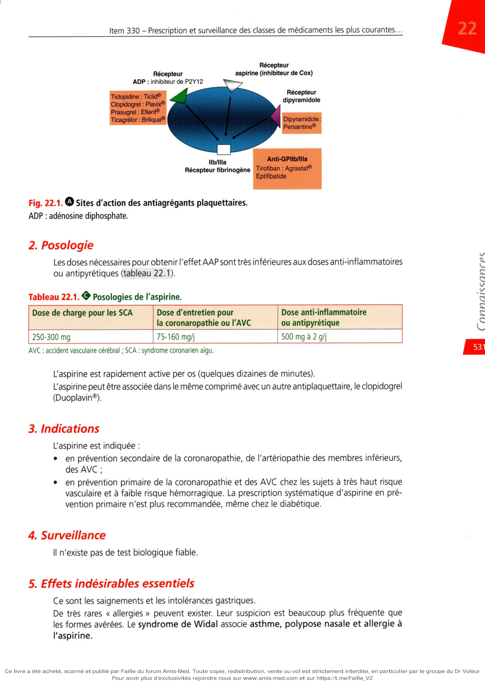
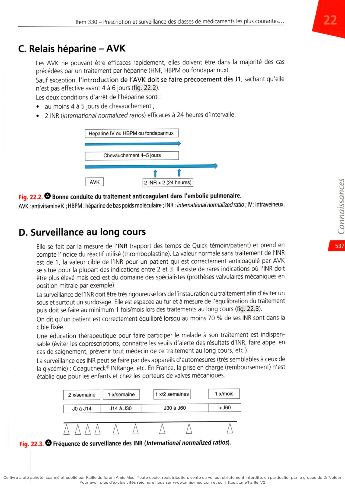

# Item 330 — Prescription et surveillance des antithrombotiques. Accidents des anticoagulants

> **Collège CNEC / SFC** · 3e édition (2025) · p. 529–554 · R2C  
> Partie VI — Divers  
> *Dans cet ouvrage : antithrombotiques et accidents des anticoagulants.*

---

## Trois repères à ne pas confondre

| Badge | Signification (R2C) |
|---|---|
| **Rang A** | Connaissances fondamentales de fin de 2e cycle |
| **Rang B** | Connaissances essentielles, plus spécialisées |
| **Rang C** | Connaissances de 3e cycle (DES) |

Les pastilles du livre (● = A, ■ = B) sont reprises inline.

---

## Situations de départ

10 Méléna/rectorragies.  
59 Tendance aux saignements.  
60 Hémorragie aiguë.  
89 Purpura/ecchymose/hématome.  
102 Hématurie.  
147 Épistaxis.  
213 Allongement du TCA.  
215 Anomalies des plaquettes.  
217 Baisse de l'hémoglobine.  
218 Diminution du TP.  
248 Prescription et suivi anticoagulant/antiagrégant.  
264 Adaptation sur terrain particulier.  
272 Transfusion sanguine.  
285 Suivi et éducation thérapeutique.  
331 Aléa thérapeutique ou erreur médicale.  
352 Expliquer un traitement au patient.  
354 Évaluation de l'observance.

---

## Hiérarchisation des connaissances

| Rang | Rubrique | Intitulé |
|---|---|---|
| **A** | Prise en charge | Antiagrégants plaquettaires : mécanismes, indications, effets secondaires, interactions, surveillance, échec |
| **A** | Prise en charge | Héparines : idem |
| **A** | Prise en charge | Anticoagulants oraux (AVK et AOD) : idem |

---

## Parcours Rang A

- [I. Antiagrégants plaquettaires](#i-antiagrégants-plaquettaires--aap)
- [II. Héparines](#ii-héparines-et-héparinoïdes)
- [III. Antivitamines K](#iii-antivitamines-k)
- [IV. AOD](#iv-anticoagulants-oraux-directs)

---

## Sommaire

- [Introduction](#introduction)
- [I. Antiagrégants plaquettaires](#i-antiagrégants-plaquettaires--aap)
- [II. Héparines](#ii-héparines-et-héparinoïdes)
- [III. Antivitamines K](#iii-antivitamines-k)
- [IV. Anticoagulants oraux directs](#iv-anticoagulants-oraux-directs)
- [V. Thrombolytiques](#v-thrombolytiques)
- [VI. Accidents des anticoagulants](#vi-accidents-des-anticoagulants)
- [Points](#points-encadré-221)
- [Notions indispensables et inacceptables](#notions-indispensables-et-inacceptables)
- [Réflexes transversalité](#réflexes-transversalité)
- [Entraînement](../../Entrainement/QI/330_Antithrombotiques_accidents_anticoagulants.md)

---

## Introduction

**Rang A.** Le traitement antithrombotique est un pilier majeur dans la prise en charge de la maladie

athérothrombotique et dans la maladie thromboembolique veineuse. De façon schématique, on distingue :

•

les agents antiplaquettaires qui agissent sur l'hémostase primaire ;

•

les anticoagulants qui agissent sur la phase de la coagulation ;

•

les fibrinolytiques qui agissent en activant la fibrinolyse, donc la destruction du caillot une fois que celui-ci a été formé.

# I. Antiagrégants plaquettaires — AAP

**Rang A** · **Rang B**.

Ces médicaments ont pour cible les plaquettes, effecteurs essentiels de la phase d'agrégation plaquettaire, une étape clé de la formation d'un thrombus artériel.

## A. Aspirine

L'aspirine est le plus ancien des AAP. Les médicaments disponibles sont : Aspirine Protect® (cp), Kardégic® (poudre), Aspégic® (poudre), Résitune® (cp).

### 1. Mode d'action

L'aspirine agit en inhibant la cyclo-oxygénase (la Cox-1 et, à un moindre niveau, la Cox-2) (fig. 22.1). Elle diminue le taux de thromboxane A2 qui est proagrégant. Son effet sur la plaquette est irréversible et va durer toute la vie de la plaquette (7-10 jours).

**L'aspirine possède de nombreuses autres propriétés :**

•

des effets antalgique, antipyrétique et anti-inflammatoire à des doses > 1 g/j (chez l'adulte), largement utilisés ;

•

un possible effet anticancéreux (essentiellement sur les adénocarcinomes).

**Fig. Sites d'action des antiagrégants plaquettaires.**

ADP : adénosine diphosphate.

### 2. Posologie

Les doses nécessaires pour obtenir l'effet AAP sont très inférieures aux doses anti-inflammatoires ou antipyrétiques (tableau 22.1).

**Tableau 22.1.**

Posologies de l'aspirine. Dose de charge pour les SCA Dose d'entretien pour la coronaropathie ou l'AVC Dose anti-inflammatoire ou antipyrétique 250-300 mg 75-160 mg/j 500 mg à 2 g/j AVC : accident vasculaire cérébral ; SCA : syndrome coronarien aigu. L'aspirine est rapidement active per os (quelques dizaines de minutes). L'aspirine peut être associée dans le même comprimé avec un autre antiplaquettaire, le clopidogrel (Duoplavin®).

### 3. Indications

**L’aspirine est indiquée :**

•

en prévention secondaire de la coronaropathie, de l'artériopathie des membres inférieurs, des AVC ;

•

en prévention primaire de la coronaropathie et des AVC chez les sujets à très haut risque vasculaire et à faible risque hémorragique. La prescription systématique d'aspirine en pré- vention primaire n'est plus recommandée, même chez le diabétique.

### 4. Surveillance

Il n'existe pas de test biologique fiable.

### 5. Effets indésirables essentiels

Ce sont les saignements et les intolérances gastriques. De très rares « allergies » peuvent exister. Leur suspicion est beaucoup plus fréquente que les formes avérées. Le syndrome de Widal associe asthme, polypose nasale et allergie à l'aspirine.

### 6. Situations à risque hémorragique et aspirine

En cas d'arrêt de l'aspirine justifié par la crainte d'une hémorragie, il existe un risque d'évènement athérothrombotique.

**Grandes règles de la bonne gestion du traitement antiplaquettaire**

• Après implantation d'un stent coronarien, il faut retarder de 3-6 mois tout acte invasif à risque hémor-

ragique non urgent.

• Pour de très nombreux actes à risque hémorragique modéré (chirurgie/fibroscopie/biopsie, etc.), il est

préférable de ne pas arrêter l’aspirine. De nombreuses conférences de consensus existent dans chaque spécialité concernée (chirurgiens-dentistes/rhumatologues/gastro-entérologues, etc.) qui acceptent cette règle.

• Quand le risque hémorragique est très important (chirurgie ORL, urologique, neurologique), l'aspirine

ne doit être arrêtée que sur une courte durée : 5 jours avant et reprise le plus tôt possible après l'acte.

## B. Thiénopyridines et ticagrélor

Les médicaments disponibles sont les suivants : clopidogrel (Plavix®), prasugrel (Efient®) et ticagrélor (Brilique®).

### 1. Mode d'action

Ils agissent en bloquant la voie de l'ADP (cf. fig. 22.1) par un récepteur plaquettaire appelé P2Y12 (mode d'action différent de celui de l'aspirine).

•

Le clopidogrel est une prodrogue. C'est sa métabolisation qui le rend actif. Celle-ci passe par la voie du cytochrome P450 et en particulier par le CYP2C19. Chez 15 à 25 % des patients, le métabolisme du clopidogrel se fait mal et le médicament n'est pas ou est trop peu actif.

•

Le prasugrel est aussi un inhibiteur du récepteur P2Y12.

•

Le ticagrélor fait partie d'une famille voisine (cydo-pentyl-triazolo-pyrimidines) mais agit aussi comme un antagoniste sélectif du récepteur P2Y12 de l'ADP. Prasugrel et ticagrélor ont un effet antiplaquettaire plus puissant et plus rapide que le clopidogrel : en moyenne 70 à 80 % d'inhibition plaquettaire contre 40 à 50 % pour le clopidogrel.

### 2. Posologies (tableau 22.2)

•

Le clopidogrel est donné à une dose de charge de 300 à 600 mg (cp à 300 mg), puis de 75 mg en 1 prise/j (cp à 75 mg).

•

Le prasugrel est donné à une dose de charge de 60 mg/j, puis à 10 mg/j en 1 prise/j.

•

Le ticagrélor est prescrit à 180 mg en dose de charge puis en 2 prises/j à 90 mg matin et soir. Molécule Dose de charge (mg) Dose d'entretien (mg) Nombre de prises/jour Clopidogrel 300-600 75 Prasugrel 60 10 Ticagrélor 90x2 2 D La durée de traitement est précisée dans le tableau 22.3.

**Tableau 22.3. O Durée du traitement antiplaquettaire chez le patient coronarien stenté.**

Aspirine Le plus souvent à vie Clopidogrel, ticagrélor Le plus souvent en association avec l'aspirine pour une période 1 à 12 mois (classiquement 12 mois) mais certains patients peuvent en bénéficier au-delà des 12 mois. Des durées plus courtes du traitement par bithérapie sont possibles chez les sujets à risque hémorragique. Prasugrel Le plus souvent en association avec l'aspirine pour une période de 1 à 12 mois

### 3. Indications

• **Rang A.** Le clopidogrel est indiqué dans l'angioplastie coronaire programmée et dans les SCA

(quand le prasugrel et le ticagrélor ne sont pas indiqués ou après une fibrinolyse) en association avec l'aspirine, pour une durée de 3 à 12 mois.

•

Le prasugrel est indiqué dans les SCA, en association à l'aspirine, chez les patients d'âge < 75 ans qui ont été traités par angioplastie.

•

Le ticagrélor est indiqué dans les SCA, en association à l'aspirine. Dans le SCA, clopidogrel, prasugrel ou ticagrélor sont typiquement associés à l'aspirine pen- dant une durée classiquement de 12 mois mais qui dépend aussi du risque hémorragique (de 1 à 12 mois).

**La tendance actuelle est :**

•

de raccourcir la durée de la bithérapie AAP ;

•

de substituer l'aspirine par l'autre AAP au long cours (clopidogrel ou ticagrélor).

### 4. Surveillance

Il n'existe pas de test biologique fiable.

### 5. Précautions et effets indésirables

**Le prasugrel a pour :**

•

contre-indication absolue : antécédent d'AVC ;

•

**contre-indications relatives :**

-

poids < 60 kg,

-

âge > 75 ans. L'effet indésirable principal du ticagrélor est la dyspnée (18 % des patients)

---

# II. Héparines et héparinoïdes

**Rang A** · **Rang B**.

## A. Médicaments

**On distingue :**

•

l'héparine standard non fractionnée (HNF) : héparine IV et héparine calcique (Calciparine®, voie SC - sous-cutanée) ;

•

les héparines de bas poids moléculaire (HBPM) : énoxaparine (Lovenox®), tinzaparine (Innohep®), nadroparine (Fraxiparine®), daltéparine (Fragmine®) ;

•

des « apparentés » comme le fondaparinux (Arixtra®), le danaparoïde (Orgaran®) ou la bivalirudine.

## B. Mode d'action - Pharmacologie (tableau 22.4)

**Tableau 22.4. • Pharmacologie des héparines et héparinoïdes.**

Élimination par le rein Demi-vie Antidote HNF + 1 h 30 Sulfate de protamine HBPM +++ (Cl si ClCr < 30 mL/min) 8 à 24 heures En cours de développement Fondaparinux +++ (Cl si ClCr < 30 mL/min) 17-21 heures En cours de développement Cl : contre-indication ; ClCr : clairance de la créatinine ; HBPM : héparine de bas poids moléculaire ; HNF : héparine non fractionnée. L'HNF, les HBPM et le fondaparinux agissent en activant un anticoagulant physiologique présent dans le sang qui est l'antithrombine. Après injection IV, l'effet anticoagulant de l'HNF est immédiat. La demi-vie de l'HNF est de l'ordre de 1 h 30 (cette notion permet de gérer les doses sur 24 heures). Le maintien de l'activité anticoagulante désirée est donc obtenu soit en perfusant l'HNF en continu (seringue autopousseuse), soit en pratiquant plusieurs injections dans le nycthémère (x 2 ou x 3 pour l'héparine calcique). Les HBPM, qui ont une demi-vie plus longue, s'administrent en SC en 1 ou 2 fois/j en fonction de leur demi-vie. Un bolus pour obtention d'un effet anticoagulant immédiat peut se faire par voie IV. Le fondaparinux, qui a une demi-vie longue, s'administre en IV ou en SC 1 seule fois/j. L'HNF est éliminée, en grande partie, par une fixation sur les protéines, les cellules endothéliales et les macrophages et pour une petite partie par le rein alors que les HBPM et le fondaparinux sont essentiellement éliminés par le rein. L'HNF est le seul anticoagulant utilisable dans les insuffisances rénales sévères (clairance de la créatinine = ClCr < 20-30 mL/min). Les HBPM ainsi que le fondaparinux sont plutôt contre-indiqués lorsque la ClCr est inférieure à 30 mL/min. Des règles d'utilisation récentes autorisent l'énoxaparine lorsque la ClCr est inférieure à 30 mL/min. Pour l'héparine standard, il existe un antidote, le sulfate de protamine, qui doit être administré par voie intraveineuse. Il neutralise instantanément l'action de l'héparine non fractionnée.

## C. Posologie

Les posologies curatives de l'héparine standard pour obtenir un effet anticoagulant rapide (bolus) sont de 70-80 Ul/kg (environ 5 000 Ul en bolus pour un poids de 70 kg), puis de 18 Ul/kg/h (environ 500 Ul/kg/j, soit 30 000 UI/24 h à la seringue autopousseuse). Les posologies curatives des HBPM sont fonction du poids du sujet (100 U anti-Xa/kg), par exemple 0,8 mL x 2 pour l'énoxaparine pour un poids de 80 kg, ce qui implique de connaître le poids du malade avec précision.

## D. Surveillance

**Rang A.** L'effet thérapeutique de l'HNF se mesure par le temps de céphaline avec activateur

(TCA) qui doit être prolongé de 2 à 3 fois par rapport à celui du témoin et/ou par l'activité anti-Xa (entre 0,5 et 0,8/mL). Le premier TCA doit être fait vers la 5e heure après l'instauration du traitement. Les doses d'héparine sont adaptées par rapport à ce TCA qui doit être surveillé au moins une fois par jour. Puis les doses sont adaptées selon le schéma du tableau 22.5.

**Tableau 22.5. 0 Ajustement des doses d'héparine IV en fonction du TCA.**

TCA (s) Dose de charge (UI/24 h) Action supplémentaire <45 + 6 000 Bolus 5 000 U 46-54 + 3 000 / 55-85 0 / 86-110

-3 000

Stop SAP 1 h

>110

-6 000

Stop SAP 1 h_____________________ SAP : seringue autopousseuse ; TCA : temps de céphaline activée. Sauf exception, l'activité thérapeutique des HBPM n'a pas besoin d'être mesurée si elle est prescrite de façon adaptée au poids et en l'absence d'insuffisance rénale.

## E. Indications

Les héparines sont des anticoagulants d'action rapide, utilisés dans toutes situations où une

**anticoagulation urgente est nécessaire, soit :**

•

thromboses veineuses profondes et embolie pulmonaire ;

•

troubles du rythme nécessitant un traitement anticoagulant, le plus souvent en attente de l'efficacité des anticoagulants oraux ;

•

syndrome coronarien aigu. Les HBPM sont largement utilisées en prévention de la thrombose veineuse en contexte chirur- gical ou médical à risque thromboembolique.

## F. Effets indésirables

Il s'agit de complications hémorragiques. Les thrombopénies induites par l'héparine (TIH) (cf. VI. Accidents des anticoagulants) sont une complication classique mais rare de l'héparinothérapie, il s'agit d'un phénomène immunoallergique.

**Rang B.** Une ostéoporose, une alopécie, une élévation des transaminases, un priapisme, une insuf-

fisance surrénalienne aiguë sont des complications rares mais possibles des héparines.

## G. Héparinoïdes et apparentés

### 1. Danaparoïde : Orgaran®

**Rang A.** II est essentiellement utilisé chez les patients présentant ou ayant présenté une TIH et qui

ont besoin de traitement anticoagulant.

### 2. Bivalirudine

C'est un anticoagulant IV essentiellement utilisé lors des angioplasties coronariennes.

---

# III. Antivitamines K

**Rang A** · **Rang B**.

## A. Médicaments

Les antivitamines K sont des anticoagulants administrables par voie orale et utilisables pour des traitements de longue durée.

•

Le plus utilisé dans le monde est la warfarine (Coumadine®) qui devrait rester l'AVK de référence.

•

La fluindione (Préviscan®) est très utilisée en France, mais son instauration est maintenant déconseillée par l'ANSM (Agence nationale de sécurité du médicament et des produits de santé) depuis 2017 en raison d'un risque immunoallergique rare mais grave d'insuffisance rénale. Ces complications surviennent en règle dans les 6 mois, aussi il n'est pas recom- mandé de remplacer la fluindione chez des patients bien équilibrés depuis longtemps.

•

L'acénocoumarol (Sintrom®) doit s'administrer en 2 fois/j et n'est pas l'AVK recommandée.

## B. Mode d'action

Les antivitamines K bloquent au niveau hépatique la synthèse des facteurs II - VII - IX et X de la coagulation. Ils inhibent aussi la synthèse de la protéine C et de la protéine S qui sont deux anticoagulants physiologiques circulants (tableau 22.6).

**Tableau 22.6.0 Propriétés des facteurs de coagulation inhibés par les antivitamines K.**

Facteurs vitamine K-dépendants Demi-vie (h) II Prothrombine 50-120 VII Proconvertine 4-6 IX Hémophilie B 24 X Stuart 36-48 Protéine C 6-10 Protéine S 40 Les AVK ont un délai d'action long, inhérent à la longue demi-vie de certains cofacteurs vitamine K-dépendants. Leur pleine efficacité nécessite donc 3 à 5 jours de prise (tableau 22.7).

**Tableau 22.7.0 Pharmacologie des principaux médicaments antivitamines K.**

Molécule - Nom commercial Demi-vie (h) Durée de l'effet (h) Dosage des cp (mg) Warfarine Coumadine® 35-45 96-120 2 et 5 Fluindione Préviscan® 30 48 20 Acénocoumarol 8-9 36-48 Sintrom® 4 Mini-Sintrom®

## C. Relais héparine - AVK

Les AVK ne pouvant être efficaces rapidement, elles doivent être dans la majorité des cas précédées par un traitement par héparine (HNF, HBPM ou fondaparinux). Sauf exception, l'introduction de l'AVK doit se faire précocement dès J1, sachant qu'elle n'est pas effective avant 4 à 6 jours (fig. 22.2).

**Les deux conditions d'arrêt de l'héparine sont :**

•

au moins 4 à 5 jours de chevauchement ;

•

2 INR {international normalized ratios) efficaces à 24 heures d'intervalle. Héparine IV ou HBPM ou fondaparinux Chevauchement 4-5 jours AVK 2 INR > 2 (24 heures)

**Fig. Bonne conduite du traitement anticoagulant dans l'embolie pulmonaire.**

AVK : antivitamine K ; HBPM : héparine de bas poids moléculaire ; INR : international normalized ratio ; IV : intraveineux.

## D. Surveillance au long cours

Elle se fait par la mesure de l'INR (rapport des temps de Quick témoin/patient) et prend en compte l'indice du réactif utilisé (thromboplastine). La valeur normale sans traitement de l'INR est de 1, la valeur cible de l'INR pour un patient qui est correctement anticoagulé par AVK se situe pour la plupart des indications entre 2 et 3. Il existe de rares indications où l'INR doit être plus élevé mais ceci est du domaine des spécialistes (prothèses valvulaires mécaniques en position mitrale par exemple). La surveillance de l'INR doit être très rigoureuse lors de l'instauration du traitement afin d'éviter un sous et surtout un surdosage. Elle est espacée au fur et à mesure de l'équilibration du traitement puis doit se faire au minimum 1 fois/mois lors des traitements au long cours (fig. 22.3). On dit qu'un patient est correctement équilibré lorsqu'au moins 70 % de ses INR sont dans la cible fixée. Une éducation thérapeutique pour faire participer le malade à son traitement est indispen- sable (éviter les coprescriptions, connaître les seuils d'alerte des résultats d'INR, faire appel en cas de saignement, prévenir tout médecin de ce traitement au long cours, etc.). La surveillance des INR peut se faire par des appareils d'automesures (très semblables à ceux de la glycémie) : Coagucheck® INRange, etc. En France, la prise en charge (remboursement) n'est établie que pour les enfants et chez les porteurs de valves mécaniques. 2 x/semaine 1 x/semaine 1 x/2 semaines 1 x/mois JOà J14 J14à J30 J30 à J60

>J60

AAAA A A A A A

**Fig. Fréquence de surveillance des INR (International normalized ratios).**

**Les AVK possèdent deux antidotes qui sont :**

•

le PPSB (initiale des 4 facteurs de la coagulation vitamine K-dépendants déprimés par les AVK) qui agit très rapidement ;

•

la vitamine K qui antagonise leurs effets en quelques heures. Les AVK sont tératogènes et donc contre-indiquées lors de la première partie du 1er trimestre de la grossesse.

## E. Posologie

La dose de départ est une dose « d'approche » qui doit être plus faible chez les personnes âgées. Les AVK sont très liées aux protéines plasmatiques. Le métabolisme des AVK peut être accéléré ou ralenti par d'autres coprescriptions. Certaines coprescriptions sont strictement contre-in miconazole (Daktarin®). Exemple de la warfarine Posologie 0 Coumadine® 5 mg : boîte bleue, cp bisécables Coumadine® 2 mg : boîte rose, cp bisécables pour ada

- 1re prise JO : 1 cp (soit 5 mg) le soir

- 2e prise J1 : 1 cp (soit 5 mg) le soir

- 3e prise J2 : 1 cp (soit 5 mg) le soir

Adaptations posologiques (INR cible entre 2,0 et 3,0)

- 1er contrôle impératif le matin de J4 (lendemain de la 3e prise) pour

- INR < 1,3 : augmenter la posologie à 8 mg

- 1,3 < INR < 1,5 : augmenter

posologie à 7 ou 6 mg

- 1,5 < INR < 1,75: pas de modification à 5 mg

- 1,75 < INR c

dimmuer la posologie à 4 ou 3 mg

- 2 < INR < 2,5 : diminuer la posolo ë à 3 ou 2,5 mg

- INR > 2,5 : saut d'une prise (à adapter), puis 2,5 mg

- 2e contrôle à J6 ± 1 :

- INR S 1,6 : augmenter la posologie de 30 à 20 %

- 1,6 < INR < 2,5 : continuer sans modifier<tëCposologie

- 2,5 < INR < 3,5 : diminuer la posologie dé /2Q>40 %

- INR > 3,5 : cf. icifka B. Accidents hémorragiques liés ai

**la 4e prise du soir :**

## F. Indications

augmentation.

**Rang A.** En dehors des porteurs de valves mécaniques, de l'insuffisance rénale sévère et des SAPL

triples positifs, les AOD (cf. infra) se substituent de plus en plus aux AVK.

## G. Situations à risque hémorragique

Les patients traités par AVK peuvent avoir besoin de bénéficier d'un geste à risque hémorragique.

**Dans ces conditions, les règles sont les suivantes (tableau 22.8) :**

•

la plupart des gestes à risque hémorragique modéré peuvent se faire sans inter- ruption de l'AVK (petite chirurgie/soins dentaires/certaines ponctions-biopsies, etc.) en vérifiant préalablement que l'INR est dans la limite basse de la fourchette ; Pour avoir plus d’exclusivités rejoindre nous sur www.amis-med.com et sur https://t.me/Faille_V2

•

**lorsque le risque hémorragique est plus important, on peut :**

-

arrêter l'AVK pendant 3 à 4 jours afin de tendre à normaliser l'INR le jour de la procédure et reprendre le traitement le soir même. Ceci est indiqué pour une TVP ou une EP au-delà du 3e mois du traitement ou pour une FA à faible risque embolique,

-

faire un relais par héparine en arrêtant l'AVK 4 à 5 jours avant et en le reprenant après l'acte (sous couverture par héparine le temps que l'INR soit efficace). Ceci est indiqué pour une TVP ou une EP récente (< 3 mois), pour une FA à risque embolique élevé ou chez les porteurs de valves mécaniques ;

•

les relais par héparines, s'ils peuvent paraître rassurants, sont en fait source de complica- tions tant hémorragiques que thrombotiques.

**Tableau 22.8 O Conduite à tenir pour des actes programmés à risque hémorragique chez des patients**

sous antivitamines K. Actes programmés nécessitant l’interruption des AVK (objectif : INR au moment de l'intervention < 1,5 ou < 1,2 si neurochirurgie) FA sans antécédent embolique MTEV à risque modéré Valves mécaniques (tout type) FA avec antécédent embolique MTEV à haut risque Arrêt des AVK sans relais préopératoire par héparine Reprise des AVK dans les 24-48 heures ou, si elle n'est pas possible, héparine à dose curative si le risque hémorragique est contrôlé 2 Arrêt des AVK et relais préopératoire par héparine à dose curative Reprise des AVK dans les 24-48 heures ou, si elle n'est pas possible, héparine à dose curative si le risque hémorragique est contrôlé 2 AVK : antivitamine K ; EP : embolie pulmonaire ; FA : fibrillation atriale ; INR : international normalized ratio ; MTEV : maladie thromboembolique veineuse ; TVP : thrombose veineuse profonde. 1. TVP proximale et/ou EP < 3 mois, MTEV récidivante idiopathique (n £ 2, au moins un accident sans facteur déclenchant). La mise en place d'un filtre cave en préopératoire est discutée au cas par cas.

### 2. L'héparinothérapie à dose curative ne doit pas être reprise avant la 6

e heure postopératoire. Si le traitement par héparine à dose curative n'est pas repris à la 6 e heure, dans les situations où elle est indiquée, la prévention postopératoire précoce de la MTEV doit être réalisée selon les modalités habituelles. HAS. Prise en charge des surdosages en antivitamines K, des situations à risque hémorragique et des accidents hémorragiques chez les patients traités par antivitamines K en ville et en milieu hospitalier. Synthèse des recommandations professionnelles, avril 2008. Nous remercions la Haute Autorité de santé de nous avoir autorisés à reproduire ce tableau. Il est également consultable sur le site www.has-sante.fr rubrique Toutes nos publications.

---

# IV. Anticoagulants oraux directs

**Rang A** · **Rang B**.

## A. Mode d'action

Les anticoagulants oraux directs sont des antithrombotiques qui inhibent soit le facteur II (anti-lla), soit le facteur X (anti-Xa). Leur développement a été favorisé par les difficultés de la gestion des AVK.

## B. Médicaments

Actuellement, trois de ces nouveaux anticoagulants oraux sont disponibles en France : le dabigatran (Pradaxa 8), le rivaroxaban (Xarelto®), l'apixaban (Eliquis 8) (tableau 22.9). Leur élimination rénale est respectivement de 80 % pour le dabigatran, de 33 % pour le rivaroxaban, et de 25 % pour l'apixaban. Il est capital de s'enquérir de la fonction rénale du sujet pour une bonne prescription. Il est déconseillé de les prescrire quand la clairance de la créatinine en Cockcroft est inférieure à 30 à 25 mL/min. Le nombre de prises par jour diffère en fonction de leur demi-vie et des indications : 2 fois/j pour le dabigatran et l'apixaban, 1 fois/j pour le rivaroxaban dans la plupart des indications mais 2 fois/j en début de traitement de la TVP ou de l'EP. Il y a moins d'interactions médicamenteuses qu'avec les AVK. Il existe cependant des inter- actions avec les macrolides, les antiprotéases, les antifongiques azolés, certains anticancéreux, l'amiodarone, le diltiazem et le vérapamil, etc. Comme pour les AVK, les anti-inflammatoires sont à éviter car ils augmentent le risque hémorragique. L'efficacité de ces AOD est rapide (environ 2 heures après la 1re prise). Un patient vu en consultation pour une indication établie (TVP ou EP ou FA) peut recevoir le médicament et, de fait, est tout de suite anticoagulé efficacement, sans nécessité de relais par héparine. Il s'agit d'un bouleversement de l'institution d'un traitement anticoagulant qui ne doit pour autant pas faire galvauder ses indications.

**Tableau 22.9. 0 Propriétés des anticoagulants oraux directs.**

DCI Dabigatran Rivaroxaban Apixaban Spécialité Pradaxa® Xarelto® Eliquis® Dosages (mg) 75, 110, 150 10, 15, 20 2,5,5 Activité Anti-lla Anti-Xa Anti-Xa DCI : dénomination commune internationale. C Surveillance Il n'existe pas de test biologique en routine pour vérifier l'efficacité thérapeutique des anti- coagulants oraux. Ces médicaments ont été validés sans suivi biologique. Le dosage du médicament est possible mais est réservé à la gestion de situations particulières. La plupart des tests de coagulation standards (TCA/TP/INR, etc.) sont perturbés par la prise d'un AOD. Ceci est important à savoir pour éviter de fausses interprétations. Ces tests usuels ne peuvent pas servir à connaître l'efficacité d'un traitement par AOD (tableau 22.10). Un antidote spécifique existe déjà pour le dabigatran (idarucizumab : Praxbind®) et est en cours de commercialisation pour les anti-Xa. Les AOD sont comparés aux AVK dans le tableau 22.1 1.

**Tableau 22.10.**

Généralités sur les AOD - Influence des anticoagulants sur les tests de coagulation. AVK Dabigatran Rivaroxaban Apixaban INR îîî î î Effet très limité TCA (ratio) î î î Normal TT (ratio) Effet très limité îîî Aucune influence Aucune influence Anti-Xa (UI/mL) Effet très limité Aucune influence îî îî AVK : antivitamine K ; INR : international normalized ratio ; TCA : temps de céphaline activée, TT : temps de thrombine.

**Tableau 22.11. 0 Avantages et inconvénients des AOD par rapport aux AVK.**

Avantages des AOD versus AVK Inconvénients des AOD versus AVK Action rapide per os Accumulation possible si insuffisance rénale Pas de surveillance biologique de l'effet thérapeutique Vérification difficile de l'observance Beaucoup moins d’hémorragies globales et surtout intracrâniennes Un peu plus d'hémorragies digestives et génitales Simplicité d'instauration du traitement ______________ AOD : anticoagulant oral direct ; AVK : antivitamine K.

## D. Indications et posologies

Les indications actuelles sont différentes en fonction de chaque molécule et évolutives. Les posologies sont très variables en fonction de chaque indication (tableau 22.12).

**Tableau 22.12.0 Propriétés, posologies et indication des anticoagulants oraux directs.**

Dabigatran Pradaxa® Rivaroxaban Xarelto® Apixaban Eliquis® Mode d'action Anti-lla Anti-Xa Anti-Xa Élimination rénale (%) 80 33 25 Posologie en prévention TVP-EP en orthopédie 1 10 mg x 2/j ou 75 mg x 2/j 10 mg x 1/j 2,5 mg x 2/j Posologie pour la FA « non valvulaire » 110 ou 150 mg x 2/j (adapter sur fonction rénale et âge) 15 ou 20 mg/j 1/j (adapter sur fonction rénale et âge) 2,5 ou 5 mg x 2/j (adapter sur fonction rénale, âge et poids) Posologie pour la TVP-EP 110 ou 150 mg x 2/j Après 5 à 7 jours d'héparine Dose de charge de 15 mg x 2 pendant 21 jours, puis 20 mg x 1/j Sans héparine préalable obligatoire Dose de charge de 10 mg x 2 pendant 7 jours, puis 5 mg x 2/j Sans héparine préalable obligatoire Posologie en post-SCA Pas d'indication 2,5 mg x 2/j Pas d'indication Ces AOD perturbent les résultats de la recherche des APL (anticorps antiphospholipides), en particulier les tests non immunologiques (recherche d'un LA/DRWT : lupus anticoagulant/temps de venin de vipère Russell dilué). Il faut les arrêter 2 à 3 jours avant un bilan de thrombophilie contenant une recherche d'APL (les APL triple positif). EP : embolie pulmonaire ; FA : fibrillation atriale ; SCA : syndrome coronarien aigu ; TVP : thrombose veineuse profonde.

### 1. Rétrécissement mitral ou valve mécanique.

Les valves cardiaques mécaniques sont une contre-indication absolue à l'usage des AOD ainsi que le RM serré.

---

# V. Thrombolytiques

**Rang A** · **Rang B**.

## A. Médicaments et mode d'action

0Ce sont des activateurs de la fibrinolyse physiologique et en particulier du plasminogène. La streptokinase et l'urokinase sont les premiers thrombolytiques qui ont été commercialisés. La streptokinase n'est plus commercialisée. L'urokinase comporte un risque allergique. L'altéplase (Actilyse®) et la ténectéplase (Métalyse®) sont des thrombolytiques de nouvelle génération. La demi-vie de la ténectéplase est relativement longue, permettant une adminis- tration simplifiée en un seul bolus intraveineux.

## B. Indications

Ces médicaments sont administrés par voie intraveineuse dans des conditions très précises :

•

l'infarctus du myocarde datant de moins de 6 à 12 heures lorsqu'il n'y a pas de possibilité d'angioplastie (essentiellement en France par les Samu en préhospitalier) ;

•

l'accident vasculaire cérébral vu dans les 4 h 30 après exclusion d'une cause hémorragique ;

•

l'embolie pulmonaire grave.

## C. Surveillance

Leur efficacité s'accompagne d'un risque hémorragique important qui doit faire « peser » leur indication. Le risque d'hémorragie intracérébrale est de l'ordre de 0,7 à 2 %. Lors d'un traitement thrombolytique, les tests classiques de la coagulation (TCA/TP) sont perturbés pendant toute la durée de l'effet du médicament (environ 24 heures). La surveillance des saignements cliniques et infracliniques est de rigueur (point de ponction artérielle/voie veineuse/sonde urinaire, etc.). Un groupage sanguin systématique est justifié afin d'éviter une perte de temps en cas de saignement grave.

## D. Contre-indications

Elles sont particulièrement importantes à respecter. Elles correspondent à toute circonstance

**qui peut accentuer le risque de saignement :**

•

allergie connue au produit ;

•

patients ayant un risque hémorragique accru : trouble de la coagulation congénitale ou acquis, thrombopathie sévère, thrombopénie sévère, etc. ;

•

poussée ulcéreuse (< 6 mois) ;

•

intervention de chirurgie générale (< 10 jours) ;

•

intervention de chirurgie vasculaire (< 1 mois) ;

•

traumatisme grave ou ponction récente de gros vaisseaux non compressibles ;

•

réanimation cardiopulmonaire prolongée ;

•

anévrisme ou malformation artérielle ou veineuse, malformation vasculaire cérébrale ;

•

HTA non contrôlée (> 200 mmHg) ;

•

AVC étendu (< 6 mois) ;

•

traitement associé par AVK ;

•

insuffisance hépatique sévère ;

•

péricardite aiguë ;

•

endocardite aiguë ou subaiguë ;

•

grossesse.

---

# VI. Accidents des anticoagulants

**Rang A** · **Rang B**.

## A. Accidents liés à l'administration d'héparines

### 1. Accidents hémorragiques liés à l'héparine

Fréquence

**Rang A.** La fréquence des accidents hémorragiques au cours d'un traitement par héparine varie de

1 à 4 % lors d'un traitement curatif et de 1 à 2 % lors d'un traitement préventif.

**Rang B.** Les facteurs associés à la survenue d'un accident hémorragique sont l'âge, le sexe féminin,

un faible poids corporel, l'intensité et la durée de l'anticoagulation. Les comorbidités suivantes sont également susceptibles de favoriser la survenue d'un accident

**hémorragique :**

•

pathologie digestive ou cérébrale à risque hémorragique ;

•

insuffisance hépatocellulaire ;

•

traumatisme ou chirurgie récente ;

•

thrombopénie ;

•

troubles congénitaux de la coagulation à risque hémorragique ;

•

insuffisance rénale surtout pour les HBPM.

**Rang A.** L’administration associée d’un autre antithrombotique (AVK, antiagrégants plaquettaires) mais aussi

d'un AINS augmente le risque. Tableau clinique

**Il peut s'agir :**

•

d'un surdosage biologique asymptomatique : TCA > 3 fois le témoin ou héparinémie élevée pour les HNF, la conduite à tenir consiste à adapter les doses (cf. supra) ;

•

d'une anémie, typiquement microcytaire ferriprive sans hémorragie apparente (d'où la nécessité de pratiquer une NFS régulière lors des traitements de longue durée) ;

•

d'un hématome ou une hémorragie extériorisée grave ou non. Traitement préventif Le respect des règles de prescription des héparines est l'élément fondamental de la prévention

**des accidents hémorragiques liés aux héparines :**

•

bien peser l'indication ;

•

adapter les doses en fonction du poids pour les HBPM ;

•

surveiller quotidiennement la biologie en cas de traitement par HNF ;

•

respecter la contre-indication des HBPM en cas d'insuffisance rénale sévère. Conduite à tenir en cas d'accident

**Elle consiste à :**

•

évaluer la gravité : examen clinique, mesure de la PA et de la FC, recherche de signes de choc hémorragique, dosage de l'hémoglobine et de l'hématocrite ;

•

en cas d'accident mineur : adapter les posologies et assurer une surveillance clinique et biologique rapprochée ;

•

**en cas d'accident majeur :**

-

mettre en balance le risque hémorragique et celui induit par l'arrêt du traitement anti- coagulant (chez les porteurs de valve mécanique, par exemple),

-

procéder à un remplissage intraveineux par des macromolécules, puis compenser les pertes sanguines par transfusion de concentrés de culots globulaires si nécessaire,

-

évaluer l'intérêt de l'administration de l'antidote de l'héparine : le sulfate de protamine.

### 2. Thrombopénies induites par les héparines

Définition et généralités On distingue deux types de thrombopénies survenant chez des patients traités par HNF ou HBPM :

•

la thrombopénie de type I (thrombopénie précoce), bénigne, d'origine non immune et d'apparition précoce sans complication thrombotique et régressant malgré la poursuite du traitement par l'héparine ;

•

la thrombopénie de type II, thrombopénie immunoallergique à l'héparine (TIH) potentiel- lement grave, d'apparition plus tardive vers J7-J10. La TIH est induite par des anticorps qui reconnaissent dans la plupart des cas le facteur 4 plaquettaire (PF4) modifié par l'héparine. En découlent une activation plaquettaire intense ainsi qu'une activation de la coagulation pouvant aboutir paradoxalement à des thromboses veineuses (80 %) et/ou artérielles (20 %). Le risque de la TIH est donc thrombotique et non hémorragique (sauf en cas de CIVD [coagulation intravasculaire disséminée] associée). Épidémiologie

•

**Rang B.** L'incidence de la TIH est de l'ordre de 0,05 à 3 % (pour les plus pessimistes), beaucoup

plus fréquente avec l'HNF qu'avec les HBPM. Sa gravité mérite néanmoins qu'elle soit bien connue.

•

La fréquence est plus élevée en milieu chirurgical qu'en milieu médical (chirurgie cardiaque et orthopédique).

•

**Rang A.** Le délai de survenue de la TIH est typiquement de 5 à 8 jours, après le début de

l'héparinothérapie. Attention : ce délai peut être plus court (dès le 1er jour du traitement) chez des patients ayant été exposés à l'héparine dans les 3 mois précédents. Il peut aussi être plus long, notamment avec les HBPM (pouvant atteindre plus de 3 semaines).

**Selon l'HAS, le diagnostic de TIH doit être évoqué devant les signes suivants :**

•

numération plaquettaire < 100 000/mm 3 (100 G/L) et/ou chute relative des plaquettes sur deux numérations successives (de 30 à 50 % selon les recommandations) sous traitement par héparine, d'où l'impérative nécessité d'une numération plaquettaire avant ou dans les 24 heures de l'introduction d'un traitement par héparine ;

•

apparition de thromboses ou extension du processus thrombotique initial sous héparine ;

•

résistance biologique à l'HNF (le TCA ne décroche pas pour des doses importantes) ;

•

placards inflammatoires au site d'injection des héparines SC ;

•

rarement insuffisance surrénalienne aiguë sur une nécrose des surrénales.

**Rang B.** Dans la TIH, chez 80 % des patients la thrombopénie est comprise entre 30 et 70 G/L.

Une coagulopathie de consommation (CIVD) est rapportée dans 10 à 20 % des cas.

**Lorsque la TIH se complique de thrombose :**

•

les thromboses veineuses profondes sont plus fréquentes (80 %) que les thromboses artérielles ;

•

les thromboses artérielles peuvent toucher l'aorte abdominale et ses branches avec alors un aspect de thrombus blanc (riche en plaquettes) très caractéristique ;

•

des complications neurologiques surviennent chez 9,5 % des patients (AVC ischémiques, thromboses veineuses cérébrales, etc.). La crainte de la survenue d'une TIH est à l'origine de la surveillance de la numération plaquettaire. Cette surveillance n'ayant pas fait la preuve de son efficacité, les dernières recommandations de l'HAS/Afssaps n'imposent plus la surveillance plaquettaire lorsque l'HBPM est donnée en contexte médical mais la préconisent encore en milieu chirurgical ou traumatique et chez les patients à risque (antécédent d'exposition à l'HNF ou HBPM dans les 6 mois précédents ou comorbidités importantes). Conduite à tenir devant une suspicion de TIH

• **Rang A.** Confirmer la thrombopénie par prélèvement sur tube citraté et/ou prélèvement capil-

laire et contrôle sur lame (éliminer une thromboagglutination).

•

Utiliser le score T4 qui permet d'estimer la probabilité d'une TIH (tableau 22.13).

**Tableau 22.13.**

Score des 4 T. Points 0 2 Thrombopénie X < 30 % ou plaquettes < 10 G/L X 30-50 % ou plaquettes 10-20 G/L X > 50 % ou plaquettes 20-100 G/L Timing Autre que 1 et 2 X après plus de 10 jours d'héparine ou dans les 24 heures si héparinothérapie dans les 30 à 100 jours auparavant X 5-10 jours d'héparine ou dans les 24 heures si héparinothérapie dans les 30 jours auparavant Thrombose Pas de thrombose Extension d'une thrombose existante ou suspicion de thrombose non confirmée ou érythème cutané après injection d'héparine Nouvelle thrombose ou réaction systémique à l'injection d'héparine ou nécrose cutanée Autres causes Certaines Possibles Aucune possible 0-3 : risque faible ; 4-5 : risque intermédiaire (> 4 : doit faire poursuivre les investigations) ; 6-8 : risque élevé. of heparin-induced thrombocytopenia in two dinical settings. J Thromb Haemost 2006 ; 4 : 759-65.

• **Rang A.** Éliminer une autre cause de thrombopénie (infectieuse, médicamenteuse, CEC [circulation

extracorporelle]).

•

Pratiquer un test immunoenzymatique (Elisa) à la recherche d'anticorps anti-PF4 (dont la valeur prédictive négative est meilleure que la valeur prédictive positive) ou des tests fonctionnels d'activation plaquettaire avec des plaquettes de volontaires sains.

•

Demander un avis spécialisé afin d'éviter d'arrêter une héparine sans argument. être prise dès qu'il y a suspicion forte de la TIH et ne peut attendre les résultats de la biologie.

**0 La conduite à tenir est la suivante :**

•

hospitalisation : rechercher une complication thrombotique infraclinique ;

•

**en cas de survenue d'une TIH :**

-

déclaration obligatoire au centre régional de pharmacovigilance,

-

délivrance d'une « carte de TIH » au patient qui notifie cet antécédent ;

•

arrêt de toute source d'héparine (attention aux flushs héparinés des cathéters artériels) ;

•

**alternatives anticoagulants à discuter au cas par cas :**

-

traitement par danaparoïde sodique (Orgaran®) systématique au moins à dose prophylactique et au minimum jusqu'à correction de la numération plaquettaire,

-

**relais possible par :**

-

AVK (début à petite dose) envisagé en cas de prévention prolongée,

-

fondaparinux (Arixtra®) mais aussi AOD,

-

numération plaquettaire au moins 1 fois/j jusqu'à normalisation de la numération plaquettaire. Prévention

****Rang A.** La prévention primaire des TIH repose sur trois principes :**

•

durée d'utilisation des héparines la plus courte possible ;

•

relais précoce par AOD ou AVK lorsque possible ;

•

utilisation préférentielle des HBPM ou du fondaparinux dans les indications démontrées.

## B. Accidents hémorragiques liés aux antivitamines K

### 1. Fréquence

• **Rang A.** Six cent mille patients environ sont traités par AVK en France, soit 1 % de la population.

•

Les AVK sont la 1re cause iatrogène d'hospitalisation avec 13 % des hospitalisations pour effets indésirables médicamenteux.

**Rang A.** II faut distinguer les surdosages constatés par la surveillance biologique (sans saignement)

et ceux qui se démasquent par un saignement.

### 2. Conduite à tenir en cas de surdosage asymptomatique

•

Le plus souvent, la prise en charge est ambulatoire.

•

Elle est fonction de l'INR mesuré et de l'INR cible (tableau 22.14).

**Tableau 22.14. Q Conduite à tenir en cas de surdosage en AVK chez un patient asymptomatique.**

INR mesuré INR cible INR cible 2,5 (fenêtre entre 2 et 3) INR cible 3 (fenêtre 2,5-3, 5 ou 3-4,5) INR <4 Pas de saut de prise Pas d’apport de vitamine K Adaptation de la posologie 4 < INR <6 Saut d'une prise Pas d'apport de vitamine K Adaptation de la posologie lors de la reprise du traitement Pas de saut de prise Pas d'apport de vitamine K Adaptation de la posologie (Suite)

**Tableau 22.14. • Suite.**

INR mesuré INR cible INR cible 2,5 (fenêtre entre 2 et 3) INR cible 3 (fenêtre 2, 5-3, 5 ou 3-4,5) 6 < INR <10 Arrêt du traitement par AVK 1 à 2 mg de vitamine K per os Adaptation de la posologie lors de la reprise du traitement Saut d'une prise Avis spécialisé (ex : cardiologue si le patient est porteur d'une prothèse valvulaire mécanique) recommandé pour discuter un traitement éventuel par 1 à 2 mg de vitamine K per os Adaptation de la posologie lors de la reprise du traitement INR > 10 Arrêt du traitement par AVK 5 mg de vitamine K per os (’/z ampoule buvable forme adulte) Adaptation de la posologie lors de la reprise du traitement Avis spécialisé sans délai ou hospitalisation recommandé HAS. Prise en charge des surdosages en antivitamines K, des situations à risque hémorragique et des accidents hémorragiques chez les patients traités par antivitamines K en ville et en milieu hospitalier. Synthèse des recommandations professionnelles, avril 2008. Nous remercions la Haute Autorité de santé de nous avoir autorisés à reproduire ce tableau. Il est également consultable sur le site www.has-sante.fr rubrique Toutes nos publications.

•

La cause du surdosage doit être recherchée et prise en compte dans l'adaptation éventuelle de la posologie.

•

Un contrôle de l'INR doit être réalisé le lendemain.

•

En cas de persistance d'un INR au-dessus de la fourchette thérapeutique, les recommanda- tions précédentes restent valables et doivent être reconduites.

•

La surveillance ultérieure de l'INR doit se calquer sur celle habituellement réalisée lors de l'instauration du traitement.

### 3. Conduite à tenir en cas d'hémorragies spontanées ou traumatiques

Définition d’une hémorragie grave Hémorragie extériorisée non contrôlable par les moyens usuels. Instabilité hémodynamique (collapsus). Nécessité d’un geste hémostatique (ou chirurgical). Nécessité de transfusion de culots globulaires. Hémorragie de localisation menaçant le pronostic vital ou fonctionnel. S'il n'existe aucun de ces critères, l'hémorragie est considérée comme non grave. Le principe de la gestion initiale d'une hémorragie est le même et fait appel à des moyens qui

**dépendent de la localisation et de l'importance du saignement :**

•

compression mécanique : suture d'une plaie vasculaire ;

•

application locale d'agent hémostatique (colle à la fibrine ou à la thrombine) ;

•

injection locale de vasoconstricteurs (adrénaline), en particulier lors des fibroscopies diges- tives pour hémorragie digestive ;

•

embolisation par radiologie interventionnelle. Conduite à tenir en cas d'hémorragie non grave

•

Une prise en charge ambulatoire est le plus souvent réalisable en cas d'hémorragie rapide- ment contrôlable.

•

La mesure de l'INR est réalisée en urgence.

•

En cas de surdosage, les mêmes mesures de correction de l'INR que celles décrites précédemment sont recommandées (cf. tableau 22.13).

•

La cause du saignement doit être recherchée. Conduite à tenir en cas d'hémorragie grave

• • La prise en charge est hospitalière. Les AVK sont arrêtés.

•

La mesure de l'INR est réalisée en urgence. Le traitement est instauré sans attendre le résultat.

•

**On utilise des antidotes :**

-

la vitamine K qui nécessite quelques heures de délai d'action ;

-

les concentrés de complexes prothrombiniques (CCP, aussi appelés PPSB : Kanokad®, Confidex®, Octaplex®), de délai d'action très bref mais de durée d'action courte, nécessitant donc concomitamment de la vitamine K.

•

On assure le traitement habituel d'une hémorragie massive (correction de l'hypovolémie, transfusion de culots globulaires, etc.). La nécessité d'un geste hémostatique chirurgical ou endoscopique doit être rapidement évaluée.

•

**La surveillance biologique est la suivante :**

-

réalisation d'un INR 30 minutes après administration du CCP ;

-

si l'INR reste > 1,5, une administration complémentaire de CCP adaptée à la valeur de l'INR est recommandée ;

-

mesure de l'INR 6 à 8 heures plus tard, puis 1 fois/j pendant la période critique.

•

L'indication ultérieure des AVK doit être à nouveau pesée. En cas de nécessité de traitement anticoagulant impératif, un relais par héparine est entrepris en attendant.

### 4. Conduite à tenir chez le polytraumatisé

• **Rang A.** La mesure de l'INR est réalisée en urgence.

•

La même conduite que celle à tenir devant les hémorragies graves ou non graves selon la gravité et la nature du traumatisme est recommandée.

•

En cas de traumatisme crânien : une hospitalisation au moins 24 heures et la réalisation d'un scanner cérébral en urgence sont requises.

### 5. Intérêt de la prévention de ces accidents

**Il fait appel à :**

•

l'éducation des patients ;

•

l'attention portée aux interactions médicamenteuses ;

•

l'utilisation de l'automesure de l'INR (dispositif semblable à ceux utilisés pour la mesure de la glycémie capillaire dans le diabète mais non remboursé en France, sauf chez l'enfant et chez les patients porteurs de prothèse valvulaire), qui peut diminuer le risque hémorragique.

## C. Accidents liés aux anticoagulants oraux directs

**Les principes qui les gèrent sont les suivants :**

•

les AOD ont une demi-vie courte : le meilleur antidote est le temps que l'on peut gagner après la dernière prise ;

•

le dabigatran a déjà un antidote commercialisé ;

•

les anti-X sont à ce jour antagonisés par des concentrés de PPSB ou de Feiba® (mélange de PPSB et de facteur VIII) mais l'arrivée prochaine probable d'un antidote anti-X pourra modifier ces stratégies ;

•

le dosage du médicament peut être fait pour tous les AOD commercialisés (dans des labo- ratoires spécialisés) ;

•

si ce dosage permet, en situation à risque de saignement, de gérer au mieux la situation, en cas de saignement actif, la conduite à tenir ne peut attendre le résultat du dosage de la concentration du médicament dans le sang. Le GIHP (Groupe d'intérêt en hémostase périopératoire) a proposé des règles de conduite générales, de bon sens (encadré 22.1).

---

## Points (encadré 22.1)

un par le Gll

• **Rang A.** Noter :

heure de la dernière

**Prélever :**

**Antiagrégants**

• L'aspirine, le clopidogrel, le prasugrel et le ticagrélor sont les principaux antiagrégants plaquettaires

actuellement disponibles.

• On ne surveille pas en routine l'activité antiagrégante de ces différents traitements.

• Après un SCA et/ou la mise en place d'un stent, on prescrit une double antiagrégation plaquettaire

associant toujours de l’aspirine pour l'un d'entre eux, classiquement pendant 12 mois.

• Après un SCA et/ou la mise en place d'un stent, il faut retarder d’au moins 1 à 3 mois la réalisation

d'un geste invasif hémorragique, pour ne pas interrompre trop précocement les antiplaquettaires qui exposent les patients à une thrombose de stent et à un infarctus du myocarde.

• Pour de nombreux actes à risque hémorragique modéré (fibroscopie avec biopsie, stomatologie, etc.), il

ne faut pas interrompre l'aspirine chez le patient en prévention secondaire.

• Si le risque hémorragique est important, l'arrêt de l'aspirine doit être le plus bref possible (5 jours).

**Héparines**

• Les héparines (HNF, HBPM, fondaparinux) sont utilisées lorsque l'on souhaite obtenir un effet anti-

coagulant rapide. Les HBPM et le fondaprinux sont contre-indiqués en cas d'insuffisance rénale sévère.

• L’efficacité thérapeutique de l’HNF se mesure par le TCA (2 à 3 fois le témoin) ou par l’activité anti-Xa (entre

0,5 et 0,8). Sauf situation particulière, il n’est pas nécessaire de mesurer l'efficacité thérapeutique des HBPM.

**Antivitamines K**

• Les AVK s'utilisent par voie orale pour un traitement anticoagulant prolongé. Leur efficacité théra-

peutique se mesure par l'INR, dont la cible est différente en fonction des indications. Ils ne sont pas efficaces immédiatement et donc, lorsqu'ils sont utilisés en relais des héparines, les deux traitements doivent se chevaucher quelques jours jusqu’à l'obtention d'un INR efficace. L'éducation thérapeutique est cruciale pour le patient sous AVK.

• Si un geste à risque hémorragique doit être envisagé, on peut souvent le faire sans arrêter les AVK si le

risque hémorragique est faible ou en arrêtant le traitement temporairement si le risque hémorragique est plus important et si le risque de thrombose ne l'est pas trop.

• Les relais par héparines sont sources de complication hémorragique ou thrombotique et sont réservés

aux situations à risque thrombotique élevé (EP récente, prothèse valvulaire mécanique, FA à risque embolique élevé).

**AOD**

• Ils sont efficaces très rapidement (2 heures après la prise) et ne nécessitent pas de surveillance biologique.

• On adapte leur posologie en fonction de l'âge, de la fonction rénale et du poids. Ils sont contre-indiqués

en cas d'insuffisance rénale sévère.

• Leurs indications actuelles sont réservées au traitement curatif de la MTEV (anti-Xa), au traitement

préventif de la FA et pour certains d'entre eux (anti-Xa) à la prévention et au traitement de la MTEV.

• Ils ne peuvent être prescrits chez les patients porteurs de prothèses mécaniques ou en cas de RM.

**Fibrinolytiques**

• Ils sont utilisés aujourd'hui dans l'infarctus du myocarde, l'AVC et l’EP grave.

• Leur efficacité s'accompagne d’un risque d'hémorragie significatif, notamment cérébrale.

**Accidents des anticoagulants**

• Les anticoagulants sont responsables d'une iatrogénie importante.

• Il peut s'agir d'accidents hémorragiques parfois liés à un surdosage.

• Le sulfate de protamine est un antidote de l'héparine, la vitamine K est l'antidote des AVK et un AOD

(le dabigatran) a aussi déjà un antidote, les autres peuvent être antagonisés par du PPSB ou du Feiba®.

• Il est important de dépister rapidement des accidents et de bien connaître leur prise en charge qui

dépend de la gravité du tableau hémorragique et du risque thrombotique sous-jacent.

• Il faut aussi savoir dépister et prendre en charge une thrombopénie induite par l'héparine.
---

## Notions indispensables et inacceptables

### Notions indispensables

- Ne pas oublier l'éducation du patient sous AVK et sous AOD.
- Pas d'AOD dans les prothèses valvulaires mécaniques ou dans le RM.
- Savoir faire un relais héparine-AVK.

### Notions inacceptables

- Prescrire une HBPM ou un AOD en cas d'insuffisance rénale sévère.
- Prescrire un AOD dans les prothèses valvulaires mécaniques ou dans le rétrécissement mitral.

---

## Réflexes transversalité

- Item 153 — Surveillance des porteurs de valve et prothèses vasculaires.
- Item 226 — Thrombose veineuse profonde et embolie pulmonaire.
- Item 232 — Fibrillation atriale.
- Item 339 — Syndromes coronariens aigus.

---

## Entraînement

Questions isolées et corrigés : [Entrainement/QI/330_Antithrombotiques_accidents_anticoagulants.md](../../Entrainement/QI/330_Antithrombotiques_accidents_anticoagulants.md)
