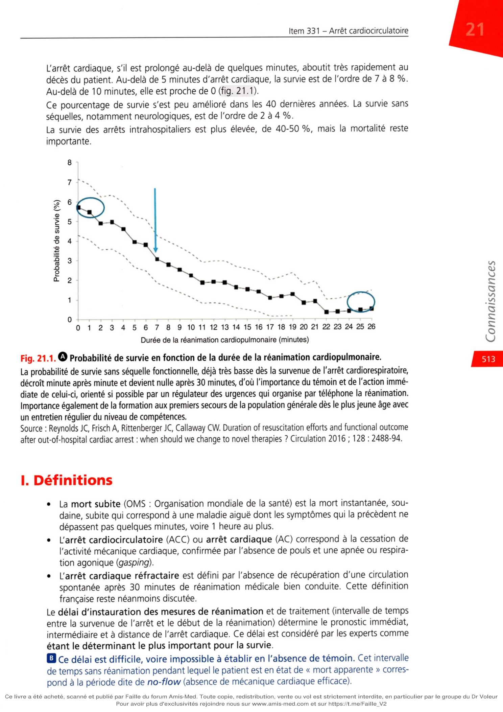
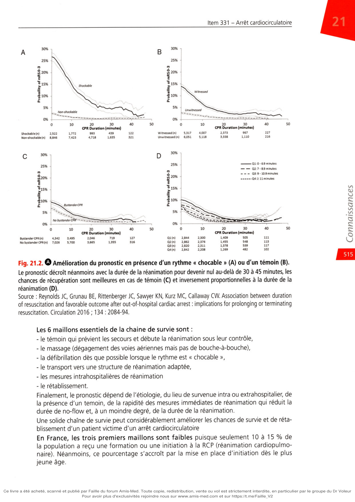
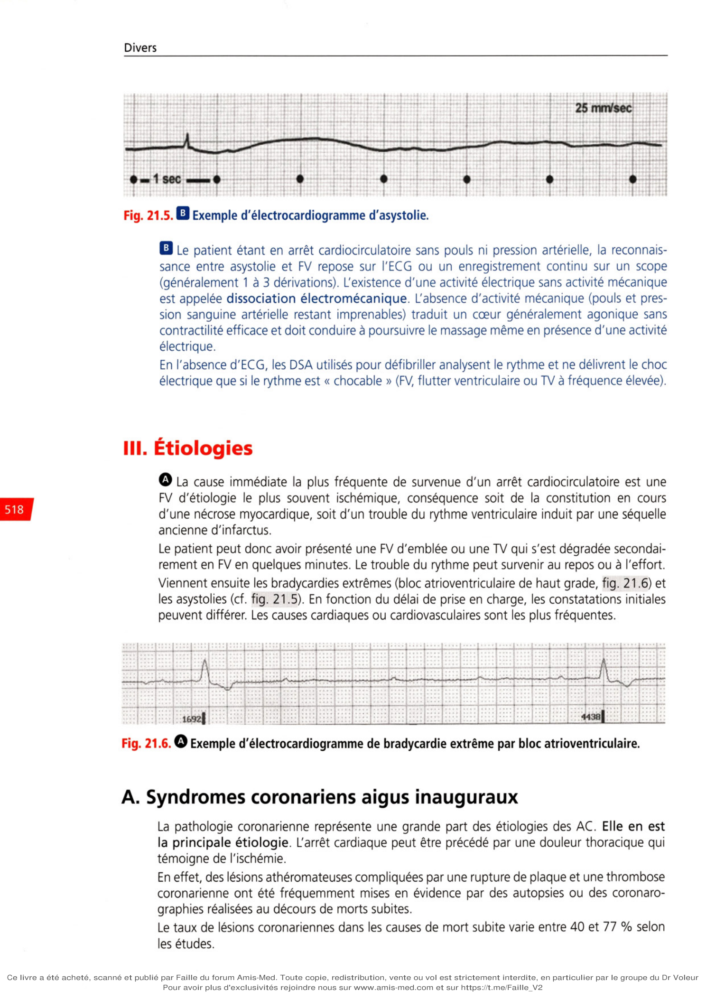

# Item 331 — Arrêt cardiocirculatoire

> **Collège CNEC / SFC** · 3e édition (2025) · p. 511–528 · R2C  
> Partie VI — Divers

---

## Trois repères à ne pas confondre

| Badge | Signification (R2C) |
|---|---|
| **Rang A** | Connaissances fondamentales de fin de 2e cycle |
| **Rang B** | Connaissances essentielles, plus spécialisées |
| **Rang C** | Connaissances de 3e cycle (DES) |

Les pastilles du livre (● = A, ■ = B) sont reprises inline. Objectifs grisés (*) non traités dans le corps.

---

## Situations de départ

28 Coma et troubles de conscience (diagnostic différentiel).  
38 État de mort apparente.  
50 Malaise/perte de connaissance.  
159 Bradycardie.  
160 Détresse respiratoire aiguë.  
161 Douleur thoracique.  
165 Palpitations.  
166 Tachycardie.  
185 Réalisation et interprétation d'un électrocardiogramme (ECG).

---

## Hiérarchisation des connaissances

| Rang | Rubrique | Intitulé | Descriptif |
|---|---|---|---|
| **A** | Définition | Définir un arrêt cardiocirculatoire | Définition OMS ; diagnostic positif = absence de réponse + ventilation inefficace |
| **A** | Définition | Définir la chaîne de survie | Maillons de la chaîne de survie |
| **B** | Prévalence, épidémiologie | Incidence et pronostic de l'AC chez l'adulte et l'enfant | *Enfant non traité* |
| **A** | Étiologies | Principales étiologies d'AC | Prééminence de l'origine coronarienne |
| **A** | Définition | No-flow et low-flow | |
| **A** | Prise en charge | Ventilation de base | Canule de Guedel ; ventilation adulte vs enfant |
| **A** | Prise en charge | Algorithme universel de RCP de l'adulte | |
| **B** | Prise en charge | Scope/défibrillateur manuel ou semi-automatique | Rythmes chocables, DEM, asystolies |
| **B** | Prise en charge | Voies d'abord vasculaires d'urgence | Veineuse périphérique, intra-artérielle |
| **B** | Prise en charge | Adrénaline (rythme chocable) | Indications, posologie, séquence ; amiodarone |
| **B** | Prise en charge | Traitements médicamenteux de la RCP | |
| **B** | Prise en charge | Diagnostic et traitement étiologique | Causes réversibles ; coronarographie |
| **A** | Prise en charge | Critères d'arrêt de la réanimation | |
| **A*** | Prise en charge | Algorithme RCP de l'enfant | *Non traité* |
| **A*** | Identifier une urgence | ACR chez l'enfant : épidémiologie et mécanisme | *Non traité* |
| **A*** | Prise en charge | Principes ACR de l'enfant (premières minutes) | *Non traité* |

---

## Parcours Rang A

- [I. Définitions (no-flow, low-flow)](#i-définitions)
- [IV. Diagnostic](#iv-diagnostic)
- [V. Conduite à tenir (ACD, RCP)](#v-conduite-à-tenir-en-pratique)

---

## Sommaire

- [Vignette clinique](#vignette-clinique)
- [I. Définitions](#i-définitions)
- [II. Chaîne de survie, défibrillation](#ii-notions-de-chaîne-de-survie-défibrillation)
- [III. Étiologies](#iii-étiologies)
- [IV. Diagnostic](#iv-diagnostic)
- [V. Conduite à tenir](#v-conduite-à-tenir-en-pratique)
- [VI. Pronostic préhospitalier](#vi-pronostic-et-survie-à-la-phase-préhospitalière)
- [VII. Pronostic hospitalier](#vii-conditionnement-hospitalier-et-pronostic-à-la-phase-hospitalière)
- [Points](#points)
- [Notions indispensables et inacceptables](#notions-indispensables-et-inacceptables)
- [Réflexes transversalité](#réflexes-transversalité)
- [Entraînement](../../Entrainement/QI/331_Arret_cardiocirculatoire.md)

---

## Vignette clinique

Vous êtes de garde en cardiologie. Il est 0 h 30 et l'infirmière des soins intensifs vous appelle pour un jeune malade de 54 ans qui a bénéficié d'une angioplastie pour un infarctus hier et qui ne répond plus aux questions depuis 2 minutes. Au scope, le patient présente une fibrillation ventriculaire. Elle a commencé à réaliser un massage cardiaque externe.

> Quel est votre diagnostic ?

> Quelle est la durée du no-flow ?

> Quelle est votre prise en charge thérapeutique immédiate ?

> Quelle est la cause la plus probable de l'arrêt cardiaque ?

> Le patient récupère une activité électrique efficace après 3 minutes, quel est son pronostic

neurologique ?

> Quelle est votre prise en charge immédiate en terme diagnostique et thérapeutique après récupé-

ration de l'activité circulatoire ?

**Rang A.** Les recommandations actuelles de prise en charge de l'arrêt cardiocirculatoire (ou arrêt cardiaque) en France reposent sur les recommandations européennes de 2021 du Comité européen de réanimation (ERC), les recommandations de la Société européenne de cardiologie de 2022 et les recommandations américaines de 2020. La Société française de réanimation et la Société française de médecine d'urgence adoptent ces recommandations.

Les arrêts cardiaques extrahospitaliers sont à l'origine de 300 000 décès par an aux États-Unis. En Europe, les décès sont évalués à 500 000 par an. En France, la fréquence des décès par arrêt cardiaque est de 40 000 par an, soit une incidence de 0,75 ‰ dans la population générale.

L'arrêt cardiaque, s'il est prolongé au-delà de quelques minutes, aboutit très rapidement au décès du patient. Au-delà de 5 minutes d'arrêt cardiaque, la survie est de l'ordre de 7 à 8 %. Au-delà de 10 minutes, elle est proche de 0 (fig. 21.1).

Ce pourcentage de survie s'est peu amélioré dans les 40 dernières années. La survie sans séquelles, notamment neurologiques, est de l'ordre de 2 à 4 %. La survie des arrêts intrahospitaliers est plus élevée, de 40-50 %, mais la mortalité reste importante.

**Fig. 21.1 — Probabilité de survie en fonction de la durée de la réanimation cardiopulmonaire.**

La probabilité de survie sans séquelle fonctionnelle, déjà très basse dès la survenue de l'arrêt cardiorespiratoire, décroît minute après minute et devient nulle après 30 minutes, d'où l'importance du témoin et de l'action immédiate de celui-ci, orienté si possible par un régulateur des urgences qui organise par téléphone la réanimation. Importance également de la formation aux premiers secours de la population générale dès le plus jeune âge avec un entretien régulier du niveau de compétences.

Source : Reynolds JC, Frisch A, Rittenberger JC, Callaway CW. Duration of resuscitation efforts and functional outcome after out-of-hospital cardiac arrest : when should we change to novel thérapies ? Circulation 2016 ; 128 : 2488-94.

# I. Définitions

**Rang A.**

•

La mort subite (OMS : Organisation mondiale de la santé) est la mort instantanée, sou- daine, subite qui correspond à une maladie aiguë dont les symptômes qui la précèdent ne dépassent pas quelques minutes, voire 1 heure au plus.

•

L'arrêt cardiocirculatoire (ACC) ou arrêt cardiaque (AC) correspond à la cessation de l'activité mécanique cardiaque, confirmée par l'absence de pouls et une apnée ou respira- tion agonique (gasping).

•

L'arrêt cardiaque réfractaire est défini par l'absence de récupération d'une circulation spontanée après 30 minutes de réanimation médicale bien conduite. Cette définition française reste néanmoins discutée. Le délai d'instauration des mesures de réanimation et de traitement (intervalle de temps entre la survenue de l'arrêt et le début de la réanimation) détermine le pronostic immédiat, intermédiaire et à distance de l'arrêt cardiaque. Ce délai est considéré par les experts comme étant le déterminant le plus important pour la survie.

• Ce délai est difficile, voire impossible à établir en l'absence de témoin. Cet intervalle

de temps sans réanimation pendant lequel le patient est en état de « mort apparente » corres- pond à la période dite de no-flow (absence de mécanique cardiaque efficace).

**Rang A.** Au-delà de 10 minutes d'arrêt sans hémodynamique (pouls et pression sanguine arté-

rielle imprenables) et en dehors du cas particulier de l'hypothermie, le pourcentage de récu- pération et de survie des patients est très faible. Le diagnostic d'arrêt cardiaque doit donc être rapide et les premières mesures de réanimation instaurées immédiatement avant l'arrivée des premiers secours, souvent trop tardifs.

• Le temps de réanimation sans rétablissement d'une hémodynamique convenable (pouls et

pression artérielle stable) définit le temps de low-flow. Les durées de no-flow et low-flow influencent de manière déterminante le pronostic. Tout

**doit être fait pour réduire ces temps :**

•

un temps de no-flow > 5 minutes est associé à un très mauvais pronostic (décès très élevé et séquelles fréquentes en cas de survie) ;

•

au-delà de 10 minutes, la survie est quasi nulle et les récupérations hémodynamiques s'accom- pagnent généralement d'une évolution vers un état d'encéphalopathie anoxique témoignant de l'altération irrémédiable des fonctions cérébrales supérieures. Au-delà de 10 minutes de no-flow, il est donc licite de s'interroger sur le caractère éthique d'une réanimation.

**Rang A.** Si la période de no-flow est brève, la durée du low-flow est moins déterminante au pronostic.

À condition qu'elle soit débutée précocement et qu'elle soit bien réalisée et efficace, une réa- nimation longue peut s'accompagner d'une récupération fonctionnelle cardiaque et cérébrale. Lorsque l'hémodynamique stable est récupérée (pouls et pression artérielle convenables), on parle d'arrêt cardiaque récupéré ou réanimé avec succès.

---

# II. Notions de chaîne de survie, défibrillation

**Rang A** · **Rang B**.

## A. Principe de « chaîne de survie »

Le principe de chaîne de survie est essentiel. La rapidité de la mise en oeuvre de cette chaîne et la complémentarité des différents maillons sont les gages de cette survie. Le concept de « chaîne de survie » a été décrit par Cummins en 1991 qui précise les étapes de la réanimation

**d'un patient en arrêt cardiorespiratoire (ACR) :**

•

**les deux premiers maillons relèvent du grand public :**

-

l'alerte précoce dès le diagnostic fait par le témoin en composant le 15,

-

la réanimation cardiopulmonaire (RCP) précoce,

•

le troisième maillon, la défibrillation précoce, la plus précoce possible, peut être pratiquée en France non seulement par les médecins mais aussi par les infirmiers, les secouristes et les ambu- lanciers depuis le décret 97-239 du 27 mars 1998. Depuis peu, il y a généralisation de défibril- lateurs semi-automatiques dans les lieux publics notamment (gares, aéroports, stades, grandes administrations, etc.). On devrait pouvoir obtenir le retour à un rythme efficace avant l'arrivée de l'équipe médicale. Il faut souligner malgré tout que le nombre de défibrillateurs « publics » reste bas en France, notamment dans les cabinets médicaux. Leur localisation est imprécise, mal connue et non systématisée. Néanmoins, un effort d'équipement important des lieux publics a été fait ces dernières années : stades, gares, aéroports, centres administratifs tels que les mai- ries. De nombreuses postes, pharmacies ou centres commerciaux sont équipés ;

•

le quatrième élément de la chaîne est la RCP spécialisée commencée sur place par l'équipe du SMUR ;

•

le cinquième maillon correspond à la prise en charge hospitalière réanimatoire de haut niveau, traitement de la cause de l'AC si possible, hypothermie contrôlée, assistance circu- latoire, corrections des désordres métaboliques, etc. ;

•

le sixième maillon concerne le rétablissement. X. Witnemd \ 6,051 C 01 0-69 minutes

--------- 02; 7 -89 minutes

- - -

03 9 • 10.9minutes ...... Q42 11minutes 10% - »-* ►* NJ NJ Q un Q m * *

#

#

s BystonderCPR No byüondef CMC CPR Duratio n (minutas) 2,311 1,378 Systander CPA (n) 3,495 2,046 No bystenderCPR(n) 7,026 5,700 3,665 02 (n) 03 (n) 04 (n)

**Fig. Amélioration du pronostic en présence d'un rythme « chocable » (A) ou d'un témoin (B).**

Le pronostic décroît néanmoins avec la durée de la réanimation pour devenir nul au-delà de 30 à 45 minutes, les chances de récupération sont meilleures en cas de témoin (C) et inversement proportionnelles à la durée de la réanimation (D). of resuscitation and favorable outcome after out-of-hospital cardiac arrest : implications for prolonging or terminating

**Les 6 maillons essentiels de la chaîne de survie sont :**

- le témoin qui prévient les secours et débute la réanimation sous leur contrôle,

- le massage (dégagement des voies aériennes mais pas de bouche-à-bouche),

- la défibrillation dès que possible lorsque le rythme est « chocable »,

- le transport vers une structure de réanimation adaptée,

- les mesures intrahospitalières de réanimation

- le rétablissement.

Finalement, le pronostic dépend de l'étiologie, du lieu de survenue intra ou extrahospitalier, de la présence d'un témoin, de la rapidité des mesures immédiates de réanimation qui réduit la durée de no-flow et, à un moindre degré, de la durée de la réanimation. Une solide chaîne de survie peut considérablement améliorer les chances de survie et de réta- blissement d'un patient victime d'un arrêt cardiocirculatoire En France, les trois premiers maillons sont faibles puisque seulement 10 à 15 % de la population a reçu une formation ou une initiation à la RCP (réanimation cardiopulmo- naire). Néanmoins, ce pourcentage s'accroît par la mise en place d'initiation dès le plus jeune âge. Les études montrent l'importance de ces trois premiers maillons non seulement pour le pro- nostic vital mais aussi pour prévenir ou minimiser les séquelles neurologiques.

## B. Défibrillation, asystolie, massage

La fibrillation ventriculaire (FV) (fig. 21.3 et 21 .4) représente le mode électrique initial d'ar- rêt cardiocirculatoire le plus fréquent et le choc électrique externe (CEE) son seul traitement efficace et potentiellement durable. La personne en arrêt cardiocirculatoire a pu présenter des prodromes de type palpitations ou une douleur thoracique. Elle peut fréquemment avoir des antécédents connus de maladie coronarienne ou d'insuffisance cardiaque et peut prendre des médicaments qui ont pu faciliter l'arrêt cardiaque. Le pronostic dépend de la rapidité de la réalisation du CEE. La défibrillation consiste à faire passer à travers le cœur un courant électrique qui entraîne la dépolarisation simultanée d'une masse critique de cellules myocardiques interrompant les phénomènes de réentrée et donc la fibrillation ou la tachycardie ventriculaire. Les défibrillateurs utilisant les ondes biphasiques (CEE délivré jusqu'à 200 J) remplacent aujourd'hui les défibrillateurs à ondes monophasiques (CEE délivré à 360 J). Ils sont reconnus comme plus sûrs et plus efficaces. V4 n J aVK aVl. 1 / /I fl fl fl fl ' /I / il / Il i / / / 1 A V U v V V V V 'J G Les défibrillateurs semi-automatiques (DSA) permettent d'administrer des CEE aux patients le nécessitant avant même l'arrivée des équipes médicales. Ils permettent de gagner un temps précieux. Le DSA analyse le rythme cardiaque du patient et porte l'indication de la défibrillation. Les taux de patients en FV survivant après une défibrillation sont respectivement de 25 % pour un délai de réalisation de la défibrillation de 7 à 10 minutes après l'arrêt cardiaque, de 35 % pour un délai de 4 à 6 minutes, et de 40 à 60 % pour un délai de 1 à 3 minutes. Au-delà de 10 minutes de fibrillation ou d'arrêt, le taux de récupération d'un rythme cardiaque permet- tant une hémodynamique efficace est inférieur à 5 % et la survie sans séquelle neurologique lourde très rare.

**Rang A.** Idéalement, le premier choc électrique externe doit donc pouvoir être délivré dans les

3 minutes qui suivent l'arrêt si le diagnostic est rapide et l'accès au défibrillateur simple. À défaut et dans tous les cas, il faut débuter un massage cardiaque externe permettant de maintenir un degré minimal d'oxygénation tissulaire. Le massage cardiaque permet transitoirement, en l'absence de défibrillateur ou d'efficacité de la défibrillation, de maintenir une mécanique cardiaque et une circulation vers les organes périphériques, en premier lieu le cerveau. Malheureusement, au moment du début de la RCP, la fibrillation ventriculaire n'est observée que dans 40 à 70 % des cas (selon la rapidité de mise en œuvre de la RCP). Lorsqu'elle est absente, le patient est en asystolie.

d'une période de no-flow assez longue. La FV se dégrade (large maille, puis petite maille sur le tracé) progressivement pour laisser place à un tracé électrique plat d'asystolie. L'asystolie ini- tiale dès la survenue de l'arrêt cardiaque est assez rare mais possible. L'asystolie est un facteur pronostic péjoratif.

**Rang A.** Bien entendu, en cas d'asystolie constatée, la prise en charge repose sur le massage et non

sur la défibrillation.

**Fig. 21.5 — Exemple d'électrocardiogramme d'asystolie.**

• Le patient étant en arrêt cardiocirculatoire sans pouls ni pression artérielle, la reconnais-

sance entre asystolie et FV repose sur l'ECG ou un enregistrement continu sur un scope (généralement 1 à 3 dérivations). L'existence d'une activité électrique sans activité mécanique est appelée dissociation électromécanique. L'absence d'activité mécanique (pouls et pres- sion sanguine artérielle restant imprenables) traduit un cœur généralement agonique sans contractilité efficace et doit conduire à poursuivre le massage même en présence d'une activité électrique. En l'absence d'ECG, les DSA utilisés pour défibriller analysent le rythme et ne délivrent le choc électrique que si le rythme est « chocable » (FV, flutter ventriculaire ou TV à fréquence élevée).

---

# III. Étiologies

**Rang A** · **Rang B**.

**Rang A.** La cause immédiate la plus fréquente de survenue d'un arrêt cardiocirculatoire est une

FV d'étiologie le plus souvent ischémique, conséquence soit de la constitution en cours d'une nécrose myocardique, soit d'un trouble du rythme ventriculaire induit par une séquelle ancienne d'infarctus. Le patient peut donc avoir présenté une FV d'emblée ou une TV qui s'est dégradée secondai- rement en FV en quelques minutes. Le trouble du rythme peut survenir au repos ou à l'effort. Viennent ensuite les bradycardies extrêmes (bloc atrioventriculaire de haut grade, fig. 21.6) et

## A. Syndromes coronariens aigus inauguraux

La pathologie coronarienne représente une grande part des étiologies des AC. Elle en est la principale étiologie. L'arrêt cardiaque peut être précédé par une douleur thoracique qui témoigne de l'ischémie. En effet, des lésions athéromateuses compliquées par une rupture de plaque et une thrombose coronarienne ont été fréquemment mises en évidence par des autopsies ou des coronaro- graphies réalisées au décours de morts subites. Le taux de lésions coronariennes dans les causes de mort subite varie entre 40 et 77 % selon les études.

## B. Autres étiologies cardiaques et vasculaires

**U Ce sont :**

•

**les cardiomyopathies :**

-

cardiomyopathie hypertrophique, en particulier dans les formes familiales et/ou obs- tructives (la mort subite survient fréquemment au cours d'un effort, mais pas exclusi- vement),

-

cardiomyopathie dilatée,

-

dysplasie ventriculaire droite arythmogène,

-

cardiopathies valvulaires (rétrécissement aortique essentiellement) ;

•

les troubles du rythme ou de la conduction indépendants de toute anomalie cardiaque

**structurelle :**

-

FV idiopathique,

-

syndrome de Brugada,

-

troubles conductifs paroxystiques notamment du sujet âgé,

-

syndromes du QT long congénitaux ou favorisés par les médicaments,

-

syndromes du QT court congénitaux,

-

troubles du rythme favorisés par l'existence d'une voie accessoire (syndrome de Wolff- Parkinson-White) ;

•

une myocardite aiguë ;

•

les cardiopathies congénitales et malformations vasculaires ;

•

la tamponnade ;

•

la dissection aortique ;

•

l'embolie pulmonaire massive ;

•

la rupture d'anévrisme, etc.

## C. Origines non cardiovasculaires

**Rang A.** D'après les études, ces étiologies représentent 5 à 25 % des cas. Les plus fréquentes sont

les causes toxiques, traumatiques, les insuffisances respiratoires aiguës ou les noyades. Ces causes sont généralement de diagnostic plus aisé, orientées par le contexte.

---

# IV. Diagnostic

**Rang A.**

•

Pour les témoins, le diagnostic repose sur la constatation d'un patient inconscient qui ne bouge plus, ne réagit plus et ne respire plus ou respire uniquement de manière très anor- male (gasps).

•

Pour le public formé au secourisme ou pour les premiers secours médicaux ou para- médicaux, il faut également constater l'absence de pouls carotidien ou fémoral. Dès le diagnostic posé ou suspecté, il faut appeler le 15 et commencer les manœuvres de réanimation.

---

# V. Conduite à tenir en pratique

**Rang A** · **Rang B**.

## A. Prise en charge préhospitalière avant l'arrivée

de l'ambulance médicalisée Les mesures de survie sont définies de façon universelle par l'acronyme ACD (encadré 21 .1). Dans l'attente des premiers soins médicalisés, les priorités de la réanimation sont les points A et C après avoir demandé de l'aide autour de soi et appelé le Samu en composant le 15 :

•

A : l'ouverture des voies aériennes supérieures se fait en basculant la tête en arrière et suré- levant le menton, en vérifiant l'absence de corps étranger, que l'on retire éventuellement avec les doigts en crochet ;

•

C : le massage cardiaque externe (MCE) correctement réalisé est prioritaire pour limi- ter le temps de no-flow et améliorer le pronostic. La victime étant en décubitus dorsal, il consiste pour le sauveteur à appliquer le talon de sa main sur le centre du thorax de la victime et à réaliser des compressions de 4 à 5 cm d'amplitude à une fréquence de 100/min. Si plus d'un sauveteur est présent, il est conseillé de se relayer pour le MCE environ toutes les 2 minutes afin de limiter la fatigue et maintenir l'efficacité de la manœuvre ;

•

D : si un matériel de défibrillation automatique externe (DSA) est disponible et si le sau- veteur sait s'en servir, il doit être utilisé avant l'arrivée de l'ambulance médicalisée. Il est conseillé de poursuivre la réanimation encore 2 minutes après le choc, avant de vérifier la reprise d'une activité circulatoire efficace.

### Encadré 21.1

ACD : mesures de prise en charge préhospitalière de l'arrêt cardiocirculatoire

• **Rang A.** A : airway (maintien des voies aériennes libres)

• D ■ defibrillation (si le rythme initial est une tachy-

• C : circulation (maintien d'une circulation)

cardie ou une fibrillation ventriculaire) Pour le A, les voies aériennes doivent être dégagées et rester libre. Dès que les secours arrivent ou en cas d'arrêt en milieu médicalisé, une canule de Guedel est mise en place dans la cavité buccale. Les insufflations type bouche à bouche (B : breathing) ne sont plus recommandées chez l'adulte contrairement à l'enfant et le nourrisson pour lesquels l'oxygénation reste essentielle car la cause de l'AC est souvent hypoxique. Le MCE (massage cardiaque externe) reste prioritaire et son interruption doit être la plus limi- tée possible. B. Prise en charge par l'équipe médicalisée (généralement SMUR) : RCP médicalisée

### 1. Arrivée de l'équipe médicalisée

****Rang B.** Elle procède à :**

•

l'évaluation du pronostic de survie (encadré 21.2);

•

la réanimation médicalisée (encadré 21.3) selon un algorithme universel (cf. figure en annexe).

### Encadré 21.2

Facteurs initiaux favorables à la réanimation au cours d'une mort subite

• • Présence d'un témoin

• Rythme initial : fibrillation ventriculaire

• Réanimation précoce

• Défibrillation rapide

• Durée courte de la réanimation

### Encadré 21.3

Durant la réanimation médicalisée

• Q S'assurer de la très bonne qualité des com-

pressions (se relayer ou utiliser du matériel de compression)

• Minimiser les interruptions entre les compressions,

y compris durant la période de mise en place de la ventilation

• Oxygéner dès que possible

• Utiliser un enregistreur de CO2 (capnographe)

• Mettre en place des voies accès vasculaires (vei-

neuse et si possible cathéter artériel pour évaluation permanente sanglante de la pression artérielle)

• Administrer des médicaments (adrénaline, etc.)

• Préparer le traitement étiologique s'il y a lieu

(intoxication, revascularisation coronarienne)

• Discuter mise en place d'une assistance circula-

toire extracorporelle

**La réanimation médicalisée permet :**

•

de réaliser une défibrillation si elle est appropriée ;

•

d'assurer une oxygénothérapie par ventilation invasive après intubation endotrachéale, qui doit être réalisée rapidement (ne pas interrompre le MCE plus de 30 secondes). En cas de difficulté d'intubation, il faut faire une ventilation au masque ;

•

de poser une voie d'abord veineuse afin d'administrer des médicaments.

### 2. Médicaments utilisés

Vasoconstricteur : adrénaline Historiquement, l'adrénaline a été le premier médicament utilisé au cours des arrêts car- diaques. Lors de la réanimation cardiorespiratoire, ses effets bénéfiques sont principalement dus aux récepteurs alpha-adrénergiques. La stimulation de ces récepteurs permet d'augmen- ter les débits sanguins myocardiques et cérébraux lors de la réanimation. L'importance des effets bêta-adrénergiques reste controversée car ils sont responsables d'une augmentation du travail myocardique et d'une réduction de la perfusion sous-endocardique. C'est un traitement médicamenteux incontournable dans les AC réfractaires en asystolie. Néanmoins, son impact dans l'amélioration du pronostic de survie et de réduction des séquelles neurologiques reste limité. Le pronostic est inversement corrélé à la quantité d'adrénaline utilisée durant la réanimation. Au-delà de 1 à 2 mg, la survie est faible et en cas de récupération d'une hémodynamique stable, la survie sans séquelles neurologiques lourdes est quasi inexistante. La dose habituellement utilisée est de 1 mg toutes les 4 minutes par voie intraveineuse ou endotrachéale. En cas de FV ou TV persistante sans efficacité circulatoire après le 1er choc électrique, l'adrénaline doit aussi être injectée après 2 minutes de réanimation immédiatement avant le 2e ou le 3e choc. Antiarythmiques Ils sont préconisés dans les AC réfractaires avec troubles du rythme ventriculaire récidivants après des chocs électriques multiples (2 ou plus). Amiodarone C'est une substance ayant une activité sur les canaux sodiques, potassiques et calciques, ainsi que des propriétés inhibitrices alpha et bêta-adrénergiques. Des études prospectives comparant le taux de récupération après l'administration d'amiodarone ou de lidocaïne ont conclu en faveur de l'amiodarone sur la survie à court terme. L'amiodarone administrée par voie intraveineuse est recommandée pour les TV ou les FV réfrac- taires aux chocs électriques externes juste avant le 3e choc. La dose initiale est de 300 mg, diluée dans 20 à 30 mL de sérum salé isotonique et administrée rapidement. Des doses sup- plémentaires de 150 mg peuvent être renouvelées en cas de tachycardie ou de FV réfractaires (persistantes après un 3e CEE) ou récidivantes. Lidocaïne Elle a été utilisée pendant des années comme traitement des FV, de la TV réfractaire bien qu'elle n'ait jamais apporté de bénéfice à court ou long terme. Elle n'est utilisée que si l'on ne dispose pas d'amiodarone. La posologie est de 1,5 mg/kg en injection intraveineuse lente. La dose totale ne doit pas être supérieure à 3 mg/kg. Sulfate de magnésium La posologie est de 2 g en IV directe en cas de torsades de pointes ou de suspicion d'hypo- magnésémie. Médicaments des bradycardies extrêmes Atropine La posologie recommandée lors de bradycardies sinusales extrêmes est de 1 mg, répétée toutes les 3 à 5 minutes, jusqu'à une dose totale de 0,04 mg/kg. Isoprénaline Elle peut avoir un intérêt dans les bradycardies extrêmes, notamment les BAV du 3e degré sans hémodynamique efficace. La dose est de 5 ampoules à 0,2 mg diluées dans 250 cm 3 de glu- cosé à 5 % dont le débit est à adapter à la fréquence pour un objectif classiquement supérieur ou égal à 50-60 battements/min. L'atropine et l'isoprénaline ont un intérêt qui doit être restreint aux AC dont l'étiologie est de façon certaine une étiologie conductive ou vagale maligne (bradycardies extrêmes avec des conséquences sur l'hémodynamique). Il s'agit d'AC qui surviennent généralement en milieu intrahospitalier ou médicalisé. Agents métaboliques L'arrêt cardiaque s'accompagne rapidement de désordres métaboliques témoignant de l'anoxie tissulaire et de la souffrance cellulaire. Il existe très rapidement (après 3 à 4 minutes d'AC) une acidose métabolique et une hyperkaliémie qu'il faut corriger lors de la réanimation prolongée. L'administration de soluté de bicarbonate de sodium équimolaire 84 %o (dans le but d'obtenir une alcalinisation) reste discutée. L'ischémie lors d'un arrêt cardiaque induit une acidose métabolique. Celle-ci est le fait d'une diminution du débit sanguin et de l'hypoxie tissulaire. En rééquilibrant l'équilibre acidobasique, le bicarbonate de sodium aurait un effet positif sur la perfusion myocardique. Cependant, la plupart des études ne montrent pas d'amélioration significative sur la survie. L'alcalinisation est utilisée lors de situations particulières comme des réanimations prolongées, des hyperkaliémies, des acidoses préexistantes, des intoxications aux médicaments respon- sables d'élargissement marqué des QRS/stabilisateurs de membrane (phénobarbital et anti- dépresseurs tricycliques notamment). Thrombolyse préhospitalière On estime que 20 à 40 % des AC compliquent un infarctus du myocarde (cause majeure des décès extrahospitaliers des cardiopathies ischémiques aiguës). D'autres études estiment que près de 70 % des patients réanimés pour un AC extrahospitalier présenteraient soit un IDM, soit une embolie pulmonaire massive. La thrombolyse préhospitalière n'est pas recommandée mais réservée au cas par cas, en cas d'infarctus du myocarde ou d'embolie pulmonaire massive avérés ou fortement suspectés.

---

# VI. Pronostic et survie à la phase préhospitalière

**Rang A** · **Rang B**.

(cf. encadré 21.2) Le pronostic est effroyable. La mort est quasi certaine si l'arrêt survient en l'absence d'un témoin. La plupart des études évaluent la survie globale des AC à 5-20 % en différenciant les AC survenant en milieu extrahospitalier de ceux survenant en milieu intrahospitalier dont le pronostic est meilleur. Pour les AC survenant en milieu extrahospitalier, rétablir un rythme stable et efficace et une hémodynamique permettant au moins la perfusion cérébrale est un objectif majeur. Néanmoins, le succès de cet objectif n'assure pas en soi une survie prolongée et surtout un rétablissement ad integrum des fonctions cognitives. Seulement 20 % des patients arrivés « vivants » en milieu hospitalier peuvent ressortir sans séquelles neurologiques. L'ILCOR (International Liaison Committee on Resuscitation) donne un taux moyen de patients sortant vivants de l'hôpital et pouvant reprendre une vie normale entre 2 et 10 % dans les grandes agglomérations ayant mis en place un réseau dense de DSA et une éducation de leur population (exemple néerlandais). Le facteur essentiel pour la survie reste la prise en charge précoce de l'AC. Les méca- nismes de l'anoxie tissulaire entraînent une cascade de phénomènes à l'origine de nécrose cardiaque et cérébrale. Le taux de survie décroît de 10 % pour chaque minute écoulée en l'absence de réanimation. Un autre élément clé est la nature du trouble du rythme enregistré initialement. L'AC est le plus souvent la conséquence d'un trouble du rythme ventriculaire, FV d'emblée ou TV dégénérant secondairement en FV. La FV est au départ à grosses mailles, puis à petites mailles pour finir en tracé désorganisé, équivalent d'un tracé plat. Le rapport ILCOR 2015 confirme que le rythme initial retrouvé par les réanimateurs est le plus fréquemment une FV (entre 70 et 80 % des cas) et, dans 15 à 20 % des cas, une bradycardie extrême incluant les blocs atrioventriculaires de haut degré et l'asystolie. Pour mémoire, retenons que les FV conduisent, en l'absence de réanimation, au tracé plat d'asystolie. Ainsi, une asystolie est le marqueur d'un arrêt généralement déjà ancien. On estime que 50 % des FV se dégradent en asystolie entre la 4e et la 8e minute. L'asystolie est donc un marqueur de temps écoulé entre l'arrêt cardiaque et le diagnostic. Le type de trouble du rythme est associé au pronostic, meilleur en cas de FV que d'asystolie.

---

# VII. Conditionnement hospitalier et pronostic à la phase hospitalière

**Rang A** · **Rang B**.

Après le retour à une circulation spontanée efficace, le pronostic des arrêts cardiaques dépend initiale- ment de la récupération des fonctions cardiocirculatoires et surtout des fonctions neurologiques. La prise en charge intrahospitalière a donc pour objectifs principaux la restauration partielle, au mieux complète, de l'état hémodynamique et de la fonction cérébrale. ## A. Préservation de la fonction cardiaque

Dans un certain nombre de cas, la fonction cardiaque peut être transitoirement altérée (phénomène de sidération ou d'hibernation myocardique). Certains facteurs préhospitaliers

**sont reconnus comme favorisant la sidération myocardique :**

•

délai long avant la réanimation (no-flow prolongé) ;

•

délai prolongé de la réanimation pour récupérer une activité cardiaque (low-flow prolongé) ;

•

doses importantes des traitements vasopresseurs ;

•

intensité et nombre de chocs électriques. Le traitement de choix des troubles de la contractilité myocardique est la dobutamine, inotrope positif. Dans certains cas, il peut s'avérer insuffisant et certains patients peuvent nécessiter une assistance circulatoire par pompe extracorporelle. Durant la prise en charge intrahospitalière, le monitoring par échocardiographie de la fonction cardiaque, parfois complété de la mesure des pressions invasives (cathéter de Swan-Ganz), est essentiel. La fonction myocardique peut être soutenue par des dispositifs de décharge ventri- culaire gauche. Citons enfin, dans les facteurs indirects souvent utiles à la récupération myocardique, l'angio- plastie d'éventuelles lésions coronariennes. La fréquence des étiologies coronariennes dans les AC conduit à proposer dans les recommandations la réalisation d'une coronarographie et d'une angioplastie chez les patients pour lesquels ce diagnostic est avéré ou suspecté sur les données cliniques préalables : antécédents, douleur thoracique précédant l'arrêt cardiaque rapportée par le témoin, ou sur l'aspect de l'ECG enregistré après la récupération d'une hémodynamique et d'un rythme qui soit compatible avec un syndrome coronarien aigu : sus- décalage ST, bloc de branche gauche, etc. Chez les patients de moins de 30 ans, la maladie coronarienne ayant une incidence faible, les causes cardiaques d'AC sont principalement des troubles du rythme ventriculaire non isché- miques et des décompensations de cardiopathies congénitales. ## B. Préservation cérébrale et pronostic cérébral (encadré 21.4)

Le cerveau souffre très rapidement de l'anoxie cérébrale. Les lésions neurologiques appa- raissent dès les premières minutes et peuvent être aggravées lors de la reperfusion en rai- son du syndrome d'inflammation systémique (lésions d'ischémie-reperfusion). Les neurones sont très sensibles aux variations de pression intracrânienne. Les mécanismes d'autorégulation peuvent disparaître lors d'un arrêt cardiorespiratoire. L'obtention d'une pression artérielle effi- cace conditionne le pronostic cérébral.

### Encadré 21.4

Appréciation du pronostic cérébral

• Elle se fait sur l'évaluation régulière :

• des potentiels évoqués sensitifs.

• du score de Glasgow ;

Ces évaluations sont répétées ; leur spécificité et

• de l'électroencéphalogramme ;

sensibilité s'affinent entre le 1er et le 3e jour.

### 1. Oxygénation et ventilation

Elles sont en 1re ligne pour lutter contre l'hypoxie. L'hypoxie et l'hypercapnie sont à l'origine d'une hypertension intracrânienne fatale.

### 2. Sédation

En mettant le tissu cérébral au repos, elle diminue les besoins en oxygène et permet de lutter contre l'oedème.

### 3. Glycémie

Le glucose est l'élément nutritif unique du tissu cérébral. La glycorachie est maintenue constante dans le liquide cérébrospinal. Cependant, cette homéostasie est perturbée lors d'un AC. L'hyperglycémie entraîne, par phénomènes osmotiques, un oedème cérébral. La lutte contre l'hyperglycémie est vitale.

### 4. Régulation de la température (refroidissement ou cooling)

Le système nerveux central est sensible aux variations de température d'autant plus en période d'agression comme pendant l'arrêt cardiaque et à son décours immédiat. L'hypothermie modérée contrôlée autour de 34 °C pourrait diminuer les lésions d'ischémie- reperfusion mais sa place reste débattue. C'est surtout l'hyperthermie qui aggrave les lésions d'ischémie-reperfusion et qui doit donc être prévenue (« notion de contrôle thermique »). La phase intrahospitalière qui succède à l'arrêt cardiaque réanimé avec succès constituerait le 5e maillon de la chaîne de survie : post-resuscitation care. La qualité de la prise en charge améliorerait très significativement le pronostic vital et fonctionnel, notamment cérébral. In fine, au-delà du pronostic sombre initial des AC, le pronostic des arrêts cardiaques récupé- rés est fréquemment marqué par les séquelles neurologiques qui vont de l'état végétatif aux séquelles motrices, cognitives, etc. lourdes nécessitant une longue rééducation et pouvant conduire à une perte plus ou moins totale d'autonomie, avec des conséquences sociales et familiales qu'il faut évaluer aux différentes étapes de la réanimation hospitalière. Les échanges et l'information de la famille sont permanents mais contrôlés en limitant les interlocuteurs aussi bien du côté hospitalier que familial. La précocité de cette information, en éclairant les possibilités évolutives et les conséquences, permet d'éviter en général les situa- tions conflictuelles. Dans les cas d'AC récupéré avec mort cérébrale avérée, les possibilités de prélèvement d'organe nécessitent également l'information de la famille et l'absence d'inscrip- tion au registre national des refus. La survenue malheureusement fréquente des AC confronte le médecin au-delà de ses connais- sances et de ses actions médicales, à la mise en pratique des grands principes de la déonto- logie médicale et de l'éthique. Cette responsabilité doit néanmoins être assumée dans un contexte d'équipe de soins.

---

## Points

• **Rang A.** Le témoin joue un rôle primordial pour réduire le no-flow (délai sans réanimation).

• Il doit appeler le 15, puis procéder aux mesures de survie ACD (A : libérer les voies aériennes,

C : circulation [massage cardiaque externe], D : défibriller).

• Le pronostic des AC est catastrophique et le principal facteur pronostique est la durée de no-flow.

• Les trois principales étiologies d'AC sont la fibrillation ventriculaire (FV), la tachycardie ventriculaire

(TV) et l'asystolie.

• La défibrillation est réalisée par choc électrique externe en cas de TV ou FV.

• L'adrénaline IV est utilisée en cas d'asystolie mais également après échec de 2 CEE en association avec

l'amiodarone 300 mg.

• La 1re étiologie des arrêts cardiaques est représentée par les cardiopathies ischémiques aiguës ou

anciennes sur séquelle d'infarctus.

• La récupération d'une activité circulatoire efficace n'est pas synonyme de survie.

• Le contrôle thermique, glycémique et l'absence d'hypercapnie et d'hypoxie sont indispensables pour

éviter d’aggraver les lésions cérébrales.

• La survie est rare avec fréquemment des séquelles neurologiques.

• L’information régulière des proches, de la famille sur le pronostic et l'évolution est essentielle.

• La décision d'arrêt de réanimation est collégiale et orientée par un algorithme précis de neuro-

pronostication.
---

## Notions indispensables et inacceptables

### Notions indispensables

- La cause la plus fréquente des AC est la FV survenant au cours des cardiopathies ischémiques (SCA récent ou séquelles d'infarctus).
- Pronostic et chances de survie sans séquelle faibles au-delà de 5 minutes de no-flow.
- Les DSA permettent de délivrer un CEE en cas d'AC « chocable » (TV ou FV).

### Notions inacceptables

- Ne pas connaître les mesures de survie ACD (libération des voies aériennes, massage cardiaque, défibrillation).

---

## Réflexes transversalité

- Item 14 — La mort.
- Item 201 — Transplantation d'organes ; prélèvements d'organes et législation.
- Item 230 — Douleur thoracique aiguë.
- Item 231 — Électrocardiogramme : indications et interprétations.
- Item 236 — Troubles de la conduction intracardiaque.
- Item 237 — Palpitations.
- Item 332 — État de choc.
- Item 339 — Syndromes coronariens aigus.

---

## Entraînement

Questions isolées et corrigés : [Entrainement/QI/331_Arret_cardiocirculatoire.md](../../Entrainement/QI/331_Arret_cardiocirculatoire.md)