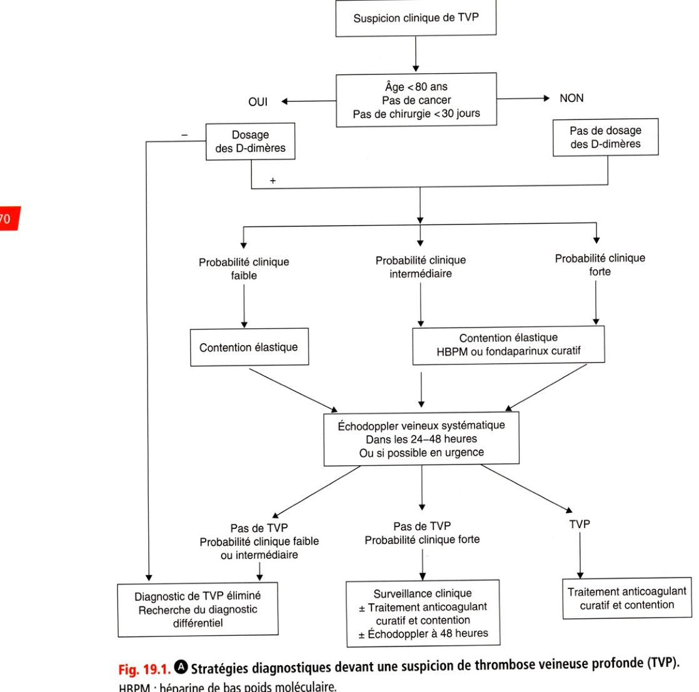
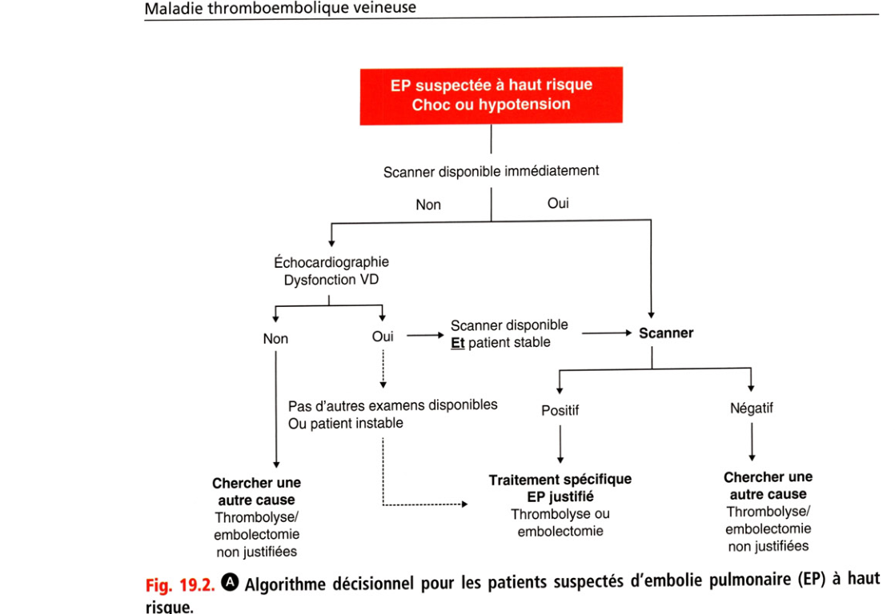
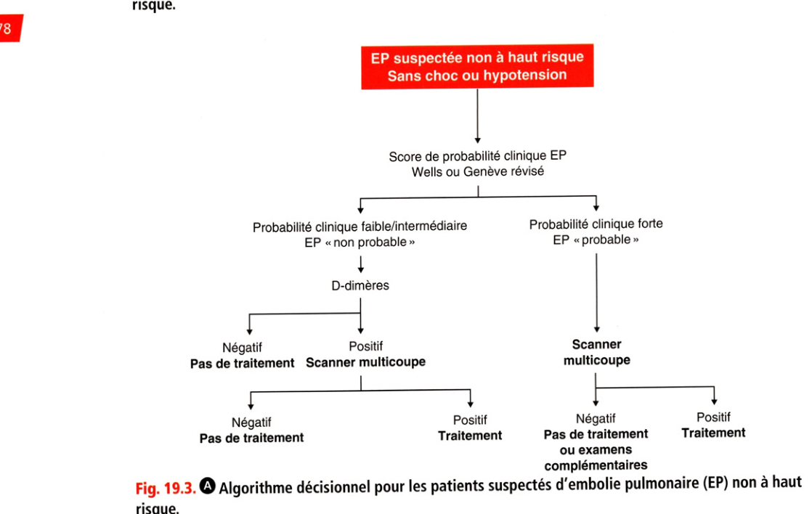
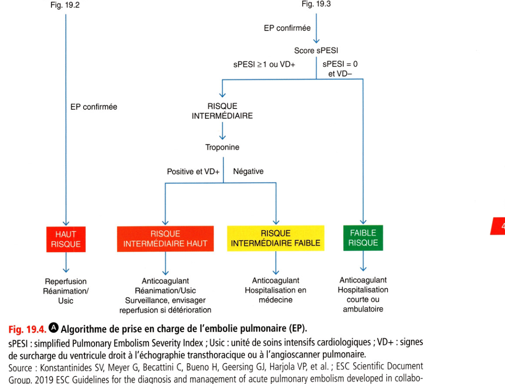

# Item 226 — Thrombose veineuse profonde et embolie pulmonaire

> **Collège CNEC / SFC** · 3e édition (2025) · p. 463–496 · R2C  
> Partie V — Maladie thromboembolique veineuse

---

## Trois repères à ne pas confondre

| Badge | Signification (R2C) |
|---|---|
| **Rang A** | Connaissances fondamentales de fin de 2e cycle |
| **Rang B** | Connaissances essentielles, plus spécialisées |
| **Rang C** | Connaissances de 3e cycle (DES) |

Les pastilles du livre (● = A, ■ = B) sont reprises inline.

---

## Situations de départ

160 Détresse respiratoire aiguë.  
161 Douleur thoracique.  
162 Dyspnée.  
257 Œdèmes des membres inférieurs localisés ou généralisés.  
350 Grosse jambe rouge aiguë.

---

## Hiérarchisation des connaissances

| Rang | Rubrique | Intitulé | Descriptif |
|---|---|---|---|
| **A** | Définition | TVP / EP | TVP proximale vs distale ; EP ; EP à haut risque |
| **A** | Étiologie | Facteurs de MTEV | Circonstances, facteurs temporaires et persistants |
| **B** | Physiopathologie | MTEV | Triade de Virchow, formes familiales |
| **A** | Diagnostic positif | Stratégie MTEV | Clinique, scores, paraclinique, diagnostics différentiels |
| **A** | Identifier une urgence | EP à haut risque | Choc / hypotension : démarche diagnostique |
| **A** | Diagnostic positif | D-dimères | Indications TVP/EP ; seuil ajusté à l'âge dans l'EP |
| **A** | Examens complémentaires | Échodoppler veineux | Place et limites (TVP, EP) |
| **A** | Examens complémentaires | Imagerie de l'EP | Angio-TDM, scintigraphie V/Q, ETT |
| **A** | Prise en charge | Gravité / ambulatoire | Signes de gravité ; patients éligibles à une PEC ambulatoire |
| **A** | Prise en charge | Traitement initial | Principes du traitement d'une TVP/EP non grave |
| **A** | Prise en charge | Compression élastique | Indications et contre-indications (TVP des MI) |
| **A** | Prise en charge | Contraception | Contraceptions contre-indiquées après MTEV |
| **A** | Prise en charge | Prévention | Situations nécessitant une prévention de la MTEV |
| **B** | Prise en charge | Durée d'anticoagulation | TVP proximale, EP |
| **B** | Étiologies | Cancer occulte | Indication d'une recherche de cancer |
| **B** | Suivi / pronostic | Complications tardives | Syndrome post-thrombotique, HTAP |
| **B** | Suivi / pronostic | Avant arrêt de l'AC | Complication à dépister avant d'arrêter un anticoagulant pour EP |
| **A** | Prise en charge | TV superficielle | Principes de prise en charge |

---

## Parcours Rang A

- [I. Définitions](#i-définitions)
- [II. Épidémiologie](#ii-épidémiologie)
- [III. Facteurs prédisposants](#iii-facteurs-prédisposants)
- [IV. Physiopathologie](#iv-physiopathologie)
- [V. Histoire naturelle](#v-histoire-naturelle)
- [VI. Thrombose veineuse profonde](#vi-thrombose-veineuse-profonde)
- [VII. Embolie pulmonaire](#vii-embolie-pulmonaire)
- [VIII. Traitement curatif](#viii-traitement-curatif)
- [IX. Traitement préventif](#ix-traitement-préventif)

---

## Sommaire

- [Vignette clinique](#vignette-clinique)
- [I. Définitions](#i-définitions)
- [II. Épidémiologie](#ii-épidémiologie)
- [III. Facteurs prédisposants](#iii-facteurs-prédisposants)
- [IV. Physiopathologie](#iv-physiopathologie)
- [V. Histoire naturelle](#v-histoire-naturelle)
- [VI. Thrombose veineuse profonde](#vi-thrombose-veineuse-profonde)
- [VII. Embolie pulmonaire](#vii-embolie-pulmonaire)
- [VIII. Traitement curatif](#viii-traitement-curatif)
- [IX. Traitement préventif](#ix-traitement-préventif)
- [Points](#points)
- [Notions indispensables et inacceptables](#notions-indispensables-et-inacceptables)
- [Réflexes transversalité](#réflexes-transversalité)
- [Entraînement](../../Entrainement/QI/226_TVP_embolie_pulmonaire.md)

---

## Vignette clinique

Mme E., 68 ans, consulte aux urgences pour une dyspnée apparue depuis 1 semaine de manière assez brutale. Elle revient d'un voyage à la Réunion. Elle n'a pas d'antécédent particulier et ne prend aucun médicament. L'examen clinique retrouve une pression artérielle à 110/90 mmHg, une fréquence cardiaque à 100/min, l'auscultation cardiopulmonaire est normale. Il n'y a pas de signes de thrombose veineuse profonde. L'ECG montre une tachycardie sinusale et des ondes T inversées en V2V3.

> Quelle est la probabilité d'embolie pulmonaire devant ce tableau clinique ?

> Comment confirmez-vous le diagnostic ?

> Quel bilan biologique demandez-vous ?

> Quelle est la place de l'échodoppler veineux et de l'échocardiographie chez cette patiente ?

> Quels diagnostics différentiels évoquer ?

> Quelle prise en charge thérapeutique envisagez-vous et dans quel délai ?

> Quel bilan étiologique envisagez-vous ?

> Quelle durée d'anticoagulation et quel suivi proposez-vous à cette patiente ?

# I. Définitions

**Rang A.**

**Rang A.** La thrombose veineuse profonde (TVP) et l'embolie pulmonaire (EP) sont deux présentations cliniques de la maladie thromboembolique veineuse (MTEV) et ont les mêmes facteurs prédisposants.

• La TVP est définie comme l'obstruction thrombotique d'un tronc veineux profond localisé le plus souvent au niveau des membres inférieurs : on distingue les TVP proximales (veine poplitée, fémorale, iliaque ou cave), et les TVP distales (veines jambières : tibiale postérieure et fibulaire, veines surales : veine soléaire et gastrocnémienne). Le risque d'EP est beaucoup plus important en cas de TVP proximale que distale.

• L'EP est la conséquence de l'obstruction des artères pulmonaires ou de leurs branches par des thrombi et est le plus souvent secondaire à une TVP (70 %). Environ 50 % des patients ayant une TVP proximale ont aussi une EP sur l'angioscanner pulmonaire mais cliniquement asymptomatique. L'objectif de la prise en charge de la TVP est de prévenir ses complications dont les plus redoutées sont :

• l'EP (complication précoce) ;

• et le syndrome post-thrombotique (SPT) (complication tardive). L'objectif de la prise en charge de l'EP est de diminuer la mortalité et la morbidité, le risque d'évolution vers le cœur pulmonaire postembolique et le risque de récidives.

---

# II. Épidémiologie

**Rang A.** L’incidence réelle de la MTEV est difficile à évaluer étant donné la difficulté diagnostique, mais une étude récente francobritannique rapportait une incidence de MTEV et d'EP respectivement à 1,83 et 0,60/1 000/an (= 100 000 cas/an en France). L'EP serait la 3e cause de décès après les maladies cardiovasculaires et le cancer (5 000 à 10 000 décès/an en France). Dans les études d'autopsie, la prévalence de la MTEV est de 20 à 40 % et serait stable dans le temps malgré la réduction des TVP postopératoires, grâce aux mesures prophylactiques. Ceci serait lié à l'augmentation de l'espérance de vie et aux polypathologies.

---

# III. Facteurs prédisposants

**Rang A.**

**Rang A.** Les différents facteurs de risque de TVP sont listés dans l'encadré 19.1 :

• facteurs de risque transitoires - la maladie veineuse thromboembolique est dite provoquée : la TV peut survenir dans un contexte hospitalier postopératoire, obstétrical ou médical. Une TVP est plus fréquente en postopératoire de chirurgie orthopédique que de chirurgie générale. Le risque de MTEV postopératoire est élevé pendant les 2 semaines postopératoires mais reste haut pendant 2 à 3 mois ;

• facteurs de risque persistants - la MTEV est dite non provoquée : ils sont propres au patient (cliniques ou biologiques, et en particulier certaines prédispositions génétiques) et peuvent favoriser le développement de la TV de façon spontanée ou à l'occasion d'une situation thrombogène.

**Encadré 19.1 — Principaux facteurs prédisposants de MTEV**

**Facteurs temporaires majeurs**

- Chirurgie avec anesthésie générale > 30 minutes dans les 3 derniers mois

- Fracture des membres inférieurs dans les 3 derniers mois

- Immobilisation > 3 jours pour motif médical aigu dans les 3 derniers mois

- Contraception œstroprogestative, grossesse, post-partum, traitement hormonal de la ménopause

**Facteurs temporaires mineurs**

- Chirurgie avec anesthésie générale < 30 minutes dans les 2 derniers mois

- Traumatisme d'un membre inférieur non plâtré avec mobilité réduite > 3 jours

- Immobilisation < 3 jours pour motif médical aigu dans les 2 derniers mois

- Voyage > 6 heures

**Facteurs permanents**

- Cancer actif

- Maladies inflammatoires chroniques digestives ou articulaires (Crohn, rectocolite hémorragique)

Le niveau de risque thromboembolique doit tenir compte à la fois de l'existence de facteurs de risque liés au patient et du contexte de survenue, ce qui conditionne la durée du traitement.

---

# IV. Physiopathologie

**Rang A** · **Rang B.**

## A. Mécanisme de formation du thrombus

**Rang B.** Il s'agit de la triade décrite par Virchow : stase veineuse, lésions pariétales, anomalies de l'hémostase. Le point de départ du thrombus est le plus souvent distal et se situe dans des zones de ralentissement du flux (veines soléaires, valvules, abouchement de collatérales). Il évolue vers une aggravation de l'obstruction et/ou une extension avec une migration embolique possible, ou vers une lyse spontanée qui peut survenir lorsque le thrombus est peu volumineux et que le facteur étiologique disparaît rapidement. Sous l'effet du traitement, une recanalisation progressive est la règle avec séquelles possibles (thrombus résiduel, épaississement pariétal, lésions valvulaires avec reflux veineux profond).

## B. Migration embolique dans la circulation artérielle

• La première conséquence d'une EP aiguë est hémodynamique avec apparition de symptômes quand 30-50 % du lit artériel pulmonaire sont occlus. Une augmentation rapide des résistances artérielles pulmonaires se produit, pouvant aboutir à une mort subite, à une hypertension artérielle pulmonaire (HTAP) et à une surcharge brutale en pression des cavités droites qui se dilatent (cœur pulmonaire aigu). Un septum paradoxal avec baisse du débit cardiaque systémique peut entraîner une dysfonction systolique ventriculaire gauche. En l'absence de dysfonction du VD, une stimulation du système sympathique permet une augmentation des pressions artérielles pulmonaires pour restaurer un flux pulmonaire. En parallèle, une vasoconstriction systémique permet de stabiliser la PA. Ceci est important car une diminution de la PA systémique peut altérer le débit coronarien et la fonction VG.

• Une deuxième phase hémodynamique peut se produire dans les 24-48 heures, par embolies récurrentes et/ou aggravation de la dysfonction du VD. En parallèle, une augmentation de la demande en oxygène du myocarde du VD et une baisse de la perfusion coronarienne droite peuvent provoquer une ischémie du VD. Ces mécanismes associés entraînent une dysfonction VD pouvant aboutir à une issue fatale. Une pathologie cardiovasculaire préexistante peut diminuer l'efficacité des mécanismes compensateurs et altérer le pronostic. L'insuffisance respiratoire est la conséquence des anomalies hémodynamiques. Plusieurs éléments induisent une hypoxie : modification du rapport ventilation/perfusion avec effet shunt, baisse du débit cardiaque systémique, plus rarement shunt droite-gauche par un foramen ovale perméable aggravant l'hypoxie. Les embolies distales et petites peuvent, sans altérer l'hémodynamique, provoquer des hémorragies intra-alvéolaires responsables d'hémoptysies, d'épanchement pleural, voire d'infarctus pulmonaire.

---

# V. Histoire naturelle

**Rang A.**

**Rang A.** Elle est liée principalement au contexte étiologique et à la localisation. On distingue les TVP :

• selon leur localisation distale (sous-poplitée) ou proximale (sus-poplitée) ;

• selon leur expression clinique (asymptomatique, TVP ou EP symptomatique, SPT). Les TVP distales asymptomatiques, qui surviennent en postopératoire, sont plus fréquentes après chirurgie orthopédique qu'après chirurgie générale. Elles s'étendent dans 20 % des cas aux veines proximales, s'exprimant rarement sur le plan veineux ou pulmonaire. On ne connaît pas l'évolution des TVP distales asymptomatiques apparemment primaires. Les TVP distales symptomatiques donneraient une récidive dans 30 % des cas en l'absence de traitement et dans 9 % à 3 mois après 6 semaines d'anticoagulation.

**Rang A.** Bien que leur traitement et leur détection fassent l'objet de discussion, il est recommandé de faire une anticoagulation dès lors qu'elles sont mises en évidence. Les TVP proximales symptomatiques ont un risque évolutif extrême nécessitant une anticoagulation précoce et adéquate. L'incidence du SPT est actuellement en diminution grâce à une meilleure prise en charge thérapeutique avec un délai d'apparition plus précoce, en moyenne dans les 2 premières années. La contention veineuse, instaurée dès la phase initiale de la TVP et pendant au moins 3 mois, réduit de 50 % le risque de SPT. L'EP arrive dans les 3 à 7 jours suivant le début d'une TVP. Elle peut être mortelle dès la 1re heure de début dans 10 % des cas. Une EP avec choc ou hypotension survient dans 5-10 % des cas et, dans 50 % des cas, l'EP s'accompagne des signes biologiques ou échographiques de gravité. Après une EP, deux tiers des patients ont une reperfusion pulmonaire complète. La plupart des décès (> 90 %) se produisent car le diagnostic de MTEV n'a pas été porté. Une hypertension pulmonaire chronique postembolique survient chez 0,5-5 % des patients traités.

**Rang A.** Une récidive se manifeste souvent de la même façon que le premier épisode (TVP ou EP). Elle est plus fréquente dans le cadre de MTEV non provoquée. En l'absence d'anticoagulation, 50 % des patients ayant une MTEV symptomatique récidivent dans les 3 mois. La récidive survient à 1 an dans 9 % des cas de MTEV non provoquée versus 3 % en cas de MTEV provoquée.

---

# VI. Thrombose veineuse profonde

**Rang A** · **Rang B.**

## A. Diagnostic clinique

La clinique seule (interrogatoire, examen clinique et recherche de contexte thrombogène) n'a qu'une valeur d'orientation et ne permet pas de confirmer le diagnostic. Les signes évocateurs sont :

• une douleur spontanée ou provoquée du membre inférieur (Ml) ;

• un œdème unilatéral de la jambe ou de l'ensemble du MI, d'autant plus étendu que la TV est proximale (avec une différence de circonférence > 3 cm avec le MI controlatéral) ;

• des signes inflammatoires ;

• une dilatation des veines superficielles. Le tableau clinique le plus évocateur de TVP des membres inférieurs est la classique phlegmatia alba dolens avec une atteinte typiquement unilatérale ou asymétrique et plus évocatrice lorsque la survenue est brutale. Mais la TVP peut être totalement asymptomatique et découverte dans le bilan d'une EP.

## B. Diagnostic clinique différentiel

Lorsque les signes sont dissociés, le diagnostic de différentes affections peut être évoqué :

• lésion musculaire ou tendineuse (traumatisme, claquage musculaire) ;

• affection ostéoarticulaire (kyste synovial) ;

• SPT, insuffisance veineuse primaire (superficielle ou profonde) ;

• affection neurologique (sciatique), compression extrinsèque (adénopathies, tumeur, utérus gravide, etc.) ;

• érysipèle, lymphangite, cellulite ;

• lymphœdème ;

• insuffisance cardiaque droite ou rénale ou hépatique.

## C. Scores de probabilité clinique

Le score de Wells est un score clinique établi pour les patients hospitalisés ou ambulatoires, et qui permet de classer l'épisode en probabilité clinique faible (3 %), intermédiaire (17 %) ou forte (75 %) de TVP (tableau 19.1). L'analyse est faite a priori avant les tests paracliniques et permet de renforcer la valeur de ces tests lorsqu'elle va dans le même sens.

**Tableau 19.1.** Score de Wells simplifié — probabilité clinique de TVP.

| Variable | Points |

|---|---|

| Parésie, paralysie ou immobilisation plâtrée récente d'un MI | 1 |

| Chirurgie récente < 4 semaines ou alitement récent > 3 jours | 1 |

| Cancer évolutif connu (traitement en cours ou < 6 mois ou palliatif) | 1 |

| Antécédent de TVP (ou d'EP) | 1 |

| Sensibilité le long du trajet veineux profond | 1 |

| Œdème généralisé du MI | 1 |

| Œdème du mollet > 3 cm vs controlatéral (10 cm sous la TTA) | 1 |

| Œdème unilatéral prenant le godet | 1 |

| Circulation collatérale superficielle non variqueuse | 1 |

| Diagnostic différentiel au moins aussi probable que la TVP | −2 |

Interprétation en 3 niveaux : **faible** (0), **intermédiaire** (1 ou 2), **forte** (≥ 3).

## D. Diagnostic paraclinique

Il est essentiel. Le diagnostic de TVP doit reposer sur une méthode objective. Parmi les tests utilisés pour le diagnostic, le dosage biologique des D-dimères et l'échodoppler veineux occupent une place privilégiée. La phlébographie n'est plus utilisée. Le phléboscanner associé à l'angioscanner pulmonaire a été étudié pour rechercher une TVP lors d'une suspicion d' EP

### 1. D-dimères

Ce sont des produits de dégradation spécifiques de la fibrine, issus de la formation puis de la lyse d'un thrombus évolutif. Ils sont dosés soit par méthode enzyme-linked immunosorbent assay (Elisa), soit par méthode au latex. La méthode Elisa est la plus efficace (sensibilité

> 95 %) ; en cas de test négatif, le risque d'erreur est inférieur à 5 % (valeur prédictive négative > 95 %). De façon générale, la spécificité est faible car les D-dimères sont aussi élevés dans des états autres que la TVP : âge avancé, inflammation, cancer, traumatisme, hématome, période postopératoire, grossesse, post-partum, etc. Au total, le dosage des D-dimères est utile à l'élimination du diagnostic de TVP à la condition d'utiliser un test Elisa rapide (seuil < 500 ng/mL). Si le test est positif, il faut avoir recours à l'échodoppler veineux pour confirmer le diagnostic de TVP et localiser le thrombus. Selon les recommandations françaises, il faut tenir compte du niveau de probabilité clinique pour demander et interpréter le dosage des D-dimères. Il est préconisé d'utiliser une technique de dosage quantitative des D-dimères très sensible et validée.

### 2. Échodoppler veineux des membres inférieurs

C'est l'examen de 1re intention pour confirmer ou infirmer le diagnostic de TVP avec d'excellentes sensibilité et spécificité (> 95 %). Il permet une exploration à la fois morphologique et hémodynamique grâce respectivement à l'échographie et au doppler. L'axe veineux est observé en coupe transversale, puis longitudinale, sous compression : veine cave inférieure jusqu'aux veines distales, système profond et superficiel. Le doppler complète l'examen, en particulier aux confluents veineux (fémoro-iliaque, poplité). Le doppler couleur peut être utilisé pour explorer certains territoires veineux de repérage difficile. Les critères d'une veine normale sont :

• l'absence de matériel endoluminal ;

• la possibilité de la comprimer avec la sonde ;

• la perception d'un signal doppler rythmé par la respiration et augmenté par la chasse veineuse manuelle. Les critères de TVP sont variables :

• l'image directe du thrombus est un signe très fréquent et spécifique ;

• l'incompressibilité de la veine à la pression sous la sonde, comme seul signe de thrombose, est recherchée par certaines équipes et limitée aux seuls axes fémoral et poplité, afin de rendre l'examen plus rapide et plus facile ;

• les modifications du signal doppler recherchées sont une diminution ou une abolition du signal spontané ou provoqué lors des manœuvres dynamiques ;

• en doppler couleur, il est noté un remplissage partiel ou une absence de remplissage au sein du thrombus. D'autres signes indirects de la présence du thrombus sont décrits et intéressent le calibre veineux, la cinétique de la paroi veineuse et des valvules, l'existence de circulation collatérale. Les limites de l'examen sont liées à des exigences d'appareillage (haute résolution et sonde adaptée à la profondeur de la zone examinée), d'opérateur (expérimenté) et de conditions techniques optimales (absence de contractions musculaires).

### 3. Autres examens

• La phlébographie des MI n'est actuellement plus utilisée. Elle est obtenue après injection de 60 mL de produit iodé dans une veine dorsale de chacun des pieds. Un garrot est placé à la cheville et à la cuisse pour opacifier le réseau veineux profond. Les critères de TVP sont la lacune (image radioclaire) et l'arrêt en cupule. L'absence de segment veineux principal et la présence d'une circulation collatérale ne sont pas spécifiques. La nécessité d'une injection de produit de contraste en limite les indications. Il s'agit d'un examen coûteux et peu confortable, dont il faut respecter les contre-indications.

• L'angioscanner peut compléter l'échodoppler, au niveau abdominopelvien, quand celui-ci ne permet pas de conclure.

## E. Stratégies diagnostiques

**Rang A.** Elles reposent sur le score de probabilité clinique, le dosage des D-dimères et l'échodoppler veineux des membres inférieurs (fig. 19.1). Suspicion clinique de TVP Âge < 80 ans Pas de cancer Pas de chirurgie <30 jours ♦ NON oui Pas de dosage des D-dimères Dosage des D-dimères Probabilité clinique forte Probabilité clinique intermédiaire Probabilité clinique faible Contention élastique HBPM ou fondaparinux curatif Contention élastique TVP

**Fig. 19.1.** Stratégies diagnostiques devant une suspicion de TVP

## F. Diagnostic étiologique

### 1. Recherche d'un facteur déclenchant transitoire

Les facteurs reconnus comme transitoires et qui interviennent dans le choix de la durée du traitement sont :

• une chirurgie ou une fracture des membres inférieurs dans les 3 mois ;

• une immobilisation prolongée au-delà de 3 jours. Dans ces cas, la TVP est dite provoquée. En l'absence de ces facteurs, la TVP est dite non provoquée, et un bilan à visée étiologique doit être réalisé.

### 2. Recherche d'une thrombophilie (facteur biologique de risque)1

**Rang B.** Les indications du bilan de thrombophilie ont été récemment définies :

• il est recommandé de ne pas réaliser de bilan de thrombophilie constitutionnelle systématique après un premier épisode de MTEV ;

• il est recommandé de ne pas réaliser de bilan de thrombophilie constitutionnelle chez les patients ayant un premier épisode de TVP proximale ou d'EP après 50 ans, que la thrombose soit provoquée ou non ;

• il est suggéré de réaliser un bilan de thrombophilie constitutionnelle : chez les patients ayant un premier épisode de TVP proximale ou d'EP, non provoqué, avant l'âge de 50 ans et avec un antécédent familial au 1er degré de thromboses, chez les patients avec un événement thromboembolique veineux récidivant (> un épisode de TVP proximale ou d'EP et

> un épisode non provoqué, avant 50 ans), chez les patients ayant une thrombose veineuse non provoquée dans des sites atypiques (splanchnique, membre supérieur, cérébrale) ;

• dans les autres situations, compte tenu de la complexité d'analyse des dossiers et des conséquences thérapeutiques éventuelles, il est suggéré d'avoir un avis d'un centre expert en thrombose multidisciplinaire ;

• lorsqu'un bilan de thrombophilie constitutionnelle est indiqué, il est suggéré de rechercher, dans un laboratoire spécialisé, les anomalies suivantes : déficits en AT (antithrombine), PC, PS (protéines C et S), mutations Leiden du FV et G20210A du Fil, entre le 3e et le 6e mois après le diagnostic de thrombose ;

• & en cas de déficit en inhibiteur (AT, PC, PS), il est suggéré de déterminer le phénotype de manière précise, voire le génotype ;

• **Rang B.** il est suggéré de rechercher une thrombophilie constitutionnelle chez des apparentés asymptomatiques en cas de thrombophilie constitutionnelle sévère chez le propositus (déficit en AT, PC, PS, double hétérozygote et homozygote FV et Fil) ;

• lorsqu'un bilan de thrombophilie constitutionnelle est indiqué chez les apparentés asymptomatiques, il est recommandé d'adresser le sujet dans un centre expert en thrombose agréé ;

• lorsqu'un bilan de thrombophilie constitutionnelle est indiqué chez les apparentés asymptomatiques, il est suggéré de le limiter en première intention à l'anomalie identifiée chez le propositus (AT, PC, PS ou double hétérozygote ou homozygote FV Leiden et Fil G2O21OA). Si l'anomalie est retrouvée, il est proposé de réaliser un bilan de thrombophilie complet. Les facteurs recherchés sont : - les thrombophilies constitutionnelles (mutation du FV ou FV Leiden ou résistance à la PC activée, mutation du Fil ou Fil Leiden, déficit en PC ou PS ou en AT), © Sanchez O, Benhamou Y, Bertoletti L, Constant J, Couturaud F, Delluc A, et al. Recommandations de bonne pratique pour la prise en charge de la maladie veineuse thromboembolique chez l'adulte. Version courte. Rev Mal Respir 2019 ; 36 : 249-83. Elsevier Masson SAS. Tous droits réservés. - les thrombophilies acquises (SAPL - syndrome des antiphospholipides : anticoagulants circulants, Ac [anticorps] anticardiolipines isotype IgG et IgM (immunoglobulines G et M), Ac anti-B2GP1 isotypes IgG et IgM).

**Rang B.** Il est recommandé de faire le bilan de thrombophilie à distance de la phase initiale de la thrombose, de préférence à 3-6 mois de l'épisode et après arrêt 72 heures du traitement par AOD.

**Rang A.** Si le patient est sous héparine, le dosage de l'antithrombine est perturbé, de même que la recherche d'anticoagulant lupique. Les dosages de la PC et de la PS sont modifiés par le traitement AVK. Le FVIII est perturbé par l'inflammation. Les oestrogènes et la grossesse modifient l'antithrombine, le FVIII, la PS et la RPCA (résistance à la protéine C activée). Les AOD modifient les anticoagulants circulants, les déficits en inhibiteurs.

### 3. Recherche d'une néoplasie

**Rang B.** L'incidence de cancer varie entre 6 et 28 %, mais le risque est réel comparativement à l'incidence de cancer dans la population générale. L'incidence est significativement plus élevée chez les patients ayant une TVP idiopathique ou récidivante et serait plus importante dans les 6 à 12 premiers mois. L'utilité de la découverte d'un cancer occulte, en termes de survie et surtout de qualité de vie, n'est pas connue, de même que l'ampleur du bilan nécessaire à instaurer pour le dépistage. Une recherche de cancer est réalisée, surtout chez les sujets de plus de 40 ans, ou en cas de bilan de thrombophilie négatif : dosage du PSA (antigène spécifique de prostate) chez l'homme, examen gynécologique avec mammographie et échographie pelvienne chez la femme. Une recherche de sang dans les selles et une radiographie du thorax sont effectuées dans les deux sexes. Les endoscopies digestives, l'échographie abdominopelvienne et le bodyscanner ne sont pas systématiques mais utiles s'il existe des signes d'orientation clinique. Une surveillance clinique répétée sur au moins 1 an est indispensable.

## G. Formes particulières

### 1. En fonction de la localisation

TVP distales

**Rang A.** Si une TVP distale est diagnostiquée, elle doit être prise en charge comme une TVP proximale. Thromboses veineuses superficielles

**Rang B.** Elles siègent habituellement sur le trajet de la grande veine saphène, et sont caractérisées par une douleur spontanée ou provoquée sur le trajet veineux, une rougeur et une inflammation, une sensation de cordon induré. L'échodoppler permet de confirmer le diagnostic, de préciser la localisation, de vérifier l'extension au réseau veineux profond (TVP associée dans 1 0 % des cas) et de décrire l'aspect variqueux ou non du réseau superficiel. Une TV superficielle sur veines apparemment saines non variqueuses doit faire rechercher une cause systémique : cancer, maladie de Buerger, maladie de Behçet, maladies hématologiques, pathologie auto-immune, thrombophilie constitutionnelle ou acquise. TVP pelviennes (utéro-ovariennes, hypogastriques)

**Rang A.** Elles donnent des signes urinaires, utérovaginaux, digestifs (douleurs abdominales, masse sensible du flanc, iléus) ou un tableau fébrile, voire septique. Le diagnostic est orienté par le contexte de survenue : intervention sur le petit bassin (prostatectomie, hystérectomie), grossesse ou post-partum. Thrombose de la veine cave inférieure Typiquement, elle donne des signes bilatéraux d'emblée ou par alternance. Les signes peuvent être unilatéraux et la thrombose cave découverte uniquement aux explorations. Il faut rechercher dans ce contexte une malformation veineuse congénitale. L'atteinte de la veine cave inférieure sus-rénale est rencontrée dans les thromboses néoplasiques par extension à partir de la veine rénale d'un cancer du rein. Cette localisation justifie l'hospitalisation du patient pour surveillance initiale hospitalière.

### 2. En fonction des circonstances de survenue

Au cours de la grossesse Les signes cliniques sont difficiles à interpréter du fait de la stase veineuse induite par la grossesse. Le diagnostic par échodoppler est le test habituellement utilisé et le plus souvent suffisant pour le diagnostic. Il peut être gêné au niveau iliocave. Toutes les anomalies de l'hémostase peuvent être rencontrées et justifient la pratique systématique d'un bilan de thrombophilie chez toute femme en âge de procréer ayant des antécédents personnels ou familiaux de MTEV, pour avis sur une contraception demandée ou un désir de grossesse. En cas de cancer Une thrombose veineuse survenant dans un contexte néoplasique témoigne de l'activité de la maladie et doit être traitée par les HBPM au long cours.

### 3. En fonction de la sévérité

La phlébite bleue ou plegmatia cearulea est très rare mais plus grave car elle associe des signes d'ischémie à la douleur et à l'œdème, une cyanose et parfois un état de choc. L'ischémie est liée à l'importance de l'obstruction et à l'étendue de la TV, mais aussi à l'œdème compressif et au spasme.

## H. Évolution et complications

**Rang B.** Le pronostic fonctionnel et le pronostic vital sont liés au terrain (cancer) avec ses risques thromboemboliques et hémorragiques, ainsi qu'à la sévérité de la TVP. La TVP peut évoluer :

• favorablement sans séquelle : le plus souvent, si le traitement est bien conduit ;

• vers un risque de récidive : toujours présent et d'autant plus important que le facteur favorisant est permanent. Il justifie un traitement préventif lorsque des circonstances favorisantes se représentent ;

• vers un syndrome post-thrombotique veineux : - en rapport avec des anomalies anatomiques ou hémodynamiques séquellaires, - apparaissant quelques mois ou années après une TVP, - avec manifestations cliniques de sévérité variable : lourdeur de jambe, dilatations veineuses superficielles, œdème de cheville, troubles trophiques sans ulcère (hypodermite, dermite ocre, atrophie blanche), ulcères sus-malléolaires spontanés ou provoqués, claudication veineuse de cuisse exceptionnelle, - de diagnostic paraclinique dont le but est de rattacher les signes cliniques au SPT et d'en noter le degré de sévérité. L'échodoppler veineux est le meilleur examen et permet de détecter l'obstruction et le reflux veineux ;

• vers une embolie pulmonaire (cf. VIL Embolie pulmonaire).

---

# VII. Embolie pulmonaire

**Rang A** · **Rang B.**

## A. Diagnostic clinique et examens standards

### 1. Signes et symptômes

**Rang A.** Ils ne sont pas spécifiques.

• Dans 90 % des cas, l'EP est suspectée devant une dyspnée, une douleur thoracique ou une syncope, signes qui peuvent être plus ou moins associés : - la dyspnée peut être brutale ou d'apparition progressive sur plusieurs semaines, ou encore peut aggraver une dyspnée chronique sur une maladie cardiorespiratoire préexistante ; - la douleur thoracique est typiquement une douleur pleurale de type point de côté brutal mais peut revêtir des aspects trompeurs. Une douleur thoracique prolongée peut être secondaire à l'irritation pleurale lors des embolies distales ; - la syncope est rare mais témoigne d'une réduction sévère du flux sanguin systémique ; - l'EP peut aussi s'accompagner de crachats hémoptoïques rapportés à la constitution d'un infarctus pulmonaire ; - enfin, il n'est pas rare qu'elle soit asymptomatique.

• Concernant le contexte, une recherche des facteurs prédisposants, cités ci-dessus, est capitale. Cependant, 20 à 30 % des EP sont spontanées ou idiopathiques.

• L'examen clinique recherche une tachycardie et des signes de retentissement hémodynamique (hypotension artérielle, signes d'insuffisance cardiaque droite). La recherche de signes cliniques en faveur d'une thrombose veineuse associée est importante, bien que souvent négative.

### 2. Radiographie du thorax

Elle est habituellement anormale mais les signes radiographiques retrouvés sont aspécifiques (atélectasies en bande, épanchement pleural, élévation d'une coupole diaphragmatique, opacité triangulaire à base pleurale correspondant à un infarctus pulmonaire, élargissement des artères pulmonaires). Elle permet aussi d'éliminer une autre cause de dyspnée. Une radiographie du thorax normale n'élimine pas le diagnostic d’EP.

### 3. Gazométrie artérielle

Elle retrouve généralement une hypoxémie-hypocapnie, liée à un effet shunt paradoxal : au départ effet espace mort (zones ventilées non perfusées), puis baisse de la ventilation dans les zones de l'embolie et redistribution de la perfusion dans les zones saines avec baisse du rapport ventilation/perfusion expliquant l'hypoxémie. L'hypocapnie est liée à l'hyperventilation. La gazométrie peut être normale dans 20 % des cas. Elle n'est quasiment plus pratiquée sauf en cas de saturation inférieure à 90 % en air ambiant.

### 4. ECG

Il peut être normal ou montrer simplement une tachycardie sinusale. Il peut aussi retrouver des signes de souffrance VD : un aspect S1Q3 (onde S en D1 et onde Q en D3) correspondant à la déviation axiale droite, un BBD complet ou incomplet, une arythmie supraventriculaire, voire une inversion des ondes T de V1 à V4 témoin de l'ischémie du VD et pouvant orienter à tort vers un SCA. En résumé Les signes cliniques et les examens de routine sont insuffisants pour confirmer ou exclure une EP, mais ils précisent nettement le degré de suspicion.

## B. Scores de probabilité clinique

Deux scores de probabilité clinique sont utilisés en pratique courante : le score de Wells et le score révisé de Genève (tableau 19.2) : ils permettent d'accéder en urgence à une estimation sur la probabilité du diagnostic d'EP avant tout examen paraclinique plus complexe. La probabilité d'avoir une EP lorsque la suspicion est faible est de 10 %, de 30 % pour une suspicion modérée et de 65 % pour une suspicion forte.

**Tableau 19.2.** Scores de probabilité clinique d'EP : Genève révisé et Wells simplifié.

| Score révisé de Genève | Pts | Score de Wells simplifié | Pts |

|---|---|---|---|

| Âge > 65 ans | 1 | ATCD de TVP ou d'EP | 1 |

| ATCD de TVP ou d'EP | 1 | Chirurgie ou immobilisation < 4 semaines | 1 |

| Chirurgie récente ou fracture dans le mois | 1 | Néoplasie active | 1 |

| Cancer actif | 1 | Hémoptysie | 1 |

| Hémoptysie | 1 | FC > 100 bpm | 1 |

| Douleur unilatérale du MI | 1 | Signes cliniques de TVP | 1 |

| FC 75–94 bpm | 1 | Diagnostic différentiel peu probable | 1 |

| FC ≥ 95 bpm | 2 | | |

| Douleur à la palpation du MI (trajet veineux) et œdème unilatéral | 1 | | |

**Genève (3 niveaux)** : faible 0–1 (~10 %) · intermédiaire 2–4 (~30–40 %) · forte ≥ 5 (~60 %).  

**Genève (2 niveaux)** : peu probable 0–2 · probable ≥ 3.  

**Wells simplifié (2 niveaux)** : peu probable 0–1 · probable ≥ 2.

## C. Diagnostic paraclinique

### 1. D-dimères (cf. VI. Thrombose veineuse profonde)

Les D-dimères sont les produits de dégradation de la fibrine. Le taux sanguin de D-dimères témoigne, s'il est élevé, de la présence d'un caillot aigu du fait de l'activation simultanée de la coagulation et de la fibrinolyse. Un taux de D-dimères normal rend très peu probable le diagnostic de MTEV (valeur prédictive négative forte). En parallèle, les D-dimères sont très spécifiques de la fibrine qui peut être élevée dans plusieurs circonstances cliniques (âge, cancer, inflammation, infection, nécrose, dissection aortique, grossesse = valeur prédictive positive faible). Ainsi, les D-dimères sont intéressants pour exclure une MTEV, mais pas pour confirmer sa présence. Les tests de dosages sont nombreux : le test Elisa a une sensibilité supérieure à 95 % et une spécificité de 40 %. La valeur seuil utilisée est habituellement de 500 µg/L. Un taux normal de D-dimères permet d'exclure une EP chez les patients avec une probabilité clinique faible ou intermédiaire. En cas de probabilité clinique forte, ils sont inutiles et il faut d'emblée demander un angioscanner pulmonaire. Selon les recommandations françaises et européennes de 2019, il est suggéré d'appliquer une valeur seuil des D-dimères adaptée à l'âge après 50 ans (âge x 10) lorsque la probabilité clinique est faible ou intermédiaire.

### 2. Angioscanner pulmonaire

Il est devenu l'examen le plus performant depuis l'avènement des scanners multibarrettes. La sensibilité est de 83 % et la spécificité supérieure à 90 % (4 barrettes). Un angioscanner pulmonaire multicoupe négatif permet d'exclure une EP chez des patients à probabilité faible et intermédiaire clinique. En présence d'une forte probabilité clinique et d'un scanner négatif, un autre examen comme une scintigraphie, voire une angiographie doit être réalisé. L'angiographie nécessite cependant une injection de produits iodés dont il faut respecter les contre-indications.

### 3. Autres examens

Si l'angioscanner ne peut être réalisé (indisponible ou contre-indications), les examens suivants peuvent contribuer au diagnostic. Échodoppler veineux (EDV) des membres inférieurs (cf. VI. Thrombose veineuse profonde) Dans 90 % des cas, l'origine de la TVP est au niveau des membres inférieurs. L'EDV a largement supplanté la phlébographie : il a une sensibilité supérieure à 90 % et une spécificité proche de 95 %. L'EDV des MI retrouve une TVP dans 30-50 % des EP. En cas de suspicion d'EP, la présence d'une TVP proximale est suffisante pour confirmer le diagnostic et débuter un traitement anticoagulant sans nécessité d'autres examens. En revanche, la découverte d'une TVP distale n'est pas suffisante pour le diagnostic et justifie le recours à d’autres examens. Enfin, un EDV des membres inférieurs normal ne permet pas d'éliminer le diagnostic d'EP. Outre l'intérêt diagnostique, l'EDV fait partie du bilan devant une EP pour évaluer le risque éventuel de récidive. Le phléboscanner couplé à l'angioscanner pulmonaire a été étudié mais le taux d'irradiation est trop élevé pour le réaliser en routine. Scintigraphie pulmonaire de ventilation-perfusion Le principe repose sur une injection de technétium 99mTc couplé à des macroagrégats de particules d'albumine qui se bloquent dans les capillaires pulmonaires et permettent d'apprécier la perfusion pulmonaire. Lors d'une obstruction artérielle, les particules n’arrivent pas jusqu'aux capillaires et on observe un défect de perfusion. En parallèle, un traceur radiomarqué est inhalé pour apprécier la ventilation pulmonaire. Lors d'une EP, il y a un défaut de perfusion avec une ventilation normale (discordance ou mismatch ventilation-perfusion). L'existence d'une pathologie cardiorespiratoire limite cet examen car elle peut perturber la ventilation pulmonaire. Le résultat d'une scintigraphie est donné en trois niveaux de probabilité : probabilité élevée, examen non diagnostique, examen normal. La combinaison d'une scintigraphie normale avec un score clinique faible permet d'exclure le diagnostic. Elle peut montrer des signes indirects de surcharge des cavités droites ou signes de « cœur pulmonaire aigu » : dilatation VD, septum paradoxal, hypokinésie VD, élévation des pressions pulmonaires. Beaucoup plus rarement, l'ETT peut révéler l'existence d'un thrombus dans les cavités droites, voire de manière exceptionnelle dans les gros troncs pulmonaires. L'ETT peut être faite au lit du patient. En cas de suspicion d'EP grave (avec choc ou hypotension artérielle), si l'angioscanner pulmonaire n'est pas disponible ou si le patient est trop instable pour le réaliser, l'ETT permet d'éliminer les autres causes de choc cardiogénique et l'existence de signes de surcharge des cavités droites peut suffire pour poser le diagnostic d'EP et pour entreprendre une fibrinolyse en urgence. À l'inverse, l'absence de signes de surcharge des cavités droites rend le diagnostic d'EP peu probable. En l'absence de choc, la présence de ces signes permet de classer le patient comme étant à risque intermédiaire.

### 4. Angiographie pulmonaire conventionnelle

Cet examen n'est plus pratiqué.

## D. Stratégie diagnostique

Les EP doivent être séparées en formes à haut risque et non à haut risque car les stratégies diagnostiques et thérapeutiques diffèrent en fonction de la gravité. Deux algorithmes sont proposés en fonction du caractère à haut risque ou non d'une EP (fig. 19.2 et 19.3). Pour les EP non à haut risque, même si l'angioscanner multicoupe est conseillé en 1re intention, l'EDV a toute sa place en l'absence de scanner ou en cas de contre-indication au scanner (insuffisance rénale, allergie à l'iode) ou pour apprécier le risque de récidive (une EP avec TVP récidive plus qu'une EP sans TVP). De même pour les EP à haut risque, l'EDV peut permettre d'aider au diagnostic. 

**Fig. 19.2.** Algorithme décisionnel pour une EP suspectée à haut risque

**Fig. 19.3.** Algorithme décisionnel pour une EP suspectée non à haut risque

## E. Diagnostic différentiel

Devant une douleur thoracique, on évoque toujours un infarctus du myocarde, une péricardite, une dissection aortique, un pneumothorax. Devant une dyspnée aiguë, on doit penser à un œdème aigu pulmonaire, une crise d'asthme, une décompensation de BPCO, une pneumopathie.

## F. Diagnostic étiologique

Cf. VI. Thrombose veineuse profonde.

## G. Pronostic

• L'EP est grave ou à haut risque (mortalité > 15 %) en cas de choc ou hypotension artérielle définie par une PAS < 90 mmHg ou une baisse de la PAS > 40 mmHg pendant plus de 1 5 minutes sans cause rythmique, hypovolémique ou septique.

• L'EP est à risque intermédiaire (mortalité 3 à 15 %) selon : - les marqueurs de dysfonction VD : - à l'ETT : dilatation VD, hypokinésie, augmentation du rapport diamètres VDA/G, augmentation de vitesse du flux d'insuffisance tricuspide (signes présents dans au moins 25 % des cas). En complément, l'échocardiographie peut dépister un foramen ovale perméable pouvant aggraver l'hypoxie et la présence de thrombus dans les cavités droites qui est associée à une augmentation du risque de récidive, - à l'angioscanner pulmonaire : dilatation VD en calculant le rapport des diamètres VDA/G, - autres signes : distension des veines jugulaires, souffle d'insuffisance tricuspide, signes ECG (T négatives de V1 à V4, S1Q3, BBD) ; - les marqueurs d'ischémie myocardique : le taux sanguin de troponine T ou I est corrélé à la sévérité de l'ischémie myocardique VD. Comme dans le paragraphe précédent, il n'y a pas de définition consensuelle de cette ischémie, ce qui en limite son utilisation ; - d'autres signes sont corrélés à la gravité d'une EP et doivent être recherchés pour aider à la stratification : l'âge élevé, le sexe masculin, un cancer, une insuffisance cardiaque, une pathologie pulmonaire chronique, une tachycardie (>110 bpm), une PAS < 100 mmHg, une fréquence respiratoire > 30/min, une hypothermie < 36 °C, un trouble de la conscience, une saturation en oxygène < 90 %. Le score PESI simplifié (sPESI) attribue 1 point à chacun de ces signes lorsqu'ils sont présents : âge > 80 ans, saturation artérielle < 90 %, PAS < 100 mmHg, FC > 110 bpm (moyen mnémotechnique : 80, 90, 100, 110), cancer, insuffisance cardiaque ou maladie pulmonaire chronique. La mortalité passe de 1 % en l'absence de ces signes (score = 0) à environ 10 % en présence d'au moins un de ces signes (score > 1).

## H. Évolution, complications

Le plus souvent, l'EP évolue favorablement. Néanmoins, les complications suivantes peuvent se rencontrer :

• choc cardiogénique réfractaire aboutissant au décès (court terme) ;

• récidive (court et moyen terme) ;

• HTAP chronique postembolique : complication rare mais grave en cas de persistance d'une obstruction significative du lit artériel pulmonaire (moyen terme). L'endartériectomie pulmonaire donne de bons résultats lorsqu'elle est réalisée par des équipes entraînées et doit être le traitement de choix.

## I. Formes cliniques particulières

### 1. Cancer

& Cf. VI. Thrombose veineuse profonde.

### 2. Grossesse

Le dosage des D-dimères peut être faussement positif. Un EDV est réalisé en 1re intention. S'il est non contributif, le scanner comme la scintigraphie peuvent être utilisés sans risque pour le fœtus. Un traitement par HBPM est recommandé dès confirmation diagnostique. Le traitement par AVK n'est pas recommandé aux 1er et 3e trimestres.

### 3. Thrombus intracardiaques

La présence de thrombus dans les cavités cardiaques droites, d'autant plus s'ils sont mobiles, est associée à un haut risque de mortalité précoce. Un traitement urgent est recommandé, mais la place de la thrombolyse ou de l'embolectomie n'est pas encore bien validée.

### 4. EP non thrombotique

Certaines embolies ne sont pas fibrinocruoriques et il faut savoir évoquer ces situations : embolies septique, gazeuse, graisseuse, amniotique, tumorale. La prise en charge passe par le traitement étiologique.

---

# VIII. Traitement curatif

**Rang A** · **Rang B.**

## A. Traitement anticoagulant initial

**Rang A.** L'objectif du traitement est d'améliorer les symptômes et d'éviter l'extension et les récidives, ainsi que leurs conséquences cliniques sur la morbidité (EP, SPT, hypertension artérielle pulmonaire aiguë ou chronique) et sur la mortalité (EP fatale). Il repose sur une anticoagulation rapide et efficace et sur des bases identiques dans la TVP ou l'EP. En raison du risque du traitement, le diagnostic de MTEV (TVP ou EP) doit être confirmé. Néanmoins, en l'absence de risque hémorragique important, le traitement peut être commencé en cas de probabilité clinique forte ou intermédiaire, en attendant la confirmation ou l'exclusion du diagnostic par les examens paracliniques (fig. 19.4). Les dernières recommandations des Sociétés européennes de cardiologie et respiratoire ont proposé un algorithme de prise en charge de l'EP fondé sur la gravité (cf. fig. 19.4) : les EP graves (chocs ou hypotension) doivent être traitées par des fibrinolytiques en réanimation ou soins intensifs. Pour les EP de gravité faible ou intermédiaire, la prise en charge repose sur le score sPESI et les données biologiques ou d'imagerie. En cas d'indication thérapeutique, un hémogramme avec plaquettes, un bilan initial d'hémostase (temps de Quick, TCA, fibrinogène) et un bilan rénal (créatininémie avec DFG) sont nécessaires. Le traitement curatif initial de la MTEV (TVP ou EP) peut reposer au choix sur :

• l'HNF;

• les HBPM;

• le fondaparinux ;

• plus récemment, les AOD anti-Xa ;

• en cas de choc ou d'hypotension, les fibrinolytiques.

**Fig. 19.4.** Algorithme de prise en charge de l'embolie pulmonaire

### 1. Héparine non fractionnée

• Elle peut être prescrite indifféremment par voie sous-cutanée ou intraveineuse continue.

• Elle doit être prescrite selon une posologie adaptée au poids corporel (500 UI/kg/j), puis adaptée à un test d'hémostase comme le TCA (1,5–2,5 x le témoin) ou par la mesure de l'activité antifacteur X activé (0,3 et 0,7 U). La détermination du TCA ou de l'activité antifacteur Xa se fait entre 2 injections lorsque l'HNF est administrée par voie sous-cutanée ou 4 heures après le début du traitement par voie intraveineuse continue et 4 heures après chaque changement posologique.

• Elle représente à ce jour le traitement recommandé chez les patients insuffisants rénaux sévères (clairance de la créatinine < 30 mL/min), chez les patients instables ou susceptibles de subir des interventions nécessitant un arrêt temporaire du traitement, ainsi que chez ceux traités par fibrinolyse.

• Elle requiert une surveillance des plaquettes 2 fois/semaine pendant 21 jours en raison du risque de thrombopénie induite par l'héparine (TIH) dont le diagnostic repose sur la mise en évidence d'une thrombopénie (numération plaquettaire < 150 G/L ou baisse de 50 % par rapport à avant tout traitement). Il est donc indispensable d'obtenir une numération plaquettaire avant tout traitement héparinique. En cas de traitement ambulatoire, le patient doit être informé de la possibilité de survenue d'une TIH et des manifestations pouvant faire évoquer le diagnostic. Cette surveillance n'est plus nécessaire au-delà d'un mois.

### 2. HBPM et fondaparinux

• Ils sont préférés à l'HNF compte tenu d'une plus grande commodité d'emploi, de l'absence d'adaptation des doses à des tests d'hémostase, d'une réduction du risque de TIH.

• Les doses utilisées sont : - pour les HBPM en 2 injections sous-cutanées par 24 heures : - daltéparine (Fragmine®) : 100 UI/kg/12 h, - nadroparine (Fraxiparine®) : 85 UI/kg/12 h, - énoxaparine (Lovenox®) : 100 UI/kg/12 h (soit 1 mg/kg/12 h) ; - pour les HBPM en 1 injection sous-cutanée par 24 heures : - nadroparine (Fraxodi®) : 171 UI/kg/24 h, - tinzaparine (Innohep®) : 175 UI/kg/24 h ; En France, l'AMM pour le traitement curatif de l'EP avec ou sans TVP n'est accordée que pour l'énoxaparine et la tinzaparine aux mêmes posologies. - pour le fondaparinux (Arixtra®) en une injection sous-cutanée par 24 heures : 7,5 mg/24 h pour un poids de 50 à 100 kg.

• Les HBPM ne nécessitent pas de surveillance systématique de l'activité anti-Xa. Cette surveillance est suggérée en cas de situation à risque d'accumulation et/ou de risque hémorragique (insuffisant rénal modéré, âge élevé, petit poids corporel ou obésité, etc.) 4 heures après l'initiation. Le fondaparinux ne nécessite pas de surveillance systématique de l'activité anti-Xa.

• Une mesure de la créatininémie est recommandée pour évaluer la fonction rénale à partir d'une estimation de la clairance de la créatinine avant tout traitement anticoagulant parentéral ou le plus tôt possible après l'instauration du traitement, car HBPM et fondaparinux sont contre-indiqués en cas d'insuffisance rénale sévère (DFG < 30 mUmin).

• Une surveillance systématique des plaquettes n'est pas recommandée pour le fondaparinux et pour les HBPM sauf dans les situations suivantes : - traitement par HBPM avec administration préalable d'une HNF ou en cas de MTEV postopératoire ; - devant tout nouvel épisode thromboembolique artériel et/ou veineux ; - devant toute lésion cutanée douloureuse au site d'injection.

### 3. Anticoagulants (anti-Xa) oraux directs (rivaroxaban et apixaban)

• Le rivaroxaban (Xarelto®) et l'apixaban (Eliquis®) sont des anticoagulants rapidement actifs par voie orale qui peuvent être prescrits d'emblée pour le traitement de la TVP et de l’EP sans administration préalable d'héparine et sans relais par les AVK. - Le rivaroxaban est prescrit à la dose de 15 mg 2 fois/j pendant 21 jours, puis 20 mg 1 fois/j pendant la durée du traitement. - L'apixaban est prescrit à la dose de 10 mg 2 fois/j pendant 7 jours, puis 5 mg 2 fois/j. Ces médicaments ne nécessitent pas de surveillance biologique particulière mais sont contre-indiqués en cas d'insuffisance rénale sévère (DFGe < 30 mL/min). Ils sont devenus la référence dans la prise en charge de la MTEV.

### 4. Thrombolytiques

Un traitement fibrinolytique est recommandé chez les malades atteints d'EP grave (état de choc ou hypotension artérielle sévère). Chez les patients sans état de choc, en cas d'embolie pulmonaire de gravité intermédiaire, il n'est pas recommandé d'administrer systématiquement de traitement fibrinolytique. Enfin, lorsque la thrombolyse est contre-indiquée, on peut proposer une embolectomie en urgence. L'utilisation des thrombolytiques n'est pas recommandée en 1re intention à la phase aiguë d'une TVP sauf en cas de syndrome obstructif sévère ou phlegmentia caerulea en situation de sauvetage de membre.

## B. Relais per os du traitement initial par les antivitamines K

• Après confirmation du diagnostic, un relais du traitement anticoagulant initial par les AVK est recommandé en cas d'utilisation d'HNF, d'HBPM ou de fondaparinux. Le relais peut être débuté précocement dès le 1er jour de traitement parentéral. La dose initiale est de 5 mg de warfarine (Coumadine®) ou de 4 mg d'acénocoumarol (Sintrom®) (posologie plus faible chez le sujet âgé). L'initiation d'un traitement par fluindione (Préviscan®) est aujourd'hui déconseillée par l’ANSM (Agence nationale de sécurité du médicament et des produits de santé : risque d'atteinte rénale immunoallergique). L'HNF, l'HBPM ou le fondaparinux peuvent être arrêtés au bout de 5 jours à condition que deux INR consécutifs à 24 heures d'intervalle soient supérieurs à 2. La dose vise à obtenir un INR cible de 2,5 (intervalle de 2 à 3).

• Les traitements AVK doivent être surveillés par la mesure de l'INR. L'INR cible est 2,5 (entre 2 et 3). Dans la période d'initiation, l'INR est mesuré 2 à 3 fois/semaine ; ensuite, un intervalle de 3 ou 4 semaines entre 2 contrôles de l'INR est recommandé.

• Une éducation doit être donnée aux patients et un carnet de suivi remis.

## C. Durée optimale du traitement anticoagulant et suivi

Une durée minimale de 3 mois de traitement anticoagulant en cas de TVP proximale et/ou d'EP est recommandée.

**Rang A.** Après 3 mois, on prend en compte la localisation, les circonstances de survenue et le risque hémorragique (tableau 19.3) :

• TVP proximale ou EP en présence d'un facteur favorisant transitoire majeur ou TVP distale : 3 mois ;

• TVP proximale ou EP sans facteur transitoire majeur : 6 mois ;

• présence d'un facteur de risque majeur persistant (thrombophilie majeure connue [déficit en antithrombine, FV Leiden homozygote, mutation homozygote sur le gène de la prothrombine, thrombophilie multiple], filtre cave permanent, HTAP, EP grave [associée à un état de choc]) ou récidive proximale : > 6 mois, voire traitement au long cours ;

• TVP proximale ou EP récidivantes, HTP post-embolique : au long cours ; avant d'arrêter un traitement anticoagulant, il faut toujours éliminer une HTP postembolique ;

• TVP proximale ou EP associé à un cancer : prolongé tant que le cancer est actif.

**Tableau 19.3.** Durée du traitement anticoagulant dans la MTEV (d'après SPLF 2019).

| Risque de récidive | Situation | Durée | Molécules |

|---|---|---|---|

| **Faible** | MTEV provoquée par un facteur transitoire **majeur** (chirurgie AG > 30 min / 3 mois, fracture MI / 3 mois, COP–grossesse–post-partum–THM oral) | **3 mois** | AVK (INR 2–3) ou AOD pleine dose |

| **Faible** | Femme, 1er épisode non provoqué par un facteur transitoire majeur et HERDOO2 < 1, ou femme < 50 ans | **3–6 mois** | AVK ou AOD pleine dose |

| **Modéré** | Homme, 1er épisode non provoqué sans facteur persistant majeur ; femme, 1er épisode non provoqué, HERDOO2 ≥ 2 | **6 mois ou non limitée** | AVK ou AOD pleine dose (après 6 mois : même molécules) |

| **Élevé** | Cancer actif | **Non limitée** | 6 premiers mois : HBPM (AOD si intolérance) ; ensuite HBPM, AVK ou AOD |

| **Élevé** | SAPL | **Non limitée** | AVK (INR 2–3) |

| **Élevé** | MTEV récidivante non provoquée ; 1er épisode + thrombophilie sévère (déficit en AT) ; 1re EP à haut risque non provoquée ; HTP-TEC | **Non limitée** | AVK (INR 2–3) et/ou AOD selon le contexte |

Score **HERDOO2** (récidive chez la femme) : signes de TVP, D-dimères > 250 µg/L, IMC > 30 kg/m², âge > 65 ans. La durée peut être raccourcie (3 ou 6 mois) si le risque hémorragique est élevé.

**Rang A.** La préférence du patient peut aussi être prise en compte dans la décision. Le suivi par imagerie au cours du traitement n'est pas nécessaire sauf en cas d'HTAP au cours de l'EP, où il est souhaitable de contrôler la baisse de la PAP par une échocardiographie doppler transthoracique. Il faut également faire un échodoppler veineux de contrôle à la fin du traitement pour évaluer les séquelles éventuelles de la TVP.

## D. Compression élastique et mobilisation

• Le port de chaussettes ou bas de compression veineuse élastique délivrant 30 à 40 mmHg à la cheville (classe 3) est recommandé dès que possible après le diagnostic de TVP et l'instauration du traitement anticoagulant, pour une durée minimale de 6 mois (ou plus s'il persiste des symptômes).

• Un alitement systématique n'est pas recommandé ; au contraire, une mobilisation précoce (lever) est préconisée dès qu'elle est possible (après 24 heures d'anticoagulation efficace en cas d'EP).

• Les contre-indications à la compression élastique sont : l'AOMI avec un IPS < 0,6, une microangiopathie diabétique pour une pression > 30 mmHg, la plegmatia coerulea dolens, la thrombose septique.

## E. Traitement complémentaire en cas d'EP grave ou à risque intermédiaire haut (PESI > 1)

Il comporte :

• oxygénothérapie, voire ventilation invasive ;

• remplissage/inotropes ;

• surveillance en USIC/réanimation (monitoring FC, PA, saturation).

## F. Stratégie de traitement initial

### 1. En cas de TVP proximale

Il est recommandé d'hospitaliser :

• les patients insuffisants rénaux sévères (clairance de la créatinine < 30 mUmin) ;

• les patients nécessitant un traitement anticoagulant et présentant une pathologie à risque hémorragique ;

• les TVP proximales avec syndrome obstructif sévère ou de localisation iliocave ;

• les patients dont le contexte psychosocial et l'environnement géographique et médical ne permettent pas une prise en charge optimale à domicile. Dans les autres cas, les patients avec TVP proximales peuvent être traités par HBPM ou AOD en ambulatoire ou après une courte hospitalisation après avoir évalué les risques de récidives thromboemboliques et hémorragiques.

### 2. En cas d'EP

L'hospitalisation est la règle mais peut être discutée dans les EP de faible gravité (score PESI = 0) et en l'absence des facteurs du paragraphe précédent. Si un traitement ambulatoire de la MTEV est envisagé, il est recommandé :

• d'obtenir un diagnostic de certitude de la pathologie thromboembolique ;

• de rappeler l'absolue nécessité de prévoir un temps d'éducation des patients à leur traitement médicamenteux et non médicamenteux ;

• de prescrire et d'organiser la surveillance des traitements anticoagulants en concertation avec le médecin traitant et l'infirmier ;

• d'évaluer les facteurs de risque de récidives thromboemboliques et hémorragiques ;

• d'évaluer les facteurs psychosociaux limitant cette prise en charge.

## G. Interruption partielle de la veine cave inférieure

L'insertion d'un filtre cave temporaire ou permanent est suggérée :

• en cas de contre-indication au traitement anticoagulant ;

• chez les patients ayant récidivé sous traitement bien conduit ;

• dans les suites d'une embolectomie pour embolie aiguë massive. Le filtre temporaire doit être retiré lorsque la contre-indication aux anticoagulants n'a plus lieu d'être car il expose à un risque augmenté de récidive thrombotique.

## H. Cas particuliers

## I. TVP distales

Si une TVP distale symptomatique isolée est confirmée objectivement, un traitement anticoagulant à dose curative est suggéré. À la phase initiale, essentiellement par extrapolation des données issues du traitement des TVP proximales, une HBPM ou le fondaparinux peuvent être préférés à une HNF. Si un traitement anticoagulant est instauré, un relais précoce par AVK est recommandé. Les AOD sont le traitement de référence. En cas de premier épisode de TVP distale symptomatique avec facteur déclenchant évident et en l'absence de facteurs de risque persistants, un traitement anticoagulant à dose curative raccourci à 6 semaines est recommandé. La prolongation du traitement à 3 mois au moins est recommandée en cas de TVP distale symptomatique :

• idiopathique ;

• ou associée à un facteur de risque persistant ;

• ou récidivante ;

• ou survenant dans un contexte de cancer évolutif. La contention élastique est recommandée pour une durée minimale de 2 ans (ou plus s'il persiste des symptômes) dès lors qu'il s'agit de TVP étendues des veines tibiales postérieures ou fibulaires. Un alitement systématique n'est pas recommandé ; au contraire, une mobilisation précoce (lever) est recommandée dès qu'elle est possible. Le traitement doit, sauf cas particulier, être ambulatoire avec les mêmes précautions que pour une TVP proximale.

### 2. Thromboses veineuses superficielles (TVS)

**Rang B.** Les données disponibles à ce jour sont issues d'essais de faible puissance et sur des critères intermédiaires. Dans ce contexte, ne sont pas recommandés en 1re intention :

• les AINS administrés par voie générale (ils n'ont qu'un effet antalgique par voie locale) pour prévenir les complications thromboemboliques des TVS ;

• les anticoagulants à dose curative de la MTEV ;

• la chirurgie dans le traitement des TVS n'atteignant pas la jonction grandes saphènes - veines fémorales. Ce qui est ou peut être recommandé :

• la prescription d'une compression veineuse, de préférence par bandage, à la phase aiguë d'une TVS d'un membre en l'absence de contre-indication ;

• un traitement anticoagulant à dose curative de la MTEV ou un traitement chirurgical pour les TVS étendues à la jonction grandes saphènes - veines fémorales ;

• les HBPM à dose prophylactique de la MTEV, suggérées dans le traitement des TVS pour prévenir le risque de complications thromboemboliques ;

• le fondaparinux à dose prophylactique de la MTEV, suggéré dans le traitement des TVS pour prévenir le risque de complications thromboemboliques pour une durée de 6 semaines (étude CALISTO).

**Rang A.** Si un traitement anticoagulant est instauré, il est suggéré de traiter pendant 7 à 30 jours, seules durées évaluées dans les essais.

### 3. Présence d'un cancer

**Rang B.** Le traitement de la MTEV par AVK en présence d'un cancer évolutif est moins efficace et moins bien toléré que chez les patients indemnes de cancer. En présence d'un cancer, le traitement prolongé par HBPM permet une réduction significative et importante du risque de récidive sans réduction de tolérance. Ces résultats ont été obtenus avec des posologies d'HBPM légèrement inférieures aux posologies curatives habituelles, sauf pour la tinzaparine. Devant une MTEV confirmée objectivement survenant au cours d'un cancer, une HBPM en relais du traitement initial est recommandée. Il est conseillé d'utiliser les posologies évaluées dans les études :

• daltéparine (Fragmine®) 200 Ul/kg 1 fois/j pendant 1 mois puis 1 50 Ul/kg 1 fois/j ;

• tinzaparine (Innohep®) 175 Ul/kg 1 fois/j ;

• énoxaparine (Lovenox®) 1 50 Ul/kg 1 fois/j. En cas de thrombopénie survenant au décours d'une chimiothérapie (plaquettes < 50 G/L), il est recommandé d'interrompre le traitement par HBPM et de le reprendre quand la concentration des plaquettes est à nouveau supérieure à cette valeur. Dans cette situation, la durée du traitement par HBPM doit idéalement être de 3 à 6 mois en fonction de la tolérance et de l'évolution du cancer, ainsi que des modifications de son traitement. Au-delà de 6 mois, le traitement anticoagulant est nécessaire :

• si le cancer est toujours traité et si le patient tolère le traitement héparinique, il est recommandé de poursuivre les HBPM ;

• si le cancer n'est plus traité ou si le patient ne tolère plus les HBPM, il est recommandé d'instaurer un relais par AVK. Le choix entre HBPM et AVK dépend de la balance bénéfice/risque (interactions médicamenteuses, chimiothérapie, procédures invasives, état général) et de l'acceptabilité du traitement. Certains AOD peuvent aujourd'hui être prescrits en 1re intention dans le traitement des thromboses associées au cancer en phase initiale sauf pour les cancers digestifs et génito-urinaires du fait du risque hémorragique.

### 4. MTEV chez la femme

• **Rang A.** En cas de MTEV, la contraception œstroprogestative doit être arrêtée et est ensuite contreindiquée. Il faut envisager des alternatives à la contraception (progestatif continu ou dispositif intra-utérin). De même, un traitement hormonal de la ménopause est contre-indiqué.

• Pendant la grossesse, le diagnostic est difficile (axe iliocave peu accessible, irradiation liée à l'angioscanner, mais qui n'est plus une contre-indication avec les techniques actuellement disponibles). Le traitement repose sur les HBPM.

### 5. TVP du membre supérieur

**Rang B.** Elle est en général favorisée par la présence de matériel (cathéter central, sonde de pacemaker, etc.). La confirmation repose sur l'échodoppler veineux ou le scanner, et le traitement est identique.

---

# IX. Traitement préventif

**Rang A.**

**Rang A.** La prévention doit être adaptée au niveau de risque thrombotique et hémorragique et à la fonction rénale. Elle comprend la mobilisation précoce, la compression élastique éventuellement associée au traitement curatif injectable. L'aspirine n'est pas indiquée dans le traitement préventif de la MTEV.

## A. Voyage de plus de 6 heures

Il est recommandé de ne pas porter des vêtements serrés, de s'hydrater et d'effectuer une contraction active et régulière des mollets. En présence de facteurs prédisposants associés, il est conseillé de porter des chaussettes de contentions de classe 2 ou 3 plus ou moins associées à une injection préventive d'HBPM avant le départ.

## B. Hospitalisation en milieu médical

La mise en place d'une prévention dépend de la pathologie (insuffisance cardiaque ou respiratoire, pathologie rhumatismale, etc.), de la possibilité ou non d'un lever précoce et du terrain (sujet âgé, cancer, antécédent de MTEV, obésité, etc.) : elle repose sur l'énoxaparine (0,4 mL/24 h en SC) ou le fondaparinux (2,5 mg/24 h).

## C. Intervention chirurgicale

Le niveau de prévention dépend du type de chirurgie. La durée du traitement préventif doit couvrir toute la période d'immobilisation, mais doit être prolongée 4 à 6 semaines en cas de chirurgie orthopédique lourde (ex : prothèse de hanche), 10-15 jours en cas de prothèse de genou. Elle repose aussi sur l'énoxaparine ou le fondaparinux. Les AOD peuvent également être utilisés en postopératoire avec des protocoles bien établis.

---

## Points

### Thrombose veineuse profonde

• La triade de Virchow (stase veineuse, lésion pariétale, anomalie de l'hémostase) explique la formation du thrombus.

• Le point de départ est le plus souvent distal ; le thrombus peut s'étendre, s'occlure ou migrer vers le poumon. Une lyse spontanée est possible si le thrombus est peu volumineux et si le facteur étiologique disparaît.

• Les TVP distales, souvent asymptomatiques, sont rarement responsables d'une EP cliniquement importante, mais environ 25 % s'étendent en proximal. La récidive d'une TVP distale est deux fois moins fréquente que celle d'une TVP proximale.

• Une TVP proximale est symptomatique dans 80 % des cas et s'associe fréquemment à une EP. Sans anticoagulant, une TVP proximale symptomatique récidive une fois sur deux dans les 3 mois.

• Le diagnostic clinique seul est insuffisant : score de Wells, D-dimères (si probabilité faible/intermédiaire), échodoppler veineux.

• Traitement : HBPM (sauf IR sévère) avec relais AVK dès J1 (chevauchement ≥ 5 jours et 2 INR efficaces) **ou** AOD anti-Xa d'emblée (rivaroxaban, apixaban). Durée 3 mois si facteur transitoire majeur, 6 mois si non provoquée, illimitée si facteur persistant majeur ou récidive.

• Contention classe 3 dès l'anticoagulation, pendant 2 ans. Lever précoce. Filtre cave si contre-indication à l'anticoagulation.

### Embolie pulmonaire

• L'EP est le plus souvent (70 %) secondaire à une TVP. Près de 10 % des EP sont mortelles dans l'heure. Choc dans 5–10 % des cas ; dysfonction VD une fois sur deux.

• Devant une dyspnée, une douleur thoracique ou une syncope : évoquer l'EP. Scores de Genève / Wells. Algorithme selon choc/hypotension (haut risque) ou non.

• Angioscanner : examen de confirmation. Scintigraphie V/Q, échodoppler veineux et ETT selon le contexte. D-dimères inutiles si probabilité clinique **forte**.

• Stratification : haut risque (choc/hypotension) → USIC + fibrinolyse ; intermédiaire haut (sPESI ≥ 1 et ≥ 2 signes de souffrance VD) → USIC + anticoagulant ; intermédiaire faible → hospitalisation + anticoagulant ; bas risque (sPESI = 0) → anticoagulant, séjour court ou ambulatoire.

• HBPM + AVK ou AOD anti-Xa. HNF si IR sévère, instabilité, fibrinolyse. HBPM prolongée si cancer. Durée 3 mois si facteur réversible, > 3 mois si non provoquée, illimitée si récidive ou thrombophilie.
---

## Notions indispensables et inacceptables

### Notions indispensables

• Toujours évoquer l'EP devant une dyspnée aiguë ou d'apparition récente, un malaise ou une syncope, une douleur thoracique.
• Examens d'orientation indispensables : radiographie thoracique, gazométrie artérielle et ECG.
• L'angioscanner pulmonaire permet de confirmer le diagnostic.
• L'échocardiographie, l'échodoppler veineux ou la scintigraphie de ventilation-perfusion peuvent aider au diagnostic dans certaines situations.
• Devant une EP diagnostiquée ou simplement suspectée, l’existence d'une hypotension artérielle ou d'un état de choc doit être reconnue rapidement car cela guide la stratégie diagnostique et thérapeutique.
• En l'absence de choc, la stratification du risque repose d'abord sur le score PESI et lorsque ce score est > 1, sur la mise en évidence de signes de souffrance VD.
• Le traitement anticoagulant repose aujourd'hui, en l'absence d'insuffisance rénale, sur les HBPM avec relais immédiat par AVK et un chevauchement des 2 traitements pendant au moins 5 jours ou d’emblée un traitement par AOD anti-X.

### Notions inacceptables

• Méconnaître une EP devant une dyspnée isolée (la douleur thoracique est inconstante).
• Doser les D-dimères lorsque la probabilité clinique d'EP est forte.
• Omettre la thrombolyse devant une EP à haut risque sans contre-indication.

---

## Réflexes transversalité

• Item 330 - Prescription et surveillance des classes de médicaments les plus courantes chez l'adulte et chez l'enfant, hors anti-infectieux. Connaître les grands principes thérapeutiques.
• Item 203 — Dyspnée aiguë et chronique.
• Item 230 — Douleur thoracique aiguë.
• Item 234 — Insuffisance cardiaque.

---

## Entraînement

Questions isolées et corrigés : [Entrainement/QI/226_TVP_embolie_pulmonaire.md](../../Entrainement/QI/226_TVP_embolie_pulmonaire.md)
