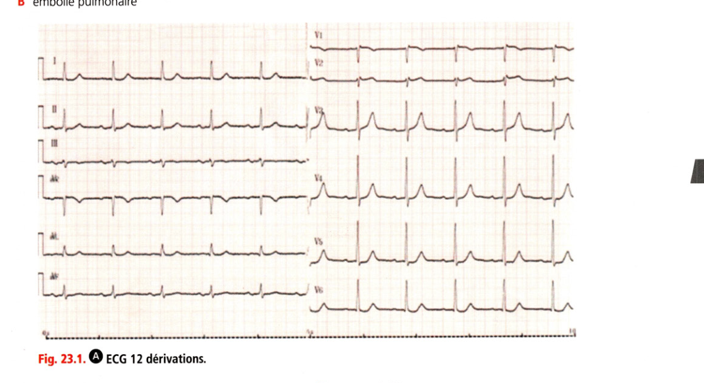
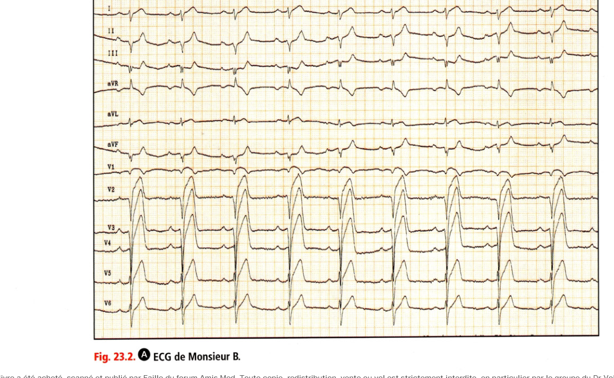
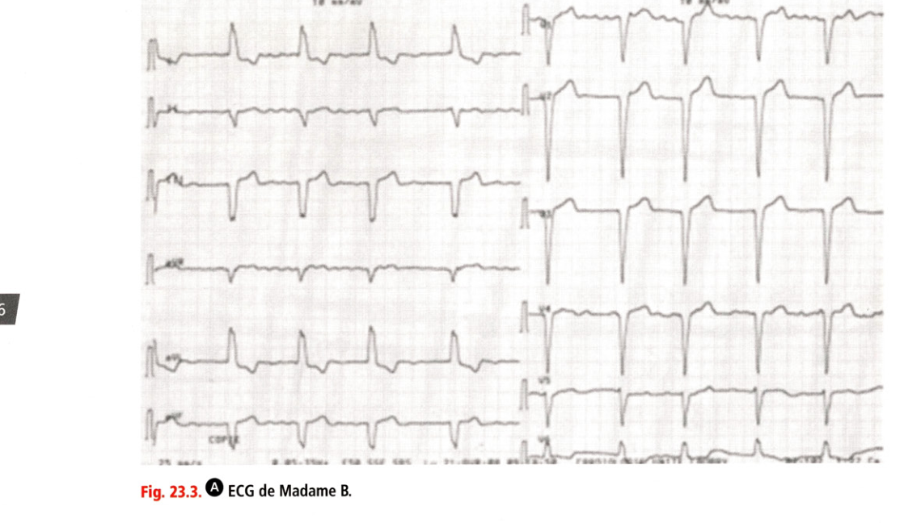
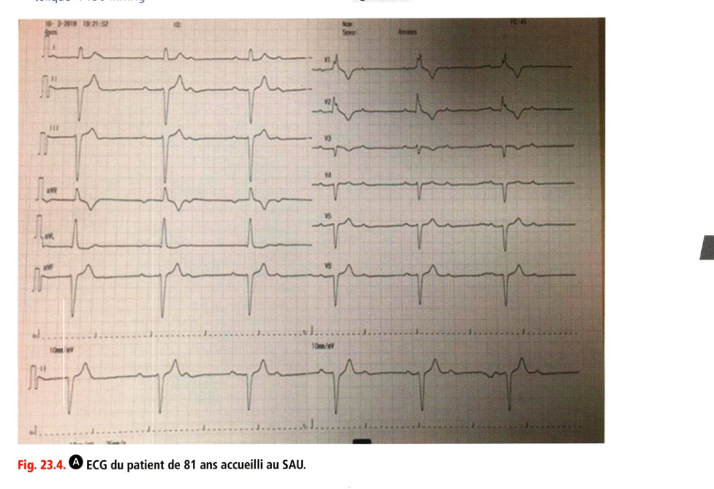

# Entraînement — Dossiers cliniques progressifs

> Collège CNEC 3e éd. · Chapitre 23 · p. 555–574
> Corrigés dans le même chapitre, sous chaque question.

Les corrigés sont **sous** chaque question. Faire d’abord sans regarder.

## Sommaire

1. [DCP 1 — Homme 57 ans, FDR, SCORE-2, syndrome métabolique, reprise du vélo](#dcp-1--homme-57-ans-fdr-score-2-syndrome-métabolique-reprise-du-vélo)
2. [DCP 2 — Homme 56 ans, HTA sous triple traitement, ibuprofène et ronflements](#dcp-2--homme-56-ans-hta-sous-triple-traitement-ibuprofène-et-ronflements)
3. [DCP 3 — Douleur thoracique / SCA (soirée football)](#dcp-3--douleur-thoracique--sca-soirée-football)
4. [DCP 4 — SCA ST+ à domicile (Monsieur B., SMUR)](#dcp-4--sca-st-à-domicile-monsieur-b-smur)
5. [DCP 5 — Insuffisance aortique sévère et maladie de Marfan](#dcp-5--insuffisance-aortique-sévère-et-maladie-de-marfan)
6. [DCP 6 — Souffle / rétrécissement aortique sur bicuspidie (~45 ans)](#dcp-6--souffle--rétrécissement-aortique-sur-bicuspidie-45-ans)
7. [DCP 7 — Valve mécanique aortique, INR et endocardite](#dcp-7--valve-mécanique-aortique-inr-et-endocardite)
8. [DCP 8 — AVC, fièvre et souffle diastolique (endocardite)](#dcp-8--avc-fièvre-et-souffle-diastolique-endocardite)
9. [DCP 9 — Prothèse mécanique mitrale, grossesse et AVK](#dcp-9--prothèse-mécanique-mitrale-grossesse-et-avk)
10. [DCP 10 — Julien C., 74 ans, dyspnée et insuffisance cardiaque](#dcp-10--julien-c-74-ans-dyspnée-et-insuffisance-cardiaque)
11. [DCP 11 — AOMI, épreuve de marche et IPS](#dcp-11--aomi-épreuve-de-marche-et-ips)
12. [DCP 12 — Madame B., 58 ans, dyspnée, HTA, FA et IM](#dcp-12--madame-b-58-ans-dyspnée-hta-fa-et-im)
13. [DCP 13 — Homme 81 ans, malaise, BAV, amiodarone et apixaban](#dcp-13--homme-81-ans-malaise-bav-amiodarone-et-apixaban)

---

## DCP 1 — Homme 57 ans, FDR, SCORE-2, syndrome métabolique, reprise du vélo

Un homme de 57 ans consulte pour bilan cardiovasculaire. Il s’agit d’un sujet sédentaire avec un tabagisme actif, 15 cigarettes par jour, 25 paquets-années. Il ne signale pas d’antécédent cardiovasculaire personnel mais un infarctus du myocarde à 48 ans chez son père. Il ne relate pas de symptômes. Il est sédentaire mais souhaite reprendre le cyclisme en club, activité qu’il avait arrêtée depuis 8 ans, en vue de perdre un peu de poids.

À l’examen, on mesure : poids 92 kg, taille 173 cm, IMC 30,8 kg/m², périmètre abdominal 98 cm, pression artérielle 158/97 mmHg.

Il communique son bilan biologique réalisé 1 semaine avant cette consultation :

- glycémie à jeun : 6,3 mmol/L [1,15 g/L] ;
- cholestérol total : 6,2 mmol/L [2,62 g/L].

### Question 1 (QRM)

Parmi les propositions suivantes, laquelle (lesquelles) est (sont) exacte(s) ?

- A. le risque cardiovasculaire peut être évalué sans autre examen chez ce patient
- B. il est nécessaire de compléter le bilan biologique en prescrivant une exploration d’une anomalie lipidique pour évaluer le risque cardiovasculaire du patient
- C. le patient a un syndrome métabolique
- D. le patient est obèse
- E. le patient a une hyperglycémie à jeun non diabétique

**Réponse : B, C, D, E**

La définition du syndrome métabolique associe obésité centrale (périmètre abdominal ≥ 94 cm pour un homme, ≥ 80 cm pour une femme) + au moins deux des facteurs suivants : TG > 1,50 g/L, HDL-C < 0,40 g/L homme, < 0,50 g/L femme, PA ≥ 130/85 mmHg, hyperglycémie > 1 g/L ou diabète de type 2. Ici : tour de taille 98 cm, PA 158/97 mmHg, glycémie 1,15 g/L. Le patient est obèse car son IMC est > 30 kg/m². L’hyperglycémie à jeun non diabétique correspond à une glycémie comprise entre 1,00 et 1,26 g/L. L’EAL (HDL, TG, LDL) est indispensable pour coter le risque : A faux.

### Question 2 (QRM)

Le bilan biologique complémentaire retrouve HDL-cholestérol : 0,88 mmol/L [0,34 g/L], triglycérides : 2,9 mmol/L [2,56 g/L].

Parmi les propositions suivantes, laquelle (lesquelles) est (sont) exacte(s) ?

- A. le LDL est non calculable car les triglycérides sont trop élevés
- B. le LDL-cholestérol est calculé à 4,58 mmol/L [1,77 g/L]
- C. le LDL-cholestérol est calculé à 4,40 mmol/L [1,4 g/L]
- D. le HDL-cholestérol est à des valeurs élevées
- E. le risque lié à la dyslipidémie est dépendant de la seule élévation du LDL-cholestérol

**Réponse : B**

La formule de Friedewald n’est valable que pour TG < 3,5 g/L. LDL-C (g/L) = CT (g/L) − HDL-C (g/L) − TG (g/L)/5 = 2,62 − 0,34 − 2,56/5 = 1,77 g/L, soit 4,58 mmol/L. La valeur de HDL est basse (N > 0,40 g/L). Le risque lié à la dyslipidémie doit aussi tenir compte du HDL, même si le LDL est l’objectif thérapeutique principal. Le HDL peut être augmenté avec l’alimentation et l’activité physique.

### Question 3 (QRM)

Le calcul du risque SCORE-2 retrouve une valeur à 12 %.

Parmi les propositions suivantes, laquelle (lesquelles) est (sont) exacte(s) ?

- A. le risque cardiovasculaire associé au LDL-cholestérol n’est pas graduel mais est défini pour une valeur seuil > 1,6 g/L
- B. le risque SCORE-2 ne prend pas en compte l’hérédité familiale
- C. le risque SCORE-2 permet d’évaluer le risque d’événement cardiovasculaire à 10 ans
- D. le risque SCORE-2 indique que le patient a un risque très élevé
- E. le risque SCORE-2 est particulièrement intéressant chez l’hypertendu sévère (PAS > 180 mmHg)

**Réponse : B, C, D**

Bien que le risque associé au LDL-C et au HDL-C soit graduel, les recommandations Afssaps (2005) considèrent que le bilan lipidique est normal si les valeurs suivantes sont présentes simultanément chez un sujet sans autre FDR : LDL-C < 1,6 g/L, HDL-C > 0,4 g/L, TG < 1,5 g/L (**A : SCZ**). Entre 5 et 10 %, le risque est dit élevé, et très élevé s’il est > 10 % ; cette distinction a pour conséquence la précocité d’instauration des traitements pharmacologiques antihypertenseurs et hypolipémiants. Le risque SCORE-2 n’est pas adapté pour les patients hypertendus sévères (PA > 180/110 mmHg), diabétiques, insuffisants rénaux chroniques ou atteints d’hypercholestérolémie familiale. En prévention secondaire, le risque est d’emblée considéré très élevé.

### Question 4 (QRM)

Devant l’association de plusieurs facteurs de risque, vous expliquez au patient que son risque cardiovasculaire est à 12 %.

Concernant la prise en charge, quelle(s) est (sont) la (les) proposition(s) exacte(s) ?

- A. vous organisez une automesure de la pression artérielle avant de prescrire un traitement antihypertenseur
- B. les valeurs de pression artérielle systolique ne sont pas prises en compte dans la définition du syndrome métabolique
- C. les valeurs de pression artérielle sont prises en compte dans le risque SCORE-2
- D. en prévention primaire, la prescription d’un traitement antihypertenseur tient compte du niveau du risque SCORE-2 et de celui de la pression artérielle
- E. en prévention secondaire, la prescription d’un traitement hypolipémiant tient compte du niveau du risque SCORE-2 et de celui de la pression artérielle

**Réponse : A, C, D**

Le diagnostic de l’HTA doit reposer sur des mesures répétées au cabinet ou des mesures hors cabinet (automesures ou MAPA 24 h) si cela est possible. La définition du syndrome métabolique associe obésité centrale (périmètre abdominal ≥ 94 cm homme, ≥ 80 cm femme) + au moins deux des facteurs suivants : TG > 1,50 g/L, HDL-C < 0,40 g/L homme / < 0,50 g/L femme, PA ≥ 130/85 mmHg, hyperglycémie > 1 g/L ou DT2. Le SCORE-2 évalue le risque d’événement CV à 10 ans selon le sexe, l’âge (40–65 ans), le tabac, la PAS et le cholestérol non HDL. En prévention secondaire, le SCORE-2 n’est pas l’outil de décision pour l’hypolipémiant (E faux).

### Question 5 (QRM)

Vous conseillez en première intention l’arrêt du tabagisme, une modification du régime avec beaucoup de légumes, céréales et poisson et la reprise d’une activité physique à type de marche 30 min par jour.

Concernant la reprise d’activité physique, quelle(s) est (sont) la (les) proposition(s) exacte(s) ?

- A. elle permet de réduire la mortalité cardiovasculaire
- B. un avis médical n’est pas nécessaire pour la reprise du vélo en club
- C. une épreuve d’effort doit être réalisée
- D. l’activité physique n’a pas d’action particulière sur les lipides
- E. l’activité physique permettra de mieux contrôler sa glycémie

**Réponse : A (PCZ), C, E**

La réduction de la mortalité cardiovasculaire par l’activité physique est démontrée. Il s’agit d’une reprise d’activité intense > 6 MET chez un sujet inactif de plus de 45 ans. Une épreuve d’effort est nécessaire : SCORE-2 à 12 % (très élevé), sujet inactif, et antécédent familial d’infarctus précoce chez le père avant 50 ans. L’activité physique augmente le HDL (**D : SCZ**), régule la glycémie et diminue les besoins en insuline.

---

## DCP 2 — Homme 56 ans, HTA sous triple traitement, ibuprofène et ronflements

Un homme de 56 ans, hypertendu ancien, consulte pour des chiffres de pression artérielle élevés à l’automesure (PA systolique 170 mmHg, PA diastolique 100 mmHg). Ce patient n’a pas d’antécédent pathologique notable. Il mange régulièrement au restaurant. Son traitement actuel associe un inhibiteur de l’enzyme de conversion, un diurétique thiazidique et un inhibiteur calcique. Ces médicaments sont prescrits à dose optimale depuis plusieurs mois.

Par ailleurs, en raison d’une tendinite patellaire, un traitement par ibuprofène (anti-inflammatoire non stéroïdien) a été débuté depuis un mois. À l’interrogatoire, son épouse qui l’accompagne confie que depuis très longtemps il ronfle. Il pèse 86 kg pour 1,70 m. La pression artérielle en début d’examen est de 170/100 mmHg ; après 5 minutes de repos, elle est mesurée à 170/95 mmHg. Le reste de l’examen est normal.

### Question 1 (QRM)

Quel(s) facteur(s) exogène(s) est (sont) à rechercher chez ce patient, pouvant expliquer ce déséquilibre tensionnel ?

- A. consommation d’alcool
- B. excès d’apports sodés
- C. surpoids
- D. apnée du sommeil
- E. traitement par ibuprofène

**Réponse : A, B, C, D, E**

L’abus d’alcool augmente la PA et peut favoriser une résistance aux antihypertenseurs. Un défaut d’excrétion du sodium à long terme a été mis en avant comme mécanisme principal de l’HTA essentielle (rétention hydrosodée). Le surpoids favorise l’HTA. Le SAS est fréquent chez l’hypertendu, à rechercher en présence de signes d’appel (ronflements, troubles du sommeil, asthénie). L’ibuprofène entraîne une rétention hydrosodée.

### Question 2 (QRU)

Quel examen biologique réalisez-vous pour mettre en évidence un éventuel apport sodé excessif ?

- A. natrémie
- B. ionogramme sanguin
- C. créatininémie
- D. natriurèse des 24 heures
- E. protéinurie

**Réponse : D**

**A : SCZ.** La natriurèse des 24 heures permet d’évaluer de façon fiable les apports sodés : idéalement < 6–8 g par jour, soit une natriurèse de 100 à 140 mmol par jour (rappel : 1 g de NaCl = 17 mmol de sodium).

### Question 3 (QRM)

Parmi les conditions de mesure clinique de la pression artérielle à respecter pour éviter une erreur de mesure et notamment une majoration des chiffres tensionnels, quelle(s) est (sont) la (les) proposition(s) exacte(s) ?

- A. bras dénudé dans le plan du cœur
- B. brassard adapté à la taille du bras
- C. après au moins 5 minutes de repos
- D. en position couchée ou assise
- E. exprimer les résultats par la moyenne d’au moins deux mesures

**Réponse : A, B (PCZ), C (PCZ), D, E**

Il faut disposer de trois tailles de brassard : obèse, standard, enfant. Le bras doit reposer sur un support (table) pour éviter des contractions musculaires pouvant augmenter la PA. Si les deux premières mesures diffèrent de plus de 10 mmHg, des mesures supplémentaires doivent être réalisées en retenant toujours la moyenne des deux dernières mesures.

### Question 4 (QRU)

Afin d’avoir un reflet exact du niveau tensionnel réel chez ce patient, vous réalisez une MAPA. Voici les résultats obtenus :

- pression artérielle moyenne sur 24 heures : PAS 129 mmHg, PAD 80 mmHg ;
- pression artérielle moyenne pendant la période diurne : PAS 134 mmHg, PAD 84 mmHg.

Quelle est votre conclusion ?

- A. il s’agit d’une HTA résistante
- B. il s’agit d’une HTA masquée
- C. il s’agit d’un effet blouse blanche
- D. il s’agit d’une pseudo-hypertension
- E. aucune de ces réponses

**Réponse : C**

**A : SCZ.** L’HTA masquée concerne des sujets dont la PA est normale en consultation, mais élevée en MAPA ou en automesure. L’HTA blouse blanche correspond à une PA de consultation élevée, alors que la MAPA ou l’automesure donnent des valeurs normales (15 à 20 % de la population générale). Chez le sujet âgé, diabétique et/ou hémodialysé, une rigidité extrême des artères (artères calcifiées) peut aboutir à une élévation de la PA au brassard supérieure de 20 mmHg (parfois 40 à 50 mmHg) à la pression intra-artérielle (manœuvre d’Osler : pouls radial encore perçu alors que le brassard est gonflé au-dessus de la PAS).

### Question 5 (QRM)

La MAPA a permis de mettre en évidence un effet blouse blanche.

Concernant votre attitude thérapeutique, quelle(s) est (sont) la (les) proposition(s) exacte(s) ?

- A. vous augmentez les doses des traitements antihypertenseurs
- B. vous ne modifiez pas le traitement antihypertenseur
- C. vous encouragez chez ce patient l’automesure tensionnelle chaque jour
- D. vous encouragez chez ce patient l’automesure tensionnelle avec trois mesures le matin et trois mesures le soir pendant 3 jours avant votre prochaine consultation
- E. vous diminuez les doses des traitements antihypertenseurs

**Réponse : B, D**

**A : SCZ.** La MAPA confirme l’équilibre tensionnel en mettant en évidence un effet blouse blanche. Il n’y a pas d’indication à modifier le traitement. L’automesure tensionnelle chaque jour est inutile et souvent anxiogène (**C : SCZ**). L’automesure doit être encouragée chez la plupart des patients (hors patients très anxieux). La « règle des 3 » est importante à expliquer et permet de vérifier l’équilibre tensionnel lors des consultations.

---

## DCP 3 — Douleur thoracique / SCA (soirée football)

Monsieur A. se présente au SAU car il a ressenti pour la première fois une douleur dans la poitrine qui l’a inquiété. Cet homme âgé de 45 ans, chauffeur de car, est traité depuis 5 ans par atorvastatine 10 mg. Son frère a présenté un infarctus du myocarde à l’âge de 42 ans.

Il décrit une douleur précordiale en barre apparue 3 heures plus tôt alors qu’il regardait un match de football à la télévision avec des amis au cours d’une soirée pizza bien arrosée entre fumeurs. La douleur a duré près de 20 minutes mais il a préféré attendre la fin du match avant de se faire accompagner au SAU par ses amis.

À l’admission, il est asymptomatique et l’examen cardiovasculaire, respiratoire et général est sans particularité. Ce patient rapporte un poids de 85 kg. La pression artérielle est mesurée à 150/85 mmHg.

### Question 1 (QRM)

Quel(s) diagnostic(s) évoquez-vous ?

- A. péricardite
- B. embolie pulmonaire
- C. dissection aortique
- D. IDM sans sus-décalage de ST
- E. IDM avec sus-décalage de ST

**Réponse : D**

La péricardite n’est pas à évoquer, notamment car il n’y a pas de contexte favorisant (infection ORL ou stomatologique récente) et, surtout, le SCA doit être évoqué en priorité. Le tableau clinique n’évoque pas d’embolie pulmonaire ou de dissection aortique. L’IDM avec sus-décalage de ST n’est pas à évoquer car la douleur a régressé et le patient est asymptomatique à l’admission au SAU.

### Question 2 (QRM)

Quel(s) examen(s) demandez-vous en première intention ?

- A. électrocardiogramme (ECG)
- B. dosage des CPK
- C. dosage de la troponine
- D. échocardiographie
- E. coroscanner

**Réponse : A (PCZ), C (PCZ), D**

L’ECG est indispensable. Le dosage des CPK n’est plus réalisé devant une douleur thoracique. Le dosage de la troponine est indispensable. L’échocardiographie a pour but d’évaluer la FEVG et participe au diagnostic différentiel (péricarde, valvulopathie). Devant ce tableau typique, il faudra ensuite réaliser une coronarographie (cf. question 6). Le coroscanner n’est pas l’examen de première intention ici.

### Question 3 (QRM)

Un ECG 12 dérivations est enregistré suivant le protocole en cours au SAU (fig. 23.1).

Quelle est votre interprétation ?

- A. rythme sinusal
- B. hémibloc antérieur gauche
- C. sus-décalage du segment ST en inférieur
- D. indice de Sokolow > 35 mm
- E. bloc de branche droit incomplet

**Réponse : A, E**

Le rythme sinusal est objectivé par les ondes P positives en V2. L’axe est normal. Le segment ST est normal en D2, D3 et aVF. L’indice de Sokolow est < 35 mm. Le bloc de branche droit incomplet est évoqué par l’aspect RSR’ en V2.

### Question 4 (QRM)

Un dosage de la troponine ultrasensible a été réalisé. Il est augmenté à 100 ng/L (normale < 14 ng/L). Vous retenez le diagnostic de SCA.

Quel(s) traitement(s) proposez-vous en première intention ?

- A. aspirine IVD
- B. fondaparinux
- C. amiodarone
- D. prasugrel 60 mg
- E. lercanidipine 10 mg

**Réponse : A, B**

L’aspirine est systématique. Une anticoagulation est justifiée. Une HBPM peut aussi être prescrite. Le prasugrel n’est pas prescrit tant que la coronarographie n’est pas réalisée, et n’est instauré qu’en cas d’angioplastie. La lercanidipine n’est pas indiquée en première intention lors des SCA. Il n’y a pas de raison de prescrire un antiarythmique (amiodarone).

### Question 5 (QRM)

Quel(s) est (sont) l’(les) élément(s) que vous prenez en compte pour évaluer le risque de ce patient ?

- A. présentation clinique
- B. données de l’examen
- C. données de l’ECG
- D. troponinémie
- E. score de GRACE

**Réponse : A, B, C, D, E**

La douleur de repos, l’insuffisance cardiaque, le sous-décalage de ST et la troponinémie élevée sont pris en compte pour évaluer le risque. Le score de GRACE est un score pronostique peu utilisé en routine.

### Question 6 (QRM)

Quel(s) examen(s) proposez-vous pour confirmer le diagnostic ?

- A. deuxième dosage de la troponine
- B. échocardiographie
- C. coroscanner
- D. coronarographie
- E. IRM

**Réponse : D**

Le premier dosage de troponine est déjà très augmenté. L’échocardiographie a déjà été réalisée (question 2). Le coroscanner est indiqué en cas de faible suspicion quand l’ECG et la troponine sont normaux. Le tableau est ici caricatural avec une élévation forte de la troponine, justifiant une coronarographie d’emblée. L’IRM n’est pas réalisée en routine en cas de SCANST.

### Question 7 (QRU)

Une coronarographie a finalement été pratiquée et a mis en évidence une sténose monotronculaire évaluée à 90 % de l’artère circonflexe moyenne.

Quelle stratégie thérapeutique proposez-vous ?

- A. évaluation de la sténose par un test fonctionnel (épreuve d’effort)
- B. intervention coronarienne percutanée sans confirmation de la sévérité de la sténose par un test fonctionnel
- C. pontage coronarien
- D. traitement anti-ischémique par bêtabloquant en première intention

**Réponse : B**

La réalisation d’un test fonctionnel à la recherche d’une ischémie n’est pas indiquée devant un SCA. La revascularisation donne de meilleurs résultats que le traitement médical en cas de SCANST. Le patient présente une lésion monotronculaire justifiant une angioplastie plutôt qu’un pontage. Le pontage est habituellement discuté en cas de lésion du tronc commun de la coronaire gauche ou de lésions tritronculaires ou complexes.

### Question 8 (QRM)

En fin d’hospitalisation, le patient est asymptomatique. L’examen est sans particularité. La PA est mesurée à 125/80 mmHg, l’ECG est inchangé, la FC est de 60 bpm, l’échocardiographie évalue à 60 % la fraction d’éjection ventriculaire gauche. Le bilan biologique retrouve : Hb 13,5 g/dL, créatininémie 75 µmol/L, HbA1c 5,3 %, pas d’anomalie de la NFS, bilan hépatique normal.

Quel(s) traitement(s) proposez-vous pour les 12 mois suivant la sortie de l’hôpital ?

- A. aspirine
- B. inhibiteur des P2Y12
- C. anticoagulant oral
- D. statine à la dose maximale (ex. : atorvastatine 80 mg)
- E. inhibiteur calcique (ex. : lercanidipine 10 mg)

**Réponse : A (PCZ), B, D (PCZ)**

Une double antiagrégation plaquettaire est indiquée pendant 12 mois. L’anticoagulant oral n’a pas d’indication sauf en cas de FA associée (**C : SCZ**). L’objectif est une baisse du LDL de 50 % et un LDL cible < 0,55 g/L. Les inhibiteurs calciques ne sont pas indiqués en première intention.

---

## DCP 4 — SCA ST+ à domicile (Monsieur B., SMUR)

Monsieur B., 55 ans, ressent depuis quelques jours une douleur thoracique qui survient de manière inopinée parfois à l’effort, parfois au repos, de courte durée. La première douleur est apparue au cours d’une marche avec ses amis, ce qui l’a conduit à rebrousser chemin. Elle avait récidivé le lendemain soir et depuis devenait plus régulière. Vers 20 h, au décours d’un repas sans excès, la douleur récidive et ne cède pas. Elle est intense, précordiale, oppressante, accompagnée de sueurs froides. Bien que Monsieur B. réside à quelques minutes à pied d’un centre hospitalier disposant d’un service d’urgence de porte et de tous les services de médecine et chirurgie spécialisés, il n’a pas la capacité physique de s’y rendre. Son épouse appelle le 15 qui adresse au domicile une unité médicalisée du SMUR.

À son arrivée vers 20 h 30, la douleur n’a pas cédé. Monsieur B. est pâle et en sueur. L’examen rapide ne retrouve ni souffle ni crépitants respiratoires. La PA est mesurée à 110 mmHg aux deux bras. Un ECG est pratiqué (fig. 23.2).

### Question 1 (QRM)

Quel(s) diagnostic(s) évoquez-vous ?

- A. péricardite
- B. IDM sans sus-décalage de ST
- C. IDM avec sus-décalage de ST
- D. dissection aortique
- E. embolie pulmonaire

**Réponse : C**

Le diagnostic est aisé compte tenu de la douleur caricaturale et de l’aspect ECG.

### Question 2 (QRM)

Quel(s) traitement(s) proposez-vous d’emblée après avoir éliminé une contre-indication ?

- A. aspirine IVD (150 mg)
- B. héparine IVD (5 000 UI)
- C. prasugrel (60 mg per os)
- D. lercanidipine (20 mg per os)
- E. chlorhydrate de morphine (IVD titré)

**Réponse : A, B, C, E**

Le bêtabloquant n’est pas indiqué car la fréquence cardiaque est spontanément lente et la PA basse. Il sera rediscuté secondairement. La lercanidipine n’a pas sa place en phase aiguë de STEMI.

### Question 3 (QRU)

Quelle stratégie thérapeutique proposez-vous ensuite ?

- A. fibrinolyse intraveineuse (FIV) au domicile et transfert en USIC
- B. fibrinolyse intra-veineuse et transfert en salle de coronarographie
- C. transfert en USIC
- D. transfert en salle de coronarographie

**Réponse : D**

Une FIV n’est pas l’option à privilégier car le délai entre la prise en charge et la réalisation d’une angioplastie est estimé < 120 minutes. Une angioplastie primaire doit ici être privilégiée.

### Question 4 (QRM)

En USIC, le lendemain de son admission, le patient est asymptomatique. La PA est de 130/85 mmHg. La FC est de 80 bpm. L’auscultation cardiaque et l’examen général sont sans particularité. L’échocardiographie évalue à 45 % la FEVG. Le bilan biologique (NFS, plaquettes, bilan rénal et hépatique) est sans particularité.

Quel(s) traitement(s) proposez-vous ?

- A. aspirine 75 mg par jour
- B. prasugrel 10 mg par jour
- C. apixaban 2,5 mg 2 fois par jour
- D. bisoprolol (bêtabloquant) 10 mg par jour (titré)
- E. ramipril (IEC) 10 mg par jour (titré)

**Réponse : A, B, D, E**

Une double antiagrégation plaquettaire est indiquée. Le prasugrel est indiqué uniquement en cas d’angioplastie. Il n’y a pas d’indication à un traitement anticoagulant. Les bêtabloquants sont indiqués de façon formelle après un SCA ST+. Un IEC est indiqué après un SCA ST+, d’autant plus qu’il existe une dysfonction VG, pour éviter un remodelage du VG (dilatation).

### Question 5 (QRU)

Vous revoyez ce patient en consultation 4 semaines plus tard. Il prend actuellement régulièrement 80 mg d’atorvastatine. Il ne ressent pas d’effets secondaires. Le LDL-cholestérol est calculé à 1 g/L.

Quelle est votre attitude thérapeutique ?

- A. vous augmentez la dose d’atorvastatine
- B. vous la remplacez par de la simvastatine à la dose de 40 mg par jour
- C. vous associez à l’atorvastatine de l’ézétimibe
- D. vous associez à l’atorvastatine un fibrate
- E. vous associez à l’atorvastatine un inhibiteur de PCSK9

**Réponse : C**

La posologie maximale de l’atorvastatine est de 80 mg par jour. La simvastatine à 40 mg par jour est moins puissante que l’atorvastatine à 80 mg. En cas de dose maximale de statine, si le LDL reste > 0,55 g/L, il faut associer de l’ézétimibe. L’association statine et fibrate est à éviter (risque de rhabdomyolyse). Les inhibiteurs de PCSK9 sont remboursés en France en troisième intention en cas de LDL > 0,7 g/L malgré statine (dose maximale tolérée) et ézétimibe.

### Question 6 (QRM)

Vous revoyez ce patient en consultation 1 an plus tard. Il n’a pas eu d’événement clinique particulier depuis la prise en charge initiale. L’examen clinique est sans particularité. L’ECG retrouve une onde Q de V1 à V4. Le LDL est à 0,51 g/L. L’échographie cardiaque retrouve un ventricule gauche non dilaté, une hypokinésie antéroseptale et apicale. La fraction d’éjection est calculée à 49 %.

Parmi les mesures thérapeutiques suivantes, laquelle (lesquelles) vous semble(nt) indiquée(s) ?

- A. poursuite de l’aspirine
- B. poursuite du prasugrel
- C. arrêt des inhibiteurs de l’enzyme de conversion
- D. poursuite des bêtabloquants
- E. arrêt des statines

**Réponse : A, D**

Au-delà de 1 an, une monothérapie antiagrégante est préconisée. Les inhibiteurs des récepteurs P2Y12 sont prescrits habituellement pour 1 an. L’IEC doit être poursuivi au long cours. Les bêtabloquants sont également prescrits au long cours (risque de mort subite à l’arrêt), de même que les hypolipémiants, car ils ont un effet stabilisant sur les lésions athéromateuses.

---

## DCP 5 — Insuffisance aortique sévère et maladie de Marfan

Un jeune homme de 26 ans, sans antécédent pathologique notable, consulte pour une dyspnée d’effort rapidement progressive apparue depuis quelques semaines, en particulier au cours des efforts importants. Il est très grand (1,92 m). Il joue au basket dans une équipe professionnelle. Il a plusieurs frères et sœurs qui sont tous très grands. Le père, également très grand, a été victime d’une mort subite à l’âge de 45 ans, précédée de douleurs thoraciques violentes.

L’examen clinique objective un bon état général. À l’inspection, les carotides sont hyperpulsatiles. L’auscultation cardiaque révèle un souffle holodiastolique 4/6 prédominant le long du bord gauche du sternum, accompagné d’un souffle systolique 2/6. La pression artérielle est à 150/40 mmHg. Il n’y a pas de signe d’insuffisance ventriculaire gauche ou droite. L’ECG montre un rythme sinusal, un aspect d’hypertrophie ventriculaire gauche avec surcharge systolique.

### Question 1 (QRU)

Quelle est la valvulopathie dont est atteint ce patient ?

- A. une insuffisance mitrale
- B. une sténose aortique
- C. une insuffisance pulmonaire
- D. une insuffisance aortique
- E. une insuffisance tricuspidienne

**Réponse : D**

**A : SCZ.** Le souffle est principalement diastolique le long du bord gauche du sternum, les carotides sont hyperpulsatiles, la pression diastolique est basse (40 mmHg) avec une différentielle augmentée. Le souffle systolique correspond à un souffle d’hyperdébit cardiaque secondaire à l’IA. Un souffle d’IM est systolique prédominant à l’apex. **B : SCZ.** Le souffle de sténose aortique prédomine au foyer aortique, il est systolique, rude, râpeux, irradie vers l’hémithorax gauche et dans les carotides. Le souffle d’IT est systolique, pas toujours audible, mieux entendu à la partie inférieure du sternum et au creux épigastrique, augmenté en inspiration.

### Question 2 (QRM)

Parmi les propositions suivantes, quel(s) est (sont) l’(les) argument(s) pour le caractère sévère de la valvulopathie ?

- A. la dyspnée croissante
- B. l’hyperpulsatilité des carotides
- C. le souffle systolique
- D. la valeur de la pression artérielle diastolique
- E. l’hypertrophie ventriculaire gauche avec surcharge systolique sur l’ECG

**Réponse : A, B, C, D, E**

La dyspnée croissante est en faveur d’une décompensation cardiaque sur une IA chronique sévère. L’hyperpulsatilité des carotides signe l’augmentation de la différentielle avec PA diastolique très basse. Le souffle systolique témoigne en général d’un hyperdébit cardiaque antérograde secondaire à une fuite importante. La PA diastolique très basse témoigne d’une IA sévère. La surcharge systolique est un signe tardif témoignant du retentissement de l’IA sur le ventricule gauche.

### Question 3 (QRM)

Parmi les propositions suivantes, quelle(s) est (sont) le(s) principale(s) information(s) attendue(s) de l’échocardiographie ?

- A. la quantification de la fuite aortique
- B. le mécanisme de la fuite aortique
- C. la dilatation du ventricule gauche
- D. l’état des artères coronaires
- E. la taille et l’aspect de l’aorte thoracique initiale

**Réponse : A (PCZ), B, C (PCZ), E**

L’ETT est un examen essentiel, simple, non invasif, non irradiant. Elle peut être complétée si besoin par une ETO. Elle ne permet pas d’examiner les artères coronaires. L’échocardiographie est l’examen de première intention pour évaluer la taille et l’aspect de l’aorte thoracique initiale, et peut être complétée si besoin par une IRM, voire un scanner en dernière intention (caractère irradiant).

### Question 4 (QRM)

L’échodoppler cardiaque révèle une dilatation des sinus aortiques et de la partie toute initiale de l’aorte mesurée au maximum à 60 mm, alors que l’aorte ascendante reprend une taille presque normale ensuite.

Parmi les propositions suivantes, laquelle (lesquelles) est (sont) exacte(s) ?

- A. il s’agit d’un aspect de maladie annuloectasiante de l’aorte
- B. cet aspect n’a aucune influence sur le fonctionnement de la valve aortique
- C. le mouvement de la valve aortique peut être altéré du fait de cette dilatation aortique
- D. la dilatation de l’aorte est peu importante
- E. un remplacement de l’aorte doit être envisagé

**Réponse : A (PCZ), C, E**

L’aspect typique de maladie annuloectasiante est dit en « bulbe d’oignon ». La maladie annuloectasiante tend à attirer les cusps et à empêcher leur fermeture complète (**B : SCZ**). La dilatation de l’aorte est très importante lorsque le diamètre aortique dépasse 55 mm (**D : SCZ**). Le remplacement de l’aorte est une indication formelle au vu de son diamètre, qui présente un risque de rupture ou de dissection spontanée.

### Question 5 (QRM)

Parmi les propositions suivantes, quel(s) est (sont) l’(les) argument(s) pour une maladie de Marfan ?

- A. la grande taille du patient
- B. la mort subite du père précédée de douleurs thoraciques violentes
- C. la dilatation de l’aorte
- D. la valvulopathie dont vous avez évoqué le diagnostic
- E. l’hyperpulsatilité des carotides

**Réponse : A, B, C (PCZ), D**

Les patients atteints de maladie de Marfan sont souvent de grande taille. La mort subite du père précédée de douleurs thoraciques violentes est en faveur d’une dissection et rupture aortique, et d’une origine familiale. La dilatation de l’aorte est un critère majeur de diagnostic. La valvulopathie oriente vers une maladie de Marfan, soit par atteinte de l’aorte ascendante soit par dystrophie valvulaire. L’hyperpulsatilité des carotides est un critère d’IA sévère, pas de maladie de Marfan.

### Question 6 (QRM)

Parmi les propositions suivantes, quel(s) examen(s) d’imagerie peu(ven)t être utilisé(s) pour étudier l’aorte chez ce patient ?

- A. l’échocardiographie transthoracique
- B. l’échocardiographie transœsophagienne
- C. l’angioscanner aortique
- D. l’angio-IRM aortique
- E. le TEP-scanner

**Réponse : A (PCZ), B, C, D (PCZ)**

L’ETT est l’examen de première intention pour l’évaluation du diamètre de l’aorte et son suivi. L’ETO peut permettre d’analyser l’aorte ascendante chez des patients très peu échogènes, et aussi d’analyser la crosse et l’aorte thoracique descendante. L’angioscanner aortique, du fait de son caractère irradiant, est utilisé en troisième intention. L’angio-IRM aortique est l’examen d’imagerie en coupes de référence pour évaluer l’aorte, en deuxième intention. Le TEP-scanner n’est pas indiqué pour l’étude des diamètres de l’aorte.

### Question 7 (QRM)

Concernant la prise en charge thérapeutique, quelle(s) est (sont) le(s) proposition(s) à mettre en place rapidement ?

- A. arrêt de l’activité professionnelle de basket
- B. traitement médicamenteux exclusif par bêtabloquant et diurétiques
- C. remplacement valvulaire aortique percutané (TAVI)
- D. remplacement chirurgical isolé de la valve aortique et traitement bêtabloquant
- E. remplacement ou réparation chirurgicale de la valve aortique et remplacement de l’aorte initiale avec réimplantation coronarienne

**Réponse : A (PCZ), E (PCZ)**

L’activité professionnelle de basket doit être arrêtée en raison du risque de rupture ou dissection aortique du fait de la fragilité de la paroi aortique dans la maladie de Marfan. Le traitement médicamenteux par bêtabloquant et diurétiques n’est pas un traitement de l’IA ni de la dilatation de l’aorte (**B : SCZ**). L’IA n’est pas une indication de TAVI, et le TAVI ne traiterait pas la dilatation de l’aorte (**C : SCZ**). Le remplacement valvulaire isolé ne traiterait pas la dilatation de l’aorte, avec un risque majeur de décès par rupture aortique (**D : SCZ**). **E : indication formelle.**

---

## DCP 6 — Souffle / rétrécissement aortique sur bicuspidie (~45 ans)

Monsieur D., 45 ans, sans suivi médical depuis 10 ans, sans antécédent, consulte pour un bilan avant un emprunt bancaire. Il est asymptomatique et sportif. Sa PA est à 127/82 mmHg, sa fréquence cardiaque à 75/min. L’examen clinique est normal en dehors d’un souffle systolique entendu à tous les foyers mais maximum au foyer aortique : 3/6, avec B2 conservé. Il existe aussi un souffle à l’auscultation des deux carotides. L’ECG est normal.

### Question 1 (QRU)

Quelle est votre hypothèse diagnostique concernant les souffles ?

- A. une endocardite
- B. un rétrécissement aortique
- C. une insuffisance aortique
- D. une sténose serrée des deux carotides
- E. un souffle fonctionnel

**Réponse : B**

L’endocardite n’est pas retenue car il ne s’agit pas d’un souffle de régurgitation et il n’y a pas de contexte infectieux. Le souffle systolique maximum au foyer aortique et irradiant dans les carotides est en faveur d’un rétrécissement aortique. L’insuffisance aortique donne un souffle diastolique. À 45 ans sans FDR cardiovasculaire, une sténose serrée des deux carotides est rare et n’explique pas le souffle cardiaque. Un souffle fonctionnel est de faible intensité, variable avec la position du corps, plutôt au foyer pulmonaire, et concerne les sujets jeunes.

### Question 2 (QRU)

Quelle est votre attitude ?

- A. vous l’adressez en urgence chez le cardiologue
- B. vous lui prescrivez les hémocultures
- C. vous l’hospitalisez
- D. vous lui prescrivez un doppler des troncs supra-aortiques
- E. vous lui demandez de prendre RDV chez le cardiologue pour une échocardiographie

**Réponse : E**

Aucune urgence : découverte fortuite chez un patient asymptomatique. Les hémocultures n’ont pas d’intérêt hors contexte infectieux. L’hospitalisation n’est pas justifiée (pas de critère de gravité, tolérance excellente). Le doppler des TSA n’est pas réalisé en première intention. Il faut toujours confirmer un souffle cardiaque en échocardiographie.

### Question 3 (QRM)

Vous l’adressez chez le cardiologue qui confirme un rétrécissement aortique modéré sur bicuspidie. Le reste de l’échocardiographie et du bilan est normal.

Qu’en déduisez-vous ?

- A. le foyer aortique se trouve au 2e espace intercostal gauche
- B. le souffle des deux carotides correspond à l’irradiation du souffle aortique
- C. une abolition du B2 au foyer aortique aurait été en faveur d’une sténose serrée
- D. la bicuspidie est une maladie congénitale qui nécessite un dépistage familial
- E. la bicuspidie fait partie du « groupe à haut risque » pour la prévention de l’endocardite

**Réponse : B, C, D (PCZ)**

Le foyer aortique se trouve au 2e espace intercostal droit. Le reste de l’échocardiographie et du bilan est normal. La diminution ou l’abolition de B2 aurait été en faveur d’un rétrécissement aortique serré. La découverte d’une bicuspidie nécessite un dépistage par échocardiographie des apparentés du premier degré. La dysfonction valvulaire sur bicuspidie appartient au groupe à risque **modéré** pour la prévention de l’endocardite.

### Question 4 (QRM)

Quelle est votre attitude vis-à-vis de Monsieur D. ?

- A. vous lui expliquez les mesures générales de prévention de l’endocardite
- B. vous lui introduisez un traitement préventif par IEC
- C. vous lui organisez un bilan préopératoire de remplacement valvulaire
- D. vous lui préconisez un suivi chez le dentiste tous les 5 ans
- E. vous lui préconisez un suivi cardiologique annuel

**Réponse : A (PCZ), E**

L’éducation thérapeutique est primordiale et valable pour toutes les valvulopathies et tous les porteurs de prothèse. Il n’y a pas de traitement préventif des valvulopathies congénitales ou dégénératives. La valvulopathie est modérée et le patient asymptomatique : pas d’indication opératoire. Le suivi chez le dentiste doit être **annuel**. Le suivi cardiologique doit être annuel ou plus fréquent selon les symptômes.

### Question 5 (QRM)

Cinq ans plus tard, Monsieur D., dans un contexte de surmenage professionnel, se plaint d’une diminution de ses performances à l’effort : il a du mal à suivre son groupe de VTT car il se sent essoufflé dans les côtes et a même ressenti une oppression thoracique le week-end dernier sur une sortie longue, l’ayant obligé à s’arrêter. Il est toujours asymptomatique dans sa vie quotidienne. Le cardiologue constate une progression de la sténose aortique qui est maintenant serrée.

Quelle(s) est (sont) la (les) proposition(s) compatible(s) avec un rétrécissement aortique serré ?

- A. il existe un éclat du B2 au foyer aortique
- B. il existe une hyperpulsatilité des pouls périphériques
- C. le diagnostic est posé en échocardiographie
- D. la surface valvulaire aortique est < 1 cm²
- E. le gradient moyen est < 40 mmHg

**Réponse : C, D (PCZ)**

Une abolition du B2 au foyer aortique est en faveur d’un rétrécissement serré (pas un éclat). L’hyperpulsatilité des pouls périphériques est un signe périphérique d’IA sévère. L’échocardiographie confirme le diagnostic et évalue la sévérité. Une surface valvulaire aortique < 1 cm², un gradient moyen **> 40 mmHg** et une Vmax > 4 m/s composent la définition ETT du rétrécissement aortique calcifié serré.

### Question 6 (QRM)

L’échographie confirme le caractère serré du rétrécissement aortique. Le bilan préopératoire ne retrouve pas de contre-indication à une chirurgie cardiaque de remplacement valvulaire aortique.

Concernant les substituts valvulaires, quelle(s) est (sont) la (les) proposition(s) exacte(s) ?

- A. compte tenu de son âge, vous lui conseillez une valve mécanique
- B. compte tenu de son âge, vous lui proposez une valve biologique
- C. vous lui expliquez les avantages et inconvénients de chaque substitut valvulaire
- D. les prothèses biologiques ne nécessitent pas de traitement ou de suivi cardiologique
- E. les prothèses mécaniques nécessitent un traitement anticoagulant au long cours par antivitamine K ou anticoagulant oral direct

**Réponse : A, C (PCZ)**

L’âge n’est pas le seul critère de choix mais il oriente la décision. Le choix du patient est primordial : information éclairée sur les avantages et inconvénients des deux types de prothèse. Le suivi cardiologique reste au moins annuel, et à vie (**D : SCZ**). Les AOD sont formellement contre-indiqués sur les prothèses valvulaires mécaniques, seules les AVK peuvent être utilisées (**E : SCZ**).

---

## DCP 7 — Valve mécanique aortique, INR et endocardite

Monsieur D. présente un rétrécissement aortique serré symptomatique en rapport avec une bicuspidie aortique. Il est opéré d’un remplacement valvulaire aortique par valve mécanique à double ailette. Les suites sont simples. Vous prescrivez son traitement pour la prothèse.

### Question 1 (QRU)

Quelle(s) est (sont) la (les) proposition(s) exacte(s) ?

- A. vous lui prescrivez un traitement par AVK avec un objectif d’INR entre 2 et 3
- B. vous lui prescrivez un traitement par AVK avec un objectif d’INR entre 2,5 et 3,5
- C. vous lui prescrivez un traitement par AVK avec un objectif d’INR entre 3 et 4
- D. vous lui prescrivez un traitement par AOD
- E. vous lui prescrivez un traitement par antiagrégant plaquettaire

**Réponse : A**

En l’absence de surrisque thrombotique, la cible thérapeutique des valves mécaniques à double ailette en position aortique est entre 2 et 3. Les critères pour un INR 2,5–3,5 en position aortique sont : antécédent thromboembolique, fibrillation atriale, sténose mitrale associée, FE < 35 %. L’INR 3–4 n’est pas recommandé pour les prothèses mécaniques en position aortique. Les prothèses mécaniques sont une contre-indication formelle aux AOD (**D : SCZ**). L’adjonction d’antiagrégants n’est pas recommandée en dehors de situations spécifiques souvent transitoires (stent récent) ou définitives (thromboembolie sous INR efficace).

### Question 2 (QRM)

Que comprendra le suivi de ce patient ?

- A. un suivi cardiologique annuel
- B. un suivi stomatologique biannuel
- C. une surveillance annuelle de l’INR
- D. une surveillance de la dégénérescence valvulaire qui est la principale complication des valves mécaniques
- E. le dépistage de tout foyer infectieux

**Réponse : A, B (PCZ), E (PCZ)**

Le suivi cardiologique doit être annuel voire biannuel. Le suivi stomatologique doit être associé à une antibioprophylaxie — tout geste dentaire à risque infectieux, y compris le détartrage, doit être réalisé sous antibiothérapie ponctuelle —, sans antibiothérapie à l’aveugle. La surveillance de l’INR n’est pas annuelle (elle est beaucoup plus fréquente). Le patient doit porter une carte de porteur de valve avec antibioprophylaxie pour son dentiste, du groupe « à haut risque d’endocardite ». La dégénérescence valvulaire concerne les bioprothèses.

### Question 3 (QRM)

Quinze ans plus tard, il consulte pour une fièvre fluctuante à 38,5 °C évoluant depuis 15 jours, une asthénie importante l’ayant obligé à arrêter le sport et, depuis 24 heures, une douleur dans la mâchoire. À l’examen, sa pression artérielle est à 147/44 mmHg, sa FC à 100/min. Il existe maintenant un souffle systolodiastolique 3/6 et des crépitants des deux bases. Vous constatez un état buccodentaire très altéré et un probable abcès.

Quelle(s) est (sont) la (les) proposition(s) exacte(s) ?

- A. vous introduisez une antibiothérapie, des antalgiques et l’envoyez chez le dentiste
- B. vous lui prescrivez des hémocultures
- C. vous lui prescrivez des anti-inflammatoires
- D. vous le faites hospitaliser en urgence
- E. vous attendez le rendez-vous chez le cardiologue

**Réponse : B (PCZ), D (PCZ)**

Jamais d’antibiothérapie à l’aveugle sans hémocultures au préalable (**A : SCZ**). Les anti-inflammatoires sont formellement contre-indiqués en cas de suspicion de foyer infectieux, car ils aggravent le sepsis (**C : SCZ**). L’hospitalisation est de mise car il existe une forte suspicion d’endocardite et surtout des signes de mauvaise tolérance hémodynamique clinique.

### Question 4 (QRM)

Concernant le souffle valvulaire, quelle(s) est (sont) la (les) proposition(s) exacte(s) ?

- A. il s’agit maintenant d’un rétrécissement mitral et d’une sténose aortique
- B. il s’agit maintenant d’une insuffisance aortique et d’une sténose aortique
- C. il s’agit maintenant d’une insuffisance mitrale et d’une sténose aortique
- D. le souffle s’est modifié à cause de la fièvre
- E. il s’agit maintenant d’une maladie aortique

**Réponse : B, E**

Il s’agit d’un souffle de régurgitation diastolique aigu et éjectionnel systolique, donc d’une association d’insuffisance et de sténose aortique, c’est-à-dire une maladie aortique.

### Question 5 (QRM)

Monsieur D. est hospitalisé en USIC. Les hémocultures poussent à streptocoque du groupe A. Il y a un abcès dentaire. L’échographie transœsophagienne montre une végétation aortique de 15 mm et une insuffisance aortique sévère. Le patient est en OAP.

Quelle(s) est (sont) la (les) proposition(s) exacte(s) ?

- A. selon les critères de Duke, l’endocardite est possible
- B. vous introduisez un traitement antibiotique adapté, traitez l’insuffisance cardiaque et surveillez le patient aux soins intensifs
- C. vous introduisez un traitement antibiotique adapté, traitez l’insuffisance cardiaque et organisez un bilan préopératoire de remplacement valvulaire en urgence
- D. vous posez l’indication d’un remplacement valvulaire aortique par valve mécanique
- E. vous posez l’indication d’un remplacement valvulaire par valve biologique

**Réponse : C (PCZ), E**

L’endocardite est **certaine** : deux critères majeurs (hémocultures et végétation). Il s’agit d’une urgence médicochirurgicale : il faut envisager une chirurgie. L’âge n’est pas le seul critère mais, à 65 ans et dans ce contexte d’endocardite, il semble raisonnable d’opter pour une bioprothèse.

### Question 6 (QRM)

Monsieur D. est opéré d’un remplacement valvulaire aortique par bioprothèse. Les suites sont simples.

Quel va maintenant être son suivi ?

- A. il ne nécessite plus de suivi ni de traitement
- B. vous poursuivez le traitement anticoagulant aux mêmes objectifs d’INR, soit 2 à 3
- C. le principal risque est la survenue d’une dégénérescence valvulaire
- D. vous pouvez maintenant prescrire un anticoagulant oral direct en cas de survenue de fibrillation atriale
- E. les bioprothèses sont moins à risque d’endocardite infectieuse

**Réponse : C, D**

Toute prothèse valvulaire nécessite un suivi cardiologique au moins annuel à vie (**A : SCZ**). Les bioprothèses ne nécessitent pas de traitement anticoagulant au long cours (hors autre indication). La détérioration tissulaire des bioprothèses est inexorable avec les années : altération non infectieuse des feuillets (calcifications ou déchirure), responsable de sténose et/ou de fuites imposant une réintervention. Le risque d’endocardite est le même quel que soit le type de prothèse. Un AOD devient possible en cas de FA sur bioprothèse.

---

## DCP 8 — AVC, fièvre et souffle diastolique (endocardite)

Vous êtes appelé dans le service de neurologie pour avis sur une « anomalie de l’auscultation cardiaque ». Il s’agit de Monsieur B., âgé de 56 ans, tabagique. Ce patient a été reçu il y a quelques jours pour prise en charge d’un accident vasculaire cérébral ischémique sylvien droit. Après une prise en charge effectuée 9 heures après le début des symptômes, son évolution a été spontanément favorable avec actuellement une discrète paralysie faciale gauche séquellaire. À l’examen, vous constatez effectivement un souffle diastolique prédominant au 2e espace intercostal droit et irradiant vers le bord gauche du sternum d’intensité 3/6, une splénomégalie, une fréquence cardiaque à 90/min, une température à 39 °C et une pression artérielle à 134/50 mmHg.

### Question 1 (QRU)

Quel est votre diagnostic auscultatoire ?

- A. insuffisance mitrale
- B. insuffisance aortique
- C. rétrécissement aortique
- D. rétrécissement mitral
- E. communication interventriculaire

**Réponse : B**

L’insuffisance mitrale et le rétrécissement aortique se manifestent par un souffle systolique (**A et C : SCZ**), le rétrécissement mitral par un roulement diastolique au 4e–5e espace intercostal gauche, et la communication interventriculaire par un souffle holosystolique.

### Question 2 (QRU)

Quel est le premier diagnostic à évoquer expliquant l’ensemble du tableau clinique ?

- A. dissection de l’aorte thoracique et d’une de ses branches à destinée encéphalique
- B. fibrillation atriale emboligène
- C. sténose athéromateuse carotidienne droite
- D. tumeur cérébrale
- E. endocardite infectieuse

**Réponse : E (PCZ)**

L’endocardite infectieuse est à évoquer devant AVC + fièvre + souffle cardiaque.

### Question 3 (QRM)

Quel(s) examen(s) complémentaire(s) préconisez-vous à ce stade ?

- A. hémocultures
- B. échocardiographie
- C. coronarographie
- D. IRM cardiaque
- E. scanner cardiaque

**Réponse : A (PCZ), B (PCZ)**

Ce sont les deux examens complémentaires clés.

### Question 4 (QRM)

Toutes les hémocultures sont positives à *Enterococcus faecalis* sensible aux aminosides.

Quel(s) antibiotique(s) prescrivez-vous en première intention ?

- A. gentamicine
- B. amoxicilline
- C. oxacilline
- D. ciprofloxacine
- E. rifampicine

**Réponse : A, B**

L’association amoxicilline + gentamicine est prescrite pendant 6 semaines. Possibilité de prescrire aussi l’association amoxicilline + ceftriaxone.

### Question 5 (QRM)

Une semaine après le début du traitement, le bilan biologique sanguin met en évidence une créatininémie à 280 µmol/L.

Quelle(s) est (sont) la (les) cause(s) la (les) plus probable(s) de cette perturbation ?

- A. embolies rénales
- B. glomérulonéphrite
- C. insuffisance rénale aiguë liée à l’amoxicilline
- D. insuffisance rénale aiguë liée à la gentamicine
- E. thrombose des veines rénales

**Réponse : A, B, C, D**

Une glomérulonéphrite d’origine immune peut être en cause. Des réactions immuno-allergiques ou des cristalluries, responsables d’atteintes interstitielles aiguës ou de nécroses tubulaires aiguës, peuvent entraîner une IRA liée à l’amoxicilline. La gentamicine est néphrotoxique. Les embolies rénales sont possibles au cours de l’endocardite.

### Question 6 (QRM)

Une semaine après l’intervention de remplacement valvulaire aortique par une prothèse mécanique, le patient se plaint de céphalées et présente une crise convulsive tonicoclonique généralisée. Le scanner cérébral sans injection met en évidence une hémorragie parenchymateuse frontopariétale droite de petite abondance sans effet de masse.

Quelle(s) complication(s) suspectez-vous pour expliquer le tableau clinique ?

- A. surdosage en amoxicilline
- B. rupture d’anévrisme infectieux (mycotique)
- C. transformation hémorragique de l’infarctus cérébral initial
- D. hyponatrémie
- E. hypokaliémie

**Réponse : B, C**

Les causes d’hémorragie cérébrale lors d’une endocardite sont la rupture d’anévrisme infectieux et la transformation hémorragique d’un infarctus cérébral d’origine embolique.

---

## DCP 9 — Prothèse mécanique mitrale, grossesse et AVK

Madame M., âgée de 34 ans, originaire de Madagascar, est porteuse d’une prothèse valvulaire mécanique à double ailette depuis novembre 2020, pour un rétrécissement mitral serré rhumatismal. Elle est traitée par warfarine (Coumadine®) 5 mg avec bon équilibre de l’INR. Vous la voyez pour la première fois en consultation. Son ECG retrouve un rythme sinusal.

### Question 1 (QRU)

Comment définit-on un bon équilibre de l’INR ?

- A. plus de 40 % des INR dans la cible
- B. plus de 50 % des INR dans la cible
- C. plus de 60 % des INR dans la cible
- D. plus de 70 % des INR dans la cible
- E. 100 % des INR dans la cible

**Réponse : D**

Impossible d’obtenir 100 % des INR dans la cible. Un bon équilibre correspond à un TTR (time in therapeutic range) > 70 %.

### Question 2 (QRM)

Concernant les traitements anticoagulants, quelle(s) est (sont) la (les) réponse(s) vraie(s) ?

- A. tous les facteurs vitamine K-dépendants ont à peu près la même demi-vie
- B. les protéines C et S sont des facteurs vitamine K-dépendants
- C. la warfarine est un AVK à demi-vie courte
- D. un traitement par apixaban est possible chez cette patiente
- E. la dose de départ des AVK dépend de l’âge du patient

**Réponse : B, E**

La demi-vie s’étend de 4 à 6 heures pour le facteur VII, jusqu’à plus de 100 heures pour le facteur II. Les facteurs vitamine K-dépendants sont : II, VII, IX, X, protéine C, protéine S. La warfarine a une longue demi-vie de 35–45 heures. La présence d’une valve mécanique impose un traitement par AVK (contre-indication aux AOD). Après 75 ans, la dose de départ doit être plus faible (plutôt 3 ou 4 mg pour la warfarine).

### Question 3 (QRU)

Dans le cas de cette valve mécanique à double ailette récente en position mitrale, quel est l’INR cible ?

- A. entre 2 et 3
- B. entre 2,5 et 3,5
- C. entre 3 et 4
- D. entre 3,5 et 4,5
- E. aucune de ces valeurs

**Réponse : B**

La position mitrale est un facteur de risque de thrombose de valve justifiant l’INR cible plus haut.

### Question 4 (QRU)

Madame M. vous explique qu’elle va se faire opérer d’un hémangiome hépatique. Il s’agit d’une chirurgie à haut risque hémorragique.

Quelle est votre conduite à tenir concernant le traitement anticoagulant ?

- A. poursuite de l’AVK avec INR cible à 1,5
- B. arrêt de l’AVK sans relais préopératoire par héparine et reprise AVK 24 heures après
- C. arrêt de l’AVK et relais par héparine curative
- D. arrêt de l’AVK et relais par héparine préventive
- E. vous contre-indiquez la chirurgie hépatique

**Réponse : C**

**B et D : SCZ.** Valve mécanique = haut risque thrombotique : relais par héparine à dose curative.

### Question 5 (QRU)

Concernant le relais de l’AVK vers l’héparine, quelle(s) est (sont) la (les) proposition(s) exacte(s) ?

- A. il est efficace à 100 % et entraîne 0 % de complication
- B. il doit être appliqué à toutes les situations à risque de saignement
- C. il est facile à réaliser
- D. il nécessite d’introduire l’héparine tout de suite après l’arrêt des AVK
- E. il est inutile dans de nombreuses situations à risque intermédiaire

**Réponse : E**

Le relais AVK → héparine est à haut risque thrombotique (surtout en cas de valve mécanique) et hémorragique. Il est à utiliser avec prudence et seulement dans les situations à haut risque hémorragique **et** haut risque thrombotique. Le schéma du relais est complexe. **D faux**, en raison de la longue demi-vie des AVK.

### Question 6 (QRM)

Un relais par héparine non fractionnée sous-cutanée a été réalisé. La patiente se plaint 10 jours après d’une douleur au membre inférieur droit avec signes inflammatoires cliniques. Vous suspectez une TVP.

Quelle(s) est (sont) la (les) réponse(s) exacte(s) ?

- A. vous demandez le dosage des plaquettes sur tube citraté en urgence
- B. vous suspectez une TIH de type I
- C. vous suspectez une complication immunoallergique
- D. vous faites un relais par HBPM à dose curative
- E. vous suspectez de principe une TIH et vous arrêtez l’HNF

**Réponse : A (PCZ), C, E**

Il faut doser les plaquettes avant l’introduction d’HNF pour avoir une valeur de base. Une TIH de type II est suspectée (délai de 7 à 10 jours et thrombose). La TIH de type II est d’origine immunoallergique. Les HBPM sont contre-indiquées en cas de TIH.

### Question 7 (QRM)

Madame M. vous informe d’un projet de grossesse.

Quelle(s) est (sont) la (les) réponse(s) exacte(s) ?

- A. le risque tératogène est important au troisième trimestre
- B. vous prévoyez un relais par héparine
- C. la grossesse peut déséquilibrer l’INR
- D. vous l’informez que la grossesse est à haut risque
- E. la nécessité d’un traitement anticoagulant est une contre-indication formelle à une grossesse

**Réponse : B, C, D (PCZ)**

Au premier trimestre, il existe un risque de *warfarin fetal syndrome*. Le risque tératogène des AVK est surtout au 1er trimestre (pas au 3e). Un relais par héparine est prévu (au moins au 1er trimestre et autour de l’accouchement). La grossesse n’est pas formellement contre-indiquée du seul fait de l’anticoagulation, mais elle est à haut risque.

---

## DCP 10 — Julien C., 74 ans, dyspnée et insuffisance cardiaque

Monsieur Julien C., 74 ans, est admis pour « difficultés respiratoires ». Les antécédents comportent un glaucome traité par un collyre à base de prostaglandine, une coxarthrose bilatérale, une hypertension artérielle essentielle, un tabagisme stoppé il y a 20 ans et une hypercholestérolémie. La thérapeutique comporte diltiazem, aspirine 75 mg, pravastatine, furosémide 40 mg, suppléments potassiques.

On note un essoufflement plus marqué depuis 6 semaines environ, pour monter une dizaine de marches, marcher rapidement en terrain plat et, plus récemment, pour enfiler une veste, prendre une douche ou simplement déambuler à domicile. Le patient dort avec trois oreillers. L’interrogatoire ne retrouve pas de douleur thoracique récente. À noter une prise de poids récente de 5 kg.

L’examen clinique retrouve une pression artérielle à 120/70 mmHg avec un pouls à 92 bpm, la saturation percutanée est à 91 %, le choc de pointe est étalé, l’auscultation cardiaque met en évidence des bruits du cœur rapides avec un B3 sourd à l’apex avec un souffle systolique 1/6 à l’apex sans irradiation. On note une turgescence jugulaire et des œdèmes malléolaires. L’auscultation pulmonaire montre des râles crépitants bilatéraux confinés aux bases. Le reste de l’examen est normal.

La biologie montre : glycémie 1,15 g/L, urée 0,34 g/L, créatinine 14 mg/L, kaliémie 4,7 mEq/L, troponine 0, Hb 13 g/dL, plaquettes 212 G/L.

L’ECG retrouve un rythme sinusal avec un bloc de branche gauche.

### Question 1 (QRM)

Parmi les examens suivants, lequel (lesquels) est (sont) nécessaire(s) pour confirmer le diagnostic ?

- A. radiographie de thorax
- B. dosage du BNP ou du NT-proBNP
- C. IRM cardiaque
- D. échocardiographie
- E. dosage de la troponine

**Réponse : B, D**

La radiographie de thorax peut montrer des signes de congestion pulmonaire, mais elle n’est pas l’examen essentiel à faire en dehors d’un tableau de détresse respiratoire. Le dosage des peptides natriurétiques est l’examen à faire en première intention pour orienter le diagnostic. L’IRM cardiaque sera plutôt faite dans un deuxième temps dans la démarche étiologique. L’échocardiographie fait partie des examens à faire en première intention lorsque le BNP/NT-proBNP est augmenté. Le tableau ne ressemble pas à un SCA : la troponine ne présente pas d’intérêt.

### Question 2 (QRM)

L’échographie cardiaque retrouve un ventricule gauche dilaté, hypokinétique et une fraction d’éjection ventriculaire gauche à 38 %.

Parmi les examens complémentaires suivants, lequel (lesquels) vous semble(nt) pertinent(s) de discuter afin d’envisager un traitement étiologique ?

- A. IRM cardiaque
- B. coronarographie
- C. scintigraphie myocardique
- D. épreuve d’effort avec mesure de la consommation d’oxygène
- E. échodoppler des troncs supra-aortiques

**Réponse : B**

Les cardiopathies ischémiques représentent la première cause d’insuffisance cardiaque à FE diminuée. L’évaluation de l’anatomie coronarienne est essentielle pour juger la possibilité de revascularisation. La fraction d’éjection isotopique ne permet de mesurer que la FEVG et ne présente donc pas d’intérêt chez ce patient déjà évalué. L’épreuve d’effort avec VO2 n’a pas d’intérêt dans le traitement étiologique ; elle permet d’évaluer la tolérance à l’effort. L’échodoppler des TSA ne présente pas d’intérêt immédiat sauf en cas de nécessité de pontage coronarien (bilan préopératoire).

### Question 3 (QRM)

Parmi les médicaments suivants, lequel (lesquels) doit (doivent) être prescrit(s) chez ce patient à la sortie de l’hôpital ?

- A. diurétique de l’anse
- B. spironolactone
- C. gliflozine (iSGLT2)
- D. inhibiteur de l’enzyme de conversion
- E. anticoagulants

**Réponse : A, B, C, D**

Les diurétiques de l’anse permettent de contrôler la rétention hydrosodée et de limiter le risque d’œdème. La spironolactone ou l’éplérénone (ARM) améliorent la survie et diminuent le risque de décompensation dans l’ICFER. La gliflozine est une classe thérapeutique indiquée dans l’ICFER. Les IEC empêchent le clivage d’angiotensine I en angiotensine II, améliorent la survie et diminuent les décompensations. Les anticoagulants ne sont pas indiqués en l’absence de fibrillation atriale ou de thrombus intracavitaire.

> Option C reconstituée d’après le corrigé (OCR lacunaire sur cette question).

### Question 4 (QRM)

Après avoir introduit les inhibiteurs de l’enzyme de conversion, quel(s) est (sont) le(s) élément(s) que vous allez surveiller ?

- A. la kaliémie
- B. la créatininémie
- C. la fréquence cardiaque
- D. la pression artérielle
- E. l’ECG

**Réponse : A, B, D**

Les IEC peuvent favoriser l’augmentation de la kaliémie, entraîner une détérioration modérée de la fonction rénale à l’introduction du traitement ou à l’augmentation des doses, et faire baisser la pression artérielle. Ils n’ont pas d’impact direct sur la fréquence cardiaque, la conduction ou l’ECG.

### Question 5 (QRM)

Vous envisagez également d’introduire un traitement bêtabloquant chez ce patient.

Concernant le traitement bêtabloquant dans l’insuffisance cardiaque, quelle(s) est (sont) la (les) proposition(s) exacte(s) ?

- A. il doit être débuté à très faibles doses
- B. il doit être augmenté par palier, progressivement
- C. il ne peut être introduit que chez un patient stable
- D. il est contre-indiqué en cas de bloc de branche gauche
- E. il est contre-indiqué en cas d’asthme

**Réponse : A, B, C (PCZ), E**

Il est recommandé d’introduire les bêtabloquants à très faibles doses dans l’ICFER pour éviter les effets potentiellement délétères de leurs effets chronotrope et inotrope négatifs. On ne peut introduire un bêtabloquant chez un patient en insuffisance cardiaque aiguë, a fortiori en choc cardiogénique : le risque d’aggravation est important. Le bloc de branche ne contre-indique pas le bêtabloquant, qui a peu d’action sur la conduction intraventriculaire.

### Question 6 (QRM)

En dehors du traitement médicamenteux, vous donnez au patient des conseils sur son mode de vie et son alimentation.

Parmi les conseils suivants, quel(s) est (sont) celui (ceux) qui vous semble(nt) pertinent(s) ?

- A. régime pauvre en sel
- B. vaccination antigrippale
- C. éviter au maximum l’activité physique
- D. éviter le café
- E. éviter les voyages en avion

**Réponse : A, B**

Le patient vient de faire une première poussée d’insuffisance cardiaque : régime pauvre en sel (5 à 6 g par jour). Le patient insuffisant cardiaque est à risque : une infection grippale, la Covid et toute infection pulmonaire peuvent provoquer une décompensation. Recommander aussi les autres vaccinations (Covid, pneumocoques). Il est recommandé d’avoir une activité physique adaptée régulière (marche, vélo, etc.), qui peut être initiée en SSR cardiovasculaire. Le café n’est pas contre-indiqué même s’il convient de ne pas en abuser (effet tachycardisant). Les voyages en avion peuvent être autorisés en période de stabilité.

---

## DCP 11 — AOMI, épreuve de marche et IPS

Un homme de 74 ans se présente à votre consultation car, depuis quelque temps, il a des douleurs au mollet gauche lorsqu’il marche. Ces douleurs ne surviennent que lorsqu’il marche, mais pas tout de suite, plutôt après qu’il a marché 200 à 300 m à plat, ou quelques dizaines de mètres s’il monte une côte.

Ce patient a comme antécédents notables une lobectomie supérieure droite il y a 5 ans pour un nodule cancéreux, en rémission depuis. Il a été opéré il y a 2 ans d’une endartériectomie carotidienne droite après qu’une sténose > 90 % a été trouvée lors d’un échodoppler demandé pour cause de présence d’un souffle. Ce patient fume 10 cigarettes par jour (il a ralenti après sa chirurgie pulmonaire). Il a un antécédent d’HTA depuis une dizaine d’années et une hypercholestérolémie. Son frère a des antécédents de pontages aortocoronariens à l’âge de 64 ans.

Il prend habituellement comme traitement : aspirine, atorvastatine. Mais en l’absence de toute amélioration, il vient finalement vous consulter.

À l’examen clinique, la pression artérielle, mesurée à deux reprises à chaque bras pendant votre consultation, est en moyenne à 145/90 mmHg au bras droit et 125/70 mmHg au bras gauche. Les bruits du cœur sont réguliers sans bruit surajouté. L’auscultation pulmonaire est normale. Il n’y a pas d’œdème aux membres inférieurs. Les pouls sont perçus aux membres supérieurs, mais au niveau des membres inférieurs on perçoit mal les pouls poplités et on ne retrouve pas les pouls tibiaux postérieurs et pédieux aux deux côtés. Le pied gauche est plus frais qu’à droite.

### Question 1 (QRM)

Quelle(s) est (sont) la (les) exploration(s) légitime(s) à réaliser à ce stade pour dresser le bilan de cette douleur à la marche ?

- A. une épreuve d’effort sur bicyclette ergométrique
- B. une mesure de l’index de pression systolique
- C. un échodoppler des artères des membres inférieurs
- D. une échocardiographie
- E. une épreuve de marche sur tapis roulant

**Réponse : B, C, E**

IPS, échodoppler des membres inférieurs et épreuve de marche sont les examens de débrouillage d’une claudication. L’ergométrie sur bicyclette n’explore pas le périmètre de marche. L’échocardiographie n’est pas l’examen de première intention de cette douleur de mollet.

### Question 2 (QRM)

Quel(s) est (sont) l’(les) élément(s) du bilan biologique que vous allez prescrire ?

- A. exploration des anomalies lipidiques
- B. glycémie à jeun
- C. dosage de troponine
- D. dosage de BNP ou de NT-proBNP
- E. dosage des D-dimères

**Réponse : A, B**

**A et B :** recherche des facteurs de risque. **C, D et E : SCZ** (pas de recherche systématique en l’absence d’orientation clinique).

### Question 3 (QRM)

Quel(s) autre(s) examen(s) serai(en)t légitime(s) de prescrire chez ce patient ?

- A. une radiographie abdominale sans préparation
- B. un électrocardiogramme
- C. une scintigraphie myocardique d’effort
- D. une échocardiographie avec stress pharmacologique
- E. un échodoppler de troncs supra-aortiques

**Réponse : B, E**

Un ECG serait légitime à la recherche d’éléments pour coronaropathie, et compte tenu d’antécédents d’HTA. La recherche d’une ischémie myocardique silencieuse n’est pas systématique. L’échodoppler est requis devant la suspicion de sténose subclavière (asymétrie tensionnelle des deux bras, antécédent d’endartériectomie carotidienne).

### Question 4 (QRU)

L’épreuve de marche sur tapis roulant réveille la douleur à gauche à 150 m, avec un arrêt pour douleur importante à 300 m. Voici les résultats de mesure tensionnelle durant cette épreuve.

| PAS (mmHg) | Avant marche | 1 min | 3 min | 5 min | 10 min |
|---|---|---|---|---|---|
| Bras droit | 150 | 170 | 160 | 150 | 140 |
| Cheville gauche | 120 | 100 | 100 | 110 | 110 |
| Cheville droite | 160 | 120 | 140 | 150 | 160 |

Quelle est votre conclusion ?

- A. examen normal
- B. présence d’une artériopathie du membre inférieur gauche
- C. présence d’une artériopathie du membre inférieur droit
- D. présence d’une artériopathie bilatérale
- E. examen non interprétable car marche insuffisante

**Réponse : D**

On note une chute de pression artérielle bilatérale avec IPS à l’effort < 0,90 à droite comme à gauche. Le retentissement hémodynamique est plus important à gauche. **A et E : SCZ.**

### Question 5 (QRM)

L’échodoppler artériel des membres inférieurs confirme une AOMI bilatérale, avec sténose serrée de l’artère fémorale superficielle gauche, ainsi que de l’artère poplitée à droite. Le patient vous demande votre avis sur l’orientation thérapeutique.

Quelle(s) est (sont) la (les) solution(s) à proposer ?

- A. orientation vers un chirurgien vasculaire en vue d’un geste de revascularisation (endovasculaire ou chirurgie) bilatérale
- B. orientation vers un chirurgien vasculaire en vue d’un geste de revascularisation (endovasculaire ou chirurgie) à gauche
- C. orientation vers un centre de réadaptation cardiovasculaire pour rééducation à la marche
- D. conseil d’arrêter la marche pendant quelque temps
- E. conseil d’augmenter l’activité physique en faisant 30 à 40 minutes de marche tous les jours

**Réponse : C, E (PCZ)**

Devant ce tableau d’AOMI, il n’y a pas d’indication à une revascularisation en première intention. La marche n’est surtout pas déconseillée, au contraire : le traitement médical est privilégié devant un périmètre de marche large, avec rééducation à la marche, de préférence supervisée par un rééducateur. **A : SCZ.**

### Question 6 (QRU)

Le bilan sanguin réalisé retrouve :

- cholestérol total : 2,20 g/L (normale de laboratoire : 2,40 g/L) ;
- HDL-C : 0,60 g/L (normale de laboratoire : homme : 0,40 g/L, femme : 0,50 g/L) ;
- triglycérides : 1,50 g/L (normale de laboratoire : 1,50 g/L) ;
- LDL-C : 1,30 g/L (normale de laboratoire : 1,60 g/L).

Quelle est votre conclusion ?

- A. résultats dans les normes, traitement inchangé
- B. le taux de HDL est élevé et donc protecteur, traitement inchangé
- C. la dose d’atorvastatine doit être augmentée pour atteindre un LDL-C < 1 g/L
- D. la dose d’atorvastatine doit être augmentée pour atteindre un LDL-C < 0,70 g/L
- E. la dose d’atorvastatine doit être augmentée pour atteindre un LDL-C < 0,55 g/L

**Réponse : E**

Les normes de laboratoires sont généralement faites pour des sujets sains sans facteurs de risque. Ici, nous sommes dans une stratégie de prévention secondaire (AOMI, antécédent carotidien). **A : SCZ.** Objectif LDL-C < 0,55 g/L.

---

## DCP 12 — Madame B., 58 ans, dyspnée, HTA, FA et IM

Madame B., âgée de 58 ans, consulte car, depuis quelques semaines, elle se sent de plus en plus essoufflée pour des efforts de moins en moins importants. Dans ses antécédents, on retient une hypertension artérielle évoluant depuis au moins 20 ans. Son poids est de 85 kg pour une taille de 1,60 m.

À l’examen clinique, le pouls est irrégulier, autour de 100 bpm, la pression artérielle est à 164/102 mmHg. L’auscultation cardiaque retrouve un souffle d’intensité 3/6. L’auscultation pulmonaire est claire sans crépitants, ni râles bronchiques. Il n’y a pas de reflux hépatojugulaire.

### Question 1 (QRM)

L’auscultation cardiaque vous évoque une insuffisance mitrale.

Quel(s) est (sont) l’(les) argument(s) en faveur de ce diagnostic ?

- A. le renforcement du souffle après une diastole longue
- B. l’irradiation vers l’aisselle
- C. le caractère holodiastolique
- D. le fait qu’il soit mieux perçu en décubitus latéral gauche
- E. le timbre rude râpeux

**Réponse : B, D**

Le renforcement après une diastole longue est évocateur d’un souffle éjectionnel. Le souffle d’IM est holosystolique (pas holodiastolique). Le timbre rude, râpeux est la caractéristique du souffle de RAO ; le souffle d’IM est en « jet de vapeur ». Irradiation axillaire et meilleure perception en DLG sont des arguments d’IM.

### Question 2 (QRM)

Il est pratiqué un ECG qui objective une fibrillation atriale (fig. 23.3).

Parmi les propositions suivantes, quelle(s) est (sont) celle(s) qui est (sont) exacte(s) ?

- A. il existe une hypertrophie ventriculaire gauche
- B. il existe un bloc de branche gauche complet
- C. il existe une hypertrophie atriale gauche
- D. la durée des QRS est normale
- E. il existe un bloc atrioventriculaire complet

**Réponse : B**

QRS élargis, aspect QS en précordiales droites et R larges en latéral : BBG complet. En FA, pas d’ondes P analysables (HVG atriale et BAV complets non retenus). La durée des QRS n’est pas normale.

### Question 3 (QRU)

Une échocardiographie transthoracique est réalisée et confirme la présence d’une insuffisance mitrale de grade II, une dilatation importante de l’oreillette gauche et une fraction d’éjection du ventricule gauche significativement diminuée. Vous voulez évaluer le risque thromboembolique.

Sur la base des éléments de l’observation, quel est le score de CHA₂DS₂-VA chez cette patiente ?

- A. 1
- B. 2
- C. 3
- D. 4
- E. 5

**Réponse : B**

Le sexe féminin n’est plus pris en compte. L’HTA (1 point), l’altération de la FEVG (1 point). Total = 2.

### Question 4 (QRM)

Concernant la réalisation d’une cardioversion, parmi les propositions suivantes, quelle(s) est (sont) celle(s) qui est (sont) exacte(s) ?

- A. sur la base du score de CHA₂DS₂-VA vous devez anticoaguler la patiente au préalable
- B. une cardioversion électrique peut se programmer après 3 semaines d’anticoagulation efficace
- C. l’anticoagulation devra se poursuivre au-delà de 4 semaines après la cardioversion compte tenu de son score de CHA₂DS₂-VA
- D. l’échocardiographie transthoracique n’a pas montré de thrombus endocavitaire, la cardioversion peut donc se faire rapidement
- E. le traitement anticoagulant ne peut pas comporter un anticoagulant direct compte tenu de la valvulopathie mitrale

**Réponse : B, C**

Si une cardioversion est envisagée, il faut nécessairement anticoaguler **quel que soit** le score de CHA₂DS₂-VA (A faux dans sa formulation « sur la base du score »). Un score à 2 impose une anticoagulation au long cours. L’ETT n’est pas capable d’exclure un thrombus intra-atrial gauche : il faut une ETO. Ce n’est qu’en cas de valve mécanique mitrale ou de RM modéré à sévère que les AVK sont seuls autorisés ; une IM n’interdit pas les AOD.

### Question 5 (QRM)

Vous souhaitez corriger les facteurs de risque liés à la fibrillation atriale chez cette patiente.

Parmi les propositions suivantes, quelle(s) est (sont) celle(s) qui est (sont) exacte(s) ?

- A. il faut corriger le surpoids pour atteindre un IMC < 27 kg/m²
- B. il faut contrôler au mieux l’HTA et viser une PA systolique < 130 mmHg
- C. un dépistage d’un SAS est recommandé
- D. il faut proscrire l’activité physique
- E. il faut corriger chirurgicalement l’insuffisance mitrale

**Réponse : A, B, C**

L’activité physique doit être encouragée. Il n’y a pas d’indication opératoire pour une IM de grade II.

---

## DCP 13 — Homme 81 ans, malaise, BAV, amiodarone et apixaban

Un homme de 81 ans se présente au SAU suite à un malaise sans perte de connaissance. Il est traité au long cours par amiodarone et apixaban pour une arythmie cardiaque. L’infirmière vous apporte l’ECG de la figure 23.4.

### Question 1 (QRM)

Parmi les propositions suivantes, laquelle (lesquelles) est (sont) exacte(s) ?

- A. il s’agit d’un BAV du 2e degré Mobitz I
- B. il s’agit d’un BAV du 2e degré Mobitz II
- C. il s’agit d’un BAV 2/1
- D. il s’agit d’un BAV du 3e degré
- E. il s’agit d’extrasystoles atriales bloquées

**Réponse : D**

Il n’y a pas d’augmentation progressive de l’espace PR aboutissant à une onde P bloquée. Le tracé peut donner l’impression qu’une onde P sur 2 est bloquée, mais on voit qu’il y a un décalage et qu’au total, l’activité atriale et ventriculaire est dissociée. Cette dissociation est complète (bien visible sur le D2 long, les espaces PR varient et se raccourcissent) : il s’agit d’un BAV du 3e degré. L’activité atriale est régulière. Il ne s’agit pas d’extrasystoles atriales bloquées car les ondes P sont régulières.

### Question 2 (QRM)

Concernant les investigations à faire en urgence, quelle(s) proposition(s) est (sont) exacte(s) ?

- A. il faut doser les D-dimères en urgence
- B. il faut doser la troponine en urgence
- C. il faut faire un ionogramme sanguin en urgence
- D. il faut faire une échographie cardiaque
- E. il faut faire une coronarographie en urgence

**Réponse : B, C (PCZ), D**

Les D-dimères n’ont pas d’intérêt dans le contexte. Devant un BAV 3, le dosage de troponine est nécessaire pour éliminer une cause ischémique, le ionogramme sanguin pour éliminer une hyperkaliémie. Il faut faire rapidement l’ETT, en général après transfert en cardiologie, pour rechercher une cardiopathie sous-jacente et évaluer la fonction VG. En dehors de douleur thoracique évocatrice d’IDM ou de sus-décalage du segment ST, il n’y a pas d’indication à la coronarographie en urgence.

### Question 3 (QRM)

La pression artérielle est à 105/65 mmHg, le patient est conscient et bien orienté. Le bilan biologique est normal ainsi que l’échographie cardiaque.

Quel(s) traitement(s) mettez-vous en place en urgence ?

- A. accélération de la fréquence cardiaque par isoprénaline en perfusion continue
- B. accélération de la fréquence cardiaque par atropine en perfusion continue
- C. mise en place d’une sonde d’entraînement externe
- D. scope ECG
- E. arrêt de l’apixaban

**Réponse : A, D, E**

Le BAV est relativement bien toléré sur le plan hémodynamique : le traitement initial relève d’une accélération de la FC par isoprénaline en perfusion continue. On peut faire un test à l’atropine mais la demi-vie est courte ; cette molécule ne sert pas à accélérer durablement la FC et n’est pas utilisée en perfusion continue. En l’absence de mauvaise tolérance hémodynamique ou de BAV syncopal, il n’y a pas d’indication dans un premier temps à la mise en place d’une sonde d’entraînement, d’autant plus qu’il s’agit d’un acte associé à un risque de complications. Il faut monitorer l’ECG et arrêter l’anticoagulant en vue de l’implantation d’un stimulateur cardiaque définitif.

### Question 4 (QRU)

Aucune cause n’est retrouvée. Vous concluez à un BAV dégénératif du sujet âgé.

Quel traitement proposez-vous ?

- A. mise en place d’un stimulateur définitif simple chambre AAI
- B. mise en place d’un stimulateur définitif simple chambre VVI
- C. mise en place d’un stimulateur définitif double chambre DDD
- D. mise en place d’un stimulateur définitif triple chambre
- E. mise en place d’un défibrillateur définitif double chambre

**Réponse : C**

Il s’agit d’une indication à la pose d’un stimulateur cardiaque définitif, de type double chambre, pour stimuler le ventricule de manière synchronisée à la fréquence sinusale. Les stimulateurs simple chambre AAI ne sont plus implantés, car ils ne permettent pas de stimuler le ventricule. Les stimulateurs VVI sont le plus souvent réservés aux patients en FA permanente. Sans notion de fraction d’éjection altérée puisqu’on a conclu à un BAV dégénératif sans cause, il n’y a pas d’indication à un stimulateur triple chambre. Il n’y a pas d’indication à un défibrillateur dans le contexte de BAV isolé.

### Question 5 (QRM)

Le patient vous demande les précautions à prendre après la pose du stimulateur et la surveillance du dispositif.

Quelle(s) proposition(s) est (sont) exacte(s) ?

- A. un suivi au moins annuel est recommandé
- B. un suivi par télécardiologie est possible
- C. les IRM sont contre-indiquées
- D. un écoulement au niveau de la cicatrice ne doit pas l’inquiéter
- E. il faut qu’il porte son carnet indiquant les caractéristiques du stimulateur en permanence sur lui

**Réponse : A, B, E**

Les IRM ne sont pas contre-indiquées mais l’examen doit être réalisé dans un circuit dédié, avec programmation de la prothèse en « mode IRM » avant l’examen, puis reprogrammation dans les suites. Il faut être vigilant à l’aspect local : un écoulement ou une rougeur au niveau de la cicatrice ou du boîtier doivent faire consulter, car une infection du matériel est possible. Le port permanent du carnet indiquant les caractéristiques du stimulateur est important.
