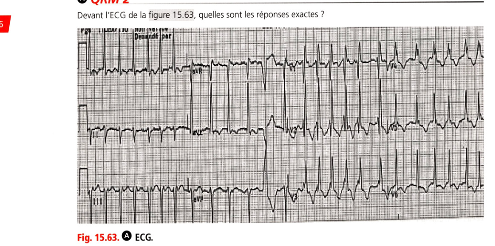
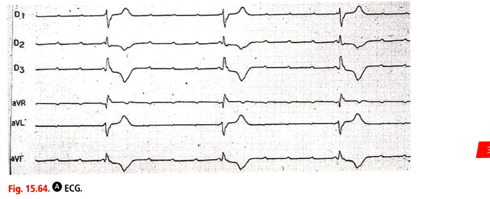

# Entraînement — Item 231 Électrocardiogramme

> Collège CNEC 3e éd. · Chapitre 15 · corrigés p. 584  
> Cours : [231 ECG](../../Cours/III_Rythmologie/231_ECG.md)

Les corrigés sont **sous** chaque question. Faire d'abord sans regarder.

---

## QRM 1

Citez les réponses exactes concernant un ECG de cœur sain :

- A. Une onde Q dans le territoire antéroseptal peut être retrouvée
- B. En rythme sinusal, l'onde P est positive en D2
- C. L'axe normal du cœur est compris entre 0 et −90°
- D. Une onde T négative peut être présente en V1
- E. DI et aVL sont les dérivations rapportées au territoire inférieur du ventricule gauche

**Réponse : B, D**

Cœur sain : en rythme sinusal, l'onde P est positive en D2 (**B**) ; une onde T négative est fréquente en V1 (**D**). Une onde Q dans le territoire antéroseptal doit être considérée comme anormale (**A** faux). L'axe normal est compris entre **−30 et +90°**, pas 0 et −90° (**C** faux). DI et aVL sont les dérivations **latérales hautes**, pas inférieures (**E** faux).

---

## QRM 2

Devant l'ECG de la figure 15.63, quelles sont les réponses exactes ?

- A. Il existe un bloc de branche droit complet
- B. Il existe un bloc de branche gauche complet
- C. Il existe une fibrillation ventriculaire
- D. Il existe une tachycardie jonctionnelle
- E. Il existe un hémibloc antérieur gauche

**Réponse : A, E**

BBD complet : QRS > 120 ms et aspect rSR' en V1 (**A**). HBAG : déviation axiale gauche < −30° et négativité prédominante en D2 (**E**). Les QRS sont tous identiques : ce n'est pas une FV (**C** faux). Le rythme est irrégulier : une FA est probable, pas une tachycardie jonctionnelle (**D** faux). Pas de BBG (**B** faux).

---

## QRM 3

Quelles sont les propositions exactes concernant les caractéristiques ECG de la péricardite ?

- A. Le sus-décalage est diffus, concave vers le haut avec absence de miroir
- B. On peut observer une alternance électrique en cas d'épanchement péricardique abondant
- C. Le microvoltage est constant
- D. Le sous-décalage du segment PQ est très évocateur
- E. Le S1Q3 est évocateur mais inconstant

**Réponse : A, B, D**

Péricardite : ST diffus concave sans miroir (**A**), alternance électrique si épanchement abondant (**B**), sous-décalage PQ très évocateur (**D**). Le microvoltage n'est **pas** constant (**C** faux). Le S1Q3 oriente vers une **embolie pulmonaire**, pas une péricardite (**E** faux).

---

## QRM 4

Une femme de 76 ans est amenée aux urgences parce qu'elle se sent dyspnéique depuis le matin. Son ECG est le suivant (fig. 15.64). Quelles sont les réponses exactes ?

- A. Le diagnostic est un BAV2 Mobitz 2
- B. L'étiologie la plus fréquente est une atteinte dégénérative du tissu de conduction cardiaque
- C. Une dyskaliémie doit être systématiquement recherchée
- D. Le nœud sinusal fonctionne normalement
- E. En absence de cause réversible, il y a une indication à l'implantation d'un stimulateur cardiaque

**Réponse : B, C, D, E**

Il s'agit d'un **BAV du 3e degré** (pas de lien fixe entre les ondes P et les QRS), pas d'un Mobitz 2 (**A** faux). Étiologie dégénérative fréquente (**B**), dyskaliémie à chercher (**C**), nœud sinusal fonctionnel (ondes P présentes et régulières) (**D**), indication de pacemaker si le trouble n'est pas réversible (**E**).

---

## QRM 5

Parmi les affirmations suivantes, quelles sont celles qui sont exactes ?

- A. En présence d'un bloc de branche gauche complet, la durée de QRS est > 110 ms
- B. La mesure de l'intervalle PR se fait du début de l'onde P au début du QRS
- C. Un intervalle > 160 ms définit un bloc atrioventriculaire du 1er degré
- D. L'intervalle QT normal doit être < 0,44 seconde
- E. En présence d'un bloc de branche droit, il existe un aspect rSR' en V1

**Réponse : B, D, E**

PR = début de P → début du QRS (**B**). QT normal < 0,44 s (**D**). BBD = aspect rSR' en V1 (**E**). BBG complet : QRS **> 120 ms**, pas 110 ms (**A** faux). BAV du 1er degré : PR **> 200 ms**, pas 160 ms (**C** faux).
