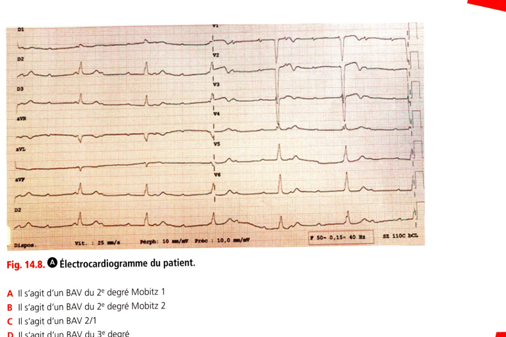
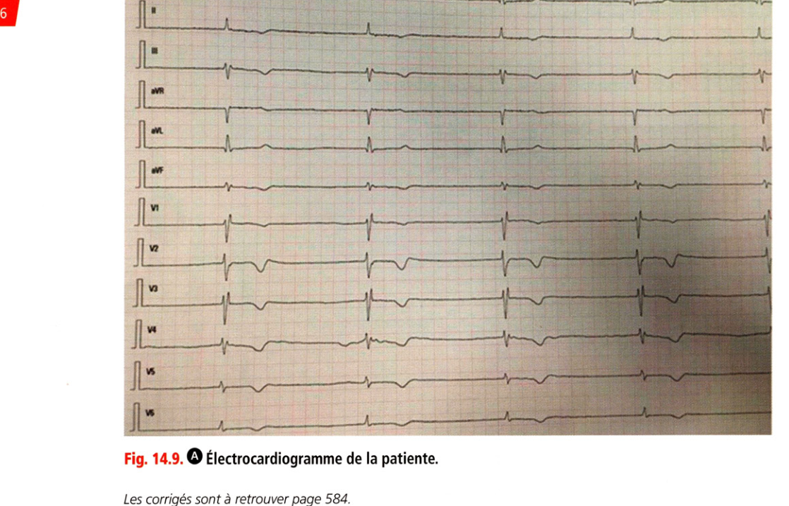

# Entraînement — Item 236 Troubles de la conduction intracardiaque

> Collège CNEC 3e éd. · Chapitre 14 · corrigés p. 584  
> Cours : [236 Troubles de la conduction](../../Cours/III_Rythmologie/236_Troubles_conduction.md)

Les corrigés sont **sous** chaque question. Faire d'abord sans regarder.

---

## QRU 1

Un homme de 81 ans se présente au SAU à la suite d'un malaise sans perte de connaissance. Il décrit également une dyspnée sans douleur thoracique. Il est traité au long cours par amiodarone et apixaban pour une arythmie cardiaque. L'infirmière vous apporte l'ECG suivant (fig. 14.8). Parmi les propositions suivantes, quelle proposition est juste ?

- A. Il s'agit d'un BAV du 2e degré Mobitz 1
- B. Il s'agit d'un BAV du 2e degré Mobitz 2
- C. Il s'agit d'un BAV 2/1
- D. Il s'agit d'un BAV du 3e degré
- E. Il s'agit d'extrasystoles atriales bloquées

**Réponse : D**

Dissociation complète atrioventriculaire (pseudo-espaces PR variables, QRS réguliers) = **BAV du 3e degré**. L'activité atriale est régulière.

---

## QRM 2

Concernant les investigations à faire en urgence, quelles propositions sont justes ?

- A. Il faut doser les D-dimères en urgence
- B. Il faut doser la troponine en urgence
- C. Il faut faire un ionogramme sanguin en urgence
- D. Il faut faire une échographie cardiaque
- E. Il faut faire une coronarographie en urgence

**Réponse : B, C, D**

Devant un BAV 3 : éliminer une cause secondaire (ischémie → troponine, hyperkaliémie → ionogramme). L'ETT recherche une cardiopathie et évalue la FEVG (en pratique après transfert en cardiologie). Les D-dimères n'ont pas d'intérêt (**A** faux). Pas de coronarographie en urgence sans douleur thoracique évocatrice d'IDM ni sus-décalage ST (**E** faux).

---

## QRM 3

La pression artérielle est à 105/65 mmHg. Le patient est conscient et bien orienté. Le bilan biologique est normal, ainsi que l'échographie cardiaque. Quels traitements mettez-vous en place en urgence ?

- A. Accélération de la fréquence cardiaque par isoprénaline en perfusion continue
- B. Accélération de la fréquence cardiaque par atropine en perfusion continue
- C. Mise en place d'une sonde d'entraînement externe
- D. Scope ECG
- E. Suspension de l'apixaban

**Réponse : A, D, E**

BAV relativement bien toléré : isoprotérénol en perfusion continue, scope, arrêt de l'anticoagulant en vue du stimulateur. L'atropine a une demi-vie courte et n'est **pas** utilisée en perfusion continue (**B** faux). Pas de sonde d'entraînement d'emblée si bonne tolérance (geste à risque) (**C** faux).

---

## QRU 4

Aucune cause n'est retrouvée, vous concluez à un BAV dégénératif du sujet âgé. Quel traitement proposez-vous ?

- A. Mise en place d'un stimulateur définitif simple chambre AAI
- B. Mise en place d'un stimulateur définitif simple chambre VVI
- C. Mise en place d'un stimulateur définitif double chambre DDD
- D. Mise en place d'un stimulateur définitif triple chambre
- E. Mise en place d'un défibrillateur définitif double chambre

**Réponse : C**

Indication de stimulateur **double chambre** (synchronisation ventriculaire à la fréquence sinusale). VVI plutôt si FA permanente ; AAI réservé à la dysfonction sinusale pure (souvent remplacé par DDD). Pas de triple chambre si FEVG normale, pas de DAI pour un BAV isolé.

---

## QRM 5

Le patient vous demande les précautions à prendre après la pose du stimulateur et la surveillance du dispositif. Quelles propositions sont justes ?

- A. Un suivi au moins annuel est recommandé
- B. Un suivi par télésurveillance est possible
- C. Les IRM sont contre-indiquées
- D. Un écoulement au niveau de la cicatrice ne doit pas l'inquiéter
- E. Il faut qu'il porte son carnet ou sa carte indiquant les caractéristiques du stimulateur en permanence sur lui

**Réponse : A, B, E**

L'IRM n'est pas contre-indiquée : circuit dédié, programmation « mode IRM » puis reprogrammation (**C** faux). Un écoulement ou une rougeur de cicatrice doit faire consulter (infection de matériel) (**D** faux).

---

## QRM 6

Une patiente de 71 ans, traitée par bisoprolol 10 mg pour une hypertension artérielle, se présente aux urgences pour asthénie. L'ECG est le suivant (fig. 14.9). Quelles propositions sont justes ?

- A. Il s'agit d'une bradycardie sinusale
- B. Il s'agit d'un BAV du 3e degré
- C. Il s'agit d'un bloc sinoatrial du 3e degré
- D. Il faut arrêter le bisoprolol
- E. Il faut implanter un stimulateur cardiaque définitif d'emblée

**Réponse : C, D**

BSA du 3e degré : pas d'ondes P visibles, échappement à QRS fins. Arrêter le bisoprolol et le remplacer par un antihypertenseur non bradycardisant. Stimulateur seulement si pas d'amélioration à l'arrêt du bêtabloquant (**E** faux).
